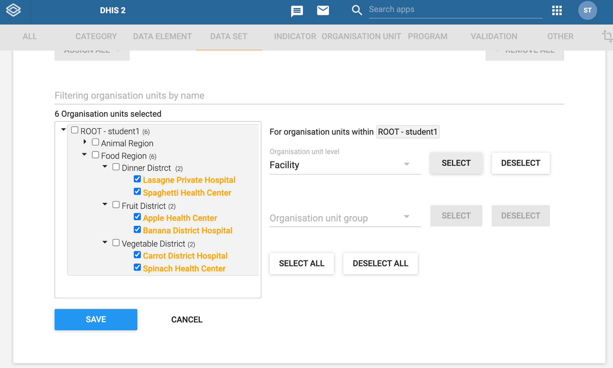

# DHIS2 Customization

## Course details

### Course short description

In this course, you will learn how to use DHIS2’s Maintenance app to create and customize metadata for organisation units, data elements, categories, data sets and indicators. This course belongs to the DHIS2 Fundamentals courses program.

## Course overview

### About this course

In this course, you will learn to plan, design and create DHIS2 metadata used for capturing, storing and analyzing data. Through videos, demonstrations, step-by-step activities, and labs, you will learn how to effectively use the Maintenance app to create organisation unit hierarchies, categories and category options, data elements, data sets and indicators, and how to customize them using best practices.

#### What will I learn?

After completing this course, you’ll be able to:

- Design and create organisation units, organisation unit groups and organisation unit group sets.

- Design and create category options, categories and category combinations to allow for disaggregated data analysis.

- Design and create data elements, data element groups and data element group sets used for storing data and data analysis.

- Design and create sectioned data sets for data capture, and how to configure sharing settings for them.

- Design and create indicators, indicator groups and indicator group sets used to calculate aggregated data for powerful data analysis.

#### Requirements

Before starting this course, you will need to have completed the Introduction to DHIS2 course.

## Pages

### Frequently Asked Questions (FAQs)

#### How long will it take to complete the course?

We estimate the course will take approximately 12 hours to complete. This includes the review of all videos, knowledge checks, activities, pre-lab exercises, quizzes and labs. As this is a self-paced course, note that this may vary slightly for each learner.

#### What are the course prerequisites?

You need to complete the Introduction to DHIS2 course before starting this one.

#### Is there a deadline to complete the course?

No. In the event that an end date is scheduled, you will be notified with enough time to finish your work in the course.

#### How will I be evaluated?

The course consists of 2 types of assessments that contributes to your final grade:

- **Quizzes**: at the end of each module, you will find quizzes composed of multiple choice, multiple response, and/or true or false questions that will assess your comprehension of the main concepts behind DHIS2. You will have between **1 and 3 attempts** to answer each question correctly, and you will need an overall 80% score or higher to pass the quizzes. You will find the number of attempts permitted by question next to the Submit button. The quizzes contribute to **20%** of your final grade.

- **Labs**: in Modules 2 -6 you will be asked to perform specific tasks in a DHIS2 training instance. You will have unlimited attempts to successfully pass the Labs, but to pass, you need to complete all the practical steps correctly. Therefore, the passing grade for each lab is 100%. Labs combined contribute to **80%** of your final grade.

#### When are where will my certificate be available?

Upon completion of the course with a passing grade (85%), your certificate will be available to view and download on the Dashboard, and selecting My courses. You will find the list of courses you are enrolled in, locate the Aggregate Customization Fundamentals and click on the course certificate to download or print it.

#### Do I need to be connected to the course at specific times?

No, all the contents and activities are asynchronous, which means that real-time interactions are not needed to complete the course and all content is available to access when it best suits your schedule

#### What should I do if I experience technical issues?

For technical support, you can contact the course moderators for help by email at **fundamentals-support@dhis2.org**. For a quicker response, **please don’t forget to indicate your username or the email** address you used to register on the platform.

#### Need support?

If you have not found answers in the frequently asked questions section, please send us an email at **fundamentals-support@dhis2.org**

## Module 0 - Start here (40 Mins)

### 0.0 Pre-course Survey (5 mins)

Tell the DHIS2 Academy team more about yourself by filling out our **Pre-course Survey** below.

Your responses to this survey will help the DHIS2 Academy team improve our course offerings by providing valuable insight into our Academy audience. Whether you are just browsing or you are determined to complete the entire course, the more we know about you, **the better we can serve all participants** in this course.

[Link to the pre-course survey](https://docs.google.com/forms/d/e/1FAIpQLSf1QpTa4DKegSiI7KuE63CNNiFuzQ96m5YE4kTqRgu6JB-S9A/viewform?usp=sf_link)

### 0.1 About the course (5 min)

#### Welcome to DHIS2 Aggregate Customization

**Welcome to the DHIS2 Aggregate Customization course**, part of the DHIS2 Fundamentals courses program. In the Introduction to DHIS2 course, you gained an overview of DHIS2 and how it can be used to handle large amounts of data from various sources and formats, generate visualizations, and make informed decisions. In this course, we will explain how to customize your own DHIS2 instance to build your organisation’s unit hierarchy, create data sets that enable data collection, and configure disaggregations and indicators to facilitate data analysis, among other features.

This is the fourth course in the DHIS2 Fundamentals course program, which also contains the **Introduction to DHIS2**, **Aggregate Data Capture and Validation**, **Aggregate Data Analysis**, and **DHIS2 Events Fundamentals** courses. If you are interested in getting a higher level of training on DHIS2, you will find information about Level 1 and Level 2 Academies at the end of the course.

#### What is this course about?

You already know what DHIS2 can do. But, **how can you adapt DHIS2 to meet your context needs? How can you transform paper forms into digital data sets to collect your data? What can you do to enhance data analysis through DHIS2 configuration?** The Aggregate Customization Fundamentals course addresses these questions as you learn to configure your DHIS2 instance using the Maintenance app.

#### What will I learn?

After completing this course, you’ll be able to customize a blank DHIS2 system using the **DHIS2 Maintenance app** to create and edit:

- An organisation unit hierarchy

- Data elements

- Data element disaggregations

- Data sets

- Indicators

- User access and permissions settings

#### What are the course prerequisites?

You need to complete the **Introduction to DHIS2** course before starting this course.

#### Which version of DHIS2 has been used in the course?

All the demonstrations you will find in the course have been made with DHIS2 version 2.36.

#### How is the course structured?

Aggregate Customization Fundamentals has 6 modules of content, an introductory module and a closing and next steps section:

- **Module 0: Start here (40 min)**

- **Module 1: What can be customized in DHIS2 (1 h)**

- **Module 2: Creating organisation units (2h 20 min)**

- **Module 3: Creating categories (1 h 30 min)**

- **Module 4: Creating data elements (1 h 15 min)**

- **Module 5: Creating data sets and configuring sharing settings (2 h 45 min)**

- **Module 6: Creating indicators (2 h 10 min)**

- **Closing and next steps (10 min)**

#### How will I learn?

In each module, you will find the content presented in text and videos of approximately 5-10 minutes in length, followed by **ungraded knowledge check questions** and **step-by-step activities** that will guide your practice within the DHIS2 training instance. At the end of each module you will find the **graded activities** in the form of **quizzes** and **assessment labs**. To get ready for the graded labs, you will find **pre-lab exercises** that will guide you on how to design your DHIS2 instance. You will find more about the types of graded and ungraded activities and the grading policy in the next section.

#### How long will it take to complete the course?

We estimate the course will take approximately **12 hours** to complete. This includes the review of all videos, and completing the ungraded and graded activities. As this is a self-paced course, this may vary slightly for each learner. Based to data from previous students, many of them finish the course in 7-8 hours, while others spend more than 15 hours on it.

#### How do I pass the course?

The course consists of 2 types of graded activities that contribute to your final grade: **quizzes** and **labs**.

- **Quizzes**: At the end of each module you will find a graded quiz that will assess your comprehension of the main concepts of DHIS2 Customization. The quizzes combined contribute to **20% of your final grade**. Each quiz consists of 4 or 5 questions and is worth 3 - 5% of your final grade.

- **Labs**: In the graded labs you will apply the knowledge gained in each module. Labs combined contribute to **80% of your final grade**. There are total of 5 assessment labs throughout the course and each one makes up 16% of your final grade:

  - Module 2: Creating organisation units (16%)

  - Module 3: Creating categories (16%)

  - Module 4: Creating data elements (16%)

  - Module 5: Creating data sets and configuring sharing settings (16%)

  - Module 6: Creating indicators (16%)

You will have unlimited attempts to successfully pass the Labs, but to pass you need to complete all the practical steps correctly, therefore a passing grade for each lab is 100%.

To pass the course, you need to reach the minimum of 85% from both types of graded activities combined.

You will find more details about the different types of learning activities in the section “Ungraded and graded activities”

#### How can I check my progress?

There are two ways to check your progress:

- **Course completion**: Each time you log into the platform, you will see your completion rate, which represents the **percentage of content** you have reviewed so far.

- **Course grade**: Shows your **current score based on the graded activities** you have completed. You can check your course grade by clicking the Progress tab in the upper menu. To get the course certificate, you must reach at least 85% of the course grade.

#### What is the course timeline?

This course is self-paced, which means there are no set deadlines and you can go through it as fast or as slow as you prefer. This course does not currently have a set end date. In the event that an end date is scheduled, you will be notified with enough time to finish your work in the course.

#### How do I get support?

For **technical** support or when you have issues **navigating the platform**, you can contact the course moderators for help by email at **fundamentals-support@dhis2.org**. For a quicker response, please indicate your username or the email address you used to register on the platform.

#### What should I do now?

In the next unit, you will find detailed information about the ungraded and graded activities you will find along the course. We recommend you review that information carefully before moving on to module one. Next, you can go through the “**02. How to navigate the platform**” section if you need a refresher on how to use the DHIS2 Online Academy platform. However, if you feel comfortable navigating the DHIS2 Academy, you are welcome to skip this unit and start with “**03. Introductions.**''

### Ungraded and graded activities

In this course you will find several opportunities to check your understanding using ungraded activities and assess your progress through graded ones.

#### What type of ungraded activities will you find in this course?

There are **three** types of ungraded activities:

- **Knowledge Check Questions**

  - After each video you will find a variety of **ungraded** multiple choice, true or false and drag and drop questions. Once you submit each question, you will be able to read the explanation in case you need to refresh the concepts learned.

  - The purpose of knowledge check questions is to help you check your understanding and reinforce the key concepts covered in the videos. You will have unlimited attempts to respond correctly to each question.

- **Activities**

  - In most of the videos, you will see demonstrations of tasks performed in DHIS2. For you to have the chance to try those tasks, we have created activities as step-by-step guides to show you how to perform the same tasks in our training database. You can also go beyond our instructions and explore the database. This will be your playground to interact with DHIS2. Note that specific instructions on how to access the training databases will be provided before starting each activity.

- **Pre-Lab Exercises**

  - Assignments in which you will reflect on what type of customization you will perform in DHIS2 and how to design those configurations before interacting with the platform. Pre-Lab exercises are needed to successfully complete the graded labs.

#### What type of graded activities will you find in the course?

There are **two** types of graded activities:

- **Module Quizzes**

  - **4 - 5 Multiple choice and true or false questions** you will find at the end of each module. Questions focus on key concepts you need to learn to complete the course successfully. You will have 1 or 3 attempts to submit each question.

- **Module Labs**

  - You will be asked to show your practical skills by interacting with a DHIS2 database specifically created for this course to test your knowledge on customization. You will find a lab at the end of Modules 2 - 6. Labs should be completed in sequence. This means before starting Module 3’s Lab, you first need to successfully complete Module 2’s Lab.

You will find specific instructions before starting any graded and ungraded activity.

#### How do you interact with the questions?

In this course you will find several types of quizzes, but whether they are graded or ungraded, each question will have the following elements:

1. **Number of answers**: Depending on the type of question, you will find two scenarios:

    1. Multiple response questions: These have **square** check boxes and you can select **multiple** answers

    2. Multiple choice questions: These have **circular** check boxes and you can only select **one** answer

2. **Submit button**: By clicking the “Submit”button you can submit your answer and use one attempt

3. **Number of attempts**: You will have 1-3 attempts per question depending on the type of question. You will see how many attempts you will have versus how many attempts you have used

4. **Save option**: When you want to save your answer or progress and come back to it at a later time. To submit your answer you need to select “Submit” and not “Save”

5. **Show answer**: Once you have used your attempts, the button show answer will appear

    1. It will show you the answer to the question and an explanation as to why that is the correct answer. We recommend checking “Show Answer” anytime you're not 100% sure about your answer to the question, even if you answered correctly

### 0.2 Using the Online Academy platform (10 min)

#### Navigating the platform

If you need a refresher on how to navigate the DHIS2 Online Academy, please watch the following video to review the basics of the platform.

#### Video
[Navigating the platform - YouTube](https://youtu.be/QS2EdN8V7wA)

#### The course content page

In this screenshot you can see an overview of the most used navigation options of the platform:

You can also download and review a [short version of the platform navigation guidelines](https://academy.dhis2.org/assets/courseware/v1/d4c3047fcc9bd4a41e526a3490ebd0a1/asset-v1:hisp+GEN-D001-en+2022Q1+type@asset+block/Navigation_guidelines.pdf) to check the key items.

#### Introducing the DHIS2 Community of Practice (CoP) discussion forum

The DHIS2 Community of Practice - or CoP - is a website where the global community of DHIS2 users connect, discuss, share and support each other through discussion forums organized by categories. We have created a specific category for DHIS2 Academy Courses where each of the DHIS2 Fundamentals courses has its own private space. **By taking the Fundamentals courses, you are not only learning about DHIS2 but becoming a part of our global community**, which is why we encourage you to interact with other course participants on the CoP.

Each time we propose a discussion throughout the course, you will find a link to the specific discussion topic on the CoP; however, the topics are in a private space dedicated to the Aggregate Customization Fundamentals course discussion forum. To be able to access the private space, you will need to accept the CoP invitation once and after that you will be able to access all the discussion topics in the course.

[Click to join the discussion forum](https://community.dhis2.org/t/about-the-dhis2-customization-course-discussion-forum/46742)

You only need to use the invitation link once. When you click the link, the CoP website will open in a new browser tab. If you already have a community account and are already signed in from a previous CoP session, you can continue directly to the course discussion forum. If you are not signed in you can sign in using your existing username and password. If you do not already have a community account, you will be prompted to create one.

#### How to navigate to the course discussion forum?

When you create your account, the first interaction with the CoP will be guided by a tour with basic instructions that will help you with using the platform. If you need more guidance, [open this PDF file](https://academy.dhis2.org/assets/courseware/v1/0d146f0e865083731e175a5e61091c1c/asset-v1:hisp+GEN-D004-en+2022_Q2+type@asset+block/General_Forum_Guidelines__intro_to_CoP__-__Aggregate_Customization_Fundamentals_course.pdf) with specific instructions on how to use the Fundamentals courses discussion forums.

Please keep in mind that the use of the discussion forums is an **optional activity** and is not graded.

### 0.3 Introductions (15 min)

#### Meet the DHIS2 Online Academy Team

The DHIS2 Fundamentals course program is the first of the three levels of the DHIS2 Academy curriculum, and aims to introduce essential concepts and build foundational DHIS2 skills through demonstrations, hands-on exercises and labs. Creating and maintaining the materials for the DHIS2 Fundamentals courses is a team effort, drawing on experts in the DHIS2 platform, instructional and media design, and online learning technologies.

The team behind the DHIS2 Fundamentals are:

**Subject matter experts and reviewers**, responsible for defining the curriculum, contents, and course structure, and validating all learning resources:

- Shurajit Dutta

- Megan Kill

- Matthieu Pinard

- Max Krafft

- Rachel Zink

**Production and support team**, responsible for designing and developing all multimedia learning resources and implementing the course in the platform, and providing student support:

- Alejandra Ávila

- Grant Chapman-Clarke

- Simona Sekerova

- Martin Evensen

#### Tell us about you

**Word cloud: Where are you from?**

DHIS2 is a global community of users, and you will get the chance to learn with people from all over the world. Let's create a word cloud and see where your peers come from. In the box below, write the name of your country. Please use full words and avoid using acronyms. After clicking "Save", you will see the word cloud built from the answers from all course participants.

#### Discussion: Introduce youself

Now it's your turn to introduce yourself and tell your peers about you. You can use the following questions to write your post:

- Where are you from?

- Why are you interested in learning about DHIS2?

- What do you want to achieve in the course?

Remember that the course discussion forums take place in the DHIS2 Community of Practice (CoP). If you have already joined the course discussion forum, please click on the following link to join this specific discussion topic:

**Introduce yourself**

[Click to join the discussion](https://community.dhis2.org/t/introduce-yourself-tell-us-about-you/48376)

Note that if you can't see the page (or if you reach an “Oops! That page doesn’t exist or is private.”, please use this invitation link first to gain access to the private course discussion forum

## Module 1 - What can be customized in DHIS2? (1 h)

### Module 1 - What can be customized in DHIS2?

#### What is in this module?

What is DHIS2 customization? What parts of DHIS2 have to be adapted before you can deploy a DHIS2 system in a new context?

#### Learning objectives

By the end of this module, you should be able to:

- Recognize the elements of the DHIS2 system that can be customized to fit different needs

- Familiarize yourself with the example data you will be working with throughout the course

- Identify key DHIS2 design principles applicable to DHIS2 aggregate data model systems

- Identify the main features of the Maintenance application

#### How will you be evaluated?

At the end of the module there is a **graded quiz**. It contributes **3%** to your final grade.

#### How long will this module take?

This module should take about 1 hour to complete.

### 1.1 Introduction to DHIS2 Customization (25 min)

#### Introduction to DHIS2 Customization

This video will give you a short introduction to the concept of DHIS2 customization and explain why it is such a crucial part of implementing a DHIS2 system in various contexts.

#### Video
[Introduction to DHIS2 Customization (YouTube)](https://youtu.be/C2-L7dCzUQE)

#### Knowledge check

**1. DHIS2 as a software platform is solely suitable to be used in a health domain**

    A. True
    B. False

**Feedback:** DHIS2 can be used across various domains. Although it´s most widely used in the health domain, it can be adapted for various use cases ranging from education to logistics support.

**2. DHIS2 is an “out of the box” solution that is ready to use right after installation**

    A. True
    B. False

**Feedback:** DHIS2 requires customization to make it fit the local context and its intended use.

**3. DHIS2 can be configured to support**

    A. Aggregate-level data
    B. Custom web and Android app
    C. Individual-level data
    D. Data entry on desktop computers
    E. Data entry on Android devices

**Feedback:** DHIS2 can be configured to support all of the above: Aggregate and Individual-level data, data entry on both desktop and Android devices, and custom web and Android apps.

### What can be customized in DHIS2?

In the introductory video, you learned that if you need to set up DHIS2 in a new context, be it a country or a more localized implementation, you need to consider how to adapt the system to the specific needs. These needs will differ depending on the program, geographical context and other factors. Let’s review the metadata that need to be customized before you can use a DHIS2 database to collect and analyze data.

#### The organisation unit hierarchy

Setting up the organisation unit hierarchy includes creating the **administrative hierarchy** to reflect where the data are collected. This includes the lowest level, which could be facilities, schools, villages, and geographical boundaries such as districts and regions. **Each country can have a different hierarchy** depending on its administrative structure and the number of levels within this structure.

> Example of a 4-level organisation unit hierarchy

The design of this hierarchy will **determine how the data in the system are aggregated** and the geographical units of analysis available to the users. Additional hierarchies (e.g. parallel administrative boundaries in the health care sector) can be configured using **organisation groups** and **organisation group sets**, but the organisation unit hierarchy is the main means of data aggregation on the geographical dimension.

#### Data elements and their disaggregations

In DHIS2, **data elements represent what is being collected or analyzed**. What kind of data elements need to be set up in the system is, of course, entirely dependent on the domain in which DHIS2 is being used, such as health, education or logistics, and the particular program or project.

When implementing a new DHIS2 database, it is recommended to start with thinking about the outputs that are required such as various program performance metrics that will guide decision making. Data elements should be created to produce those indicators and analytical outcomes.

Together with data elements, you will also have to consider what type of **disaggregation** will apply to them. Some data elements can be disaggregated by age groups or by sex, for example. These disaggregation options are set up independently from any particular data elements, and can be applied and reused on various data elements.

#### Data sets and customized data entry forms

Data entry in DHIS2 is organized in the form of **data sets, which are collections of related data elements** that are **captured with the same frequency** and **gathered by the same organisation units**. Data sets are accessible as data entry forms in the Data Entry app. DHIS2 offers a lot of flexibility when configuring **data entry forms**, and depending on your organization's needs, you can configure **simple** data sets, forms with various **sections** or you can build a fully **customized** form using the built-in HTML editor.

#### Users and user-based access controls/sharing settings

An integral part of security of the data in the database is configuring **user role permissions** and **sharing settings** so that only the people who need to access certain data or applications can do so. For example, you might want to restrict certain users from entering data, but still give them access to view and analyze data. In DHIS2, there are **three levels** of access control: **user roles**, **organization unit assignment** and **sharing settings**.

The first layer, **user roles**, controls **access to various apps** within DHIS2 and specific **administrative functions** within DHIS2.

The second layer, **organization unit assignment**, gives users access to **particular locations** where they need to access the system for either data entry or data viewing.

The third layer, **sharing settings**, provides more granular control and restricts a user or user group’s **access to specific metadata** objects and data in the system.

Combining these three layers of access control provides the benefit of making sure only authorized users:

- Have the ability to use certain applications

- Only have access the locations they need to

- Enter and view data for only the programs and at the level they need to have access to

#### Indicators

An indicator represents a **mathematical formula** that is calculated using items such as data elements, constants and mathematical operators. Indicators are used in data analysis and are a powerful tool for creating more insightful and actionable data visualizations. They can convert raw data in the form of data elements into coverages, disease incidences, mortality rates and much more. Establishing the right indicators will make sure you get the most out of your DHIS2 system.

### 1.2 Orientation to example data

#### Orientation to example data: RMNCAH and malaria health programs

Throughout this course we will be using two common examples of data collected in DHIS2 belonging to two health programs. The first one is a **R**eproductive, **M**aternal, **N**ewborn, **C**hild and **A**dolescent **H**ealth **(RMNCAH) program** and the second one is a **malaria program**.

These data sets are based on real use cases, but with a reduced scope that allows us to focus on learning how to customize them in DHIS2 at a basic level. Let’s introduce the two examples and look at how you will be working with them in this course.

#### RMNCAH program

RMNCAH health services are related to **reproductive**, **maternal**, **newborn**, **child** and **adolescent** health. RMNCAH encompasses health services from pre-pregnancy, pregnancy and birth, to the immediate postnatal period for women and newborns through to childhood and adolescence. RMNCAH focuses on preventive, promotive and treatment interventions throughout the life course. Having good RMNCAH care is an effective way to reduce mortality and improve health outcomes for women, newborns, children and adolescents.

#### How will you be working with the RMNCAH use case in this course?

You will find that we use the RMNCAH program as an example when presenting the capabilities of DHIS2 in the **videos.** Right after watching the videos, you will follow the same steps when completing the **ungraded activities**. Let’s review the RMNCAH data collection form and see more details of the various elements that you can find in it.

This data set contains **three sections**:

> #### 1. Antenatal care

The first section contains **3 data elements** related to antenatal care, which is health care that pregnant women get from health professionals during pregnancy. These data elements represent the number of women that attended an antenatal visit at each stage:

- ***Antenatal care 1st visit***

- ***Antenatal care 4th visit***

- ***Antenatal care 8th or more visit***

> #### 2. Delivery by age

Contains **2 data elements** related to the number of deliveries in the facility:

- ***Delivery in facility*** = the total number of deliveries in the facility (including by caesarean section)

- ***Delivery in facility by caesarean section*** = the number of deliveries by caesarean section only

> #### 3. Family planning

Contains **1 data element** related to contraception use:

- ***Contraception first time users*** = the number of persons who accept any contraceptive method for the first time in their lives

In the ***Delivery by age*** and ***Family planning*** sections you can see the following dissaggregations:

**a. Age disaggregation**

Data in the *Delivery by age* section is disaggregated into three different age groups: 10-14 years, 15-19 years, and 20+ years

**b. Age & Sex disaggregation**

Data in the *Family planning section* is disaggregated both by sex (male and female) and by age (using the same categories as above) so each value entered falls into one of six different fields:

- 10-14 years, Male

- 10-14 years, Female

- 15-19 years, Male

- 15-19 years, Female

- 20+ years, Male

- 20+ years, Female

#### Malaria program

Malaria is an **acute febrile illness** caused by Plasmodium parasites, which are spread to people through the bites of infected mosquitoes.

Despite considerable efforts, **malaria is still one of the most devastating infectious diseases** in the tropics. In Africa, malaria continues to pose a huge public health challenge. In 2019, the World Health Organization estimated 229 million cases and 409,000 deaths due to malaria with over **90% of the deaths occurring in Africa**.

In this course, you will be using a small subset of a data set from a malaria burden reduction program. In burden reduction settings, malaria data collection is focused on **aggregate numbers related to disease surveillance and treatment administered**.

#### How will you be working with the malaria use case in this course?

You will be working with this data set in your **pre-lab exercises** and **graded labs**. Let’s have a look at the data collection form and give some further explanation to some of the elements that might be unfamiliar with if you don’t have a background in public health.

This data set contains **three sections**:

> #### 1. Treatment

Contains **3 data elements** related to the treatment of malaria. Some of the data elements contain specific terminology:

- **Cases treated with any antimalarial medicine (incl. ACT):** ACT means artemisinin-based combination therapy. Fast acting artemisinin-based compounds are combined with a drug from a different class

- **P. Falciparum** **cases treated with single dose primaquine and ACT**: There are 5 parasite species that cause malaria in humans, and 2 of these species–Plasmodium falciparum and Plasmodium vivax–pose the greatest threat. ACT is recommended for the treatment of P. falciparum malaria. Primaquine is a prescription medicine used to prevent relapse of malaria (P. vivax malaria)

- **P. Falciparum cases treated with ACT only**

> #### 2. Cases

Contains **2 data elements** related to malaria cases in patients who seek treatment from a facility:

- ***Suspected malaria cases***: Illness suspected by a health worker to be due to malaria, generally on the basis of the presence of fever with or without other symptoms

- ***Confirmed malaria cases***: Total number of confirmed cases reported as malaria, confirmed with either microscopy or Rapid Diagnostic Test (RDT)

> #### 3. Laboratory

Contains **2 data elements** related to malaria laboratory test result:

- ***Malaria cases tested with microscopy***: Suspected cases tested with malaria microscopy

- ***Malaria cases tested positive with microscopy:*** Cases confirmed as positive with microscopy

In the Cases and Laboratory sections, you can see the following disaggregations:

**a) Age disaggregation**

Cases section is disaggregated into three different age groups: 0-4 years, 5-14 years, and 15+ years.

**b) Age & Sex disaggregation**

Laboratory section is disaggregated both by sex and by age so each value entered falls into one of six different fields:

- 0-4 years, Male
- 0-4 years, Female
- 5-14 years, Male
- 5-14 years, Female
- 15+ years, Male
- 15+ years, Female

### 1.3 DHIS2 design principles ( 10 min)

#### Conceptual design principles of DHIS2

In this video, you will learn about three important DHIS2 design principles applicable to DHIS2 aggregate data model systems. We will review the DHIS2 configuration process and related functionalities, discuss the concept of an integrated data repository and talk about the importance of indicators for analysis.

#### Video

[Conceptual design principles- YouTube link](https://www.youtube.com/watch?v=Mz8jt-F3F-E)

#### Documentation

- [Configuring DHIS2 and the Maintenance app](https://docs.dhis2.org/en/use/user-guides/dhis-core-version-master/configuring-the-system/metadata.html)

- [Indicators](https://docs.dhis2.org/en/use/user-guides/dhis-core-version-master/configuring-the-system/metadata.html#manage_indicator)

#### Knowledge check

**1. You are required to have some programming knowledge to be able to set up metadata such organisation units and data elements**

    A. True
    B. False

**Explanation**: You can do the most basic metadata setup directly in the DHIS2 interface with no need of programming skills. DHIS2 has a specific app for metadata configuration called Maintenance.

**2. In DHIS2, metadata is only configured through the user interface**

    A. True
    B. False

**Explanation:** While it is possible to do most of the simple metadata configuration via the user interface, there are some drawbacks to doing this at a large scale when adding hundreds of metadata items. At this scale, you would rather set up the metadata via mass import functionality rather than adding them individually.

**3. From which sources can data be incorporated to be stored in DHIS2?**

    A. Data from health programs directly collected via DHIS2 collection tools
    B. Data from external sources such as census data or population surveys
    C. Data imported from other systems

**Explanation:** DHIS2 supports a flexible data model that promotes different data sources to be integrated into one single data repository. DHIS2 has collection tools integrated in the system, but you can also bring in data from external sources such as other systems or population surveys.

**4. What is an indicator in DHIS2?**

    A. Raw data that are entered into DHIS2
    B. Data imported from other systems
    C. Formula-based calculated values such as coverages (%), incidence rates, etc.

**Explanation:** In DHIS2 we distinguish between data elements, which describe the raw data, such as the counts being collected, and indicators, which are formula-based and describe calculated values, such as coverage or incidence rates that are used for data analysis.

### 1.4 Maintenance app (5 min)

#### Introduction to the Maintenance app

In the previous video about the DHIS2 design principles, you learned that most metadata in DHIS2 can be edited directly through the DHIS2 user interface. In this video, you will be introduced to the **Maintenance application**, which is one of the core applications of DHIS2, and **a key tool when it comes to the customization of the system**. You will use the Maintenance application throughout this course to create and edit various items such as organisation units, data elements and data sets.

#### Video
[Introduction to the Maintenance app - YouTube link](https://youtu.be/ETB620ZlAU4)

#### Documentation

[Maintenance app](https://docs.dhis2.org/en/use/user-guides/dhis-core-version-master/configuring-the-system/metadata.html#about_maintenance_app)

#### Knowledge check

**1. What can you do in the Maintenance app?**

    A. Edit existing metadata
    B. Download metadata
    C. Create new metadata items such as Data Elements or Organisation Units
    D. Filter items using Name, ID or Code
    E. Create a large amount of metadata items at once

**Explanation**: The Maintenance app allows users to filter, create, edit or download metadata items such as data elements and organisation units. The Maintenance app does not allow for the creation of large amounts of metadata at once.

### 1.5 Module Quiz (5 min)

#### Module 1 Quiz

This is a graded quiz worth **3%** of your final grade. You will find 4 multiple choice, and true or false questions. You will have between **1 and 3 attempts** to answer each question correctly. You will find the number of attempts permitted by question next to the Submit button.

If you want to save your current response without submitting it for grading yet, select the "save" button. This allows you to come back later and resume the attempt.

**1. DHIS2 can be configured to support**

    A. Aggregate-level data
    B. Individual-level data
    C. Data entry on desktop computers
    D. Data entry on Android devices

**Explanation:** DHIS2 can be configured to support all of the above: aggregate and individual-level data, and data entry on both desktop and Android devices.

**2. In DHIS2, metadata is only configured through the user interface**

    A. True
    B. False

**Feedback:** While it is possible to do most of the simple metadata configuration via the user interface, there are some drawbacks to doing this at a large scale with adding hundreds of metadata items. At this scale, you would rather set up the metadata via mass import functionality rather than adding them individually.

**3. What is an indicator in DHIS2?**

    A. Raw data that are entered into DHIS2
    B. Data imported from other systems
    C. Formula-based calculated values such as coverages (%), incidence rates, etc.

**Explanation:** In DHIS2 we distinguish between data elements, which describe the raw data, such as the counts being collected, and indicators, which are formula-based and describe calculated values, such as coverage or incidence rates that are used for data analysis.

**4. What can you do in the Maintenance app?**

    A. Edit existing metadata
    B. Download metadata
    C. Create new metadata items such as data elements or organisation units
    D. Filter items using name, ID or code
    E. Create a large amount of metadata items at once

**Explanation:** The Maintenance app allows users to filter, create, edit or download metadata items such as data elements and organisation units. The Maintenance app does not allow for the creation of large amounts of metadata at once.

### 1.6 Module Summary (10 min)

#### Module Summary

You have now reached the end of the first module in the DHIS2 Customization course. In this module, you have learned that:

- One of the core features of DHIS2 is its **customizability** which makes it a flexible system that is used across different domains

- The majority of implementations use it as a **health information system** but other domains include

  - Education sector
  - Logistics management
  - Human resources
  - Nutrition and sanitation programs and more

- DHIS2 supports both **aggregate and individual-level data models**
- You can integrate DHIS2 with other platforms through **open APIs**
- Before any implementation, **you need to configure the system's metadata** and structure including:

  - An **organisation unit hierarchy** (Facilities and geographical boundaries)
  - **Data elements**
  - **Indicators**
  - **Data sets** and customized **data entry forms**
  - **Users**, and
  - **User-based access controls**

- DHIS2 has several functionalities that allow users to **modify its configuration directly through the user interface** using the Maintenance app

- For importing large amounts of metadata at once, DHIS2 has a mass import functionality
- DHIS2 has the ability to act as a **central data warehouse** thanks to its flexible data model which means that data from different sources can be imported and stored there
- DHIS2 supports **indicator driven analysis**

#### Discussion forum

As we are reaching the end of the module, let's take some time to reflect on what you've learned and share your experience with DHIS2.

To do it, if you have already joined the course discussion forum, please click on the following link to join this specific discussion topic:

**What Can be Customized in DHIS2?**

[Click to join the discussion](https://community.dhis2.org/t/module-1-what-can-be-customized-in-dhis2/48377)

Note that if you can't see the page (or if you reach an “Oops! That page doesn’t exist or is private.”, please use this invitation link first to gain access to the private course discussion forum

In this module you learned about the various ways DHIS2 can be adapted to be used across various domains and programs.

For the first module discussion, **tell us if you are currently involved or going to be involved in a project that uses DHIS2?** **What is the purpose of the project and do you think DHIS2 will help you to achieve it? What are the DHIS2 tools that you will use and what aspects of the system have to be configured? Are there any challenges?**

Please feel free to share your experience, read your peers’ responses and reflect on what you have learned so far in the course.

Even though this is an optional activity, we strongly recommend you take some time to think about your new knowledge, read what other course participants think, and make connections with your own prior experience and current learning needs. This will help you reinforce what you have learned and prepare for the next module.

Once you are done on the CoP, click the link in the top comment to be redirected back to the course to fill out the module feedback survey.

If you are not joining the discussion on this module, simply click the next button below to continue to the survey.

### 1.6 Feedback Survey (2 min)

#### Module 1 Feedback Survey

Once you are done with the module, please take 2 or 3 minutes to complete this feedback survey. Your careful response will have a real impact on how courses like this are run. Thank you!

Link to survey: [https://docs.google.com/forms/d/e/1FAIpQLScZnaGTOkTzqrGkcUnRjk-98ZMvusPOAFy9b6VCdGzir795NA/viewform?usp=sf_link](https://docs.google.com/forms/d/e/1FAIpQLScZnaGTOkTzqrGkcUnRjk-98ZMvusPOAFy9b6VCdGzir795NA/viewform?usp=sf_link)

## Module 2 - Creating organisation units (2 h 20 min)

### 2.0 Overview of the module (3 min)

#### What is in this module?

In the previous module, you learned about all the pieces you need to customize to set up a new DHIS2 system. One of those important pieces are **organisation units**. Organisation units **determine the geographical context for the data**. They can be at the level of facilities (where the data values are collected) or larger boundaries such as districts and regions. As you know, the various levels determine where data are captured and how they can be aggregated, for example, from facility data to district data and above.

#### Learning objectives

By the end of this module, you should be able to:

- Create a three-level organisation unit hierarchy with facilities, districts and regions.

- Group facilities into organisation unit groups and group sets based on criteria such as type of facility and ownership status

#### How will you be evaluated?

At the end of the module, you will find 2 graded activities:

- **Quiz**: 4 multiple choice, or true or false questions. You will have between 1 and 3 attempts to answer each question correctly. You will find the number of attempts permitted by question next to the submit button. This contributes to **3%** of your final grade

- **Lab**: You will be asked to perform specific tasks in our DHIS2 training instance. To pass the lab, you will need to correctly perform all the steps. This lab contributes to **16%** of your final grade

#### How long will this module take?

This module should take about **2 hours and 20 minutes** to complete.

### 2.1 Orientation to the Training databases (25 min)

#### Orientation to the Training databases

At the DHIS2 Academy we believe in learning by doing. To master new DHIS2 skills, it is important that you put into practice what you learn. You can engage with the system and try out what you have learned in a DHIS2 training environment that we have set up for you.

In this course, you will be using **4 different training databases,** or DHIS2 instances, depending on which module you are in and whether it is:

1. A **sandbox database** for your ungraded activities and exploration

    1. Customization Practice
    2. Indicators Practice

2. An **assessment database** used for graded labs

    1. Customization Lab
    2. Indicators Lab

As you saw in Module 0, we will be using two use cases along the course: RMNCAH and malaria. Practice databases use RMNCAH as an example, while graded labs use malaria for the exercises.

Look at the table below for an overview of the databases, use cases and modules:

| Modules   | Ungraded Activities & Sandbox / RMNCAH  | Graded Labs / Malaria  |
|---------- |---------------------------------------- |----------------------- |
| **Module 2**  | Customization Practice                  | Customization Lab      |
| **Module 3**  | Customization Practice                  | Customization Lab      |
| **Module 4**  | Customization Practice                  | Customization Lab      |
| **Module 5**  | Customization Practice                  | Customization Lab      |
| **Module 6**  | Indicators Practice                     | Indicators Lab         |

### What are the differences between databases?

| Customization Practice                                                                     | Customization Lab                                                               |
|------------------------------------------------------------------------------------------- |---------------------------------------------------------------------------------|
| Used for **ungraded activities**                                                           | Used for **graded labs** only                                                   |
| Can be used as a **sandbox**,you can explore and create any metadata that you would like   | You should only create the metadata that you are asked in the lab instructions  |
| Uses **metadata of the RMNCAH example**                                                    | Uses **metadata of the malaria** example                                        |
| Used in **Modules 2 to 5**                                                                 |                                                                                 |

| Indicators Practice                                                                      | Indicators Lab                                                                 |
| ---------------------------------------------------------------------------------------- | ------------------------------------------------------------------------------ |
| Used for **ungraded activities**                                                         | Used for **graded labs** only                                                  |
| Can be used as a **sandbox**,you can explore and create any metadata that you would like | You should only create the metadata that you are asked in the lab instructions |
| Uses **metadata of the RMNCAH example**                                                  | Uses **metadata of the malaria** example                                       |
| Used in **Module 6**                                                                     |                                                                                |
| Has **indicator specific configuration**, such as access to the **Data Visualizer app** to verify if indicators were built correctly    |                                                                                |

### How can I make sure which database to use when?

For each activity or graded lab, **you will find a link to the correct database**.

When you click on the link, it will open the sign in page in a new window in your browser. **The name of the database you are currently in will be indicated in the upper left corner and under the DHIS2 Academy logo**. To log in, you will need to create an account and use your sign in details. You will create the accounts for the training databases in the next section.

#### Summary

In Modules 2-5, you will be using Customization Practice and Customization Lab databases. The difference is that your **practice database** is your playground where you can **perform ungraded activities** or you can engage in your own exploration. If you want an overview of what a complete data set looks like in DHIS2, you can use the credentials provided on the login page to access the complete RMNCAH database. Please note that you will only be able to view these data, not interact with the platform. To create metadata and complete the ungraded activities, you must log in with your own credentials.

The **lab database is strictly for the graded labs**. Unlike in the practice database, when interacting with the lab database, **you need to adhere to the instructions exactly**, and only create the metadata we ask you to create for the grading scripts to work well.

In Module 6 there is a separate database for practice and labs since you will create indicators and access analytic applications.

#### Important differences between DHIS2 Training databases and real DHIS2 systems

#### Practice databases

The DHIS2 Customization Practice and Indicator databases are essentially DHIS2 systems that have been preconfigured to create an optimal environment for your practice and exploration in this course. DHIS2 Customization Practice already has some existing data elements that belong to the RMNCAH program and are used as references in demonstrations and activities.

One of the basic features of those databases is that the system is split up into two different views: the **learner** view and the **administrator** view. You, as a learner, will only have access to the metadata used in the examples and any additional items that you create, but **you will not see any metadata created by other course participants**. However, course administrators will have access to metadata created by all course participants. If you need support or have questions about exercises and assignments, the course administrators can view your work and help you.

You will see that **in both databases there are already some preexisting metadata** that you can use for your reference; you can view their names and properties.

### Lab databases

Lab databases are very similar in function to the practice databases except they are used for graded labs. We ask you to only use them to create the metadata per instructions **since there is an automatic script that will check your progress and give you a grade at the end of the lab.** If you create more or different metadata than you were asked to do, it might result in you not getting a passing result.

### Metadata naming conventions (Practice and Lab databases)

You and all of the course participants will be creating your metadata in the same practice database, performing the same activities, and creating the same metadata, even if you won't be able to see or access the metadata that other students have created. In DHIS2, **metadata must have a unique name**. Since all learners will be creating the same metadata and following the same naming conventions, we ask you to **add your initials as a prefix to any metadata you create.**

For example, if I want to recreate the data element RMNCAH ANC 1st visit, the system would give me the error, “This field requires a unique value”. This means that another user has already created a data element with the same name.

That is why we ask you to **use your initials when creating any metadata items** to make the name unique in the system. In this example, if your name starts with ‘S’, your middle name with ‘N’, and last name with ‘D’ it will be called “**SND_RMNCAH - ANC 1st visit**”. If you don’t have a middle name, you can use the first two letters of your family name instead as we recommend using a three letter prefix convention.

#### To recap

The DHIS2 Customization Practice database provides you with a dedicated space to create and modify metadata. You will only see the items you have created yourself or those that the course administrators have shared with you, and will not interact with items other participants have made.

Because there will be many other learners creating metadata in the same system, it's important to consider the naming of your items. You must add your initials or another unique identifier as a prefix to all metadata items you create.

#### Knowledge check

**1. By default, any metadata object that you create in DHIS2 Customization Practice will be private and only you or the course administrators will be able to see it**

    A. True
    B. False

**Explanation**: DHIS2 Customization Practice database is split up in two different views: the learner view and the administrator view. You as a learner will only have access to the example metadata and any additional items that you create. Course administrators, on the other hand, will be able to access everything in the system including the various metadata that learners create in case they need support or have questions about exercises and assignments. None of the learners will be able see or access each other´s metadata.

**2. The Customization Practice database is a blank training DHIS2 system with no metadata**

    A. True
    B. False

**Explanation**: DHIS2 Customization Practice already has some existing data elements that belong to the RMNCAH program and are used as references in demonstrations and activities.

**3. You can have multiple data elements in the system with the same name**

    A. True
    B. False

**Explanation**: Each data element in the DHIS2 system has to have a unique name.

**4. When you create metadata objects in the Customization Practice database, you need to make them unique by adding a prefix, such as your initials to the name of metadata items**

    A. True
    B. False

**Explanation**: Since each data element in the DHIS2 system has to have a unique name and there are many learners using the training database to create the name items, it is important to add a unique identifier to each data element that you create, such as a prefix with your initials.

#### Creating your user account for the customization course training databases

To be able to sign in and use the various databases **you will need to create an account first.** You have to create **a separate account for each training instance**. We recommend you spend some time now and create the 4 accounts before moving on.

***Note**: We will use the email address you provided when you registered on the DHIS2 Online Academy to create the accounts for you. **Please do not change this email address** as it will be used as your username for all the training databases.*

To create each account, follow the steps below:

1. In the table below, click the link next to the database you would like to request an account for

2. Please give the system a couple of seconds to respond; **DO NOT keep clicking the button** several times in a row

| Database Name          | Acccount Request Link                   |
|------------------------|-----------------------------------------|
| Customization Practice | Request account - Customization Practice|
| Customization Lab      | Request account - Customization Lab     |
| Indicators Practice    | Request account - Indicators Practice   |
| Indicators Lab         | Request account - Indicators Lab        |

1. After 5-10 seconds you should receive the following notification in your browser window:

1. Click on ‘OK’ to close this notification

2. Check your email inbox. You will receive one email with the subject containing the name of the system you have signed up for.

The email contents for each system will be similar, with any system identifiers being based on the system you are signing up for.

1. If you don’t find this email in your primary inbox, please check the Promotion tab or the Spam/Junk folder in case it was filtered out. Alternatively, you can search for the the emails using the tags Customization Practice, Customization Lab, Indicators Practice, Indicators Lab

2. Use the information in the the email to create your account in DHIS2 by selecting the link within the mail. After you select the link, fill in the details for your user account.

**Your username AND email** will automatically be set to the same as **your registered email address** for DHIS2 Online Academy. Please make sure your email address field uses the same email address so you can more easily remember your username when logging in later.

You will also need to enter a **first name** and **last name**.

- When creating your **password**, consider making one you can remember, while making sure it's **at least 8 characters** long, with **one or more uppercase letters, a number and a special character**

- Once you have entered the password into both the password boxes, click “**Create**”. This will take you to DHIS2 logged in to your new user account

- We recommend you to use **the same password for all training databases** to make it easier to access them

If you have any questions or difficulty in creating your DHIS2 accounts, don’t hesitate to contact us by email **fundamentals-support@dhis2.org**.

1. Go back to the first instruction and repeat the process until you have created your accounts for all four databases.

**Note**: You will have access to different apps in the customization and indicators databases respectively.

In the *Customization Practice and Customization Lab systems* you will have access to the following apps:

In the *Indicators Practice and Indicators Lab systems* you will have access to the following apps:

You can confirm this after creating your account and logging in to these systems.

#### Organisation units in the DHIS2 training databases

When you register as a new user in the **DHIS2 Customization Lab and DHIS2 Customization Practice systems**, an organisation unit is automatically created for you called "Trainingland - *your email*." Only you and the course administrators can interact with this organisation unit.

When you create additional organisation units as part of your own activities, they will be under the umbrella of this root level unit.

This means that every user in the **DHIS2 Customization Lab and DHIS2 Customization Practice systems** has their own separate organisation unit hierarchy assigned to them in the system.

**_Note: This does not apply to the Indicators Practice and Indicators Lab systems_**

#### Knowledge check

**1. In the DHIS2 training databases, each participant will have their own organisation unit hierarchy**

    A. True
    B. False

**Explanation**: When you register as a new user in the DHIS2 training databases, an organisation unit is automatically created for you called “TRAININGLAND - *your email*.” Only you can see and have access to this organisation unit. When you create additional organisation units, they will be the children of your private root organisation unit, which assures that the whole organisation unit hierarchy that you create will be private and only accessible to you and the course administrators.

### 2.2 Orientation to organisation units

#### Orientation to organisation units

In the Introduction to DHIS2 course, you learned about the **Where** dimension of DHIS2: organisation units. Organisation units represent the geographical dimension of the data. They define where data are **captured** and how they can be **aggregated** from a geographical/organizational perspective, such as aggregation from facility data to regional data, and from regional to national levels. You also learned about alternative ways of grouping facilities using **organisation unit groups** and **organisation unit group sets**, which are useful in data analysis.

#### Key concepts

- Organisation unit hierarchy

- Organisation unit groups

- Organisation unit group sets

#### Organisation unit hierarchy

In DHIS2, organisation units form a **hierarchical tree** that has several levels. Generally, the lowest level is comprised of locations where data collection occurs. Most often these are facilities, schools or villages. The higher level represents various larger geographical and administrative areas.

During the aggregation process, data are added up from the lower organisation unit levels to the higher ones. DHIS2 performs these calculations automatically. The number of levels in a hierarchy and the level names depend on each implementation’s context.

### Organisation unit groups and group sets

In this example above, health facilities are classified and clustered by the range of services they provide, into various **organisation unit groups**, such as Dispensary, Health Center, Specialist Hospital, and Referral Hospital.

The **organisation unit group set** is the name for the umbrella classification that these individual groups fall under. In this example, the group set is **Facility Type**, a category that contains the organisation unit groups, which in turn each contain specific facilities.

To refresh your knowledge of concepts related to organisation units, we suggest you refer back to the organisation unit video from the Introduction to DHIS2 course:

[Introduction to DHIS2 – Where: Organisation Unit hierarchies](https://youtu.be/M23Eu1SX44E)

#### Organisation units: Design stage

Before you start creating your metadata in DHIS2, it is important to know what metadata you will be creating and their parameters. This is the **design or conceptual stage of configuration**, which is usually done outside of DHIS2 and before interacting with the database.

This conceptual stage of creating organisation units includes **designing the hierarchy** so you have a good overview of the parent-child relationships between the organisation units you are creating. You also need to gather all identifiable information about each organisation unit in the system, such as names, codes and descriptions. Lastly, you need to decide on the criteria for how to best group your organisation units into groups and group sets, to suit your analytical needs.

In the following videos, you will see how we create metadata using the RMNCAH use case we explained in Module 0. This means we will not cover the design phase in the videos, only the interaction with the Maintenance app. However, you will have the chance to reflect on the design of your DHIS2 instance before completing the graded lab (at the end of the module) by performing a pre-lab exercise on the malaria use case.

For the design stage, it is best practice to use a document, such as a configuration spreadsheet, where this information is stored externally to DHIS2. When creating these metadata, you can copy and paste the data from the spreadsheet to the different fields of the Maintenance app.

To start familiarizing yourself with the spreadsheet, you can check the one we created for the demos that relate to the [RMNCAH use case.](https://docs.google.com/spreadsheets/d/1-xQTsnnfi9S8UzUtCVq8MKAL6PQ88V15LBwoOrktKOg/edit#gid=1271273578)

### 2.3 Creating an organisation unit hierarchy (40 min)

#### Creating an organisation unit hierarchy

This series of videos will talk about organisation units. You have learned that organisation units form the backbone of our data collection as they assist in attaching geographical locations to each data item that is stored in the system. In this video, you will learn how to create a simple organisation unit hierarchy in DHIS2: you will create a region, a district and a facility.

##### Creating an organisation unit hierarchy

[Link to the documentation site](https://docs.dhis2.org/en/use/user-guides/dhis-core-version-master/configuring-the-system/metadata.html#manage_organisation_unit)

#### Video
[Creating an organisation unit hierarchy (YouTube)](https://youtu.be/UDwmYw0W9gg)

##### Knowledge check

**1. When you create organisation units that have geographical boundaries, such as provinces, regions or districts, you don't need to fill in any opening date. This only applies to facilities**

    A. True
    B. False

**Explanation**: You still need to put in the opening date, as it is a required field. This field is required because it opens the organisation unit for data entry. No data entry can be done prior to this date.

**2. You can fill in the point coordinates if you would like the districts and provinces to be displayed on the map**

    A. True
    B. False

**Explanation**: You can only input coordinates for specific points and locations, such as facilities. For areas such as districts and provinces you need to define their boundaries using polygons and import those through a different process.

**3. Arrange the steps for creating an organisation unit in the correct order**

    A. Open the Maintenance application
    B. Navigate to the organisation unit management page
    C. In the organisation unit hierarchy select the parent organisation unit
    D. Click on the blue plus (+) sign on the bottom right of the screen
    E. Fill in the name and other information in the organisation unit creation form
    F. Click ‘Save’

**Feedback**: The correct order to creating an organisation unit is: 1. Open the Maintenance Application; 2. Navigate to the Organisation Unit management page; 3. In the organisation unit hierarchy select the parent organisation unit; 4. Click on the blue plus sign button on the bottom left of the screen; 5. Fill in the Name and other information in the organisation unit creation form; 6. Click on “Save”

#### Activity - Creating an organisation unit hierarchy

>[DHIS2 Customization Practice](https://academy.aggregate.dhis2.org/dsc_rmncah/dhis-web-commons/security/login.action) - [Documentation](https://docs.dhis2.org/en/use/user-guides/dhis-core-version-master/configuring-the-system/metadata.html#manage_organisation_unit) - [Printable Version](https://academy.dhis2.org/assets/courseware/v1/604efdfa5303b3189f9b217020c9fcd7/asset-v1:hisp+GEN-D004-en+2022_Q2+type@asset+block/CreatingAnOrganisationUnitHierarchy.pdf)

*Please use the account details you have created for DHIS2 Customization practice training database in order to log in.*

#### Overview

In this activity, you will create a simple organisation unit hierarchy in DHIS2. Within the hierarchy, you will create a region, a district and two facilities that belong to the district .

*Note: When you create metadata in your practice database remember to use **your initials** in order to give your metadata a **unique name** in the system. For example, if you want to create a **Food region** and your name starts with ‘S’, your middle name with ‘N’ and last name with ‘D’ it will be called **SND_Food Region**. If you don’t have a middle name, you can use the first two letters of your family name instead as we recommend using a three letter prefix convention.*

#### Instructions

**Create a region**

1. Sign in to your account in **DHIS2 Customization Practice**

2. Open the **Maintenance application**

3. Navigate to the **organisation unit management page**

4. Make sure your **root organisation unit is selected (highlighted in orange)** and click on the **blue plus (+) sign** on the bottom right

5. Fill in the fields:

    1. **Name:** *Your initials_*Food Region

    2. **Short name:** *Your initials_*Food Region

    3. **Opening date**: April 1st 2022

    4. **Code:** *Your initials_*FR02

6. Click **‘Save’**

**Create a district within Food Region**

1. Navigate back to the **organisation unit management page**

2. Make sure your parent organisation unit (*Your initials_*Food Region) is selected and click on the **blue plus (+) sign** on the bottom right

> 

1. Fill in the fields:

    1. **Name:** *Your initials_*Vegetable District

    2. **Short name:** *Your initials_*Vegetable District

    3. **Opening date:** April 1st 2022

    4. **Code:** *Your initials_*VD03

2. Click **‘Save’**

**Create facilities within the Vegetable District**

3. Navigate to the **organisation unit management page**

4. Make sure your parent organisation unit (Vegetable District) is selected and click on the **blue plus (+) sign** on the bottom right

5. Fill in the fields:

    1. **Name:** *Your initials_*Carrot District Hospital

    2. **Short name:** *Your initials_*Carrot District Hospital

    3. **Opening date:** April 1st 2022

    4. **Code:** *Your initials_*CDH04

6. Click **‘Save’**

7. Repeat the process and create another facility in the *Your initials*_Vegetable District

8. Make sure your parent organisation unit (*Your initials*_Vegetable District) is selected and click on the **blue plus (+) sign** on the bottom right

9. Fill in the fields:

    1. **Name:** *Your initials_*Spinach Health Center

    2. **Short name:** *Your initials_*Spinach Health Center

    3. **Opening date:** April 1st 2022

    4. **Code:** *Your initials_*SHC02

10. Click **‘Save’**

**(Optional) Create additional facilities**

You can use the [**configuration spreadsheet**](https://docs.google.com/spreadsheets/d/1J-faJkcM6HMt53-KdFzp7gZNC9G3oA-TI03TlY_Q368/edit#gid=1271273578) to create additional organisation units in the *Your initials*_Food Region to complete your organisation unit hierarchy.

#### Creating organization unit groups

Previously, you learned how to add organisation units through the Maintenance app in DHIS2. Organisation units can be bundled into **organisation unit groups** and these groups can be further organised into **organisation unit group sets**. This is used to create an alternative organisational hierarchy, usually applied to the level of facilities. Groups and group sets can be understood as a flexible tool to add more categorization to organisation units, for example, based on the type or form of ownership of the facilities. In this video, you will learn how to create organisation unit groups.

### Video
Creating organisation unit groups (YouTube)](https://youtu.be/g43vK5m2mwM)

##### Documentation

[Creating organisation units](https://docs.dhis2.org/en/use/user-guides/dhis-core-version-master/configuring-the-system/metadata.html#create_organisation_unit_group)
[Creating organisation unit group sets](https://docs.dhis2.org/en/use/user-guides/dhis-core-version-master/configuring-the-system/metadata.html#create_organisation_unit_group_set)

#### Knowledge check

**1. Within DHIS2, the organisation unit group options are limited to facility type, ownership and location**

    A. True
    B. False

**Explanation**: In DHIS2, you are free to create any type of organisation unit group, but facility and type of ownership are among the most commonly used.

**2. You can add a symbol to the organisation unit group and this will be reflected in the Maps Application when you display the Facilities layer**

    A. True
    B. False

**Explanation**: That is correct. You can associate a symbol to any organisation unit group and the facilities within this group will be displayed by symbol on the maps within the Maps application.

**3. What are the steps to create an organisation unit group? Drag the items above and drop them in the correct order below. When you are done, select the Save button.**

    A. Open the Maintenance app
    B. Select the "Organisation unit" tab
    C. Select “Organisation unit group”
    D. Select the blue plus (+) sign to add an organisation unit group
    E. Complete the name, short name and code fields
    F. Select a symbol
    G. Select the organisation units to include in the organisation unit group

**Explanation**: To create an organisation unit group, you first need to open the Maintenance app, then select the "organisation unit" tab, followed by “Organisation unit group”. Then click the blue plus (+) sign to create an organisation unit group, and complete the name, short name and code fields. Select a symbol and lastly, select the organisation units to be included in the organisation unit group.

#### Activity - Creating organisation unit groups

[DHIS2 Customization Database](https://academy.aggregate.dhis2.org/dsc_rmncah/dhis-web-commons/security/login.action) - [Documentation](https://docs.dhis2.org/en/use/user-guides/dhis-core-version-master/configuring-the-system/metadata.html#create_organisation_unit_group) - [Printable Version](https://academy.dhis2.org/assets/courseware/v1/25edf5c3f67fee1c688ac9b0d0d69c0a/asset-v1:hisp+GEN-D004-en+2022_Q2+type@asset+block/CreatingOrganisationUnitGroups.pdf)

*Please use the account details you have created for DHIS2 Customization practice training database in order to log in.*

#### Overview

In this activity, you will create two organisation unit groups, Hospitals and Health Centers, and add the facilities you have created previously to each of them.

To be able to complete this exercise, you need to have completed the previous activity and created at least two facilities (one hospital and one health center). If you haven’t created them and need step-by-step instructions, go back to the previous activity.

#### Instructions

**Create the organisation unit group: *Your initials*_Hospitals**

1. Sign in to your account in the **DHIS2 Customization Practice**

2. Open the **Maintenance application**

3. Select the **Organisation unit** tab in the upper menu

4. Navigate to the **organisation unit group management page** on the left menu

5. Click on the **blue plus (+) sign** on the bottom right

6. Fill in the fields:

    1. **Name**: *Your initials*_Hospitals

    2. **Code**: *Your initials*_HOSP

    3. **Organisation units**: Add in one or more hospital facilities you have created

        1. To add a facility, you can navigate down the organisation unit hierarchy to the facility level and select organisation units that are hospitals

        2. Or search for hospital in the search field to filter out all facilities with the hospital in their name and then select them

7. Click **‘Save’**

**Create the organisation unit group: *Your initials*_Health Centers**

1. Open the **Maintenance application**

2. Navigate to the **organisation unit group management page**

3. Click on the **blue plus (+) sign** on the bottom right

4. Fill in the fields:

    1. **Name**: *Your initials*_Health Centers

    2. **Code**: *Your initials*_HC

    3. **Organisation units**: Add in one or more health center facilities you have created

*Note: Make sure that you add a different organisation unit to the ones that you added to the Hospital organisation group. The same facility cannot be Hospital and Health Center simultaneously. The same organisation unit should be only included in one group within the same group set.*

5. Click **‘Save’**

#### Creating organisation unit group sets

Once you have created your organisation units and grouped them using organisation unit groups, you can take on the last step, creating organisation unit group sets. The **group sets can provide additional information and dimensionality to the data analysis** as data is easily filtered, organised or aggregated by groups within a group set. In this video, you will learn how to create organisation unit group sets by combining multiple different organisation unit groups.

#### Documentation

- [OU Group Set](https://docs.dhis2.org/en/use/user-guides/dhis-core-version-master/configuring-the-system/metadata.html#create_organisation_unit_group_set)

#### Video
[Creating organisation unit group sets (YouTube)](https://youtu.be/Jwd6L-rTjmY)

#### Knowledge check

**1. The compulsory check box means that ALL organisation units within the DHIS2 instance must be members of a group in that group set**

    A. True
    B. False

**Explanation**: The compulsory check box indicates that every organisation unit in our hierarchy needs to be a part of the groups that are within this group set.

**2. If an organisation unit group set is used in analytics as a data dimension, each organisation unit can be part of one or more organisation unit groups within the same set**

    A. True
    B. False

**Explanation**: It is best practice that an organisation unit be a member of only one of the groups in a group set if that group set is used in analytics. A violation of this rule would lead to duplication of data when aggregating health facility data by the different groups, as a facility assigned to two groups in the same group set would be counted twice.

#### Activity - Creating organisation unit group sets

>[DHIS2 Customization Practice](https://academy.aggregate.dhis2.org/dsc_rmncah/dhis-web-commons/security/login.action) - [Documentation](https://docs.dhis2.org/en/use/user-guides/dhis-core-version-master/configuring-the-system/metadata.html#create_organisation_unit_group_set) - [Printable Version](https://academy.dhis2.org/assets/courseware/v1/87577bf21f7bcbd8a41f4fa834b48e6a/asset-v1:hisp+GEN-D004-en+2022_Q2+type@asset+block/CreatingOrganisationUnitGroupSets.pdf)

*Please use the account details you have created for DHIS2 Customization practice training database in order to log in.*

#### Overview

In this activity, you will create an organisation unit group set, *Your initials*_Facility Type, and add the organisation unit groups you have created in the previous exercise.

Before starting this activity, you need to have completed the previous activity and created two organisation unit groups: *Your initials*_Hospitals and *Your initials*_Health Centers. If you haven’t created those, please go back to the previous unit.

#### Instructions

**Create an organisation unit group set: Your initials_Facility Type**

1. Sign in to your account in **DHIS2 Customization Practice**

2. Open the **Maintenance application**

3. Navigate to the **organisation unit tab** on the top of the page

4. Select the **organisation unit group set** page in the left menu

5. Click on the **blue plus (+) sign** on the bottom right

6. Fill in the fields:

    1. **Name**: *Your initials*_Facility Type

    2. **Short Name**: *Your initials*_Facility Type

    3. **Code**: *Your initials*_FT

    4. **Description** (Optional): Each group represents a type of facility

7. Leave the “**Data dimension**” check box selected

8. **Organisation units**: In the organisation unit groups selection box, double-click on the groups “**Health Centers**” and “**Hospitals**” in the available list to add them to the group set

9. Click "**Save**"

### 2.3 Module Quiz (5 min)

#### Module 2 Quiz

This is a graded quiz worth **3%** of your final grade. You will find 4 multiple choice, and true or false questions. You will have between **1 and 3 attempts** to answer each question correctly. You will find the number of attempts permitted by question next to the Submit button.

If you want to save your current response without submitting it for grading yet, select the "**save**" button. This allows you to come back later and resume the attempt.

**1. When you create organisation units at the level of facilities, you need to fill in the opening date field. This field is not required for boundaries such as districts or regions**

    A. True
    B. False

**Explanation**: You still need to put in the opening date in organisation units that have geographical boundaries as it is a required field. Users will be unable to enter data for those districts or regions if no opening date is specified.

**2. If you add a symbol to the organisation unit group, it will show the facilities within the group in the Facilities layer of the Maps application**

    A. True
    B. False

**Explanation**: You can associate a symbol to any organisation unit group and the facilities within this group will be displayed using that symbol on the map.

**3. What are the steps to create an organisation unit group? Drag the items above and drag them in the correct order below**

    A. Open the Maintenance app
    B. Select "Organisation unit" tab
    C. Select “Organisation unit group”
    D. Select the blue plus (+) sign to add an organisation unit group
    E. Complete the name, short name and code fields
    F. Select a symbol
    G. Select the organisation units to include in the organisation unit group

**Explanation**: To create an organisation unit group, you first need to open the Maintenance app, then select the "organisation unit" tab, followed by “Organisation unit group”. Then click the blue plus (+) sign to create an organisation unit group, and complete the name, short name and code fields. Select a symbol and lastly, select the organisation units to be included in the organisation unit group.

**4. If an organisation unit group set is used in analytics as a data dimension, each organisation unit can be in part of one or more organisation unit groups within the same set**

    A. True
    B. False

**Explanation**: It is best practice that an organisation unit be a member of only one of the groups in a group set if that group set is used in analytics. A violation of this rule would lead to duplication of data when aggregating health facility data by the different groups, as a facility assigned to two groups in the same group set would be counted twice.

### 2.4 Pre-lab exercise (10 min)

#### Pre-lab exercise: Designing an organisation unit hierarchy

The purpose of the pre-lab exercises throughout the course is to focus on this design stage before completing the graded labs. This way you will be practicing the same configuration process you would complete in a real DHIS2 customization context.

#### Overview of the exercise

This exercise has two parts:

1. Completing an organisation unit hierarchy

2. Grouping facilities into groups based on the ownership type into

    1. Private
    2. Public

#### Part 1: Organisation unit hierarchy

For the first part of this exercise, your task will be to design a simple Trainingland organisation unit hierarchy. To complete the exercise, drag and drop the missing organisation units to the correct place on the picture.

**Explanation**:

According to the organisation unit hierarchy planned for Trainingland, the names used for the Animal Region reflect the taxonomy of the real animals. Peacock Private Hospital belongs in the Facility column with Ostrich Health Center, and both belong in the Bird District. Bulldog Health Center and Dalmatian Private Hospital both belong in Dog District, in any order. Catfish Private Hospital belongs together with Herring Health Center, which both are in the Fish District. Having the names of and relationship of every organisation unit planned in advance makes it easier and gives less chance of error when creating the organisation unt metadata in DHIS2.

#### Part 2: Organisation unit groups and group sets

For the second part of the exercise, you will need to group together organisation units from Trainingland based on ownership. Some of the facilities are privately owned while some are public–this will be the basis of the grouping. Any facility that has “Private” in the name should be part of the private ownership group type, and the facilities that do NOT say “Private” should be in the public ownership group type. To complete this exercise, drag and drop the facilities into their respective ownership group type.

**Explanation**:

In the first column you have the Organisation unit Group Set: ‘Ownership Type’ In the second column you have the two Organisation Unit Groups called ‘Private’ and ‘Public’. They have to be in that order since we have 4 rows for Private facilities and 8 fields for Public ones. In the third column and first 4 rows you have Peacock Private Hospital, Lasagne Private Hospital, Dalmatian Private Hospital and Catfish Private Hospital, in any order. In the remaining 8 rows below you have all the remaining facilities that don't have “Private” as part of its name.

After completing both parts of the exercise, you can download the [configuration spreadsheet](https://docs.google.com/spreadsheets/d/1626b1QUi5IkXxx44aJnwWV2eL3bTA6FVr4JVwuXWyqY/edit#gid=1271273578) and you are ready to continue with the lab graded assignment.

### 2.5 Module Lab (25 min)

#### Module 2 Lab

To perform this task you will need to be logged into the DHIS2 Customization Lab database and use the account details you have created.

#### Lab overview

In this graded activity, you will apply the knowledge and skills that you gained throughout Module 2. In the first part, you will be asked to create a part of Trainingland’s organisation unit hierarchy. In the second part, you will group your organisation unit into organisation unit groups into private and public based on ownership using organisation unit groups and group set.

**Grading**

This is a graded lab that counts for 16% of your final grade. You have unlimited attempts to successfully complete this assignment. To get a passing grade, you need to complete all steps correctly.

#### Part 1: Create the organisation units in DHIS2

#### Instructions

Create your organisation unit hierarchy using the template below. The Root organisation unit is already created for you.

Note: When creating the hierarchy, use ***Your initials*_Name** in order to identify which organisation units you have created. For example, if you want to create **Animal Region** and your name starts with ‘S’, your middle name with ‘N’, and last name with ‘D’ it will be called ***SND_Animal Region***. If you don’t have a middle name, you can use the first two letters of your family name instead. This also applies to **short name** and **code**, if used.

#### Part 2: Create the organisation unit groups and group sets

For the organisation unit group set of ownership type, you need to create the following two groups: private and public. Using the template below, create the two groups and the group set.

#### Submit your work

Once you complete all the tasks in this exercise, submit your work by clicking the "Submit" button just one time and wait up to one minute while your work is evaluated. During this process, you will see "Loading" on the button.

#### View your grade

The system will evaluate your work automatically. You will get a pass/fail grade for each part of the exercise. If you made a mistake in this exercise, you will get specific feedback that will help you understand how you can fix your mistake and try again. Remember you have unlimited attempts to complete this lab.

#### Module 2 Lab Automated Grader

Click on the Grade Me button to see your score.

### 2.6 Module Summary (10 min)

#### Module 2 Summary

You have now reached the end of the second module of the DHIS2 Customization course. In this module, you have learned:

- How to create an organisation unit hierarchy in the Maintenance application including:

  - Facilities
  - Districts
  - Regions

- That **data collection often occurs at the level of facilities** (e.g. health centers, hospitals, schools) and then are aggregated towards the higher levels of the hierarchy

- The **shape of the hierarchy** and the **number of levels** depend on each **implementation’s context**

- To create organisation units:

  - Open the **Maintenance app**

  - Click on the **organisation unit tab** at the top of the page, and select organisation unit from the menu on the left to navigate to the **organisation unit management page**

  - In the organisation unit hierarchy, select the parent organisation unit

  - Click on the **blue plus (+) sign** in the bottom right corner of the screen

  - Complete the **name, short name, code** and the **opening date** fields

  - The opening date is a required field

  - You cannot enter data into the facility prior to the opening date

  - Click **‘Save’**

- **Organisation unit groups** are used to create an **alternative organizational hierarchy**, usually applied to the level of facilities

- Organisation units can be grouped for example by:

  - **Type of services** the facility provides

  - Whether the facility operates in the **rural or urban context**

  - **Type of ownership** of the facility

- To create organisation unit groups:

  - Open the **Maintenance app**

  - Click on the **organisation unit tab** at the top of the page

  - Select **organisation unit group** in the menu on the left

  - Select the **blue plus (+) sign** to add an organisation unit group

  - Complete the **name, short name** and **code** fields

  - **Select a symbol** to represent the group in analytics applications

  - **Select the organisation units** to include in the organisation unit group

- Organisation unit groups can be further **grouped into group sets**

- The group sets can provide additional dimensionality to the data analysis as data are easily filtered, organized or aggregated by groups within a group set

- If the organization unit group set is used as a **data dimension, each organization unit should only be a member of one group within the group set**. This avoids double counting data if the dimension is used in analytics

- To create organisation unit group sets:

  - Open the **Maintenance app**

  - Click on the **organisation unit tab** at the top of the page

  - Select **organisation unit group set** in the menu on the left

  - Select the **blue plus (+) sign** to add an organisation unit group set

  - Complete the **name, short name** and **code** fields

  - **Select the organisation unit groups** to include in the organisation unit group set

#### Discussion forum

As we are reaching the end of the module, let's take some time to reflect on what you've learned and discuss the key concepts covered so far. To do it, if you have already joined the course discussion forum, please click on the following link to join this specific discussion topic:

Creating Organisation Units

[Click to join the discussion](https://community.dhis2.org/t/module-2-creating-organisation-units/48378)

*Note that if you can't see the page (or if you reach an “Oops! That page doesn’t exist or is private.”), please use this invitation link first to gain access to the private course discussion forum*

In this module, you learned how to create an organisation unit hierarchy and group your organisation units into groups and group sets.

For this discussion, we encourage you to **tell us about your experience working with organisation units in DHIS2**. Did you find any challenges creating and working with organisation units? Can you think of any other useful criteria to group them that would be beneficial for data analysis? Let us know if there were concepts that you found a little more difficult to understand or if you have any questions related to the material.

We invite you to share your experience, read your peers’ responses and reflect on what you have learned so far in the course.

Even though this is an **optional activity**, we strongly recommend you take some time to think about your new knowledge, read what other course participants think, and make connections with your own prior experience and current learning needs. This will help you reinforce what you have learned and prepare for the next module.

Once you are done on the CoP, click the link in the top comment to be redirected back to the course to fill out the module feedback survey.

If you are not joining the discussion on this module, simply click the next button below to continue to the module survey.

### 2.7 Feedback Survey (2 min)

#### Module 2 Feedback Survey

Once you are done with the module, please take 2 or 3 minutes to complete this feedback survey. Your careful response will have a real impact on how courses like this are run. Thank you!

Link to survey: [https://docs.google.com/forms/d/e/1FAIpQLScbN0wXZ_zWykGazxgW6s1oOButGBo5ZuJobqsdtUH27lZmEQ/viewform?usp=sf_link](https://docs.google.com/forms/d/e/1FAIpQLScbN0wXZ_zWykGazxgW6s1oOButGBo5ZuJobqsdtUH27lZmEQ/viewform?usp=sf_link)

## Module 3 - Creating categories (1h 30 min)

#### What is in this module?

In DHIS2, data elements are sometimes further disaggregated into other categories, such as age or sex. In this module, you will learn to use a DHIS2 tool to create these disaggregations and the underlying principles behind the design of this tool.

#### Learning objectives

By the end of this module, you should be able to:

- Identify how categories are designed

- Create disaggregations that can be applied to your data elements

#### How will you be evaluated?

At the end of the module, you will find 2 graded activities:

- **Quiz**: 4 multiple choice, or true or false questions. You will have between 1 and 3 attempts to answer each question correctly. You will find the number of attempts permitted per question next to the submit button. This contributes to **3%** of your final grade

- **Lab**: You will be asked to perform specific tasks in our DHIS2 training instance. To pass the lab, you will need to correctly perform all the steps. This lab contributes to **16%** of your final grade

#### How long will this module take?

This module should take about **1 hour and 30 minutes** to complete.

### 3.1. Orientation to categories (40 min)

#### Orientation to categories

In DHIS2, data elements, such as "Malaria cases" or “ANC visits”, are often divided into disaggregations such as age or sex. This makes a detailed analysis feasible and improves decision-making. For example, using age disaggregations, we can determine the number of confirmed malaria cases within particular age groups. To create these disaggregations, DHIS2 uses a concept called **Categories**. This video will cover the conceptual design of the category model in DHIS2.

#### Documentation

[Categories](https://docs.dhis2.org/en/use/user-guides/dhis-core-version-master/configuring-the-system/metadata.html#manage_category)

#### Video
[Orientation to categories (YouTube)](https://youtu.be/gbczzrv9n6k)

#### Knowledge check

**1. Which of the following items constitute a category**

    A. Male
    B. 5- 14 years
    C. Age
    D. Age & Sex
    E. 0-4 years
    F. Female
    G. Sex
    H. Male, 0-4 years

**Explanation**: Categories are how we classify the individual category options into groups. In this question, the individual category options are: Male, Female, 5-14 years and 0-4 years. We can classify these category options into the categories, Sex and Age. Age and Sex is an example of a category combination where we combine two categories. Male, 0-4 years is an example of a category option combination.

**2. We want to create a category combination of two categories: Age (0-17 years, 18 - 59 years, 60+ years) and Sex (Male, Female). How many category options do we need to create first?**

**Explanation**: We would need to create each one of the options as follows:

- 0-17 years
- 18-59 years
- 60+ years
- Male
- Female

**3. What are the advantages of using the category model?**

    A. Flexibility on how to group and display the data
    B. Time savings when creating data elements with many disaggregations
    C. Without categories, you would have to create separate data elements for each individual disaggregation combination

**Explanation**: All answers are correct. Firstly, using the category model allows for more flexibility in displaying the data. For example, if a data element has both sex and age disaggregation, in visualizations, you don't have to be limited by that. You can display the data solely by sex or by age.

Secondly, without the category model, you would have to create a separate data element for each disaggregation, but using categories, you only have to create one data element and then assign the correct category combination to it. DHIS2 will generate all these specific combinations automatically and create all the fields in the data entry form. This also saves time when the data element has many disaggregations.

#### Data element disaggregations: Design stage

Before you start creating your metadata in DHIS2, it is important to know what metadata you will be creating and their parameters. This is the **design** or **conceptual stage of configuration**, which is usually done outside of DHIS2 and before interacting with the database.

You already learned that data element disaggregations, such as sex and age, are created separately from data elements. In the design stage of creating these disaggregations, you need to **identify the types of data disaggregations** applied throughout the data collection form and **convert them to the DHIS2 category model**. In practice, this means listing all the **category options**, grouping them into **categories**, and then combining categories to create the correct **category combination**.

In the following videos, you will see how we create the disaggregations for the RMNCAH use case. This means we will not cover the design phase in the videos, only the interaction with the Maintenance app. However, as in the previous module, you will have the chance to reflect on the design of your DHIS2 instance before completing the graded lab (at the end of the module) by performing a pre-lab exercise on the malaria use case.

For the designing or conceptual stage, it is best practice to use a document such as a [configuration spreadsheet](https://docs.google.com/spreadsheets/d/1626b1QUi5IkXxx44aJnwWV2eL3bTA6FVr4JVwuXWyqY/edit#gid=1271273578) where this information is stored externally to DHIS2. When creating these metadata, you can copy and paste the data from the spreadsheet to the different fields of the Maintenance app.

#### Creating category options

In this video, you will apply what you learned from the category model and create category options that will make up categories in DHIS2.

#### Documentation

[Create category options](https://docs.dhis2.org/en/use/user-guides/dhis-core-version-master/configuring-the-system/metadata.html#create_category_option)

#### Video
[Video - Creating category options (YouTube)](https://youtu.be/ocuTOkZaJnM)

#### Knowledge check

**1. If the category option you need already exists in DHIS2, it should be reused to avoid creating duplicate options in your DHIS2 instance**

    A. True
    B. False

**Feedback**: Category options should be reused in your DHIS2 instance to avoid creating duplicate options.

**2. Order these in the way you need to create them in DHIS2.**

    A. Create category options
    B. Create category
    C. Create category combination

**Explanation**: In DHIS2, you first must create the category options then the category and finally the category combination.

#### Activity - Creating category options

>[DHIS2 Customization Practice](https://academy.aggregate.dhis2.org/dsc_rmncah/dhis-web-commons/security/login.action) - [Documentation](https://docs.dhis2.org/en/use/user-guides/dhis-core-version-master/configuring-the-system/metadata.html#create_category_option) - [Printable Version](https://academy.dhis2.org/assets/courseware/v1/975bcf5db756641e74a0c353b7dc4d32/asset-v1:hisp+GEN-D004-en+2022_Q2+type@asset+block/CreatingCategoryOptions.pdf)

*Please use the account details you have created for DHIS2 Customization Practice in order to log in.*

#### Overview

In this activity, you will create the three category options (*Your initials*_10-14 years, *Your initials*_15-19 years, *Your initials*_20+ years) that make up the age disaggregation for the RMNCAH data set and the two category options (Male and Female) that make up the sex disaggregation.

#### Instructions

Create the **category options for RMNCAH age disaggregations**

**Create the category option: *Your initials*_10-14 years**

1. Sign in to your account in **DHIS2 Customization Practice**

2. Open the **Maintenance application**

3. Select the **category** tab

4. Click on the **category option** in the left menu to navigate to the **category option management page**

1. **Review the existing categories** and make sure the category you are about to create doesn’t already exist in the database

    1. The categories “**Male**” and “**Female**” **are already in the system**, you don’t need to create them again. All the age related disaggregations need to be added.

2. Click on the **blue plus (+) sign** on the bottom right to create a new category option

3. Fill in the field:

    1. **Name**: *Your initials*_10-14 years

4. Click **‘Save’**

**Create the category option: *Your initials*_15-19 years**

1. From the **category option management page**

2. Click on the **blue plus (+) sign** on the bottom right to create a new category option

3. Fill in the field:

    1. **Name**: *Your initials*_15-19 years

4. Click **‘Save’**

**Create the category option: *Your initials*_20+ years**

1. From the **category option management page**

2. Click on the **blue plus (+) sign** on the bottom right to create a new category option

3. Fill in the field

    1. **Name**: *Your initials*_20+ years

4. Click **‘Save’**

You have now created all the category options that are used in the RMNCAH data set.

#### Creating categories and category combinations

In this video, you will learn how to create categories and category combinations in DHIS2. We will briefly review the category option combinations that are automatically created by the system as a result.

#### Documentation

[Categories](https://docs.dhis2.org/en/use/user-guides/dhis-core-version-master/configuring-the-system/metadata.html#create_category)

[Category combinations](https://docs.dhis2.org/en/use/user-guides/dhis-core-version-master/configuring-the-system/metadata.html#create_category_combination)

[Category option combinations](https://docs.dhis2.org/en/use/user-guides/dhis-core-version-master/configuring-the-system/metadata.html#assign_code_category_option_combo)

#### Creating categories and category combinations

[https://youtu.be/3tLcV7k4nOM](https://youtu.be/3tLcV7k4nOM)

#### Knowledge check

**1. You need to make sure that every health program has a specific category for disaggregation, such as sex and age**

    A. True
    B. False

**Feedback**: You should reuse categories across programs whenever possible. In fact, it's important to avoid duplicates in the system so before creating any new category options, make sure that the category doesn't already exist in the system.

**2. If a data element has only one type of disaggregation, such as age, there is no need to create a category combination since there is nothing to combine it with. In this case, you can apply the category age directly**

    A. True
    B. False

**Feedback**: Creating a category combination is a necessary third step whether you make a cross combination of two categories (such as age and sex) or whether there is only one category (such as age). DHIS2 uses category combination to create the necessary individual fields to store the data.

#### Activity: Creating categories and category combinations

[DHIS2 Customization Practice](https://academy.aggregate.dhis2.org/dsc_rmncah/dhis-web-commons/security/login.action) [DHIS2 Documentation](https://docs.dhis2.org/en/use/user-guides/dhis-core-version-master/configuring-the-system/metadata.html#create_category_option) [Printable version](https://academy.dhis2.org/assets/courseware/v1/2ae629fc411bac2228929ac297c42b0f/asset-v1:hisp+GEN-D004-en+2022_Q2+type@asset+block/CreatingCategoriesAndCategoryCombinations.pdf)

*Please use the account details you have created for DHIS2 Customization Practice in order to log in.*

#### Overview

In this activity, you will create the category “*Your initials*_Age (RMNCAH)” and add the three age category options that you created in the previous activity. After that, you will create two category combinations, a category combination with a single category “*Your initials*_Age (RMNCAH)” and a category combination of “*Your initials*_Age (RMNCAH) & Sex”.

#### Instructions

**Create the Category: *Your initials*_Age (RMNCAH)**

1. Sign in to your account in **DHIS2 Customization Practice**

2. Open the **Maintenance application**

3. Navigate to the **category management page**

1. Make sure the category you are about to create doesn’t already exist in the system

2. Click on the **blue plus (+) sign** on the bottom right

3. Fill in the fields:

    1. **Name**: *Your initials*_Age (RMNCAH)

    2. **Short name**: *Your initials*_Age (RMNCAH)

    3. **Data dimension type**: Disaggregation

4. Leave the **data dimension box selected**

5. Select the three **category options: *Your initials*_10-14 years, *Your initials*_15-19 years, *Your initials*_20+ years**

    1. Move them to the selected items box

6. **Arrange the order** of the category options in the selected box in ascending order

1. Click **‘Save’**

The category **“Sex” is already in the system** so you dont need to create it again.

**Create a Category Combination: *Your initials*_Age (RMNCAH)**

1. Navigate to the **category combination management page**

2. Click on the **blue plus (+) sign** button on the bottom right

3. Fill in the fields:

    1. **Name**: *Your initials*_Age (RMNCAH)

    2. **Data dimension type**: Disaggregation

4. Select the **category: *Your initials*_Age (RMNCAH)**

    1. Move it to the selected items box

5. Click **‘Save’**

**Create a Category Combination: *Your initials*_Age (RMNCAH) & Sex**

1. Navigate to the **category combination management page**

2. Click on the **blue plus (+) sign** on the bottom right

3. Fill in the fields:

    1. **Name**: *Your initials*_Age (RMNCAH) & Sex

    2. **Data dimension type**: Disaggregation

4. Select the categories: ***Your initials*_Age (RMNCAH)** and **Sex**

    1. Move them to the selected items box

5. Click **‘Save’**

Now you have created the categories and category combinations used in the RMNCAH data set.

### 3.2 Module Quiz (5 min)

#### Module 3 Quiz

This is a graded quiz worth **3%** of your final grade. You will find 4 multiple choice, and true or false questions. You will have between **1 and 3 attempts** to answer each question correctly. You will find the number of attempts permitted by question next to the Submit button.

If you want to save your current response without submitting it for grading yet, select the "save" button. This allows you to come back later and resume the attempt.

**1. We want to create a category combination of two categories: Age (0-17 years, 18 - 59 years, 60+ years) and Sex (Male, Female). How many category options do we need to create first?**

**Enter correct number**:_______

**Explanation**: We would need to create each one of the options as follows:

- 0-17 years
- 18-59 years
- 60+ years
- Male
- Female

**2. If the category option you need already exists, it should be reused to avoid creating duplicate options in your DHIS2 instance**

    A. True
    B. False

**Feedback**: Category options should be reused in your DHIS2 instance to avoid creating duplicate options.

**3. Order these in the way you need to create them in DHIS2.**

    A. Create category options
    B. Create category
    C. Create category combination

**Explanation**: In DHIS2, you first must create the category options then the category and finally the category combination.

**4. If a data element has only one type of disaggregation, such as age, there is no need to create a category combination since there is nothing to combine it with. In this case, you can apply the category age directly**

    A. True
    B. False

**Explanation**: Creating a category combination is a necessary third step whether you make a cross combination of two categories (such as age and sex) or whether there is only one category (such as age). DHIS2 uses category combination to create the necessary individual fields to store the data.

### 3.3 Pre-lab exercise (10 min)

#### Pre-lab exercise: Designing categories

#### Introduction

Before you start creating your metadata in DHIS2, it is important to know what metadata you will be creating and their parameters. This is the **design or conceptual stage of configuration**. The purpose of this, and all the pre-lab exercises you will find along the course, is to focus on this design stage before completing the graded labs. This way you will be practicing the same configuration process you would do in a real DHIS2 customization context.

#### Overview of the exercise

In this exercise, you will **review the types of data disaggregation** applied throughout the Malaria form and **convert them to the DHIS2 category model**.

This exercise has two parts:

1. Designing the category model for the malaria age disaggregation

2. Designing the category model for the malaria age and sex disaggregation

#### Part 1 - Category model with age disaggregation

In the first part of the exercise, drag and drop options to build a disaggregation model for data elements in the Cases section of the Malaria dataset.

##### Single Category Combination

Drag and drop options to build a category model for data elements in the Cases section of the malaria data set.

I: Design the category model for the Malaria Dataset

Feedback: The Category Options in the first column consist of the age groups from youngest to oldest. ‘Mal Age’ is the name of both the Category and the Category Combination.

#### Part 2 - Category model with sex and age disaggregation

In the second part of this exercise, drag and drop options to build a category model for data elements in the ***Laboratory*** section of the malaria data set.

**Category Combination with two Categories**

Build a category model for data elements in the Laboratory section of the malaria data set.

Feedback: The 3 age category options belong in the first 3 rows under Category option, and the category ‘Mal Age’ belongs in the column to the right of them. The sex category options ‘Male’ and ‘Female’ belongs in the last two rows of the first column, while ‘Mal Sex’ belongs in the second row of the second column. The Category Combination is ‘MAL Age & Sex’.

In the next unit, you will complete the graded Lab for this module. We will provide you with the **malaria configuration spreadsheet** so you can use it to create the metadata in the Customization Lab database.

### 3.4 Module Lab (20 min)

#### Module 3 Lab: Creating a category model

To perform this task you will need to be logged into the DHIS2 Customization Lab database and use the account details you have created.

#### Lab overview

In this graded activity, you will apply the knowledge and skills that you gained throughout Module 3. You will create a complete category model based on the Malaria data set.

In this graded lab, you will work with metadata that you created in labs of previous modules. If you didn't complete the previous labs, you won't be able to pass this one. Remember that the passing grade for labs is 100%. You can check your score and overall progress on the “Progress page”.

**Grading**

This is a graded lab that counts for **16**% of your final grade. You have unlimited attempts to successfully complete this assignment. To get a passing grade, you need to complete all steps correctly.

#### Instructions

Review the design work you created in the previous exercise and create the complete category model in DHIS2 using the Malaria data set.

Based on the [configuration spreadsheet](https://docs.google.com/spreadsheets/d/1626b1QUi5IkXxx44aJnwWV2eL3bTA6FVr4JVwuXWyqY/edit#gid=1271273578), create all the required **category options**, c**ategories and category combination(s)** from the Malaria data set.

Note: When you create categories and category options remember to use your ***initials_category option name*** in order to give your metadata a unique name in the system. For example, if you want to create a category option “**Male**” and your name starts with ‘S’, your middle name with ‘N’ and last name with ‘D’ it will be called ***SND_Male***. If you don’t have a middle name, you can use the first two letters of your family name instead as we recommend using a three letter prefix convention. This also applies to **short name** and **code**, if used.

Tip: When creating categories, remember to follow the **order: category options → categories → category combination(s)**

#### Submit your work

Once you complete all the tasks in this exercise, you can submit your work by clicking the "Submit" button just one time and wait up to one minute while your work is evaluated. During this process, you will see "Loading" on the button.

#### View your grade

The system will evaluate your work automatically. You will get a pass/fail grade for each part of the exercise. If you made a mistake in this exercise, you will get specific feedback that will help you understand how you can fix your mistake and try again. Remember you have unlimited attempts to complete this lab.

#### Module 3 Lab Automated Grader

Click on the Grade Me button to see your score.

### 3.5 Module Summary (10 mins)

You have now reached the end of the third module of the DHIS2 Customization course. In this module, you have learned:

- Data elements can be further broken down into more granular pieces of information, such as age and sex, also known as **disaggregations**

- The disaggregations are created separately from data elements

- Disaggregations provide a lot of flexibility for the end-user in terms of viewing the data outputs, and it reduces the number of data elements we have to create, making the customization process more efficient and reducing opportunities for errors or duplication

- To apply disaggregations to the data elements you need to have created:

  - **Category options**

    - Individual options that make up the disaggregation

    - Example: Male, Female

  - **Categories**

    - They describe how we classify these individual options

    - The totality of all options within the category should add up to a whole in the analytics applications

    - Example: Sex, Age

  - **Category combinations**

    - Used in data element creation to assign the disaggregations

    - Category combinations can combine one category or more

    - Examples: Age and Sex

- **Category options are reusable**

  - If two data elements from different programs are disaggregated the same way, you don’t create new categories but reuse the existing ones

- **Category options should be granular**

  - Each category option should represent one concept by itself

  - Example: We do not want to combine multiple concepts, such as 10-14 years and male in a single option

- To **create category options:**

  - Open the **Maintenance application**

  - Click on the **category tab** at the top of the page. Select the category option from the menu on the left to navigate to the **category option management page**

  - To add a new category option, click on the **blue plus (+) sign** on the bottom right

  - Fill in the **name**

  - Click **‘Save’**

- To **create categories:**

  - Open the **Maintenance application**

  - Click on the **category tab** at the top of the page, and select the **category** from the menu on the left to navigate to the **category management page**

  - To create a new category, click on the **blue plus (+) sign** on the bottom right

  - Fill in the **name**

  - Set the data dimension type to **disaggregation**

  - Leave the data dimension box as selected if you want see this category available as a dimension within the Maps, Dashboards and Data Visualizer applications

  - Select the **category options** that make up the category

    - The order in the selected box specifies their order in data entry and analytics applications

  - Click **‘Save’**

- To **create category combination**:

  - Open the **Maintenance application**

  - Click on the **category tab** at the top of the page, and select the category combination option from the menu on the left to navigate to the **category combination management page**

  - To create a new category combination, click on the **blue plus (+) sign** on the bottom right

  - Fill in the **name**

  - Set the data dimension type to **disaggregation**

  - Select the **categories** that make up the category combination (select one or more)

  - Click **‘Save’**

#### Discussion forum

As we are reaching the end of the module, let's take some time to reflect on what you've learned and discuss the key concepts covered so far. To do it, if you have already joined the course discussion forum, please click on the following link to join this specific discussion topic:

Creating categories

[Click to join the discussion](https://community.dhis2.org/t/module-3-creating-categories/48379)

Note that if you can't see the page (or if you reach an “Oops! That page doesn’t exist or is private.”, please use this invitation link first to gain access to the private course discussion forum

In this module, you learned how to dissagregate data elements by creating category options, categories, and category combinations.

For this discussion, **we encourage you to tell us about your experience creating and working with disaggregations. Were you able to assign the category options to categories in the correct order? Were you able to assign the categories to the category combination in the correct order?** Let us know if there were concepts that you found a little more difficult to understand or if you have any questions related to the material.

We invite you to share your experience, read your peers’ responses and reflect on what you have learned so far in the course.

Even though this is an **optional activity**, we strongly recommend you take some time to think about your new knowledge, read what other course participants think, and make connections with your own prior experience and current learning needs. This will help you reinforce what you have learned and prepare for the next module.

Once you are done on the CoP, click the link in the top comment to be redirected back to the course to fill out the module feedback survey.

If you are not joining the discussion on this module, simply click the next button below to continue to the module survey.

### 3.6 Feedback Survey (2 min)

Once you are done with the module, please take 2 or 3 minutes to complete this feedback survey. Your careful response will have a real impact on how courses like this are run. Thank you!

Link to survey: [https://docs.google.com/forms/d/e/1FAIpQLSeoaOmlnqyBkIuagll4tNx4Of8ENCqyal4WDig2gWrhviprzw/viewform?usp=sf_link](https://docs.google.com/forms/d/e/1FAIpQLSeoaOmlnqyBkIuagll4tNx4Of8ENCqyal4WDig2gWrhviprzw/viewform?usp=sf_link)

## Module 4: Creating data elements (1h 15 min)

### 4.0 Overview of the module (3 min)

#### What is in this module?

How can you create data elements in DHIS2? How should you name them so that other users can easily find and understand them? In this module, you will learn how to create and edit data elements using the Maintenance app.

#### Learning objectives

By the end of this module, you should be able to:

- Apply naming conventions to your metadata with usability of the system in mind to keep your system organized

- Create data elements in DHIS2

- Select the correct domain type, value type and aggregation type for any new data element

#### How will you be evaluated?

At the end of the module, you will find 2 graded activities:

- **Quiz**: 4 multiple choice, or true or false questions. You will have between 1 and 3 attempts to answer each question correctly. You will find the number of attempts permitted by question next to the submit button. This contributes to **3%** of your final grade

- **Lab**: You will be asked to perform specific tasks in our DHIS2 training instance. To pass the lab, you will need to correctly perform all the steps. This lab contributes to **16%** of your final grade

#### How long will this module take?

This module should take about **1 hour and 15 minutes** to complete.

### 4.1 Orientation to data elements ( 25 min)

In the introduction to DHIS2 course, you learned about the **What** dimension of DHIS2: **data elements**. You have also learned about the distinction between data elements and indicators, which are calculated using data elements.

#### Key concepts

- Difference between data elements and indicators

- DHIS2 configurable fields

  - Domain type

  - Value type

  - Aggregation type

#### Difference between data elements and indicators

#### DHIS2 configurable fields

**Domain type**

Domain type refers to whether the data element is an **aggregate** or **tracker** type of data element.

Tracker is the DHIS2 app for individual-level (or case-based) transactional data. It supports data collection, case monitoring and follow-up analysis and reporting.

**Value type**

Defines the **type of data** that the data element will record. There are many possible values types for data elements, but the most common are:

- *Number*: Used to capture any numeric value including with decimal points (e.g. 7.8, 200)

- *Positive Integer*: Used to capture only positive integers (e.g. 10, 89)

- *Positive or Zero Integer*: Used to capture both positive integers and zero values (e.g. 70, 0)

- *Text*: Used to capture text

- *Yes/No*: Used to capture data for yes and no values

For a more complete overview of possible value types, refer to the [DHIS2 documentation](https://docs.dhis2.org/en/use/user-guides/dhis-core-version-master/configuring-the-system/metadata.html#create_data_element).

**Aggregation type**

Defines the default **aggregation operation** that will be used on the data element.

Most aggregate data elements will use the sum operator. This should be applied to any data element where the values entered should be summed. For example, the number of cases of a disease. Other data elements, such as staffing levels, should be set to use the Average operator when values along the time dimension should not be added together, but rather averaged.

To refresh your knowledge of concepts related to data elements, we suggest you refer back to the related video from the Introduction to DHIS2 course:

[Introduction to DHIS2: Data Elements and Indicators](https://youtu.be/c4GVZ6z6YZw)

#### Naming conventions for data elements

A general guideline when creating metadata in DHIS2 is to use a consistent design approach to help ensure that data elements and indicators can effectively be used for analysis. It is essential to keep the usability of the system in mind. Using naming conventions can support this by making these items easier to recognize and find. When different users in a DHIS2 system use different ways of naming data elements and other metadata, the result is often a system that is difficult to navigate and cluttered. This video will introduce a few essential naming principles that will help keep your metadata organized.

#### Documentation

[Manage data element](https://docs.dhis2.org/en/use/user-guides/dhis-core-version-master/configuring-the-system/metadata.html#manage_data_element)

#### Video
[Naming conventions for data elements (YouTube)](https://youtu.be/eiUdLKYaSTQ)

#### Knowledge check

**1. Which one of the suggested data element names follows best practice for naming conventions?**

    A. RMNCAH - First ANC visit
    B. Number of pregnant women ANC 1st visit
    C. RMNCAH - ANC 1st visit
    D. ANC 1st visit (RMNCAH)

**Explanation**: Option C (RMNCAH - ANC 1st visit) is the right answer.

“RMNCAH - First ANC visit” is incorrect. It contains all the important elements, but the “First” should come after ANC because in DHIS2 elements are alphabetically ordered. “First” should also be written as 1st so that this data element will appear in the right numerical order.

“Number of pregnant women ANC 1st visit” contains unnecessary information, such as “Number of” and “Pregnant women”, and is missing the program prefix.

“ANC 1st visit (RMNCAH)” is incorrect because the program name should be in the prefix so that related data elements are all grouped together.

#### Data elements: Design stage

Before you start creating data elements in DHIS2, it is important to know what metadata you will be creating and their parameters. For the **design or conceptual stage** of creating data elements, there are quite a few things that you need to think about.

The first step in this process would be to create a list of data elements that need to be configured. It is best practice to follow agreed upon standards for naming data elements so the system is easy to navigate.

The second step would be to fill in all their DHIS2-specific parameters. Data elements have a lot of compulsory configurable fields. Besides the familiar fields such as, name, short name, code and description, you have data element-specific fields, such as:

- Domain type

- Value type

- Aggregation type

- Category combination

Data elements can also be grouped into groups and group sets based on criteria, such as belonging to a specific program. In a typical workflow, once you gather all this information into your configurable spreadsheet, you are ready to start creating data elements in DHIS2. You can download your pre-filled configuration spreadsheet for the RMNCAH use case [here](https://docs.google.com/spreadsheets/d/1-xQTsnnfi9S8UzUtCVq8MKAL6PQ88V15LBwoOrktKOg/edit#gid=1271273578).

In the following videos, you will see how we create the data elements for the RMNCAH use case. This means we will not cover the design phase in the videos, only the interaction with the Maintenance app. However, as in the previous modules, you will have the chance to reflect on the design of your DHIS2 instance before completing the graded lab (at the end of the module) by performing a pre-lab exercise on the malaria use case.

#### Creating data elements

Now that you know some of the principles for naming items in DHIS2, let's use that knowledge to create data elements in DHIS2. This video will teach you how to define the correct **domain type, value type** and **aggregation type** for any new data element. You will see how the aggregation type relates to the data displayed within the different outputs.

##### Documentation

[Create data elements](https://docs.dhis2.org/en/use/user-guides/dhis-core-version-master/configuring-the-system/metadata.html#create_data_element)

##### Creating data elements

[https://youtu.be/IYsAqjbJLE4](https://youtu.be/IYsAqjbJLE4)

#### Data elements in the DHIS2 Customization Practice database

If you go to the data element management page in the Maintenance app, you will see that there are already some existing data elements in your system. This includes data elements that belong to RMNCAH programs and will be used as references in demonstrations and activities. These data elements are here for your reference; you can review their names and properties within the list in the Maintenance app, but you won't be able to delete or modify them.

#### Knowledge check

**1. If we would like the data element values added up in the organisation unit hierarchy (from the lower levels up) what aggregation type do we choose?**

    A. Sum
    B. Average

**Explanation**: The aggregation type defines how the data for a data element is aggregated in analytics, meaning in the pivot table, charts and maps. If you set the aggregation type to "Sum" for a data element, the data values will be summed and presented as an aggregated value of all organisation units selected. For example, if a district level organisation unit is selected, you would get the summed value for all facility level organisation units in that district.

2. The tracker domain type deals with individual data, while the aggregate domain type deals with summary counts such as data sets

    A. True
    B. False

**Explanation**: For collecting aggregate data using data sets, you should use the “aggregate” domain type, for individual data (where data elements are collected into programs / program-stages) you must use domain type “tracker”.

**3. “Form name” is an optional field where you enter the data element name as you would like it to appear in data analysis, such as pivot tables**

    A. True
    B. False

**Explanation**: The form name is what users will see when entering data in a data entry application. For example, if we use “ANC 1st visit” as the form name then the users will see this name instead of the name “RMNCAH - ANC 1st visit”.

#### Activity - Creating data elements

>[Customization Practice](https://academy.aggregate.dhis2.org/dsc_rmncah/dhis-web-commons/security/login.action) [Documentation](https://docs.dhis2.org/en/use/user-guides/dhis-core-version-master/configuring-the-system/metadata.html#create_data_element) [Printable version](https://academy.dhis2.org/assets/courseware/v1/03c6b66cf3560303cf1be940e6780146/asset-v1:hisp+GEN-D004-en+2022_Q2+type@asset+block/CreatingDataElements.pdf)

*Please use the account details you have created for DHIS2 Customization Practice in order to log in.*

#### Overview

In this activity, you will create a data element: *Your initials*_RMNCAH - ANC 1st visit.

#### Instructions

**Create a data element: *Your initials*_RMNCAH - ANC 1st visit**

1. Sign in to your account in **DHIS2 Customization Practice**

2. Open the **Maintenance app**

3. Select the **data element tab at the top of the page**

4. Select the **data element button on the left**

1. Click on the **blue plus (+) sign** on the bottom right

2. Fill in the fields:

    1. **Name**: *Yourinitials*_RMNCAH - ANC 1st visit

    2. **Short name**: *Yourinitials*_ANC1

    3. **Form name**: ANC 1st visit

    4. **Domain type**: Aggregate

    5. **Value type**: Positive or Zero Integer

    6. **Aggregation type**: Sum

    7. **Category combination**: None

3. Click **‘Save’**

Now you have successfully created your first data element. The other data elements from the Antenatal section, as well from the other sections of the RMNCAH dataset are already in the system so you don’t have to create those.

#### Creating data element groups and group sets

It's useful to have data elements grouped together because it makes it easier to find what you need when creating data visualizations. DHIS2 has the option to bundle data elements into data element groups and data elements group sets that enable you to do just that. In this video, you’ll learn how data element groups and data element group sets are created.

#### Documentation

[Date Element Groups](https://docs.dhis2.org/en/use/user-guides/dhis-core-version-master/configuring-the-system/metadata.html#create_data_element_group)
[Data Elements Group Sets](https://docs.dhis2.org/en/use/user-guides/dhis-core-version-master/configuring-the-system/metadata.html#create_data_element_group_set)

#### Video
[Creating data element groups and group sets(YouTube)](https://youtu.be/D7yox3-ip_Y)

#### Knowledge check

**1. If a data element group set is to be used as a data dimension in the analytics applications, a data element should only be in one of the data element groups within the data element group set**

    A. True
    B. False

**Feedback**: If a data element group set is to be used as a data dimension in the analytics applications, a data element should only be in one of the data element groups within the data element group set. This is to avoid double counting those values in analytics.

2. Only data element groups assigned to data element group sets can be used in the analytics applications

    A. True
    B. False

**Feedback**: Only data element group sets that are configured as data dimensions can be used in the analytics applications.

#### Activity: Creating data element groups and group sets

>[Customization Practice](https://academy.aggregate.dhis2.org/dsc_rmncah/dhis-web-commons/security/login.action) - [Documentation](https://docs.dhis2.org/en/use/user-guides/dhis-core-version-master/configuring-the-system/metadata.html#create_data_element_group)- [Printable Version](https://academy.dhis2.org/assets/courseware/v1/e35727fe0d7444a24a384205077e108f/asset-v1:hisp+GEN-D004-en+2022_Q2+type@asset+block/CreatingDataElementGroupsAndGroupSets.pdf)

*Please use the account details you have created for DHIS2 Customization Practice in order to log in.*

#### Overview

In this activity, you will create a data element group, *Your initials*_RMNCAH - Antenatal Care, and a data element group set, *Your initials*_RMNCAH

#### Instructions

**Create a data element group: *Your initials_*RMNCAH -** **Antenatal Care**

1. Sign in to your account in **DHIS2 Customization Practice**

2. In the **Maintenance app**, select the **data element tab**

3. Select the **data element group** from the left menu

4. Click on the **blue plus (+) sign** on the bottom right to add a new data element group

5. Fill in the fields:

    1. **Name**: *Your initials*_RMNCAH - Antenatal Care

    2. **Short name**: *Your initials*_RMNCAH - ANC

6. Assign the three data elements from the antenatal care section

    1. Add *Your initials*_RMNCAH - ANC 1st visit (that you have created in the last activity) And add other two data elements from the ANC section

    2. RMNCAH - ANC 4th visit

    3. RMNCAH - ANC 8th visit

7. Click **‘Save’**

**Create a group set: *Your initials*_RMNCAH**

1. Navigate to the **data element group set management tab**

2. Click on the **blue plus (+) sign** on the bottom right to add a new data element group set

3. Fill in the fields:

    1. **Name**: *Your initials*_RMNCAH

    2. **Short name**: *Your initials*_RMNCAH

4. Assign data element groups:

    1. *Your initials*_RMNCAH -Antenatal care

    2. RMNCAH - Delivery

    3. RMNCAH - Family planning

5. Click **‘Save’**

Now all the data elements in the RMNCAH data set are added into groups based on the area of care and all the groups are added into a RMNCAH group set that is set as a data dimension in the analytic apps.

### 4.2 Module Quiz ( 5 min)

#### Module 4 Quiz

This is a graded quiz worth **3%** of your final grade. You will find 4 multiple choice, and true or false questions. You will have between **1 and 3 attempts** to answer each question correctly. You will find the number of attempts permitted by question next to the Submit button.

If you want to save your current response without submitting it for grading yet, select the "save" button. This allows you to come back later and resume the attempt.

**1. Which one of the suggested data element names follows best practice for naming conventions?**

    A. RMNCAH - First ANC visit
    B. RMNCAH - ANC 1st visit
    C. Number of pregnant women ANC 1st visit
    D. ANC 1st visit (RMNCAH)

**Explanation**: Option D (RMNCAH - ANC 1st visit) is the right answer.

Option B (RMNCAH - ANC 1st visit) is the right answer.

“RMNCAH - First ANC visit” is incorrect. It contains all the important elements, but the “First” should come after ANC because in DHIS2 elements are alphabetically ordered. “First” should also be written as 1st so that this data element will appear in the right numerical order.

“Number of pregnant women ANC 1st visit” contains unnecessary information, such as “Number of” and “Pregnant women”, and is missing the program prefix.

“ANC 1st visit (RMNCAH)” is incorrect because the program name should be in the prefix so that related data elements are all grouped together.

2. If we would like the data element values added up in the organisation unit hierarchy (from the lower levels up), what aggregation type do we choose?

    A. Sum
    B. Average

**Explanation**: The aggregation type defines how the data for a data element is aggregated in analytics, meaning in the pivot table, visualizer, and maps apps. If you set the aggregation type to "Sum" for a data element, the data values will be summed and presented as an aggregated value of all organisation units selected. For example, if a district level organisation unit is selected, you would get the summed value for all facility level organisation units in that district.

### “Form name” is an optional field where you enter the data element name as you would like it to appear in data analysis, such as pivot tables

    A. True
    B. False

**Explanation**: The form name is what users will see when entering data in a data entry application. For example, if we use “ANC 1st visit” as the form name then the users will see this name instead of the name “RMNCAH - ANC 1st visit”.

4. If a data element group set is to be used as a data dimension in analytics applications, a data element should only be in one of the data element groups within the data element group set

    A. True
    B. False

**Explanation**: If a data element group set is to be used as a data dimension in analytics applications, a data element should only be in one of the data element groups within the data element group set. This is to avoid double counting those values in analytics.

### 4.3 Pre-lab exercise ( 15 min)

#### Pre-lab exercise: Designing data elements

#### Introduction

Before you start creating your metadata in DHIS2, it is important to know what metadata you will be creating and their parameters. This is the **design or conceptual stage of configuration** which is usually done outside of DHIS2 and prior to interacting with the database. The purpose of the pre-lab exercises throughout the course is to focus on this design stage before completing the graded labs. This way you will be practicing the same configuration process you would complete in a real DHIS2 customization context.

#### Overview of the exercise

In this pre-lab exercise, you need to design the data elements in the malaria use case. You will reflect on:

1. Data element parameters

2. Assigning the correct category combinations to the data elements

3. Grouping data elements into groups and group sets

**After completing each part, you can download the** [configuration spreadsheet](https://docs.google.com/spreadsheets/d/1626b1QUi5IkXxx44aJnwWV2eL3bTA6FVr4JVwuXWyqY/edit#gid=1271273578) and you are ready to continue with the lab graded assignment.

#### Part 1 - Data element questions

Reflect on the orientation to data elements unit and how these concepts apply to the data elements within the Malaria data set. Consider the main configurable options and what they would be for the data elements you will configure. For example, for the Value type field, what type of values will be entered into the form fields? Is there a possibility that someone would need to enter a decimal number, a negative value, or how about a zero?

**1. What is the domain type for the data elements in the Malaria data set?**

    A. Tracker
    B. Aggregate

**Explanation**: The data set we are working with, malaria, contains aggregate data elements. Tracker data elements are used to collect individual-level (or case-based) transactional data. It supports data collection, case monitoring and follow-up analysis and reporting.

**2. What is the value type for the data elements in the Malaria data set?**

    A. Text
    B. **Positive or zero integer**
    C. Number
    D. Positive integer

**Explanation**: The value type for the data elements within the Malaria data set is positive or zero integer. This means that the end user will only be able to enter positive integers or a value of zero.

**3. What is the aggregation type for the data elements in the Malaria data set?**

    A. Sum
    B. Average
    C. None
    D. Count

**Explanation**: For the outputs of the data elements in the Malaria data set, we want to view sums so we will need to create the data element with the aggregation type of sum.

**4. What is the best naming convention for the data element with the form name "Suspected malaria cases"?**

    A. MAL - Suspected malaria cases
    B. MAL - Malaria cases suspected
    C. MALARIA- Malaria cases suspected
    D. MAL - Suspected cases of Malaria

**Explanation**: For naming conventions, it is best practice to start with a taxonomy that specifies the program that the data element is used for. Extra words should be cut out to simplify the name, and identifiable information should be used towards the beginning of the name to allow for an easy grouping of the elements in analytic and maintenance applications.

#### Part 2 - Category combinations

Notice the disaggregation in each section of the Malaria dataset and reflect on which category combination would you apply to each element.

#### Part 2 - Assign category combinations to the data elements

Let’s assign the correct category combinations to the data elements within the Malaria data set. Look at the data set below and use the drag and drop to assign the correct category combination to each data element within it.

**Feedback**: The first 3 data elements have category option ‘None’. Suspect and Confirmed Malaria cases use the category option ‘MAL Age’. Maria cases tested -and positive with microscopy both use the ‘MAL Age and Sex category option.

#### Part 3 - Assign data elements to the correct data element groups

Let’s build the data element groups and group sets. Drag and drop the data elements to assign them to their respective data element groups and group sets.

Feedback: The first three data elements belong to the "Treatment" data element group. Suspected and Confirmed malaria cases belong to the "Cases” data element group, while the Maria cases tested -and positive with microscopy belong to "Laboratory" group. Finally, all three groups belong to the Malaria data element group set.

### 4.4 Module Lab (20 min)

#### Module 4 Lab: Creating data elements

To perform this task you will need to be logged into the DHIS2 Customization Lab database and use the account details you have created.

#### Lab overview

In this graded activity, you will apply the knowledge and skills that you gained throughout Module 4. This task is to create all the data elements from the Malaria data set and apply the correct category combination to them. You will also create three data element groups and a group set to organize them.

#### Grading

This is a graded lab and counts for 16% of your final grade. To successfully complete this lab you need to complete all the steps correctly and you will have unlimited attempts to submit your results.

In this graded lab, you will work with metadata that you created in labs of previous modules. If you didn't complete the previous labs, you won't be able to pass this one. Remember that the passing grade for labs is 100%. You can check your score and overall progress on the “Progress” page.

#### Instructions

In the [malaria configuration spreadsheet](https://docs.google.com/spreadsheets/d/1626b1QUi5IkXxx44aJnwWV2eL3bTA6FVr4JVwuXWyqY/edit#gid=1271273578), you will find all the information you need to create the **data elements, data element groups, and group sets** in the Customization Lab.

Note that you will need to use the Data Elements page of the spreadsheet to complete this lab.

1. Check the Data Elements page and create all the data elements you find there.

2. Once you are done creating the data elements, create the data element groups and group sets.

When completing the lab, you should focus specifically on:

1. Assigning the correct value type and aggregation type

2. Assigning the correct category combination to your data elements based on the type of disaggregation they have (none, age only or combination of age & sex)

Note: When you create data elements remember to use *Your **initials_*****Data Element name** in order to give your metadata a unique name in the system. For example, if you want to create a data element “***Malaria cases confirmed***” and your name starts with ‘S’, your middle name with ‘N’ and last name with ‘D’ it will be called “***SND_Malaria cases confirmed***”. If you don’t have a middle name, you can use the first two letters of your family name instead as we recommend using a three letter prefix convention. This also applies to **short name** and **code**, if used.

#### Submit your work

Once you complete all the tasks in this exercise, submit your work by clicking the "Submit" button just one time and wait up to one minute while your work is evaluated. During this process, you will see "Loading" on the button.

#### View your grade

The system will evaluate your work automatically. You will get a pass/fail grade for each part of the exercise. If you made a mistake in this exercise, you will get specific feedback to help you understand how you can fix your mistake and try again. Remember you have unlimited attempts to complete this lab.

#### Module 4 Lab Automated Grader

Click on the Grade Me button to see your score.

### 4.5 Module Summary (10 min)

You have now reached the end of the fourth module of the DHIS2 Customization course. In this module, you have learned:

- The distinction between data elements and indicators

  - **Data elements** constitute **raw numbers**, such as cases of a disease or population data

  - **Indicators** are **calculated values** using two or more data elements (e.g. coverages, mortality rates)

- A number of data element-specific configurable fields:

  - **Domain type**

    - Whether the data element is **aggregate** or **tracker** type

  - **Value type**

    - Defines the **type of data the data element will record**

    - Example: Positive integer, Text

  - **Aggregation type**

    - Defines the **aggregation operation** that will be used on the data element

    - Sum is the most used aggregation type

- Essential **naming principles** for creating data elements

  - Avoid unnecessary information

  - Put the key information early in the name

  - Include the name of the health program (if working within health domain)

- To **create data elements**:

  - Open the **Maintenance application**

  - Click on the **data element tab** at the top of the page. Select the data element from the menu on the left to navigate to the **data element management page**

  - To create a new data element, click on the **blue plus (+) sign** on the bottom right

  - Fill in the configurable fields

    - **Name**

    - **Short name**

    - **Code** (Recommended)

    - **Description** (Recommended)

    - **Form name** (Recommended)

      - The form name is what users will see when entering data in a data entry form

    - **Domain type**

    - **Value type**

    - **Aggregation type**

  - If data element is disaggregated, attach the appropriate category combination

  - Click **‘Save’**

- Grouping data elements help support both administrators and end users in navigating the system and grouping data elements together for analysis purposes

- To **create data element groups:**

  - Open the **Maintenance application**

  - Click on the **data element tab** at the top of the page. Select the data element group from the menu on the left to navigate to the **data element group management page**

  - To create a new data element group, click on the **blue plus (+) sign** on the bottom right

  - Fill in the configurable fields:

    - **Name**

    - **Short name**

    - **Code** (Recommended)

    - **Description** (Recommended)

  - **Assign data elements**

  - Click **‘Save’**

- To **create data element group sets:**

  - Open the Maintenance application

  - Click on the **data element tab** at the top of the page. Select the data element group set from the menu on the left to navigate to the **data element group set management page**

  - To create a new data element group set, click on the **blue plus (+) sign** on the bottom right

  - Fill in the configurable fields:

    - **Name**

    - **Short name**

    - **Code** (Recommended)

    - **Description** (Recommended)

  - If a compulsory tick box is selected, all data elements within the DHIS2 instance must be part of at least one of the groups within this group set

  - If the data dimension is selected, the group set will appear as a selectable dimension in the DHIS2 analytic applications

  - **Assign data element groups**

  - Click **‘Save’**

#### Discussion forum

As we are reaching the end of the module, let's take some time to reflect on what you've learned and discuss the key concepts covered so far. To do it, if you have already joined the course discussion forum, please click on the following link to join this specific discussion topic:

Creating data elements

[Click to join the discussion](https://community.dhis2.org/t/module-4-creating-data-elements/48380)

Note that if you can't see the page (or if you reach an “Oops! That page doesn’t exist or is private.”, please use [this invitation link](https://community.dhis2.org/invites/6dcdhU3Eg7) first to gain access to the private course discussion forum

In this module, you learned how to create data elements and classify them into groups and group sets.

For this discussion, **we encourage you to tell us about your experience creating and working with data elements.** Can you think of any data elements that contain other than numerical values? If you already have experience working with DHIS2, what is your take on using naming conventions, do you currently use them? Do you think they are useful and why? Let us know if there were concepts that you found a little more difficult to understand or if you have any questions related to the material.

We invite you to share your experience, read your peers’ responses and reflect on what you have learned so far in the course.

Even though this is an **optional activity**, we strongly recommend you take some time to think about your new knowledge, read what other course participants think, and make connections with your own prior experience and current learning needs. This will help you reinforce what you have learned and prepare for the next module.

Once you are done on the CoP, click the link in the top comment to be redirected back to the course to fill out the module feedback survey.

If you are not joining the discussion on this module, simply click the next button below to continue to the module survey.

### 4.6 Feedback Survey (2 min)

Once you are done with the module, please take 2 or 3 minutes to complete this feedback survey. Your careful response will have a real impact on how courses like this are run. Thank you!

Link to survey: [https://docs.google.com/forms/d/e/1FAIpQLSf1e_NnZPWEPoep5CUzpAFJjHcxCkQjogcEyHbqLE-gBOgLpA/viewform?usp=sf_link](https://docs.google.com/forms/d/e/1FAIpQLSf1e_NnZPWEPoep5CUzpAFJjHcxCkQjogcEyHbqLE-gBOgLpA/viewform?usp=sf_link)

## Module 5 - Creating data sets and configuring sharing settings (2 h 45 min)

### 5.0 Overview of the module (3 min)

#### What is in this module?

In this module, you will learn about data sets and how to create them in DHIS2. In the second part of the module, you will learn about sharing settings, an access control tool within DHIS2 that allows you to grant users permission to enter data into data sets and edit or view metadata in the Maintenance app.

#### Learning objectives

By the end of this module, you should be able to:

- Distinguish between types of data sets in DHIS2

- Create a data set

- Change a default data entry form into a section data entry form

- Apply correct sharing settings for a data set and category options within the data set to users and groups of users for them to be able to capture data for the data set

#### How will you be evaluated?

At the end of the module, you will find 2 graded activities:

- **Quiz**: 5 multiple choice, or true or false questions. You will have between 1 and 3 attempts to answer each question correctly. You will find the number of attempts permitted by question next to the submit button. This contributes to **5%** of your final grade

- **Lab**: You will be asked to perform specific tasks in our DHIS2 training instance. To pass the lab, you will need to correctly perform all the steps. This lab contributes to **16%** of your final grade

#### How long will this module take?

This module should take about **2 hours 45 minutes** to complete.

### 5.1. Orientation to data sets (20 min)

In the following series of videos, you will learn about data sets and how to create them in DHIS2. In this video, you will focus on the theory of data sets, how they relate to data entry and what data set types are available in DHIS2.

#### Documentation

[Data sets](https://docs.dhis2.org/en/use/user-guides/dhis-core-version-master/configuring-the-system/metadata.html#manage_data_set)

#### Video
[Orientation to data sets ](https://youtu.be/Z9Zu4qIqo7E)

#### Knowledge check

**1. There are three types of data set forms in DHIS2. Match their names with their correct descriptions.**

Default form - Groups together data elements based on the category combination they are assigned

Section form - Allows for creation of several segments with headings and subheadings

Custom form - Allows for design of the form using an HTML editor and calculated fields

**Explanation**: Default forms group together data elements based on the category combination they are assigned. Section forms allow for creation of several segments with headings and subheadings. Custom forms allow for design of the form using an HTML editor and calculated fields.

**2. Which of the following statements are true about data sets**

    A. They are used for the construction of data entry forms in DHIS2
    B. They need to be assigned to one or several organisation units to be available for data entry
    C. The periodicity of reporting of a data is defined in the data set

**Explanation**: All options are correct. Data sets are a collection of data elements used to build data entry forms. They need to be assigned to organisation units to be available for data entry, and the periodicity of reporting (or the period dimension of data) is defined in the data set.

#### Data sets: Design stage

Before you start creating data sets in DHIS2, it is important to know what metadata you will be creating and their parameters. For the **design or conceptual stage of creating data sets**, there are several things you need to think about.

First and foremost, you need to decide which type of data set is the most suitable for your purpose. If your data set is based on a paper collection form, you usually start with a review of the form to decide which data set type to use. You also need to determine how often the data are collected (period) and where the data are collected (organisation units).

In the following series of videos, you will see how we create the RMNCAH data set. This means we will not cover the design phase in the videos, only the interaction with the Maintenance app. However, as in the previous modules, you will have the chance to reflect on the design of your DHIS2 instance before completing the graded lab (at the end of the module) by performing a pre-lab exercise on the malaria use case.

### 5.2 Creating data sets and sections (55 min)

#### Creating data sets: Configuring the options

In this video, you will learn how to create a data set in DHIS2, using the RMNCAH data set as an example. The video is divided into two parts. The first part walks you through the steps of creating a data set with a default data entry form. This process includes creating a data set in the Maintenance application, and correctly assigning data elements and organisation units. In the second part of the video, you will learn how to change the default form and into a section form by adding sections and ordering the data elements within each section.

#### Documentation

[Create data sets](https://docs.dhis2.org/en/use/user-guides/dhis-core-version-master/configuring-the-system/metadata.html#create_data_set)

#### Video
[Creating a dataset: Configuring the options (YouTube) ](https://youtu.be/uu6jO90GHck)

#### Knowledge check

**1. What are the steps to create a new data set? Drag the items above and drag them in the correct order below:**

    1. Open the Maintenance app
    2. Select the data set tab
    3. Navigate to the data set management page
    4. Click the blue plus (+) sign
    5. Fill in the name
    6. Define the period type
    7. Add the data elements
    8. Assign the data set to the organisation units
    9. Click the Save button

**Explanation**: To create a data set from scratch, open the Maintenance app. Select the data set tab and navigate to the data set management page. Click the blue plus (+) sign then fill in the name, define the period type, add the data elements and assign the data set to the organisation units. When finished, click the save button.

#### Activity: Create a default data set

[Customization Practice](https://academy.aggregate.dhis2.org/dsc_rmncah/dhis-web-commons/security/login.action) - [Documentation](https://docs.dhis2.org/en/use/user-guides/dhis-core-version-master/configuring-the-system/metadata.html#create_data_set) - [Printable Version](https://academy.dhis2.org/assets/courseware/v1/0b06c378211f26833682ed3f3ac54b75/asset-v1:hisp+GEN-D004-en+2022_Q2+type@asset+block/CreateADefaultSataSet.pdf)

*Please use the account details you have created for DHIS2 Customization practice in order to log in.*

#### Overview

In this activity, you will create a data set with a default data entry form. You will configure its basic information, such as, name, period of collection, data elements associated with the data set and organisation units where the data will be entered.

#### Instructions

**Create a data set: Default form**

1. Sign in to your account in **DHIS2 Customization Practice**

2. Open the **Maintenance application**

3. Select the **data set tab** and choose data set from the left menu

4. Click on the **blue plus (+) sign** on the bottom right to create a new data set

5. Fill in the fields:

    1. **Name**: *Your initials*_RMNCAH

    2. **Period type**: Monthly

    3. **Category combination**: None

6. **Add data elements**

    1. *Your initials*_RMNCAH-ANC 1st visit

    2. RMNCAH-ANC 4th visit

    3. RMNCAH-ANC 8th or more visit

    4. RMNCAH-Delivery in Facility

    5. RMNCAH-Delivery in Facility by caesarean section

    6. RMNCAH-Contraception first time users

Tip: You can find them by scrolling through the list of available data elements or using the search field to find them. Move data elements one by one by double clicking on them, or by clicking on the data element and using the arrow to the right to move it to the selected box. You can also select multiple data elements or a range of data elements by using the command/control or shift buttons and then clicking the arrow to the right to move the items to the selected box

**Assign all facilities in your hierarchy to the data set**

1. You can assign organisation units by selecting the box next to the organisation unit

2. Or you can use the“Select levels” field, choose “Facility” and click ‘Select’

1. Click **‘Save’**

Now you have created a data set with a default form. In the next activity, you will create a section form headings and arrange the data elements within the various sections.

#### Creating data sets: Adding sections

This video is part 2 of creating a data set. Continuing with the RMNCAH example from the previous video, in this video, you will learn how to change the default form into a section form by adding sections and ordering the data elements within each section.

#### Documentation

[Data set](https://docs.dhis2.org/en/use/user-guides/dhis-core-version-master/configuring-the-system/metadata.html#about_dataset_dataform)

#### Video
[Creating a data set: Sections (YouTube)](https://youtu.be/zf_JyWHrnWY)

#### Knowledge check

**1. To create a section form, you first need to create a default form and then edit it to add the sections**

    A. True
    B. False

**Explanation**: To create a data set with a section form, you first need to create a default form and configure the basic information about the data set including its name, period, and data elements, and assign it to the organisation units. The second step is to create the sections. For each section you need to define a name and assign data elements.

**2. To be displayed in the section form, a data element**

    A. Needs to be assigned to the data set, but not to a section
    B. Needs to be first assigned to the data set then assigned to a section of the data set correct
    C. Can be assigned to several sections of a same data set
    D. Can be assigned to a section of the data set directly from the list of the data elements available in the DHIS2 system

**Explanation**: A data element can only be assigned to one section within the data entry form to prevent double entries and needs to be pre-assigned to the data set.

#### Activity: Change a default form data set into a section form data set

[DHIS2 Customization Practice](https://academy.aggregate.dhis2.org/dsc_rmncah/dhis-web-commons/security/login.action) - [Documentation](https://docs.dhis2.org/en/use/user-guides/dhis-core-version-master/configuring-the-system/metadata.html#about_dataset_dataform) - [Printable Version](https://academy.dhis2.org/assets/courseware/v1/6080ff5e22e0b5fb85a6bc5b194509e1/asset-v1:hisp+GEN-D004-en+2022_Q2+type@asset+block/ChangeADefaultFormDataSetIntoASectionFormDataSet.pdf)

*Please use the account details you have created for DHIS2 Customization practice in order to log in.*

#### Overview

In this activity, you will edit the default data set you created in the previous activity to transform it into a section form.

#### Instructions

**Add in sections to your RMNCAH data set**

1. Sign into your account in **DHIS2 Customization Practice**

2. Open the **Maintenance application**

3. Select the **data set tab** and choose data set from the left menu

4. **Find your *Your initials*_RMNCAH data set** in the list of available data sets

5. Click on the **actions menu** and select ‘**Manage sections’**

6. To add a new section, click on the **blue plus (+) sign**

7. Enter the **name of the section: Antenatal Care**

8. **Assign the data elements** to the form:

    1. *Your initials*_ANC 1st visit

    2. ANC 4th visit

    3. ANC 8th or more visit

9. Arrange their order to match the data collection form. Click on the data element you wish to move and use arrows to move it up and down in the selected box

10. Click **‘Save’**

11. **Repeat this process** and **create two more sections**:

    1. Delivery by Age

    2. Family Planning

Now you have successfully created a section form.

Note that at the moment neither you nor any other user would be able to enter data into the data set in the data entry application because the data sets are created automatically with no public access. In the next section, you will learn how to change the sharing settings for users to be able capture data in the data set.

### 5.3 Sharing settings (30 min)

#### Orientation to sharing settings

In DHIS2, creating and customizing metadata is inextricably linked with sharing settings. To enter data, users need to be given permission to capture the data for specific organisation units, and given access to the data set and category options within the data set. Using sharing settings is the way to grant these permissions. In this video, you will learn how to apply the correct sharing settings so that users can access the metadata you have created and capture data in the RMNCAH data set.

#### Documentation

[Sharing settings for metadata](https://docs.dhis2.org/en/use/user-guides/dhis-core-version-master/configuring-the-system/metadata.html#change-sharing-settings-for-metadata-objects)

[Sharing settings of objects](https://docs.dhis2.org/en/use/user-guides/dhis-core-version-master/configuring-the-system/about-sharing-of-objects.html)

#### Orientation to sharing settings

[https://youtu.be/jM_9HW8UHd8](https://youtu.be/jM_9HW8UHd8)

#### Knowledge check

**1. Sharing settings are used to grant permission to view or edit metadata and data within the DHIS2 system**

    A. True
    B. False

**Explanation**: Sharing settings are used to grant permission to view or edit metadata and data within the DHIS2 system, while user roles are used to restrict access to certain applications.

2. DHIS2 has separate sharing settings for metadata objects and for data

    A. True
    B. False

**Explanation**: DHIS2 supports sharing of metadata or sharing of data. Sharing of metadata means making a metadata object, like a data element, available for viewing or editing by certain users. Sharing of data means that you are allowing certain users or user groups to capture and view the data or view only.

3. If we want the user to enter data for a data set for which categories are applied, you only need to give the user access to the data set since categories are assigned to the data elements within the data set

    A. True
    B. False

**Explanation**: You need to give data capture access to both the data set and to the category options.

#### Sharing settings for category options and data sets

In the previous video, you learned that sharing settings in DHIS2 control which users can access metadata, and which users can view or capture data. In this video, you will see how to configure sharing settings for category options and data sets, so that users can find and enter data in the RMNCAH data set.

### Documentation

- [Sharing settings for metadata](https://docs.dhis2.org/en/use/user-guides/dhis-core-version-master/configuring-the-system/metadata.html#change-sharing-settings-for-metadata-objects)
- [Sharing settings of objects](https://docs.dhis2.org/en/use/user-guides/dhis-core-version-master/configuring-the-system/about-sharing-of-objects.html)

#### Video
[Sharing settings for category options and data set (YouTube)](https://youtu.be/Y67Gcl1TMpw)

#### Knowledge check

**1. Arrange the items in the correct order to open the sharing settings dialogue for data sets**

    1. Open the Maintenance ap
    2. Click on the data set tab
    3. Click into the data set management page
    4. Find the data set you want to update sharing settings for and click on the actions menu
    5. Select ‘Sharing settings’

**Explanation**: To update sharing settings for a data set, you first need to open the Maintenance app. Click on the data set tab and navigate to the data set management page. Find the data set you want to update sharing settings for and click on the actions menu. From the actions menu, select ‘Sharing settings’.

**2. You must click ‘Save’ after you have finished updating sharing settings as they do not automatically save**

    A. True
    B. False

**Explanation**: The sharing settings are automatically saved and there is no need to click a save button. You can simply close out of the sharing settings dialogue by clicking ‘Close’.

**3. In order for you to be able to enter data in the data entry form you need**

    A. Your user to be assigned the organisation unit associated with the corresponding data set
    B. To have the data sharing settings for both the corresponding category options and data set updated to “Can capture and view”
    C. Both the metadata and data sharing settings updated to “Can edit and view”

**Explanation**: Your user can access the data set in the data entry form and enter data for their assigned organisation units provided that both the data sharing settings of the category options within the data set and the data set itself are updated to “Can capture and view”.

#### Activity - Updating sharing settings for category options and data sets

[DHIS2 Customization Practice](https://academy.aggregate.dhis2.org/dsc_rmncah/dhis-web-commons/security/login.action) - [DHIS2 Documentation](https://docs.dhis2.org/en/use/user-guides/dhis-core-version-master/configuring-the-system/metadata.html#change-sharing-settings-for-metadata-objects) - [Printable Version](https://academy.dhis2.org/assets/courseware/v1/0ba7b626fb78e904afc0cb70e4f99614/asset-v1:hisp+GEN-D004-en+2022_Q2+type@asset+block/UpdatingSharingSettingsForCategoryOptionsAndDataSets.pdf)

*Please use the account details you have created for DHIS2 Customization practice training database in order to log in.*

#### Overview

In this activity, you will configure sharing settings for the category options and *Your initials*_RMNCAH data set so that your own user account is able to capture and view the data, and the Academy administrators are able to view the data.

First, you will update the sharing settings for the category options that you created in Module 3:

- *Your initials*_10-14 years

- *Your initials*_15-19 years

- *Your initials*_20+ years

The “Male” and “Female” category options have already been created for you to have the sharing settings preconfigured correctly.

#### Instructions

**Update sharing settings for category options in the *Your initials*_RMNCAH data set (*Your initials*_10-14 years, *Your initials*_15-19 years, *Your initials*_20+ years)**

1. Sign in to your account in **DHIS2 Customization Practice**

2. Open the **Maintenance application**

3. Select the **category tab** and choose **category option** from the left menu

4. Find the first **category option (*Your initials*_10-14 years)** in the list of category options

5. Click on the **actions menu** open the **sharing settings** dialog

6. In the “**Add users or user groups**” dialog, **type your name and add it** to the “Who has access” list

7. Click on the **pencil icon** to configure the sharing settings for your user:

    1. Metadata: **Can edit and view**

    2. Data: **Can capture and view**

8. Let’s assign the correct sharing settings for the Academy admins. Type “**Academy admins**” in the “**Add users and user groups**” and **add the group** to the “Who has access” section

9. Click on the **pencil icon** to configure the sharing settings for the group:

    1. **Metadata: Can view only**

    2. **Data: Can view only**

10. Click **‘Save’**

11. **Repeat this process** to **update the sharing settings for other 2 age categories**

    1. *Your initials*_15-19 years

    2. *Your initials*_20+ years

**Update the data set sharing settings**

1. In the Maintenance app, click on the **data set tab**

2. Click on data set in the left menu and open the **data set management page**

4. Find your ***Your initials*_RMNCAH data set**, click on the actions menu, and select ‘Sharing settings’ to open the sharing settings dialog

4. Add **your user account** to the **“Who has access”** section

5. Click on the **pencil icon** next to your name and edit the sharing settings:

    1. **Metadata: Can edit and view**

    2. **Data: Can capture and view**
6. Add the **“Academy admins”** user group to the “**Who has access”** section

7. Click on the **pencil icon** next to the user group name and edit the sharing settings:

    1. **Metadata: Can view only**

    2. **Data: Can view only**

8. **Close** the sharing settings dialog. The sharing settings are automatically saved

**Confirm that the sharing settings have been applied correctly by entering some data in the data set**

1. **Clear your cache** so you can access the latest information from the Data Entry app

    1. From the apps menu, select the **Browser Cache Cleaner app**

    2. In the app, click the button “**Select all**” then the button “**Clear all selected items**”

2. From the apps menu, navigate to the **Data Entry app**

3. In the organisation unit hierarchy on the left, select a facility level **organisation unit**

4. In the green dimension box, choose **the *your initials*_RMNCAH data set**

5. Select a **monthly period**

66. Enter some data in the cells within the form

7. If your sharing settings are set up correctly, you should be able to enter data

### 5.4 Module Quiz (5 min)

This is a graded quiz worth **5%** of your final grade. You will find 5 multiple choice, and true or false questions. You will have between **1 and 3 attempts** to answer each question correctly. You will find the number of attempts permitted by question next to the submit button.

If you want to save your current response without submitting it for grading yet, select the "save" button. This allows you to come back later and resume the attempt.

1. To create a section form, you first need to create a default form and then edit it to add the sections

    A. True
    B. False

**Explanation**: To create a data set with a section form, you first need to create a default form and configure the basic information about the data set including its name, period, and data elements, and assign it to the organisation units. The second step is to create the sections. For each section you need to define a name and assign data elements.

**2. Sharing settings are used to grant permission to view or edit metadata and data within the DHIS2 system**

    A. True
    B. False

**Explanation**: Sharing settings are used to grant permission to view or edit metadata and data within the DHIS2 system, while user roles are used to restrict access to certain applications.

3. DHIS2 has separate sharing settings for metadata objects and for data

    A. True
    b. False

**Explanation**: DHIS2 supports sharing of metadata or sharing of data. Sharing of metadata means making a metadata object, like a data element, available for viewing or editing by certain users. Sharing of data means that you are allowing certain users or user groups to capture and view the data or view only.

4. If we want the user to enter data for a data set for which categories are applied, you only need to give the user access to the data set since categories are assigned to the data elements within the data set

    A. True
    B. False

**Explanation**: You need to give data capture access to both the data set and to the category options.

**5. In order for you to be able to enter data in the data entry form you need**

    A. Your user to be assigned the organisation unit associated with the corresponding data set
    B. To have the data sharing settings for both the corresponding category options and data set updated to “Can capture and view”
    C. Both the metadata and data sharing settings updated to “Can edit and view”

**Explanation**: Your user can access the data set in the data entry form and enter data for their assigned organisation units provided that both the data sharing settings of the category options within the data set and the data set itself are updated to “Can capture and view”.

### 5.5 Pre-lab exercise (15 min)

#### Pre-lab exercise: Designing data sets

#### Introduction

The purpose of the pre-lab exercises throughout the course is to focus on this design stage before completing the graded labs. This way, you will be practicing the same configuration process you would complete in a real DHIS2 customization context.

#### Designing data sets

In this exercise, we will start by reviewing the malaria burden reduction data collection form and thinking about how that might translate into a DHIS2 data set. In the second part of the exercise, we will reflect on the sharing settings so that designated users or user groups can enter data in the data entry form in DHIS2.

#### Part 1: Data set questions

Let’s answer some questions on the Malaria data set. Look at the data collection form for the malaria program below and answer the multiple choice questions on how you would create this form as a data set in DHIS2.

**1. What type of data set form type would you use to recreate this paper form?**

    A. Default form
    B. Section form
    C. Custom form

**Explanation**: The paper form has specific sections with names, so it would need to be recreated as a section form in DHIS2. Default forms would be used if a specific name was not necessary, as these forms assign the name of the category combination used on the data elements as the section header.

**2. What kind of collection frequency would you choose for this data set in DHIS2?**

    A. Monthly
    B. Yearly
    C. Weekly
    D. Quarterly

**Explanation**: The data for this data set are entered on a monthly basis. This is the “Collection period” at the top of the form.

**3. How many data elements would be assigned to this data set?**

    A. 3
    B. 4
    C. 7
    D. 8

**Explanation**: There are seven data elements in this form that will need to be added to the data set.

**4. Which organisation units would be assigned to this data set?**

    A. All facility level organisation units**
    B. All organisation units
    C. All district level organisation units
    D. Only the root organisation unit

**Explanation**: The data for this form is collected in facilities so it would need to be assigned to all facility level organisation units.

**5. How many section(s) would be in this data set?**

    A. 1
    B. 2
    C. 3
    D. No sections, just a default settings would be sufficient

**Explanation**: This is a section form with three sections: Treatment, Cases and Laboratory.

#### Exercise Part 2: Updating sharing settings

Let’s design the sharing settings based on some scenarios. In this drag and drop exercise, match a data set and category options sharing settings to their respective places.

**Feedback**:

When someone needs to enter and view data for a data set, make sure they have “capture and view” sharing settings for both the data set and for category options in it. If someone needs to use data from a data set for visualizations, make sure they have have “view only” sharing setting enabled for the data set and any category options in it. For those who need to edit metadata objects in Maintenance, make sure they have “can edit and view” access to the relevant metadata such as date elements, data sets, organisation units and indicators.

### 5.6 Module Lab (25 min)

#### Module 5 Lab: Creating data sets and updating sharing settings

To perform this task you will need to be logged into the DHIS2 Customization Lab database and use the account details you have created.

### Lab overview

In this graded lab, you will apply the knowledge and skills that you gained throughout Module 5. In the first part, you will be asked to create a data set with a section form based on the Malaria data set you have been working on throughout the labs. In the second part, you will update sharing settings and enter some practice data into the data set.

To perform this lab you will need to be logged into the [Customization Lab database.](https://academy.aggregate.dhis2.org/dsc_mal/dhis-web-commons/security/login.action)

In this graded lab, you will work with metadata that you created in labs of previous modules. If you didn't complete the previous labs, you won't be able to pass this one. Remember that the passing grade for labs is 100%. You can check your score and overall progress on the “Progress" page.

### Grading

This is a graded lab and counts for **16%** of your final grade. To successfully complete this lab you need to complete all the steps correctly and you will have unlimited attempts to submit your results.

#### Part 1: Create the data set

#### Instructions

Create the Malaria data set in DHIS2 using the data collection form as a guide.

Note: When creating the data set, use ***Your initials*_Name** in order to identify which data set you have created. For example, if you want to create “**Malaria Burden reduction**” data set and your name starts with ‘S’, your middle name with ‘N’, and last name with ‘D’ it will be called “***SND_MAL* - Malaria Burden Reduction**”. If you don’t have a middle name, you can use the first two letters of your family name instead. This also applies to **short name** and **code**, if used.

Tip: To pass this lab you need to configure all the fields correctly. You will need to correctly assign the **period**, **organisation units** and all the **data elements** that belong to the data set. Create a data set with sections, section headings and correctly order data elements within the sections.

#### Part 2: Update sharing settings and enter data

#### Instructions

As a second part of this lab, you will need to

1. Update sharing settings:

    1. For **your own user** so that you can view the data set in the Data Entry app and be able to enter some data into it
    2. For **Academy admins** so that they can view the data set, but not allowed to enter data

2. Go to the **Data Entry app** and **enter some data**

*Tip: Remember that if you need to enter data into a data set, you have to update not only the data set sharing settings of data, but also the category options data sharing settings.*

#### Submit your work

Once you complete all the tasks in this exercise, submit your work by clicking the "Submit" button just one time and wait up to one minute while your work is evaluated. During this process, you will see "Loading" on the button.

#### View your grade

The system will evaluate your work automatically. You will get a pass/fail grade for each part of the exercise. If you made a mistake in this exercise, you will get specific feedback that will help you understand how you can fix your mistake and try again. Remember you have unlimited attempts to complete this lab.

#### Module 5 Lab Automated Grader

Click on the Grade Me button to see your score.

### 5.7 Module Summary (10 min)

You have now reached the end of the fifth module of the DHIS2 Customization course. In this module, you have learned about data sets and updating sharing settings so that users can enter data in them.

**Data sets**

- A **data set is a collection of data elements grouped for data entry**

- The **Data Entry app** is used to collect data values for these data sets

- All data sets have:

  - A **period** that defines the frequency of reporting

  - **Organisation units** assigned to them

  - **Data elements**

- **Data set form types:**

  - **Default**

    - Created automatically by DHIS2

  - **Section**

    - These forms have defined sections to which you can add headers and also order data elements within them

    - Simple to manage and allows for basic control of the layout

    - Compatible with the DHIS2 Android Capture app

  - **Custom**

    - They are used when specific layout and functionality are required

    - Need programming skills for their creation and maintenance

    - Not compatible with the DHIS2 Android Capture app

**Creating data sets:**

*Creating a data set with a default form*

- Open the **Maintenance application**

- Click on the **data set tab** at the top of the page. Select the data set from the menu on the left to navigate to the **data set management page**

- To **create** a new data set, click on the **blue plus (+) sign** on the bottom

- Fill in the configurable fields:

  - **Name**

  - **Period type**

- Add a category combination if applicable

- Add **data elements** that belong to the data set

- Click **‘Save’**

*Changing a default form into a section form:*

- Open the **Maintenance application**

- Click on the **data set tab** at the top of the page. Select the data set from the menu on the left to navigate to the **data set management page**

- Find the data set you want to add in the sections and click on the **actions menu** and select ‘**Manage sections**’

- To add a section, click on the **blue plus (+) icon**

- In the section dialogue

  - Enter the **name** (it will appear as the data set section header)

  - **Assign data elements** to the section

  - You can arrange their **order** in the selected box

- Repeat until all sections are configured

- Attach a category combination if applicable

- Add **data elements** that belong to the data set

- Click ‘Save’

**Sharing settings**

- In DHIS2, the concept of sharing settings related to the **access control**

- There are **three levels of access control** in DHIS2

  - **Organisation unit assignment**

    - Controls access to the organisation unit hierarchy

  - **User roles**

    - Controls access to various apps and operations that users can perform within those apps

  - **Sharing settings**

    - Controls who can access specific data or metadata objects such as data elements, categories, and data sets

- Sharing settings allow for user and user groups to only view and interact with the features relevant to them

- **You can apply sharing settings to**

  - **Metadata**

    - Determines if a user or a user group can view and/or edit a metadata item

  - **Data**

    - Determines whether a user or a user group can view and/or capture data associated with a metadata object

- **Metadata has three levels of access:**

  - **No access**

    - Users cannot see an object

    - Usually applied system-wide, for example, to turn public access off certain metadata

  - **Can edit and view**

    - Allows users to view and edit an object in the Maintenance app

    - To do that users also need to have access to the Maintenance app.

  - **Can view only**

    - Allows a user to view the metadata object in various apps, but they cannot edit it

- **Data sharing has three levels of access:**

  - **No access**

    - No access is granted to view data of the selected metadata object

  - **Can capture and view**

    - Allows to enter and view data to a metadata item

    - For entering data, users also need access to the data entry app via user role settings

  - **Can view only**

    - Allows for viewing data associated with the selected metadata item

    - For aggregate data, it means that users will be able to view data in the analysis applications

- When you create a data set, the default data sharing setting is set to private

  - That means that no one can be able to view or capture data in the data set until the sharing settings are updated

- **Data sets and category options** within the data set have **separate sharing settings** data and metadata

- To enter data into a data set you need to:

  - Update sharing settings in the Maintenance application for

    - **Data set**

      - **Data**: Can capture and view

  - **Category options** that are found in the data set

    - **Data**: Can capture and view

#### Discussion forum

##### Discussion forum

### Discussion forum

As we are reaching the end of the module, let's take some time to reflect on what you've learned and discuss the key concepts covered so far. To do it, if you have already joined the course discussion forum, please click on the following link to join this specific discussion topic:

**Creating data sets and configuring sharing settings**

[Click to join the discussion](https://community.dhis2.org/t/module-5-creating-data-sets-and-configuring-sharing-settings/48381)

Note that if you can't see the page (or if you reach an “Oops! That page doesn’t exist or is private.”, please use [this invitation link](https://community.dhis2.org/invites/oCkVAo9xcS) first to gain access to the private course discussion forum

In this module, you learned about all the metadata pieces that need to be configured so that users can enter data into the system. This includes creating data sets and updating sharing settings for data capture.

For this discussion, **we encourage you to tell us about your experience creating and working with data sets and sharing settings**. Did you find it a difficult concept?

Let us know if you have any questions related to the material.

We invite you to share your experience, read your peers’ responses and reflect on what you have learned so far in the course.

Even though this is an **optional activity**, we strongly recommend you take some time to think about your new knowledge, read what other course participants think, and make connections with your own prior experience and current learning needs. This will help you reinforce what you have learned and prepare for the next module.

Once you are done on the CoP, click the link in the top comment to be redirected back to the course to fill out the module feedback survey.

If you are not joining the discussion on this module, simply click the next button below to continue to the module survey.

### 5.8 Feedback Survey (2 min)

#### Module 5 Feedback Survey

Once you are done with the module, please take 2 or 3 minutes to complete this feedback survey. Your careful response will have a real impact on how courses like this are run. Thank you!

Link to survey: **[https://docs.google.com/forms/d/e/1FAIpQLSdQ7x3cYwoa2f6Wz0RT53VhVn7H4-OWSKckpg-Da4cZaJ0GSA/viewform?usp=sf_link](https://docs.google.com/forms/d/e/1FAIpQLSdQ7x3cYwoa2f6Wz0RT53VhVn7H4-OWSKckpg-Da4cZaJ0GSA/viewform?usp=sf_link)**

## Module 6 - Creating indicators (2 hour 10 min)

### 6.0 Overview of the module (3 min)

#### What is in this module?

What are indicators and how do they differ from data elements? How can you use indicators to drive better decision making? In this module, you will learn to create and edit indicators in DHIS2.

#### Learning objectives

At the end of this module, you will be able to:

- Design an indicator and build an indicator formula

- Choose the correct indicator factor and distinguish between various types of indicators: numerator only indicators, coverages, rates and more

- Discuss the concept of annualized indicators and when to use them

- Create indicators in DHIS2, including indicators that include calculations with multiple data elements

#### How will you be evaluated?

At the end of the module, you will find 2 graded activities:

- **Quiz**: 4 multiple choice, or true or false questions. You will have between 1 and 3 attempts to answer each question correctly. You will find the number of attempts permitted by question next to the submit button. This contributes to 3% of your final grade

- **Lab**: You will be asked to perform specific tasks in our DHIS2 training instance. Note: For the activities and graded lab in this module, you will use the Indicators Practice and Indicators Lab databases, which are different from the customization databases you used in the preceding modules. Links to the correct database are provided at the start of each exercise." To pass the lab, you will need to correctly perform all the steps. This lab contributes to 16% of your final grade

#### How long will this module take?

This module should take about **2 hours and 20 mins** to complete.

### 6.1. Orientation to indicators (1h 20 min)

#### What is an indicator?

As you learned in the Introduction to DHIS2 course, an indicator represents a mathematical formula that is calculated using items such as data elements, constants and mathematical operators.

#### What are the components of an indicator?

Indicators consist of a ***numerator***, a ***denominator*** and a ***factor***. If you would like to refresh your memory on the concepts of indicators, please review the [“DHIS2 Building Blocks: What - Data Elements and Indicators](https://youtu.be/c4GVZ6z6YZw)” video from the Introduction to DHIS2 course

The **numerator** is **the “top” value** of a fraction. In DHIS2, when working with aggregate data, the numerator consists of **one or more data elements** and can include mathematical operators to form an expression. This expression must be mathematically valid. For example, a valid expression could consist of a single data element or a combination of multiple data elements.

The **denominator** is **the “bottom” value** of a fraction. Just like the numerator, it usually consists of **one or more data elements in an expression** that may include mathematical operators and factors. An indicator with a denominator of ‘1’ is called a “numerator only” indicator. These are used to calculate the total data value from multiple data elements.

A **factor** is defined by the **indicator type** in DHIS2. A factor of 100 is the most common indicator type and is used for calculating *percentages*. It’s used for coverage (%), completeness (%) and other indicators for easy comparisons. Other factors, such as *per 1,000* or *per 10,000* are also useful for population-based data comparisons, such as incidence or prevalence measures. Rate is used to calculate the ratio between the numerator and denominator. By itself, the rate indicator type uses a factor of 1. To show a ratio as a percentage, you would instead need to use the percentage indicator type.

#### Example of an indicator

Let’s look at an example of an indicator to identify its components:

**"Institutional delivery rate”** shows the relationship between children born in an institution (hospital, medical facility, etc.) and the total number of live births, multiplied by 100 to get a percentage.

This indicator is broken up into the following components:

- The **numerator** is the data element **“Delivery in facility”**

- The **denominator** is the data element “**Population live births**”

- The **factor** is 100 to get the **percentage**

For the indicator creation demonstration, we will use two indicators from the RMNCAH program:

- Indicator 1: **ANC 4 Coverage**

- Indicator 2: **ANC1-8 dropout rate**

Let’s look at each of these indicators in more detail.

The first indicator in our demonstration calculates the number of pregnant women (based on an expected projection) who actually attended four antenatal care (ANC) visits. It is based on two data elements: “**ANC 4th visit**” as the numerator and “**Population expected pregnant women**” as the denominator. This shows us how many pregnant women attended their 4th ANC visit as a percentage of the number of expected pregnant women.

### Annualized indicator

Since the population data for the denominator are entered on a yearly basis, we need to create the indicator as an annualized indicator. This means that when you view this indicator in analytics applications with a period that is less than yearly, such as monthly, the numerator will need to be multiplied by the number of periods there are per year in order to generate a coverage rate for this period. In a case where the denominator is yearly population data, an annualized indicator's numerator is multiplied by 12. This allows for monthly coverage values to be calculated using yearly population figures.

#### Numerators with multiple data elements

The second indicator in our demonstration calculates the percentage of women who attended the first ANC visit (ANC 1st) but “dropped out” or abandoned the program in any stage after the 1st visit and before the 8th visit (which is the final visit in the minimum recommended ANC visit series). This indicator is based on the two data elements: “**ANC 1st visit**” and “**ANC 8th visit**”. In order to calculate it, for the numerator, you will need to take the “ANC 1st visit” data element and **subtract** the “ANC 8th visit” data element. This will calculate the number of women who attended the 1st ANC visit, but not the 8th ANC visit. The resulting numerator value will then be divided by the denominator of the **total number of women who attended the 1st ANC visit**, resulting in an ANC1-8 dropout rate value for the selected period. Finally, the output is multiplied by 100 to get a percentage.

### Main takeaways on indicators

- An indicator using aggregate data is the result of a mathematical formula, expressed as a fraction, where:

  - The top value is the **numerator**, which consists of one or more data elements and may include a mathematical operator and constants

  - The bottom value is the **denominator**, which can also be formed by one or more data elements and may include mathematical operators and constants

  - The last element of an indicator is a **factor** defined by the indicator type. A factor of 100 (meaning that the result of the numerator divided by the denominator formula is multiplied by 100) is the indicator type used for calculating a percentage. A factor of 1 (meaning that the result of the numerator divided by the denominator formula is multiplied by 1) is the indicator type used for calculating data element totals (i.e. numerator only indicators)

- If an indicator combines data elements that use yearly data in the denominator (typically population data) and data elements with monthly collection period, then the indicator should be annualized in order for you to view monthly data values in the output

##### Knowledge check

**1. What are the main components of an indicator?**

    A. Percentage
    B. Numerator
    C. Denominator
    D. Factor

**Explanation**: There are three main components of an indicator: Numerator, denominator and factor.

**2. If you would like to calculate an indicator to view as a percentage, what factor would you use?**

    A. 1
    B. 10
    C. 1,000
    D. 10,000

**Explanation**: The factor for viewing an indicator as a percentage is 100.

**3. Indicators can be built with a numerator only**

    A. True
    B. False

**Explanation**: Indicators must have both a numerator and denominator as part of the calculation. However, an indicator can be created with a denominator of 1. These types of indicators are used to calculate the total data value from multiple data elements.

#### Indicators: Design stage

As with any other kind of metadata, before you go to DHIS2, it is important to know what metadata you will be creating and their parameters. For the **design or conceptual stage of creating indicators**, there are several things you need to think about.

Before creating indicators in DHIS2, you should be able to answer these questions:

- How do I construct the formula to calculate this indicator?

- What data element(s) go into the numerator?

- What data element(s) go into the denominator?

- Is annualization needed?

- What is the factor (1, 100, 10,000)?

In the following series of videos, you will see how we create two indicators based on the RMNCAH data set. This means we will not cover the design phase in the videos, only the interaction with the Maintenance app. However, as in the previous modules you will have the chance to reflect on the design of your DHIS2 instance before completing the graded lab (at the end of the module) by performing a pre-lab exercise on the malaria use case.

#### Creating indicators: ANC coverage

Now that you reviewed some of the concepts related to indicators and their use, let's use that knowledge to create indicators in DHIS2. In this series of videos, you will learn how to create two indicators using the data elements from the RMNCAH data set. This process includes defining the indicator type (or the factor), and editing the numerator and denominator. This video is divided into two parts. In Part 1, we will create the ANC 4 Coverage (%) indicator. In Part 2, we will create the ANC1-8 dropout rate indicator.

To review the specific details of these indicators, refer to the explanation in the previous lesson **indicator concepts and examples**.

#### Documentation

[Indicators](https://docs.dhis2.org/en/use/user-guides/dhis-core-version-master/configuring-the-system/metadata.html#manage_indicator)

#### Video
[Creating_indicators (Part1/3)](https://youtu.be/K86W04h5QCQ)

#### Knowledge check

**1. You can only use data elements in the indicator formula that are collected at the same frequency**

    A. True
    B. False

**Explanation**: You can have a data element in the denominator with yearly data, such as population estimates. In that case, you can select the annualization box that will automatically apply the annualization factor and multiply the other data elements value.

**2. How do you calculate the RMNCAH - ANC 4th visit Coverage (%) indicator? Drag and drop elements into the formula**

**Options**: ‘100’, ‘ANC 4th visit’, ‘Population expected pregnant women’

Feedback: The ANC 4th visit is the numerator and needs to be in the top field. The factor of 100 belongs on the rightmost field as it’s multiplied, and the denominator is ‘population expected pregnant women’ in the bottom field.

#### Activity: Configuring your first indicator

>[Indicators Practice](https://academy.aggregate.dhis2.org/ind_rmncah/dhis-web-commons/security/login.action) - [Documentation](https://docs.dhis2.org/en/use/user-guides/dhis-core-version-master/configuring-the-system/metadata.html#create_indicator) - [Printable Version](https://academy.dhis2.org/assets/courseware/v1/8ed6e9a6a5480947c1edb531e1863c6e/asset-v1:hisp+GEN-D004-en+2022_Q2+type@asset+block/ConfiguringYourFirstIndicator.pdf)

*Please use the account details you have created for DHIS2 Indicators Practice training database in order to log in.*

#### Overview

In this activity, you will create the indicator ***Your initials*_RMNCAH - ANC 4th visit coverage.**

Note: As with other types of metadata, when creating indicators, use ***Your initials*** in the name in order to identify which indicator you have created. All metadata in the system require unique names and since there are other users creating the same indicators, adding initials will ensure that you will be able to save your indicator. For example, if you want to create an indicator “Malaria cases total” and your name starts with ‘S’, your middle name with ‘N’, and last name with ‘D’ it will be called “SND_MAL - Malaria cases total”. If you don’t have a middle name, you can use the first two letters of your family name instead.

#### Instructions

**Create the indicator Your initials_RMNCAH - ANC 4th visit coverage (%):**

1. Sign in to your account in **DHIS2 Indicators Practice**

2. Open the **Maintenance application**

3. Select **indicator tab** and navigate to the **indicator management page**

4. To create a new indicator click on the **blue plus (+) sign** on the bottom right

5. Fill in the fields:

    1. **Name**: *Your initials*_RMNCAH - ANC 4th visit coverage (%)

    2. **Short name**: *Your initials*_ANC 4th visit coverage (%)

    3. **Description**: Numerator: ANC 4th visit. Denominator: Expected pregnant women. Calculates the percentage of pregnant women who attended any facility for their 4th ANC visit as a proportion of the expected number of pregnant women within the period selected

    4. Select the **annualized checkbox**

    5. **Indicator type**: Percentage

**Edit numerator**

1. Open the configuration dialogue by clicking "Edit numerator"

2. In the description field, write "**ANC 4th visit**"

3. On the right-hand side, ensure the data elements tab is selected. In the “Search names” field, search for the data element “**ANC 4th visit**”

4. Double click on the data element to add it to the formula builder box

5. At the bottom of the configuration dialog, confirm that the formula is correct and the system gives a “**Valid**” response to the formula

1. Click **“Done”**

**Edit denominator**

1. Open the configuration dialog by clicking “Edit denominator”

1. In the description field in the top left corner, put "**Expected pregnancies (population data)**"

2. On the right-hand side, ensure the data elements tab is selected. In the “Search names” field, search for the data element “**Population expected pregnant women**”

3. Double click on the data element to add it to the formula builder box

4. At the bottom of the configuration dialog, confirm that the formula is correct and the system gives a “**Valid**” response to the formula

5. Click **“Done”**

6. Click **“Save”**

#### Creating indicators: ANC dropout rate

In the previous video, you learned how to create an indicator where the numerator and denominator both contain one data element. In this video, you will learn to create a slightly more complex indicator where the numerator contains two data elements. As you already know, you can add more than one data element in the indicator’s numerator or the denominator using a mathematical operator to form an expression, such as adding them together or subtracting them from one another. Continuing with our RMNCAH data set, we will now create the ANC1-8 dropout rate indicator.

#### Documentation

[Indicators](https://docs.dhis2.org/en/use/user-guides/dhis-core-version-master/configuring-the-system/metadata.html#manage_indicator)

#### Video
[Creating indicators (Part 2/3)](https://youtu.be/4XARrUIYYZg)

#### Knowledge check

**1. How do you calculate the ANC 1 to ANC 8 drop out rate (%)? Drag and drop elements into the formula**

**Feedback**: The ANC 1-8 drop out rate is calculated as a percentage of women who attended all antenatal care visits compared to women who attended the first 1st visit. Percentage means that you have to use a factor of 100.

**2. You can save your indicator even if your expression is not valid**

    A. True
    B. False

**Explanation**: When you edit the numerator or denominator in the formula builder box, if the expression is not valid (for example, if it is missing a data element after a mathematical operator), you will get the message, “Expression is not well-formed” and you will not be able to click ‘Done’ to save the expression.

#### Activity: Configuring RMNCAH - ANC 1-8 dropout rate (%)

[DHIS2 Indicators Practice](https://academy.aggregate.dhis2.org/ind_rmncah/dhis-web-commons/security/login.action) - [Documentation](https://docs.dhis2.org/en/use/user-guides/dhis-core-version-master/configuring-the-system/metadata.html#create_indicator) - [Printable Version](https://academy.dhis2.org/assets/courseware/v1/40d9047a672af5466e3a297b2f45f108/asset-v1:hisp+GEN-D004-en+2022_Q2+type@asset+block/ConfiguringRMNCAH_ANC_1_8_DropoutRate.pdf)

Please use the account details you have created for DHIS2 Indicators Practice training database in order to log in.

#### Overview

In this activity, you will configure an indicator where you will use a mathematical operator: *Your initials*_RMNCAH - ANC 1-8 dropout rate (%).

#### Instructions

**Create the indicator: *Your initials*_RMNCAH - ANC 1-8 dropout rate (%)**

1. Sign in to your account in **DHIS2 Indicators Practice**

2. Open the **Maintenance application**

3. Select **indicator tab** and navigate to the **indicator management page**

4. To create a new indicator click on the **blue plus (+) sign** on the bottom right

5. Fill in the fields:

    1. **Name**: *Your initials*_RMNCAH - ANC 1-8 dropout rate (%)

    2. **Short name**: *Your initials*_ANC 1-8 dropout rate (%)

    3. **Description**: Numerator: ANC 1st visit - ANC 8 visit. Denominator: ANC 1st visit works as a proxy to measure the proportion of expectant mothers who did not complete the full course of recommended ANC visits after attending their 1st ANC visit. This data should be looked at yearly in a typical scenario

    4. **Indicator type**: Percentage

**Edit numerator**

1. Open the configuration dialog by clicking ‘Edit numerator’

2. Add the description "**ANC 1 - ANC 8**"

3. On the right-hand side, ensure the data elements tab is selected. In the “Search names” field, search for the data element “**ANC 1st visit**”

4. Double click on the data element to add it to the formula builder box

5. In the formula builder box, click on the **“-”** button and add it to the formula

6. Click on the area after the subtract symbol in the formula builder box

1. Search for the “ANC 8th visit” data element and double click it to add it to the formula

2. Click “**Done**”

**Edit denominator**

1. Open the configuration dialog by clicking ‘Edit denominator’

2. Add the description "**ANC first visit**"

3. On the right-hand side, ensure the data elements tab is selected. In the “Search names” field, search for the data element “**ANC 1st visit**”

4. At the bottom of the configuration dialog, confirm that the formula is correct and the system gives a “**Valid**” response to the formula

1. Click **“Done”**

2. Click **“Save”**

#### Creating indicator groups and group sets

Just as with data elements, you can organize indicators into groups and group sets. Having your indicators organized improves system usability by making it easier for you and other users to find the correct indicators when working in analytics applications and the Maintenance app. In this video, you will learn how to add the indicators you have created earlier in this module and add them into a group and a group set.

#### Documentation

[Indicator groups](https://docs.dhis2.org/en/use/user-guides/dhis-core-version-master/configuring-the-system/metadata.html#create_indicator_group)

[Indicator group sets](https://docs.dhis2.org/en/use/user-guides/dhis-core-version-master/configuring-the-system/metadata.html#create_indicator_group_set-version-master/configuring-the-system/metadata.html#create_indicator_group)

#### Video
[Creating Indicator groups and group sets](https://youtu.be/YwNyuUVfvig)

##### Knowledge check

## 1. What steps do you have to follow to create an indicator group and group set?##

**Options:**

Feedback: Creating both indicator groups and group sets is very similar. From the indicator tab in Maintenance you either select the Indicators group or indicator group set tab. As with other metadata items, you add a new one by clicking on the plus sign in the bottom right corner. Fill in the name field, and then select indicators to be added in the group or indicator groups to be added in the group set. Select Save.

#### Activity: Creating indicator groups and group sets (X mins)

[DHIS2 Indicators Practice](https://academy.aggregate.dhis2.org/ind_rmncah/dhis-web-commons/security/login.action)- [Documentation](https://docs.dhis2.org/en/use/user-guides/dhis-core-version-master/configuring-the-system/metadata.html#create_indicator_group) - [Printable Version](https://academy.dhis2.org/assets/courseware/v1/68ad567ca72983cdac5440a12e2278f7/asset-v1:hisp+GEN-D004-en+2022_Q2+type@asset+block/CreatingIndicatorGroupsAndGroupSets.pdf)

*Please use the account details you have created for DHIS2 Indicators Practice training database in order to log in.*

#### Overview

In this activity, you will create the indicator group “*Your initials*_RMNCAH - Maternal and Newborn Health” and create the indicator group set “*Your initials*_RMNCAH”. You will assign the newly created indicator group to the group set.

#### Instructions

**Create the indicator group: *Your initials*_RMNCAH - Antenatal care**

1. Sign in to your account in **DHIS2 Indicators Practice**

2. Open the **Maintenance application**

3. Select the **indicators tab**

4. Click on indicator group in the left side menu to take you to the **indicator group management page**

5. To create a new indicator group, click on the **blue plus (+) sign** on the bottom right

6. Fill in the fields:

    1. **Name**: *Your initials*_RMNCAH - Antenatal care

7. **Add the indicators**

    1. Search for “ANC” in the search field

    2. Move all ANC associated indicators to the selected box

8. Click **‘Save’**

The group will now be available in to use in the analytics applications

**Create the indicator group set: *Your initials*_RMNCAH**

1. In the **Maintenance app**, select the **indicators tab**

2. Click on indicator group set in the left side menu to take you to the **indicator group set management page**

3. To create a new indicator group set, click on the **blue plus (+) sign** on the bottom right

4. Fill in the fields:

    1. **Name**: *Your initials*_RMNCAH

5. **Add the indicator group:**

    1. *Your initials*_RMNCAH - Antenatal care

This group set will now appear in the Maintenance application, where you can use it to manage the indicator groups it contains.

#### Verifying indicators in the Data Visualizer app

Now that we have created the indicators in DHIS2 for our RMNCAH (provided that our DHIS2 system has data for the data elements that make up these indicators), it is best practice to confirm the calculation using a data visualization. In this video, you will learn how to perform this confirmation using the Data Visualizer app. This video will only provide a brief overview of how the Data Visualizer app works so that you can use it for this specific activity. You can learn more about this app and other data analysis tools in DHIS2 by taking the DHIS2 Data Analysis course.

#### Documentation

[Data visualizer](https://docs.dhis2.org/en/use/user-guides/dhis-core-version-master/analysing-data/data-visualizer.html)

#### Video
[Verifying indicators in the Data Visualizer app](https://youtu.be/C5zQ5XkXaF0)

**1. Which application can you use to create a pivot table to verify that your indicator calculation is working correctly?**

    A. Maintenance application
    B. Data visualize
    C. Data entry

**Explanation**: To verify that the indicator calculator works correctly, you can display the indicator values in a pivot table in the data visualizer app (in the form of a table) and then compare the results to your own calculation.

#### Activity: Verifying indicators in the Data Visualizer app

> [DHIS2 Indicators Practice](https://academy.aggregate.dhis2.org/ind_rmncah/dhis-web-commons/security/login.action) - [DHIS2 Documentation](https://docs.dhis2.org/en/use/user-guides/dhis-core-version-master/configuring-the-system/metadata.html#create_indicator_group) - [Printable Version](https://academy.dhis2.org/assets/courseware/v1/5dc74752f3c9484feb32674ec352f619/asset-v1:hisp+GEN-D004-en+2022_Q2+type@asset+block/VerifyingIndicatorsInTheDataVisualizerApp.pdf)

*Please use the account details you have created for DHIS2 Indicators Practice training database in order to log in.*

#### Overview

In this activity, you will use the Data visualiser application to verify that your indicators ANC 4th visit coverage and ANC 1-8 Dropout rate are working correctly by comparing the DHIS2 data with your own indicator calculation.

#### Instructions

**Add your malaria indicators to the dashboard**

1. Sign in to your account in **DHIS2 Indicators Practice**

2. On the **Dashboard**, locate the **Malaria indicators** table

3. From the context menu, select “**Open in data visualizer app**”

4. Add the indicators you have created to the pivot table:

    1. From the sidebar on the left, under “Main dimensions”, click on “Data.”

    2. In the data types dropdown menu, select “Indicators”.

    3. Here you should see the indicators you created, *Your initials_*RMNCAH - ANC 4th visit coverage and *Your initials_*RMNCAH - ANC1-8 Dropout Rate.

    4. Double click on both of them to move them to the selected items and click on “Update”

Note: Please make sure to keep the default Period dimension of the year 2022.

**Verify that the indicator *Your initials_*ANC 4th visit coverage display the correct value by comparing the result to your own calculation**

1. Take the formula for the indicator and fill in the numbers from the table ANC 4th visit coverage (%) =(ANC 4th visit ÷ Population expected pregnant women) \*100

2. Compare the result of your calculation to the result displayed in the the pivot table

**Verify that the indicator *You initials_*ANC 1 -8 dropout rate display the correct value by comparing the result to your own calculation**

1. Take the formula for the indicator and fill in the numbers from the table ANC 1-8 dropout rate =(ANC 1st visit - ANC 8th visit) ÷ ANC 1st visit \* 100

2. Compare the result of your calculation to the result displayed in the the pivot table

#### 6.2. Module Quiz (5 min)

This is a graded quiz worth **3%** of your final grade. You will find 4 multiple choice, and true or false questions. You will have between 1 and 3 attempts to answer each question correctly. You will find the number of attempts permitted by question next to the submit button.

If you want to save your current response without submitting it for grading yet, select the "save" button. This allows you to come back later and resume the attempt.

**1. What are the main components of an indicator?**

    A. Percentage
    B. Numerator
    C. Denominator
    D. Factort

**Explanation**: There are three main components of an indicator: Numerator, denominator and factor.

**2. If you would like to calculate an indicator to view as a percentage, what factor would you use?**

    A. 1,000
    B. 10,000
    C. 1
    D. 100

**Explanation**: The factor for viewing an indicator as a percentage is 100.

**3. You can only use data elements in the indicator formula that are collected at the same frequency**

    A. True
    B. False

**Explanation**: You can have a data element in the denominator with yearly data, such as population estimates. In that case, you can select the annualization box that will automatically apply the annualization factor and multiply the other data elements value.

**4. You can save your indicator even if your expression is not valid**

    A. True
    B. False

**Explanation**: When you edit the numerator or denominator in the formula builder box, if the expression is not valid (for example, if it is missing a data element after a mathematical operator), you will get the message, “Expression is not well-formed” and you will not be able to click ‘Done’ to save the expression.

### 6.3 Pre-lab exercise (15 min)

#### Preparation to lab: Designing indicators

#### Introduction

Now you’ve finished learning about indicators, it’s time for you to create some. The pre-lab exercises throughout the course focus on the design stage of creating your metadata before completing the graded labs. This allows you to practice the same configuration process you would complete in a real DHIS2 customization context.

#### Overview of the exercise

In this exercise, you will create a formula for two indicators, and decide which data elements go to the numerator, which go to the denominator and the correct factor that the equation should be multiplied by to get the correct output value.

#### Orientation to Malaria indicators

For the exercise and labs we will create two Malaria **indicators** using some of the **data elements** from the **Cases** section as well as some pre-existing ones.

1. ***Malaria cases total*** = This is a **numerator only indicator** since it calculates a total by adding the data elements *Malaria cases suspected* and *Malaria cases confirmed*. It represents an estimate of the actual total of malaria cases regardless of them being confirmed by a test or not. Hint: Remember that a “numerator only” indicator uses "1" as the denominator.

2. ***Malaria cases treated with any antimalarial medicine (%)*** = This is a percentage of malaria cases that have been treated with antimalarial medicines such as primaquine or ACT. The **numerator** is the data element *Cases treated with any antimalarial medicine (incl. ACT)*, while the **denominator** calculates the sum of the two data elements *Malaria cases suspected and Malaria cases confirmed*.

#### Build indicators: Part 1

Let’s construct our first indicator for the Malaria data set. In this exercise, drag and drop the items to construct the Indicator Malaria cases total as described before.

Malaria cases confirmed + malaria cases suspected / 1 x 1

Feedback: Good work! This numerator only indicator uses a value of 1 for both factor and denominator. The Numerator consists of two data elements added together using the + operator in between.

#### Build indicators: Part 2

Let’s construct the second indicator for the Malaria data set. In this exercise, drag and drop the items to construct the Malaria cases treated with any antimalarial medicine(%) indicator

Good work! This indicator uses a factor of 100. The numerator is the cases treated, while the denominator consists of two data elements: confirmed cases and suspected cases added together with the + operator. This shows the % ratio of how many malaria cases were treated with antimalarial medicine.

#### Pre-Lab Summary

Now that you have planned and designed the two required indicators, you are ready to proceed to the Module 6 Lab where you create them in DHIS2. Here is a short summary of the two indicators and the dimensions they use:

1. Malaria cases total:

    1. **Numerator**: Malaria cases suspected + Malaria cases confirmed

    2. **Denominator**: 1

    3. **Factor**: 1

2. Malaria cases treated with any antimalarial medicine (%):

    1. **Numerator**: Cases treated with any antimalarial medicine (incl. ACT)

    2. **Denominator**: Malaria cases suspected + Malaria cases confirmed

    3. **Factor**: 100

### 6.3 Module Lab (25 min)

#### Module 6 Lab: Creating indicators

To perform this task you will need to be logged into the DHIS2 Customization Lab database and use the account details you have created.

#### Lab overview

In this graded lab, you will apply the knowledge and skills that you gained throughout Module 6. In the first part, you will be asked to create two indicators based on the Malaria data set that you have designed in the pre-lab exercise of this module. In the second part, you will group your indicators into a group and add the group to a group set.

#### Grading

This is a graded lab and counts for **16%** of your final grade. To successfully complete this lab you need to **complete all the steps correctly** and you will have **unlimited attempts** to submit your results.

Remember that the passing grade for labs is 100%. You can check your score and overall progress on the “Progress" page.

#### Part 1: Create the indicators

#### Instructions

Create two indicators:

1. ***Your initials_*MAL - Malaria cases total**

2. ***Your initials_*MAL - Malaria cases treated with any antimalarial medicine (%)**

If you have any doubt about how to construct these two indicators and which data elements you need to use, refer back to the [pre-lab exercise of this module.](https://academy.dhis2.org/courses/course-v1:hisp+GEN-D004-en+2022_Q2/courseware/b2994e641ac2453cb091e207460db5a7/cbe78d5d8cb1441cbffed668ea7c5e49/?child=last)

You can also refer to the [Malaria configuration spreadsheet](https://docs.google.com/spreadsheets/d/1626b1QUi5IkXxx44aJnwWV2eL3bTA6FVr4JVwuXWyqY/edit#gid=1271273578) for details on these Indicators.

Note: As with other types of metadata, when creating indicators, use your ***initials_Indicator Name*** in order to identify which indicator you have created. All metadata in the system require unique names and since there are other users creating the same indicators, adding initials will ensure that you will be able to save your indicator. For example, if you want to create an indicator “**Malaria cases total**” and your name starts with ‘S’, your middle name with ‘N’, and last name with ‘D’ it will be called “**SND_MAL - Malaria cases total**”. If you don’t have a middle name, you can use the first two letters of your family name instead. This also applies to **short name** and **code**, if used.

#### Part 2: Add indicators into a group

#### Instructions

As a second part of this lab, you will need to:

1. Create an indicator group “Malaria program” and add the two indicators you created in part 1 of the lab

2. Create an indicator group set “Health programs” and the add the “Malaria program” indicator group to it

#### Submit your work

Once you complete all the tasks in this exercise, submit your work by clicking the "Submit" button just one time and wait up to one minute while your work is evaluated. During this process, you will see "Loading" on the button.

#### View your grade

The system will evaluate your work automatically. You will get a pass/fail grade for each part of the exercise. If you made a mistake in this exercise, you will get specific feedback to help you understand how you can fix your mistake and try again. Remember you have unlimited attempts to complete this lab.

Module 6 Lab Automated Grader

Click on the Grade Me button to see your score.

### 6.5 Module Summary (10 mins)

You have now reached the end of the last module in the DHIS2 Customization course. In this module, you have learned:

**Indicators**:

- Represent a **mathematical formula** that is calculated using data elements, constants and mathematical operators

- Every indicator has these components:

  - Numerator

    - The top value of the fraction

    - Consists of one or more data elements

  - Denominator

    - The bottom value of the fraction

    - Usually consists of one or more data elements

    - If the denominator is 1, then the indicator is called the “numerator only” indicator

  - Factor

    - Defined by the indicator type configurable field

    - For example, the factor can be 1, 100 or 1,000

- Annualized indicators

  - You use annualization when the data in the denominator of an indicator is entered yearly (e.g. population data), but the data in the numerator are entered with a higher frequency

**Creating an indicator:**

- Open the **Maintenance application**

- Select the **indicators tab**

- To create a new indicator, click on the **blue plus (+) sign** on the bottom right

- Fill in the configurable fields:

  - Name

  - Short name

  - Description

  - Indicator type (i.e factor)

- Edit the **numerator**

  - Enter the description

  - Select data elements

  - If more the one data element is selected, add mathematical operator to create a valid expression

- Edit the **denominator**

  - Enter the description

  - Select data elements

  - If more the one data element is selected, add mathematical operator to create a valid expression

- Click **‘Save’**

**Creating an indicator group**

- In the **Maintenance app**, select the **indicators tab**

- Click on indicator group in the left side menu to take you to the **indicator group management page**

- To create a new indicator group, click on the **blue plus (+) sign** on the bottom right

- Fill in the fields:

  - **Name**

- **Add the indicators**

- Click **‘Save’**

**Creating an indicator group set**

- In the **Maintenance app**, select the **indicators tab**

- Click on indicator group set in the left side menu to take you to the **indicator group set management page**

- To create a new indicator group set, click on the **blue plus (+) sign** on the bottom right

- Fill in the fields:

  - **Name**

- **Add the indicator groups**

- Click **‘Save’**

#### Discussion forum

As we are reaching the end of the module, let's take some time to reflect on what you've learned and discuss the key concepts covered so far. To do it, if you have already joined the course discussion forum, please click on the following link to join this specific discussion topic:

Creating indicators

[Click to join the discussion](https://community.dhis2.org/t/module-6-creating-indicators/48382)

Note that if you can't see the page (or if you reach an “Oops! That page doesn’t exist or is private.”), please [use this invitation link](https://community.dhis2.org/invites/tP8enciszW) first to gain access to the private course discussion forum

In this module, you learned how calculated metadata pieces need to be configured for data analysis. This includes creating indicators , indicator groups and groups sets.

For this discussion, **we encourage you to tell us about your experience creating and working with indicators**. Let us know if you have any questions related to the material.

If you already have working knowledge of DHIS2, can you give us an example of indicators used in your project?

We invite you to share your experience, read your peers’ responses and reflect on what you have learned so far in the course.

Even though this is an optional activity, we strongly recommend you take some time to think about your new knowledge, read what other course participants think, and make connections with your own prior experience and current learning needs. This will help you reinforce what you have learned and prepare for the next module.

Once you are done on the CoP, click the link in the top comment to be redirected back to the course to fill out the module feedback survey.

If you are not joining the discussion on this module, simply click the next button below to continue to the survey.

### 6.6 Feedback Survey (2 min)

Once you are done with the module, please take 2 or 3 minutes to complete this feedback survey. Your careful response will have a real impact on how courses like this are run. Thank you!

Link to survey: [https://docs.google.com/forms/d/e/1FAIpQLSeAeIBdJwZ4ankGddMm9TpgT15M5EtoYXXvuAd6xvNILTrLgg/viewform?usp=sf_link](https://docs.google.com/forms/d/e/1FAIpQLSeAeIBdJwZ4ankGddMm9TpgT15M5EtoYXXvuAd6xvNILTrLgg/viewform?usp=sf_link)

# Course closing and next steps (10 min)

#### Course closing

You have now finished the DHIS2 Aggregate Customization Fundamentals course. You should now have a good grasp of the fundamental concepts and applications for design and customization of aggregate data systems. You should now be able to use the DHIS2 Maintenance app to create and manage organisation units, data elements, data sets and indicators, as well as manage user access to those metadata. Remember, even though you have completed the course you are able to return to it to access this self-paced course again in the future, so if you need to revisit a concept or demonstration, just come back to the DHIS2 online academy and review the course.

#### Claim your course certificate

To get the course certificate, you need to achieve a passing grade of 85% or more. To check your current grade and claim your certificate, click on the buttom bellow to go the Progress page and review your score. If you have already achieved a passing grade, congratulations, you can claim your certificate now!

View progress and claim my certificate

#### Download your course certificate

You can download your course certificate by going to your **Dashboard** and selecting **My courses**. You will find the list of courses you are enrolled in, locate the **Aggregate Customization Fundamentals** and click on the course certificate to download or print it.

#### Tell us how we can improve

Once you finish the course, please give us your feedback by completing the end-of-course survey. We constantly check participants’ feedback and look for ways to improve our courses. We truly appreciate your input.

### End-of-course Survey (3 min)

Now that you are at the end of this course, please take a few minutes to reflect on your experience and complete this feedback survey. Your careful response will have a real impact on how courses like this are run. Thank you!

Link to survey: <https://docs.google.com/forms/d/e/1FAIpQLSdiauy1UYMC_wgubW18BfU2WqNkLxhEUl1MAoqCB6tuW3yG7w/viewform?usp=sf_link>

### Next steps (5 min)

If you only need to understand fundamentals of DHIS2 system configuration, you should be ready to start working with DHIS2. However, if you want to learn more about using DHIS2 for aggregate data, you can register in either of the following DHIS2 Fundamentals courses:

- [Aggregate Data Capture and Validation Fundamentals](https://academy.dhis2.org/courses/course-v1:hisp+GEN-D002-en+2022Q1/about): In this course, you will learn to enter aggregate data using a web browser and an Android device. You will also learn how to run data validation tests during and after data capture.

- [Aggregate Data Analysis Fundamentals:](https://academy.dhis2.org/courses/course-v1:hisp+GEN-D003-en+2022Q1/about) In this course, you will learn to create pivot tables and visualize aggregate data through charts and maps to support data interpretation and decision-making.

If you have completed all of the courses in the DHIS2 Fundamentals series for aggregate data and would like to learn about working with individual-level data in DHIS2, you can register for the following self-paced course:

- [DHIS2 Events Fundamentals](https://academy.dhis2.org/courses/course-v1:hisp+GEN-D005-en+2022_Q2/about): In this course, you will learn to work with individual-level data with an emphasis on event programs, including creating event data outputs and configuring event program metadata within DHIS2.

Would you like to get an overview of all DHIS2 Training courses, we recommend you visit the DHIS2 Academy page, where you can find a complete guide to our courses. If you are following a specific professional path, such as program manager or DHIS2 implementer, you can also explore our learning path tool that will recommend a progression for your future learning that is best suited for your specific professional interests.

#### How can you enroll in these courses?

Directly at the DHIS2 Online Academy. Select each course from the course catalog to learn more about it, including any prerequisites for each specific course. You will find an enrollment button on the course description page for each active course.

#### When and in what order should I take these courses?

There is no specific order to take the courses, it depends on your own learning needs. There are also no specific dates to start or finish as all courses are self-paced.

#### Do I have to take all these courses to be eligible for Level 1 or Level 2 Academies?

It is not necessary to take all the courses in the Fundamentals series to qualify for Level 1 or Level 2 DHIS2 Academies. In the following interactive diagram you will see the sequence of courses that we recommend based on common user profiles/roles and interests. By selecting a particular course you will see a description of it, including the prerequisites for the course. For more information about the DHIS2 Academy program, including registration information for upcoming Level 1 and Level 2 courses, visit the [DHIS2 website](https://dhis2.org/academy/).

#### DHIS2 Learning Paths

#### What’s next for you?

Last question before you leave: Which of the following courses would be your next step?

- Aggregate Data Capture and Validation

- Aggregate Data Analysis

- DHIS2 Events Fundamentals

- A DHIS2 level 1 Academy

Feedback: You can enroll in any of the DHIS2 Fundamentals courses or look for more training opportunities on our website.
