# Aggregate Data Analysis in DHIS2

## Course Details

### Course Short Description

In this course, you will learn how to use DHIS2’s data visualization tools to create pivot tables, charts, maps and dashboards to analyze aggregate data. This course belongs to the DHIS2 Fundamentals courses program.

## Course overview

### About This Course

In this course, you will learn to visualize data in DHIS2 and how to share your findings with other users. Through videos, demonstrations, step-by-step activities, and labs, you will learn how to effectively use visualization tools such as pivot tables, maps, and charts and how to combine these outputs in dashboards.

#### What will I learn?

After completing this course, you’ll be able to:

- Select a visualization from the Data Visualizer app

- Identify the steps to create and edit pivot tables and charts using the Data Visualizer app

- Identify the steps to create and edit a map using the Maps app.

- Use dashboards to read, analyze and share data and interpretations

#### Requirements

Before starting this course, you will need to have completed the **Introduction to DHIS2 course**.

## Pages

### Frequently Asked Questions (FAQs)

#### How long will it take to complete the course?

We estimate the course will take approximately 6 hours to complete. This includes the review of all videos, readings, knowledge checks, and quizzes. As this is a self-paced course, note that this may vary slightly for each learner.

#### What are the course prerequisites?

You need to complete the Introduction to DHIS2 course before starting this course.

#### Is there a deadline to complete the course?

No. In the event that an end date is scheduled, you will be notified with enough time to finish your work in the course.

#### How will I be evaluated?

The course consists of 2 types of assessments that contributes to your final grade:

**Quizzes:** at the end of each module, you will find quizzes composed of multiple choice, multiple response, and/or true or false questions that will assess your comprehension of the main concepts behind DHIS2. You will have between **1 and 3 attempts** to answer each question correctly, and you will need an overall **80%** score or higher to pass the quizzes. You will find the number of attempts permitted by question next to the Submit button. The quizzes contribute to **40%** of your final grade.

**Assessment labs**: in Modules 2, 3, 4 and 5 you will be asked to perform specific tasks in a DHIS2 training instance. After completing those tasks, you will have to answer multiple choice questions to assess your comprehension of the exercise. These assessment labs contribute to **60%** of your final grade.

#### When are where will my certificate be available?

Upon completion of the course with a passing grade (80%), your certificate will be available to view and download on the Dashboard, and selecting My courses. You will find the list of courses you are enrolled in, locate the Aggregate Data Analysis Fundamentals and click on the course certificate to download or print it.

#### This is my first time taking a course on the DHIS2 Online Academy, how do I navigate the platform?

We prepared a document with some [navigation guidelines](https://academy.dhis2.org/asset-v1:hisp+GEN-D003-en+2022Q1+type@asset+block/Navigating_edX__Introduction_to_DHIS2.pdf) that will help you to learn how to move between modules, subsections, and units. You will also find a 3-minute video tutorial in module 0 on how to navigate the platform.

#### Do I need to be connected to the course at specific times?

No, all the contents and activities are asynchronous, which means that real-time interactions are not needed to complete the course and all content is available to access when it best suits your schedule

#### What should I do if I experience technical issues?

For technical support, you can contact the course moderators for help by email at [fundamentals-support@dhis2.org](mailto:fundamentals-support@dhis2.org). For a quicker response, please don’t forget to indicate your username or the email address you used to register on the platform.

## Need support?

### Need help? Here’s How to Find It

If you’ve run into an issue in the DHIS2 Academy, please don’t hesitate to get in contact with us by raising a support request using the button below:

### Submitted a Ticket? Here's What Happens Next:

Once you've described and submitted your issue, a notification will be sent to your email confirming the receipt of your request.
All responses will be delivered by email.
We strive to respond to most tickets within a span of 24 hours, or by the next working day.
Please note: We operate in and around the European timezone.

## Module 0 – Start here (30 min)

### 0.0 Pre-course survey (5 min)

Tell the DHIS2 Academy team more about yourself by filling out our **Pre-course Survey** below.

Your responses to this survey will help the DHIS2 Academy team improve our course offerings by providing valuable insight into our Academy audience. Whether you are just browsing or you are determined to complete the entire course, the more we know about you, **the better we can serve all participants** in this course.

### 0.1 About the course (5 min)

#### Welcome to Aggregate Data Analysis in DHIS2

Welcome to the **Aggregate Data Analysis in DHIS2** course, part of the **DHIS2 Fundamentals** courses program. In the Introduction to DHIS2 course, you gained an overview of DHIS2 and how it can be used to handle large amounts of data from various sources and formats, generate visualizations, and make informed decisions. In this course, we will explain how to use DHIS2 tools to create data visualizations to analyze aggregate data, and how to share visualizations with other users to foster discussions and decision-making.

In this module, you’ll find an overview of the course, and find the most important information to get started.

#### What is this course about?

Once data are captured from different sources, how can you use those data to create pivot tables, charts and maps? How can you edit a visualization and share it with other users? How can you collect related data visualizations and present them in a user-friendly manner? The Data Analysis in DHIS2 course will address all these questions and more, as you learn how to create, edit and share data visualizations using the DHIS2 Data Visualizer app.

#### What will I learn?

After completing this course, you’ll be able to:

- Select a visualization from the Data Visualizer app

- Identify the steps to create and edit a pivot table

- Identify the steps to create and edit a chart

- Identify the steps to create and edit a map

- Identify the steps to create and edit a dashboard

- Add descriptions and interpretations to outputs (pivot tables, charts, maps) for data analysis and sharing

- Use dashboards to read, analyze and share information

#### What are the course prerequisites?

You need to complete the Introduction to DHIS2 course before starting this course.

#### Which version of DHIS2 has been used in the course?

All the demonstrations you will find in the course have been made with DHIS2 version 2.36.

#### How is the course structured?

Aggregate Data Analysis in DHIS2 has 5 modules of content, an introductory module and a closing and next steps section:

- **Module 0**: Start here (30 min)

- **Module 1**: Key concepts of data analysis in DHIS2 (20 min)

- **Module 2**: Using pivot tables for data analysis (2 hr)

- **Module 3**: Analyzing charts to make informed decisions (1 hr 30 min)

- **Module 4**: Creating and analyzing maps (1 hr 30 min)

- **Module 5**: Using and sharing dashboards (60 min)

- **Course closing and next steps (10 min)**

#### How will I learn?

In each module, you will find the content presented in text or **videos of approximately 5-7 minutes in length, followed by step-by-step activities and ungraded knowledge check questions**, where you will be able to interact with a training DHIS2 system and explore the platform. At the end of Modules 2, 3, 4, and 5 you will find mandatory graded quizzes composed by a random selection of questions from the knowledge check questions you have previously seen in the module and some new questions. Modules 2, 3, 4 and 5 also contain assessment labs where you will be asked to perform tasks in the DHIS2 training instance. You can get more information about these labs in the introduction of those modules. To earn the course certificate, you’ll need to pass the module quizzes and assessment labs.

You can watch the videos at your leisure or download them to watch later. You can also use the speed button to control the pace of the videos or the transcripts provided if you need them.

#### How long will it take to complete the course?

We estimate the course will take approximately **6 hours** to complete. This includes the review of all videos and completing the ungraded and graded sections. As this is a self-paced course, this may vary slightly for each learner.

#### How do I pass the course?

The course consists of 2 types of assessments that contributes to your final grade:

- **Quizzes:** at the end of each module, you will find quizzes composed of multiple choice, multiple response, and/or true or false questions that will assess your comprehension of the main concepts behind DHIS2. You will have between **1 and 3 attempts** to answer each question correctly, and you will need an overall 80% score or higher to pass the quizzes. You will find the number of attempts permitted by question next to the Submit button. The quizzes contribute to **40%** of your final grade.

- **Assessment labs**: in Modules 2, 3, 4 and 5 you will be asked to perform specific tasks in a DHIS2 training instance. After completing those tasks, you will have to answer multiple choice questions to assess your comprehension of the exercise. These assessment labs contribute to **60%** of your final grade.

This is the third course in the DHIS2 Fundamentals course program, which also contains the **Introduction to DHIS2, Aggregate Data Capture and Validation Fundamentals**, **Aggregate** **Customization Fundamentals,** and **DHIS2 Events Fundamentals** courses. If you are interested in getting a higher level of training on DHIS2, you will find information about Level 1 Academies at the end of the course.

#### How can I check my progress?

There are two ways to check your progress:

- **Course completion**: Each time you log into the platform, you will see your completion rate, which represents the percentage of content you have reviewed so far.

- **Course grade**: Shows your **current score based on the graded activities** you have passed. You can check your course grade by clicking the **Progress tab** in the upper menu. To get the course certificate, you must reach at least **80%** of the course grade.

#### What is the course timeline?

This course is **self-paced**, which means there are **no set deadlines** and you can go through the course as fast or as slow as you prefer. This course does not currently have a set end date. In the event that an end date is scheduled, you will be notified with enough time to finish your work in the course.

#### How do I get support?

For technical support, please submit a support request with us by going to our **support portal** here.

You can also use the **"Technical Support"** widget in the bottom right corner. Simply write a query, and you will see a selection of answers that may help resolve your issue. You can also submit a support request using the “I’ve got a problem!” button in the widget..

#### What should I do now?

While you may know how to navigate a DHIS2 Online Academy from taking previous courses, we recommend going through the next unit to remind you how to navigate the platform. However, if you feel comfortable navigating the DHIS2 Academy, you are welcome to skip this unit and start with **“0.3 Introductions.”**

### 0.2 Using the online academy platform (5 min)

#### Navigating the platform

If you need a refresher on how to navigate the DHIS2 Online Academy, please watch the following video to review the basics of the platform.

You can also download and review the complete [platform navigation guidelines](https://academy.dhis2.org/assets/courseware/v1/ce455001350bf67740bfebdd1da4ba31/asset-v1:hisp+GEN-D003-en+2022Q1+type@asset+block/Platform_Navigation_Guidelines.pdf) to get more detailed information.

#### Navigating the DHIS2 Academy

[DHIS2 Fundamentals - Navigating the DHIS2 Academy (YouTube)](https://www.youtube.com/watch?v=QS2EdN8V7wA&t=1s)

#### The course content page

In this screenshot you can see an overview of the most used navigation options of the platform.

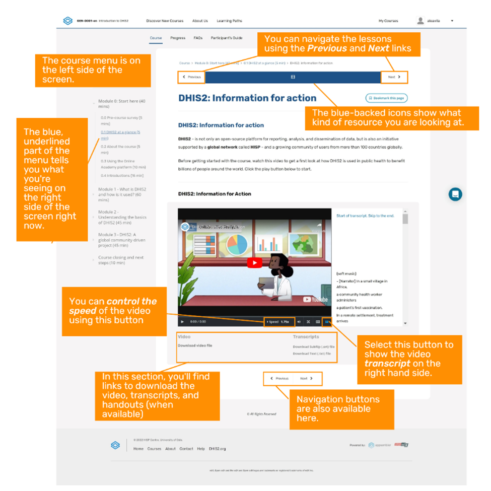

You can also download and review a short version of the platform navigation guidelines to check the key items.

#### Introducing the DHIS2 Community of Practice (CoP) discussion forum

The DHIS2 Community of Practice - or CoP - is a website where the global community of DHIS2 users connect, discuss, share and support each other through discussion forums organized by categories. We have created a specific category for DHIS2 Academy Courses where each of the DHIS2 Fundamentals courses has its own private space. By taking the Fundamentals courses, you are not only learning about DHIS2 but becoming a part of our global community, which is why we encourage you to interact with other course participants on the CoP.

Each time we propose a discussion throughout the course, you will find a link to the specific discussion topic on the CoP; however, the topics are in a private space dedicated to the Aggregate Data Analysis Fundamentals course discussion forum. To be able to access the private space, you will need to accept the CoP invitation once and after that you will be able to access all the discussion topics in the course.

[**Click to join the discussion forum**](https://community.dhis2.org/invites/v4boRJ5rQb)

You only need to use the invitation link once. When you click the link, the CoP website will open in a new browser tab. If you already have a community account and are already signed in from a previous CoP session, you can continue directly to the course discussion forum. If you are not signed in you can sign in using your existing username and password. If you do not already have a community account, you will be prompted to create one.

#### How to navigate to the course discussion forum?

When you create your account, the first interaction with the CoP will be guided by a tour with basic instructions that will help you with using the platform. If you need more guidance, [open this pdf file with specific instructions](https://academy.dhis2.org/assets/courseware/v1/a70f50aabba13ecc991eb56edc524c19/asset-v1:hisp+GEN-D003-en+2022Q1+type@asset+block/General_Forum_Guidelines__intro_to_CoP__-__Aggregate_Data_Analysis_Fundamentals_course.pdf) on how to use the Fundamentals courses discussion forums.

Please keep in mind that the use of the discussion forums is an **optional activity** and is not graded.

### 0.3 Introductions (15 min)

Meet the DHIS2 Online Academy Team

#### Meet the DHIS2 Online Academy Team

The DHIS2 Fundamentals course program is the first of the three levels of the DHIS2 Academy curriculum, and aims to introduce essential concepts and build foundational DHIS2 skills through demonstrations, hands-on exercises and labs. Creating and maintaining the materials for the DHIS2 Fundamentals courses is a team effort, drawing on experts in the DHIS2 platform, instructional and media design, and online learning technologies.

The team behind the DHIS2 Fundamentals are:

**Subject matter experts and reviewers**, responsible for defining the curriculum, contents, and course structure, and validating all learning resources:

- Shurajit Dutta

- Megan Kill

- Matthieu Pinard

- Max Krafft

- Rachel Zink

**Production and support team**, responsible for designing and developing all multimedia learning resources and implementing the course in the platform, and providing student support:

- Alejandra Ávila

- Grant Chapman-Clarke

- Simona Sekerova

- Martin Evensen

- Al-Gassim Sharaf Addin

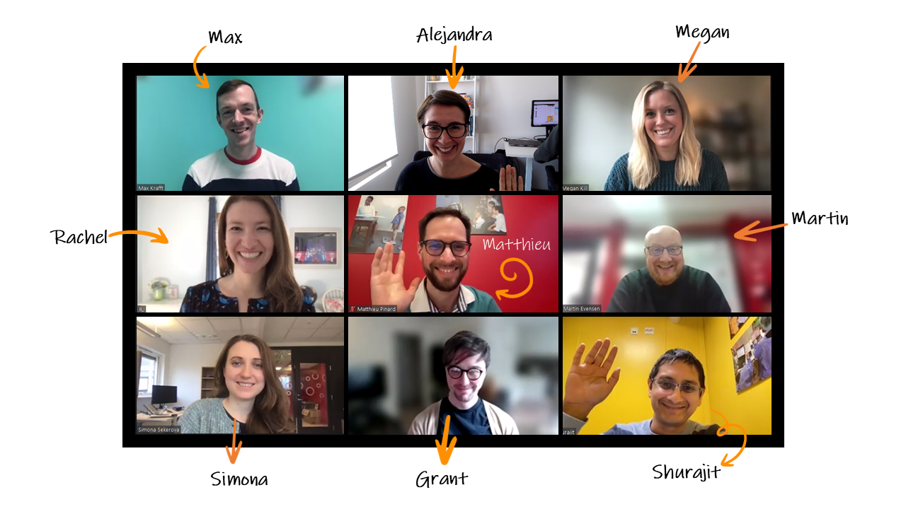

#### Tell us about you

**Word cloud: Where are you from?**

DHIS2 is a global community of users, and you will get the chance to learn with people from all over the world. Let’s create a word cloud and see where your peers come from. In the box below, write the name of your country. Please use full words and avoid using acronyms. After clicking “Save”, you will see the word cloud built from the answers from all course participants.

#### Introduce yourself

Now it’s your turn to introduce yourself and tell your peers about you. You can use the following questions to write your post:

- Where are you from?

- Why are you interested in learning about DHIS2?

- What do you want to achieve in the course?

Remember that the course discussion forums take place in the DHIS2 Community of practice (CoP). if you have already joined the course discussion forum, please click on the following link to join this specific discussion topic:

**Introduce yourself / Tell us about you**

[**Click to join the discussion**](https://community.dhis2.org/t/introduce-yourself-tell-us-about-you/46775)

*[Note that if you can't see the page (or if you reach an “Oops! That page doesn’t exist or is private.)”, please use [this invitation link](https://community.dhis2.org/invites/yWYyEn2g3w) first to gain access to the private course discussion forum]*

## Module 1 – Key concepts of data analysis in DHIS2 (20 min)

### 1.0 Overview of the module (3 min)

#### What is in this module?

In this initial module, you will refresh some concepts from the Introduction to DHIS2 course and create your account in Trainingland, the DHIS2 training instance that we will use throughout the course.

#### Learning objectives

By the end of this module, you should be able to:

- Recognize the main tools available in DHIS2 to create data visualizations: pivot tables, charts, and maps.

- Identify the DHIS2 building blocks that make it possible to customize and extend the capabilities of the platform.

- Create your account in Trainingland

#### How will you be evaluated?

As this is a refresher module, you will not be evaluated.

#### How long will this module take?

The module should take about **20 minutes** to complete.

### 1.1 Introduction to Data Analysis in DHIS2 (8 min)

#### Introduction to data analysis in DHIS2

In the Introduction to DHIS2 course you got an overview of the different tools available in DHIS2 to create visualizations that support data analysis for better decision making.

In this video, you will refresh some of these concepts and see an overview of the course.

[Introduction to data analysis in DHIS2 (YouTube)](https://youtu.be/uHjYpeB9i5E)

#### Documentation

[DHIS2 Documentation - Analyzing Data](https://docs.dhis2.org/en/use/user-guides/dhis-core-version-master/analysing-data/data-visualizer.html)

#### DHIS2 Building Blocks: Data elements, organisation units and periods

The following video is part of the Introduction to DHIS2 course and describes the 3 building blocks of DHIS2: data elements, organisation units, and periods. These concepts are key to understanding the contents of this course, so we recommend you review this video and refresh this knowledge.

[DHIS2 Building Blocks: Data elements, organisation units and periods (YouTube)](https://youtu.be/QbXKnly8P-0)

#### Documentation

[DHIS2 Documentation - Understanding the Data Model](https://docs.dhis2.org/en/use/user-guides/dhis-core-version-master/understanding-the-data-model/about-data-dimensions.html)

### 1.2 Create your account in Trainingland (9 min)

#### How to create an account in Trainingland

To engage with the course, you’ll need to access our specially made DHIS2 training instance, *Trainingland (Analysis)*. Here are the steps needed to create your own Trainingland Analysis account and start learning by using DHIS2.

1. **Click the button below to request an account** (Give it a couple of seconds; DO NOT keep clicking the “Request account” button several times in a row)

2. You will **receive an invitation by email** with instructions on how to complete the registration in DHIS2.

***Note**: we will use the email address you provided when you registered on the DHIS2 Online Academy to create an account for you in Trainingland. Please do not change this email address later as it will be used as your username for Trainingland.*

3. After 5-10 seconds you should receive the following notification in your browser window.

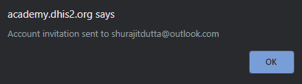

4. Click on ‘OK’ to close this notification.

5. Check your email inbox. You will receive **one email** that look like the following:

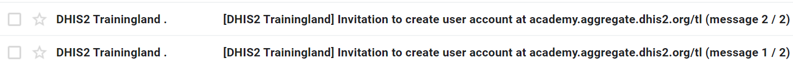

If you don’t find this email in one of your primary inboxes, please check the Promotion tab or the Spam folder in case it was filtered out. Alternatively, you can search for the email using the tags \[DHIS2 Trainingland].

6. Use the information in the email to create your account in Trainingland.

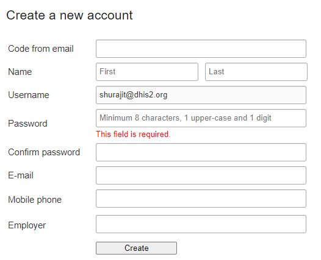

**Your username** and email address will automatically be set to the same as **your registered email address** for DHIS2 Online Academy.

You will also need to enter a **first name** and **last name**. This will be used for messaging in the system or to identify you when you complete a data set.

- When creating your **password**, consider making one you can remember, while making sure it’s **at least 8 characters** long, with **one or more uppercase letters, a number and a special character**.

- Once you have entered the password into both the password boxes, click “**Create**”. This will take you to Trainingland logged in to your new user account!

You will use this Trainingland account to complete activities throughout this course, and you’ll find the link to Trainingland at the top of each activity and assessment lab page. This account will only work for activities and assessment labs in this course, and you’ll need to make a new account for the other courses on the DHIS2 Online Academy.

If you have any questions or difficulty in creating your Trainingland account, don’t hesitate to contact us by using the **"Technical support"** button or using the **support portal**.

Feel free to explore the various dashboards, apps and functions in Trainingland.

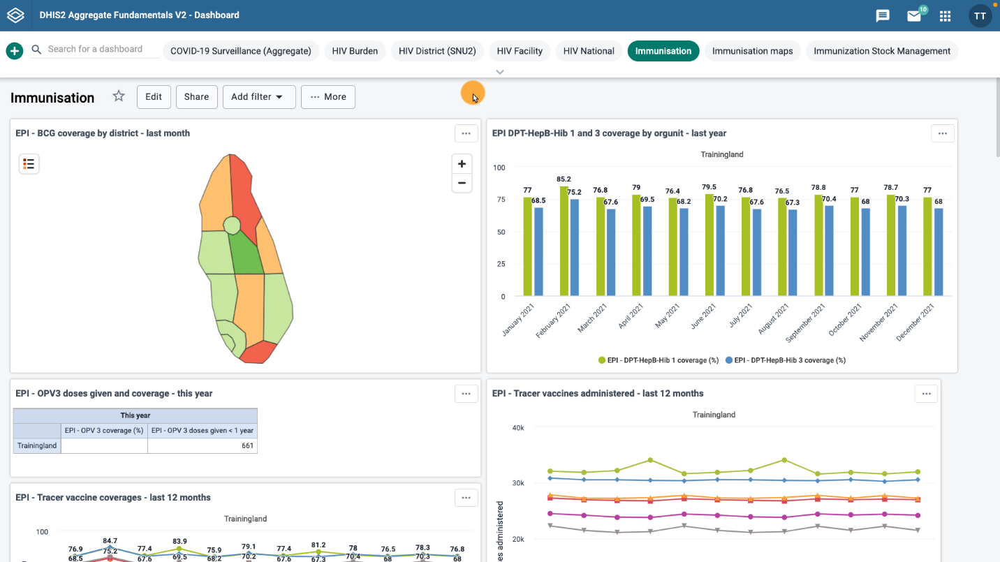

#### Discussion forum

As we are reaching the end of the module, let's take some time to reflect on what you've learned and discuss the key concepts covered so far. To do it, if you have already joined the course discussion forum, please click on the following link to join this specific discussion topic:

**Key concepts of data analysis in DHIS2**
[**Click to join the discussion**](https://community.dhis2.org/t/module-1-key-concepts-of-data-analysis-in-dhis2/46776)

*Note that if you can't see the page (or if you reach an “Oops! That page doesn’t exist or is private.”), please use [this invitation link](https://community.dhis2.org/invites/76gdAuDBoL) first to gain access to the private course discussion forum*

    Discussion prompt: In this module, you started familiarizing yourself with the DHIS2 visualization tools: pivot tables, charts, maps, and dashboards.

    What is your prior experience with data visualizations? How do you think data visualizations can help make better decisions?

    Please feel free to share your experience, read your peers’ responses and reflect on what you have learned so far in the course.

    Thank you!

Even though this is an optional activity, we strongly recommend you take some time to think about your new knowledge, read what other course participants think, and make connections with your own prior experience and current learning needs. This will help you reinforce what you have learned and prepare for the next module.

Once you are done on the CoP, click the link at the top of the discussion topic page to be redirected back to the course to fill out the module feedback survey.

If you are not joining the discussion on this module, simply click the next button below to continue to the survey.

## Module 2 – Using pivot tables for data analysis (2 hr)

### 2.0 Overview of the module (3 min)

#### What is in this module?

How can we summarize aggregate data in a tabular format? How can we easily edit a table to improve data analysis? In this module, you will learn how to create and edit **pivot tables**, the first data visualization tool we’ll cover in this course. You will see how to access the **Data Visualizer app**, select the dimensions of a pivot table, modify its layout, and other features available in DHIS2.

#### Learning objectives

By the end of this module, you should be able to:

- Identify the steps to create and edit a pivot table

#### How will you be evaluated?

At the end of the module, you will find 2 graded activities:

- **Quiz**: 10 multiple choice, true or false, and drag and drop questions randomly selected from a question bank. You will have between **1 and 3 attempts** to answer each question correctly, and the quiz passing grade is **80%** or higher. You will find the number of attempts permitted by question next to the Submit button. This quiz contributes to **10%** of your final grade.

- **Assessment lab**: you will be asked to perform specific tasks in our DHIS2 training instance. After completing these tasks, you will have to answer multiple choice questions to assess your comprehension of the exercise. This assessment lab contributes to 15% of your final grade.

#### How long will this module take?

The module should take about **2 hours** to complete.

### 2.1 Orientation to pivot tables: Data dimension and period dimension (45 min)

#### Orientation to pivot tables: Data dimension and period dimension

Pivot tables are one of the three data visualization tools within DHIS2. Pivot tables allow us to customize the display of the data according to the parameters we define. In this video, you will see how to modify (or edit) an existing pivot table’s data dimension and period dimension in DHIS2.

[Orientation to pivot tables: Part 1 of 3 (YouTube)](https://youtu.be/94D_uXaL8tw)

#### Activity - Orientation to pivot tables: Data dimension and period dimension

[DHIS2 Analysis](https://academy.aggregate.dhis2.org/analysis/dhis-web-commons/security/login.action) – [DHIS2 Documentation](https://docs.dhis2.org/en/use/user-guides/dhis-core-version-master/analysing-data/data-visualizer.html#select-dimensions) – [Printable version](https://academy.dhis2.org/courses/course-v1:hisp+GEN-D003-en+2022Q1/courseware/16e329a0708346b98094bea8433d8d51/a5426958aebd420681480880d7066170/?child=first)

*Please use the account details you have created for DHIS2 Trainingland (Analysis) in order to log in.*

#### Overview

In this activity, you will **change the data and period dimensions** for a **pivot table** using the **Data Visualizer app**. You will add a data element to expose the denominator that is used to calculate the EPI - OPV 3 coverage rate, and change the 2020 period to a fixed monthly period for 2021.

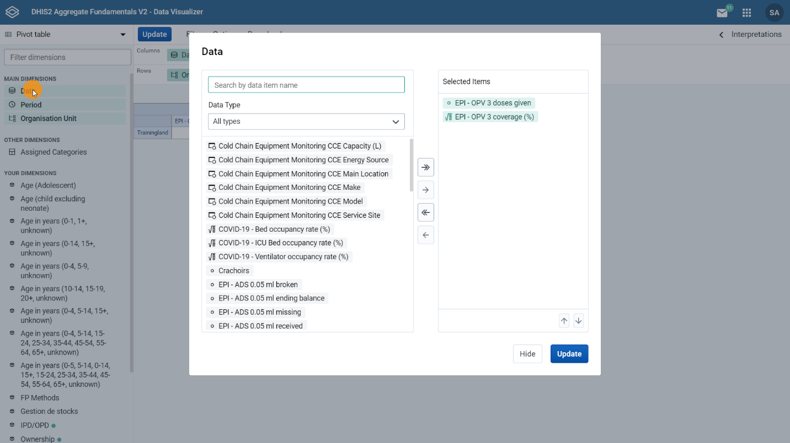
*Image 1 - Data selection box with data items in the selected items box*

#### Instructions

**Update the data and period dimensions**

1. Sign in to your account in **DHIS2 Trainingland (Analysis)**

2. Once you’re logged in to DHIS2, you will see different DHIS2 dashboards. Click on the **Immunisation** dashboard

3. Find the pivot table **‘EPI - OPV3 doses given and coverage - 2020’** and use the context menu to **open the pivot table in the Data Visualizer app**

4. In the Data Visualizer app, update the pivot table to include a third data item for **GEN - Population &lt; 1 year** to display the denominator of the EPI - OPV 3 coverage (%) Indicator. To do this, select the data dimension

5. In the data selection box, select the following:

    1. **Data type:** Data elements

    2. **Data element group:** Population estimates

    3. In the list of available data elements, find the **data item**: **GEN - Population &lt; 1 year.** To select the data item, double-click on it or use the arrows to move it to the selected items box

    4. Select **‘Update’** to view the changes in the table

6. Update the pivot table to include **monthly fixed periods**. To do this, select the period dimension

7. In the period selection box, select the following:

    1. The **fixed periods** tab

    2. **Period type:** Monthly

    3. **Year:** 2021

    4. In the list of available periods, find **January 2021** and **February 2021**. To select these periods, double-click on them or use the arrows to move them to the selected items box

    5. In addition, double-click or use the arrows to move all months from ‘2020’ from the selected items box to the available items box

    6. Select **‘Update’** to view the changes in the table

8. You’ve successfully updated the data and period dimensions in the pivot table. Your pivot table now includes the fixed periods and the new added data item

9. The next activity in this course will use the pivot table you just updated. To **save** your pivot table, complete the following steps:

    1. Select the **File** menu at the top of the pivot table

    2. Select **‘Save As’** and give your pivot table a name. Please **include your initials** and an underscore at the beginning of the file name so it is easy to find. For example, *ABC_EPI - OPV3 doses given and coverage_Trainingland_January and February 2021*

        1. The recommended naming convention for this pivot table is: ***Your initials__**EPI - OPV3 doses given and coverage_Trainingland_January and February 2021*

        2. In the event your initials have already been used, simply add an additional letter or number

        3. Select **‘Save’** when finished

#### Knowledge check

**1. What are the main dimensions to select to create a pivot table?**

*Select all that apply.*

    A. Data elements
    B. Period
    C. Organisation unit
    D. Visualization tool
    E. Columns

**Explanation**: The three main dimensions to select when creating a pivot table are the data elements, period and organisation unit.

**2. The main feature of a pivot table is the ability to pivot the selected dimensions from columns to rows and vice versa**

    A. True
    B. False

**Explanation**: The main feature of a pivot table is its ability to pivot any number of the dimensions such as indicators, data elements, organisation units, and periods, as columns and rows to create customized views.

#### Orientation to pivot tables: Organisation unit dimension and disaggregations

The three main dimensions you need to select to create a pivot table are: 1. the data elements, the “What” 2. the period, the “When” and 3. the organisation unit, the “Where.” In the previous video, you saw how to edit the What and When dimensions. In this video, you will see how to modify the Where dimension, the organisation unit. You will also see how to add disaggregations to your output.

[Orientation to pivot tables: Part 2 of 3 (YouTube)](https://youtu.be/VD-9DM8JXzo)

#### Activity - Orientation to pivot tables: Organisation unit dimension and disaggregations

[DHIS2 Analysis](https://academy.aggregate.dhis2.org/analysis/dhis-web-commons/security/login.action) - [DHIS2 Documentation](https://docs.dhis2.org/en/use/user-guides/dhis-core-version-237/analysing-data/pivot-tables.html#select-dimension-items) – [Printable version](https://academy.dhis2.org/courses/course-v1:hisp+GEN-D003-en+2022Q1/courseware/16e329a0708346b98094bea8433d8d51/a5426958aebd420681480880d7066170/?child=first)

*Please use the account details you have created for DHIS2 Trainingland (Analysis) in order to log in.*

#### Overview

In this activity, you will **change the organisation unit dimension** for a **pivot table** in the **Data Visualizer app**. You will update the organisation unit dimension to display data by district in Trainingland and identify which **disaggregations** are compatible with the data items in the pivot table.

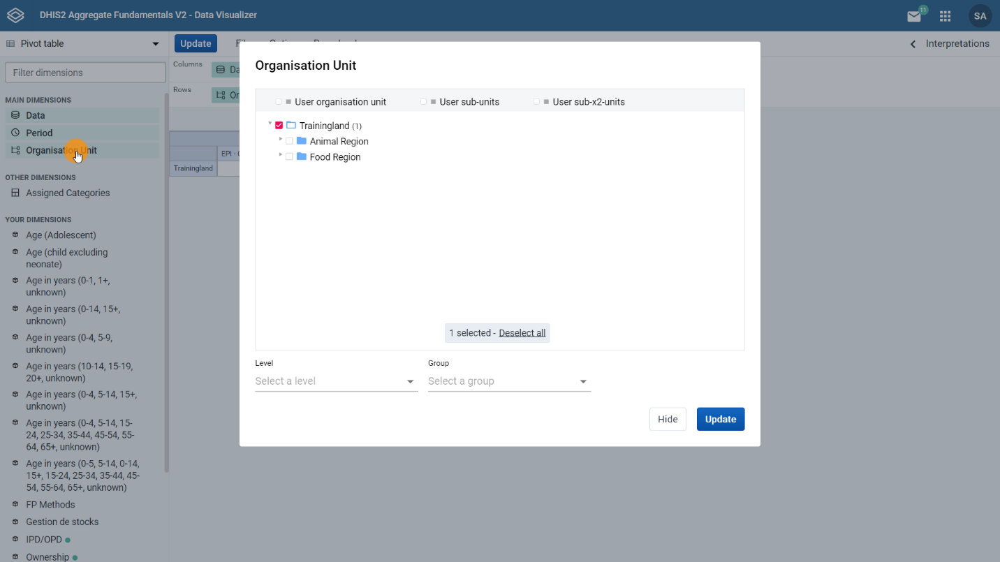

*Image 1 - Organisation unit selection box with district selected as the level*

#### Instructions

**Update the organisation unit dimension and identify disaggregations**

If you are continuing from the last section’s activity and are already signed in to Trainingland, you can skip steps 1-4 and proceed to step 5.

1. Sign in to your account in **DHIS2 Trainingland (Analysis)**

2. Navigate to the **Data Visualizer app** using the Apps menu

3. Click on **File** in the menu bar then select **‘Open’** from the dropdown menu

4. In the **Search by name** field, type your initials to easily find your saved pivot table. Once you have found your pivot table, simply click on it in the search results to open it

5. In the Data Visualizer app, update the **organisation unit dimension** to display data for all **districts** in Trainingland. To do this, select the organisation unit dimension

6. In the organisation unit selection box, use the **Select a level** option to select: **District**

7. Select **‘Update’** to view the changes in the table

8. You’ve successfully updated the organisation unit dimension in the pivot table. You can now see data by district in Trainingland

9. Can you identify which disaggregations are related to the data items used in the pivot table? How many disaggregations are compatible with these data items? *Hint: Look for the green dot next to the name of the disaggregation*

10. The next activity in this course will use the pivot table you just updated. To **save** your pivot table, complete the following steps:

    1. Select the **File** menu at the top of the pivot table

    2. Select **‘Save’** to save changes

#### Knowledge check

**1. What are the 3 ways to select organisation units in a pivot table?**

*Select all that apply.*

    A. Hierarchy
    B. Regions
    C. Levels
    D. Groups
    E. Urban/Rural

**Explanation**: In DHIS2, you can select organisation units by Hierarchy, Levels or Groups.

**2. If you want to select all district level organisation units, which of the following options would be the best way?**

*Select one answer.*

    A. Groups
    B. Hierarchy
    C. Level

**Explanation**: If you want to select all organisation units at a particular level in the hierarchy, you can use the Levels option to easily select them.

### 3. Orientation to pivot tables: Layout, file menu, options and downloads

Once you have completed your pivot table in DHIS2, you might want to explore the **layout** features to change the design of the output. In this video, you will see how easy it is to change the layout of a pivot table. You’ll also see how to add totals for columns and rows and how to change the style of your pivot table using the **Options** menu. Lastly, you’ll see how to save your pivot table for later, share it with other DHIS2 users, download it for further use or delete it using the **File** and **Download** menus.

[Orientation to pivot tables - Part 2 of 3 (YouTube)](https://youtu.be/zYgWkyrlQX0)

#### Activity - Orientation to pivot tables: Layout, file menu, options and downloads

[DHIS2 Analysis](https://academy.aggregate.dhis2.org/analysis/dhis-web-commons/security/login.action) – [DHIS2 Documentation](https://docs.dhis2.org/en/use/user-guides/dhis-core-version-master/analysing-data/data-visualizer.html#select-dimensions) – [Printable version](about:blank)

*Please use the account details you have created for DHIS2 Trainingland (Analysis) in order to log in.*

#### Overview

In this activity, you will change the **layout** for a pivot table in the Data Visualizer app. You will also explore the **file, options** and **download** buttons.

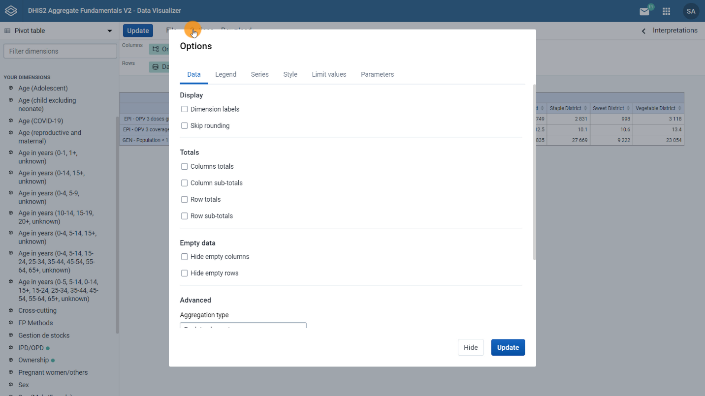

*Image 1 - Pivot table customization options with row totals selected*

#### Instructions

**Update the pivot table layout and explore the file, options and download buttons**

If you are continuing from the last section’s activity and are already signed in to Trainingland, you can skip steps 1-4 and proceed to step 5.

1. Sign in to your account in **DHIS2 Trainingland (Analysis)**

2. Navigate to the **Data Visualizer app** using the Apps menu

3. Click on **File** in the menu bar then select **‘Open’** from the dropdown menu

4. In the **Search by name** field, type your initials to easily find your saved pivot table*.* Once you have found your pivot table, simply click on it in the search results to open it

5. In the Data Visualizer app, update the pivot table **layout** by dragging and dropping dimensions to the following:

    1. **Columns:** Organisation unit

    2. **Rows:** Data

    3. Click **‘Update’** to view the changes in the table

6. Click on the **Options** button to view the extra options available to customize the pivot table

    1. Add **row totals** to the pivot table by selecting the box next to its name

    2. Click **‘Update’** to view the changes in the table

7. Click on the **File** menu then **‘Rename’** to rename your visualization

    - The recommended naming convention for this pivot table is: ***Your initials_**EPI - OPV3 doses given and coverage_District_January and February 2021*

8. Click on the **Download** button to explore the download options available. If you’d like, you can select one of the download options to see how the pivot table appears in the selected format

9. You’ve successfully updated the pivot table layout and explored the file, options and download buttons

#### Knowledge check

**1. The layout area allows you to move the selected dimensions around to customize your visualization**

    A. True
    B. False

**Explanation**: The layout area makes it easy to move the dimensions around and update the layout. You only need to drag and drop the dimensions to the different layout sections and click ‘Update’.

**2. You can only download your pivot table in Excel or CSV formats, as plain data source downloading is not available for pivot tables**

    A. True
    B. False

**Explanation**: You can preserve the table layout by using the Excel, CSV or HTML options, or download the plain data source by selecting JSON, XML, Excel, CSV and other advanced options.

## 2.2 Creating a pivot table (45 min)

### Creating a pivot table: Selecting the dimensions

In the previous section, you received an introduction to pivot tables and got an overview of the Data Visualizer app interface in DHIS2. In this video and the following videos, you will learn how to **create a pivot table step-by-step**. This first video explains how to select the visualization type and the main dimensions needed to generate the pivot table.

[Creating a pivot table: Selecting the dimensions (YouTube)](https://youtu.be/HQvFrRyTuAQ)

#### Activity - Creating a pivot table: Selecting the dimensions

[DHIS2 Analysis](https://academy.aggregate.dhis2.org/analysis/dhis-web-commons/security/login.action) – [DHIS2 Documentation](https://docs.dhis2.org/en/use/user-guides/dhis-core-version-master/analysing-data/data-visualizer.html#creating-and-editing-visualizations) – [Printable version](https://academy.dhis2.org/courses/course-v1:hisp+GEN-D003-en+2022Q1/courseware/16e329a0708346b98094bea8433d8d51/a9c2db32e0e245f3aab5a5f798797fe4/)

*Please use the account details you have created for DHIS2 Trainingland (Analysis) in order to log in.*

#### Overview

In this exercise, you will learn how to **generate a pivot table** and **select its dimensions** using the **Data Visualizer app.**

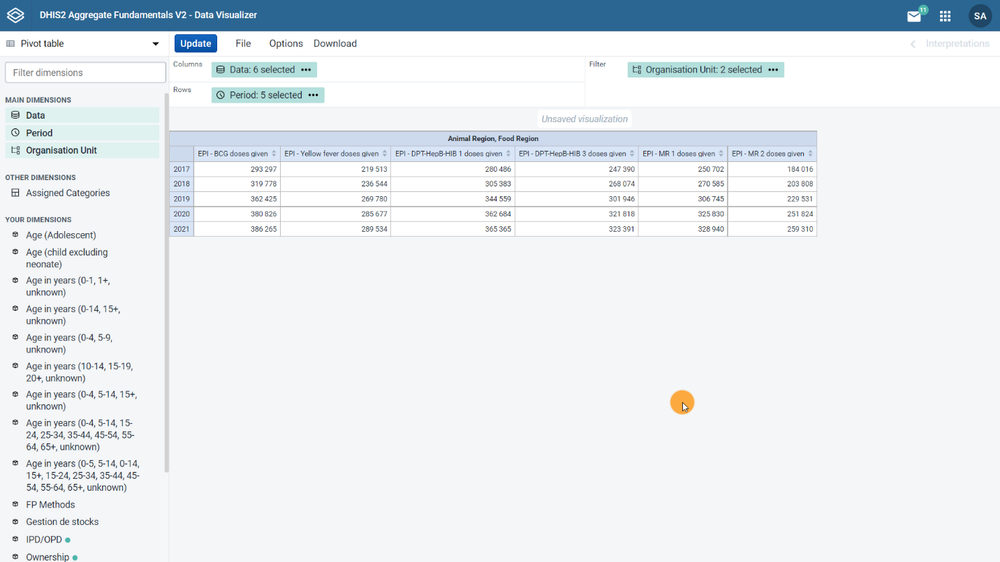

*Image 1 - A pivot table created in the Data Visualizer app*

#### Instructions

Select the data, period and organisation unit dimensions:

1. Sign in to your account in **DHIS2 Trainingland (Analysis)**

2. Navigate to the **Data Visualizer** **app** from the Apps menu

3. In the upper left-hand corner, you will see ‘Column’ selected as the visualization type. Select **‘Pivot Table’** as the visualization type from the dropdown menu

4. Click on the **data dimension** to select the data items that will be displayed in the pivot table. In the data selection box, select the following:

    1. **Data type:** Data element

    2. **Data element group:** Immunization vaccinations

    3. In the list of available **data elements**, find and select the following list of data elements. When selecting, try using the different selection and keyboard functions such as, double-clicking on the data elements, using the arrows, using the shift key to select more than one at a time, and using the Control button for Windows or Command button for Mac. Select the following data elements:

        - EPI - BCG doses given

        - EPI - Yellow fever doses given

        - EPI - DPT-HepB-HIB 1 doses given

        - EPI - DPT-HepB-HIB 2 doses given

        - EPI - MR 1 doses given

        - EPI - MR 2 doses given

    4. Select **‘Hide’** to store your selection and continue to edit the dimensions before updating the table

5. Click on the **period dimension** to select the period. In the period selection box, select the following:

    1. The **fixed periods** tab

    2. **Period type:** Yearly

    3. **Year:** 2017-2021

        1. This is a good opportunity to try the shift key: click on ‘2017’ and hold the shift key on your keyboard then click on ‘2021’. This will select all the periods between 2017 - 2021. Use the right arrow to move the selected periods to the selected items box

        2. In addition, double-click or use the arrows to move ‘Last 12 months’ from the selected items box to the available items box

    4. Select **‘Hide’** to store your selection and continue to edit the dimensions before updating the table

6. Click on the **organisation unit dimension** to select the organisation unit. In the organisation unit selection box, complete the following:

    1. In the organisation unit hierarchy, click on the box next to Trainingland to unselect it. Click on the boxes next to Animal Region and Food Region to select them

    2. Select **‘Update’** to view the changes in the table

7. You’ve successfully updated the data, period and organisation unit dimensions in the pivot table

8. The next activity in this course will use the pivot table you just updated. To **save** your pivot table, complete the follow steps:

    1. Select the **File** menu at the top of the pivot table

    2. Select **‘Save’** and give your pivot table a name. Please **include your initials** and an underscore at the beginning of the file name so it is easy to find. For example, ***ABC_**Immunisations_Region_2017 - 2021*

        1. In the event your initials have already been used, simply add an additional letter or number

        2. Select **‘Save’** when finished

#### Knowledge check

**1. What are the steps to create a pivot table? Drag the items above and drag them in the correct order below:**

    A. Open the Data Visualizer app
    B. Select “Pivot table”
    C. Select the data item
    D. Select the period
    E. Selct the organisation unit
    E. Select “Update”

**Feedback**: To create a pivot table, you first need to open the Data Visualizer app, then select ‘Pivot table’ from the list of visualization types, then select the three dimensions: data items, period and organisation unit.

#### Creating a pivot table: Updating the layout

Once we have created our pivot table, we can modify its layout to change the visualization of the data or to get more details about them. In this video, we will see how to edit the layout of a pivot table.

[Creating a pivot table: Updating the layout (YouTube)](https://youtu.be/3ztXjj7nRyc)

#### Activity - Creating a pivot table: Updating the layout

[DHIS2 Analysis](https://academy.aggregate.dhis2.org/analysis/dhis-web-commons/security/login.action) – [DHIS2 Documentation](https://docs.dhis2.org/en/use/user-guides/dhis-core-version-master/analysing-data/data-visualizer.html#creating-and-editing-visualizations) – [Printable version](https://academy.dhis2.org/courses/course-v1:hisp+GEN-D003-en+2022Q1/courseware/16e329a0708346b98094bea8433d8d51/a9c2db32e0e245f3aab5a5f798797fe4/)

*Please use the account details you have created for DHIS2 Trainingland (Analysis) in order to log in.*

#### Overview

In this exercise, you will learn how to update the **layout** of a pivot table in the **Data Visualizer app**. In addition, you will also update the organisation unit dimension to display data by district in Animal Region.

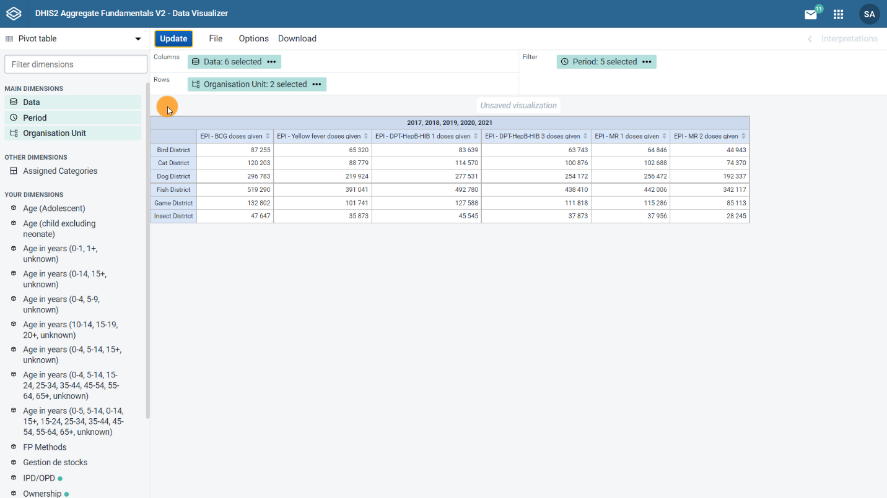

*Image 1 - A pivot table with the layout changed*

#### Instructions

**Change the layout of a pivot table**

If you are continuing from the last section’s activity and are already signed in to Trainingland, you can skip steps 1-4 and proceed to step 5.

1. Sign in to your account in **DHIS2 Trainingland (Analysis)**

2. Navigate to the **Data Visualizer app** using the Apps menu

3. Click on **File** in the menu bar then select **‘Open’** from the dropdown menu

4. In the **Search by name** field, type your initials to easily find your saved pivot table*.* Once you have found your pivot table, simply click on it in the search results to open it

5. In the Data Visualizer app, select the **organisation unit dimension.** In the organisation unit selection box, complete the following:

    1. Unselect the box next to Food Region (Leave Animal Region as selected)

    2. Use the **Select a level** option to select: **District**

    3. Click **‘Update’** to see the pivot table update to only display data for the districts in Animal Region

6. In the **layout** section above the pivot table, **drag and drop the dimensions** to the following:

    1. **Filter:** Period

    2. **Rows:** Organisation unit

    3. Click **‘Update’**

7. You’ve successfully updated the layout in the pivot table

8. The next activity in this course will use the pivot table you just updated. To **save** your pivot table, complete the following steps:

    1. Select the **File** menu at the top of the pivot table

    2. Select **‘Save’** to save changes

#### Knowledge check

**1. In this pivot table, you can see the total number of vaccines from 2017-2021. How should the table layout be updated to show the districts in the rows and the years in the filter? Drag and drop the dimensions into the layout space needed to update this table’s layout.**

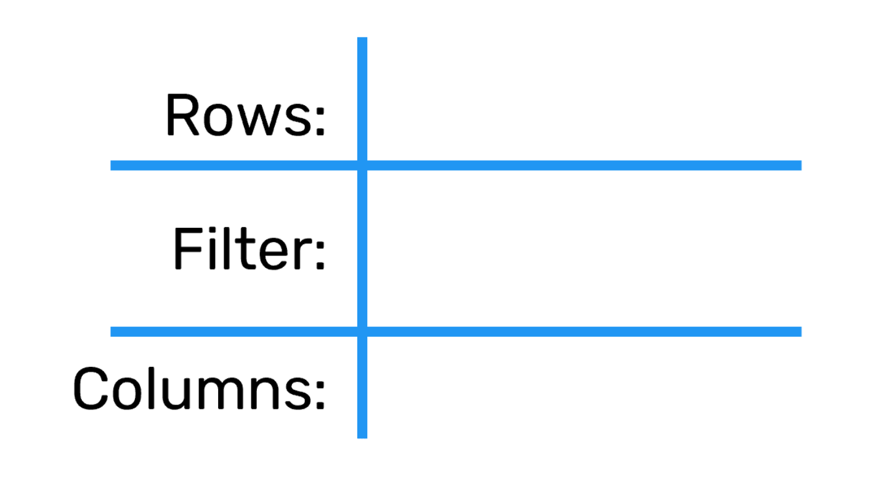

### Creating a pivot table: Options and disaggregations

You already know how to modify the layout of a pivot table, but there are still more options to customize it. In this video, you will see how to adjust the options and add disaggregations to facilitate a deeper understanding of the data.

[Creating a pivot table: Options and disaggregations(YouTube)](https://youtu.be/R51d4IA-JOA)

#### Activity - Creating a pivot table: Options and disaggregations

[DHIS2 Analysis](https://academy.aggregate.dhis2.org/analysis/dhis-web-commons/security/login.action) – [DHIS2 Documentation](https://docs.dhis2.org/en/use/user-guides/dhis-core-version-master/analysing-data/data-visualizer.html#change-the-display-of-your-visualization) – [Printable version](https://academy.dhis2.org/courses/course-v1:hisp+GEN-D003-en+2022Q1/courseware/16e329a0708346b98094bea8433d8d51/a9c2db32e0e245f3aab5a5f798797fe4/)

*Please use the account details you have created for DHIS2 Trainingland (Analysis) in order to log in.*

#### Instructions

In this exercise, you will learn how to update the **options** of a pivot table and add **disaggregations** in the Data Visualizer app.

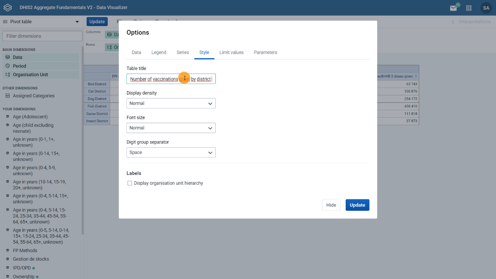

*Image 1 - A pivot table with Options menu open and a table title added in the Style tab*

### Update the options of a pivot table and adding disaggregations

**If you are continuing from the last section’s activity and are already signed in to Trainingland, you can skip steps 1-4 and proceed to step 5.**

1. Sign in to your account in **DHIS2 Trainingland (Analysis)**

2. Navigate to the **Data Visualizer app** using the Apps menu

3. Click on **File** in the menu bar then select **‘Open’** from the dropdown menu

4. In the **Search by name** field, type your initials to easily find your saved pivot table*.* Once you have found your pivot table, simply click on it in the search results to open it

5. In the Data Visualizer app, click on the **Options** button to view the extra options available to customize the pivot table

    1. Add **column totals** to the pivot table by selecting the box next to its name

    2. In the **Style** tab, add a title to the table. The recommended title for this pivot table is: *Number of vaccinations given by district in Animal Region 2017-2021*

    3. Click **‘Update’** to view the changes in the table

6. Click on the **sorting arrows** next to the column headers to see how the data in the pivot table can be sorted

7. To add a **disaggregation** to the pivot table, look at the available disaggregations under **Your Dimensions** in the left-side pane. Find and click on the disaggregation **Urban/Rural** then complete the following:

    1. In the dimension selection box, click on the double right arrow to move all the options to the selected items box

    2. Select the down arrow next to Add to Columns and select **‘Add to Rows’**

8. You’ve successfully updated the pivot table’s options and added a disaggregation

9. To **save** your pivot table, complete the following steps:

    1. Select the **File** menu at the top of the pivot table

    2. Select **‘Save’** to save changes

#### Knowledge check

**1. Which of the following menus allows you to add a title and a column total?**

    A. File
    B. Options
    C. Download

**Explanation**: The Options menu allows you to add column totals, a title and other options to further customize the pivot table.

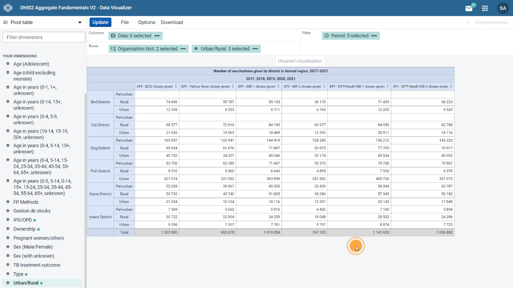

**2. Which of the following dimensions can be added as disaggregation to the pivot table in the screenshot?**

*Select all that apply.*

    A. IPD/OPD
    B. Ownership
    C. Type
    D. Urban/Rural

**Explanation**: All these dimensions can be added to our pivot table. Under “Your Dimensions” in the left-side pane, you can find all disaggregations available for your DHIS2 instance.

### 2.3 Module Quiz (10 min)

#### Module 2 Quiz

This is a graded quiz, and it is worth **10% of your final grade**. You will find 10 multiple-choice, true or false, and drag and drop questions randomly selected from a question bank. You will have between **1 and 3 attempts** to answer each question correctly, and the quiz passing grade is 80%. You will find the number of attempts permitted by question next to the Submit button.

If you want to save your current response without submitting it for grading yet, select the "save" button. This allows you to come back later and resume the attempt.

**1. How do you select a visualization type in the Data Visualizer app?**

*Select one answer.*

    A. From a dropdown menu in the upper left-hand corner
    B. Under Main Dimensions, click on ‘Visualization type’
    C. Under Options, click ‘Visualization type’

**Explanation**: In the Data Visualizer app, the visualization type is selected from a dropdown menu located in the upper left-hand corner of the app. The dropdown menu includes the name of the visualization, an icon depicting the type of visualization and a short description of the visualization.

**2. A pivot table can be opened from a dashboard by**

*Select one answer.*

    A. Double-clicking on the pivot table then selecting ‘View pivot table’
    B. Right-clicking on the pivot table then selecting ‘See in Data Visualizer application’
    C. Selecting the context menu then clicking ‘Open in Data Visualizer app’

**Explanation**: To open a pivot table from a dashboard, select the context menu (located in the upper right-hand corner of the pivot table) then select ‘Open in Data Visualizer app’.

**3.What are the 3 ways to select organisation units in a pivot table?**

*Select all that apply.*

    A. Hierarchy
    B. Regions
    C. Levels
    D. Groups
    E. Urban/Rural

**Explanation**: In DHIS2, you can select organisation units by Hierarchy, Levels or Groups. Regions are an example of a possible level in an organisation unit hierarchy. Urban/Rural are examples of possible organisation unit groups.

**4. What does the green dot next to the name of a disaggregation indicate?**

*Select one answer.*

    A. The disaggregation has been added to the visualization
    B. The disaggregation is not recommended for data analysis
    C. The disaggregation is compatible with the data items in the visualization

**Explanation**: If there is a green dot next to the name of a disaggregation it means the disaggregation is compatible with the data items currently in the visualization.

**5. What are the main dimensions to select when creating a pivot table?**

*Select all that apply.*

    A. Data items
    B. Period
    C. Visualization tool
    D. Organisation unit
    E. Disaggregations

**Explanation**: The three main dimensions to select when creating a pivot table are the data items, the period and the organisation unit, corresponding to the key data dimensions.

**6. Which of the following menu allows you to add a title and a column total to a pivot table?**
*Select one answer.*

    A. File
    B. Options
    C. Download

**Explanation**: The Options menu allows you to add column totals, a title and other options to further customize the pivot table.

**7. When selecting the data, period and organisation unit dimensions there are two buttons available in the selection box: Hide and Update. What does the Hide button do?**
*Select one answer.*

    A. The Hide button stores your selection and allows you to continue to edit the dimensions before updating the table
    B. The Hide button hides any previously selected dimensions and erases the dimension history
    C. The Hide button shows if there any hidden features selected within the dimension

**Explanation**: In the dimension selection box, selecting the Hide button allows you to store your selection and continue to edit the other dimensions before updating the table.

**8. How do you update a pivot table’s layout?**
*Select one answer.*

    A. Select ‘Layout’ then ‘Edit’. Select the desired layout and click ‘Save’
    B. Click on the Options button then the Style tab. Select the column, rows and filter then click ‘Update’
    C. Drag and drop the data dimensions to columns, rows and filter then click ‘Update’

**Explanation**: You can change a pivot table’s layout by dragging and dropping the dimensions to the columns, rows, and filter then clicking ‘Update’.

**8. The main feature of a pivot table is the ability to pivot the selected dimensions from columns to rows and vice versa**
*Select one answer.*

    A. True
    B. False

**Explanation**: The main feature of a pivot table is its ability to pivot any number of the dimensions such as indicators, data elements, organisation units, and periods, as columns and rows to create customized views.

**9. Which of the following menus allows you to save, share or delete a pivot table?**
*Select one answer.*

    A. File
    B. Options
    C. Download

**Explanation**: The File menu allows you to save, share or delete a pivot table, among other actions.

### 2.4 Module Lab (15 min)

**This is a graded assessment lab and it is worth 15% of your final grade**

In order to answer the assessment lab questions, you will have to complete a task in the DHIS2 training instance, **Trainingland**. Sign in to your Trainingland account using the following link: [DHIS2 Analysis](https://academy.aggregate.dhis2.org/analysis)

You will have between **1 and 3 attempts** to answer each question correctly, and the lab passing grade is **80%**. You will find the number of attempts permitted by question next to the Submit button.

If you want to save your current response without submitting it for grading yet, select the "save" button. This allows you to come back later and resume the attempt.

**1. In Trainingland, navigate to the “COVID-19 Surveillance (Aggregate)” dashboard. Find the pivot table “COVID-19 - Recovery and fatality rate by sex and age - October 2021” and use the context menu to open it in the Data Visualizer app. Update the data dimension to include “COVID-19 - Closed cases” and change the period dimension to “March 2021” (be sure to remove the current period).**

**What was the total of closed COVID-19 cases for males in March 2021?**
*Select one answer.*

        A. 442
        B. 1,559
        C. 3,230

**Explanation**: In this example, the total number of closed COVID-19 cases for males in March 2021 is 3,230. This number can be found at the bottom of the pivot table under the column for male and the row total.

**2. In the Data Visualizer app, open the visualization type dropdown menu. What is the pivot table’s description?**
*Select one answer.*

    A. “Compare sizes of related elements vertically. Recommend period as filter.”
    B. “View data and indicators in a manipulatable table.”
    C. “Compare several items against multiple variables.”

**Explanation**: In the visualization type dropdown menu (located in the upper left-hand corner of the Data Visualizer app), the description of the pivot table is “View data and indicators in a manipulatable table.”

**3. In Trainingland, navigate to the “Immunisation” dashboard. Find the pivot table “EPI - OPV3 doses given and coverage - 2020” and use the context menu to open it in the Data Visualizer app. Change the period dimension to “July 2021” (be sure to remove the current period). Use the “Select a level” dropdown menu to update the organisation unit dimension to only include data by region.**

**Which region in Trainingland had the highest number of EPI - OPV 3 doses given?**

*Select one answer.*

    A. Animal Region
    B. Food Region
    C. The regions administered the same number of OPV 3 doses

**Explanation**: For July 2021, Animal Region had the highest number of OPV 3 doses given with over 18,000 administered compared to Food Region, which administered less than 9,000.

**4. In the Data Visualizer app, open the organisation unit dimension. In the organisation unit selection box, you can “Select a level” to display data in the pivot table at a particular level.**

**Which of the following is NOT an available level in Trainingland?**

*Select all that apply.*

    A. Province
    B. Region
    C. District
    D. Facilit
    E. Urban

**Explanation**: In Trainingland, Province and Urban are not organisation unit levels. Trainingland has four levels: Country, Region, District and Facility. These four levels can be found under the “Select a level” dropdown menu in the organisation unit selection box.

**5. In Trainingland, navigate to the “COVID-19 Surveillance (Aggregate)” dashboard. Find the pivot table “COVID-19 - Recovery and fatality rate by sex and age - October 2021” and use the context menu to open it in the Data Visualizer app.**

**Which disaggregations are compatible with the data items in the pivot table?**

*Select all that apply.*

    A. Age (COVID-19)
    B. IPD/OPD
    C. Ownership
    D. Treatment Type (COVID-19)
    E. Type
    F. Urban/Rural

**Explanation**: In the Data Visualizer app, disaggregations for the DHIS2 instance can be found under “Your Dimensions”. If there is a green dot next to the name of a disaggregation, it means it is compatible with the data items currently in the pivot table. In this example, IPD/OPD, Ownership, Type, and Urban/Rural are compatible with the data items in the pivot table

**6. In Trainingland, navigate to the “Immunisation” dashboard. Find the pivot table “EPI - Dropout rates - Monthly 2021” and use the context menu to open it in the Data Visualizer app. Update the layout to have the year in the rows and the data items in the columns. In addition, add row totals to the visualization.**

**What is the total dropout rate for December 2021?**

*Select one answer.*

    A. 14.1%
    B. 15.7%
    C. 19.9%

**Explanation**: For this example, you need to update the layout to have the period dimension in rows and the data dimension in columns. Row totals can be added by selecting the Options button then selecting the box next to row totals. The total dropout rate for December 2021 can be found under the total column in the December 2021 row.

**7. In the Data Visualizer app open any saved pivot table by clicking on File &gt; Open. Then click on the Download button.**

**Which of the following is NOT listed under table layout downloads?**

*Select one answer.*

    A. Excel
    B. CSV
    C. JSON
    D. HTML

**Explanation**: Under downloads, JSON is not listed under table layout. The options listed for table layout downloads are: Excel, CSV and HTML. JSON is listed as an option for plain data source downloads.

**8. In the Data Visualizer app, create a new pivot table using the following information:**

    A. Data: “COVID-19 - ICU beds (occupied)” and “COVID-19 - ICU beds (total)”.
    B. Period: June 2021 (be sure to remove the pre-selected period).
    C. Organisation unit: Districts in Animal Region.

Hint: You may need to update the layout.

**9. Which district has the highest total of COVID-19 ICU beds?**

*Select one answer.*

    A. Cat District
    B. Dog District
    C. Fish District

**Explanation**: In order to see the data you need to answer the question, the period needs to be in the filter and the organisation unit needs to be in the rows (or columns if data is in the rows). In Animal Region, the Fish District had the highest total of COVID-19 ICU beds in June 2021.

**10. In the Data Visualizer app, create a new pivot table using the following information**:

1. Data: “COVID-19 - ICU beds (occupied)” and “COVID-19 - ICU beds (total)”.
2. Period: October 2021 (be sure to remove the pre-selected period).
3. Organisation unit: Districts in Animal Region.
4. Add the disaggregation “Type” and select “Dispensary” and “Health Centre”.

**Which district had over 600 ICU beds occupied in their Health Centres in October 2021?**

*Select one answer.*

    A. Insect District
    B. Bird District
    C. Game District

**Explanation**: All available disaggregations for the DHIS2 instance can be found under “Your Dimensions” and can be selected by clicking on them. Within the selection box, simply move the desired disaggregations to the selected items box and then use the button/down arrow to add them to the columns, rows or filter. In Animal Region, the Insect District had over 600 ICU beds occupied in their Health Centres in October 2021.

**11. In the Data Visualizer app, select pivot table as the visualization type. Click on any disaggregation to open the selection box.**

**What are the available button options to add the disaggregation to the visualization?**

*Select all that apply.*

    A. Add to Series
    B. Add to Table
    C. Add to Columns
    D. Add to Rows
    E. Add to Filter
    F. Add to Category

**Explanation**: Within the selection box, you must use the button/down arrow to add the disaggregation to either the columns, rows or filter in the table. Selecting the down arrow next to ‘Add to Columns’ generates the additional options for adding the disaggregation to the rows or filter.

**12. In the Data Visualizer app, open the File menu. Which of the following can be found in the File menu?**

*Select all that apply.*

    A. New
    B. Create
    C. Save as
    D. Save and open new
    E. Rename
    F. Delete

**Explanation**: The File menu has many options for the visualization including: New, Save As, Rename and Delete. Note that some of these options are disabled if the visualization you have open is not saved.

**13. In Trainingland, navigate to the “Immunisation” dashboard. Find the pivot table “EPI - Dropout rates by orgunit - 2021” and use the context menu to open it in the Data Visualizer app. What is the layout of this pivot table? Drag and drop the dimension to match this pivot table’s layout.**

    Organisation unit
    Period
    Data

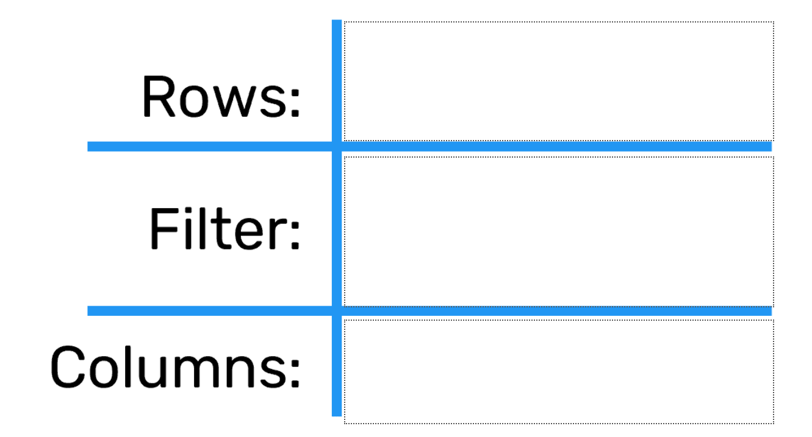

**Feedback**: Dimensions of a pivot table can be dragged and dropped to adjust the layout. The layout of this pivot table is: Data in the columns, organisation unit in the rows and period in the filter.

### 2.5 Module Summary (3 min)

#### Module 2 Summary

You have now reached the end of the second module for the Data Analysis in DHIS2 course. In this module, you have learned:

- How to create pivot tables in the **Data Visualizer app** in DHIS2 and how to select ‘**Pivot table**’ from the list of visualization types

- You can also open a pivot table from a **Dashboard** by selecting the context menu

- The main dimensions of a pivot table are the **data items**, the **period** and the **organisation unit**

- The organisation unit can be selected by using the **Hierarchy** or selecting **Groups** or **Levels**

- You can add **disaggregations** to pivot tables by selecting them from the available options in the Data Visualizer app

- You can change the pivot table **layout** by dragging and dropping the dimensions to the **columns**, **rows** and **filter** then clicking ‘**Update**’

- The **File** menu allows you to **save**, **share**, or **delete** the pivot table

- **Options** can be added to customize the pivot table, such as column and row totals, and table titles

- The **Download** menu allows you to **download** the output in different formats to use it outside DHIS2

#### Discussion forum

As we are reaching the end of the module, let's take some time to reflect on what you've learned and discuss the key concepts covered so far. To do it, if you have already joined the course discussion forum, please click on the following link to join this specific discussion topic:

**Using pivot tables for data analysis**

[**Click to join the discussion**](https://community.dhis2.org/t/module-2-using-pivot-tables-for-data-analysis/46777)

*[Note that if you can't see the page (or if you reach an “Oops! That page doesn’t exist or is private.”), please use [this invitation link](https://community.dhis2.org/invites/EjMbVaGmBw) first to gain access to the private course discussion forum]*

In this module, you had the chance to start interacting with Trainingland, our DHIS2 training instance. For most of you, this might have been the first time playing with DHIS2 or maybe the first time editing or creating a pivot table.

What are your first impressions? What would you say are the most remarkable features of DHIS2 for new users? Did you experience any challenges? For those of you with more experience with DHIS2, please share what you thought when starting working with DHIS2.

Please feel free to share your experience, read your peers’ responses and reflect on what you have learned so far in the course.

Thank you!

Even though this is an optional activity, we strongly recommend you take some time to think about your new knowledge, read what other course participants think, and make connections with your own prior experience and current learning needs. This will help you reinforce what you have learned and prepare for the next module.

Once you are done on the CoP, click the link at the top of the discussion topic page to be redirected back to the course to fill out the module feedback survey.

If you are not joining the discussion on this module, simply click the next button below to continue to the survey.

### 2.6 Feedback Survey (2 min)

#### Module 2 Feedback Survey

Once you are done with the module, please take 2 or 3 minutes to complete this feedback survey. Your careful response will have a real impact on how courses like this are run. Thank you!

## Module 3 – Analyzing charts to make informed decisions (1 hr 30 min)

### 3.0 Overview of the module (3 min)

#### What is in this module?

How can we create charts to visualize aggregate data in DHIS2? What types of data are available in the Data Visualizer app? What are the steps of creating and editing a chart in DHIS2? In this module, you will learn how to create and edit charts, the second data visualization tool we’ll cover in this course. You will see how to access the Data Visualizer app, select the appropriate type of chart that will fit your data analysis needs, select its dimensions, modify its layout and other features available in DHIS2.

#### Learning objectives

By the end of this module, you should be able to:

- Identify the steps to create and edit a chart

#### How will you be evaluated?

At the end of the module, you will find 2 graded activities:

- **Quiz**: 10 multiple choice, true or false, and drag and drop questions randomly selected from a question bank. You will have between **1 and 3 attempts** to answer each question correctly, and the quiz passing grade is 80% or higher. You will find the number of attempts permitted by question next to the Submit button. This quiz contributes to 10% of your final grade.

- **Assessment lab**: you will be asked to perform specific tasks in our DHIS2 training instance. After completing these tasks, you will have to answer multiple choice questions to assess your comprehension of the exercise. This assessment lab contributes to 15% of your final grade.

#### How long will this module take?

The module should take about **90 minutes** to complete.

### 3.1 Orientation to charts (30 min)

#### Orientation to charts

Charts are the second visualization tool within the Data Visualizer app in DHIS2 that we’ll cover in this course. In this video, you will learn what a chart is and what types of charts are available in the Data Visualizer app. You’ll also learn how to access the application and get an overview of its interface.

[Orientation to charts (YouTube)](https://youtu.be/eRcmXS6Wx5Y)

#### Knowledge check

**1. Charts are graphical representations of data based on defined parameters. The data are represented by symbols, such as bars in a bar chart, lines in a line chart or slices in a pie chart**

*Select one answer.*

    A. True
    B. False

**Explanation**: Charts are graphical representations of data based on defined parameters. Within the charts, the data are represented by symbols, such as bars in a bar chart, lines in a line chart or slices in a pie chart.

**2. Any type of chart available in DHIS2 is suitable to display any type of data**

*Select one answer.*

    A. True
    B. False

**Explanation**: Different charts are better at communicating different types of data. When selecting your visualization type from the dropdown menu, the description under each chart name can help to guide you in the best chart type to use for your data.

**3. In DHIS2 you can open a chart from a dashboard, modify it and save it for later use**

*Select one answer.*

    A. True
    B. False

**Explanation**: With the right user permissions in DHIS2, you can open a chart from a dashboard, change its dimensions, save it, share it with other users or download it.

**4. Layout options are dynamic, meaning the features available depend on the type of chart you are viewing**

*Select one answer.*

    A. True
    B. False

**Explanation**: The layout is dynamic, meaning that the features available will depend on the type of chart you have selected.

### 3.2 Creating a chart (30 min)

#### Creating a chart: Selecting the dimensions

In the previous video, you learned how charts can be a useful tool to visualize data. In this video, you will see how to create a line chart in DHIS2 by selecting the 3 dimensions: Data items, period and organisation unit.

[Creating a chart: Selecting the dimensions (YouTube)](https://youtu.be/VQHuP8GLd54)

#### Activity - Creating a chart: Selecting the dimensions

[DHIS2 Analysis](https://academy.aggregate.dhis2.org/analysis/dhis-web-commons/security/login.action) [– DHIS2 Documentation](https://docs.dhis2.org/en/use/user-guides/dhis-core-version-master/analysing-data/data-visualizer.html#select-dimensions) – [Printable version](https://academy.dhis2.org/courses/course-v1:hisp+GEN-D003-en+2022Q1/courseware/8eab85291ea843e0884121613f228e5e/0c865f7a6c7b436eaaddebff24150f65/?child=first)

*Please use the account details you have created for DHIS2 Trainingland (Analysis) in order to log in.*

#### Overview

In this activity, you will learn how to **generate a line chart** and **select its dimensions** using the Data Visualizer app.

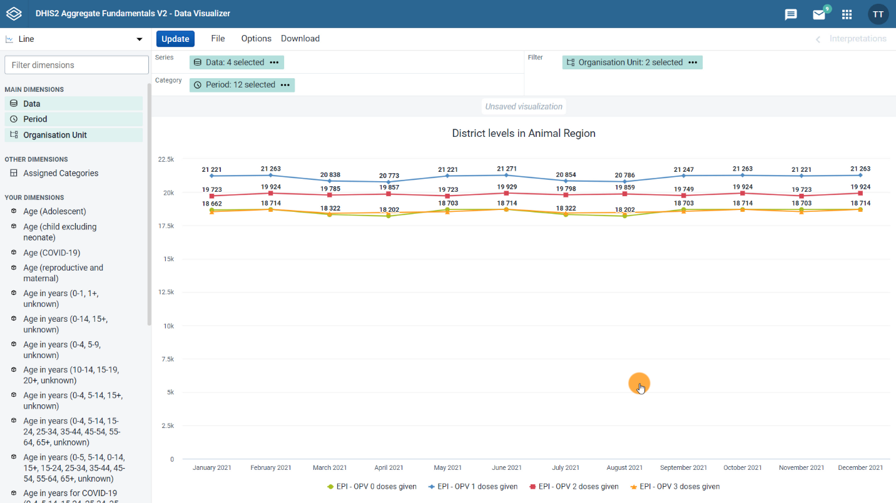

*Image 1 - A line chart created in the Data Visualizer app*

#### Instructions

**Create a line chart and select its dimensions**

1. Sign in to your account in **DHIS2 Trainingland (Analysis)**

2. In the upper left-hand corner of the **Data Visualizer app**, select **‘Line’** as the visualization type from the dropdown menu

3. Select the **data dimension**. In the data selection box, select the following:

    1. **Data type:** Data elements

    2. Use the **search field** to search for the keyword **“OPV”**

    3. In the list of available data elements, find the following data elements and move them to the selected items box:

        1. **EPI - OPV 0 doses given**

        2. **EPI - OPV 1 doses given**

        3. **EPI - OPV 2 doses given**

        4. **EPI - OPV 3 doses given**

    4. Select **‘Hide’** to store your selection and continue to edit the dimensions before updating the table

4. Select the **period dimension**. In the period selection box, select the following:

    1. The **fixed periods** tab

    2. **Period type:** Monthly

    3. **Year:** 2021

        1. In the list of available periods, select all the months from **January to December 2021**. This is a good opportunity to use the double right arrow

        2. In addition, double-click or use the arrows to move ‘Last 12 months’ from the selected items box to the available items box

4. Select **‘Hide’** to store your selection and continue to edit the dimensions before updating the table

5. Select the **organisation unit dimension.** In the organisation unit selection box, complete the following:

    1. In the organisation unit hierarchy, unselect Trainingland by clicking in the box next to its name

    2. Select **Animal Region**

    3. **Level:** District

    4. Select **‘Update’** to create the chart

6. You’ve successfully created a line chart in the Data Visualizer app

7. The next activity in this course will use the line chart you just updated. To **save** your chart, complete the follow steps:

    1. Select the **File** menu at the top of the chart

    2. Select **‘Save’** and give your chart a name. Please **include your initials** and an underscore at the beginning of the file name so it is easy to find. For example, **ABC_OPV Immunisations_Districts_2021**

        1. In the event your initials have already been used, simply add an additional letter or number

        2. Select **‘Save’** when finished

#### Knowledge check

**1. What are the steps to create a line chart? Drag the items above in the correct order below:**

    Select “Line” as the visualization type
    Select the data items
    Select the period
    Select the organisation unit
    Select “Update”
    Open the Data Visualizer app

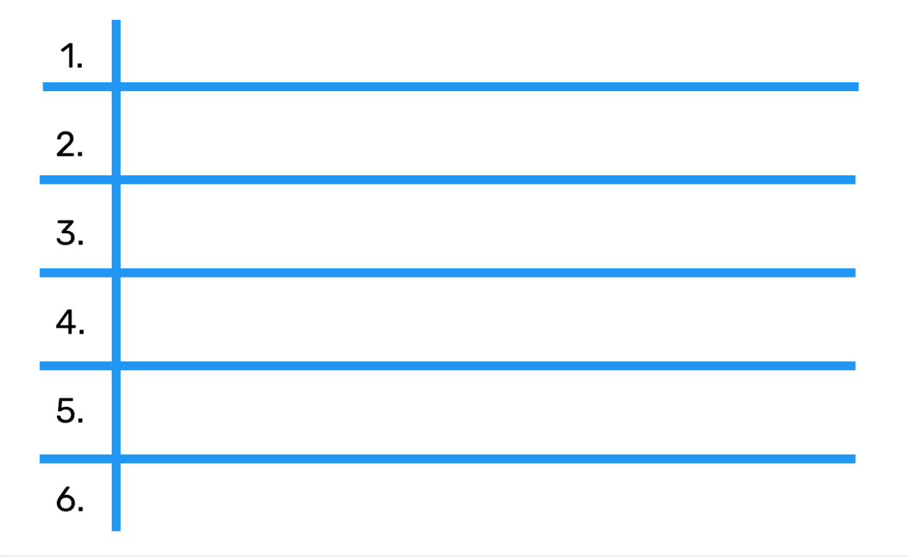

**Feedback**: To create a line chart, you first need to open the Data Visualizer app, then select ‘Line’ from the list of visualization types, then select the three dimensions: data items, period and organisation unit.

#### Creating a chart: Changing the layout and updating options

In the previous video, you learned how to create a line chart in DHIS2, a helpful visualization to see changes in data over time.

But what if we want to compare data from different locations instead of changes in data over time? In this video, you will learn about column charts that enable you to compare sizes of related elements, and you will learn about updating the chart layout and options.

[Creating a chart: Layout and options (YouTube)](https://youtu.be/gxRXzSl7J8c)

#### Activity - Creating a chart: Layout and options

[DHIS2 Analysis](https://academy.aggregate.dhis2.org/analysis/dhis-web-commons/security/login.action) – [DHIS2 Documentation](https://docs.dhis2.org/en/use/user-guides/dhis-core-version-master/analysing-data/data-visualizer.html#change-the-display-of-your-visualization) – [Printable version](https://academy.dhis2.org/courses/course-v1:hisp+GEN-D003-en+2022Q1/courseware/8eab85291ea843e0884121613f228e5e/0c865f7a6c7b436eaaddebff24150f65/?child=first)

*Please use the account details you have created for DHIS2 Trainingland (Analysis) in order to log in.*

#### Overview

In this activity, you will change the **layout** of the line chart you previously created, update the visualization type to a column chart to compare data across locations and add a custom title through the **Options** menu.

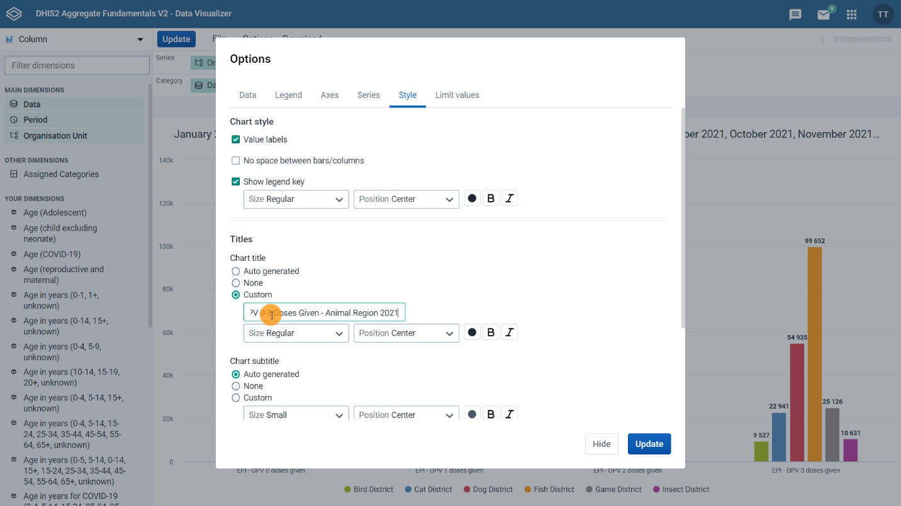

*Image 1 - A column chart with Options menu open and a custom table title added in the Style tab*

#### Instructions

**Change the chart layout, update to a column chart and explore chart options**

If you are continuing from the last section’s activity and are already signed in to Trainingland, you can skip steps 1-4 and proceed to step 5.

1. Sign in to your account in **DHIS2 Trainingland (Analysis)**

2. Navigate to the **Data Visualizer app** using the Apps menu

3. Click on **File** in the menu bar then select **‘Open’** from the dropdown menu

4. In the **Search by name** field, type your initials to easily find your saved chart. Once you have found your chart, simply click on it in the search results to open it

5. Let’s update the layout and visualization type to compare data across locations. In the **Data Visualizer app**, change the layout of the line chart you previously created in the last activity to the following:

    - **Series:** Organisation unit

    - **Category:** Data

    - **Filter:** Period

6. In the upper left-hand corner, select **‘Column’** as the visualization type from the dropdown menu and click ‘Update’. This visualization type will allow you to compare sizes of related elements

7. Click on the **Options** button then the **Style** tab. Give the column chart a **custom title** of your choice. For example, *OPV 0-3 Doses Given - Animal Region 2021*

    - Try some of the formatting options like size or color

8. You’ve successfully created a column chart and added a custom title for the visualization

9. The next activity in this course will use the chart you just updated. To **save** your chart, complete the follow steps:

    - Select the **File** menu at the top of the chart

    - Select **‘Save’** to save changes

#### Knowledge check

**1. For the line chart displayed in the screenshot, what would you need to change to show the districts in the series (instead of each month of 2021) and compare data across locations?**

*Select all that apply.*

    A. Drag and drop the dimensions to change the layout
    B. Select a different type of chart
    C. Select and adjust the options of the chart
    D. Add disaggregations

**Explanation**: In a chart, you can drag and drop the dimensions to change its layout and how data is displayed in the visualization. To show districts in the series, the organisation unit dimension needs to be in the series section of the layout. In addition, to best display this data and compare data across locations, you should select a chart that allows you to compare sizes of related elements, like column or bar chart.

**2. What would you need to do to add a title and subtitle to your chart?**

*Select one answer.*

    A. Drag and drop the dimensions to change the layout
    B. Select a different type of chart
    C. Select and adjust the options of the chart

**Explanation**: The Options menu allows you to add a title, update the style of the chart, add a target line, change the size of labels and more.

#### Creating a chart: Adding a disaggregation

As with pivot tables, you can also add disaggregations to charts. In this video, you will learn how to add disaggregations to a stacked bar chart.

[Creating a chart: Adding a disaggregation(YouTube)](https://youtu.be/ogAi8uCpIWo)

#### Activity: Creating a chart: Adding a disaggregation

[DHIS2 Analysis](https://academy.aggregate.dhis2.org/analysis/dhis-web-commons/security/login.action) – [DHIS2 Documentation](https://docs.dhis2.org/en/use/user-guides/dhis-core-version-master/analysing-data/data-visualizer.html#select-dimensions) – [Printable Version](https://academy.dhis2.org/courses/course-v1:hisp+GEN-D003-en+2022Q1/courseware/8eab85291ea843e0884121613f228e5e/0c865f7a6c7b436eaaddebff24150f65/?child=first)

*Please use the account details you have created for DHIS2 Trainingland (Analysis) in order to log in.*

#### Overview

In this activity, you will create a **stacked bar chart** and **add disaggregations** to the visualization.

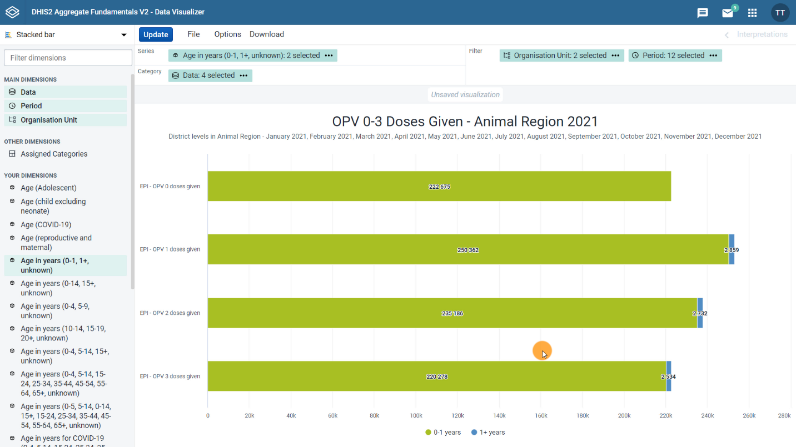

*Image 2 - A stacked bar chart with disaggregations*

#### Instructions

**Create a stacked bar chart and add disaggregations**

If you are continuing from the last section’s activity and are already signed in to Trainingland, you can skip steps 1-4 and proceed to step 5.

1. Sign in to your account in **DHIS2 Trainingland (Analysis)**

2. Navigate to the **Data Visualizer app** using the Apps menu

3. Click on **File** in the menu bar then select **‘Open’** from the dropdown menu

4. In the **Search by name** field, type your initials to easily find your saved chart. Once you have found your chart, simply click on it in the search results to open it

5. In the upper left-hand corner of the **Data Visualizer app**, select **‘Stacked bar’** as the visualization type from the dropdown menu

6. Modify the **layout** to the following:

    1. **Category:** Data

    2. **Filter:** Organisation unit and period

    3. **Series:** Select the disaggregation **“Age in years (0-1, 1+, unknown)”.** In the selection box, move the following items to the selected items box:

        1. **0-1 years**

        2. **1+ years**

        3. Click **‘Add to series’**

7. You’ve successfully created a stacked bar chart and added disaggregations to the visualization

8. The next activity in this course will use the chart you just updated. To **save** your chart, complete the follow steps:

    1. Select the **File** menu at the top of the chart

    2. Select **‘Save’** to save changes

#### Knowledge check

**1. One way to add a disaggregation to a chart in DHIS2 is to choose from the available dimensions and add them to the series or categories**

*Select one answer.*

    A. True
    B. False

**Explanation**: When you create a chart, you will find all the disaggregations available in your DHIS2 instance on the left-hand side. You can add these dimensions to the series or categories of your chart.

#### Creating a chart: Pie charts

So far, you have learned how to visualize data over time using a line chart, then how to use a column chart to better compare data across locations, and lastly, how to transform it into a stacked bar after adding disaggregations to display more granular data. In this video, we will see how we can transform this visualization into a pie chart. You will also see how the chart layout is different for a pie chart compared to the other chart types you’ve seen in the course.

[Creating a chart: Pie charts (YouTube)](https://youtu.be/LLbpVvvFvtc)

#### Activity - Creating a chart: Pie charts

[DHIS2 Analysis](https://academy.aggregate.dhis2.org/analysis/dhis-web-commons/security/login.action) – [DHIS2 Documentation](https://docs.dhis2.org/en/use/user-guides/dhis-core-version-master/analysing-data/data-visualizer.html#select-visualization-type) – [Printable version](https://academy.dhis2.org/courses/course-v1:hisp+GEN-D003-en+2022Q1/courseware/8eab85291ea843e0884121613f228e5e/0c865f7a6c7b436eaaddebff24150f65/?child=first)

*Please use the account details you have created for DHIS2 Trainingland (Analysis) in order to log in.*

#### Overview

In this activity, you will create a **pie chart** using the Data Visualizer app.

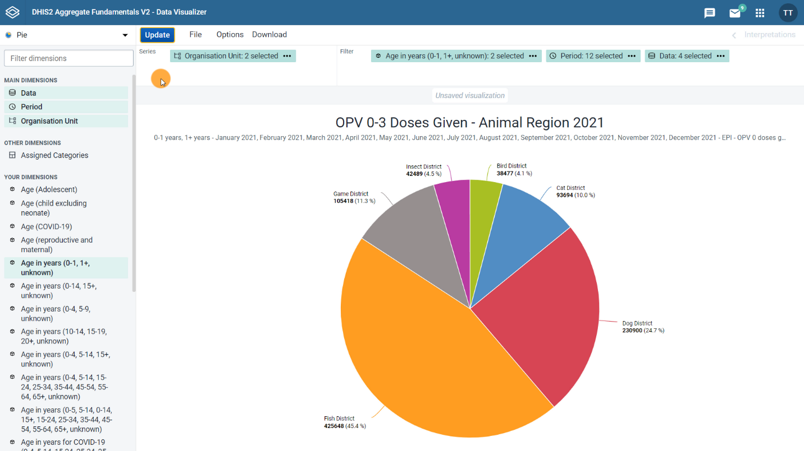

*Image 1 - A pie chart showing the distribution of OPV doses given across districts in Animal Region in 2021*

#### Instructions

**Create a pie chart**

If you are continuing from the last section’s activity and are already signed in to Trainingland, you can skip steps 1-4 and proceed to step 5.

1. Sign in to your account in **DHIS2 Trainingland (Analysis)**

2. Navigate to the **Data Visualizer app** using the Apps menu

3. Click on **File** in the menu bar then select **‘Open’** from the dropdown menu

4. In the **Search by name** field, type your initials to easily find your saved chart. Once you have found your chart, simply click on it in the search results to open it

5. In the upper left-hand corner of the **Data Visualizer app**, select **‘Pie’** as the visualization type from the dropdown menu

6. Notice the chart layout interface changes. The category dimension is no longer available; only the series and filter dimensions are available when a pie chart is selected as the visualization type

7. Modify the **layout** to the following:

    1. **Series:** Organisation unit

    2. **Filter:** Disaggregation, period and data (all other dimensions)

    3. Click **‘Update’**

8. You’ve successfully created a pie chart to display the total number of OPV doses given by district in Animal Region for the year 2021

9. To **save** your chart, complete the following steps:

    1. Select the **File** menu at the top of the chart

    2. Select **‘Save’** to save changes

#### Knowledge check

**1.  Which of the following types of charts would you select to visualize variation in data over time?**

*Select one answer.*

    A. Line chart
    B. Column chart
    C. Stacked bar char
    D. Pie chart

**Explanation**: A line chart can be used to track or compare how data change over time.

**2.  Which of the following types of charts would you select to compare data vertically across locations?**

*Select one answer.*

    A. Line chart
    B. Column chart
    C. Stacked bar chart
    D. Pie chart

**Explanation**: A column chart can be used to compare related elements vertically.

**3. Which of the following types of charts would you select to compare parts of a whole against related elements horizontally?**

*Select one answer.*

    A. Line chart
    B. Column chart
    C. Stacked bar chart*
    D. Pie chart

**Explanation**: A stacked bar chart can be used to compare parts of a whole against related elements horizontally.

**4. Which of the following types of charts would you select to compare parts of a whole at a single point in time?**

*Select one answer.*

    A. Line chart
    B. Column chart
    C. Stacked bar chart
    D. Pie chart

**Explanation**: A pie chart can be used to compare parts of a whole at a single point in time.

**5. A stacked bar or stacked column chart would be an ideal chart visualization for adding granularity to data analysis with disaggregations**

*Select one answer.*

    A. True
    B. False

**Explanation**: A stacked bar or stacked column chart gives you the option to add granularity to your data analysis and easily view disaggregations, like age or sex.

### 3.3 Module Quiz (10 min)

#### Module 3 Quiz

This is a graded quiz, and it is worth 10% of your final grade. You will find 10 multiple-choice, true or false, and drag and drop questions randomly selected from a question bank. You will have between **1 and 3 attempts** to answer each question correctly, and the quiz passing grade is 80%. You will find the number of attempts permitted by question next to the Submit button.

If you want to save your current response without submitting it for grading yet, select the "save" button. This allows you to come back later and resume the attempt.

**1. Which of the following chart types are useful for highlighting one key dimension, but are not suited for visualizing multiple dimensions at once?**

*Select all that apply.*

    A. Line
    B. Pie
    C. Single value
    D. Gauge
    E. Bar

**Explanation**: Pie, single value and gauge charts are useful to highlight one key dimension; they are not suited for visualizing multiple data dimensions at once.

**2. Where in the Data Visualizer app can you add a custom chart title and change the color set?**

*Select one answer.*

    A. Under the Options button, Style tab
    B. Under the Options button, Data tab
    C. Under the File menu, Edit tab

**Explanation**: To add a custom chart title and change the color set, click on the Options button then select the Style tab.

**3. Layout options in the Data Visualizer app are dynamic, meaning the features available depend on the type of chart you are viewing**

*Select one answer.*

    A. True
    B. False

**Explanation**: The layout is dynamic, meaning that the features available will depend on the type of chart you have selected.

**4. The Data Visualizer app includes which of the following visualization types?**

*Select all that apply.*

    A. Stacked area
    B. Year over year (line)
    C. Venn diagram
    D. Pivot table
    E. Segmented pyramid
    F. Column

**Explanation**: The Data Visualizer app has many visualizations for data analysis including: Stacked area, year over year (line), pivot table and single value. The Data Visualizer app does not include a Venn diagram or segmented pyramid as a visualization type.

**5. Let’s say we built a column chart to analyze the number of yellow fever vaccines administered by district in 2022. After analyzing the data, we decide we want to add additional granularity to the analysis and view data by age and sex.**

**How should you update the visualization to better suit your data analysis needs?**

*Select all that apply.*

    A. Change the visualization to a stacked bar or stacked column chart as they are better suited for disaggregations
    B. Modify the chart layout to include a disaggregation to the layout area
    C. Under “Your Dimensions” select the disaggregations for age and sex and add them to the visualization
    D. Select the Options button then the Style tab to include disaggregations for age and sex

**Explanation**: If you want to add granularity to the data analysis, stacked bar and stacked column charts are well suited visualization types for disaggregations. When adding a disaggregation to a visualization that is already built, you will need to modify the layout to include a disaggregation in the layout area. Under “Your Dimensions” you will need to select the disaggregations for age and sex and add them to the visualization. You cannot add disaggregations through the Options button or Style tab.

**6. In DHIS2 you can open a chart from a dashboard, modify it and save it for later use**

*Select one answer.*

    A. True
    B. False

**Explanation**: With the right user permissions in DHIS2, you can open a chart from a dashboard, change its dimensions, save it, share it with other users or download it.

**7. If you build a chart visualization and then decide to change to a different chart type, which of the following steps do you need to complete when changing the chart type?**

*Select all that apply.*

    A. Select the File menu then ‘Edit’ to find a new visualization type that suits your data analysis needs
    B. Select a new visualization type that suits your data analysis needs from the dropdown menu
    C. Consider if the chart layout needs to be adjusted for the new visualization type selected or to suit any new data analysis needs
    D. Select ‘Update’ to update the chart to the new visualization type that has been selected

**Explanation**: If you decide to change to a different chart type, you need to select a new visualization type that suits your data analysis needs from the dropdown menu. When changing chart types, consider if the chart layout needs to be adjusted for the new visualization type or to suit any new data analysis needs. When a new visualization type is selected from the dropdown menu, the data displayed in the chart does not automatically update to the new visualization type. You must select the ‘Update’ button to apply the changes and generate the new visualization.

**8. What would you need to do to add a title and subtitle to your chart?**

*Select one answer.*

    A. Drag and drop the dimensions to change the layout
    B. Select a different type of chart
    C. Select and adjust the options of the chart

**Explanation**: The Options menu allows you to add a title, update the style of the chart, add a target line, change the size of labels and more.

**9. Charts are graphical representations of data based on defined parameters. The data are represented by symbols, such as bars in a bar chart, lines in a line chart or slices in a pie chart**

*Select one answer.*

    A. True
    B. False

**Explanation**: Charts are graphical representations of data based on defined parameters. Within the charts, the data are represented by symbols, such as bars in a bar chart, lines in a line chart or slices in a pie chart.

**10. Drag and Drop Question**

In this module, you created 4 different charts. The decision on what type of chart to select depends on the type of data analysis you want to conduct. Drag and drop the chart type that best matches the desired data analysis.

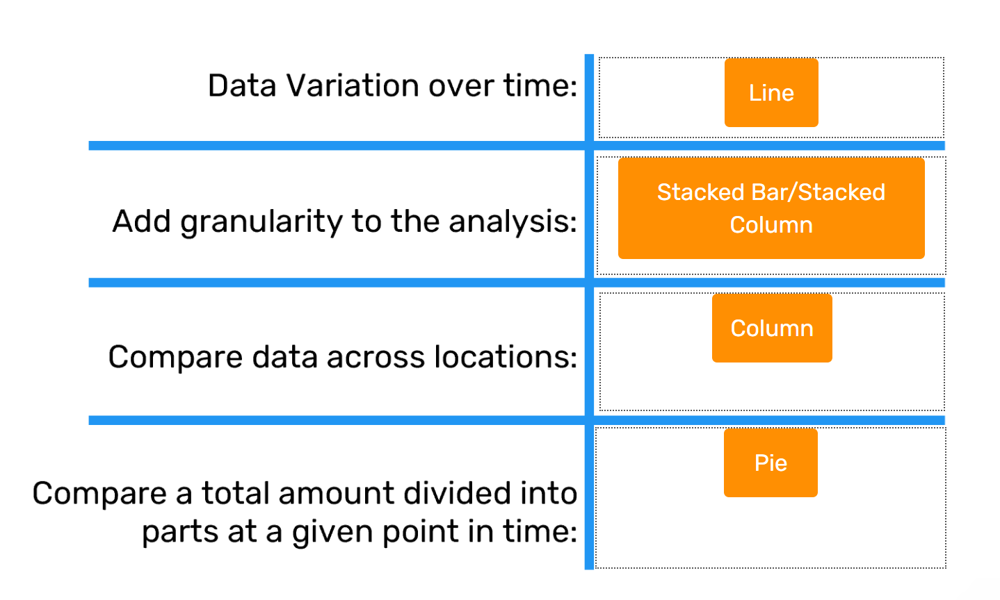

**Feedback**: The decision on what type of chart to select depends on the type of data analysis you want to conduct. To analyze data variation over time, a line chart can be used. To compare a total amount divided into parts at a given point in time, a pie chart can be used. To compare data across locations, a column chart can be used. To add granularity to the analysis, a stacked bar/stacked column can be used.

#### 3.4 Module Lab (15 min)

This is a **graded assessment** lab and it is worth **15%** of your final grade.

In order to answer the assessment lab questions, you will have to complete a task in the DHIS2 training instance, **Trainingland**. Sign in to your Trainingland account using the following link: [DHIS2 Analysis](https://academy.aggregate.dhis2.org/analysis)

You will have between **1 and 3 attempts** to answer each question correctly, and the lab passing grade is 80%. You will find the number of attempts permitted by question next to the Submit button.

If you want to save your current response without submitting it for grading yet, select the "save" button. This allows you to come back later and resume the attempt.

**1. In Trainingland, navigate to the “COVID-19 Surveillance (Aggregate)” dashboard. Find the chart “COVID-19 - Active and Closed Cases - Monthly”.**

**What type of chart is this visualization?**

*Select one answer.*

    A. Line
    B. Column
    C. Stacked column

**Explanation**: The “COVID-19 - Active and Closed Cases - Monthly” visualization is a stacked column chart. If you open this visualization in the Data Visualizer app, the chart type can be found in the upper right-hand corner of the app.

**2. In the Data Visualizer app, open the visualization type dropdown menu.**

**Which of the following visualization types could be used to compare sizes of related elements?**

*Select all that apply.*

    A. Column
    B. Bar
    C. Line
    D. Pie

**Explanation**: Different charts are better at communicating different types of data. When selecting your visualization type from the dropdown menu, the description under each chart name can help to guide you in the best chart type to use for your data. The column and bar charts can be used to compare sizes of related elements. The line chart is useful for tracking and comparing changes over time. The pie chart is helpful for comparing parts of a whole at a single point in time.

**3. In the Data Visualizer app, select a pie chart as the visualization type.**

**Which of the following is available for the pie chart’s layout?**

*Select all that apply.*

    1. Series
    2. Category
    3. Filter

**Explanation**: When a pie chart is selected as the visualization type, the category dimension is no longer available in the layout, only the series and filter dimensions are available.

**4. In the Data Visualizer app, create a line chart using the following information:**

1. Data: “EPI - DPT-HepB-HIB 1 doses given”, “EPI - DPT-HepB-HIB 2 doses given” and “EPI - DPT-HepB-HIB 3 doses given” (be sure to select the data elements, not the indicators).
2. Period: January - December 2021.
3. Organisation unit: Districts in Food Region (be sure to remove the current period).

**Which data element had the lowest number of doses given in 2021?**

*Select one answer.*

    A. EPI - DPT-HepB-HIB 1 doses give
    B. EPI - DPT-HepB-HIB 2 doses given
    C. EPI - DPT-HepB-HIB 3 doses given

**Explanation**: In this example, the data element “EPI - DPT-HepB-HIB 3 doses given” had the lowest number of doses given in 2021.

**5. In the Data Visualizer app, select a visualization that will allow you to compare data across locations (i.e. sizes of related elements). Use the following information to build the visualization:**

1. Data: “EPI - DPT-HepB-HIB 1 doses given”, “EPI - DPT-HepB-HIB 2 doses given” and “EPI - DPT-HepB-HIB 3 doses given” (be sure to select the data elements, not the indicators).

2. Period: January - December 2021.

3. Organisation unit: Districts in Food Region.

**Which data element had the highest number of doses given in June 2021?**

*Select one answer.*

    A. EPI - DPT-HepB-HIB 1 doses given
    B. EPI - DPT-HepB-HIB 2 doses given
    C. EPI - DPT-HepB-HIB 3 doses given

**Explanation**: In this example, the data element “EPI - DPT-HepB-HIB 2 doses given” had the highest number of doses given in June 2021.

**6. In Trainingland, navigate to the “HIV District (SNU2)” dashboard. Find the chart “HIV - HIV cascade by gender - 2021” and use the context menu to open it in the Data Visualizer app. Open the Options menu.**

**What is the name of the custom chart title?**

*Select one answer.*

    A. “HIV cascade by gender"
    B. “HIV cascade by gender - Trainingland - 2021”
    C. “HIV - HIV cascade by gender - 2021”

**Explanation**: In the Options menu, you can add and view custom chart titles under the Style tab. In this example, the custom title is “HIV cascade by gender”.

**7. In the Data Visualizer app, select stacked bar as the visualization type. Click on any disaggregation to open the selection box.**

**What are the available button options to add the disaggregation to the visualization?**

*Select all that apply.*

    A. Add to Chart Layout
    B. Add to Series
    C. Add to Category
    D. Add to Rows
    E. Add to Columns
    F. Add to Filter

**Explanation**: Within the selection box, you must use the button/down arrow to add the disaggregation to either the series, category or filter in the chart. Selecting the down arrow next to ‘Add to Series’ generates the additional options for adding the disaggregation to the category or filter.

**8. In the Data Visualizer app, create a stacked bar using the following information:**

1. Data: “EPI - DPT-HepB-HIB 1 doses given”, “EPI - DPT-HepB-HIB 2 doses given” and “EPI - DPT-HepB-HIB 3 doses given” (be sure to select the data elements, not the indicators).
2. Period: January - December 2021.
3. Organisation unit: Districts in Food Region. Find the disaggregation “Age in Years (0-1, 1+, unknown)” and add “1+ years” to the series.

Hint: You may need to modify the layout.

**Which data element had the highest number of doses given for those 1+ years old?**

*Select one answer.*

    A. EPI - DPT-HepB-HIB 1 doses given
    B. EPI - DPT-HepB-HIB 2 doses given
    C. EPI - DPT-HepB-HIB 3 doses given

**Explanation**: In this example, the data element “EPI - DPT-HepB-HIB 3 doses given” had the highest number of doses given for those 1+ years old. The recommended layout to easily analyze the data for this visualization is: The disaggregation in the series, data is the category, and the organisation unit and period in the filter.

**9. In the Data Visualizer app, create a pie chart to view the total number of HepB-HIB doses given by district in 2021 using the following information:**

1. Data: “EPI - DPT-HepB-HIB 1 doses given”, “EPI - DPT-HepB-HIB 2 doses given” and “EPI - DPT-HepB-HIB 3 doses given” (be sure to select the data elements, not the indicators).

2. Period: January - December 2021.

3. Organisation unit: Districts in Food Region. Find the disaggregation “Age in Years (0-1, 1+, unknown)” then add “0-1 years” and “1+ years” to the filter.

Hint: You may need to modify the layout.

**Which district administered the highest number of HepB-HIB doses in 2021?**

*Select one answer.*

    1. Vegetable Distric
    2. Dinner District
    3. Sweet District

**Explanation**: In this example, Dinner District had the highest number of HepB-HIB doses administered in 2021. The recommended layout to easily analyze the data for this visualization is: organisation unit in the series, and the data, period and disaggregation in the filter.

**10. In the Data Visualizer app, open the visualization type dropdown menu.**

**Which of the following chart types have the period recommended as the filter for the chart layout?**

*Select all that apply.*

    A. Column
    B. Stacked column
    C. Bar
    D. Line
    E. Pie
    F. Gauge

**Explanation**: In the visualization type dropdown menu, recommendations for chart layouts can be found in the description. DHIS2 recommends the period as the filter for column, bar, pie and gauge visualizations.

**11. In Trainingland, navigate to the “HIV District (SNU2)” dashboard. Find the chart “HIV - 2nd and 3rd 90s” and use the context menu to open it in the Data Visualizer app. Open the Options menu and explore the options selected in each of the tabs.**

**Select all the following statements that are TRUE about this visualization’s selected options**

*Select all that apply.*

    A. Custom sort order has been selected
    B. A target line has been added
    C. A title has been added to the vertical (y) axis
    D. A title has been added to the horizontal (x) axis
    E. A custom chart title has been added
    F. The bright color set has been selected

**Explanation**: Clicking on the Options button opens the visualization’s available options which can be selected to further customize the chart. In this example, a target line, title for the vertical (y) axis and a custom chart title has been added.

**12. In Trainingland, navigate to the “COVID-19 Surveillance (Aggregate)” dashboard. Open any pivot table and analyze the download options available. When finished, navigate back to the dashboard and open any chart visualization then analyze its download options.**

**Select all the following statements that are TRUE about the download options for these visualizations**

*Select all that apply.*

    A. Only pivot tables have plain data source downloads
    B. Pivot tables have table layout download options while charts have graphics download options
    C. Both pivot tables and charts have PDF download options
    D. Both pivot tables and charts have Excel download options

**Explanation**: While all visualizations have download options in DHIS2, the list of available download options depends on the visualization type. Pivot tables have table layout download options such as Excel, CSV and HTML, while charts have graphics download options such as Image and PDF. Both pivot tables and charts have Excel download options as well as other plain data source download options.

### 3.5 Module Summary (3 min)

#### Module 3 Summary

You have now reached the end of the third module for the Data Analysis in DHIS2 course. In this module, you have learned:

- **Charts** are graphical representations of data based on defined parameters. The data are represented by symbols, such as bars in a bar chart, lines in a line chart or slices in a pie chart

- DHIS2 provides several different types of charts within the **Data Visualizer** **app** to allow users to select the type that fits their data best

- When selecting a visualization type, you can read the visualization description and recommendations to gain a better understanding of which visualization type is the best for your data analysis needs

- Charts can be **altered** by changing the **dimensions** and the **layout**, and using the different **options** available to customize how the charts look

- Just like pivot tables, you can add **disaggregations** to your chart to add granularity to the data analysis

- Charts can also be **saved**, **shared** or **downloaded** with just a couple of clicks

- To **create** a chart:

  - Open the **Data Visualizer app**

  - Select the **type of chart** you want from the visualization type dropdown menu.

  - Select the 3 dimensions:

    - Data items

    - Periods

    - Organisation units

  - Click **Update**

- To modify a chart in the Data Visualizer app, you can:

  - Select another type of chart available in the app

  - **Rearrange** the dimensions in the **layout** area

  - Use the **options** to further customize your chart and add additional features like add a custom table title and subtitle

#### Discussion forum

As we are reaching the end of the module, let's take some time to reflect on what you've learned and discuss the key concepts covered so far. To do it, please click on the following link to the course discussion forum on the CoP to join this specific discussion topic:

**Analyzing charts to make informed decisions**

[**Click to join the discussion**](https://community.dhis2.org/t/module-3-analyzing-charts-to-make-informed-decisions/46778)

*[Note that if you can't see the page (or if you reach an “Oops! That page doesn’t exist or is private.”), please use [this invitation link](https://community.dhis2.org/invites/BpYsHecoFm) first to gain access to the private course discussion forum]*

In this module, you had the chance to create and edit a chart in Trainingland, our DHIS2 training instance.

Please share your impressions of the Data visualizer app features with your peers: How was your experience editing and creating a chart? What did you find most useful? Did you find any challenges when interacting with DHIS2 when creating a chart? Do you have any recommendations on selecting the appropriate type of chart from the available options?

Please feel free to share your experience, read your peers’ responses and reflect on what you have learned so far in the course.
Thank you!

Even though this is an optional activity, we strongly recommend you take some time to think about your new knowledge, read what other course participants think, and make connections with your own prior experience and current learning needs. This will help you reinforce what you have learned and prepare for the next module.

Once you are done on the CoP, click the link at the top of the discussion topic page to be redirected back to the course to fill out the module feedback survey.

If you are not joining the discussion on this module, simply click the next button below to continue to the survey.

### 3.6 Feedback Survey (2 min)

Once you are done with the module, please take 2 or 3 minutes to complete this feedback survey. Your careful response will have a real impact on how courses like this are run. Thank you!

## Module 4 – Creating and analyzing maps (1 hr 30 min)

### 4.0 Overview of the module (3 min)

#### What is in this module?

How can we create maps to visualize aggregate data in DHIS2? How can we add different layers of information to a map? What are the features available in DHIS2 to create and edit maps for data visualization? In this module, you will learn how to create and edit maps, the third data visualization tool we’ll cover in this course. You will see how to create your map by selecting a base map, adding different layers, using and customizing the legend, as well as additional features.

#### Learning objectives

By the end of this module, you should be able to:

- Identify the steps to create and edit a map

#### How will you be evaluated?

At the end of the module, you will find 2 graded activities:

- **Quiz**: 10 multiple choice, true or false, and drag and drop questions randomly selected from a question bank. You will have between **1 and 3 attempts** to answer each question correctly, and the quiz passing grade is 80% or higher. You will find the number of attempts permitted by question next to the Submit button. This quiz contributes to 10% of your final grade.

- **Assessment lab**: you will be asked to perform specific tasks in our DHIS2 training instance. After completing these tasks, you will have to answer multiple choice questions to assess your comprehension of the exercise. This assessment lab contributes to 15% of your final grade.

#### How long will this module take?

The module should take about **90 minutes** to complete.

### 4.1 Orientation to maps (30 min)

#### Orientation to maps

How can maps help you visualize and analyze data? In this first video of maps in DHIS2, we will cover some basic concepts about using maps as visualization tools. You will also see how maps are built using basemaps and layers and will start to hear about some key layers used in DHIS2: thematic, facilities and boundaries.

[Orientation to maps(YouTube)](https://youtu.be/_Zptpl7mtnQ)

[DHIS2 Documentation- Maps](https://docs.dhis2.org/en/use/user-guides/dhis-core-version-master/analysing-data/maps.html)

#### Knowledge check

**1. The technology that provides DHIS2 the capacities to link data with a location is called**

*Select one answer.*

    A. GIS
    B. GPS
    C. Bing
    D. Google

**Explanation**: GIS which is the acronym for geographic information system provides the ability for capturing, storing, checking, and displaying data related to positions on a map. In other words, GIS provides the ability to link maps to data.

**2. In DHIS2, you can create a map with multiple layers of data with one on top of the other**

*Select one answer.*

    A. True
    B. False

**Explanation**: In DHIS2, layers can be stacked on top of each other to be combined into a single visual analysis.

**3. Which of the following options can be shown in a map layer?**

*Select all that apply.*

    A. Facilities
    B. Data items (e.g. vaccination coverage)
    C. Population
    D. Temperature
    E. Land use

**Explanation**: All these are topics that can be displayed as layers in a map.

**4. The main layers used to analyze aggregate data in DHIS2 are the thematic, facilities and boundaries layers. Match the layers with their definitions.**

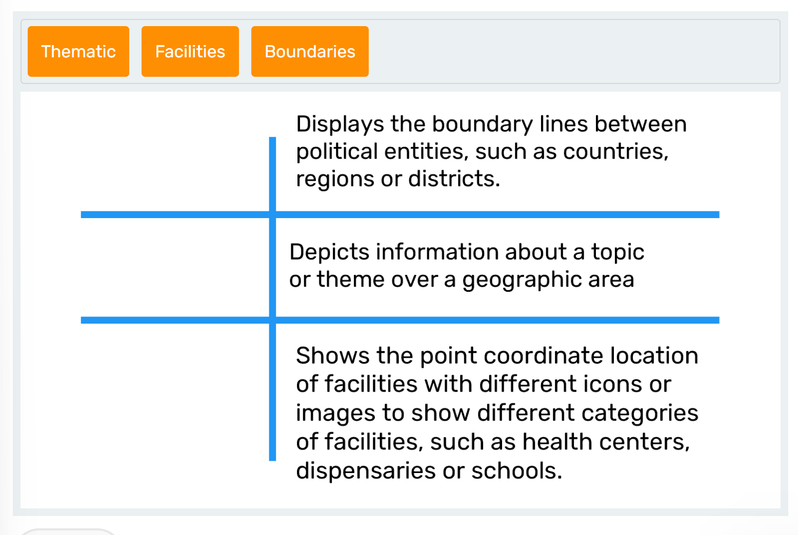

**Feedback**: A thematic layer depicts information about a topic or theme over a geographic area. A facilities layer shows the point coordinate location of facilities with different icons or images to show different categories of facilities, such as health centers, dispensaries or schools. A boundaries layer displays the boundary lines between political entities, such as countries, regions or districts.

#### Orientation to the Maps app

In this video, you will see how to access the Maps app, and learn about the Maps app interface and main features.

[Orientation to the Maps app(YouTube)](https://youtu.be/Fsr64tRMjYc)

#### Documentation
[DHIS2 Documentation - Maps ](https://docs.dhis2.org/en/use/user-guides/dhis-core-version-master/analysing-data/maps.html)

#### Knowledge check

**1. Drag and drop the sections of the Maps app interface where they belong.**

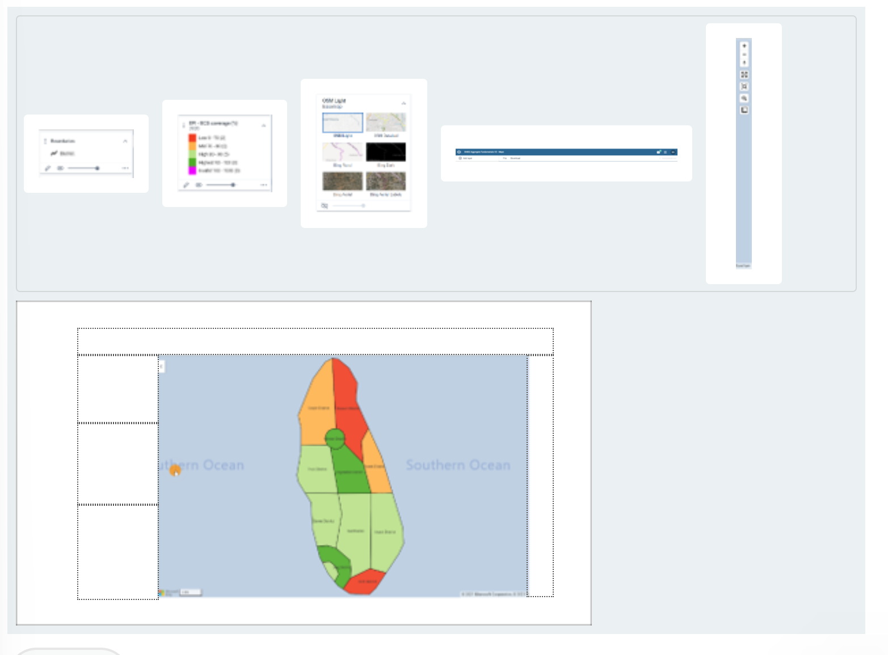

**Feedback**: Top Left: The Boundary Layer section. Middle left: Thematic Layer. Bottom Left: Basemap. Top bar menu: To save, share and download the map. Right: Where options to zoom in and out are found.

### 4.2 Creating a map (30 min)

#### Creating a map: Basemaps and boundary layers

In this video, you will see the basemaps that are available by default in the DHIS2 Maps app and learn how to select one of them for creating your map. You’ll also identify the steps to add a boundary layer to show all the districts of a country.

[Creating a map: Basemaps and boundary layers (YouTube)](https://youtu.be/nOpNDMZBELo)

#### Activity - Creating a map: Basemaps and boundary layers

[DHIS2 Analysis](https://academy.aggregate.dhis2.org/analysis/dhis-web-commons/security/login.action) – [DHIS2 Documentation](https://docs.dhis2.org/en/use/user-guides/dhis-core-version-master/analysing-data/maps.html#using_maps_create_map) – [Printable version](https://academy.dhis2.org/courses/course-v1:hisp+GEN-D003-en+2022Q1/courseware/d3dd7977650644189c9950b58f9b6c0c/e333fd827ae343cca7bd76287df508b7/?child=first)

*Please use the account details you have created for DHIS2 Trainingland (Analysis) in order to log in.*

#### Overview

In this activity, you will **create a map** from the available **basemaps**, and add a **boundary layer** to identify any territories.

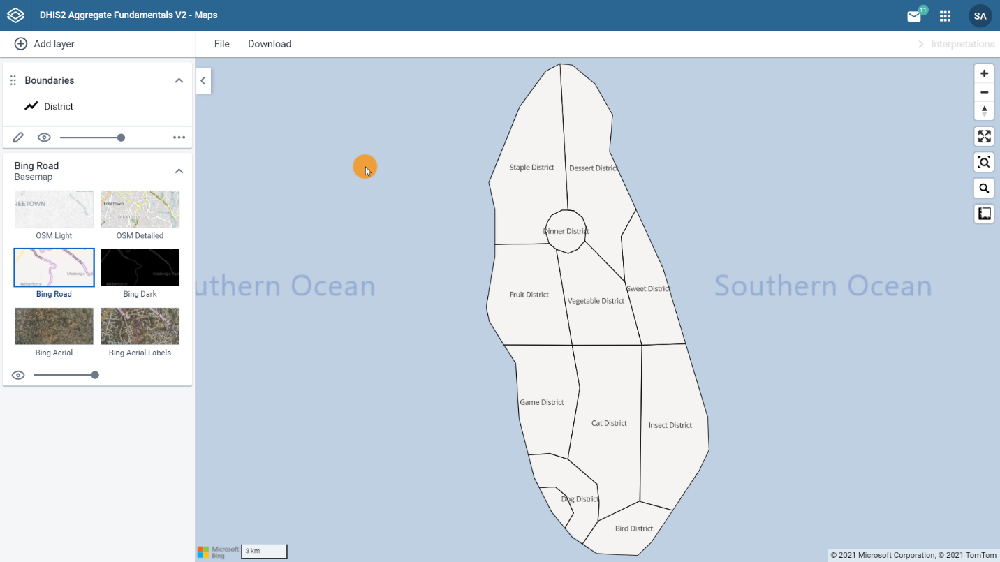

*Image 1 - A DHIS2 basemap of Trainingland with boundary layers added for districts*

#### Instructions

Select a basemap and add a boundary layer:

1. Sign in to your account in **DHIS2 Trainingland (Analysis)**

2. Navigate to the **Maps app** using the Apps menu

3. On the left-hand side of the app, you can **select a basemap**

    1. You can see that OSM Light is the default basemap

    2. Click on the six different basemaps to see how the different features available

    3. When you are finished exploring the different basemaps, select the **Bing Road** basemap

4. **Add a layer** to your map by selecting the **‘Add layer’** button in the upper left-hand corner

    1. From the list of options, select **‘Boundaries’** to add a boundary layer

    2. In the configuration dialog box, select **‘Trainingland’** in the organisation unit hierarchy

    3. In the select levels field, select **‘District’** to add boundaries for all districts within Trainingland

    4. In the **Style tab**, select the box next to **Labels** to enable district names to be shown in the map

    5. Click on **‘Add layer’** to create the boundary layer

5. You’ve successfully created a map with a basemap and boundary layer in DHIS2

6. The next activity in this course will use the map you just updated. To **save** your map, complete the following steps:

    1. Select the **File** menu at the top of the map

    2. Select **‘Save’** and give your map a name. Please **include your initials** and an underscore at the beginning of the file name so it is easy to find. For example, ***ABC_**Trainingland Map_District*

        1. In the event your initials have already been used, simply add an additional letter or number

        2. Select **‘Save’** when finished

#### Knowledge check

**1. What are the steps to create a map showing boundaries? Drag and drop the items in the correct order:**

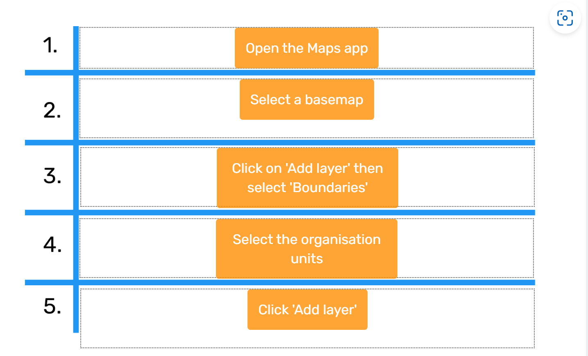

**Feedback**: To create a map in DHIS2, first open the Maps app from the Apps menu. In the Maps app, select a basemap then add a boundary layer by selecting the organisation unit boundaries you want to view in the map.

#### Creating a map: Thematic layer

Thematic layers are one of the most common layers used in DHIS2. Building upon the map we created in the previous video, in this video you’ll learn how to add a thematic layer, how to select its dimensions and the options available to style your map.

[Creating a map: Thematic layer (YouTube)](https://youtu.be/ONgmyeOGWg0)

#### Activity - Creating a map: Thematic layer

[DHIS2 Analysis](https://academy.aggregate.dhis2.org/analysis/dhis-web-commons/security/login.action) – [DHIS2 Documentation](https://docs.dhis2.org/en/use/user-guides/dhis-core-version-master/analysing-data/maps.html#using_maps_thematic_layer) – [Printable version](https://academy.dhis2.org/courses/course-v1:hisp+GEN-D003-en+2022Q1/courseware/d3dd7977650644189c9950b58f9b6c0c/e333fd827ae343cca7bd76287df508b7/?child=first)

*Please use the account details you have created for DHIS2 Trainingland (Analysis) in order to log in.*

#### Overview

In this activity, you will **add a thematic layer** to your map and explore various style options available for the thematic layer.

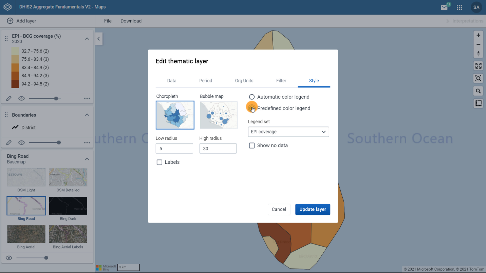

*Image 1 - Editing the style of the thematic layer in the Maps app*

#### Instructions

**Add a thematic layer**

If you are continuing from the last section’s activity and are already signed in to Trainingland, you can skip steps 1-4 and proceed to step 5.

1. Sign in to your account in **DHIS2 Trainingland (Analysis)**

2. Navigate to the **Maps app** using the Apps menu

3. Click on **File** in the menu bar then select **‘Open’** from the dropdown menu

4. In the **Search by name** field, type your initials to easily find your saved map*.* Once you have found your map, simply click on it in the search results to open it

5. In the Maps app, add an additional **layer** (to the map you previously created in the last activity) by selecting the **‘Add layer’** button in the upper left-hand corner

    1. From the list of options, select **‘Thematic’** to add a thematic layer

    2. In the **Data tab** of the configuration dialog box**,** select the following:

        1. **Item type:** Indicator

        2. **Indicator group:** Immunization - coverages

        3. **Indicator:** EPI - BCG coverage (%)

    3. In the **Period tab,** select the following:

        1. **Period type:** Yearly

        2. **Period:** 2020

    4. In the **Org Units (i.e. Organisation Units) tab, select the** following:

        1. Select **‘Trainingland’** in the hierarchy

        2. Select **‘District’** as the level and remove ‘Region’

    5. In the **Style tab**, select the following:

        1. Choropleth map

        2. Automatic color legend

        3. **Classification:** Equal intervals

        4. Select **‘Add layer’**

6. You will now see a thematic map with BCG coverage. In the thematic card layer, analyze how the thematic intervals display the data in the map

    1. How many intervals are there? What is the range of each interval? How many data values are there in each interval?

7. Let’s **edit** the thematic layer and change the classification to ‘Equal counts’ since it is better suited for our data item, which is counts rather than measurements

8. Click on the **pencil icon** in the layer card to open the dialog and return to the **Style tab**

    1. Under **classification**, select **‘Equal counts’**

    2. Select **‘Update layer’**

9. You will now see a thematic map with BCG coverage with equal counts. How do these intervals differ from the ones previously seen with equal intervals?

10. Let’s continue to edit the style of the thematic layer. Select the **pencil icon** in the layer card to open the dialog and return to the **Style tab**

    1. Select the **predefined color legend**

    2. **Legend set:** EPI - coverage

    3. Click ‘Update layer’

11. Now you can see the legend with 5 classes, their classification and color scheme.

12. Since the thematic layer is higher up in the layer order than the boundary layer, the district names are no longer visible in the map. Drag and drop the boundary layer above the thematic layer

13. You’ve successfully added a thematic layer to your map, showing BCG coverage by district in Trainingland for 2020

14. The next activity in this course will use the map you just updated. To **save** your map, complete the following steps:

    1. Select the **File** menu at the top of the map

    2. Select **‘Save’** to save the changes

#### Knowledge check

**1. Within a map layer, you can only select one period type**

*Select one answer.*

    A. True
    B. False

**Explanation**: Within a map layer, only one period type can be selected, either fixed or relative period.

**2. You can select one or more data items within a map layer**

*Select one answer.*

    A. True
    B. False

**Explanation**: Since maps use the concept of layers to add data, there can only be one data item selected in each layer.

**3. Which of the following sentences are correct about the automatic color legend**

*Select all that apply.*

    A. The user decides whether to use equal intervals or equal counts
    B. The user selects the number of classes
    C. The user selects the color scheme
    D. The user selects a legend set

**Explanation**: The automatic color legend means that the application will create a legend set for you based on the classification, number of classes and color scheme you select. In the predefined color legend, a user selects a legend set.

**4. Equal intervals will divide the range of values into equally sized classes**

*Select one answer.*

    A. True
    B. False

**Explanation**: Equal intervals will divide the range of values into equally sized classes using the following formula: Highest data value – (minus) lowest data value / (divided by) number of classes.

**5. Equal counts will distribute the data values equally along the number of classes that are made**

*Select one answer.*

    A. True
    B. False

**Explanation**: Equal counts will distribute the data values equally along the number of classes that are made.

#### Creating a map: Interpreting legends and data tables

In this last video of the Maps app series, you will see how to read and interpret map legends and data tables. Continuing with the example you’ve seen in previous videos, you will learn how to view data within a data table and its different filter options for data analysis in the Maps app.

[Creating a map: Interpreting legends and data tables (YouTube)](https://youtu.be/RQngcSHtEx0)

#### Activity - Creating a map: Interpreting legends and data tables

[DHIS2 Analysis](https://academy.aggregate.dhis2.org/analysis/dhis-web-commons/security/login.action) – [DHIS2 Documentation](https://docs.dhis2.org/en/use/user-guides/dhis-core-version-master/analysing-data/maps.html#filter-values-in-a-thematic-layer) – [Printable version](https://academy.dhis2.org/courses/course-v1:hisp+GEN-D003-en+2022Q1/courseware/d3dd7977650644189c9950b58f9b6c0c/e333fd827ae343cca7bd76287df508b7/?child=first)

*Please use the account details you have created for DHIS2 Trainingland (Analysis) in order to log in.*

#### Overview

In this activity, you will **interpret legends** and **data tables** in the Maps app. You will also apply filters in the data table to see how you can filter data within the table to find information you need for data analysis.

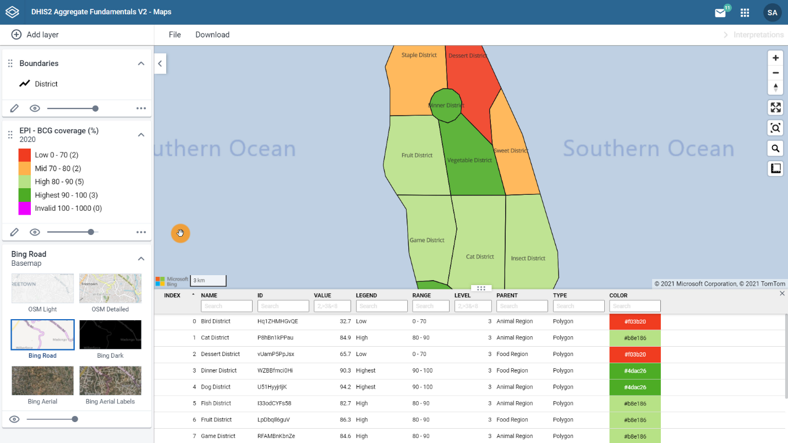

*Image 1 - A data table opened in the Maps app*

#### Instructions

If you are continuing from the last section’s activity and are already signed in to Trainingland, you can skip steps 1-4 and proceed to step 5.

1. Sign in to your account in **DHIS2 Trainingland (Analysis)**

2. Navigate to the **Maps app** using the Apps menu

3. Click on **File** in the menu bar then select **‘Open’** from the dropdown menu

4. In the **Search by name** field, type your initials to easily find your saved map*.* Once you have found your map, simply click on it in the search results to open it

5. In the Maps app, **analyze the legend** within the thematic layer card

    1. How many classes are there? What colors are associated with higher levels of vaccination coverage?

    2. How many organisation units fall into each of the classes?

6. Within the map, **hover over Game District** to see the exact data value for vaccination coverage in the district

    1. What is the data value?

    2. Hover over the other districts to explore and find their data values

7. Generate a **data table** to show the data values of each district instead of hovering over each of them to get the data values

    1. In the thematic layer card, click on the **ellipsis icon** to open the **more actions menu** then select **‘Show data table’**

    2. The data table will appear under the map

8. **Filter the data table** to only show districts whose parent organisation unit is **Food Region**

    1. Under the parent column header, enter ‘Food’ to filter the data in the table

    2. When the filter is applied, how does the data table and the map visualization change?

    3. When you are finished, remove the filter and close the data table by selecting ‘Hide data table’ from the more actions menu

9. You’ve successfully interpreted the map legend and data table for the map you created in DHIS2

10. To **save** your map, complete the following steps:

    1. Select the **File** menu at the top of the chart

    2. Select **‘Save’** to save changes

#### Knowledge check

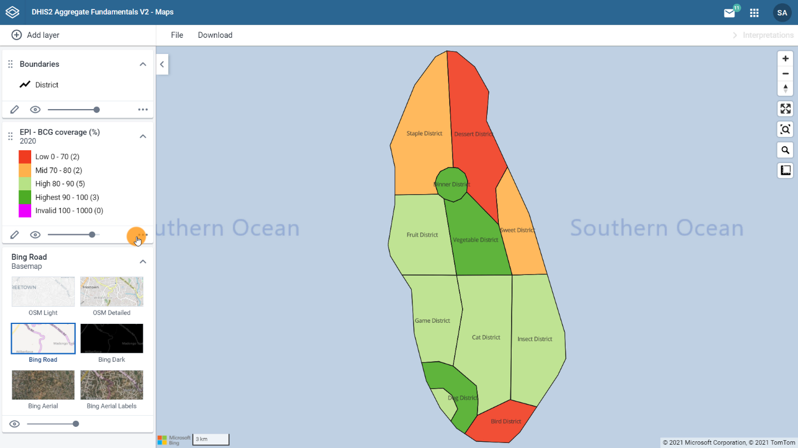

**1. How many districts have a BCG vaccination coverage between 80% and 90%?**

*Select one answer.*

    A. 0
    B. 2
    C. 3
    D. 5

**Explanation**: There are 5 organisation units with EPI-BCG coverage between 80% - 90%. You can find this information in the legend as “High 80 – 90 (5)”.

**2. What is the percentage of vaccination coverage for the districts appearing in red?**

*Select one answer.*

    A. Less than 51%
    B. Less than 61%
    C. Less than 71%
    D. Less than 81%

**Explanation**: Districts in red have less than 71% of EPI-BCG coverage. For this predefined color legend, system administrators chose the color red to indicate low vaccination coverage, making it easy to view data based on project goals.

### 4.3 Module Quiz (10 min)

This is a **graded quiz** and it is worth **10%** of your final grade.

You will find 10 multiple-choice, true or false, and drag and drop questions randomly selected from a question bank. You will have between **1 and 3 attempts** to answer each question correctly, and the quiz passing grade is 80%. You will find the number of attempts permitted by question next to the Submit button.

If you want to save your current response without submitting it for grading yet, select the "save" button. This allows you to come back later and resume the attempt.

**1. Which of the following provides geographic information and serves as a background to any map in DHIS2**

*Select one answer.*

    A. A basemap
    B. A thematic layer
    C. A boundaries layer

**Explanation**: Each map starts with a basemap. A basemap is a layer with geographic information that serves as a background to any map created in DHIS2. There are several options of basemaps from OpenStreetMap and Microsoft Bing maps.

**2. Select the following statements that are TRUE about the automatic color legend**

**Select all that apply.**

    A. The user decides whether to use equal intervals or equal counts
    B. The user selects a legend set
    C. The user selects the number of classes and the color scheme
    D. The color legend is predefined by system administrators

**Explanation**: With the automatic color legend, the user decides whether to use equal intervals or equal counts. With the automatic color legend, the user selects the number of classes and the color scheme. With a predefined color legend, the color legend is predefined by system administrators and the user must select a legend set.

**3. What are the three main control sections in the Maps app?**

*Select all that apply.*

    A. The basemap on the left-hand side of the map
    B. The layers section with the layer cards on the left-hand side of the map
    C. The zooming options on the right-hand side of the map
    D. The file menu in the top bar above the maps

**Explanation**: The Maps app is designed with three main control sections: 1) the layers section with the layer cards on the left-hand side of the map 2) the zooming options on the right-hand side of the map 3) the file menu in the top bar above the map.

**4. If you create a map and want the district names to show, what do you need to do in the Maps app?**

*Select all that apply.*

    A. Ensure the labels box is selected in the Style tab of the boundary layer**
    B. Ensure you have selected ‘Show organisation unit titles’ in the Organisation Unit tab of the boundary layer

**Explanation**: In the boundary layer, ensure the labels box is selected in the Style tab.

**5. Select the following statements that are TRUE about map legends and data tables**

*Select all that apply.*

    A. A map legend conveys the meaning of symbols and colors on a map, helping you to understand and interpret the data on a map
    B. Data from maps can be shown in a table below the map visualization
    C. In the Style tab of the thematic layer, there are three options for color legends: automatic, predefined and custom
    D. When a filter is applied in a data table, the filter only applies to the data displayed in the table, it does not update the data in the map visualization

**Explanation**: In DHIS2, a map legend conveys the meaning of symbols and colors on a map, helping you to understand and interpret the data on a map. Data from maps can be shown in a table below the map visualization. When a filter is applied in a data table, the filter applies to the data displayed in both the table and the map visualization. In the Style tab of the thematic layer, there are only two options for color legends: automatic and predefined.

**6. What are the main layers used to analyze aggregate data in DHIS2?**

*Select all that apply.*

    1. Boundaries
    2. Tracked entities
    3. Thematic
    4. Facilities
    5. Population

**Explanation**: The main layers used to analyze aggregate data in DHIS2 are the thematic, facilities and boundaries layers.

**7. Select the following statements that are TRUE about map layers**

*Select all that apply.*

    A. In DHIS2, you can create maps with multiple layers
    B. Within a map layer, you can only select one period type
    C. You can select one or more data items within a map layer
    D. Once layers have been added to the map, they cannot be reordered or edited
    E. You can edit a layer by selecting the pencil icon in the layer card

**Explanation**: In DHIS2 you can create maps with multiple layers, such as a map with a boundary layer and a thematic layer. Within a map layer, you can only select one period type. Since maps use the concept of layers to add data, there can only be one data item selected in each layer. Layers can be reordered and edited (with the exception of basemaps which cannot be reordered or edited). You can edit a layer by selecting the pencil icon in the layer card (with the exception of basemaps which cannot be edited)

**8. What are the steps to create a map showing boundaries? Drag and drop the items in the correct order:**

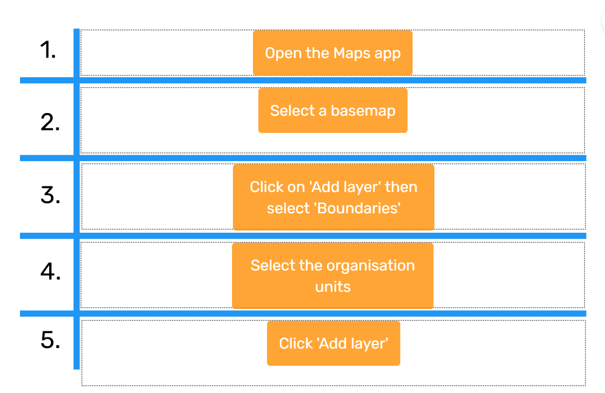

**Feedback**: To create a map in DHIS2, first open the Maps app from the Apps menu. In the Maps app, select a basemap then add a boundary layer by selecting the organisation unit boundaries you want to view in the map.

**9. Match the map layers with their definitions.**

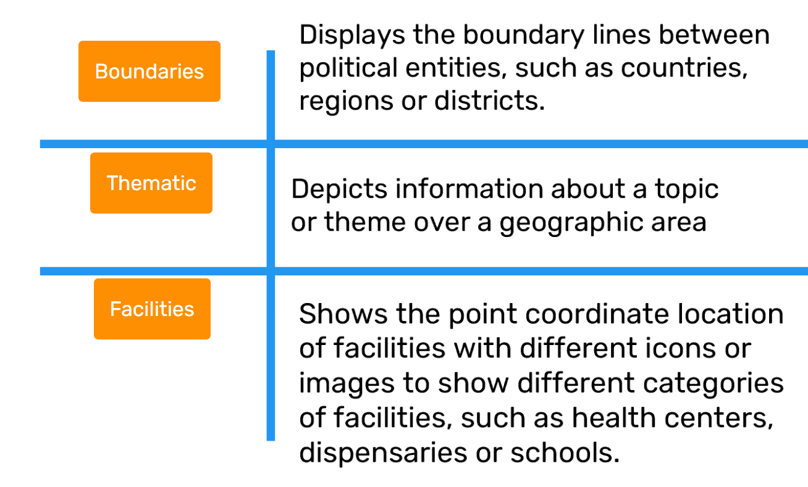

**Feedback**: A thematic layer depicts information about a topic or theme over a geographic area. A facilities layer shows the point coordinate location of facilities with different icons or images to show different categories of facilities, such as health centers, dispensaries or schools. A boundaries layer displays the boundary lines between political entities, such as countries, regions or districts.

**9. Drag and drop the sections of the Maps app interface where they belong.**

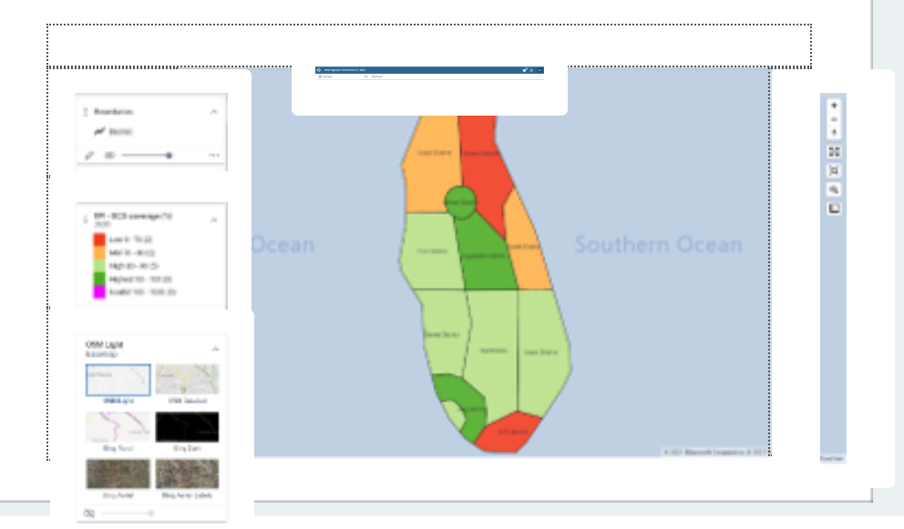

**Feedback**: Top Left: The Boundary Layer section. Middle left: Thematic Layer. Bottom Left: Basemap. Top bar menu: To save, share and download the map. Right: Where options to zoom in and out are found.

### 4.4 Module Lab (15 min)

This is a **graded assessment** lab and it is worth **15%** of your final grade.

In order to answer the assessment lab questions, you will have to complete a task in the DHIS2 training instance, **Trainingland**. Sign in to your Trainingland account using the following link: [DHIS2 Analysis](https://academy.aggregate.dhis2.org/analysis)

You will have between **1 and 3 attempts** to answer each question correctly, and the lab passing grade is 80%. You will find the number of attempts permitted by question next to the Submit button.

If you want to save your current response without submitting it for grading yet, select the "save" button. This allows you to come back later and resume the attempt.

**1. In the Maps app, add a boundary layer for districts in Trainingland and a thematic layer for the indicator “COVID-19 - Case Fatality rate (%)” from the indicator group “COVID-19” for the period of 2021 in the districts of Trainingland.**

**Which districts experienced the highest case fatality rates in Trainingland in 2021?**

*Select one answer.*

    A. Dog District and Fish District
    B. Staple District and Vegetable District
    C. Fruit District and Vegetable District

**Explanation**: In this example, the Staple District and Vegetable District experienced the highest ICU bed occupancy rates with over 7%. Adding labels in the boundary layer and having the boundary layer at the top of the layer cards will help you see the names of the districts.

**2. In Trainingland, navigate to the “Immunisation maps” dashboard. Open any map from the dashboard in the Maps app.**

**What are the download options available?**

*Select all that apply.*

    A. Download as JPEG
    B. Download as PDF
    C. Show name
    D. Show legend
    E. Legend position

**Explanation**: In the Maps app, the download options for maps are: show name, show legend and legend position. The format (png) cannot be changed.

**3. Which of the following are basemaps in the Maps app?**

*Select all that apply.*

    A. Bing Road
    B. OSM Light
    C. OSM Dynamic
    D. Bing Aerial
    E. GIS Pro

**Explanation**: The Maps app has 6 basemaps available including: Bing Road, OSM Light and Bing Aerial.

**4. In Trainingland, navigate to the “Immunisation maps” dashboard. Find the map “EPI - DPT 1-3 dropout rate by district” and use the context menu to open it in the Maps app. Select the option needed to show the data table for the thematic layer.**

**Which of the following are column headers in the data table?**

*Select all that apply.*

    A. Color
    B. Parent
    C. Data entry date
    D. Value
    E. Range

**Explanation**: To show a data table, you need to select the more actions menu in the layer card then ‘Show data table’. Column headers for this data table include: Color, parent, value and range. Data entry date is not a column header available in the data table.

**4. In Trainingland, navigate to the “HIV District (SNU2)” dashboard. Find the map “HIV - ART retention rate by user and sub-orgunits - 2021” and use the context menu to open it in the Maps app. In one of the thematic layers, click on the Style tab.**

**Which of the following style options have been selected for this map?**

*Select all that apply.*

    A. Bubble map
    B. Choropleth map
    C. Automatic color legend
    D. Classification: Equal counts
    E. Predefined color legend
    F. Legend set: HIV default (%)

**Explanation**: This map visualization uses a choropleth map with a predefined color legend and “HIV default (%)” selected as the legend set.

**6. In the Maps app, add a boundary layer for districts in Trainingland, a thematic layer for the indicator “COVID-19 - Recovery rate (%)” for 2021 in the districts of Trainingland and set the classification as equal counts.**

**How many districts fall into the 24.6 - 25 range for COVID-19 recovery?**

*Select one answer.*

    A. 1
    B. 2
    C. 3

**Explanation**: In this example, 2 districts (Dessert District and Fruit District) fall into the 24.6 - 25 range seen in the map legend on the left-hand side of the map. The names of the districts can be found by hovering over the locations in the map or by adding labels in the boundary layer.

**7. In the Maps app, select ‘Add layer’.**

**Which of the following are layers in the Maps app?**

*Select all that apply.*

    A. Temperature
    B. Precipitation
    C. Landcover
    D. Surface
    E. Events
    F. Distance

**Explanation**: In the Maps app, there are many layers that can be added including: Temperature, precipitation, landcover and events. Distance and surface are not map layers.

**8. In the Maps app, add a boundary layer for districts in Trainingland, a thematic layer for the indicator “COVID-19 - Recovery rate (%)” for 2021 in the districts of Trainingland and set the classification as equal counts. After the map has been created, select the option needed to show a data table for the thematic layer. In the data table, add a filter for Food Region.**

**Which districts appear in the list of results?**

*Select all that apply.*

    A. Dessert District
    B. Fruit District
    C. Vegetable District
    D. Staple District
    E. Sweet District

**Explanation**: To show a data table, you must select the more actions menu in the layer card then ‘Show data table’. When a filter is applied in the parent column header, four districts appear in the list of results: Dessert, Fruit, Vegetable and Staple.

**9. In the Maps app, select a choropleth or bubble map.**

**Where do you select this feature?**

*Select one answer.*

    A. Under basemaps, select ‘Choropleth’ or ‘Bubble map’ as the basemap
    B. Click the ‘Add layer’ button the select the map layer ‘Choropleth’ or ‘Bubble map’
    C. Under the Style tab within the thematic layer select ‘Choropleth’ or ‘Bubble map’

**Explanation**: Within a thematic layer, you can select many style options under the Style tab including a choropleth or bubble map.

**10. In Trainingland, navigate to the “Immunisation maps” dashboard. Find the map “EPI - DPT 1-3 dropout rate by district” and use the context menu to open it in the Maps app.**

**Select the following statements that are TRUE about this map visualization**

*Select all that apply.*

    A. This map uses OSM Light as the basemap
    B. This map has a boundary layer with labels added
    C. This map shows data for an indicator
    D. This map has a relative period selected
    E. This map uses an automatic color legend and has 5 classes

**Explanation**: This map uses OSM light as the basemap. This map has a boundary layer with labels added. Under the Data tab in the thematic layer, you can see an indicator has been selected as the data item. The fixed period, 2021, has been selected for this map. This map uses an automatic color legend, but has 7 classes.

**11. In Trainingland, navigate to the “Immunisation” dashboard. Open the map “EPI - BCG coverage by district - September 2021” from the dashboard in the Maps app. In the thematic layer card, select the more actions menu.**

**Which options are available under the more actions menu?**

*Select all that apply.*

    A. Show data table
    B. Edit layer
    C. Remove layer
    D. Move layer up
    E. Move layer down
    F. Download data

**Explanation**: You can select the more actions menu in the bottom right-hand corner of a layer card. The options available within the more actions menu include: Show data table (or hide data table once it is selected), edit layer, remove layer and download data. The ability to move the layer up and down is not available within the more actions menu but is done using the 6-dots icon in the layer card.

**12. In Trainingland, navigate to the “Immunisation maps” dashboard. Find the map “EPI - DPT 1-3 dropout rate by district” and use the context menu to open it in the Maps app. Reorder the layer cards to make the thematic layer the top layer card.**

**When the layer cards are reordered, what happens to the district names seen within the map?**

*Select one answer.*

    A. The district names become visible and you are able to easily read them within the map
    B. The district names fade into the background and become difficult to read
    C. There is no noticeable change when the layer cards are reordered

**Explanation**: You can reorder layer cards by clicking on the 6-dots icon in the upper left-hand corner of the layer card and dragging and dropping it to the desired position. In this example, when the boundary layer is placed below the thematic layer, the district names fade into the background and become difficult to read. To easily view the district names, the boundary layer needs to be the top layer card (above the thematic layer).

### 4.5 Module Summary (3 min)

#### Module 4 Summary

You have now reached the end of the fourth module for the Data Analysis in DHIS2 course. In this module, you have learned:

- You can create maps in DHIS2 with **multiple layers** to support analysis of data that are tied to GPS coordinates using **the Maps app**

- The main layers used to view aggregate data in DHIS2 maps are the **thematic**, **facility** and **boundary** layers

- Just like pivot tables and charts, maps visualizations can be open through a DHIS2 dashboard

- The Maps app is designed with **three main control sections**:

  - The **layers** section with the layer cards on the left-hand side of the map

  - The **zooming** options on the right-hand side of the map

  - The **file** menu in the top bar above the map

- **Layers** can be **reordered**, **edited** or **hidden** in the Maps app

- Maps can be **zoomed in or out**, **saved**, **downloaded** and **shared** with other users

- To create a map in DHIS2:

  - Open the Maps app from the Apps menu

  - Select a **basemap**

  - Add a **boundary layer** for the organisation units you want to display

- **Thematic** layer represents information about a topic or theme over a geographic area

  - You can specify which data item, period and organisation unit you want to view in the thematic layer

- There are many **style** options available in the Maps app including: Selecting choropleth or bubble map, selecting a color legend (**automatic** or **predefined)**, a legend set, classification, classes and color scheme for the data

- Map **legends** help us understand and interpret the data in a map to make informed decisions

- Data from maps can also be shown in **data** **tables** and **filters** can be added to the map through the data table

#### Discussion forum

As we are reaching the end of the module, let's take some time to reflect on what you've learned and discuss the key concepts covered so far. To do it, if you have already joined the course discussion forum, please click on the following link to join this specific discussion topic:

**Creating and analyzing maps**

[**Click to join the discussion**](https://community.dhis2.org/t/module-4-creating-and-analyzing-maps/46779)

*[Note that if you can't see the page (or if you reach an “Oops! That page doesn’t exist or is private.”), please use [this invitation link](https://community.dhis2.org/invites/qytZ5KBhUC) first to gain access to the private course discussion forum]*

In this module, you had the chance to create and edit a map in Trainingland, our DHIS2 training instance.

Please share your impressions of the Data visualizer app features with your peers: How was your experience editing and creating a map? What did you find most useful? Did you find any challenges when interacting with DHIS2 when creating a map? Do you know any examples of maps used for data visualizations? In your opinion, what are the advantages of using maps as a data visualization tool for public health?

Please feel free to share your experience, read your peers’ responses and reflect on what you have learned so far in the course.

Thank you!

Even though this is an optional activity, we strongly recommend you take some time to think about your new knowledge, read what other course participants think, and make connections with your own prior experience and current learning needs. This will help you reinforce what you have learned and prepare for the next module.

Once you are done on the CoP, click the link at the top of the discussion topic page to be redirected back to the course to fill out the module feedback survey.

If you are not joining the discussion on this module, simply click the next button below to continue to the survey.

### 4.6 Feedback Survey (2 min)

#### Module 4 Feedback Survey

Once you are done with the module, please take 2 or 3 minutes to complete this feedback survey. Your careful response will have a real impact on how courses like this are run. Thank you!

## Module 5 – Using and sharing dashboards (60 min)

### 5.0 Overview of the module (3 min)

#### What is in this module?

How can we group together the visualizations we created into a dedicated page? How can we share these visualizations with other users and discuss the findings? This module will teach you how to create, edit and share dashboards–a collection of outputs related to a specific topic.

#### Learning objectives

By the end of this module, you should be able to:

- Identify the steps to create and edit a dashboard

- Use dashboards to read, analyze and share information

#### How will you be evaluated?

At the end of the module, you will find 2 graded activities:

- **Quiz**: 10 multiple choice, true or false, and drag and drop questions randomly selected from a question bank. You will have between **1 and 3 attempts** to answer each question correctly, and the quiz passing grade is 80% or higher. You will find the number of attempts permitted by question next to the Submit button. This quiz contributes to 10% of your final grade.

- **Assessment lab**: you will be asked to perform specific tasks in our DHIS2 training instance. After completing these tasks, you will have to answer multiple choice questions to assess your comprehension of the exercise. This assessment lab contributes to 15% of your final grade.

#### How long will this module take?

The module should take about **60 minutes** to complete.

### 5.1 Orientation to dashboards (15 min)

#### What are dashboards?

What are dashboards in DHIS2? From the previous modules, you’ve already seen how you can open pivot tables, charts and maps using the context menu within a dashboard. When users sign in to DHIS2, it’s the first screen users see in DHIS2.

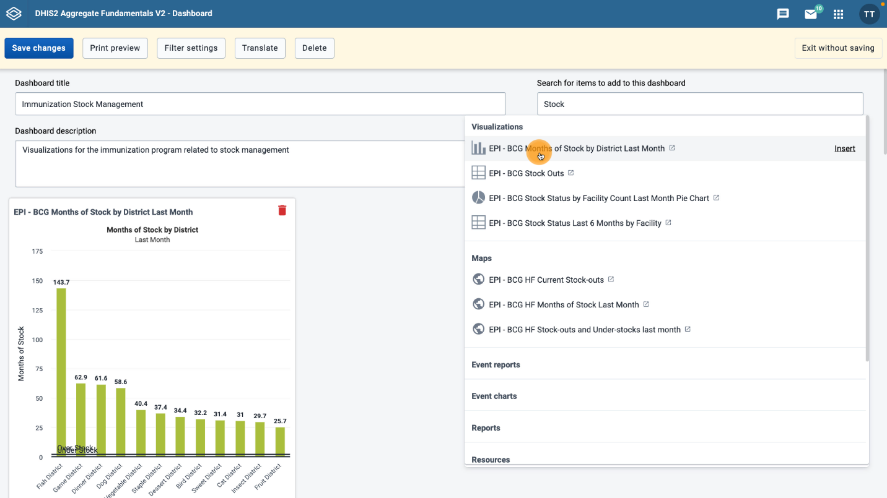

*Image 1 - A dashboard in DHIS2*

Dashboards are a **collection of outputs or visualizations**, such as pivot tables, charts, maps or reports that are typically grouped together because of a specific topic, program or theme. For example, you can create a dashboard for immunizations to show important outputs and visualizations about immunizations. You can share this dashboard with other DHIS2 users or user groups or print it to share it with people that don’t have access to DHIS2.

In the following videos, you will learn how to navigate the dashboard interface and identify the steps to create, edit and share your own.

#### Orientation to dashboards

Dashboards allow DHIS2 users to easily gather, interact and share key information about a program or topic in one centralized location. In this video, you will learn about the dashboard interface and discover its main features.

[Orientation to dashboards (YouTube)](https://youtu.be/sqIuu72iATA)

[DHIS2 Documentation](https://docs.dhis2.org/en/use/user-guides/dhis-core-version-master/analysing-data/dashboards.html)

### 5.2 Creating and sharing a dashboard (15 min)

#### Creating and sharing a dashboard

Within a dashboard, you can add different types of items related to a specific program or topic. In this video, you will learn the steps to create, edit and share a dashboard in DHIS2.

[Creating and sharing a dashboard - YouTube](https://youtu.be/aNy-f31bW7Q)

#### Activity - Creating and sharing a dashboard

[DHIS2 Trainingland](http://academy.aggregate.dhis2.org/analysis) [– DHIS2 Documentation](https://docs.dhis2.org/en/use/user-guides/dhis-core-version-master/analysing-data/dashboards.html#creating-and-editing-a-dashboard) – [Printable version](https://academy.dhis2.org/asset-v1:hisp+GEN-D003-en+2022Q1+type@asset+block/Activity_3.6.1___Data_Set_Reports_and_Resources.pdf)

*Please use the account details you have created for DHIS2 Trainingland in order to log in.*

#### Instructions

In this activity, you will **create a dashboard** and then **share** the dashboard with other users in DHIS2.

*Image 1 - A dashboard being created in DHIS2*

**Create and share a dashboard**

1. Sign in to your account in [DHIS2 Trainingland ](https://academy.aggregate.dhis2.org/analysis/dhis-web-commons/security/login.action)

    - If you are already signed in to DHIS2 and still in the Maps app from the last activity, simply search for ‘Dashboard’ in the Apps menu to navigate to the dashboard

2. You are currently viewing dashboards in the view mode. Click on the **green plus (+) button** in the upper left-hand corner to enter **create mode**

    1. In create mode, enter a title and description for your dashboard

        - **Title:** Immunization Stock Management

        - **Description:** Visualizations for the immunization program related to stock management

    2. In the **“Search for items to add to this dashboard”** field, complete the following:

        1. Search for objects with **‘Stock’** in the title

        2. In the list of results, simply click on items to add them to your dashboard. **Add a variety of objects** from the visualizations and maps sections in the list of results

    3. Practice **organizing** and **modifying** dashboard objects by completing the following:

        1. **Arrange** and organize the objects by dragging and dropping them to the desired location

        2. **Resize** the objects by clicking on the button in the lower right-hand corner of the object and dragging it to the desired size

        3. **Delete** one of the objects using the red trash can icon in the upper right-hand corner of the object

    4. Click on **‘Save changes’** in the upper left-hand corner when you are ready to save your dashboard and return to view mode

    5. Now you can find your dashboard in the list of available dashboards in the control bar

    6. To share your dashboard, click on the **‘Share’** button to open the sharing settings dialog box and complete the following:

        1. Enter ‘Immunisation’ in the search field to find the “**Immunisation access”** group

        2. Once the group has been added, edit their permissions by selecting the **pencil icon** then selecting **‘Can view only’** access

        3. Notice the icon next to the group name is now an **eye icon** representing the ‘Can view only’ access settings. When finished, click ‘Close’

    7 You’ve successfully created and shared a dashboard in DHIS2

#### Knowledge check

**1. What are the steps to create a dashboard? Drag the items above and drop them in the correct order below:**

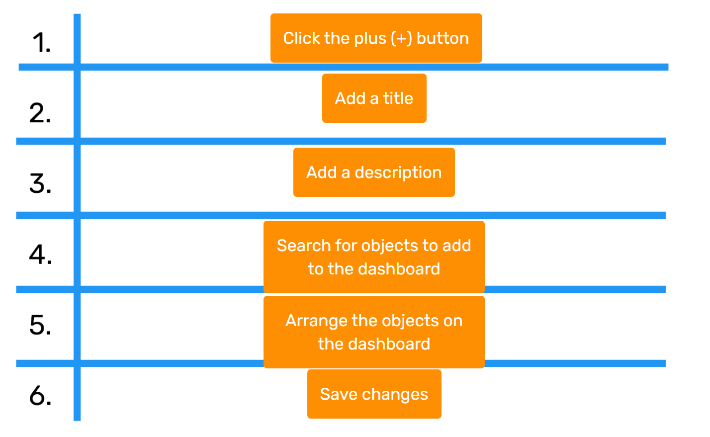

**Feedback**: To create a dashboard, you first need to click the plus (+) button. Then, in the create mode: add a title, a description, select the objects to add to the dashboard (these three steps can be done in any order). Then arrange the objects on the dashboard and save changes.

### 5.3 Module Quiz (10 min)

This is a graded quiz and it is worth 10% of your final grade.

You will find 10 multiple-choice, true or false, and drag and drop questions randomly selected from a question bank. You will have between 1 and 3 attempts to answer each question correctly, and the quiz passing grade is 80%. You will find the number of attempts permitted by question next to the Submit button.

If you want to save your current response without submitting it for grading yet, select the "save" button. This allows you to come back later and resume the attempt.

**2. To create a new dashboard from the DHIS2 dashboard screen, you must select**

*Select one answer.*

    A. File menu then ‘Create’
    B. The ‘More’ button then ‘Create new’
    C. The plus (+) button

**Explanation**: To create a new dashboard in DHIS2, you must select the plus (+) button in the upper left-hand corner.

**3. What are the two modes for dashboards?**

*Select one answer.*

    A. View mode and create mode
    B. Basic mode and advanced mode
    C. Display mode and unpublished mode

**Explanation**: In DHIS2, dashboards have two modes for viewing and creating/editing: view mode and create mode. When you sign in to DHIS2 or click into dashboards, the default mode you see is the view mode. In create mode, you can create or edit a dashboard.

**4. Which of the following objects can be added to a dashboard?**

Select all that apply.

    A. Pivot table
    B. Chart
    C. Map
    D. Report
    E. Text (e.g. messages, interpretations, text boxes)

**Explanation**: All of these objects can be added to a dashboard.

**5. Select the following statements that are TRUE about the control bar in dashboards**

*Select all that apply.*

    A. When a dashboard is selected in the control bar, it is highlighted in green
    B. The height of the control bar can be expanded by clicking on the small down arrow
    C. The control bar includes all available dashboards within the DHIS2 instance regardless of user account or whether the dashboard has been shared
    D. In the control bar, starred dashboards are listed first, and then other dashboards are listed alphabetically
    E. In the control bar, dashboards are listed by the date which they were created

**Explanation**: When a dashboard is selected, it is highlighted in green making it easy to identify which dashboard you are currently viewing. Dashboards are listed alphabetically, not by the date which they were created. The height of the control bar can be expanded by clicking on the small down arrow. The control bar includes all dashboards that are available to you (either through your account permissions or because it was shared with you) rather than all dashboards available within the instance.

**6. To delete a dashboard item, you must**

*Select one answer.*

    A. Right click on the object in the dashboard and select ‘Delete’
    B. Select the context menu in the upper right-hand corner then ‘Delete object’
    C. Select the red trash can icon in the upper right-hand corner of the object in create mode

**Explanation**: To delete an object that has been added to your dashboard, you must select the red trash can icon in the upper right-hand corner of the object when in create mode.

**7. Select the following statements that are TRUE about filters in dashboards**

*Select all that apply.*

    A. Filters need to be applied in the application where they were created
    B. Filters can change the data displayed in each dashboard item
    C. Filters override the original value for that dimension in the original visualization
    D. Filters can only be applied to certain dashboard items
    E. Only organisation unit filters are available for dashboard filtering

**Explanation**: Filters are applied to each dashboard item in the same way. You can apply filters to a dashboard that will change the data displayed in each dashboard item. The filter overrides the original value for that dimension in the original visualization. Filters can be applied directly in dashboards; you do not need to apply the filter within the application where it was created. It is possible to filter on period, organisation unit and other dynamic dimensions depending on the DHIS2 instance.

**8. Through the dashboard interface, you can interact with objects in the dashboard.**

**Select the following interactive features that are available within the dashboard interface**

*Select all that apply.*

    A. Zooming in and out on a maps
    B. Opening an object in the app where it was created
    C. Rearranging the dimensions of a pivot table
    D. Viewing the object in fullscreen
    E. Viewing the objects’s interpretations and details

**Explanation**: There are many features available in dashboards that allow you to interact with the objects on the dashboard including: Zooming in and out on a map, opening an object in the app where it was created, viewing the object in fullscreen (which is a useful feature for presentations) and viewing the object’s interpretations and details.

**9. When creating a dashboard, the fields title and description of the dashboard are required**

*Select one answer.*

    A. True
    B. False

**Explanation**: When you create a dashboard, it is best practice to add a title and description to the dashboard, but these fields are not required. If you do not add a title to the new dashboard, the dashboard will automatically be titled “Untitled dashboard”.

**10. Select the following statements that are TRUE about dashboards**

*Select all that apply.*

    A. When logging in to DHIS2, you will either see your most recently viewed dashboard or the first starred dashboard
    B. When you create a dashboard in DHIS2, it is automatically shared with any user who has access to the visualizations used in the dashboard
    C. When creating a dashboard, you can resize and rearrange items by dragging and dropping them to the desired location or size

**Explanation**: When you log in to DHIS2, you will either see your most recently viewed dashboard or the first starred dashboard (depending on if you used the same computer when logging back in to DHIS2). When you create a dashboard in DHIS2, you need to share the dashboard with any users or user groups who need access to the dashboard. Dashboards are not automatically shared. When creating a dashboard, you can resize and rearrange items by dragging and dropping them to the desired location or size.

**11. What are the steps to create a dashboard? Drag the items above and drop them in the correct order below:**

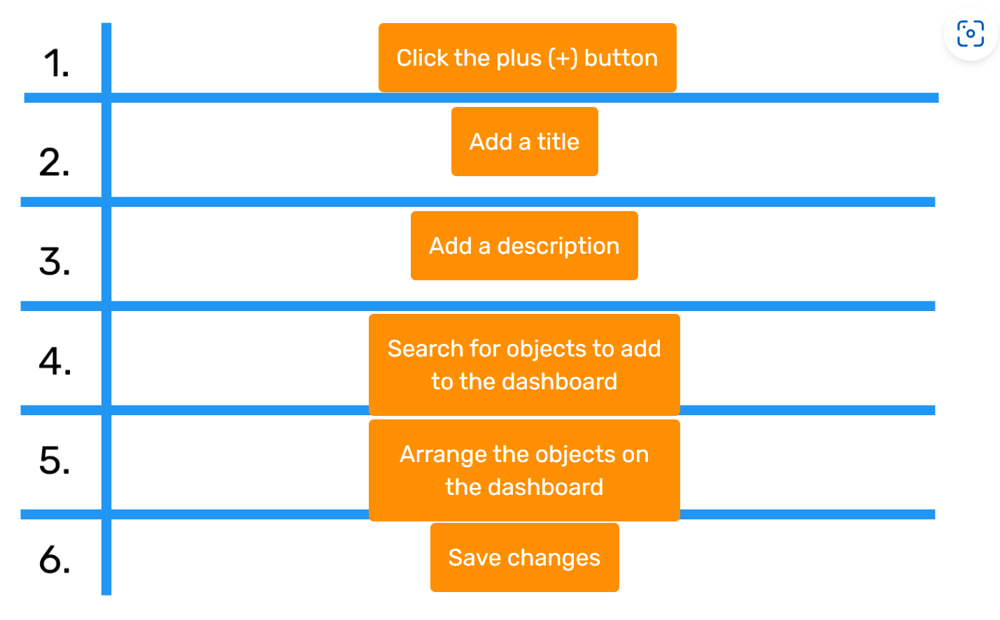

**Feedback**: To create a dashboard, you first need to click the plus (+) button. Then, in the create mode: add a title, a description, select the objects to add to the dashboard (these three steps can be done in any order). Then arrange the objects on the dashboard and save changes.

### 5.4 Module Lab (15 min)

This is a **graded assessment** lab and it is worth **15%** of your final grade.

In order to answer the assessment lab questions, you will have to complete a task in the DHIS2 training instance, **Trainingland**. Sign in to your Trainingland account using the following link: [DHIS2 Analysis](https://academy.aggregate.dhis2.org/analysis)

You will have between **1 and 3 attempts** to answer each question correctly, and the lab passing grade is 80%. You will find the number of attempts permitted by question next to the Submit button.

If you want to save your current response without submitting it for grading yet, select the "save" button. This allows you to come back later and resume the attempt.

**1. In Trainingland, which of the following are available dashboards?**

*Select all that apply.*

Hint: Be sure to expand the control bar to see all available dashboards.

    A. Child Nutrition Program
    B. HIV Burden
    C. Immunisation Maps
    D. OPV Coverage
    E. Malaria Trends and Coverage

**Explanation**: n Trainingland, the following dashboards are available: HIV Burden, Immunisation Maps and Malaria Trends and Coverage. Be sure to expand the control bar, (by clicking on the small down arrow) to see all available dashboards.

**2. In Trainingland, use the search field to search for all dashboards with Malaria in the title.**

**How many malaria dashboards are there in Trainingland and what are their names?**

*Select one answer.*

    A. 3 dashboards: Malaria Type, Malaria Treatment, Malaria Maps
    B. 4 dashboards: Malaria Treatment, Malaria Burden Reduction, Malaria Elimination, Malaria Maps
    C. **4 dashboards: Malaria Burden Reduction, Malaria Elimination, Malaria Maps, Malaria Trends and Coverage**

**Explanation**: In Trainingland, if you search for ‘Malaria’ in the search field, you will see 4 available dashboards: Malaria Burden Reduction, Malaria Elimination, Malaria Maps, Malaria Trends and Coverage.

**3. Click the plus (+) button to create a new dashboard in Trainingland.**

**Which of the following are available options within the “create” mode?**

*Select all that apply.*

    1. Dashboard color
    2. Dashboard icon
    3. Dashboard title
    4. Dashboard description
    5. Search for items to add to this dashboard

**Explanation**: To create a new dashboard and enter “create mode”, select the plus (+) button. In create mode, the following are available options: Dashboard title, dashboard description and the “Search for items to add to this dashboard” field.

**4. Select the ‘More’ button at the top of any dashboard.Which of the following options are available?**

*Select all that apply.*

    A. Print
    B. Download
    C. Star/Unstar dashboard
    D. Show/Hide description
    E. Show interpretations and detail

**Explanation**: Under the ‘More’ button, found at the top of any dashboard, the following options are available: Star/Unstar dashboard, Show/Hide description and Print. “Show interpretations and details” is available through the context menu in the upper right-hand corner of the visualization. Although download is not an available option, dashboards can be printed, which can allow you to save them in PDF format depending on your printer settings.

**5. Navigate to the “COVID-19 Surveillance (Aggregate)” dashboard and add a filter for the Food Region. Find the visualization titled “COVID-19 - Active and Closed Cases - Monthly”.**

**How many COVID-19 cases did Food Region have (counting both active and closed) for March 2021?**

*Select one answer.*

    A. Approximately 5,000
    B. Approximately 10,000
    C. Approximately 15,000
    D. Approximately 20,000

**Explanation**: When an organisation unit filter is applied to this visualization for Food Region, the data displayed in the visualization shows approximately 5,000 COVID-19 cases (counting both active and closed) in March 2021.

**6. In Trainingland, navigate to the dashboard you created during the Module 5 activity “Immunization Stock Management”. Select the ‘Share’ button to open the sharing settings dialog box.**

**What icon appears next to the “Immunisation access” group and what does it indicate?**

*Select one answer.*

    A. The eye icon indicating ‘Can view only’ access
    B. The pencil icon indicating ‘Can edit and view’ access
    C. The star icon indicating it is a favorite

**Explanation**: In the module 5 activity, you added the “Immunisation access” group and changed their access to ‘Can view only’ which is represented by the eye icon.

**7. Create a new dashboard in Trainingland.**

**In create mode, when you are finished adding objects to the dashboard, how do you save the new dashboard?**

*Select one answer.*

    A. Select ‘Create and save’
    B. Select ‘Save changes’
    C. Select ‘Save and continue’

**Explanation**: To create a new dashboard and enter create mode, select the plus (+) button. In create mode, to save the new dashboard, you must select ‘Save changes’.

**8. Create a new dashboard in Trainingland. Under the “Search for items to add to this dashboard” field, search for ‘RMNCAH’ and add five visualizations of your choice to the dashboard.**

**When the items are added to the dashboard, how do they appear in the dashboard?**

*Select one answer.*

    A. The items are automatically alphabetized
    B. The items are ordered by the date they were created
    C. The items are stacked one on top of the other with the most recent selection on top

**Explanation**: When items are added to a dashboard, they are stacked one on top of the other with the most recent selection on top. The order of dashboard items can be modified. Dashboard items can be dragged and dropped to the desired location and resized as well.

**9. Navigate to the “Immunisation” dashboard. Star this dashboard to mark it as a favorite.**

**What happens to the dashboard within the control bar?**

*Select one answer.*

    A. It appears in yellow to indicate it is a favorite dashboard
    B. It appears first in the list of available dashboards
    C. Only starred dashboards appear; unstarred dashboards become unavailable in the control bar unless they are specifically searched

**Explanation**: When a dashboard is designated with a star, marking it as a favorite, it appears first in the list of available dashboards in the control bar. Starred dashboards always show first in the dashboard list. After the favorite dashboards, the rest of the dashboards are displayed alphabetically.

**10. Navigate to the “Immunisation” dashboard.What is the dashboard description?**

*Select one answer.*

Hint: You may need to select the ‘Show description’ option through a specific button.

    A. This dashboard shows BCG and OPV immunisation coverage for Trainingland
    B. This dashboard shows key performance statistics and monitoring targets for the immunisation campaign in Trainingland
    C. This dashboard shows the key performance indicators for the immunisation programme in Trainingland

**Explanation**: Select the ‘Show description’ option found under the ‘More’ button at the top of the dashboard. The description for this dashboard is: This dashboard shows the key performance indicators for the immunisation programme in Trainingland.

**11. Navigate to the “Immunisation” dashboard. Find the visualization titled “EPI - BCG coverage by district - September 2021” and select the context menu.**

**Select the following options that are available for this visualization**

*Select all that apply.*

    A. View as chart
    B. View as table
    C. View as map
    D. Open in Data Visualizer app
    E. Open in Maps app

**Explanation**: “EPI - BCG coverage by district - September 2021” is a map visualization with the following options available from the context menu: View as chart, view as table, open in Maps app.

**12. Navigate to the “Immunisation maps” dashboard and apply a filter for July 2021. Find the visualization titled “EPI - DPT 1-3 dropout rate by district”.**

**Which district had the highest dropout rate for July 2021?**

*Select one answer.*

    A. Fruit District
    B. Insect District
    C. Bird District

**Explanation**: When a period filter is applied to this visualization, the data displayed in the visualization shows Bird District to have the highest dropout rate among the districts for July 2021.

### 5.5 Module Summary (3 min)

#### Module 5 Summary

You have now reached the end of the fifth module for the Data Analysis in DHIS2 course. In this module, you have learned:

- Dashboards are a **collection of outputs or visualizations** such as pivot tables, charts, maps or reports of specific topics or programs

- In the dashboard interface, you can see all the dashboards available on your user account

- DHIS2 allows you to:

  - **Star** a dashboard to save it as a favorite

  - **Edit** a dashboard if you have permissions

  - **Share** it with users or user groups

  - See its **description** and **print** it

  - **Interact** with the objects embedded in a dashboard

  - **Create** a new dashboard and add different types of items to it by selecting them from a list

    - **Arrange** and organize the dashboard items by dragging and dropping them to the desired position

    - **Resize** or **delete** objects

  - **Share** the dashboard with other users and **configure** their permission to view and edit the dashboard

#### Discussion forum

As we are reaching the end of the module, let's take some time to reflect on what you've learned and discuss the key concepts covered so far. To do it, if you have already joined the course discussion forum, please click on the following link to join this specific discussion topic:

**Using and sharing dashboards**
[**Click to join the discussion**](https://community.dhis2.org/t/module-5-using-and-sharing-dashboards/46780)

*[Note that if you can't see the page (or if you reach an “Oops! That page doesn’t exist or is private.”), please use [this invitation link](https://community.dhis2.org/invites/xR912Lb8D2) first to gain access to the private course discussion forum]*

In this module, you had the chance to create and edit a dashboard in Trainingland, our DHIS2 training instance.

How was your experience editing and creating a dashboard? What did you find most useful? Did you find any challenges when interacting with DHIS2 when creating a dashboard? In your opinion, what are the advantages of using dashboards as a tool for sharing data visualizations of a specific program?

Please feel free to share your experience, read your peers’ responses and reflect on what you have learned so far in the course.

Thank you!

Even though this is an optional activity, we strongly recommend you take some time to think about your new knowledge, read what other course participants think, and make connections with your own prior experience and current learning needs. This will help reinforce what you have learned and prepare you for what is coming next.

Once you are done on the CoP, click the link at the top of the discussion topic page to be redirected back to the course to fill out the module feedback survey.

If you are not joining the discussion on this module, simply click the next button below to continue to the survey.

### 5.6 Feedback Survey (2 min)

#### Module 5 Feedback Survey

Once you are done with the module, please take 2 or 3 minutes to complete this feedback survey. Your careful response will have a real impact on how courses like this are run. Thank you!

## Course closing and next steps (10 min)**

### Course closing (2 min)

#### Get your certificate

You have now finished the DHIS2 Aggregate Data Analysis Fundamentals course. You should now be able to use the DHIS2 Data Visualizer app to create and edit pivot tables and charts, as well as the Maps app to visualize your aggregate data using maps. You should also be able to use dashboards to visually present the most relevant visualizations related to a topic and share these dashboards with other users to foster discussion and improve decision-making.

Remember, even though you have completed the course you are able to return to it to access this self-paced course again in the future, so if you get stuck or need to revisit a concept or demonstration, just come back to the DHIS2 online academy and review the course.

#### Download your course certificate

To get the course certificate, you need to achieve a passing grade of 80% or more. To check your current grade and claim your certificate, click on the buttom bellow to go the **Progress** page and review your score. If you have already achieved a passing grade, congratulations, you can claim your certificate now!

[**View progress and claim my certificate**](https://academy.dhis2.org/courses/course-v1:hisp+GEN-D003-en+2022Q1/progress)

#### Download your course certificate

You can download your course certificate by going to your **Dashboard** and selecting **My courses**. You will find the list of courses you are enrolled in, locate the **Aggregate Data Analysis Fundamentals** and click on the course certificate to download or print it.

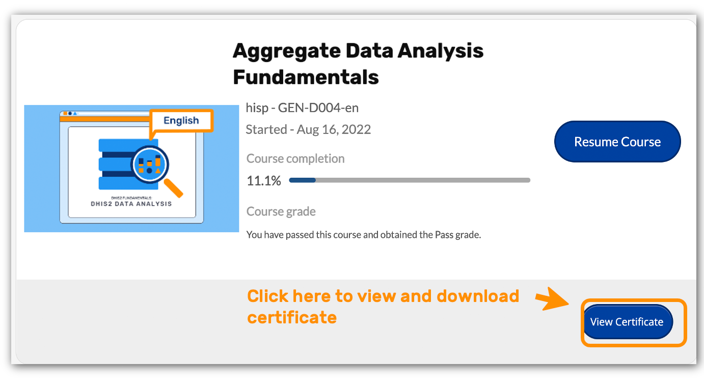

#### Tell us how we can improve

Once you finish the course, please give us your feedback by completing the end-of-course survey. We constantly check participants’ feedback and look for ways to improve our courses. We truly appreciate your input.

#### End-of-course survey (3 min)

Now that you are at the end of this course, please take a few minutes to reflect on your experience and complete this feedback survey. Your careful response will have a real impact on how courses like this are run. Thank you!

### Next steps (5 min)

#### What’s next?

If you only need to understand how to create visualizations for data analysis, congratulations! You should be ready to start. However, if you want to learn more about using DHIS2 for aggregate data, you can register in either of the following DHIS2 Fundamentals courses:

- [Aggregate Data Capture and Validation:](https://academy.dhis2.org/courses/course-v1:hisp+GEN-D002-en+2022Q1/about) In this course, you will learn to enter aggregate data using a web browser and an Android device. You will also learn how to run data validation tests during and after data capture.

- [Aggregate Customization Fundamentals](https://academy.dhis2.org/courses/course-v1:hisp+GEN-D004-en+2022_Q2/about): In this course, you will get to know the key elements that can be customized in DHIS2 according to your program and organizational structure.

If you have completed all of the courses in the DHIS2 Fundamentals series for aggregate data and would like to learn about working with individual-level data in DHIS2, you can register for the following self-paced course:

- [DHIS2 Events Fundamentals](https://academy.dhis2.org/courses/course-v1:hisp+GEN-D005-en+2022_Q2/about): In this course, you will learn to work with individual-level data with an emphasis on event programs, including creating event data outputs and configuring event program metadata within DHIS2.

#### How can you enroll in these courses?

Directly at the DHIS2 Online Academy. Select each course from the course catalog to learn more about it, including any prerequisites for each specific course. You will find an enrolment button on the course description page for each active course.

#### When and in what order should I take these courses?

There is no specific order to take the courses, it depends on your own learning needs. There are also no specific dates to start or finish as all courses are self-paced.

#### Do I have to take all these courses to be eligible for Level 1 or Level 2 Academies?

It is not necessary to take all the courses in the Fundamentals series to qualify for Level 1 or Level 2 DHIS2 Academies. In the following interactive diagram you will see the sequence of courses that we recommend based on common user profiles/roles and interests. By selecting a particular course you will see a description of it, including the prerequisites for the course. For more information about the DHIS2 Academy program, including registration information for upcoming Level 1 and Level 2 courses, visit the [DHIS2 website](https://www.dhis2.org/academy).

#### What’s next for you?

**Next step poll**

One last question before you leave the course: Which of the following courses would be your next step?

- Aggregate Data Capture and Validation

- Aggregate Customization

- DHIS2 Events Fundamentals

- A DHIS2 level 1 Academy

**Feedback**: You can enrol in any of the DHIS2 Fundamentals courses or look for more training opportunities on our website.
