# Introduction to DHIS2

## Course details

### About the course

In this course, you will learn about the fundamental concepts that underpin how DHIS2 works, such as its building blocks and how data are entered, validated, analyzed, and shared. You will also discover the community that surrounds DHIS2, learn about its history and its supporting ecosystem. This course is the first course in the DHIS2 Fundamentals courses program. If you are new to DHIS2, we recommend you start your DHIS2 learning journey here.

#### What will I learn?

After completing this course, you'll be able to:

- Identify examples of the use of DHIS2 in the implementation, monitoring, and evaluation of public health and education programs

- Recognize how DHIS2 can be used to capture, analyze, and share data to make informed decisions.

- Identify the DHIS2 building blocks that make it possible to customize and extend the capabilities of the platform.

- Indicate DHIS2 advantages as open-source software and its potential for integration with other platforms.

- Recognize the roles and the relationship between the University of Oslo (UiO) and the HISP network to create, develop, apply, and improve DHIS2 in the context of Global Digital Health programs.

- Distinguish the elements that comprise the DHIS2 ecosystem and the ways to interact with the DHIS2 global community.

#### Requirements

There are no specific prerequisites to take this course.

#### Short description

In this course, you will learn about how DHIS2 is used to capture, analyze and share data to foster informed decision-making in public health, education, and other fields. This course belongs to the DHIS2 Fundamentals courses program.

## Pages

### Frequently Asked Questions (FAQs)

#### How long will it take to complete the course?

We estimate the course will take approximately 3 hours to complete. This includes the review of all videos, readings, knowledge checks, and quizzes. As this is a self-paced course, note that this may vary slightly for each learner.

#### Is there a deadline to complete the course?

No. In the event that an end date is scheduled, you will be notified with enough time to finish your work in the course.

#### How will I be evaluated?

The course consists of 3 graded quizzes that you will find at the end of modules 1, 2, and 3. In those quizzes, you will find 10 randomized questions from a question bank and have unlimited attempts to pass the quizzes.

To pass the course, an overall grade of 80% is required

#### When and where will my certificate be available?

Upon completion of the course with a passing grade (80%), your certificate will be available to view and download on the **Dashboard**, and selecting **My courses**. You will find the list of courses you are enrolled in, locate the **Introduction to DHIS2** and click on the course certificate to download or print it.

#### This is my first time taking a course on the DHIS2 Online Academy, how do I navigate the platform?

We prepared a document with some [navigation guidelines](https://docs.google.com/presentation/d/1LxqnYdhWDgAfe9P7jxz-A9fkDQhttps://docs.google.com/presentation/d/1LxqnYdhWDgAfe9P7jxz-A9fkDQQXf4cO/edit#slide=id.p1QXf4cO/edit#slide=id.p1) that will help you to learn how to move between modules, subsections, and units. You will also find a 5-minute video tutorial in module 0 on how to navigate the platform.

#### Do I need to be connected to the course at specific times?

No, all the contents and activities are asynchronous, which means that real-time interactions are not needed to complete the course and all content is available to access when it best suits your schedule

#### What should I do if I experience technical issues?

For technical support, you can contact the course moderators for help by email at fundamentals-support@dhis2.org. For a quicker response, please don't forget to indicate your username or the email address you used to register on the platform.

### Course handouts

[Navigation guidelines.pptx](https://docs.google.com/presentation/d/1LxqnYdhWDgAfe9P7jxz-A9fkDQQXf4cO/edit#slide=id.p3)

[Participants Guide\_Introduction to DHIS2.docx](https://docs.google.com/document/d/1Z-8a57xMQ-HVZrQzRD4ckxQYJ8BQGLWD/edit)

## Module 0 - Start here (40 Mins)

### 0.0 Pre-course Survey (5 mins)

Tell the DHIS2 Academy team more about yourself by filling out our **Pre-course Survey** below.

Your responses to this survey will help the DHIS2 Academy team improve our course offerings by providing valuable insight into our Academy audience. Whether you are just browsing or you are determined to complete the entire course, the more we know about you, **the better we can serve all participants** in this course.

[Link to pre-course survey](https://docs.google.com/forms/d/e/1FAIpQLSd1dbVONTc2NZTAIif3mtCjcONcjo8alHbs-knCD4_rhINC4A/viewform?usp=sf_link)

### 0.1 DHIS2 at a glance (5 min)

#### DHIS2 Information for action

**DHIS2** - is not only an open-source platform for reporting, analysis, and dissemination of data, but is also an initiative supported by a **global network** called **HISP** - and a growing community of users from more than 100 countries globally.

Before getting started with the course, watch this video to get a first look at how DHIS2 is used in public health to benefit billions of people around the world. Click the play button below to start.

[Video - DHIS2 Information for action (YouTube)](https://youtu.be/GawQIEegvKk)

### 0.2 About the course (5 min)

Welcome to the **Introduction to DHIS2** course, part of the **DHIS2 Fundamentals** course program. We at the DHIS2 Academy Team want to thank you for your interest in DHIS2, and hope that this course provides you with a helpful overview of the DHIS2 software and some of its common uses that can serve as the foundation for your DHIS2 learning journey.

In this module 0, you'll find an overview of the course, get familiarized with the DHIS2 Online Academy platform, and find the most important information to get started.

#### What is this course about?

What is DHIS2? What are the conceptual building blocks of the system? How can data be entered into DHIS2? What type of data analysis can be done with it? Throughout this course, you will learn about the **fundamental concepts** that underpin how DHIS2 works, such as its **building blocks** and how data are entered, validated, analyzed, and shared. You will also discover the **community** that surrounds DHIS2, and learn about its **history** and its **supporting ecosystem**.

In this course, we will primarily use the field of public health for our examples, but note that DHIS2 is also used in other sectors such as education and environment.

#### What will I learn?

After completing this course, you'll be able to:

- Identify examples of the use of DHIS2 in the implementation, monitoring, and evaluation of public health programs.

- Recognize how DHIS2 can be used to capture, analyze, and share data to make informed decisions in public health and other fields.

- Identify the DHIS2 building blocks that make it possible to customize and extend the capabilities of the platform.

- Indicate DHIS2 advantages as open-source software and its potential for integration with other platforms.

- Recognize the roles and the relationship between the University of Oslo (UiO) and the HISP network to create, develop, apply, and improve DHIS2 in the context of Global Digital Health programs.

- Distinguish the elements that comprise the DHIS2 ecosystem and the ways to interact with the DHIS2 global community.

#### What are the course prerequisites?

There are no specific prerequisites to take this course.

#### Which version of DHIS2 has been used in the course?

All the demonstrations you will find in the course have been made with DHIS2 version 2.36.

#### How is the course structured?

Introduction to DHIS2 is comprised of 4 modules:

- Module 1: What is DHIS2 and how is it used? (60 min)

- Module 2: Understanding the basics of DHIS2 (45 min)

- Module 3: DHIS2: A global community-driven project (45 min)

- Module 4: Course closing and next steps (10 min)

#### How will I learn?

In each module, you will find **video presentations, demonstrations, and knowledge check questions**. Modules 1, 2 and 3 also contain **assessment quizzes** that you'll need to pass to finish the course.

Each topic is presented in the form of videos of approximately 5 minutes. Watch them at your leisure (or download them to save them for later), participate in the discussions, and see how much you've learned by taking the quizzes afterward.

#### How long will it take to complete the course?

We estimate the course will take approximately **3 hours** to complete. This includes the review of all videos and completing the graded assessments. As this is a self-paced course, note that this may vary slightly for each learner.

#### How do I pass the course?

The course consists of 3 graded quizzes that you will find at the end of modules 1, 2, and 3. In those quizzes, you will find 10 randomized questions from a question bank and have **unlimited attempts** to pass the quizzes. The weighting of the quizzes is as follows:

- 40% for Module 1

- 30% for Module 2

- 30% for Module 3

In order to pass the course, an **overall grade of 80%** is required.

This is the first course in the DHIS2 Fundamentals course program, which also contains the **Aggregate Data Capture & Validation**, **Aggregate Data Analysis**, **Aggregate Customization**, and **Events Fundamentals** courses. If you are interested in getting higher level training on DHIS2, you will find information about Level 1 and Level 2 Academies at the end of the course.

#### What is the course timeline?

This course is **self-paced**, which means there are **no set deadlines** and you can go through it as fast or as slow as you prefer. This course does not currently have a set end date. In the event that an end date is scheduled, you will be notified with enough time to finish your work in the course.

#### How do I get support?

For **technical** support or when you have issues **navigating the platform**, you can contact the course moderators for help by email at **fundamentals-support@dhis2.org**. For a quicker response, please don't forget to indicate your username or the email address you used to register on the platform.

#### What should I do now?

If this is your first time using the DHIS2 Online Academy, go to the next unit to learn how to navigate the platform.

### 0.3 Using the Online Academy platform (10 min)

#### How to navigate the platform

If it's your first time on a DHIS2 Online Academy, please watch the following video to learn how to navigate the academy with the tools available.

[Video - DHIS2 Fundamentals - Navigating the DHIS2 Academy (YouTube)](https://www.youtube.com/watch?v=QS2EdN8V7wA&t=61s)

#### The course content page

In this screenshot you can see an overview of the most used navigation options of the platform:

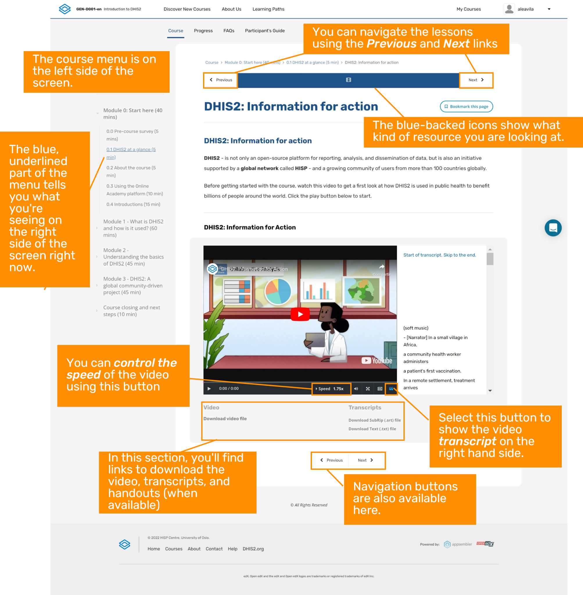

You can also download and review [a short version of the platform navigation guidelines](https://academy.dhis2.org/assets/courseware/v1/d4c3047fcc9bd4a41e526a3490ebd0a1/asset-v1:hisp+GEN-D001-en+2022Q1+type@asset+block/Navigation_guidelines.pdf) to check the key items.

#### Assess your progress: Knowledge checks and quizzes

After each video in the course, there will be **knowledge check questions**. These are not graded questions, but they will help you reinforce essential concepts from the videos.

Each **module's quizzes are graded** and are made up of three kinds of questions:

- **Multiple choice**: These have circular check boxes, and you can only select one.

- **Multiple response**: These have square check boxes and you can select more than one.

- **Drag and drop**: these are often diagrams with either pictures or text in boxes, and require you to drag the answer to the correct area of the image.

You will have **unlimited opportunities** to answer each question correctly.

We recommend that you check the "**Progress**" page after completing each quiz to see your grade. Remember that in order to receive the course certificate, you must have an average score of **80% or higher** in the quizzes.

#### Introducing the DHIS2 Community of Practice (CoP) discussion forum

The DHIS2 Community of Practice - or CoP - is a website where the global community of DHIS2 users connect, discuss, share and support each other through discussion forums organized by categories. We have created a specific category for DHIS2 Academy Courses where each of the DHIS2 Fundamentals courses has its own private space. By taking the Fundamentals courses, you are not only learning about DHIS2 but becoming a part of our global community, which is why we encourage you to interact with other course participants on the CoP.

Each time we propose a discussion throughout the course, you will find a link to the specific discussion topic on the CoP; however, the topics are in a private space dedicated to the Introduction to DHIS2 course discussion forum. To be able to access the private space, you will need to accept the CoP invitation once and after that you will be able to access all the discussion topics in the course.

[**Click to join the discussion forum**](https://community.dhis2.org/invites/skz2pBmave)

You only need to use the invitation link once. When you click the link, the CoP website will open in a new browser tab. If you already have a community account and are already signed in from a previous CoP session, you can continue directly to the course discussion forum. If you are not signed in you can sign in using your existing username and password. If you do not already have a community account, you will be prompted to create one.

##### How to navigate to the course discussion forum?

When you create your account, the first interaction with the CoP will be guided by a tour with basic instructions that will help you with using the platform. If you need more guidance, open this **pdf file** with specific instructions on how to use the Fundamentals courses discussion forums.

Please keep in mind that the use of the discussion forums is an **optional activity** and is not graded.

### 0.4 Introductions (15 min)

#### Meet the DHIS2 Online Academy Team

The DHIS2 Fundamentals course program is the first of the three levels of the DHIS2 Academy curriculum, and aims to introduce essential concepts and build foundational DHIS2 skills through demonstrations, hands-on exercises and labs. Creating and maintaining the materials for the DHIS2 Fundamentals courses is a team effort, drawing on experts in the DHIS2 platform, instructional and media design, and online learning technologies.

The team behind the DHIS2 Fundamentals are:

**Subject matter experts and reviewers,** responsible for defining the curriculum, contents, and course structure, and validating all learning resources:

- Shurajit Dutta

- Megan Kill

- Matthieu Pinard

- Max Krafft

- Rachel Zink

**Production and support team**, responsible for designing and developing all multimedia learning resources and implementing the course in the platform, and providing student support:

- Alejandra Ávila

- Grant Chapman-Clarke

- Simona Sekerova

- Martin Evensen

Team photo: [https://drive.google.com/file/d/1ygh4CxUm1qB0JKPMvsp8NxaJVAQwjdi3/view?usp=sharing](https://drive.google.com/file/d/1ygh4CxUm1qB0JKPMvsp8NxaJVAQwjdi3/view?usp=sharing)

#### Tell us about you

#### Word cloud: Where are you from?

DHIS2 is a global community of users, and you will get the chance to learn with people from all over the world. Let's create a word cloud and see where your peers come from. In the box below, write the name of your country. Please use full words and avoid using acronyms. After clicking "Save", you will see the word cloud built from the answers from all course participants.

#### Introduce yourself

Now it's your turn to introduce yourself and tell your peers about you. You can use the following questions to write your post:

- Where are you from?

- Why are you interested in learning about DHIS2?

- What do you want to achieve in the course?

Remember that the course discussion forums take place in the DHIS2 Community of practice (CoP). If you have already joined the course discussion forum, please click on the following link to join this specific discussion topic:

[**Click to join the discussion**](https://community.dhis2.org/t/introduce-yourself-tell-us-about-you/46752)

*Note that if you can't see the page (or if you reach an “Oops! That page doesn't exist or is private.”, please use [this invitation link](https://community.dhis2.org/invites/HguBRECyej) first to gain access to the private course discussion forum*

## Module 1 - What is DHIS2 and how is it used? (60 mins)

### 1.0 Overview of the module (5 min)

#### What is DHIS2?

What exactly is DHIS2? In the word cloud below, you can see what other people think DHIS2 is and what it does. You can add what you think DHIS2 is by using the text entry box below the word cloud.

In each of the provided text boxes, please enter a **single word**.

#### What is in this module?

What is DHIS2? What does it do? How is it used to help meet real-world needs?

In this module, you will discover **what DHIS2 is**, **what it does**, and **how it helps manage data to inform decision-making**. You will start by seeing h**ow data are captured, reviewed, analyzed, and shared** within DHIS2. Then, you will **review some use** cases that show how DHIS2 is used in different fields, such as health and education.

#### Learning objectives

At the end of this module you will be able to:

- Recognize how DHIS2 can be used to capture, analyze, and share data to make informed decisions.

- Understand what a use case is in the DHIS2 context.

- Identify examples of the use of DHIS2 in public health programs and other fields.

#### How will you be evaluated?

At the end of the module there is a **graded quiz**. It contributes **40% to your final grade**, and you will have unlimited attempts to complete it.

#### How long will this module take?

The module should take about **60 minutes** to complete.

### 1.1 DHIS2 feature overview (40 min)

#### How are data entered into DHIS2

DHIS2 brings together a wide variety of data **from a large number of sources to one central system**, allowing for better planning, information sharing, and decision making at all levels.

In this video, you will find out **how data are captured in DHIS2**.

#### Key concepts

- Data entry

- Data models

- Aggregate

- Data entry app

- Events

- Capture app

- Tracker

- Tracker capture app

#### Knowledge check

**1. DHIS2 is most similar to a:**

    A. Data port
    B. Data warehouse
    C. Data driveway
    D. Data highway

*(**Feedback**) Data warehouse is correct. DHIS2 works as a centralized data warehouse capable of capturing data from a number of different sources and devices including direct entry through the web or an Android device, SMS, and even other data sources such as spreadsheets or other electronic systems.*

**2. DHIS2 can capture three different types of data, each using a different type of application. Can you match the type of data with the relevant DHIS2 application that can capture it?**

**Disclaimer**: Please note that this applies to DHIS2 versions up to 2.35.

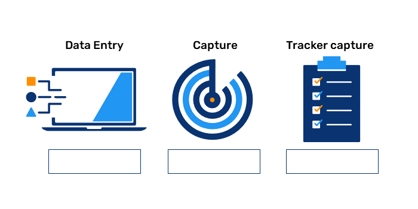

General **Feedback** for incorrect options: No, this item does not belong here. Try again.

**Feedback** for each correct option:

**Data entry**: Correct! Numerical or aggregate data are entered into DHIS2 using the Data Entry tool.
**Capture**: Correct! Anonymous individualized data are entered into DHIS2 using the Capture App.
**Tracker capture**: Correct! Individual data with identifiers are entered into DHIS2 using the Tracker capture app.

*Final **Feedback**: Numerical or aggregate data are captured by the Data entry app. Anonymous individualized data are captured by the Capture app. Individual data with identifiers are captured by the Tracker Capture app.*

**3. True or False: Aggregate data can be entered into DHIS2 using SMS**

    A. True
    B. False

*(**Feedback**) True. Data can be entered into DHIS2 using the web interface, the Android app, SMS, spreadsheets, and other electronic means.*

#### How is data quality ensured in DHIS2?

Now that you understand how data are entered into DHIS2, let's see **how data are reviewed** to ensure their quality.

In this video, you will discover **some of the tools available in DHIS2 that perform quality checks on the data entered in the system**. This quality review is key to having reliable data for analysis and informed decision-making.

#### Key concepts

- Data quality

- Validation rule analysis

- Outlier analysis

- Follow-up analysis

- WHO Data Quality Tool

[1.2.2 How is data quality ensured in DHIS2 - YouTube link](https://www.youtube.com/watch?v=5Sq4Zn0IJ1c&t=113s)

#### Knowledge check

**1. In this lesson, you learned about 3 data validation tools. Drag their definitions to the right boxes below.**

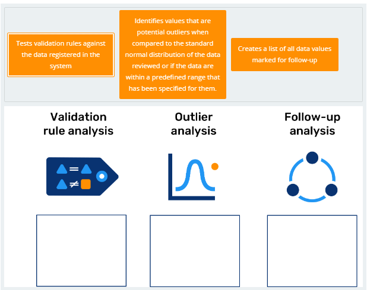

General **Feedback** for incorrect options: No, this item does not belong here. Try again.

**Feedback** for each correct option:

**Validation rule analysis**: Tests validation rules against the data registered in the system.
**Correct Feedback**: Correct! Validation rule analysis tests validation rules against the data registered in the system.
**Outlier analysis**: Identifies values that are potential outliers when compared to the standard normal distribution of the data reviewed or if the data are within a predefined range that has been specified for them. **Correct Feedback**:Correct! The Outlier analysis is another tool we can use to check data quality, identifying those values that are potential outliers when compared to the standard normal distribution of the data we are reviewing or if the data are within a predefined range that has been specified for them. .
**Follow-up analysis**: Creates a list of all data values marked for follow-up.
**Correct Feedback**: Correct! The Follow-up analysis creates a list of all data values marked for follow-up.

**Final Feedback**: Good work! You have completed this drag and drop problem.

**2. The WHO Data Quality Tool generates findings on data quality based on the WHO Data Quality Review Framework. Match the quality metric being measured with its correct description.**

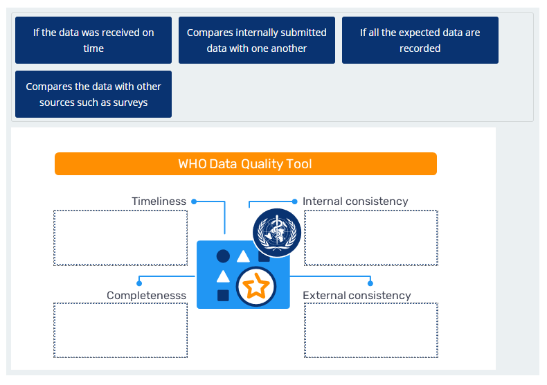

(Instruction: Drag the items onto the image above.)

**Options**:

**Timeliness**: If the data was received on time.

**Internal Consistency**: Compares internally submitted data with one another.

**External Consistency**: Compares the data with other sources such as surveys.

**Completeness**: If all the expected data are recorded

General **Feedback** for incorrect options: No, this item does not belong here. Try again.

**Feedback** for each correct option:

Timeliness: Correct! Timeliness checks if the data was received on time.

Internal Consistency: Correct! Internal consistency compares internally submitted data with one another.

External Consistency: Correct! External consistency compares the data with other sources such as surveys.

Completeness: Correct! Completeness checks if all the expected data are recorded.

*Final **Feedback**: Completeness looks to see if all the expected data are recorded. Timeliness looks to see if the data was received on time. Internal consistency compares internally submitted data with one another. External consistency compares the data with other sources. You can find more information about each of these metrics in the WHO Data Quality Review Framework.*

#### How are data analyzed and interpreted?

Once we have our data entered into the platform and after reviewing the data quality, we are ready to create outputs in DHIS2. In this video, you will learn how creating outputs helps visualize and analyze the data available within DHIS2.

#### Key concepts

- Data visualization

- Data analysis

- Pivot tables

- Charts

- Maps

- Reports

[1.2.3 Introduction to DHIS2 - How are data analyzed and interpreted - YouTube](https://www.youtube.com/watch?v=93E1AadZtQY&t=1s)

#### Knowledge check

**1. What are the 3 types of data visualizations available in DHIS2? (Select 3 options)**

    A. Pivot tables
    B. Interpretations
    C. Charts
    D. Description
    E. Maps

**Feedback**: The 3 data visualizations available in DHIS2 are Pivot tables, Charts, and Maps. These can be expanded upon using descriptions and interpretations.

#### How are data shared in DHIS2?

Now you know how data are entered into DHIS2, how the quality of the data is checked, and the different outputs and visualizations that are available on the platform, but **how do we share the data that we have collected?**

In the conclusion of this series of videos, you'll discover how to share data outputs with other users and discuss findings and interpretations with them.

#### Key concepts

- Dashboard

- Descriptions

- Interpretations

- Users' level of access to DHIS2

[1.2.4 Introduction to DHIS2 - How are data shared in DHIS2 - YouTube](https://www.youtube.com/watch?v=DnA45_3OD2c)

#### Knowledge check

**1. A Dashboard is a collection of outputs that provides a summary of related topics to be reviewed together. Drag the outputs that can be collected into a dashboard and drop them into the blank boxes.**

Instruction: Drag the items onto the image above.

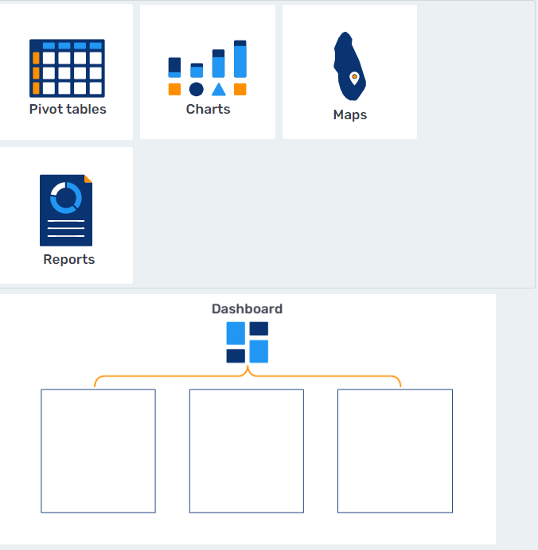

Options:

Reports. **Feedback**: No, Reports cannot be added into a Dashboard.

Pivot tables. **Feedback**: Correct! Pivot tables can be added into a Dashboard.

Charts. **Feedback**: Correct! Charts can be added into a Dashboard.

Maps. **Feedback**: Correct! Maps can be added into a Dashboard.

*Final **Feedback**: Good work! You have completed this drag and drop problem.*

**2. What can be done with a Dashboard in DHIS2?**

(Select all that apply.)

    A. View the charts, pivot tables, and maps most frequently used.
    B. Enter data directly to any output.
    C. Quickly monitor program progress.
    D. Readily share information with others.
    E. Establish a routine for regularly checking key program aspects.

**Feedback**: With a Dashboard, you can view the charts/tables/maps you use most frequently; quickly monitor program progress; readily share information with other users and user groups, and establish a routine for regularly checking key program aspects. Data cannot be entered through the Dashboard.

### 1.2 How is DHIS2 used? (15 min)

#### DHIS2 Use Cases: Applying DHIS2 to real-world problems

**DHIS2 use cases** are examples of the implementation of the generic DHIS2 software platform to meet specific real-world needs, from managing patient data at the health worker level to monitoring and evaluation at the national and international levels. DHIS2 use cases can be based on Aggregate, Event or Tracker data models, either individually or in combination with each other. These real-world examples **offer great insight into the capabilities of DHIS2**, and enhance best practice and community learning, as countries and organizations can share details of their implementations with each other.

In this section, you will learn how DHIS2 has been used in response to two of the world's most pressing health challenges, COVID-19 and Malaria, as well as how DHIS2 has been deployed outside of the health sector to meet the monitoring and evaluation needs of Education systems. Through these use cases, you will learn about how DHIS2 is customizable according to each program's and country's context and needs, as well as get an **introduction to DHIS2 metadata packages**, which help countries save time and align with global reporting standards through pre-set system configurations.

#### Use Case: Fast-tracking COVID-19 response using DHIS2 metadata packages

When the COVID-19 outbreak started in early 2020, more than 40 countries turned to DHIS2 to manage their data for various components of their COVID-19 response, including disease surveillance, port of entry screening, test result monitoring, and vaccination programs, with countries using Aggregate, Event and Tracker data depending on their specific needs and capacity.

In this use case, we will focus on **COVID-19 Aggregate Weekly Surveillance**, and explain how the **data set**, **validation rules** and **dashboards** in DHIS2 function to capture weekly data needed for rapid response to disease transmission and provide key statistics related to COVID-19.

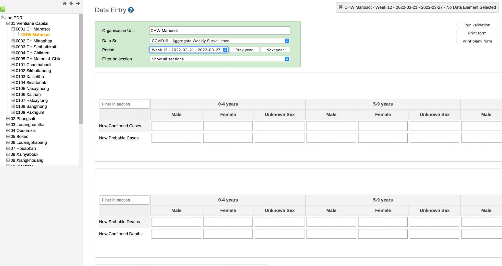

The COVID-19 Aggregate Weekly Surveillance data set is a surveillance report that is used as a weekly data collection form filled out at the facility level (i.e. at a hospital, health center, etc.). The data set has six separate components, which are displayed in DHIS2 as **sections** of the data entry form:

1. New confirmed and probable cases

2. New confirmed and probable deaths

3. Health worker infection and death

4. Hospitalization and discharges

5. Tests conducted

6. Transmission classification

Each section of this form includes two or more fields. For example, **new confirmed and probable cases** has: 1) New confirmed cases and 2) New probable cases, both of which are **disaggregated** by age and sex. This means that the number of male, female and unknown sex cases are reported separately, within defined age categories, which allows for more granular analysis of these data. The other sections of this form collect aggregate data values without disaggregations applied.

All of these elements of the COVID-19 data set, including frequency and level of reporting and disaggregations, **can be configured in DHIS2 to suit the local context**. You can learn more about configuring DHIS2 for aggregate data in the **Aggregate Customization Fundamentals** course.

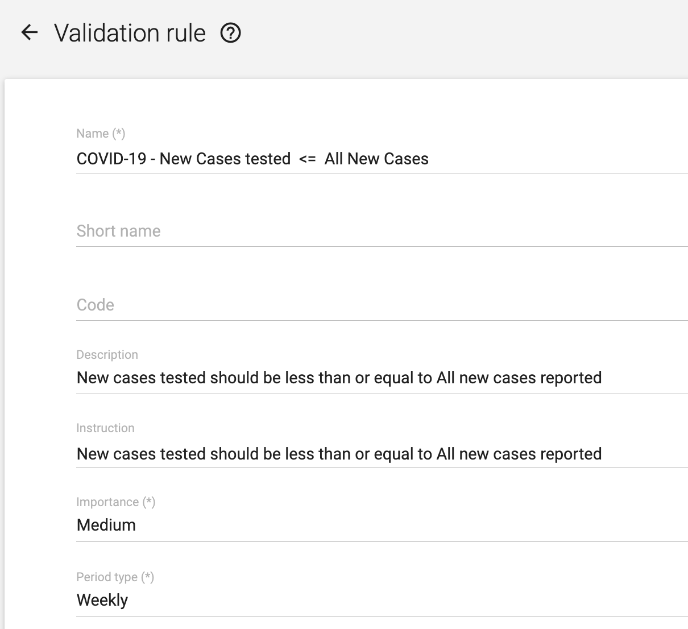

**Validation rules** allow you to run checks on the data that you have entered and stored in DHIS2. In this particular COVID-19 use case, the validation rules are scheduled to run weekly. These validation rules provide a straightforward **data quality check before any analytic outputs are created** from the collected data. You can learn more about validation rules for aggregate data in the **Aggregate Data Capture and Validation Fundamentals** course.

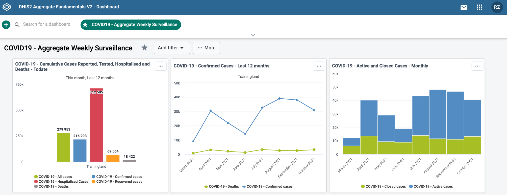

This use case also includes a DHIS2 **dashboard** for analyzing and monitoring COVID-19 data. In DHIS2, once data has been collected, visualizations can be created for data analysis. Dashboards are a collection of visualizations and other outputs, enabling you to quickly find, share and analyze important outputs. In this use case, the dashboard includes a number of outputs, including charts, a pivot table and a map, which illustrate key data points, such as the number of cumulative tests conducted, cases reported, cases hospitalized, cases discharged and deaths. Users can adjust the settings on the dashboard to view outputs at various levels of the health system hierarchy, to facilitate analysis from the national to the facility level.

This COVID-19 use case is an example of a **DHIS2 metadata package**, which are **installable, pre-built configurations** of metadata (including data sets, indicators, validation rules, and dashboards, among other components) that can be downloaded and installed into any DHIS2 system.

Metadata packages are designed in collaboration with the World Health Organization (WHO), United Nations Children's Fund (UNICEF) and other subject matter experts, and are designed around global standards and guidelines for key health programs. Metadata packages also **allow countries to fast-track their implementation of DHIS2** by starting from installable templates instead of a blank slate. Because of the flexibility of DHIS2, **each metadata package can be further adapted and customized** according to country requirements and context.

For more information on DHIS2 for COVID-19 response and metadata packages, please visit the [DHIS2 website](https://dhis2.org/covid-19/).

#### Use Case 2: Combating Malaria in Laos

#### Use Case 2: DHIS2 as a flexible platform to meet the national strategy needs from malaria reporting to malaria tracking for elimination

In this section, you will learn how DHIS2 was used for **malaria control and elimination programs** in Lao. This is an excellent use case to demonstrate **DHIS2's ability to evolve over time** as new data requirements and needs emerge. While this example focuses specifically on malaria data, the same processes and tools can apply to other types of programs managed in DHIS2.

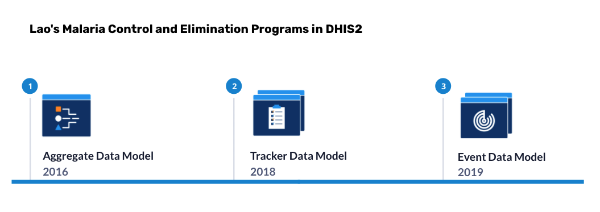

In 2016, Lao started using DHIS2 as a health information system for their national malaria program. This included adding their historical data-data they had previously collected -into DHIS2 using the **aggregate data model**. This data model was required since their data was numerical summaries of records. At the time, Lao was predominately collecting summaries of malaria records over the course of several years, as well as aggregate summaries of new cases reported on a monthly basis.

With DHIS2, Lao used **customized tools within the platform** to match the same format as their paper data collection forms, enabling their digital data collection forms to **keep the same appearance and requirements outlined by the national malaria program**. In addition, since DHIS2 includes **built-in translation and localization support**, these forms could be translated in the local Lao language for staff. Collecting these data using electronic forms in DHIS2 meant that **it was immediately available for analysis using dashboards, charts, maps** and other analytical outputs, instead of the time-consuming process of assembling these statistical outputs from data collected on paper forms.

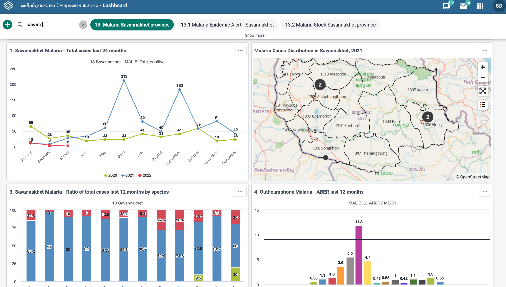

In 2018, health authorities in Lao decided to start **tracking individual malaria cases over time**, instead of simply collecting aggregate data on the number of cases. Through DHIS2, they were able to introduce the **tracker data mode**l for malaria elimination settings. In contrast to the aggregate model, this involves **collecting detailed information on each individual case** of malaria in these settings, and allows the individual cases to be monitored over time. This meant Lao was not only able to collect more malaria data, but more detailed malaria data, allowing for follow-up actions down to the patient-level, instead of just interventions based on analysis of regional and national trends.

In 2019, Lao decided to replace their aggregate data collection forms entirely and instead use the **event data model** for all positive malaria cases. In contrast to the tracker model, the event model is used to **capture individual data points, but not to monitor individual cases over time**. This meant that, for positive cases, no more numerical summary forms would need to be collected or tabulated, since event data can be aggregated automatically in DHIS2 according to the program's requirements. In addition, the source data became available for verification purposes at a more granular level than the aggregate model allows.

As Lao's malaria program adapted over the years, DHIS2 was fully capable to meet their data needs, adapting to changing requirements and additional complexity without the need to implement a new software system.

Several DHIS2 metadata packages for malaria are available to help countries deploy best-practice systems for malaria program management. For more information on DHIS2 for malaria management, please visit the [DHIS2 website](https://dhis2.org/metadata-package-downloads/#malaria).

#### Use Case 3: DHIS2 used as an integrated Education Management Information System

While DHIS2 is most commonly used as an information system in the health sector, the platform is also used in other sectors like education. Ministries of Education use DHIS2 for school management, resource allocation, multi-sectoral analysis (e.g. health, education, nutrition, social protection) and more. In this section, you will learn how DHIS2 is used as an **Education Management Information System (EMIS)** in The Gambia to equip educational providers with data to **improve school management, attendance and learning outcomes**.

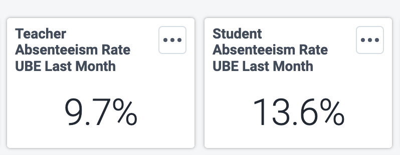

Through DHIS2, The Gambia was able to set up **essential indicators** needed to manage various administrative functions within an education system. These indicators provide data on **enrollment rates by grade, absenteeism rates** for students and teachers, **gender parity rates by school type**, as well as various school infrastructure indicators such as, the **number of classrooms**, **recreational facilities** and **textbooks** by subject.

The Gambia used the **aggregate data model** in DHIS2 to collect and manage data for **large-scale annual school census reports** as well as the everyday operations of school attendance records. They replaced their paper-based annual school census form with a digital form in DHIS2, collecting various enrollment details for each school (e.g. the number of classes, enrollment by grade, with disaggregations for age and sex) as well as data on classrooms, overall facilities, water resources, and textbooks for students and teachers.

The Gambia also utilized DHIS2 to collect **daily attendance records**. In their case, they needed to collect attendance twice every day, as the number of students can fluctuate between morning and afternoon school shifts. The Gambia was able to rely on DHIS2 to meet their different needs regarding the frequency of data collection.

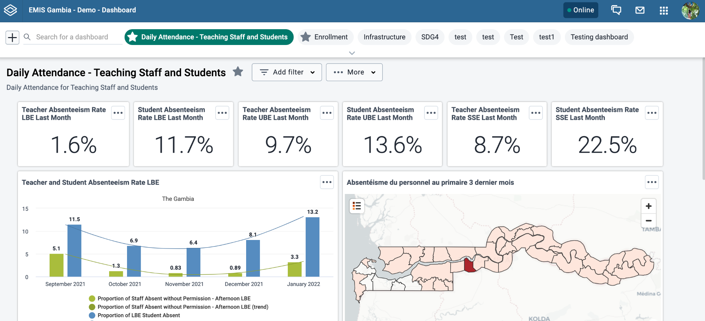

In addition to DHIS2's data collection solutions, the platform enabled The Gambia to analyze and routinely monitor their educational data through various **dashboards**. For example, an attendance dashboard was created with data visualizations on absenteeism for students and teachers by school type. Using dashboards enabled education planners in The Gambia to quickly view data visualizations on attendance to **understand trends or address any immediate concerns**. Since the data in the visualizations are automatically updated as new data is entered in DHIS2, they can immediately analyze the most recent data.

The Gambia has also introduced additional data models into their implementation of DHIS2. This includes the use of the **tracker data model** for collecting more detailed information on both students and teachers. Using the tracker data model in DHIS2 allows The Gambia to **follow the progress of individual students over time**, for example to track their grades and subjects as they progress through their education.

DHIS2 provides countries like The Gambia with a flexible platform for data collection, reporting and analysis in the education sector, equipping Ministries of Education and institutions of learning with the data they need to make informed decisions regarding the management of schools, infrastructure and resources to improve learning outcomes.

For more information on DHIS2 for education, please visit the [DHIS2 website.](https://dhis2.org/education/#:~:text=What%20is%20DHIS2%20for%20Education%3F&text=DHIS2%20for%20Education%20extends%20the,data%20from%20institutions%20of%20learning.)

### 1.3 Quiz (10 min)

#### Module 1 Quiz

This is a **graded quiz** and it is worth **40% of your final grade.**

You have **unlimited attempts** to answer each question.

Note that to succeed the course you need to reach at least the **average grade of 80%** across all quizzes.

For more detailed information about quiz navigation and grading, refer to the unit [Assess your progress: Knowledge checks and quizzes](https://academy.dhis2.org/courses/course-v1:hisp+GEN-D001-en+2022Q1/jump_to/block-v1:hisp+GEN-D001-en+2022Q1+type@vertical+block@363e7dce250441f58f3289a77b85e7ed) in section 0.3 Using the Online academy platform.

Select the "**submit**" button to submit your answers.

**1. DHIS2 is most similar to a:**

    A. Data port
    B. Data warehouse
    C. Data driveway
    D. Data highway

**Feedback**: A Data Warehouse is correct. DHIS2 works as a centralized data warehouse capable of capturing data from a number of different sources and devices including direct entry through the web or an android device, SMS and even other data sources such as spreadsheets or other electronic systems.*

**2. Aggregate data can be entered into DHIS2 using SMS.**

    A. True
    B. False

**Feedback**: True. Data can be entered into DHIS2 using the web interface, the Android app, SMS, spreadsheets, and other electronic means.*

**3. We can collect different types of data directly within DHIS2 (for example, aggregate data or anonymous individual-level data).**

    A. True
    B. False

**Feedback**: DHIS2 can collect different types of data directly within the application. This includes aggregate data, event data (anonymous, individual-level data) and tracker data (identifiable, individual-level data).

**4. At birth, John received his BCG vaccination. In 6 weeks, he will receive his DPT vaccination. John will subsequently receive DPT vaccinations at 10 weeks and 16 weeks of age. To follow up on him within this vaccination program, what DHIS2 model should be used to collect these data?**

    A. Aggregate
    B. Events
    C. Tracker

**Feedback**: The tracker data model allows entering data with individual identifiers which helps to follow up people on specific health programs.

**5. As a part of the COVID-19 vaccination campaign, a health facility needs a summary of the number of doses received and given on a daily basis. What data model should be used to enter these data in DHIS2?**

    A. Aggregate
    B. Events
    C. Tracker

**Feedback**: Aggregate data allows you to collect and enter numerical data directly into DHIS2 and then get reports with the summary of those data.

**6. The Ministry of Health is running a survey to know the needs of pregnant and lactating women in the country. The survey is collected at one point in time and the data do not need to be tracked to an individual woman.**

    A. Aggregate
    B. Events
    C. Tracker

**Feedback**: The events data model captures anonymous individualized data, which is useful for storing survey data captured for a single point in time rather than by period. This allows health ministries to obtain and analyze information to make informed decisions.

**7. The DHIS2 data quality tool that checks if the data entered follow predefined conditions or rules for the data to follow is:**

    A.Validation rule analysis
    B.Outlier analysis
    C.Follow-up analysis

**Feedback**: Validation rule analysis, tests validation rules against the data entered in the system.

**8. “The value registered for the third antenatal care visit (ANC 3), *cannot be higher than* the value registered for the second ANC visit (ANC 2)” is an example of a:**

    A. Validation rule
    B. Outlier analysis
    C. Follow-up analysis

**Feedback**: One way to check the quality of the data entered in DHIS2 is by testing them against predefined validation rules. The validation rule analysis tests validation rules against the data registered in the system. Validation violations are reported when the condition defined in the validation rule expression is not met, which means when the condition is false.

**9. The data quality tool that identifies values that are well above or below the standard deviation and are therefore potential errors is:**

    A. Validation rule analysis
    B. Outlier analysis
    C. Follow-up analysis

**Feedback**: The outlier analysis checks data quality, identifying those values that are potential outliers when compared to the standard normal distribution of the data under review.

**10. Follow-up analysis creates a list of all data values marked for follow-up by the user.**

     A. True
     B. False

**Feedback**: The follow-up analysis creates a list of all data values marked for follow-up. You can mark a data value for follow-up in the data entry app and in the result list you get from the outlier analysis.

**11. We can configure data quality checks by creating user-defined validation rules which check the data that is entered.**

    A. True
    B. False

**Feedback**: Mathematical rules, referred to as validation rules, can be defined by a user in order to check the data that is being entered. This is one of the electronic methods checking data quality in DHIS2.

**12. What are the 3 types of data visualizations available in DHIS2?**
*(Select 3 options)*

    A. Pivot tables
    B. Interpretations
    C. Charts
    D. Description
    E. Maps

**Feedback**: The 3 data visualizations available in DHIS2 are Pivot tables, Charts, and Maps. These can be expanded upon using descriptions and interpretations.

**13. In DHIS2, we can add interpretations based on our own analysis of the data being reviewed.**

    A. True
    B. False

**Feedback**: We can add an interpretation in response to reviewing a visualization in order to enable discussion and help guide direct actions.

**14. DHIS2 has a specific application to obtain reports outside of the 3 core visualization types.**

    A. True
    B. False

**Feedback**: DHIS2 provides several reporting tools through the Reports app.

**15. The outputs we create cannot be given additional descriptions/interpretations directly within DHIS2.**

    A. True
    B. False

**Feedback**: We can provide all of our outputs with additional descriptions and discuss interpretations directly within DHIS2. This allows us to give the item more context for when other users are reviewing the information.

**16. The analyses/outputs that we create cannot be shared with other users directly within DHIS2.**

    A. True
    B. False

**Feedback**: The analyses/outputs that are created can be shared with other users directly within DHIS2. This will be discussed more in later sessions.

**17. A Dashboard is a group of outputs that convey relevant information about a specific program.**

    A. True
    B. False

**Feedback**: The Dashboard is a page where you will find a collection of various outputs, such as charts, maps, and pivot tables created within DHIS2.

**18. Which of the following statements are true about dashboards in DHIS2?**
*(Select 3 options)*

    A. Dashboards provide quick access to different analytical outputs (tables, maps, charts)
    B. You can have different dashboards with collections of objects based on a program
    C. You can make dashboards public or private but you are not able to share a dashboard with specific users or user groups
    D. All users within a country see the same dashboards
    E. You can make interpretations of the outputs from the Dashboard and discuss them with other users

**Feedback**: Dashboard is typically the first thing users see when they log into DHIS2 so it's especially useful if users need quick access to information. Typically, a dashboard contains a collection of outputs regarding a specific topic or a program. The data that are shown in a user's dashboard depends on their own level of access. Interpretations can be made through the dashboard.

#### Check your score

To view your quiz score and check your overall progress, click on the button below or select the Progress tab at the top of the page. To pass the course you will need to score 80% or more on average between the 3 graded quizzes

[**Take me to the progress tab**](https://academy.dhis2.org/courses/course-v1:hisp+GEN-D001-en+2022Q1/progress)

#### Discussion forum

As we are reaching the end of the module, let's take some time to reflect on what you've learned and discuss the key concepts covered so far.

To do it, please click on the following link to the course discussion forum on the CoP to join this specific discussion topic:

[What is DHIS2 and how is it used?](https://community.dhis2.org/t/module-1-what-is-dhis2-and-how-is-it-used/46753)

*Note that if you can't see the page or if you reach an “Oops! That page doesn't exist or is private.”, please use [this invitation link](https://community.dhis2.org/invites/KLT3Dr3EQh) first to gain access to the private course discussion forum*

Even though this is an optional activity, we strongly recommend you take some time to think about your new knowledge, read what other course participants think, and make connections with your own prior experience and current learning needs. This will help you reinforce what you have learned and prepare for the next module.

Once you are done on the CoP, click the **"Return to course"** button at the bottom of the discussion topic page to be redirected back to the course to fill out the module **Feedback survey**.

If you are not joining the discussion on this module, simply click the next button below to continue to the survey.

### 1.4 Feedback Survey(2 min)

#### Module 1 Feedback Survey

Once you are done with the module, please take 2 or 3 minutes to complete this Feedback survey. Your careful response will have a real impact on how courses like this are run. Thank you!

[https://docs.google.com/forms/d/1eTlg96SK4jKQwfADmrsVIW-50z9jixiLQHrkqWmzX1Y/edit](https://docs.google.com/forms/d/1eTlg96SK4jKQwfADmrsVIW-50z9jixiLQHrkqWmzX1Y/edit)

## Module 2 - Understanding the basics of DHIS2 (45 min)

### 2.0 Overview of the module (5 min)

#### What is in this module?

What are the unique features of DHIS2? What are its building blocks? Why is it relevant that DHIS2 is open-source? How does it integrate with other software systems?

In this module, you will see **how DHIS2 organizes and categorizes data internally**, which is one of its unique features. You will start to familiarize yourself with concepts such as **data elements**, **organisation units**, and **periods**, which we refer to as the **building blocks** of DHIS2. You will then learn some of the advantages of managing data with an open-source platform like DHIS2. Finally, you will see how DHIS2 can be integrated with other platforms and applications to extend its capabilities.

#### Learning objectives

At the end of this module you will be able to:

- Identify the DHIS2 building blocks that make it possible to customize and extend the capabilities of the platform.

- Indicate DHIS2's advantages as open-source software and its potential for integration with other platforms.

#### How will you be evaluated?

At the end of the module there is a graded quiz. It contributes 30% to your final grade, and you will have unlimited attempts to complete it.

#### How long will this module take?

The module should take about **45 minutes** to complete.

### 2.1 DHIS2 building blocks (20 min)

#### Building blocks: Where, what and when in DHIS2

Now that you have learned about how data are collected, reviewed, shared, and you've seen some of the DHIS2 use-cases, how does DHIS2 actually work? What are its **building blocks**?

In this series of videos, you will explore the **three building blocks** of the DHIS2 data model, which is key to understanding how the platform works. This first video will introduce the three building blocks that represent the basic dimensions associated with any data value in DHIS2. In the subsequent videos, you will explore each of the three dimensions in more detail.

#### Key concepts

- Metadata

- Data element

- Organisation unit

- Period

[2.1.1 Introduction to DHIS2 - Building blocks: Where, what and when in DHIS2 - YouTube](https://www.youtube.com/watch?v=QbXKnly8P-0&t=115s)

#### Knowledge check

**1. In this lesson, you learned that DHIS2 has 3 building blocks. Drag the correct ones and drop them into the blank spaces in the image:**

Instruction: Drag the items onto the image above.

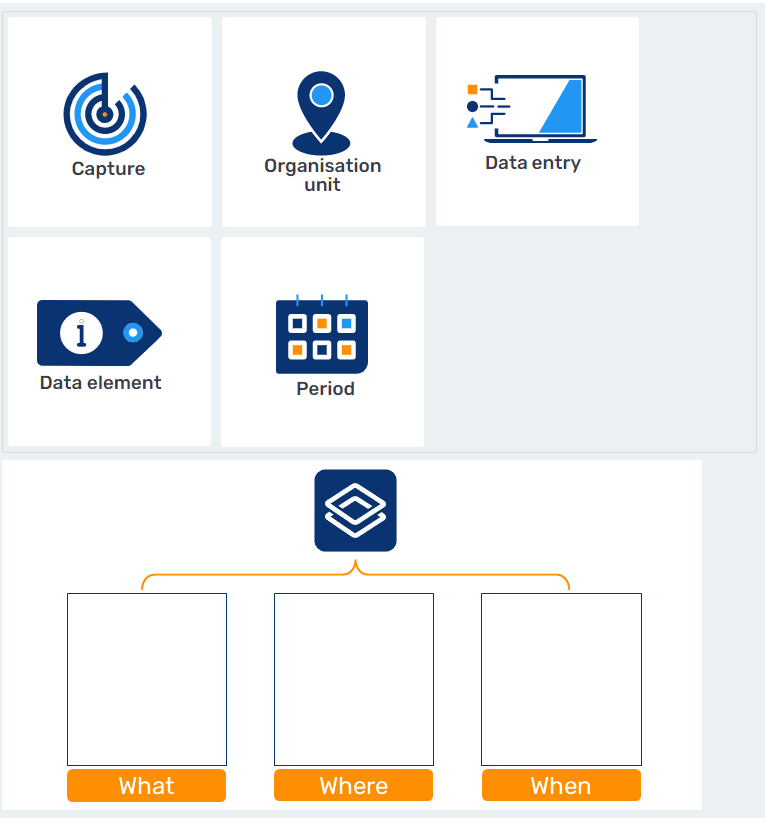

Data element: What. 
Feedback for correct answer: Correct! Data element is one of the DHIS2 building blocks and it represents what is been counted.

Organisation unit: Where. 
Feedback for correct answer: Correct! Organisation unit is one of the DHIS2 building blocks and it represents the geographical dimension of the data.

Period: When. 
Feedback for correct answer: Correct! Period is one of the DHIS2 building blocks and it represents when data were collected.

Data capture app: Error
Feedback: No, the data capture app is not a DHIS2 building block.

General incorrect Feedback: No, this item does not belong here.

#### Where: Organisation Unit

Now that you understand the basics of the three building blocks of DHIS2, let's start looking at each of these building blocks in a bit more detail.

In this video, you will learn about the **“Where” dimension** of DHIS2: **Organisation Units**. **Organisation Units represent the geographical dimension of the data**. They define where data are **captured** and how they can be **aggregated** from a geographical/organisational perspective, such as aggregation from facility data to regional data, and from regional to national levels. You will also learn about alternative ways of grouping facilities using “**organisation unit groups**” and “**organisation unit group sets**”, which are useful in data analysis.

##### Key concepts

- Organisation unit

- Hierarchy

- Organisation unit groups

- Organisation unit group sets

[https://youtu.be/M23Eu1SX44E](https://youtu.be/M23Eu1SX44E)

#### Knowledge check

**1. Which of the following options could be an Organization Unit in DHIS2?**
(*Select 3 options.*)

    A. Country
    B. Immunization Program
    C. Health Clinic
    D. District
    E. Hospitalizations and discharges data entry form

**Feedback**: Countries generally represent a level in the organisation unit hierarchy. The country is usually subdivided into smaller administrative units such as districts or regions. Commonly, the lowest level in the organisation unit hierarchy is the level of data collection where services are provided, such as health clinics.

**2. Organisation units determine where data can be captured.**

    A. True
    B. False

**Feedback**: Organisation units determine where data are captured.

#### What: Data Elements and Indicators

In this video, you will learn about the **“What” dimension** of DHIS2: **Data Elements.** You will learn about the main features of Data Elements, which define what kind of data are captured. You will also learn the distinction between Data Elements and **Indicators**, which are calculated using Data Elements. Along the way, you will find examples of each to clarify the distinction between the two.

##### Key concepts

- Data element

- Indicators

[https://youtu.be/c4GVZ6z6YZw](https://youtu.be/c4GVZ6z6YZw)

#### Knowledge check

**1. Which of the following would be best classified as Data Elements in DHIS2?**
(*Select all that apply*)

    A. Number of available hospital beds
    B. Maternal mortality ratio (per 100,000)
    C. Oral polio vaccine coverage
    D. Number of positive malaria cases

**Feedback**: “Number of available hospital beds” and “Number of positive malaria cases” are considered Data Elements as they represent a simple count and can be collected directly. On the other hand, indicator values are not collected like the data element values, but are calculated based on defined formulas.

**2. Which of the following statements about Indicators are true?**
*(Select 2 options)*

    A. They are raw data values
    B. They are calculated values
    C. They are often useful for comparison of health performance across geographical areas with very disparate target population sizes
    D. They are collected

**Feedback**: Indicators refer to values that are not entered directly, but instead are calculated using one or more data elements. They are useful when comparing areas of different population sizes

#### When: Periods

In the last video of the series about DHIS2 building blocks, you will learn about the **“When” dimension** of DHIS2: **Periods**. Periods in DHIS2 refer to the time frame associated with data. You will learn the similarities and differences of how periods are used in **data collection**, where data are captured for a predefined period of time, and **data analysis**, where data can be viewed in either **fixed** or **relative periods** to produce different analytics outputs.

##### Key concepts

- Period

- Relative period

- Fixed period

[https://youtu.be/wGWu0W33eqY](https://youtu.be/wGWu0W33eqY)

#### Knowledge check

**1. Which of the following are examples of relative periods?**
*(Select 3 options)*

    A. 2018
    B. Last month
    C. October 2020
    D. Last year
    E. Last six months

**Feedback**: Relative periods such as “last year”, “last month”, and “last six months,” are not defined in an absolute sense but rather in relation to the current date. The key difference between fixed and relative periods is that a fixed period does not update automatically over time for an analytic object; whereas a relative period will show new data as we move ahead with time.

### 2.2 What makes DHIS2 an open platform? (15 min)

#### Advantages of an open-source platform

DHIS2 is developed and supported as a **global public good**. This means that any country, organization or institution can download and use it to collect and utilize data to improve public services. Essential to the DHIS2 design is the ability of the platform to be extended and modified to meet specific, local needs. To facilitate this, DHIS2 utilizes an open-source model to make the platform open and accessible by all.

#### What does “open-source” mean?

DHIS2 is released as free and open software under the [BSD 3-clause license](https://opensource.org/licenses/BSD-3-Clause). This means that the application can be used free of charge, anyone can access the source code, and the software can be modified and redistributed with few restrictions. This allows the global DHIS2 community to innovate and extend the software to meet local needs, and share these contributions globally.

HISP UiO also considers all supporting material that we produce in relation to the DHIS2 project (documentation, translations and training materials) to be open-source, and we make them freely available for local modification and use.

#### The advantages of the open-source model

Offering DHIS2 as free and open-source means that **anyone can download, configure and deploy it** for as many users and devices as required, **at no cost for the software itself and with no licensing fees**. In comparison, proprietary software systems typically require the purchase of a license for each user. It is important to note, however, that while DHIS2 is free to download and use, it is not a fully out-of-the-box solution and will require additional configuration, planning, training, infrastructure and maintenance resources.

Another primary advantage of the DHIS2 code and data models being open is that it allows individuals and organizations **full access to the platform architecture**. This means individuals and organizations can more easily build custom applications to extend the functionality of their system, or link DHIS2 with other systems through interoperability solutions or metadata exchange. These local innovations and solutions can subsequently be integrated back into the DHIS2 source code, thus contributing to the greater good. Individuals and organizations also have the ability to modify and/or redistribute the core DHIS2 source code directly, with some limitations. However, this is relatively uncommon in practice, due to the complexities for long-term code maintenance.

While the core platform is developed by the University of Oslo, each implementation of DHIS2 (including configuration settings and the data contained within it) is **locally owned and controlled** by the organization responsible for the system. This allows members of the DHIS2 community to leverage global DHIS2 resources while also having their own, customized DHIS2 system, which they completely own and operate themselves.

Finally, there is a large **community** available to provide guidance on implementing DHIS2, as well as additional training and documentation that is available to support organizations in making DHIS2 work for them, all governed by open-source principles.

Open-source code also supports platform **security and stability**. External developers and security experts who identify errors in functionality or security, can refer back to the source code to help determine the source of any issues they identify.

#### Integration with other platforms

### What is interoperability?

In a national health system, it is common to have several different information management platforms performing complementary functions alongside one another. These systems may need to exchange information - or “talk” to each other- in order for decision makers to obtain a broader, more detailed picture of what is happening in the health system as a whole. The ability to send and receive information between different systems, software and file formats is referred to as **interoperability**.

For example, DHIS2 and OpenMRS (**M**edical **R**ecords **S**ystem) are interoperable, because they allow the sharing of data and data definitions with each other. In this example, a health system may use OpenMRS to store detailed medical records for each individual hospital admission (among other hospital data). Meanwhile, the health system's DHIS2 implementation may only require the aggregate number of hospital admissions separated by various criteria. Interoperability allows DHIS2 to receive these totals from OpenMRS and use them for analysis in combination with other data stored in DHIS2. This is commonly referred to as a 1:1 integration, as you are linking one system directly to another.

#### How does interoperability work?

Interoperability depends on standards for data formats, interfaces, codes and terminologies. In an ideal situation, these would be drawn from international standards. However, in most contexts, a mix of international and local standards are used. These standards can be broken down into two levels:

1. **Content**: Ensuring what is being shared between systems represents the same item conceptually

2. **Technical**: Involving the mechanism used to actually transmit the data from one system to the other

At the **content** level, consistency of definitions is required. This includes not just consistency of data element definitions, but also of their disaggregations. To return to our OpenMRS example, if the “hospital admissions” data element in DHIS2 did not include the required disaggregations from OpenMRS (such as age and sex), but instead defined admissions as a total value, this would result in difficulty sharing these data.

At the **technical** level, various data exchange standards can be adopted. One standard example for aggregate data is called [ADX](https://wiki.ihe.net/index.php/Aggregate_Data_Exchange) (**A**ggregate **D**ata e**X**change), which is used to share aggregate data across various systems, including DHIS2. Another commonly discussed standard is [FHIR](https://www.hl7.org/fhir/overview.html) (**F**ast **H**ealthcare **I**nteroperability **R**esource), which is a standard for exchanging healthcare information electronically. HISP and the DHIS2 community are actively involved in supporting the development and use of global standards such as these.

#### Interoperability between DHIS2 and other systems

One of the most common DHIS2 interoperability scenarios is using DHIS2 as a **data warehouse**. This term describes how DHIS2 can be used to receive information from multiple information systems and sources to facilitate data triangulation. In this scenario, DHIS2 often acts as the standard for metadata that is shared across these connected systems, allowing for alignment of codes, definitions and IDs for the information being exchanged.

Let's look at an example of how specific ADX-compatible systems could be linked to DHIS2:

- [iHRIS](https://www.ihris.org/): A system for tracking and managing health workforce data

- [OpenMRS](https://openmrs.org/): A medical records system

- [OpenELIS](https://openelis-global.org/): A laboratory enterprise information system.

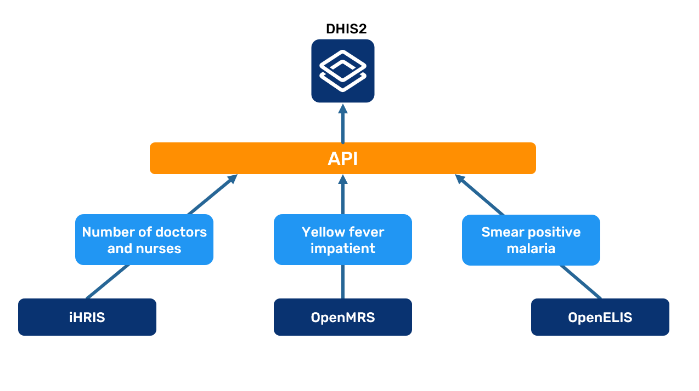

As the diagram shows, iHRIS can send relevant data to DHIS2, such as the "number of doctors", "number of nurses" and "total number of staff”. OpenMRS is able to aggregate data on inpatient diseases and send the aggregated data to DHIS2. OpenELIS can generate data on the outcome of laboratory tests and send them to DHIS2. In this interoperable network, the DHIS2 application serves as an integrated data warehouse that hosts data from these various sources, where the data can be used on a national level to make informed decisions.

There are additional interoperability scenarios in which DHIS2 may play a smaller overall role. In these scenarios, instead of using DHIS2 to combine data from other systems, data in DHIS2 may be sent to other systems that require it. This can include national, global or regional systems that require information from DHIS2. For example, DHIS2 may send national disease surveillance data to a regional surveillance information system to facilitate cross-regional/border surveillance.

While these interoperability and data exchange models are achievable, in practice there are often many practical challenges. Many of the systems involved in exchanging information will face ongoing, dynamic developments over time; this can include changes to the content as well as software version revisions or technical updates. As a result, an exchange that is working at a certain point in time may not work as systems are developed further. Interoperability is a process that requires strong governance to coordinate content across systems, as well as technical skills that are available on an ongoing basis as systems are initially implemented and modified. For more information on interoperability concepts, please consult our documentation.

### 2.3 Quiz (10 min)

#### Module 2 Quiz

This is a graded quiz and it is **worth 30%** of your final grade

You have **unlimited attempts** to answer each question.

Note that to succeed the course you need to reach an average grade of at least 80% across all quizzes.

For more detailed information about quiz navigation and grading, refer to the unit [Assess your progress: Knowledge checks and quizzes](https://academy.dhis2.org/courses/course-v1:hisp+GEN-D001-en+2022Q1/jump_to/block-v1:hisp+GEN-D001-en+2022Q1+type@vertical+block@363e7dce250441f58f3289a77b85e7ed) in section 0.3 Using the Online academy platform.

Select the "**submit**" button to submit your answers.

**1. What is the term used that describes the type of data that classifies and organizes other data?**

    A. Alter-Data
    B. Metadata
    C. Customized data
    D. Categories

**Feedback**: Metadata is the correct answer. We refer to metadata as any information that is describing your data.

**2. To visualize any data in DHIS2 we need at least these three dimensions:**
*(Select 3 options)*

    A. The data element
    B. The period
    C. The organisation unit
    D. The people
    E. The data form

**Feedback**: For creating any visualization in DHIS2 you need to add three dimensions: the Data Element or the “what”, the Period or the “when“ and the Organisation Unit or the “where”. The people and data form are not dimensions for creating data visualizations in DHIS2.

**3. Which of the following are the core dimensions of data values in DHIS2?**
*(Select 3 options)*

    A. Organisation Unit (the “Where”)
    B. Data Set (the “What”)
    C. Data Element (the “What”)
    D. Period (the “When”)
    E. Patients and clients (the “Who”)

**Feedback**: As highlighted in the building blocks presentation, there are 3 core dimensions in DHIS2. The Organisation Unit refers to the geographical location or “where” aspect, Data Element refers to “what” we are collecting, and Period refers to “when” we are collecting that information.

**4. Which of the following options could be an Organisation Unit in DHIS2?**
*(Select 3 options)*

    A. Country
    B. Immunization Program
    C. Health Clinic
    D. District
    E. Hospitalizations and discharges data entry form

**Feedback**: Countries generally represent a level in the organisation unit hierarchy. The country is usually subdivided into smaller administrative units, such as districts or regions. Commonly, the lowest level in the organisation unit hierarchy is the level of data collection where services are provided, such as health clinics.

**5. Organisation Units represent:**
*(Select 1 option)*

    A. The geographical dimension of the data
    B. Calculated data values
    C. Health program projects
    D. The type of health facilities

**Feedback**: Organisation Units are referred to as the geographical dimension of the data.

**6. How many levels does an organisation unit hierarchy have?**

    A. 4 levels (country, province, district, facility)
    B. Maximum of 5 levels
    C. Maximum of 10 levels
    D. Dependent on each country´s context or project analytical requirements

**Feedback**: The structure of each organisation unit hierarchy, including the number of levels, is fully customizable in DHIS2 to adapt to each country's context or analytics requirements of the program being supported.

**7. Organisation Units determine where data can be captured**

    A. True
    B. False

**Feedback**: Organisation Units determine where data are captured.

**8. Organisation Units determine how the data can be aggregated and disaggregated along the geographical dimension.**

    A. True
    B. False

**Feedback**: Organisation Units are one of the keystones of the DHIS2 system and as such are vital for many of its functions, such as data capture, data aggregation and disaggregation along the geographical dimensions.

**9. What is the main use of organisation units groups and group sets?**
*(Select 2 options)*

    A. They help to disaggregate data by gender and age
    B. They allow for organisation units to be classified by other criteria, such as facility type or type of ownership
    C. They allow for disaggregating data in our analysis to reveal any variations between defined organization unit groups (such as private vs public facilities)
    D. They help to create the organisational structure or hierarchy
    E. They allow for selecting a specific group or health facilities based on the data collected on them

**Feedback**: Organisation unit groups and organisation unit group sets allow for classifying organisation units by criteria other than the main administrative hierarchy, such as type of ownership, type of facility etc. In analytics, they are useful for viewing data by groups to see if trends differ (for example, private vs public health facilities).

**10. Which of the following statements about Indicators are true:**
*(Select 2 options)*

    A. They are raw data values
    B. They are collected
    C. They are calculated values
    D. They are often useful for comparison of health performance across geographical areas with very disparate target population sizes

**Feedback**: Indicators refer to values that are not entered directly, but instead are calculated using one or more data elements. They are useful to compare areas of different population sizes.

**11. In DHIS2, indicators are calculated using a formula that contains a numerator, a denominator, and a factor.**

    A. True
    B. False

**Feedback**: In DHIS2, all indicators must have a numerator, denominator, and a multiplying factor. However, if the calculator is a total number, for example, “Total ANC visits” (ANC1 + ANC2 + ANC3 + ANC4), then the denominator and the multiplying factor would both be 1.

**12. In DHIS2, Data Elements and Indicators represent the same concept.**

    A. True
    B. False

**Feedback**: Data Elements and Indicators represent different concepts. Data Elements are the raw data, while Indicators are calculated values.

**13. Which of the following would be best classified as Data Elements in DHIS2?**
*(Select 2 options)*

    A. Number of available hospital beds
    B. Maternal mortality ratio (per 100,000)
    C. Number of positive malaria cases
    D. Oral polio vaccine coverage

**Feedback**: “Number of available hospital beds” and “Number of positive malaria cases” are considered data elements as they represent a simple count and can be collected directly. On the other hand, indicator values are not collected like the data element values, but are calculated based on defined formulas.

**14. Which of the following are examples of relative periods?**
*(Select all that apply)*

    A. 2018
    B. Last month
    C. October 2020
    D. Last year
    E. Last 6 months

**Feedback**: Relative periods such as “last year”, “last month”, and “last 6 months”, are not defined in an absolute sense but rather in relation to the current date. The key difference between fixed and relative periods is that a fixed period does not update automatically over time for an analytic object; whereas a relative period will show new data as we move ahead with time.

**15. This chart was generated in March 2021. The chart uses what period type?**

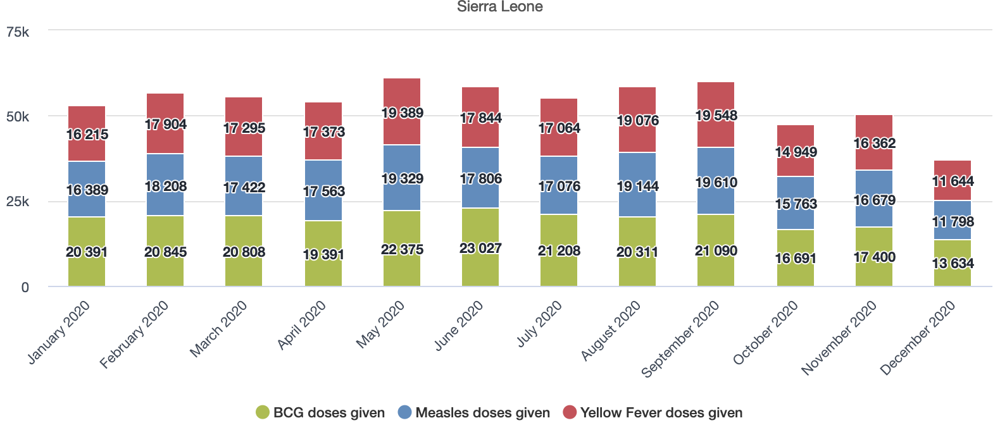

    A. A fixed period in which all months in 2020 were selected
    B. A relative period in which the last 12 months was selected
    C. A fixed period in which the year 2020 was selected
    D. A relative period in which the last year was selected

**Feedback**: The period used in the graph is monthly 2020.

#### Check your score

To view your quiz score and check your overall progress, click on the button below or select the Progress tab at the top of the page. To pass the course you will need to score 80% or more on average between the 3 graded quizzes

[**Take me to the progress tab**](https://academy.dhis2.org/courses/course-v1:hisp+GEN-D001-en+2022Q1/progress)

#### Discussion forum

As we are reaching the end of the module, let's take some time to reflect on what you've learned and discuss the key concepts covered so far. To do it, if you have already joined the course discussion forum, please click on the following link to join this specific discussion topic:

[Understanding the basics on DHIS2](https://community.dhis2.org/invites/X47wjg6rmU)

*Note that if you can't see the page or if you reach an “Oops! That page doesn't exist or is private.”, please use [this invitation link](https://community.dhis2.org/invites/X47wjg6rmU) first to gain access to the private course discussion forum*

Even though this is an optional activity, we strongly recommend you take some time to think about your new knowledge, read what other course participants think, and make connections with your own prior experience and current learning needs. This will help you reinforce what you have learned and prepare for the next module.

Once you are done on the CoP, click the **"Return to course"** button at the bottom of the discussion topic page to be redirected back to the course to fill out the module **Feedback** survey.

If you are not joining the discussion on this module, simply click the next button below to continue to the survey.

### 2.4 **Feedback** Survey (2 min)

#### Module 2 **Feedback** Survey

Once you are done with the module, please take 2 or 3 minutes to complete this **Feedback** survey. Your careful response will have a real impact on how courses like this are run. Thank you!

[Link to survey](https://docs.google.com/forms/d/16Ks2sBy8vDDzUgyNhUPDtsgJE8xy91oxoTWQxOQZTzk/edit)

## Module 3 - DHIS2: A global community-driven project (45 min)

### 3.0 Overview of the module (5 min)

#### Module 3 - DHIS2: A global community-driven project

Now that you've covered the where, what and when of the DHIS2 system, alongside some of the basic use cases of DHIS2, it's time to put DHIS2 into context. How did DHIS2 get started? How is it used to help save lives and improve health outcomes? In this module, we'll look at each of these questions, and help you understand DHIS2 in the world of Global Digital Health programs.

#### Learning objectives

At the end of this module you will be able to:

- Recognize the roles and the relationship between the University of Oslo (UiO) and the HISP network to create, develop, apply, and improve DHIS2 in the context of Global Digital Health programs.

- Distinguish the elements that comprise the DHIS2 ecosystem and the ways to interact with the DHIS2 global community.

#### How will you be evaluated?

At the end of the module there is a graded quiz. It contributes **30% to your final grade**, and you will have unlimited attempts to complete it.

#### How long will this module take?

The module should take about **45 mins** to complete.

### 3.1 Where does DHIS2 come from? (15 min)

#### Once upon a time…(the history of DHIS2)

Before DHIS2 was able to help billions of people around the world, it started as an idea to support an equitable health system in South Africa following the end of apartheid.

In this video, you will discover how DHIS2 started, and the major milestones it has hit along the way. Select the play button below to get started.

[Video - Once upon a time.. (Youtube)](https://youtu.be/mJ5t-33J1NY)

#### Key milestones of DHIS2

Now that you have seen an overview of the history of DHIS2, now you can explore the key milestones in more detail. Click the play button below to get started. You can use the Next and Back buttons to navigate through the slides.

[https://dhis2-academy.ispring.com/app/preview/80b500b6-eefa-11eb-ae06-ee629771cfd6](https://dhis2-academy.ispring.com/app/preview/80b500b6-eefa-11eb-ae06-ee629771cfd6)

#### DHIS2 around the world

Since DHIS launched in the nineties, DHIS2 has been implemented in over 70 countries around the world, and additional countries are deploying DHIS2 every year. The interactive map below shows you where and when DHIS2 was implemented.

Click on the items in the sidebar on the left to see the geographical scope of different DHIS2 implementations, including as a Health Management Information System (HMIS), for [COVID-19 Surveillance](https://dhis2.org/covid-surveillance/) and [COVID-19 Vaccine Delivery](https://dhis2.org/covid-vaccine-delivery/), for collecting individual-level data with [Tracker](https://dhis2.org/tracker-in-action/), for mobile data entry with the [DHIS2 Android App](https://dhis2.org/android-in-action/), for standardized [WHO digital data packages](https://dhis2.org/who/), and as an [Education Management Information System (EMIS)](https://dhis2.org/education/). In each view, click on the highlighted countries for more information about their specific implementations.

### 3.2 The global DHIS2 community (15 min)

#### DHIS2 and HISP

As you saw in previous lessons, DHIS2 originally launched as a project from the Health Information Systems Programme, or HISP, in South Africa in 1994. But what does HISP do now? And how does it relate to DHIS2?

In this video, you will discover how HISP works as a global movement to strengthen health information systems. You will also learn about how HISP is involved in the development of DHIS2, and helps implement DHIS2 around the world. Click the play button below to get started.

[Video - DHIS2 and HISP (Youtube link)](https://youtu.be/bUNx9p1FJV4)

#### The DHIS2 community

#### You are not alone

DHIS2 wouldn't be possible without the hundreds of people who are involved in development, implementation, capacity building, planning, program management, community outreach and support.

In this video, you'll meet some of the people behind DHIS2 and HISP, who help run implementations, build applications, and train users of DHIS2.

[Video - You are not alone (Youtube link)](https://youtu.be/kyOaU3bZUjg)

#### Components of the DHIS2 ecosystem

DHIS2 is more than just a piece of software. As you've learned, it is a community effort that wouldn't be possible without the people who research, develop, implement, localize and use the platform. This community effort is facilitated by a range of initiatives, programs, platforms and tools that make up the DHIS2 ecosystem.

In this video, you'll discover the different parts of the ecosystem, and how you can get involved. Click the play button below to get started.

[Video - Components of the DHIS2 Ecosystem (Youtube link)](https://youtu.be/STpBYarxNrM)

#### Get involved with DHIS2

Now that you have learned about the different parts of the DHIS2 ecosystem, here you'll find a list of the various components with links that allow you to learn more and get involved in the DHIS2 project.

- HISP research: [https://dhis2.org/research/](https://dhis2.org/research/)

- HISP network: [https://dhis2.org/hisp-network](https://dhis2.org/hisp-network)

- Community of Practice: [https://community.dhis2.org/](https://community.dhis2.org/)

- Documentation: [https://docs.dhis2.org/](https://docs.dhis2.org/)

- GitHub: [https://github.com/dhis2/](https://github.com/dhis2/)

- Transifex: [https://www.transifex.com/hisp-uio/public/](https://www.transifex.com/hisp-uio/public/)

- DHIS2 Academy: [https://www.dhis2.org/academy](https://www.dhis2.org/academy)

- Demo databases: [https://play.dhis2.org](https://play.dhis2.org)

- Jira: [http://jira.dhis2.org/](http://jira.dhis2.org/)

- Developer Portal: [https://developers.dhis2.org/](https://developers.dhis2.org/)

- App Hub: [https://apps.dhis2.org/](https://apps.dhis2.org/)

- Website: [https://dhis2.org/](https://dhis2.org/)

- DHIS2 newsletter: [https://dhis2.org/contact/](https://dhis2.org/contact/)

- Twitter: [https://twitter.com/dhis\_2](https://twitter.com/dhis_2)

- Facebook: [https://www.facebook.com/dhis2/](https://www.facebook.com/dhis2/)

### 3.3 Quiz (10 min)

#### Module 3 Quiz

This is a graded quiz and it is **worth 30%** of your final grade

You have **unlimited attempts** to answer each question.

Note that to succeed the course you need to reach an average grade of at least 80% across all quizzes.

For more detailed information about quiz navigation and grading, refer to the unit [Assess your progress: Knowledge checks and quizzes](https://academy.dhis2.org/courses/course-v1:hisp+GEN-D001-en+2022Q1/jump_to/block-v1:hisp+GEN-D001-en+2022Q1+type@vertical+block@363e7dce250441f58f3289a77b85e7ed) in section 0.3 Using the Online academy platform.

Select the "**submit**" button to submit your answers.

**1. Which country did the HISP project launch in?**
*(Select 1 option)*

    A. Norway
    B. South Africa
    C. Kenya
    D. Gambia

**Feedback**: HISP launched in South Africa in 1994, and set the DHIS project in motion.

**2. In which country did the first implementation of DHIS2 launch in 2006?**
*(Select 1 option)*

    A. Norway
    B. South Africa
    C. Ugand
    D. India

**Feedback**: DHIS2 launched in Kerala, India after development began in 2000.

**3. What aspect of DHIS2 started in 2018, allowing DHIS2 users to discuss, interact and learn from each other?**

    A. DHIS2 Design Lab
    B. DHIS2 Documentation
    C. DHIS2 Community of Practice
    D. DHIS2 Jira

**Feedback**: The Community of Practice is a website that allows DHIS2 practitioners to connect with others and share best practices globally.

**4. Which 2014 outbreak did the HISP network assist in with deploying DHIS2 in Liberia?**

    A. MERS
    B. H1N1
    C. Ebola
    D. Measles

**Feedback**: The HISP network assisted health authorities in Liberia in deploying DHIS2 for the Ebola outbreak response. The initial Tracker model deployed there have since been expanded upon for case-based surveillance of other diseases.

**5. HISP stands for Health Information Systems Programme.**

    A. True
    B. False

**Feedback**: True. HISP stands for Health Information Systems Programme.

**6. Who is each HISP led by?**
*(Select 1 option)*

    A. The local Health Ministry
    B. DHIS2 expert
    C. A regional NGO
    D. The University of Oslo

**Feedback** : HISPs are led by local DHIS2 experts, and work alongside local Health Ministries, regional NGOs and the core DHIS2 team based at the University of Oslo to implement DHIS2.

**7. HISP can be described as:**
*(Select 3 options)*

    A. A global movement
    B. A group that provides DHIS2 implementation support
    C. A group that provides standards and requirements for DHIS2
    D. The group responsible for the development of the DHIS2 software

**Feedback**: HISP can be described as a global movement that provides DHIS2 implementation support, including standards and requirements for DHIS2. The University of Oslo (UiO) is responsible for the development of the DHIS2 software.

**8. Which of the following resources allows you to explore DHIS2 features and check the latest version of the platform?**
*(Select 1 option)*

    A. translate.dhis2.org
    B. jira.dhis2.org
    C. play.dhis2.org
    D. github.dhis2.org

**Feedback**: On the website **play.dhis2.org,** you can explore DHIS2 features and practice your skills on a demo version of the platform.

**9. If you want to contribute to DHIS2 localization to other languages and help to reach users all over the world, you can go to:**
*(Select 1 option)*

    A. translate.dhis2.org
    B. jira.dhis2.org
    C. play.dhis2.org
    D. github.dhis2.org

**Feedback**: On the website **translate.dhis2.org,** you can support the global translation effort of DHIS2 through the Transifex platform.

**10. If you want to notify the software development team of anything that might do not work with the platform, you can do it in:**
*(Select 1 option)

    A. translate.dhis2.org
    B. jira.dhis2.org
    C. play.dhis2.org
    D. github.dhis2.org

**Feedback**: On the website **jira.dhis2.org,** you can report bugs or request features by creating a support ticket for the DHIS2 software development team.

**11. If you want to download the source code of DHIS2 to install it on your own server, you can do it in:**
*(Select 1 option)*

    A. translate.dhis2.org
    B. jira.dhis2.org
    C. play.dhis2.org
    D. github.dhis2.org

**Feedback**: As DHIS2 is open-source, you can find all of its source code inside GitHub in github.dhis2.org. You can also find all of the DHIS2 Documentation in the same place.

**12. If you want to find detailed information about each of the DHIS2 features you can do it in:**
*(Select 1 option)*

    A. translate.dhis2.org
    B. jira.dhis2.org
    C. play.dhis2.org
    D. docs.dhis2.org

**Feedback**: The DHIS2 documentation contains detailed information and implementation considerations available for DHIS2, and is written by a core team of DHIS2 experts. These guides are all available at docs.dhis2.org.

**13. If you want to take a course to develop your DHIS2 skills and interact with DHIS2 experts, you can do it in:**
*(Select 1 option)*

    A. DHIS2 Design Lab
    B. DHIS2 Academy
    C. DHIS2 Developer Portal
    D. DHIS2 Community of Practice

**Feedback**: If you want to develop your DHIS2 skills, you can take a DHIS2 Academy course. The academy program includes both online and in-person courses on both general and specialized topics.

**14. HISP groups, together with HISP UiO, form a global network of partners that share common values, including open-source principles, local ownership, sustainability, transparency, and empowering data use.**

    A. True
    B. False

**Feedback**: True. HISP groups and HISP UiO work as a global network of partners that share common values and support each other in various ways.

**15. HISP groups are the most important source of requirements of DHIS2 features that are then implemented by the HISP UiO software development team.**

    A. True
    B. False

**Feedback**: While software development is led by HISP UiO, the HISP groups are the most important source of requirements for software features and field testing of DHIS2 releases, due to their close work with country governments.

#### Check your score

To view your quiz score and check your overall progress, click on the button below or select the Progress tab at the top of the page. To pass the course you will need to score 80% or more on average between the 3 graded quizzes

[**Take me to the progress tab**](https://academy.dhis2.org/courses/course-v1:hisp+GEN-D001-en+2022Q1/progress)

#### Discussion forum

As we are reaching the end of the module, let's take some time to reflect on what you've learned and discuss the key concepts covered so far.

To do it, please click on the following link to the course discussion forum on the CoP to join this specific discussion topic:

[A global community-driven project](https://community.dhis2.org/invites/R9TxH31Ccr)

*Note that if you can't see the page or if you reach an “Oops! That page doesn't exist or is private.”, please use [this invitation link](https://community.dhis2.org/invites/X47wjg6rmU) first to gain access to the private course discussion forum*

Even though this is an optional activity, we strongly recommend you take some time to think about your new knowledge, read what other course participants think, and make connections with your own prior experience and current learning needs. This will help reinforce what you have learned and prepare you for what is coming next.

Once you are done on the CoP, click the **"Return to course"** button at the bottom of the discussion topic page to be redirected back to the course to fill out the module **Feedback** survey.

If you are not joining the discussion on this module, simply click the next button below to continue to the survey.

### 3.4 **Feedback** Survey (2 min)

#### Module 3 **Feedback** Survey

Once you are done with the module, please take 2 or 3 minutes to complete this **Feedback** survey. Your careful response will have a real impact on how courses like this are run. Thank you!

[Link to survey](https://docs.google.com/forms/d/1g0eN8F1XakKXupdCnpULc-_S40BANZp1Ro1os_mCheU/edit)

## Module 4 - Course closing and next steps (10 min)

### 4.1 - Course closing

You have now finished the Introduction to DHIS2 course. You should now have a good grasp of how DHIS2 can be used in multiple fields to capture, analyze, and share data to facilitate decision-making. Remember, even though you have completed the course, you can return to it in the future, so if you need to revisit a concept or demonstration, just come back to the DHIS2 online academy and review the course.

#### Check your progress and claim your course certificate

To get the course certificate, you need to achieve a passing grade of 80% or more. To check your current grade and claim your certificate, click on the buttom bellow to go the **Progress page** and review your score. If you have already achieved a passing grade, congratulations, you can claim your certificate now!

[View progress and claim my certificate](https://academy.dhis2.org/courses/course-v1:hisp+GEN-D202-en+2022_Q4/progress)

*Note: if you have just completed the last quiz and achieved a passing grade, but the option to claim certificate is not available yet, try waiting a couple of minutes for the system to register the results.*

#### Download your course certificate

You can download or print out your certificate to share it in your social and professional networks.

To download your certificate, follow these steps:

1. On the progress tab, claim your certificate if you haven't done so yet

2. Select **“View certificate”**

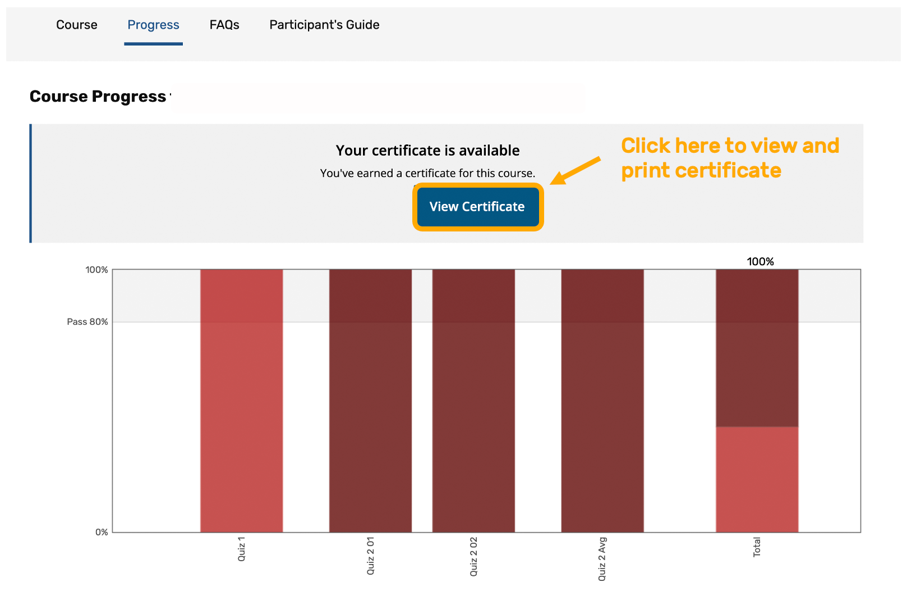

3. Select **“Print certificate”** at the top right corner of the page

#### Tell us how we can improve

Once you finish the course, please give us your **Feedback** by completing the end-of-course survey. We constantly check participants' **Feedback** and look for ways to improve our courses. We truly appreciate your input.

### 4.2 - End-of-course Survey (3 min)

Now that you are at the end of this course, please take a few minutes to reflect on your experience and complete this **Feedback** survey. Your careful response will have a real impact on how courses like this are run. Thank you!

[Link to survey](https://docs.google.com/forms/d/1Nr7Dl6BWy_FlfURJjb3k7GQMWt35u7TRiorQ8oZ6FQM/edit)

### 4.3 - Keep learning (7 min)

#### DHIS2 Fundamentals

We want to briefly introduce you to the following courses from the DHIS2 Fundamentals series:

- Aggregate [Data Capture and Validation](https://www.academy.dhis2.org/)Fundamentals: In this course, you will learn how to use DHIS2 applications to enter aggregate data and verify its quality.

- Aggregate [Data Analysis](https://www.academy.dhis2.org/) Fundamentals: In this course, you will learn to create pivot tables and visualize aggregate data through charts and maps to support data interpretation and decision-making.

- Aggregate [Customization](https://www.academy.dhis2.org/) Fundamentals: In this course, you will get to know the key elements that can be customized in DHIS2 according to your program and organizational structure.

- [DHIS2 Events Fundamentals](https://academy.dhis2.org/courses/course-v1:HISP+D2EVENTS100+Q2_2020/course/): In this course, you will learn to work with individual-level data with an emphasis on event programs, including creating event data outputs and configuring event program metadata within DHIS2.

#### How can you enroll in these courses?

Directly at the DHIS2 online academy. Select each course from the course catalog to learn more about it, including any prerequisites for each specific course. You will find an enrollment button on the course description page for each active course.

#### When and in what order should I take these courses?

There is no specific order to take the courses, it depends on your own learning needs. There are also no specific dates to start or finish as all courses are self-paced.

#### Do I have to take all the courses to be eligible for level 1 or level 2 academies?

It is not necessary that you take all the courses in the Fundamentals series to qualify for level 1 or level 2 academies. In the following interactive diagram you will see the sequence of courses that we recommend you follow according to your user profile/role and interests. By selecting a particular course you will see a description of it, including the prerequisites for the course. For more information about the DHIS2 Academy program, visit the [DHIS2 website](https://www.dhis2.org/academy).

DHIS2 Learning paths ([embedded interaction](https://s3-eu-west-1.amazonaws.com/content.dhis2.org/academy/learning-path/DHIS2+Training+paths/story.html))

#### What's next for you?

One last question before you leave: Once you receive your course certificate, which of the following courses would be your next step?

- Aggregate Data Capture and Validation Fundamentals

- Aggregate Data Analysis Fundamentals

- Aggregate Customization Fundamentals

- DHIS2 Events Fundamentals

**Feedback**: You can enroll in any of the DHIS2 Fundamentals courses or look for more training opportunities on our website.
