<!-- Copy and paste the converted output. -->

<!-----
NEW: Check the "Suppress top comment" option to remove this info from the output.

Conversion time: 177.105 seconds.

Using this Markdown file:

1. Paste this output into your source file.
2. See the notes and action items below regarding this conversion run.
3. Check the rendered output (headings, lists, code blocks, tables) for proper
   formatting and use a linkchecker before you publish this page.

Conversion notes:

* Docs to Markdown version 1.0β29
* Mon Sep 14 2020 05:25:52 GMT-0700 (PDT)
* Source doc: Copy of Fundamentals course outline V1.1_ copy
* Tables are currently converted to HTML tables.
* This document has images: check for >>>>>  gd2md-html alert:  inline image link in generated source and store images to your server. NOTE: Images in exported zip file from Google Docs may not appear in  the same order as they do in your doc. Please check the images!

----->

>>>>>  gd2md-html alert:  ERRORs: 0; WARNINGs: 0; ALERTS: 259.

<ul style="color: red; font-weight: bold"><li>See top comment block for details on ERRORs and WARNINGs. <li>In the converted Markdown or HTML, search for inline alerts that start with >>>>>  gd2md-html alert:  for specific instances that need correction.</ul>

Links to alert messages:
<a href="#gdcalert1">alert1</a>
<a href="#gdcalert2">alert2</a>
<a href="#gdcalert3">alert3</a>
<a href="#gdcalert4">alert4</a>
<a href="#gdcalert5">alert5</a>
<a href="#gdcalert6">alert6</a>
<a href="#gdcalert7">alert7</a>
<a href="#gdcalert8">alert8</a>
<a href="#gdcalert9">alert9</a>
<a href="#gdcalert10">alert10</a>
<a href="#gdcalert11">alert11</a>
<a href="#gdcalert12">alert12</a>
<a href="#gdcalert13">alert13</a>
<a href="#gdcalert14">alert14</a>
<a href="#gdcalert15">alert15</a>
<a href="#gdcalert16">alert16</a>
<a href="#gdcalert17">alert17</a>
<a href="#gdcalert18">alert18</a>
<a href="#gdcalert19">alert19</a>
<a href="#gdcalert20">alert20</a>
<a href="#gdcalert21">alert21</a>
<a href="#gdcalert22">alert22</a>
<a href="#gdcalert23">alert23</a>
<a href="#gdcalert24">alert24</a>
<a href="#gdcalert25">alert25</a>
<a href="#gdcalert26">alert26</a>
<a href="#gdcalert27">alert27</a>
<a href="#gdcalert28">alert28</a>
<a href="#gdcalert29">alert29</a>
<a href="#gdcalert30">alert30</a>
<a href="#gdcalert31">alert31</a>
<a href="#gdcalert32">alert32</a>
<a href="#gdcalert33">alert33</a>
<a href="#gdcalert34">alert34</a>
<a href="#gdcalert35">alert35</a>
<a href="#gdcalert36">alert36</a>
<a href="#gdcalert37">alert37</a>
<a href="#gdcalert38">alert38</a>
<a href="#gdcalert39">alert39</a>
<a href="#gdcalert40">alert40</a>
<a href="#gdcalert41">alert41</a>
<a href="#gdcalert42">alert42</a>
<a href="#gdcalert43">alert43</a>
<a href="#gdcalert44">alert44</a>
<a href="#gdcalert45">alert45</a>
<a href="#gdcalert46">alert46</a>
<a href="#gdcalert47">alert47</a>
<a href="#gdcalert48">alert48</a>
<a href="#gdcalert49">alert49</a>
<a href="#gdcalert50">alert50</a>
<a href="#gdcalert51">alert51</a>
<a href="#gdcalert52">alert52</a>
<a href="#gdcalert53">alert53</a>
<a href="#gdcalert54">alert54</a>
<a href="#gdcalert55">alert55</a>
<a href="#gdcalert56">alert56</a>
<a href="#gdcalert57">alert57</a>
<a href="#gdcalert58">alert58</a>
<a href="#gdcalert59">alert59</a>
<a href="#gdcalert60">alert60</a>
<a href="#gdcalert61">alert61</a>
<a href="#gdcalert62">alert62</a>
<a href="#gdcalert63">alert63</a>
<a href="#gdcalert64">alert64</a>
<a href="#gdcalert65">alert65</a>
<a href="#gdcalert66">alert66</a>
<a href="#gdcalert67">alert67</a>
<a href="#gdcalert68">alert68</a>
<a href="#gdcalert69">alert69</a>
<a href="#gdcalert70">alert70</a>
<a href="#gdcalert71">alert71</a>
<a href="#gdcalert72">alert72</a>
<a href="#gdcalert73">alert73</a>
<a href="#gdcalert74">alert74</a>
<a href="#gdcalert75">alert75</a>
<a href="#gdcalert76">alert76</a>
<a href="#gdcalert77">alert77</a>
<a href="#gdcalert78">alert78</a>
<a href="#gdcalert79">alert79</a>
<a href="#gdcalert80">alert80</a>
<a href="#gdcalert81">alert81</a>
<a href="#gdcalert82">alert82</a>
<a href="#gdcalert83">alert83</a>
<a href="#gdcalert84">alert84</a>
<a href="#gdcalert85">alert85</a>
<a href="#gdcalert86">alert86</a>
<a href="#gdcalert87">alert87</a>
<a href="#gdcalert88">alert88</a>
<a href="#gdcalert89">alert89</a>
<a href="#gdcalert90">alert90</a>
<a href="#gdcalert91">alert91</a>
<a href="#gdcalert92">alert92</a>
<a href="#gdcalert93">alert93</a>
<a href="#gdcalert94">alert94</a>
<a href="#gdcalert95">alert95</a>
<a href="#gdcalert96">alert96</a>
<a href="#gdcalert97">alert97</a>
<a href="#gdcalert98">alert98</a>
<a href="#gdcalert99">alert99</a>
<a href="#gdcalert100">alert100</a>
<a href="#gdcalert101">alert101</a>
<a href="#gdcalert102">alert102</a>
<a href="#gdcalert103">alert103</a>
<a href="#gdcalert104">alert104</a>
<a href="#gdcalert105">alert105</a>
<a href="#gdcalert106">alert106</a>
<a href="#gdcalert107">alert107</a>
<a href="#gdcalert108">alert108</a>
<a href="#gdcalert109">alert109</a>
<a href="#gdcalert110">alert110</a>
<a href="#gdcalert111">alert111</a>
<a href="#gdcalert112">alert112</a>
<a href="#gdcalert113">alert113</a>
<a href="#gdcalert114">alert114</a>
<a href="#gdcalert115">alert115</a>
<a href="#gdcalert116">alert116</a>
<a href="#gdcalert117">alert117</a>
<a href="#gdcalert118">alert118</a>
<a href="#gdcalert119">alert119</a>
<a href="#gdcalert120">alert120</a>
<a href="#gdcalert121">alert121</a>
<a href="#gdcalert122">alert122</a>
<a href="#gdcalert123">alert123</a>
<a href="#gdcalert124">alert124</a>
<a href="#gdcalert125">alert125</a>
<a href="#gdcalert126">alert126</a>
<a href="#gdcalert127">alert127</a>
<a href="#gdcalert128">alert128</a>
<a href="#gdcalert129">alert129</a>
<a href="#gdcalert130">alert130</a>
<a href="#gdcalert131">alert131</a>
<a href="#gdcalert132">alert132</a>
<a href="#gdcalert133">alert133</a>
<a href="#gdcalert134">alert134</a>
<a href="#gdcalert135">alert135</a>
<a href="#gdcalert136">alert136</a>
<a href="#gdcalert137">alert137</a>
<a href="#gdcalert138">alert138</a>
<a href="#gdcalert139">alert139</a>
<a href="#gdcalert140">alert140</a>
<a href="#gdcalert141">alert141</a>
<a href="#gdcalert142">alert142</a>
<a href="#gdcalert143">alert143</a>
<a href="#gdcalert144">alert144</a>
<a href="#gdcalert145">alert145</a>
<a href="#gdcalert146">alert146</a>
<a href="#gdcalert147">alert147</a>
<a href="#gdcalert148">alert148</a>
<a href="#gdcalert149">alert149</a>
<a href="#gdcalert150">alert150</a>
<a href="#gdcalert151">alert151</a>
<a href="#gdcalert152">alert152</a>
<a href="#gdcalert153">alert153</a>
<a href="#gdcalert154">alert154</a>
<a href="#gdcalert155">alert155</a>
<a href="#gdcalert156">alert156</a>
<a href="#gdcalert157">alert157</a>
<a href="#gdcalert158">alert158</a>
<a href="#gdcalert159">alert159</a>
<a href="#gdcalert160">alert160</a>
<a href="#gdcalert161">alert161</a>
<a href="#gdcalert162">alert162</a>
<a href="#gdcalert163">alert163</a>
<a href="#gdcalert164">alert164</a>
<a href="#gdcalert165">alert165</a>
<a href="#gdcalert166">alert166</a>
<a href="#gdcalert167">alert167</a>
<a href="#gdcalert168">alert168</a>
<a href="#gdcalert169">alert169</a>
<a href="#gdcalert170">alert170</a>
<a href="#gdcalert171">alert171</a>
<a href="#gdcalert172">alert172</a>
<a href="#gdcalert173">alert173</a>
<a href="#gdcalert174">alert174</a>
<a href="#gdcalert175">alert175</a>
<a href="#gdcalert176">alert176</a>
<a href="#gdcalert177">alert177</a>
<a href="#gdcalert178">alert178</a>
<a href="#gdcalert179">alert179</a>
<a href="#gdcalert180">alert180</a>
<a href="#gdcalert181">alert181</a>
<a href="#gdcalert182">alert182</a>
<a href="#gdcalert183">alert183</a>
<a href="#gdcalert184">alert184</a>
<a href="#gdcalert185">alert185</a>
<a href="#gdcalert186">alert186</a>
<a href="#gdcalert187">alert187</a>
<a href="#gdcalert188">alert188</a>
<a href="#gdcalert189">alert189</a>
<a href="#gdcalert190">alert190</a>
<a href="#gdcalert191">alert191</a>
<a href="#gdcalert192">alert192</a>
<a href="#gdcalert193">alert193</a>
<a href="#gdcalert194">alert194</a>
<a href="#gdcalert195">alert195</a>
<a href="#gdcalert196">alert196</a>
<a href="#gdcalert197">alert197</a>
<a href="#gdcalert198">alert198</a>
<a href="#gdcalert199">alert199</a>
<a href="#gdcalert200">alert200</a>
<a href="#gdcalert201">alert201</a>
<a href="#gdcalert202">alert202</a>
<a href="#gdcalert203">alert203</a>
<a href="#gdcalert204">alert204</a>
<a href="#gdcalert205">alert205</a>
<a href="#gdcalert206">alert206</a>
<a href="#gdcalert207">alert207</a>
<a href="#gdcalert208">alert208</a>
<a href="#gdcalert209">alert209</a>
<a href="#gdcalert210">alert210</a>
<a href="#gdcalert211">alert211</a>
<a href="#gdcalert212">alert212</a>
<a href="#gdcalert213">alert213</a>
<a href="#gdcalert214">alert214</a>
<a href="#gdcalert215">alert215</a>
<a href="#gdcalert216">alert216</a>
<a href="#gdcalert217">alert217</a>
<a href="#gdcalert218">alert218</a>
<a href="#gdcalert219">alert219</a>
<a href="#gdcalert220">alert220</a>
<a href="#gdcalert221">alert221</a>
<a href="#gdcalert222">alert222</a>
<a href="#gdcalert223">alert223</a>
<a href="#gdcalert224">alert224</a>
<a href="#gdcalert225">alert225</a>
<a href="#gdcalert226">alert226</a>
<a href="#gdcalert227">alert227</a>
<a href="#gdcalert228">alert228</a>
<a href="#gdcalert229">alert229</a>
<a href="#gdcalert230">alert230</a>
<a href="#gdcalert231">alert231</a>
<a href="#gdcalert232">alert232</a>
<a href="#gdcalert233">alert233</a>
<a href="#gdcalert234">alert234</a>
<a href="#gdcalert235">alert235</a>
<a href="#gdcalert236">alert236</a>
<a href="#gdcalert237">alert237</a>
<a href="#gdcalert238">alert238</a>
<a href="#gdcalert239">alert239</a>
<a href="#gdcalert240">alert240</a>
<a href="#gdcalert241">alert241</a>
<a href="#gdcalert242">alert242</a>
<a href="#gdcalert243">alert243</a>
<a href="#gdcalert244">alert244</a>
<a href="#gdcalert245">alert245</a>
<a href="#gdcalert246">alert246</a>
<a href="#gdcalert247">alert247</a>
<a href="#gdcalert248">alert248</a>
<a href="#gdcalert249">alert249</a>
<a href="#gdcalert250">alert250</a>
<a href="#gdcalert251">alert251</a>
<a href="#gdcalert252">alert252</a>
<a href="#gdcalert253">alert253</a>
<a href="#gdcalert254">alert254</a>
<a href="#gdcalert255">alert255</a>
<a href="#gdcalert256">alert256</a>
<a href="#gdcalert257">alert257</a>
<a href="#gdcalert258">alert258</a>
<a href="#gdcalert259">alert259</a>

>>>>> PLEASE check and correct alert issues and delete this message and the inline alerts.

## DHIS2 Fundamentals Course

## Open edX configuration:

For quizzes:

*   Display “Explanation” (Show answer): when the quiz is “Finished” (in the advanced settings)
*   Add partial credit for multiple response questions (checkboxes)
*   Delete time (seconds) between the attempts

Pages:

*   Add a “Participants’ Guide” page
*   Add a “Support” page
*   Add a “Keep learning” page (information about next courses - academies)

## Module 1 - Overview & Getting Started

### 1.0 Pre-Course Survey

Tell the DHIS2 Academy team more about yourself by filling out our pre-course survey below. The information you provide will help us to make useful updates to this course and create more effective training material in the future.

[[embed the pre-course survey](https://docs.google.com/forms/d/e/1FAIpQLSd1dbVONTc2NZTAIif3mtCjcONcjo8alHbs-knCD4_rhINC4A/viewform?usp=sf_link)]

### 1.1 About the course

#### Welcome to DHIS2 Fundamentals

We are excited you have joined us for this course on DHIS2 Fundamentals! 

Here in module 1, you’ll find an overview of the course, get familiarized with the Open edX platform, and find the most important information to get started.

##### What is this course about?

Throughout this course, you will learn the essentials of DHIS2, an open-source information system that facilitates decision making within a wide variety of sectors thanks to its wide range of data capture, review, analysis, and sharing capabilities. In this course, we will be using public health for all of our examples, but note that DHIS2 is also used in other sectors such as environment and education.

##### What will I learn?

After completing this course, you’ll be able to:

*   Describe how DHIS2 can be used to aggregate, analyze, review, and share data from health programs.
*   Describe the key concepts, building blocks, and terminology of DHIS2.  
*   Create pivot tables, charts, and maps to visualize data within DHIS2.
*   Identify the initial steps to customize DHIS2 for aggregate data to meet the needs of a given country or organization.
*   Differentiate the mechanisms used for data capture within DHIS2 along with their main features

##### What are the course prerequisites?

There are no specific prerequisites to do this course. However, having basic knowledge or prior experience using data analysis tools (such as Microsoft Excel) is an advantage.

##### How is the course structured?

DHIS2 Fundamentals is comprised of 6 modules:

*   **Module 1**: Overview and Getting Started (45 min)
*   **Module 2**:  Introduction to DHIS2 (1 hr)
*   **Module 3**:  Introductions to DHIS2 Analysis (8 hr)
*   **Module 4**: Introduction to DHIS2 Customization (6 hr)
*   **Module 5**: Introduction to Tracker (3 hr)
*   **Module 6**: Summary Concepts (20 min)

In each module, you will find video presentations, demonstrations, knowledge check questions, and step-by-step activities to be developed in Trainingland (the training environment you will use along the course). 

We estimate you will need to invest approximately 20 hours to complete all the activities of the course. As this is a self-paced course, note that this may vary slightly for each learner.

##### What do I have to do to pass the course?

The course consists of both quizzes and assignments that contribute to your final grade:

*   40% assignments
*   60% quizzes

You’ll have 3 attempts to complete each assignment or quiz. In order to pass, an overall grade of 80% is required; in addition you will need to ensure all of the assignments in Module 4: Customisation are completed successfully. 

By passing this course, you will be able to take the Level 1 - Analytics Tools and Level 1 - Design and Customisation Academies (more information about Level 1 Academies is presented at the end of the course)

##### What should I do now?

If this is your first time in Open edX, go to the next unit to learn how to navigate the platform. If you are already familiarized with it, go to the unit “How to get support” by selecting the menu on your left-hand side.

##### Video - System Login and Navigation

[https://www.youtube.com/watch?v=zn6FwhFa6DE](https://www.youtube.com/watch?v=zn6FwhFa6DE)

##### Navigating to the next unit

Let's go through some practical info then. To display the "Practical Information", you need to either click the right arrow at the bottom of this page or at the top of the page. The screenshot below shows you where to click. If you want to go straight to DHIS2 Trainingland instance shown in the video above, use the sidebar, the arrow icon shown below or this link to navigate to [Module 2 - Introduction to DHIS2 > 2.2 - Introduction to Trainingland > Your account on DHIS2 Trainingland](https://academy.dhis2.org/courses/HISP/DHIS2_Level1/2015_Q1/courseware/44a5267a3c2f40168e4f93e6217ad519/dab2d99d33df4f488d9a51e73e4440b7/)

>>>>>  gd2md-html alert: inline image link here (to images/image1.png). Store image on your image server and adjust path/filename/extension if necessary.  (<a href="#">Back to top</a>)(<a href="#gdcalert2">Next alert</a>) >>>>> 

##### Feeling lost?

Don’t panic! Check out the discussion below by clicking "Show discussion" or simply click the "New post" button and tell us what we need to better explain.

[Forum]

#### Course Overview

##### COURSE OBJECTIVES

##### Course Outline

The online fundamentals academy is separated into 6 modules:

*   Module 1 - Course overview
*   Module 2 - DHIS2 introduction and overview
*   Module 3 - Introduction to data analysis
*   Module 4 - Introduction to DHIS2 customization and data collection
*   Module 5 - Introduction to tracker concepts
*   Module 6 - Summary concepts

###### Module 1 - Course Overview

*   Introduction to the training environment
*   Course overview

###### Module 2 - DHIS2 Introduction and Overview

*   DHIS2 history and introduction
*   Introduction to the 1000 most vulnerable days use case
*   Introduction to Trainingland
*   DHIS2 feature demonstration
*   DHIS2 building blocks

###### Module 3 - Introduction to Data Analysis

*   Pivot Table
*   Data Visualizer
*   GIS (Geographic Information System)
*   Reports app and reporting rates
*   Integrated analysis, sharing, dashboards and messaging

###### Module 4 - Introduction to DHIS2 Customization and Data Collection

*   DHIS2 design principles
*   Organisation Unit design
*   Data Element design
*   Data collection tools
*   Data set design

###### Module 5 - Introduction to Tracker Concepts

*   Event and tracker program introduction
*   Event programs and event capture
*   Tracker programs and tracker capture
*   Event program data analysis

###### Module 6 - Summary Concepts

*   DHIS2 community
*   DHIS2 level 1 academies overview
*   

### 1.2 Practical Information

#### System Requirements

To access the course you will need a device with internet connection. You will also need speakers or headphones since all of the videos are narrated. To properly use the DHIS2 instances in this course (Trainingland and Customization) we recommend the use of either Firefox or Chrome web browser. We do not recommend Internet Explorer. 

##### Course Information

###### 
    Course outline

Each topic is presented in the form of one or several videos of approximately 5 to 15 minutes in length. Watch them at your leisure, download them to save them for later, participate in the discussions, and see how much you’ve learned by taking the assignments afterwards. The estimated time for completing this course is approximately 20 hours. Of course, you’re welcome to discuss each session as long as you would like!

###### Practice Zone

In order to support the learning process, after most of the videos, we allow you to practice. By going through these activities, you will improve your understanding of DHIS2. These activities are not graded. They are meant for you to train. The more activities you do, the more you will get out of the course. You are also free to tailor your experience in the course to your own interests and goals.

###### Grading policy

The core philosophy of this course is  "learning by doing". Therefore,  the effort you put in doing the assignments is key.  This course will be graded based on your completion of the assignments as well as the completion of the quizzes.

###### Timeline

This course is self paced, so you can go through it at your own pace. This course does not currently have a set end date. In the event that an end date is scheduled, you will be notified with enough time to finish your work in the course.

###### Grades

Grades are broken down as follows:

The pass grade for the overall course is 80%:

>>>>>  gd2md-html alert: inline image link here (to images/image2.png). Store image on your image server and adjust path/filename/extension if necessary.  (<a href="#">Back to top</a>)(<a href="#gdcalert3">Next alert</a>) >>>>> 

*   40% for the assignments
*   60% for the session quizzes

###### Session quizzes

At the end of a session, there will be a few questions to help you to remember the key learning points. These session quizzes are graded. You are allowed 3 attempts per session quizz.

###### Assignments

In each unit, typically at the end of a session, there will be one or more assignment(s) which make you apply the knowledge you have gained from studying the material. These hands-on assignments will be graded.  You are allowed 3 submissions per assignment.

#### Discussion forum and support email

The [discussion forums](http://academy.dhis2.org/courses/HISP/DHIS2_Level1/2015_Q1/discussion/forum) will give you an opportunity communicate and discuss ideas both with the course staff and with your fellow students. We highly encourage you to participate in these forums to learn from your peers and discuss course material.

##### Support email

For technical support or when you have issues navigating the platform, you can contact the course moderators for support by email at fundamentals-support@dhis2.org.

##### General Forum Guidelines

You are invited to use the discussion spaces throughout the course to connect with your peers and share your questions and ideas.

The use of the discussion forums is an **optional activity**, and is not graded.

Tips for using the discussion forums:

*   **Be respectful**. Share your opinions and ideas and respect the opinions of others
*   **Help each other**! Reply to your peers’ questions and comments.
*   Actively **up-vote** other posts if you think they are relevant, and other people will up-vote yours! The more up-votes your post has, the more likely it is to be seen.
*   Choose the appropriate **category **when posting; that will keep the discussion forum orderly.
*   Use a **descriptive and specific **title to your post. This will attract the attention of other learners with the same issue.
*   See if your question **has already been asked **before creating a new post.
*   Use “**netiquette**,” or common writing practices for online communication. For example:
    *   Avoid TYPING IN ALL CAPS. Some people read this as shouting, even if that is not what you mean to convey.
    *   Avoid unnecessary symbols, abbreviated words, texting shorthand, and replacing words with numbers (e.g. Pls don’t rplce wrds w/#s).

PRO-TIP

*   If you find a post particularly interesting and want to return to it in the future, you can **follow it**: view that post and select the “Follow” icon.
*   Each post that you follow appears with a “Following” indicator in the list of posts. To list only the posts that you are following, regardless of the discussion topic they apply to, select the drop-down “Discussion” list and select “Posts I’m Following”.

To make this an enjoyable, positive, and constructive experience for all, participants are required to follow the **Honor Code** and be respectful. Abusive and disrespectful communications will be removed for the comfort of all participants. You can help by reporting misuse. You can flag any post, response, or comment for a discussion moderator to review: view the contribution, select the “More” icon, and then select “Report”.

### 1.4 Now it’s your turn 

#### Introduce Yourself :)

To make the most of your learning experience during the course, we encourage you to introduce yourself in the discussion forum.

[Forum]

## 

## Module 2 - Introduction to DHIS2 (1 h)

### 2.0 Overview of the module (10 min)

#### What is in this module?

What is DHIS2 and where does it come from? What are its **main features**? What are its **3 building blocks**? 

In this module, you will learn how DHIS2, as an open-source management information platform, is used in countries around the world for **reporting, analysis, and dissemination of data.**    

You will also start to get familiar with the main features of DHIS2 and its 3 building blocks. 

In section 2.2, you will be prompted to **create an account on Trainingland**, the training environment that we will be using along the course, which allows you to navigate DHIS2 and get hands-on experience with it. 

After each video, you'll find some **non-graded questions** that will help you check your knowledge. 

At the end of the module, you will find the **first graded assignment** of the course, which counts for 5% of your final score.

We estimate that you will take about 1 hour to view all the videos and complete all the learning activities, including the graded assignment.

### 2.1 Introduction to DHIS2/History (10 min)

The **D**istrict **H**ealth **I**nformation **S**oftware - **DHIS2** - it's not only an open-source platform for reporting, analysis, and dissemination of data but an initiative supported by a **global network** called the **H**ealth **I**nformation **S**ystem **P**rogramme or **HISP** and a growing community of users from more than 60 countries globally. 

In this video, you will learn about DHIS2 history,  the network of action, its main features, and an overview of how it can be used in the public health context.

#### Video - Introduction to DHIS2/History

[https://www.youtube.com/watch?v=6Qbxbny2iKg](https://www.youtube.com/watch?v=6Qbxbny2iKg) 

**Knowledge check**  (not graded) - Introduction to DHIS2/History

1. DHIS2 can be used as a ‘data warehouse’ to store data from multiple data sources in one location
*   **True**
*   False

EXPLANATION

DHIS2 can combine data from multiple data sources. This includes through routine data that is directly collected within the system you are working as well as supplementary data from other sources such as surveys.

2. The HISP network works collaboratively on advancing the features which DHIS2 supports
*   **True**
*   False

EXPLANATION

The HISP network is a world-wide collaboration that supports the development of the DHIS2 project. Collaboration between the nodes is a key area of interest to ensure that DHIS2 continues to meet local needs as defined by its users.

### 2.2 Introduction to Trainingland (10 min)

#### Video - Introduction to Trainingland

How are you going to learn to use DHIS2? We believe that the best approach to learn a new tool is by using it through hands-on activities in a safe environment.

That is why we created Trainingland, a DHIS2 training environment that represents a fictional country where you will find all you need to work with DHIS2 features and become familiar with the capabilities we will discuss in this course. Watch the following video to get an overview of Trainingland, and the next steps you need to take to start practicing with it.

[https://www.youtube.com/watch?v=Y98Zh_cGF7k](https://www.youtube.com/watch?v=Y98Zh_cGF7k)

**Knowledge check** (no graded) - Introduction to Trainingland

1. Trainingland has been created to demonstrate: (select one or more)
*   Data collection forms
*   Data Analysis
*   Indicators

EXPLANATION

Trainingland is part of the training environment that has been created in order for users to learn how DHIS2 is structured and how information can be collected and reviewed. It uses modeled data that allows users to learn some of the fundamentals of DHIS2 functionality.

#### Create your account in TRAININGLAND

Select the button below to request an account on the DHIS2 Trainingland.

You will receive an invitation by email with instructions on how to complete the registration in DHIS2.

[Request account button]

_Note: the email address you use with OpenEDX will be sent to the DHIS2 database to create an account._

### 2.3 The 1000 Most Vulnerable Days’ Use Case (7 min)

#### Video - The 1000 MVD's Use Case

To better understand how DHIS2 can help us to collect, aggregate, and analyze data in a public health context, we are going to use the example of the 1000 **M**ost **V**ulnerable **D**ays (MVD’s) use case, which is aimed at preventing childhood deaths by making informed decisions.

This use case will allow you to see how using DHIS2 will help you to **track different health programs** for mothers and children, the **health services** they receive, and see how the collected data inform **their progress**.

In this video, you will start to get familiar with this use case, which we'll use throughout the course.

[https://www.youtube.com/watch?v=4Z7J4MhfMQ4](https://www.youtube.com/watch?v=4Z7J4MhfMQ4)

**Knowledge check** (not graded) - The 1000 MVD's Use Case

1. The 1000 most vulnerable days use case covers:
*   From the time the child is born up until 3 years of age
*   From the time the child is conceived up until 2 years of age - correct
*   From the time a mother receives antenatal care and completes her post-natal care

EXPLANATION

The 1000 most vulnerable days covers both infant and mother from the time from when the child was conceived to the child’s 2nd birthday. This is a critical time for child development; the right nutrition for the mother and for the child during this time can have a profound impact on the child's growth and development and reduce disease risk, as well as protect the mother's health. Elements linked to this use case are used throughout this academy.

2. This use case is used to help us define: (select one or more)
*   The services that are provided to the mother and child
*   The data we collect in relation to those services
*   The outputs we create in relation to those services

EXPLANATION

All 3 of these items are used to translate elements of the use-case (in this case, a health-related use case) over to DHIS2. It is important to identify what the key inputs and outputs are; this is often best accomplished by understanding the use-case in detail.

### 2.4 Overview of DHIS2 (15 min)

#### Video - Overview of DHIS2

In this overview, you will begin to familiarize yourself with some of the key elements of DHIS2 that we will delve into throughout the course.

First, you will see options that allow you to **customize **your experience with the platform. 

Through examples, you will see the **different types of data** (numerical, anonymous, or individual data) that can be collected, and the **reports **that can be obtained.

Lastly, you will begin to hear about the 3 applications that we will see in detail later on: Pivot Tables (used to create dynamic tables), **Data Visualizer** (used to make charts) and **GIS** (use to make maps) based on the data stored in the platform.

Note: GIS is currently called Maps starting with DHIS2 version 2.29

[https://www.youtube.com/watch?v=kr_oHSAY5ks](https://www.youtube.com/watch?v=kr_oHSAY5ks)

**Knowledge check** (not graded) - Overview of DHIS2

1. We can collect different types of data directly within DHIS2 (for example, aggregate data or anonymous individual-level data)
*   True
*   False

EXPLANATION

DHIS2 can collect different types of data directly within the application. This includes aggregate data, event data (anonymous, individual level data) and “Tracker” data (identifiable, individual level data).

2. We can configure data quality checks by creating user-defined validation rules which check the data that is entered
*   True
*   False

EXPLANATION

Mathematical rules, referred to as validation rules, can be defined by a user in order to check the data that is being entered. This is one of electronic methods checking data quality in DHIS2 and will be discussed further in other sessions.

3. We can define the variables that we are collecting directly through the DHIS2 user-interface
*   True
*   False

EXPLANATION

As mentioned in the demo, it is a key principle of DHIS2 to allow the user to customize what they are collecting directly through the user-interface.

4. The outputs we create can not be given additional descriptions/interpretations directly within DHIS2
*   True
*   False

EXPLANATION

We can provide all of our outputs with additional descriptions and discuss interpretations directly within DHIS2. This allows us to give the item more context for when other users are reviewing the information and will be discussed further in the analysis sessions.

5. The analyses/outputs that we create can not be shared with other users directly within DHIS2
*   True
*   False

EXPLANATION

The analyses/outputs that are created can be shared with other users directly within DHIS2. This will be discussed more in later sessions.

### 2.5 DHIS2 Building Blocks (7 min)

#### Video - DHIS2 Building Blocks

All data that is recorded in DHIS2 has at least **3 dimensions** that describe it: _where_, which represents the geographic context and is called the "**organisational unit**"; _what_, that is, what is the raw data that we are collecting and is called "**data element**"; and _when_, that is, the "**period**" in which the data is collected.

These are the building blocks of the DHIS2 data model, and are key to understanding how the platform works.

[https://www.youtube.com/watch?v=PaXLxIt7x5U](https://www.youtube.com/watch?v=PaXLxIt7x5U)

### Session Quiz - DHIS2 Building Blocks

#### Session Quiz - DHIS2 Building Blocks.

This is a **graded quiz** and it is worth **5%** of your final grade.

You have  **3 attempts** to pass this quiz.

Select the "**check**" button to submit your answers.

If you want to save your current response without submitting it for grading yet, select the "save" button. This allows you to come back later and resume the attempt.

##### Quiz - DHIS2 Building Blocks

1. Which of the following are the core dimensions of the Data Model in DHIS2 (Select one or more)?
*   Organisation unit (Where)
*   Data element (What)
*   Period (When)
*   None of the above

EXPLANATION

As highlighted in the core concepts presentation, there are 3 core dimensions in DHIS2.

Organisation units refers to the geographical location or where aspect Data Elements refers to what we are collecting Periods refers to when we are collecting that information

2.  Units represent (select one):
*   The geographical location of the data
*   Calculated data values
*   Health program projects

EXPLANATION

In the core concepts presentation, organisation units are referred to as the geographical location of the data

3. In DHIS2, data elements and indicators represent the same concept.
*   True
*   False

EXPLANATION

In the building blocks presentation, it is noted that data elements and indicators represent different concepts. Data elements are the raw data, while indicators are calculated values.

4. Which of the following are data elements (select one or more)?
*   Number of maternal deaths 
*   Maternal Mortality Ratio (per 100,000)
*   Number of positive malaria cases
*   Annual Malaria Parasite Incidence

EXPLANATION

The data elements are the raw data values that we collect. Calculated values such as ratios and incidences are considered indicators.

### 2.6 Module Readings (10 min)

Additional Readings (not graded):

[Health Information Systems Programme (HISP)](https://www.hisp.org/)

[The 100 Core Health Indicators (WHO)](http://www.who.int/healthinfo/indicators/2015/en/)

### Feedback - Introduction to DHIS2

#### Feedback - Introduction to DHIS2

Please take 2 or 3 minutes to complete this feedback survey once you are done with Module 2. Your careful response will have a real impact on how courses like this are run. Thank you!

[Link to survey]

## 

## Module 3 - Introduction to DHIS2 Analysis (8 hr)

### 3.0 Overview of the module (10 min)

#### What is in this module?

In the previous module, you learned that DHIS2 is used in public health for the reporting, analysis, and dissemination of data. 

In this module, we’ll delve into the **analysis **function, understanding the **mechanics **of how** **to use the following DHIS2 applications: **Pivot table**, **Data visualizer**, **GIS** (now named Maps) and **Reports**.

By watching demonstrations, you’ll see how it’s possible to **combine **tables, charts and maps to create **integrated analysis**, how to create and share **dashboards**, how to **interact **with other DHIS2 members through the platform, and what are the main DHIS2 roles within a system.

After the demonstration videos, you will be prompted to replicate some of the steps on your own in Trainingland. This will help you become familiarized with the different apps and the navigation options of each one of them.

At the end of each subsection, you will find the **graded activities** of the module: in subsections **3.2, 3.3**, and **3.4**, you will find **assignments **and **quizzes**, while in subsections **3.5** and** 3.6** you will find only** quizzes**. All graded activities of this module together are worth **49%**  of your final grade.

We estimate that you will take about 8 -10 hours to view all the videos and complete all the learning activities, including the graded ones.

### 3.1 Data Analysis Overview Intro  (1,5 min)

Watch the following video to see what contents we will be covering in this module.

#### Video - Data Analysis Overview Intro

[https://www.youtube.com/watch?v=lPPA2Si185I](https://www.youtube.com/watch?v=lPPA2Si185I)

### 3.2 Pivot Tables (140 min)

#### Video - Pivot Table Demo - Part 1 of 7 (17 min)

Let's start these sessions identifying how the **DHIS2 building blocks** that you have learned about in module 2 (**data**, **periods**, and **organisation units**) are selected to create a **pivot table**.

You'll start to familiarize yourself with the table **layout** and **options, **which are variables that will directly affect the outputs you create.

[https://www.youtube.com/watch?v=PFUH4IS9ZSE](https://www.youtube.com/watch?v=PFUH4IS9ZSE)

##### Activity 1 - Pivot Table interface, selecting data dimensions and creating a simple pivot table

In [TRAININGLAND](https://live.academy.dhis2.org/tl1/dhis-web-commons/security/login.action), please try to create the following pivot table that follows the example in the video:

In the data tab select:

*   “Data Elements” as the data type
*   “Delivery” as the Data Element Group
*   “Death maternal” as the Data Element

>>>>>  gd2md-html alert: inline image link here (to images/image3.png). Store image on your image server and adjust path/filename/extension if necessary.  (<a href="#">Back to top</a>)(<a href="#gdcalert4">Next alert</a>) >>>>> 

In the period tab select:

*   “Last 4 quarters” as the period. (Note: The last 4 quarters that are displayed may be different than what is shown in the video.)

>>>>>  gd2md-html alert: inline image link here (to images/image4.png). Store image on your image server and adjust path/filename/extension if necessary.  (<a href="#">Back to top</a>)(<a href="#gdcalert5">Next alert</a>) >>>>> 

In the organisation unit tab select:

*   "Trainingland" as the organisation unit

>>>>>  gd2md-html alert: inline image link here (to images/image5.png). Store image on your image server and adjust path/filename/extension if necessary.  (<a href="#">Back to top</a>)(<a href="#gdcalert6">Next alert</a>) >>>>> 

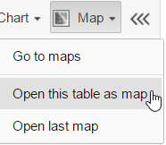
>

Option the options tab and select:

*   “Show row totals”

>>>>>  gd2md-html alert: inline image link here (to images/image6.png). Store image on your image server and adjust path/filename/extension if necessary.  (<a href="#">Back to top</a>)(<a href="#gdcalert7">Next alert</a>) >>>>> 

*   Click on Update to see your output.

>>>>>  gd2md-html alert: inline image link here (to images/image7.png). Store image on your image server and adjust path/filename/extension if necessary.  (<a href="#">Back to top</a>)(<a href="#gdcalert8">Next alert</a>) >>>>> 

#### Video - Pivot Table Demo - Part 2 of 7 (10 min)

In the following video, you will see different ways of **how to select organisation unit levels** that you want to retrieve data from. 

Then, you will see **how to adjust the table layout and options** to make the pivot table more clear and easy to understand for everyone.

[https://www.youtube.com/watch?v=YYb-5uj-EXQ](https://www.youtube.com/watch?v=YYb-5uj-EXQ)

##### Activity 2 - Selecting organisation unit levels and adjusting the table options

In [TRAININGLAND](https://live.academy.dhis2.org/tl1/dhis-web-commons/security/login.action), add in the districts with Maternal deaths to your table. Note that these organisation units may be different than what is seen in the video. 

In the organisation units tab:

*   Select “District” as the organisation unit level.

>>>>>  gd2md-html alert: inline image link here (to images/image8.png). Store image on your image server and adjust path/filename/extension if necessary.  (<a href="#">Back to top</a>)(<a href="#gdcalert9">Next alert</a>) >>>>> 

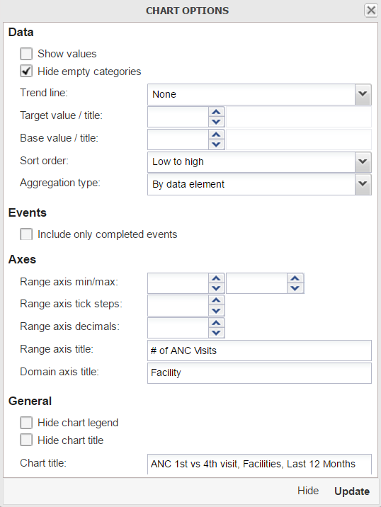

*   Open the layout tab and:
    *   Move the organisation units down to the row
    *   Move the periods over to the column

>>>>>  gd2md-html alert: inline image link here (to images/image9.png). Store image on your image server and adjust path/filename/extension if necessary.  (<a href="#">Back to top</a>)(<a href="#gdcalert10">Next alert</a>) >>>>> 

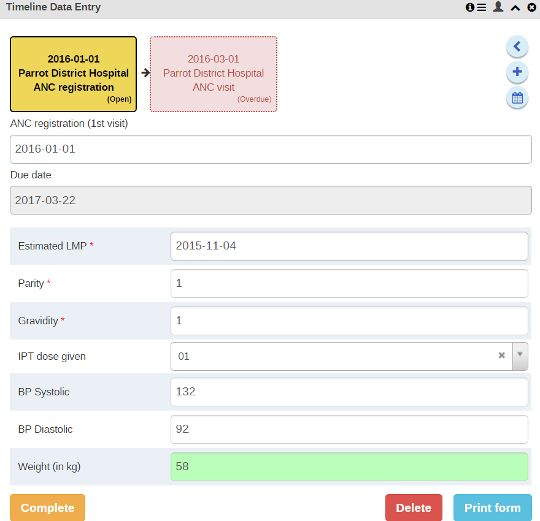

*   Open the options tab and select "Hide empty rows".

>>>>>  gd2md-html alert: inline image link here (to images/image10.png). Store image on your image server and adjust path/filename/extension if necessary.  (<a href="#">Back to top</a>)(<a href="#gdcalert11">Next alert</a>) >>>>> 

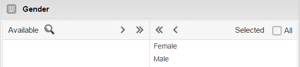

*   Click on “Update” to see your table.

>>>>>  gd2md-html alert: inline image link here (to images/image11.png). Store image on your image server and adjust path/filename/extension if necessary.  (<a href="#">Back to top</a>)(<a href="#gdcalert12">Next alert</a>) >>>>> 

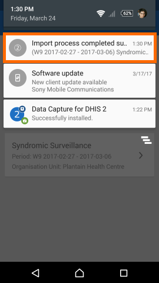

#### Video - Pivot Table Demo - Part 3 of 7 (10 min)

In this third part of the pivot table demo, you will see additional methods to select organisation units, in case you need to dig a little bit deeper into the data. You will also see how to sort the data, and how to save your table. 

[https://www.youtube.com/watch?v=UP5tbM2Sb3M](https://www.youtube.com/watch?v=UP5tbM2Sb3M)

##### Activity 3 - Saving the table as a favorite

In [TRAININGLAND](https://live.academy.dhis2.org/tl1/dhis-web-commons/security/login.action), add in the facilities and save the table as a favorite.

In the organisation units tab:

*   Select “Animal Region” as the organisation unit
*   Select “Facility” as the level

>>>>>  gd2md-html alert: inline image link here (to images/image12.png). Store image on your image server and adjust path/filename/extension if necessary.  (<a href="#">Back to top</a>)(<a href="#gdcalert13">Next alert</a>) >>>>> 

*   Update the table to see your output.

>>>>>  gd2md-html alert: inline image link here (to images/image13.png). Store image on your image server and adjust path/filename/extension if necessary.  (<a href="#">Back to top</a>)(<a href="#gdcalert14">Next alert</a>) >>>>> 

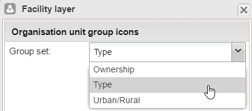

*   Save the table as a favorite using: username_health program name_what, what, when.

Note that in a real life setting, there may be no need to use your username when saving your favorites. In this course this is used however to identify the favorites that you have created.

>>>>>  gd2md-html alert: inline image link here (to images/image14.png). Store image on your image server and adjust path/filename/extension if necessary.  (<a href="#">Back to top</a>)(<a href="#gdcalert15">Next alert</a>) >>>>> 

#### Video - Pivot Table Demo - Part 4 of 7 (10 min)

Let’s see how to use **indicators**, instead of data elements, to create a pivot table. Pay attention to the **differences **between these two types of data. This will help you to correctly select the inputs you require when you create your own pivot tables. You will also see how to apply **legend sets** and add **table titles**.

[https://www.youtube.com/watch?v=qCJMoykIzbg](https://www.youtube.com/watch?v=qCJMoykIzbg)

##### Activity 4 - Reviewing indicators and applying legend sets and table titles

In [TRAININGLAND](https://live.academy.dhis2.org/tl1/dhis-web-commons/security/login.action), create a table containing two indicators and apply a legend-set to the table.

In the data tab select:

*   "Indicators" as the data type.
*   "Immunization - coverages" as the Indicator Group.
*   "BCG Coverage" & "DPT3 Coverage" as the Indicators.

>>>>>  gd2md-html alert: inline image link here (to images/image15.png). Store image on your image server and adjust path/filename/extension if necessary.  (<a href="#">Back to top</a>)(<a href="#gdcalert16">Next alert</a>) >>>>> 

In the period tab:

*   Select “Last 6 quarters” as the period. The last 6 months that are displayed may be different than what is shown in the video.

>>>>>  gd2md-html alert: inline image link here (to images/image16.png). Store image on your image server and adjust path/filename/extension if necessary.  (<a href="#">Back to top</a>)(<a href="#gdcalert17">Next alert</a>) >>>>> 

In the organisations unit tab:

*   Change the selection mode to "Select levels".
*   Select "District" as the organisation unit level.

>>>>>  gd2md-html alert: inline image link here (to images/image17.png). Store image on your image server and adjust path/filename/extension if necessary.  (<a href="#">Back to top</a>)(<a href="#gdcalert18">Next alert</a>) >>>>> 

*   Alter the layout to replicate what is seen on the video. You can update the table if you’d like, there are several more steps in this activity.

>>>>>  gd2md-html alert: inline image link here (to images/image18.png). Store image on your image server and adjust path/filename/extension if necessary.  (<a href="#">Back to top</a>)(<a href="#gdcalert19">Next alert</a>) >>>>> 

*   Open the table options and change the following:
    *   Remove all of the totals from the table.
    *   Apply the EPI Coverage legend set. You can try both "Text color" and "Background color" as the Legend display style to view the difference.
    *   Provide the table with a title.

>>>>>  gd2md-html alert: inline image link here (to images/image19.png). Store image on your image server and adjust path/filename/extension if necessary.  (<a href="#">Back to top</a>)(<a href="#gdcalert20">Next alert</a>) >>>>> 

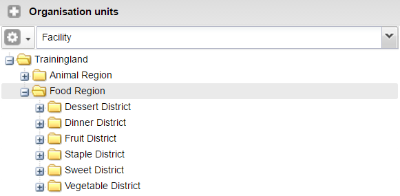

*   Click on Update when all of the changes are made.

The table should reflect the format of what is seen in the video.

>>>>>  gd2md-html alert: inline image link here (to images/image20.png). Store image on your image server and adjust path/filename/extension if necessary.  (<a href="#">Back to top</a>)(<a href="#gdcalert21">Next alert</a>) >>>>> 

>>>>>  gd2md-html alert: inline image link here (to images/image21.png). Store image on your image server and adjust path/filename/extension if necessary.  (<a href="#">Back to top</a>)(<a href="#gdcalert22">Next alert</a>) >>>>> 

#### Video - Pivot Table Demo - Part 5 of 7 (12 min)

In the next video, you will see how you can disaggregate your data within a pivot table . 

[https://www.youtube.com/watch?v=GpUybqjNCN8](https://www.youtube.com/watch?v=GpUybqjNCN8)

##### Activity 5 - Separating data elements by their disaggregations

In [TRAININGLAND](https://live.academy.dhis2.org/tl1/dhis-web-commons-about/redirect.action), create a pivot table that includes data elements separated into their individual disaggregations.

In the data tab select:

*   "Data Elements" as the data type.
*   "HIV" as the Data Element Group.
*   "HIV tests performed 15-19 years" as the Data Element.

>>>>>  gd2md-html alert: inline image link here (to images/image22.png). Store image on your image server and adjust path/filename/extension if necessary.  (<a href="#">Back to top</a>)(<a href="#gdcalert23">Next alert</a>) >>>>> 

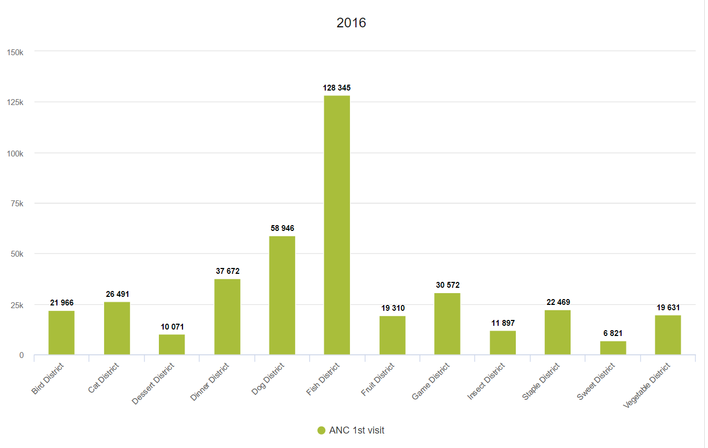

In the period tab select “Last year” as the period. The last year that is displayed will be different than what is shown in the video.

>>>>>  gd2md-html alert: inline image link here (to images/image23.png). Store image on your image server and adjust path/filename/extension if necessary.  (<a href="#">Back to top</a>)(<a href="#gdcalert24">Next alert</a>) >>>>> 

In the organisations unit tab:

*   Change the selection mode to "Select levels".
*   Select "Facility" as the organisation unit level.

>>>>>  gd2md-html alert: inline image link here (to images/image24.png). Store image on your image server and adjust path/filename/extension if necessary.  (<a href="#">Back to top</a>)(<a href="#gdcalert25">Next alert</a>) >>>>> 

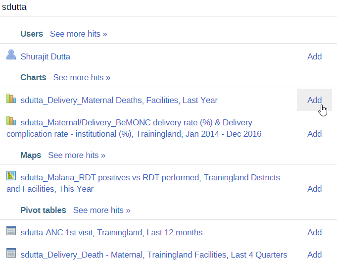

Add in the disaggregations for this data element. This includes:

*   Gender - Male/Female.
*   HIV service - PMTCT/TB/Other.

>>>>>  gd2md-html alert: inline image link here (to images/image25.png). Store image on your image server and adjust path/filename/extension if necessary.  (<a href="#">Back to top</a>)(<a href="#gdcalert26">Next alert</a>) >>>>> 

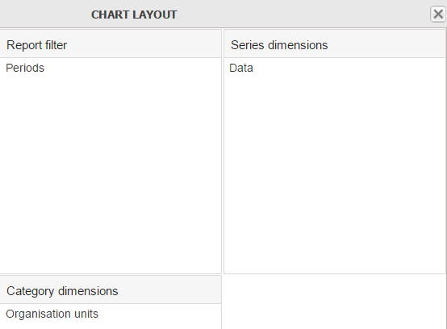

>>>>>  gd2md-html alert: inline image link here (to images/image26.png). Store image on your image server and adjust path/filename/extension if necessary.  (<a href="#">Back to top</a>)(<a href="#gdcalert27">Next alert</a>) >>>>> 

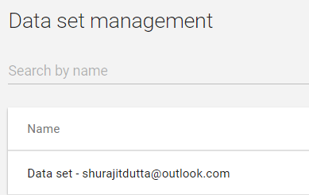

*   Modify the table layout to make the table easier to read.

Note that the disaggregations have been added to the table as additional data dimensions that can be moved anywhere on the table as required.

>>>>>  gd2md-html alert: inline image link here (to images/image27.png). Store image on your image server and adjust path/filename/extension if necessary.  (<a href="#">Back to top</a>)(<a href="#gdcalert28">Next alert</a>) >>>>> 

*   Click on “Update” to see the output (note that only part of the table is shown here, in DHIS2, all facilities should be displayed).

>>>>>  gd2md-html alert: inline image link here (to images/image28.png). Store image on your image server and adjust path/filename/extension if necessary.  (<a href="#">Back to top</a>)(<a href="#gdcalert29">Next alert</a>) >>>>> 

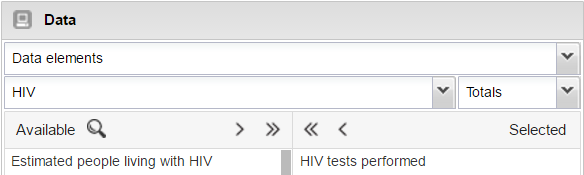

#### Video - Pivot Table Demo - Part 6 of 7 (7 min)

In this overview we will demonstrate how to download your completed pivot table data in different formats, including Excel and CSV files, among others. 

[https://www.youtube.com/watch?v=4pVA_DeeXhw](https://www.youtube.com/watch?v=4pVA_DeeXhw)

##### Activity 6 - Adding in the hierarchy to the table and downloading pivot tables

In [TRAININGLAND](https://live.academy.dhis2.org/tl1/dhis-web-commons/security/login.action), to the previous activity, add in the hierarchy and download the table.

*   Open up the table options and select “Show hierarchy.” Click on update to add the hierarchy to the pivot table.

>>>>>  gd2md-html alert: inline image link here (to images/image29.png). Store image on your image server and adjust path/filename/extension if necessary.  (<a href="#">Back to top</a>)(<a href="#gdcalert30">Next alert</a>) >>>>> 

 

>>>>>  gd2md-html alert: inline image link here (to images/image30.png). Store image on your image server and adjust path/filename/extension if necessary.  (<a href="#">Back to top</a>)(<a href="#gdcalert31">Next alert</a>) >>>>> 

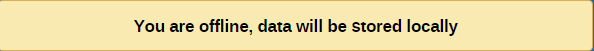

*   Try to download the pivot table in various formats.

Since the hierarchy has been added, you have the option to download it as a plain data source with the hierarchy intact.

>>>>>  gd2md-html alert: inline image link here (to images/image31.png). Store image on your image server and adjust path/filename/extension if necessary.  (<a href="#">Back to top</a>)(<a href="#gdcalert32">Next alert</a>) >>>>> 

#### Video - Pivot Table Demo - Part 7 of 7 (5 min)

In the final video of this series, we will summarize the most important concepts we have discussed so far.

[https://www.youtube.com/watch?v=FVQdWYmFJgo](https://www.youtube.com/watch?v=FVQdWYmFJgo)

### Assignments - Pivot Tables (60 min)

#### Assignments - Pivot Tables

The following are **graded assignments** and they are worth** 8% **of your final grade (1,6% for each question).

You are allowed 3 attempts for each of these assignments.

You need to click on the "check" button to submit your answers.

---

##### Assignment 3.2.1 - Delivery in Facility, Trainingland, Q1 - Q4 2016

Instructions

Please do this assignment in [TRAININGLAND](https://live.academy.dhis2.org/tl1/dhis-web-commons/security/login.action).

1. For this assignment, answer the questions using the Pivot Table app. 
2. Save all tables as a favorite as they will be used later on in the dashboard exercise. 
3. Use the same naming convention to save the 2 favorites as before: username_program_what, where, when.

Details

*   Data Element Group: Delivery
*   Data Element: Delivery in facility
*   Period: January - March 2016, April - June 2016, July - September 2016, October - December 2016
*   Organisation Unit: Trainingland

>>>>>  gd2md-html alert: inline image link here (to images/image32.png). Store image on your image server and adjust path/filename/extension if necessary.  (<a href="#">Back to top</a>)(<a href="#gdcalert33">Next alert</a>) >>>>> 

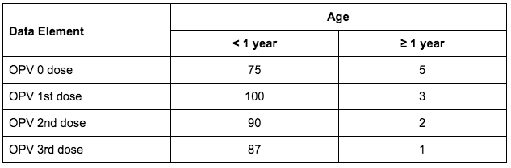

Question of the assignment 3.2.1

Which quarter had the lowest number of deliveries?

EXPLANATION

The quarter January - March 2016 had the lowest number of deliveries

##### Assignment 3.2.2 - Delivery in Facility, Trainingland Districts, Q1 - Q4 2016

Instructions

Please do this assignment in [TRAININGLAND](https://live.academy.dhis2.org/tl1/dhis-web-commons/security/login.action).

1. For this assignment, answer the questions using the Pivot Table app. 
2. Save all tables as a favorite as they will be used later on in the dashboard exercise. 
3. Use the same naming convention to save the 2 favorites as before: username_program_what, where, when.

Details

*   Data Element Group: Delivery
*   Data Element: Delivery in facility
*   Period: January - March 2016, April - June 2016, July - September 2016, October - December 2016
*   Organisation Unit: Trainingland Districts

>>>>>  gd2md-html alert: inline image link here (to images/image33.png). Store image on your image server and adjust path/filename/extension if necessary.  (<a href="#">Back to top</a>)(<a href="#gdcalert34">Next alert</a>) >>>>> 

Question of the assignment 3.2.2

Which District had the lowest number of facility-based deliveries?

EXPLANATION

Sweet District had the lowest number of facility-based deliveries

During which quarter was the absolute lowest number of facility deliveries recorded?

EXPLANATION

During January - March 2016 the lowest number of facility deliveries were recorded

##### Assignment 3.2.3 - HIV Test Positivity Rate, Trainingland Facilities, January 2016 - December 2016

Instructions

Please do this assignment in [TRAININGLAND](https://live.academy.dhis2.org/tl1/dhis-web-commons/security/login.action).

1. For this assignment, answer the questions using the Pivot Table app. 
2. Save all tables as a favorite as they will be used later on in the dashboard exercise. 
3. Use the same naming convention to save the 2 favorites as before: username_program_what, where, when.

Details

*   Indicator Group: HIV
*   Indicator: HIV test positivity rate
*   Period: January 2016 - December 2016 (individual months)
*   Organisation Unit: Trainingland Facilities

>>>>>  gd2md-html alert: inline image link here (to images/image34.png). Store image on your image server and adjust path/filename/extension if necessary.  (<a href="#">Back to top</a>)(<a href="#gdcalert35">Next alert</a>) >>>>> 

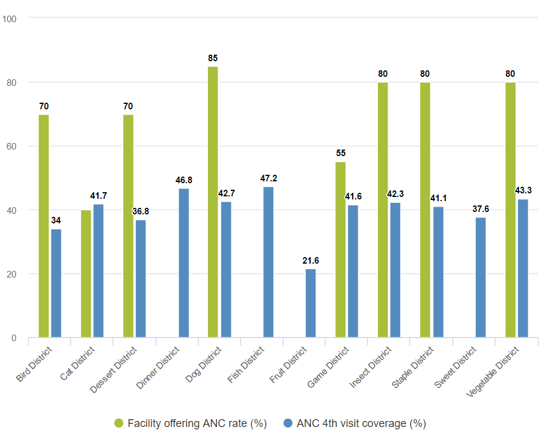

Question of the assignment 3.2.3

In September 2016, which facility had the highest HIV test positivity rate?

EXPLANATION

Poodle Private Medical Practice had the highest HIV test positivity rate

##### Assignment 3.2.4 - Malaria RDT performed & Malaria RDT Positive, Trainingland Health Centres, Jan 2014 – Dec 2015

Instructions

Please do this assignment in [TRAININGLAND](https://live.academy.dhis2.org/tl1/dhis-web-commons/security/login.action).

1. For this assignment, answer the questions using the Pivot Table app. 
2. Save all tables as a favorite as they will be used later on in the dashboard exercise. 
3. Use the same naming convention to save the 2 favorites as before: username_program_what, where, when.

Details

*   Data Element Group: Malaria
*   Data Elements: Malaria RDT performed, Malaria RDT Positive
*   Data Dimension: Age (above/below 5 years)
*   Period: Quarterly – Jan 2015 – Dec 2016
*   Organisation Unit: Trainingland Facilities

>>>>>  gd2md-html alert: inline image link here (to images/image35.png). Store image on your image server and adjust path/filename/extension if necessary.  (<a href="#">Back to top</a>)(<a href="#gdcalert36">Next alert</a>) >>>>> 

*Brief Note: In this table, there should not be more Malaria RDT positives then Malaria RDT performed. If this is occurring, then there is likely some issue with the quality of the data. For example, in Afghan Dispensary for the period Oct - Dec 2015 in both the &lt; 5 and >= 5 age group, we can see that there are more Malaria RDT positives then Malaria RDT performed. Malaria RDT positives are a direct result of performing an RDT test to detect malaria, and therefore the number of Malaria RDT performed should always be >= the number of Malaria RDT positives. 

Question of the assignment 3.2.4 

In Blueberry dispensary, were the total number of Malaria RDT positives greater than or less than the total number of Malaria RDTs performed?

EXPLANATION

The correct answer is greater than

In Chocolate Dispensary, how many Malaria RDTs were positive in Oct - Dec 2016 for the 'under 5 years' age group? (enter the value in the box below)

EXPLANATION

14 Malaria RDTs were positive in Oct - Dec 2016 for the 'under 5 years' age group within Chocolate Dispensary

##### Assignment 3.2.5 - Breastfeeding within 1 hour after delivery, Delivery in Facility & Breastfeeding within 1 hour after delivery (%), Trainingland Districts, Last 6 months

Instructions

Please do this assignment in [TRAININGLAND](https://live.academy.dhis2.org/tl1/dhis-web-commons/security/login.action).

1. For this assignment, answer the questions using the Pivot Table app. 
2. Save all tables as a favorite as they will be used later on in the dashboard exercise. 
3. Use the same naming convention to save the 2 favorites as before: username_program_what, where, when.

Details

*   Data Element Group: Delivery
*   Data Elements: Breastfeeding within 1 hour after delivery, Delivery in Facility
*   Indicator Group: Maternal/Delivery
*   Indicator: Breastfeeding within 1 hour after delivery (%)
*   Period: Monthly July 2016 - December 2016
*   Organisation Unit: Trainingland Districts

>>>>>  gd2md-html alert: inline image link here (to images/image36.png). Store image on your image server and adjust path/filename/extension if necessary.  (<a href="#">Back to top</a>)(<a href="#gdcalert37">Next alert</a>) >>>>> 

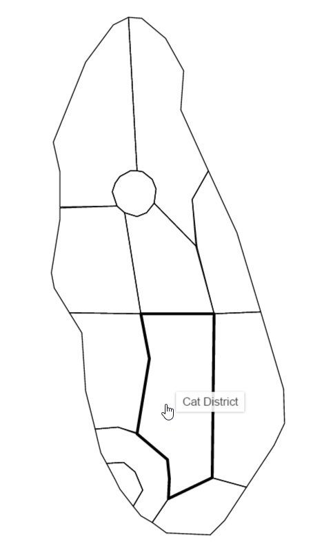

Question of the assignment 3.2.5

In November 2016, which district had the lowest Breastfeeding within 1 hour after delivery (%)?

EXPLANATION

Dessert District had the lowest Breastfeeding within 1 hour after delivery (%) during November 2016

### Session Quiz - Pivot Tables

#### Session Quiz - Pivot Tables

This is a **graded quiz** and it is worth **5%** of your final grade.

You have **3 attempts** to pass this quiz.

Select  the "check" button to submit your answers.

If you want to save your current response without submitting it for grading yet, select the "save" button. This allows you to come back later and resume the attempt.

1. Pivot tables can be used to analyse your data: (select one)
*   By indicators, data elements, and reporting rates
*   By  Units
*   By Periods
*   All of the above

EXPLANATION

As seen in the pivot table, different items can be analyzed together within this application.

2. Pivot Tables in DHIS2 are mainly used for:
*   Visualizing data in charts
*   Analyzing data in dynamic tables 
*   Creating standard, one-click reports for review 

EXPLANATION

As introduced in the pivot table demo, pivot tables are used for creating dynamic tables

3. The output of pivot tables can be: (select one)
*   Saved as favorites
*   Downloaded for use offline
*   Have the hierarchy added in
*   All of the above

EXPLANATION

As seen in the pivot table demo, the output can be used in all the various ways mentioned in this question.

###  3.3 - Data Visualizer (100 min)

#### Video - Data Visualizer Demo - Part 1 of 5 (12 min)

Through the series of r videos, you will become familiar with the Data Visualizer interface and will identify the **different types of charts** available in DHIS2. 

You will also see several examples of **how to create charts** and learn how to apply the chart **layout **and **options **to show the data clearly and understandably. 

Lastly, you will learn how to **download charts** from DHIS2 in order to share them outside of the platform.

[https://www.youtube.com/watch?v=ix3T8MdRPUw](https://www.youtube.com/watch?v=ix3T8MdRPUw)

##### Activity 1 - Data Visualizer interface and creating a vertical bar chart

Please try to create in [TRAININGLAND](https://live.academy.dhis2.org/tl1/dhis-web-commons/security/login.action) the following chart that follows the example in the video using the Data Visualizer app:

>>>>>  gd2md-html alert: inline image link here (to images/image37.png). Store image on your image server and adjust path/filename/extension if necessary.  (<a href="#">Back to top</a>)(<a href="#gdcalert38">Next alert</a>) >>>>> 

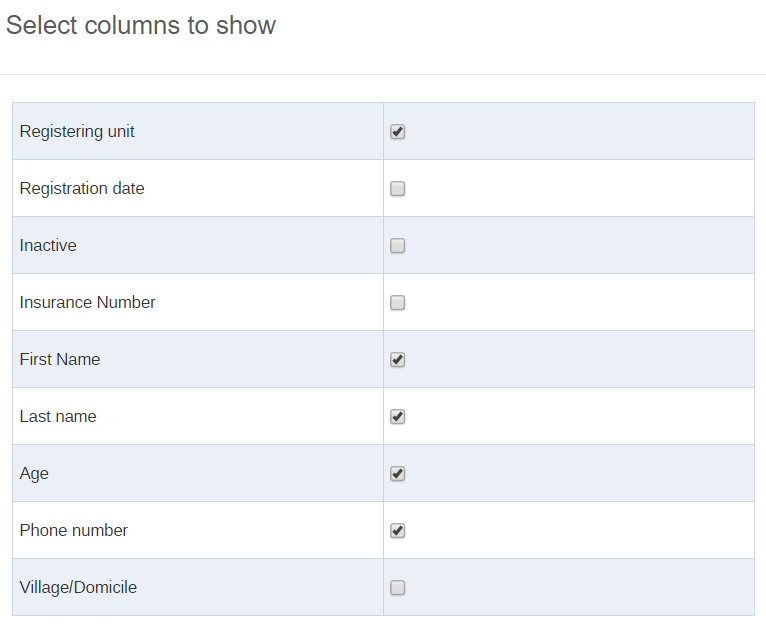

Start by selecting the vertical bar chart as your graph type.

In the data tab select:

*   "Data Elements" as the data type.
*   "ANC" as the Data Element Group.
*   "ANC 1st visit" & "ANC 4th visit" as the Data Elements.

>>>>>  gd2md-html alert: inline image link here (to images/image38.png). Store image on your image server and adjust path/filename/extension if necessary.  (<a href="#">Back to top</a>)(<a href="#gdcalert39">Next alert</a>) >>>>> 

In the period tab:

*   Select “Last 12 months” as the period.

The last 12 months that are displayed will be different than what is shown in the video.

>>>>>  gd2md-html alert: inline image link here (to images/image39.png). Store image on your image server and adjust path/filename/extension if necessary.  (<a href="#">Back to top</a>)(<a href="#gdcalert40">Next alert</a>) >>>>> 

In the organisation unit tab:

*   Select “District” as the organisation unit level.

>>>>>  gd2md-html alert: inline image link here (to images/image40.png). Store image on your image server and adjust path/filename/extension if necessary.  (<a href="#">Back to top</a>)(<a href="#gdcalert41">Next alert</a>) >>>>> 

*   Open the layout tab and move the organisation units down to the Category (note that the Periods will be automatically moved to the filter - as stated in the video, multiple dimensions are not possible within the category or series within the Data Visualiser).

>>>>>  gd2md-html alert: inline image link here (to images/image41.png). Store image on your image server and adjust path/filename/extension if necessary.  (<a href="#">Back to top</a>)(<a href="#gdcalert42">Next alert</a>) >>>>> 

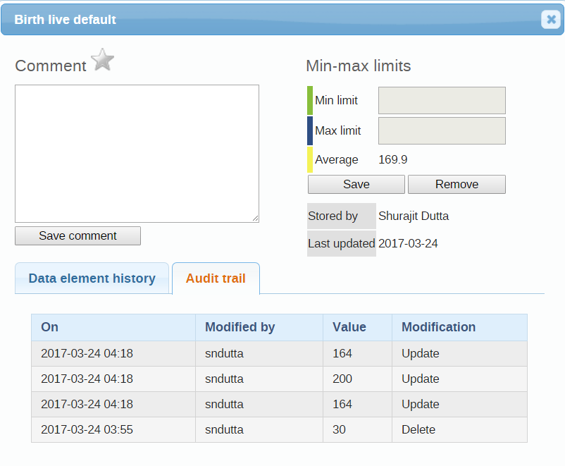

*   Click on "Update" to see your chart. You may see different periods on the chart depending on when you create it. For example, if it is created in April you will see April 2016 - March 2017.

>>>>>  gd2md-html alert: inline image link here (to images/image42.png). Store image on your image server and adjust path/filename/extension if necessary.  (<a href="#">Back to top</a>)(<a href="#gdcalert43">Next alert</a>) >>>>> 

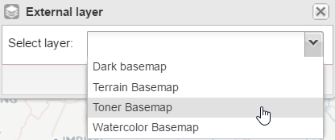

#### Video - Data Visualizer Demo - Part 2 of 5 (8 min)

Let’s see how additional chart **options **affect how our visualizations will be displayed. [https://www.youtube.com/watch?v=-3CnH77G_ys](https://www.youtube.com/watch?v=-3CnH77G_ys)

##### Activity 2 - Drilling down within the organisation unit hierarchy and modifying chart options

In [TRAININGLAND](https://live.academy.dhis2.org/tl1/dhis-web-commons/security/login.action), using the graph generated in the "Activity 1 - Data Visualizer interface and creating a vertical bar chart" as a starting point:

*   Add in the facilities and alter the table options.

In the organisation units tab:

*   Select "Facility" as the organisation unit level.

>>>>>  gd2md-html alert: inline image link here (to images/image43.png). Store image on your image server and adjust path/filename/extension if necessary.  (<a href="#">Back to top</a>)(<a href="#gdcalert44">Next alert</a>) >>>>> 

*   Open the chart options and:
    *   De-select "Show values".
    *   Select "Hide empty categories".
    *   Select a sort order for the chart (you can try either one in this scenario).
    *   Provide titles for the "Range" and "Domain".
    *   Provide a chart title.

>>>>>  gd2md-html alert: inline image link here (to images/image44.png). Store image on your image server and adjust path/filename/extension if necessary.  (<a href="#">Back to top</a>)(<a href="#gdcalert45">Next alert</a>) >>>>> 

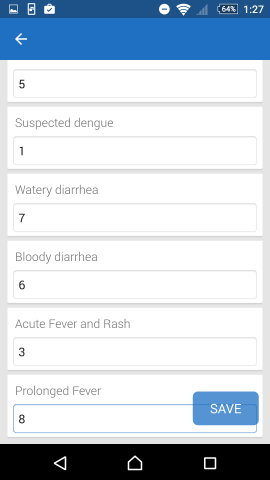

*   Click on "Update" to see your chart.

>>>>>  gd2md-html alert: inline image link here (to images/image45.png). Store image on your image server and adjust path/filename/extension if necessary.  (<a href="#">Back to top</a>)(<a href="#gdcalert46">Next alert</a>) >>>>> 

#### Video - Data Visualizer Demo - Part 3 of 5 (10 min)

In this video, you will review how to create a pie chart, including recommendations for when this type of chart is appropriate to use in practice. You will also review the different formats that are available to download charts to your computer.

[https://www.youtube.com/watch?v=dVSv8ORchXo](https://www.youtube.com/watch?v=dVSv8ORchXo)

##### Activity 3 - Creating a pie chart, adding in additional data dimensions and downloading charts

In [TRAININGLAND](https://live.academy.dhis2.org/tl1/dhis-web-commons/security/login.action), create a pie chart that uses additional data dimensions to separate the data.

*   Start by selecting the pie chart as your graph type.

>>>>>  gd2md-html alert: inline image link here (to images/image46.png). Store image on your image server and adjust path/filename/extension if necessary.  (<a href="#">Back to top</a>)(<a href="#gdcalert47">Next alert</a>) >>>>> 

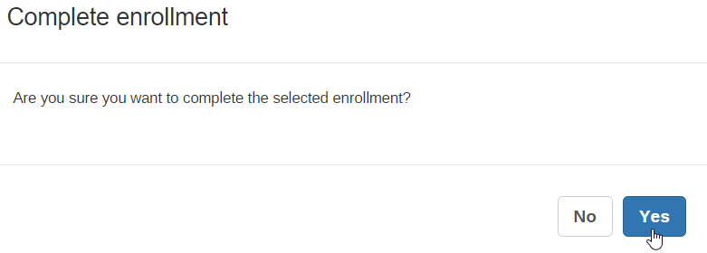

In the data tab select:

*   "Data Elements" as the data type
*   "HIV" as the Data Element Group
*   "HIV tests performed" as the Data Element

>>>>>  gd2md-html alert: inline image link here (to images/image47.png). Store image on your image server and adjust path/filename/extension if necessary.  (<a href="#">Back to top</a>)(<a href="#gdcalert48">Next alert</a>) >>>>> 

In the period tab:

*   Select "Last year" as the period. The last year that is displayed will be different than what is shown in the video.

>>>>>  gd2md-html alert: inline image link here (to images/image48.png). Store image on your image server and adjust path/filename/extension if necessary.  (<a href="#">Back to top</a>)(<a href="#gdcalert49">Next alert</a>) >>>>> 

In the organisation unit tab:

*   Select "Animal Region" as the organisation unit.

>>>>>  gd2md-html alert: inline image link here (to images/image49.png). Store image on your image server and adjust path/filename/extension if necessary.  (<a href="#">Back to top</a>)(<a href="#gdcalert50">Next alert</a>) >>>>> 

*   Add in the HIV service types as additional data dimensions.

>>>>>  gd2md-html alert: inline image link here (to images/image50.png). Store image on your image server and adjust path/filename/extension if necessary.  (<a href="#">Back to top</a>)(<a href="#gdcalert51">Next alert</a>) >>>>> 

*   Open the layout tab and:
    *   Move the HIV service to the category.
    *   Put any one either the organisation units, periods or data in the series.

>>>>>  gd2md-html alert: inline image link here (to images/image51.png). Store image on your image server and adjust path/filename/extension if necessary.  (<a href="#">Back to top</a>)(<a href="#gdcalert52">Next alert</a>) >>>>> 

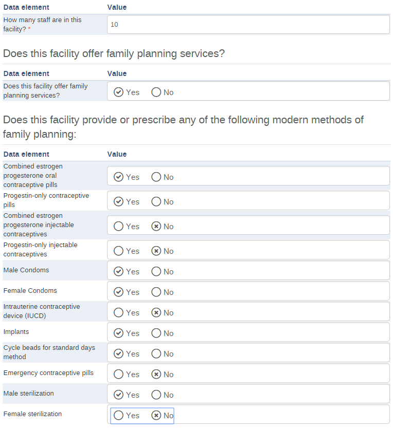

*   Click on "Update" to see your chart.

>>>>>  gd2md-html alert: inline image link here (to images/image52.png). Store image on your image server and adjust path/filename/extension if necessary.  (<a href="#">Back to top</a>)(<a href="#gdcalert53">Next alert</a>) >>>>> 

*   Experiment with downloading the chart in either PDF or Image format.

>>>>>  gd2md-html alert: inline image link here (to images/image53.png). Store image on your image server and adjust path/filename/extension if necessary.  (<a href="#">Back to top</a>)(<a href="#gdcalert54">Next alert</a>) >>>>> 

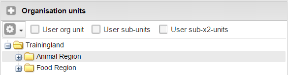

#### Video - Data Visualizer Demo - Part 4 of 5 (10 min)

Now, let’s see how to create a **line chart** along with some recommendations when this type of chart is most appropriate. For this example, you will see how to use indicators instead of data elements to create charts.

You will also learn how to **save **your charts, **rename **them, and **update **them.

[https://www.youtube.com/watch?v=kf1sNpkaGkc](https://www.youtube.com/watch?v=kf1sNpkaGkc)

##### Activity 4 - Creating a line chart and saving a favorite

In [TRAININGLAND](https://live.academy.dhis2.org/tl1/dhis-web-commons/security/login.action), create a line chart using indicators and save a favorite.

*   Start by selecting the line chart as your graph type.

>>>>>  gd2md-html alert: inline image link here (to images/image54.png). Store image on your image server and adjust path/filename/extension if necessary.  (<a href="#">Back to top</a>)(<a href="#gdcalert55">Next alert</a>) >>>>> 

In the data tab select:

*   "Indicators" as the data type
*   "Maternal/Delivery" as the Indicator Group
*   "BEmONC delivery rate (%)" and "Delivery complication rate - institutional" as the Indicators

>>>>>  gd2md-html alert: inline image link here (to images/image55.png). Store image on your image server and adjust path/filename/extension if necessary.  (<a href="#">Back to top</a>)(<a href="#gdcalert56">Next alert</a>) >>>>> 

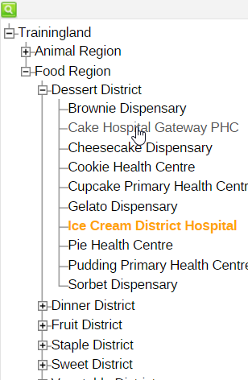

In the periods tab:

*   de-select "Last 5 years".
*   Select "Monthly" as the period type and proceed to add the last 36 months covering 2014 - 2016.

>>>>>  gd2md-html alert: inline image link here (to images/image56.png). Store image on your image server and adjust path/filename/extension if necessary.  (<a href="#">Back to top</a>)(<a href="#gdcalert57">Next alert</a>) >>>>> 

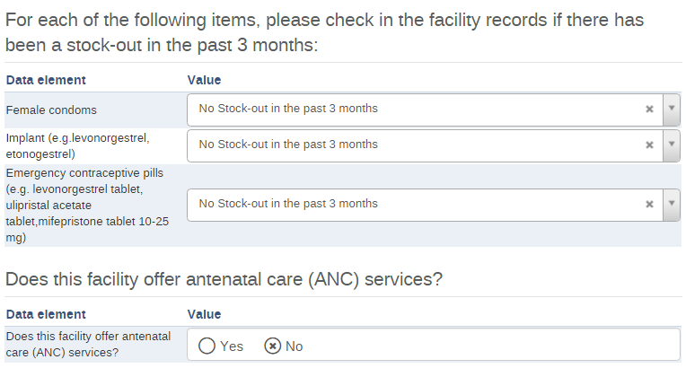

In the organisation units tab:

*   select "Trainingland" as the organisation unit.

>>>>>  gd2md-html alert: inline image link here (to images/image57.png). Store image on your image server and adjust path/filename/extension if necessary.  (<a href="#">Back to top</a>)(<a href="#gdcalert58">Next alert</a>) >>>>> 

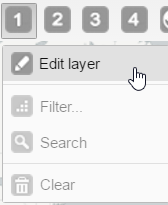

*   Click on "Update" to see your chart.

>>>>>  gd2md-html alert: inline image link here (to images/image58.png). Store image on your image server and adjust path/filename/extension if necessary.  (<a href="#">Back to top</a>)(<a href="#gdcalert59">Next alert</a>) >>>>> 

*   Save the table as a favorite using: username_health program name_what, what, when

Note that in a real life setting, there may be no need to use your username when saving your favorites. In this course this is used however to identify the favorites that you have created.

>>>>>  gd2md-html alert: inline image link here (to images/image59.png). Store image on your image server and adjust path/filename/extension if necessary.  (<a href="#">Back to top</a>)(<a href="#gdcalert60">Next alert</a>) >>>>> 

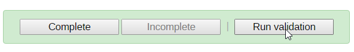

#### Video - Data Visualizer Demo - Part 5 of 5 (4 min)

In the final video of this series, we will summarize the most important concepts we have discussed so far.

[https://www.youtube.com/watch?v=HzpLHQyxgfk](https://www.youtube.com/watch?v=HzpLHQyxgfk)

### Assignment - Data Visualizer (45 min)

#### Assignment - Data Visualizer

The following is a graded** assignment** and contributes **8%** to your final grade (2% for each question)

You are allowed **3 attempts** for each of these assignments.

You need to click on the "**check**" button to submit your answers.

---

##### Assignment 3.3.1

Instructions

In [TRAININGLAND](https://live.academy.dhis2.org/tl1/dhis-web-commons/security/login.action):

1. For this assignment, answer the questions using the Data Visualizer App.
2. Save all charts as a favorite.
3. Use the same naming convention to save the 2 favorites as before: username_program_what, where, when.

Details

Create a pie chart which compares Outpatient Attendance per 1,000 population in 2016 for all of Trainingland by the following facility types:

*   PHC
*   Dispensary
*   Health Centre

(hint: these facility types can be found as an additional data dimension called "Type"):

=====

*   Indicator Group: Outpatient/Inpatient
*   Indicator: Outpatient Attendance per 1,000 population
*   Period: 2016 (Last Year)
*   Organisation unit: Trainingland

>>>>>  gd2md-html alert: inline image link here (to images/image60.png). Store image on your image server and adjust path/filename/extension if necessary.  (<a href="#">Back to top</a>)(<a href="#gdcalert61">Next alert</a>) >>>>> 

Question of the assignment 3.3.1

Which facility type has the highest OPD attendance rate?

EXPLANATION

Answer : Dispensary.

##### Assignment 3.3.2

Instructions

In [TRAININGLAND](https://live.academy.dhis2.org/tl1/dhis-web-commons/security/login.action):

1. For this assignment, answer the questions using the Data Visualizer App.
2. Save all charts as a favorite.
3. Use the same naming convention to save the favorites as before: username_program_what, where, when.

Details

Using a horizontal bar chart, compare the HIV ANC client testing rate - PMTCT (this denotes this is for PMTCT clients) and the HIV ANC client tested positive rate - PMTCT for the Districts within Trainingland.

*   Indicator Group: HIV PMTCT
*   Indicator: HIV Antenatal client testing rate - PMTCT (%), HIV Antenatal client tested positive rate - PMTCT (%)
*   Period: 2016 (Last Year)
*   Organisation unit: Districts

>>>>>  gd2md-html alert: inline image link here (to images/image61.png). Store image on your image server and adjust path/filename/extension if necessary.  (<a href="#">Back to top</a>)(<a href="#gdcalert62">Next alert</a>) >>>>> 

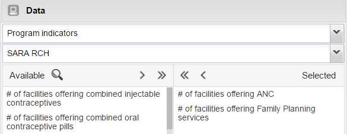

Question of the assignment 3.3.2

In which districts is the tested positive rate greater than the testing rate? (select one or more)

*   Game District 
*   Dessert District 
*   Staple District 
*   Bird District

EXPLANATION

From the chart, you can see that all of these identified districts have a greater "tested positive" rate when compared to the "testing rate." This might indicate an error of some sort, as the % tested should be greater than the % positive

Which district did not have any patients test positive?

*   Vegetable District
*   Sweet District 
*   Dog District

EXPLANATION

Sweet District did not have any patients test positive

##### Assignment 3.3.3

Instructions

In [TRAININGLAND](https://live.academy.dhis2.org/tl1/dhis-web-commons/security/login.action):

1. For this assignment, answer the questions using the Data Visualizer App.
2. Save all charts as a favorite.
3. Use the same naming convention to save the 2 favorites as before: username_program_what, where, when.

Details

Create a vertical bar chart that compares the number of maternal deaths by facility within Trainingland for 2016.

*   Data Element Group: Delivery
*   Data Element: Deaths - Maternal
*   Period: 2016 (Last Year)
*   Organisation unit: Trainingland Facilities
*   Label the axes correctly and provide a descriptive title
*   (Hint: use the hide empty category items option to hide facilities with no Maternal Deaths before updating the chart)

>>>>>  gd2md-html alert: inline image link here (to images/image62.png). Store image on your image server and adjust path/filename/extension if necessary.  (<a href="#">Back to top</a>)(<a href="#gdcalert63">Next alert</a>) >>>>> 

Question of the assignment 3.3.3

Within 2016, what facility had the highest number of Maternal Deaths?

*   Minnow District Hospital 
*   Whale Regional Hospital
*   Elephant District Hospital

EXPLANATION

Answer: Minnow District Hospital

##### Assignment 3.3.4

Instructions

In [TRAININGLAND](https://live.academy.dhis2.org/tl1/dhis-web-commons/security/login.action):

1. For this assignment, answer the questions using the Data Visualizer App.
2. Save all charts as a favorite.
3. Use the same naming convention to save the 2 favorites as before: username_program_what, where, when.

Details

*   Indicator Group: ANC
*   Indicators: ANC 1st visit coverage and ANC 4th visit coverage by ANC 1 (this indicator is similar to calculating an estimate of the drop-out rate that occurs between the 1st and 4th ANC visit)
*   Period:  January 2015 - December 2016
*   Organisation unit: Trainingland 
*   Label the axes correctly and provide a descriptive title

=====

Investigate the relationship between ANC 1st visit coverage and ANC 4th visit coverage by ANC 1 (similar to an estimate of ANC 1-4 drop out rate) over the 24 month period from January 2015 - December 2016 (using monthly period types, select all 24 months) for all of Trainingland.

 

>>>>>  gd2md-html alert: inline image link here (to images/image63.png). Store image on your image server and adjust path/filename/extension if necessary.  (<a href="#">Back to top</a>)(<a href="#gdcalert64">Next alert</a>) >>>>> 

Question of the assignment 3.3.4

What is the general trend of ANC 1 over time?

*   Increasing

What is the general trend of ANC 4 by ANC 1 over time?

*   No significant change

Which one is higher?

*   ANC 1

### Session Quiz - Data Visualizer (10 min)

#### Session Quiz - Data Visualizer

This is a **graded quiz** and it is worth **5%** of your final grade.

You have **3 attempts** to pass this quiz.

Select the "**check**" button to submit your answers.

If you want to save your current response without submitting it for grading yet, select the "save" button. This allows you to come back later and resume the attempt.

1. From the Data Visualizer you can: (select one or more)
*   Save favorite charts with a description
*   Make different types of dynamic charts
*   Share an interpretation

EXPLANATION

The data visualizer can be used to create charts, which can be saved as favorites as discussed via interpretations. This is all demonstrated in the data visualizer demo.

2. The data visualizer in DHIS2 is mainly used for: (select one)
*   Visualizing data in charts 
*   Managing the visual layout of dashboards
*   Changing the appearance of the DHIS2 application

EXPLANATION

The main purpose of the data visualizer is to visualize data in charts.

3. In the data visualizer, I cannot add titles to the axes and chart itself.
*   True
*   False

EXPLANATION

In the data visualizer, chart and axes titles can be added by going to the table options.

### 3.4 - GIS (Maps App) (115 min)

#### Video - Presentation of the GIS (7 min)

A key tool of DHIS2 that will help you to **store**, **analyze**, and **present spatial data** from health programs is the **G**eographic **I**nformation **S**ystem, **GIS**. (Note: this is referred to as **Maps** in later DHIS2 versions).

In this video, you will learn what GIS is in the context of DHIS2, review its interface and review key concepts you will need to understand in order to use this app effectively.

[https://www.youtube.com/watch?v=OByICemXX8M](https://www.youtube.com/watch?v=OByICemXX8M)

Knowledge check (not graded) - Presentation of the GIS

1. What does GIS stand for?
*   Geographical Identity Software
*   Geographical Information System
*   Geographical Information Structure

EXPLANATION

GIS stands for Geographical Information System. It is a common acronym that is used when discussing or working with geographical data.

2. Which of the following represents one layer within a GIS?
*   Land mass, roads and water
*   Land mass and health facilities
*   Health Facilities 

EXPLANATION

A layer is used to represent one piece of information within a map according to its theme. As an example, health facilities on its own represents one layer on a map, while the land mass represents a second layer on the map.

#### Video - GIS Demo - Part 1 of 8 (10 min)

In the first video in this series, you will see an overview of the GIS app in order to start familiarizing yourself with the concepts and functionalities that you will discover throughout the remainder of this series.

Pay attention to the concepts and location of **layers** and the **thematic layer options**, since they are going to be key for understanding the next videos. 

[https://www.youtube.com/watch?v=KnwvPMbdXig](https://www.youtube.com/watch?v=KnwvPMbdXig)

##### Activity 1 - GIS interface, place search and external layers

Please note that the Place Search feature is not currently working.

In [TRAININGLAND](https://live.academy.dhis2.org/tl1/dhis-web-commons/security/login.action),

*   Add an external layer to the map.

To add an external layer click on the external layer icon -> edit layer.

>>>>>  gd2md-html alert: inline image link here (to images/image64.png). Store image on your image server and adjust path/filename/extension if necessary.  (<a href="#">Back to top</a>)(<a href="#gdcalert65">Next alert</a>) >>>>> 

*   Select any of the available external layers from the list.

>>>>>  gd2md-html alert: inline image link here (to images/image65.png). Store image on your image server and adjust path/filename/extension if necessary.  (<a href="#">Back to top</a>)(<a href="#gdcalert66">Next alert</a>) >>>>> 

*   Click on "Update" to add the layer to your map.

The layer should be added to the map. From this example you can see that external layers provide you with some flexibility when preparing your maps for presentation and/or sharing.

>>>>>  gd2md-html alert: inline image link here (to images/image66.png). Store image on your image server and adjust path/filename/extension if necessary.  (<a href="#">Back to top</a>)(<a href="#gdcalert67">Next alert</a>) >>>>> 

You can quickly add/remove this external layer by selecting it from the layer stack on the right hand side of the GIS app.

>>>>>  gd2md-html alert: inline image link here (to images/image67.png). Store image on your image server and adjust path/filename/extension if necessary.  (<a href="#">Back to top</a>)(<a href="#gdcalert68">Next alert</a>) >>>>> 

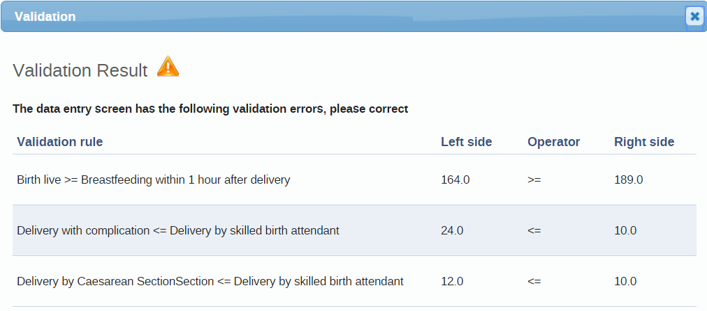

#### Video - GIS Part 2 of 8 (5 min)

The use of the boundary layer will be demonstrated within this video. The **boundary layer** allows you to visualize the boundaries of the organisation unit level you have  selected within the GIS app.

[https://www.youtube.com/watch?v=eACsg53JLes](https://www.youtube.com/watch?v=eACsg53JLes)

##### Activity 2 - The boundary layer

To the map you have created, please add in the boundary layer for the districts within [TRAININGLAND](https://live.academy.dhis2.org/tl1/dhis-web-commons/security/login.action).

*   Select the boundary layer followed by "Edit Layer".

>>>>>  gd2md-html alert: inline image link here (to images/image68.png). Store image on your image server and adjust path/filename/extension if necessary.  (<a href="#">Back to top</a>)(<a href="#gdcalert69">Next alert</a>) >>>>> 

*   Keep Trainingland highlighted and select "District" as the organisation unit level.
*   Click on "Update" to show the layer.

>>>>>  gd2md-html alert: inline image link here (to images/image69.png). Store image on your image server and adjust path/filename/extension if necessary.  (<a href="#">Back to top</a>)(<a href="#gdcalert70">Next alert</a>) >>>>> 

The boundary layer will be displayed within the GIS application.

>>>>>  gd2md-html alert: inline image link here (to images/image70.png). Store image on your image server and adjust path/filename/extension if necessary.  (<a href="#">Back to top</a>)(<a href="#gdcalert71">Next alert</a>) >>>>> 

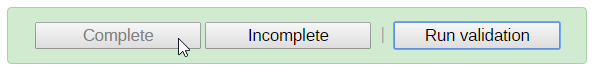

#### Video - GIS Demo Part 3 of 8 (8 min)

In this video, we will review how to add thematic layers to our map. Thematic layers are one of the most useful tools when reviewing maps as they allow us to display different data directly on the map. Pay attention to the differences between this interface and the one you used on pivot tables and data visualizer tools when selecting data, periods, and organisation units.

[https://www.youtube.com/watch?v=kjSYbaqeo-s](https://www.youtube.com/watch?v=kjSYbaqeo-s)

##### Activity 3 - Adding a thematic layer 

Please create a map showing the number of Malaria RDT positives by facility within all of [TRAININGLAND](https://live.academy.dhis2.org/tl1/dhis-web-commons/security/login.action).

*   Start by selecting Thematic layer 1 -> Edit layer.

>>>>>  gd2md-html alert: inline image link here (to images/image71.png). Store image on your image server and adjust path/filename/extension if necessary.  (<a href="#">Back to top</a>)(<a href="#gdcalert72">Next alert</a>) >>>>> 

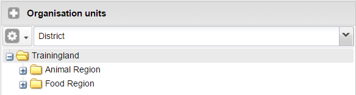

*   Define the data and period selection for Thematic Layer 1.

Note that the data and periods are defined in the same tab in the GIS app. This differs from the Pivot Table and Data Visualizer apps, where these were selected in separate tabs.

*   Select the following:
    *   Value type: Data Element
    *   Data element group: Malaria
    *   Data element: Malaria RDT positive
    *   Period Type: Yearly
    *   Period: 2016

>>>>>  gd2md-html alert: inline image link here (to images/image72.png). Store image on your image server and adjust path/filename/extension if necessary.  (<a href="#">Back to top</a>)(<a href="#gdcalert73">Next alert</a>) >>>>> 

In the organisation units tab:

*   Select "Facility" as the organisation unit level.

>>>>>  gd2md-html alert: inline image link here (to images/image73.png). Store image on your image server and adjust path/filename/extension if necessary.  (<a href="#">Back to top</a>)(<a href="#gdcalert74">Next alert</a>) >>>>> 

*   Click on "Update" to see the map.

>>>>>  gd2md-html alert: inline image link here (to images/image74.png). Store image on your image server and adjust path/filename/extension if necessary.  (<a href="#">Back to top</a>)(<a href="#gdcalert75">Next alert</a>) >>>>> 

#### Video - GIS Demo Part 4 of 8 (9 min)

In this video, you will learn how to review and interpret the map, including how to review what the thematic legend is representing. In addition, options that allow you to alter how the map looks will be discussed. [https://www.youtube.com/watch?v=41ZI1D-feVM](https://www.youtube.com/watch?v=41ZI1D-feVM)

##### Activity 4 - Explanation and modification of the map options

In the map you have created in [TRAININGLAND](https://live.academy.dhis2.org/tl1/dhis-web-commons/security/login.action), modify the number of classes and methods to see what effect this has on the legend. 

*   In the options tab:
    *   Modify the number of classes to 7
    *   Modify the method to "Equal counts"

>>>>>  gd2md-html alert: inline image link here (to images/image75.png). Store image on your image server and adjust path/filename/extension if necessary.  (<a href="#">Back to top</a>)(<a href="#gdcalert76">Next alert</a>) >>>>> 

*   Click on "Update" to see the new map with the new legend.

>>>>>  gd2md-html alert: inline image link here (to images/image76.png). Store image on your image server and adjust path/filename/extension if necessary.  (<a href="#">Back to top</a>)(<a href="#gdcalert77">Next alert</a>) >>>>> 

Notice that there are now 7 classes on the legend (7 different colors which differentiate the individual data ranges on the map). The equal counts method also shows a generally equal amount of data values per class/legend point within the map.

#### Video - GIS Demo Part 5 of 8 (7 min)

In this video, we will review how to add the facility layer to the map. The facility layer allows you to represent and display your facilities directly on the map. 

[https://www.youtube.com/watch?v=0F5zhLunq3o](https://www.youtube.com/watch?v=0F5zhLunq3o)

##### Activity 5 - Adding the facility layer 

To the map you have created in [TRAININGLAND](https://live.academy.dhis2.org/tl1/dhis-web-commons/security/login.action), please add in the facility layer.

*   Select Facility layer -> Edit layer.

>>>>>  gd2md-html alert: inline image link here (to images/image77.png). Store image on your image server and adjust path/filename/extension if necessary.  (<a href="#">Back to top</a>)(<a href="#gdcalert78">Next alert</a>) >>>>> 

In the Organisation unit group icons tab:

*   Select "Type" or the organisation unit group set.

>>>>>  gd2md-html alert: inline image link here (to images/image78.png). Store image on your image server and adjust path/filename/extension if necessary.  (<a href="#">Back to top</a>)(<a href="#gdcalert79">Next alert</a>) >>>>> 

In the Organisation units tab:

*   Select "Facility" as the organisation unit level.

>>>>>  gd2md-html alert: inline image link here (to images/image79.png). Store image on your image server and adjust path/filename/extension if necessary.  (<a href="#">Back to top</a>)(<a href="#gdcalert80">Next alert</a>) >>>>> 

*   Click on "Update" to see the map with the organisation unit types and malaria RDT positive data displayed.

>>>>>  gd2md-html alert: inline image link here (to images/image80.png). Store image on your image server and adjust path/filename/extension if necessary.  (<a href="#">Back to top</a>)(<a href="#gdcalert81">Next alert</a>) >>>>> 

#### Video - GIS Demo Part 6 of 8 (7 min)

In this video, you will learn how to add multiple thematic layers to your map. Multiple thematic layers allow you to make comparisons of different data within the same map. This is particularly useful when you are trying to make correlations between various services you are measuring. 

[https://www.youtube.com/watch?v=wd7f8kM-jJo](https://www.youtube.com/watch?v=wd7f8kM-jJo)

##### Activity 6 - Adding multiple thematic layers

To the map you have created in [TRAININGLAND](https://live.academy.dhis2.org/tl1/dhis-web-commons/security/login.action), please add in a 2nd thematic layer and save the map as a favorite.

*   Start by selecting Thematic layer 2 -> Edit layer.

>>>>>  gd2md-html alert: inline image link here (to images/image81.png). Store image on your image server and adjust path/filename/extension if necessary.  (<a href="#">Back to top</a>)(<a href="#gdcalert82">Next alert</a>) >>>>> 

*   Define the data and period selection for Thematic layer 2. Select the following:
    *   Value type: Data Element
    *   Data element group: Malaria
    *   Data element: Malaria RDT performed
    *   Period Type: Yearly
    *   Period: 2016

>>>>>  gd2md-html alert: inline image link here (to images/image82.png). Store image on your image server and adjust path/filename/extension if necessary.  (<a href="#">Back to top</a>)(<a href="#gdcalert83">Next alert</a>) >>>>> 

In the organisation units tab:

*   Select "District" as the organisation unit level.

>>>>>  gd2md-html alert: inline image link here (to images/image83.png). Store image on your image server and adjust path/filename/extension if necessary.  (<a href="#">Back to top</a>)(<a href="#gdcalert84">Next alert</a>) >>>>> 

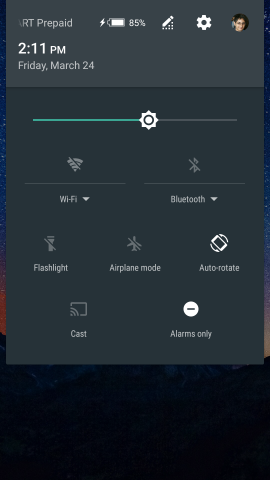

In the options tab:

*   Ensure that your classes/method is similar to what you have defined for thematic layer 1. Using our current example, thematic layer 1 used 7 classes as well as equal counts as the method. We should therefore select the same options in thematic layer 2.

>>>>>  gd2md-html alert: inline image link here (to images/image84.png). Store image on your image server and adjust path/filename/extension if necessary.  (<a href="#">Back to top</a>)(<a href="#gdcalert85">Next alert</a>) >>>>> 

*   Click on "Update" to see the map displayed with the 2 related layers.

>>>>>  gd2md-html alert: inline image link here (to images/image85.png). Store image on your image server and adjust path/filename/extension if necessary.  (<a href="#">Back to top</a>)(<a href="#gdcalert86">Next alert</a>) >>>>> 

To save the map as a favorite:

*   Select Favorites -> Add new. A text box will appear in which you can provide the favorite with a name and save the favorite.

>>>>>  gd2md-html alert: inline image link here (to images/image86.png). Store image on your image server and adjust path/filename/extension if necessary.  (<a href="#">Back to top</a>)(<a href="#gdcalert87">Next alert</a>) >>>>> 

*   Save the table as a favorite using: username_health program name_what, what, when.

Note that in a real life setting, there may be no need to use your username when saving your favorites. In this course this is used however to identify the favorites that you have created.

>>>>>  gd2md-html alert: inline image link here (to images/image87.png). Store image on your image server and adjust path/filename/extension if necessary.  (<a href="#">Back to top</a>)(<a href="#gdcalert88">Next alert</a>) >>>>> 

#### Video - GIS Demo Part 7 of 8 (6 min)

What is a predefined legend? This is a concept you already know from the pivot table sessions. Let’s see how it applies to the maps.

[https://www.youtube.com/watch?v=0KuXV75IyfQ](https://www.youtube.com/watch?v=0KuXV75IyfQ)

##### Activity 7 - Applying a predefined legend 

In [TRAININGLAND](https://live.academy.dhis2.org/tl1/dhis-web-commons/security/login.action),  please create a map with a predefined legend.

*   Clear your previous map by reloading the GIS app.
*   Select Thematic layer 1 -> Edit layer.

>>>>>  gd2md-html alert: inline image link here (to images/image88.png). Store image on your image server and adjust path/filename/extension if necessary.  (<a href="#">Back to top</a>)(<a href="#gdcalert89">Next alert</a>) >>>>> 

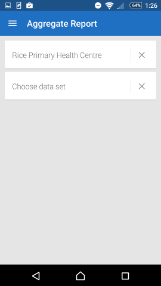

*   Define the data and period selection for Thematic layer 1.  Select the following:
    *   Value type: Indicator
    *   Indicator group: Immunization
    *   Indicator: BCG Coverage (%)
    *   Period Type: Yearly
    *   Period: 2016

>>>>>  gd2md-html alert: inline image link here (to images/image89.png). Store image on your image server and adjust path/filename/extension if necessary.  (<a href="#">Back to top</a>)(<a href="#gdcalert90">Next alert</a>) >>>>> 

In the organisation units tab:

*   Select "District" as the organisation unit level.

>>>>>  gd2md-html alert: inline image link here (to images/image90.png). Store image on your image server and adjust path/filename/extension if necessary.  (<a href="#">Back to top</a>)(<a href="#gdcalert91">Next alert</a>) >>>>> 

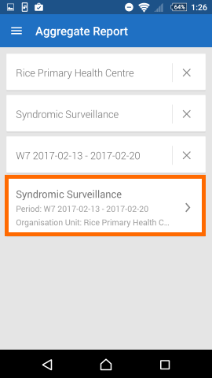

In the Options tab:

*   Change the Legend type to "Predefined".
*   Select "EPI Coverage (70-80-90%)" as the Legend set

>>>>>  gd2md-html alert: inline image link here (to images/image91.png). Store image on your image server and adjust path/filename/extension if necessary.  (<a href="#">Back to top</a>)(<a href="#gdcalert92">Next alert</a>) >>>>> 

*   Click on Update to see the map with the predefined legend set applied.

>>>>>  gd2md-html alert: inline image link here (to images/image92.png). Store image on your image server and adjust path/filename/extension if necessary.  (<a href="#">Back to top</a>)(<a href="#gdcalert93">Next alert</a>) >>>>> 

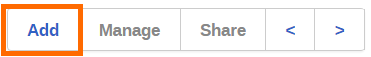

#### Video - GIS Demo Part 8 of 8 (3 min)

In the following video, you will find a summary of the most important concepts we have covered in this series of videos.

[https://www.youtube.com/watch?v=yYIY_um45Cg](https://www.youtube.com/watch?v=yYIY_um45Cg)

### Assignments - GIS (Maps app) (40 min)

#### Assignments - GIS (Maps app)

The following are **graded assignments** and they are worth **8%** of your final grade (each question contributes to 2% of your total)

You are allowed **3 attempts** for each of these assignments.

You need to click on the "**check**" button to submit your answers.

---

##### Assignment 3.4.1

Instructions

*   Please use [TRAININGLAND](https://live.academy.dhis2.org/tl1/dhis-web-commons/security/login.action) for this assignment.
*   For this assignment, answer the questions using the GIS app.

Details

*   Create a Boundary Layer for the Trainingland Districts.

>>>>>  gd2md-html alert: inline image link here (to images/image93.png). Store image on your image server and adjust path/filename/extension if necessary.  (<a href="#">Back to top</a>)(<a href="#gdcalert94">Next alert</a>) >>>>> 

Question of the assignment 3.4.1

What is the name of the district highlighted in the map?

*   Insect District 
*   Dog District
*   Cat District
*   Bird District

EXPLANATION

Insect District is the highlighted district

##### Assignment 3.4.2

Instructions

*   Please use [TRAININGLAND](https://live.academy.dhis2.org/tl1/dhis-web-commons/security/login.action) for this assignment.
*   For this assignment, answer the questions using the GIS app.

Details

*   Create a thematic layer 1 - # of HIV tests performed by facility, 2016:
    *   Data Element Group: HIV
    *   Data Element: HIV Tests Performed
    *   Period: 2016
    *   Organisation Units: Facilities

>>>>>  gd2md-html alert: inline image link here (to images/image94.png). Store image on your image server and adjust path/filename/extension if necessary.  (<a href="#">Back to top</a>)(<a href="#gdcalert95">Next alert</a>) >>>>> 

Question of the assignment 3.4.2 

Which facility has the highest number of HIV tests performed?

EXPLANATION

Crocodile Hospital Gateway PHC performed the highest number of HIV tests

##### Assignment 3.4.3

Instructions

*   Please use [TRAININGLAND](https://live.academy.dhis2.org/tl1/dhis-web-commons/security/login.action) for this assignment.
*   For this assignment, answer the questions using the GIS app.

Details

1. Add in a 2nd Thematic Layer - HIV test positivity rate
2. Create a thematic layer 1 - # of HIV tests performed by facility, 2016:
    *   **Indicator Group**: HIV
    *   **Data Element**: HIV Test Positivity Rate
    *   **Period**: 2016
    *   **Organisation Units**: Districts
3. Save the maps  as a favorite using the same naming convention as before: **username_program_what, where, when**.

>>>>>  gd2md-html alert: inline image link here (to images/image95.png). Store image on your image server and adjust path/filename/extension if necessary.  (<a href="#">Back to top</a>)(<a href="#gdcalert96">Next alert</a>) >>>>> 

Question of the assignment 3.4.3

Which district has the lowest HIV test positivity rate? (Hint: You may want to turn off the boundary layer)

EXPLANATION

Dessert District has the lowest HIV test positivity rate

##### Assignment 3.4.4

Instructions

*   Please use [TRAININGLAND](https://live.academy.dhis2.org/tl1/dhis-web-commons/security/login.action) for this assignment.
*   For this assignment, answer the questions using the GIS app. 

Details

1. Apply a custom legend set to a map with:
        *   Value Type: Data Element
    *   Data Set: Population
    *   Period Type: Yearly
    *   Period: 2016
    *   Organisation Units: Districts
    *   Legend Type: Predefined
    *   Legend Set: Population
1. Save the maps as a favorite using the same naming convention as before: username_program_what, where, when.

>>>>>  gd2md-html alert: inline image link here (to images/image96.png). Store image on your image server and adjust path/filename/extension if necessary.  (<a href="#">Back to top</a>)(<a href="#gdcalert97">Next alert</a>) >>>>> 

Question of the assignment 3.4.4 

Which District(s) have populations between 200,000 - 500,000 for this period? (select one or more)

*   Dessert District
*   Sweet District.
*   Insect District
*   Game District

EXPLANATION

Dessert, Sweet and Insect Districts have populations between 200,000 - 500,000 for this period

### Session Quiz - GIS (Maps app) (10 min)

#### Session Quiz - GIS

This is a **graded quiz** and it is worth **5%** of your final grade.

You have **3 attempts** to pass this test.

Select the "check" button to submit your answers.

If you want to save your current response without submitting it for grading yet, select the "save" button. This allows you to come back later and resume the attempt.

1. In the GIS boundary layer you can: (select one)
*   Analyze data by indicators
*   Analyze data by data elements
*   Display organisation unit boundaries
*   All of the above

EXPLANATION

In the GIS boundary layer, you can only display organisation unit boundaries such as regions or districts.

2. In one thematic layer you can create maps with: (select one)
*   Multiple periods
*   Multiple data elements
*   Multiple reporting rates
*   None of the above 

EXPLANATION

In one GIS layer, you can only have a single period, data element or reporting rate represented.

3. In a GIS map, multiple layers can be added to represent different features or items for analysis.
*   True
*   False

EXPLANATION

Multiple layers representing different items can be added to maps using the GIS application.

### 3.5 - Integrated Analysis, Dashboards, Messaging and Sharing (60 min)

#### Video - Integrated Analysis, ... Demo - Part 1 of 5 (7 min)

Now that we have reviewed each of the core analysis apps individually, we can discuss how they can work together in order to produce the most appropriate visual output to display your data. 

In this series of videos, you will learn how to quickly move between each of the analysis tools by taking any of your produced outputs and modifying them into a chart, map or pivot table on demand. You will also review how to create a dashboard where you can put together the different visualizations you have created from  pivot tables, data visualizer and GIS (Maps). Lastly, you will also learn how to share your dashboard with other DHIS2 users.

[https://www.youtube.com/watch?v=XkTS_5wUXb4](https://www.youtube.com/watch?v=XkTS_5wUXb4)

##### Activity 1 - Moving between analysis apps within DHIS2

Start by creating a simple pivot table in [TRAININGLAND](https://live.academy.dhis2.org/tl1/dhis-web-commons/security/login.action):

*   In the data tab select:
    *   "Data Elements" as the data type.
    *   "ANC" as the Data Element Group.
    *   "ANC 1st visit" as the Data Elements.

>>>>>  gd2md-html alert: inline image link here (to images/image97.png). Store image on your image server and adjust path/filename/extension if necessary.  (<a href="#">Back to top</a>)(<a href="#gdcalert98">Next alert</a>) >>>>> 

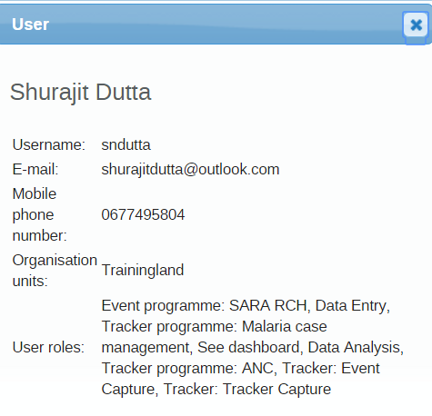

*   In the period tab:
    *   Select "Last year" as the period. The last year that is displayed will be different than what is shown in the video.

>>>>>  gd2md-html alert: inline image link here (to images/image98.png). Store image on your image server and adjust path/filename/extension if necessary.  (<a href="#">Back to top</a>)(<a href="#gdcalert99">Next alert</a>) >>>>> 

*   In the organisation units tab:
    *   Select "District" as the organisation unit level.

>>>>>  gd2md-html alert: inline image link here (to images/image99.png). Store image on your image server and adjust path/filename/extension if necessary.  (<a href="#">Back to top</a>)(<a href="#gdcalert100">Next alert</a>) >>>>> 

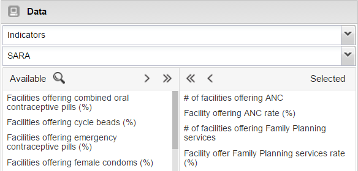

*   Open the layout tab and:
    *   Move the organisation units down to the Row.
    *   Move the periods up to the filter.

>>>>>  gd2md-html alert: inline image link here (to images/image100.png). Store image on your image server and adjust path/filename/extension if necessary.  (<a href="#">Back to top</a>)(<a href="#gdcalert101">Next alert</a>) >>>>> 

*   Open the table options and de-select "Show row totals".

>>>>>  gd2md-html alert: inline image link here (to images/image101.png). Store image on your image server and adjust path/filename/extension if necessary.  (<a href="#">Back to top</a>)(<a href="#gdcalert102">Next alert</a>) >>>>> 

*   Click on "Update" to see the pivot table.

>>>>>  gd2md-html alert: inline image link here (to images/image102.png). Store image on your image server and adjust path/filename/extension if necessary.  (<a href="#">Back to top</a>)(<a href="#gdcalert103">Next alert</a>) >>>>> 

*   To open the table as a map select Map -> Open this table as map.

>>>>>  gd2md-html alert: inline image link here (to images/image103.png). Store image on your image server and adjust path/filename/extension if necessary.  (<a href="#">Back to top</a>)(<a href="#gdcalert104">Next alert</a>) >>>>> 

*   The map with legend will appear in the GIS app.

>>>>>  gd2md-html alert: inline image link here (to images/image104.png). Store image on your image server and adjust path/filename/extension if necessary.  (<a href="#">Back to top</a>)(<a href="#gdcalert105">Next alert</a>) >>>>> 

*   To open this map as chart, select Chart -> Open this map as chart.

>>>>>  gd2md-html alert: inline image link here (to images/image105.png). Store image on your image server and adjust path/filename/extension if necessary.  (<a href="#">Back to top</a>)(<a href="#gdcalert106">Next alert</a>) >>>>> 

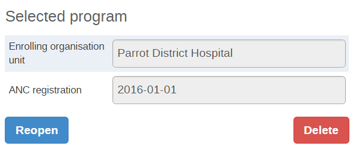

The chart will open in the Data Visualizer app.

>>>>>  gd2md-html alert: inline image link here (to images/image106.png). Store image on your image server and adjust path/filename/extension if necessary.  (<a href="#">Back to top</a>)(<a href="#gdcalert107">Next alert</a>) >>>>> 

#### Video - Integrated Analysis, ... Demo - Part 2 of 5 (7 min)

In this video, you will learn how to add interpretations of the data to your visualizations. The different options that are available to share your saved interpretations with users and user groups will also be discussed. 

[https://www.youtube.com/watch?v=eD17gKEksL0](https://www.youtube.com/watch?v=eD17gKEksL0)

##### Activity 2 - Adding and reviewing descriptions

In the Data Visualiser app of [TRAININGLAND](https://live.academy.dhis2.org/tl1/dhis-web-commons/security/login.action):

*   Open up the previous favorite from your assignments which showed the number of maternal deaths by facility in 2016.

>>>>>  gd2md-html alert: inline image link here (to images/image107.png). Store image on your image server and adjust path/filename/extension if necessary.  (<a href="#">Back to top</a>)(<a href="#gdcalert108">Next alert</a>) >>>>> 

*   Click on the triple arrows to bring up the details and interpretation boxes.

>>>>>  gd2md-html alert: inline image link here (to images/image108.png). Store image on your image server and adjust path/filename/extension if necessary.  (<a href="#">Back to top</a>)(<a href="#gdcalert109">Next alert</a>) >>>>> 

*   Add a description to the favorite if you have not already by clicking on the "Edit" button next to where it says "No description".

>>>>>  gd2md-html alert: inline image link here (to images/image109.png). Store image on your image server and adjust path/filename/extension if necessary.  (<a href="#">Back to top</a>)(<a href="#gdcalert110">Next alert</a>) >>>>> 

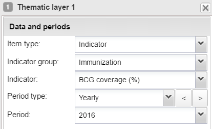

>>>>>  gd2md-html alert: inline image link here (to images/image110.png). Store image on your image server and adjust path/filename/extension if necessary.  (<a href="#">Back to top</a>)(<a href="#gdcalert111">Next alert</a>) >>>>> 

#### Video - Integrated Analysis, ... Demo - Part 3 of 5 (10 min)

It’s time to learn how to **create a dashboard**. 

In this video, you will find all the steps you need to bring together the different outputs you have created before (and saved as favorites) using the data analysis tools (pivot tables, data visualizer, GIS) into one dashboard. You will also see how to share your dashboard with other users or groups of users.

[https://www.youtube.com/watch?v=m_TsUN4JRfE](https://www.youtube.com/watch?v=m_TsUN4JRfE)

##### Activity 3 - Dashboards 

Create a dashboard in [TRAININGLAND](https://live.academy.dhis2.org/tl1/dhis-web-commons/security/login.action). In order to add items to a dashboard, you will first have to create a dashboard.

*   Do this by clicking on the "Add" button.

>>>>>  gd2md-html alert: inline image link here (to images/image111.png). Store image on your image server and adjust path/filename/extension if necessary.  (<a href="#">Back to top</a>)(<a href="#gdcalert112">Next alert</a>) >>>>> 

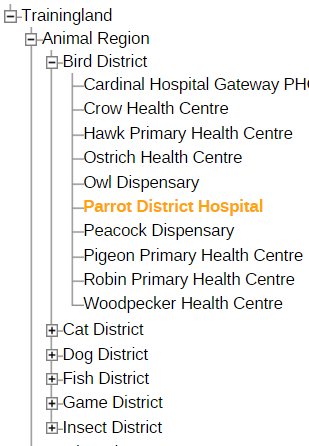

A pop-up will appear in which you can provide the dashboard with a name.

*   Click on "Create" when you have finished creating the dashboard.

>>>>>  gd2md-html alert: inline image link here (to images/image112.png). Store image on your image server and adjust path/filename/extension if necessary.  (<a href="#">Back to top</a>)(<a href="#gdcalert113">Next alert</a>) >>>>> 

To add items to the dashboard, use the search box located at the top. To add an item click on the "Add" button next to the favorite. If you click on the favorite name, it will take you directly to the favorite within the app it was created rather than adding it to the dashboard.

>>>>>  gd2md-html alert: inline image link here (to images/image113.png). Store image on your image server and adjust path/filename/extension if necessary.  (<a href="#">Back to top</a>)(<a href="#gdcalert114">Next alert</a>) >>>>> 

*   Add the following items to the dashboard (these are all taken from your previous exercises on data analysis):
    *   ANC 1st and 4th (by ANC1) Coverage, Trainingland, Jan 2015 - Dec 2016 (Chart).
    *   Outpatient Attendance per 1,000 population, Trainingland, 2016 (Chart).
    *   Delivery in Facility, Trainingland Districts, Last 4 Quarters (Pivot Table).
    *   Breastfeeding within 1 hour after delivery, Delivery in Facility and Breastfeeding within 1 hour after delivery (%), Trainingland Districts, July - December 2016 (Pivot Table).

>>>>>  gd2md-html alert: inline image link here (to images/image114.png). Store image on your image server and adjust path/filename/extension if necessary.  (<a href="#">Back to top</a>)(<a href="#gdcalert115">Next alert</a>) >>>>> 

>>>>>  gd2md-html alert: inline image link here (to images/image115.png). Store image on your image server and adjust path/filename/extension if necessary.  (<a href="#">Back to top</a>)(<a href="#gdcalert116">Next alert</a>) >>>>> 

>>>>>  gd2md-html alert: inline image link here (to images/image116.png). Store image on your image server and adjust path/filename/extension if necessary.  (<a href="#">Back to top</a>)(<a href="#gdcalert117">Next alert</a>) >>>>> 

>>>>>  gd2md-html alert: inline image link here (to images/image117.png). Store image on your image server and adjust path/filename/extension if necessary.  (<a href="#">Back to top</a>)(<a href="#gdcalert118">Next alert</a>) >>>>> 

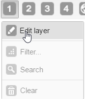

You can move the items around and resize them to your liking in order to get a feel for how the objects on the dashboard work. This is a very useful tool for bringing together multiple analysis in a particular thematic area together in order to be reviewed quickly. It is particularly useful for program managers to receive at-a-glance information regarding the programs they are responsible for.

#### Video - Integrated Analysis, ... Demo - Part 4 of 5 (10 min)

DHIS2 allows you to communicate with other users or groups of users using the **message **application.  In the following video, you will see how it works.

You can also use the **feedback **feature to report anything that is not working as intended and to follow up on the open tickets.

[https://www.youtube.com/watch?v=LxY-cGgzKgg](https://www.youtube.com/watch?v=LxY-cGgzKgg)

##### Activity 4 - Messaging and Feedback

Messages

In [TRAININGLAND](https://live.academy.dhis2.org/tl1/dhis-web-commons/security/login.action), write a message to your fellow participants about how you are finding the course so far:

*   To access the message application select "Messages" from the dashboard page.

>>>>>  gd2md-html alert: inline image link here (to images/image118.png). Store image on your image server and adjust path/filename/extension if necessary.  (<a href="#">Back to top</a>)(<a href="#gdcalert119">Next alert</a>) >>>>> 

*   From within the messages page, select "Write message".

>>>>>  gd2md-html alert: inline image link here (to images/image119.png). Store image on your image server and adjust path/filename/extension if necessary.  (<a href="#">Back to top</a>)(<a href="#gdcalert120">Next alert</a>) >>>>> 

*   Use the "online fundamentals academy participants" user group to send the message.

>>>>>  gd2md-html alert: inline image link here (to images/image120.png). Store image on your image server and adjust path/filename/extension if necessary.  (<a href="#">Back to top</a>)(<a href="#gdcalert121">Next alert</a>) >>>>> 

*   Write feedback the course admins. Feel free to be critical regarding what you think about the course so far. 

Feedback

To write feedback, you can:

*   Select "Write feedback" from within the messages app.

>>>>>  gd2md-html alert: inline image link here (to images/image121.png). Store image on your image server and adjust path/filename/extension if necessary.  (<a href="#">Back to top</a>)(<a href="#gdcalert122">Next alert</a>) >>>>> 

*   Write the feedback and click on "Send" when ready to send the feedback.

#### Video - Integrated Analysis, ... Demo - Part 5 of 5 (3 min)

In the following video, you will find a summary of the most important concepts we have covered in this series of videos.

[https://www.youtube.com/watch?v=262g1j6vBZE](https://www.youtube.com/watch?v=262g1j6vBZE)

#### Video - Integrated Analysis, ... - Sharing (5 min)

[https://www.youtube.com/watch?v=HakjBMS2zvY](https://www.youtube.com/watch?v=HakjBMS2zvY)

### Session Quiz - Integrated Analysis, Dashboards, Messaging and Sharing (20 min)

#### Session Quiz - Integrated Analysis, Dashboards, Messaging and Sharing

This is a **graded quiz** and it is worth **5%** of your final grade.

You have **3 attempts** for this quiz.

Select the "check" button to submit your answers.

If you want to save your current response without submitting it for grading yet, select the "save" button. This allows you to come back later and resume the attempt.

1. I have created a pivot table with the following dimensions:

- Data Element Group: Delivery

- Data Element: Births, Live

- Period: Last 4 Quarters

- Organisation Units: Trainingland Districts

In a real-life setting, a username will likely not be used to identify a favorite.

Which of the following is a good name for the favorite? (select one)

*   Live Births
*   Deliveries in Trainingland, last 4 Quarters
*   Live Births by Trainingland Districts, last 4 Quarters
*   Delivery_Live Births, Districts, last 4 Quarters

EXPLANATION

The naming convention for favorites should include the program name and the 3 core dimensions (what you are measuring, where it is coming from and when it is coming from). This option includes all of these aspects.

2. I want to do some analysis comparing all of the following:

- All Facilities within my organisation unit hierarchy

- The last 12 months worth of data

- A combination of two data elements and one indicator

Which tool(s) should I use to display this information? (select one or more)

*   This type of analysis is not possible in DHIS2
*   Data Visualizer
*   Pivot Table
*   GIS

The pivot table application is most suitable when you want to analyze multiple dimensions of data, including multiple organisation units, time periods and data types.

3. In DHIS2, I can add additional dimensions (such as Male/Female, Public/Private Facilities, etc.) to further break-down my data during analysis.
*   True
*   False

EXPLANATION

Data can be broken down into different disaggregations in analysis. This is shown in both the pivot table and data visualizer demonstrations.

4. If today's date is April 2, 2017 and I select a relative period of the last 5 years, which periods will be selected? (select one)
*   2011-2016
*   2012-2016
*   2013-2017

EXPLANATION

Relative periods work backwards from the current date. In 2017, if we go back 5 years we have 2012, 2013, 2014, 2015 and 2016.

5. Using the features in DHIS2 I can: (select one or more)
*   Move analysis seamlessly between pivot tables, charts and maps
*   Add descriptions to favorites to give them more context
*   Discuss interpretations of the favorites in the system with other users

EXPLANATION

The DHIS2 analysis tools allow you to move between the different applications, save outputs and add in descriptions and discuss interpretations directly within DHIS2.

6. Favorites can be shared: (select one or more)
*   Using specific privileges for each item (such as edit/view)
*   With other users within DHIS2
*   Directly from DHIS2 to social media

EXPLANATION

Sharing of favorites was demonstrated in both the integrated analysis as well as sharing sessions. This allows us to specify exactly who sees the outputs we have created.

7. With the DHIS2 dashboards you can: (select one)
*   Have multiple dashboards
*   Add favorites from analysis app
*   Share dashboards with groups of users
*   All of the above

EXPLANATION

Dashboards contain all the functionality discussed in this question. This was demonstrated during the dashboard demo.

8. What is the primary role(s) of dashboards? (select one)
*   Make data easily accessible
*   Make data easily communicable
*   Aid in decision making
*   Easily view data from multiple angles in one place
*   All of the above

EXPLANATION

Dashboards are useful in conveying a variety of different information together. This was demonstrated during the dashboard demo.

9. Sharing in DHIS2: (select one)
*   Is used to define which favorites can be seen by whom
*   Can be used to share dashboards with other users
*   Can be used to share interpretations with other users
*   All of the above

EXPLANATION

Sharing can be used to customize the different outputs that can be seen by each user. This was best demonstrated during the sharing session.

10. Sharing is typically controlled by: (select one)
*   Selecting specific users in which to share objects
*   Selecting user groups in which to share objects
*   Sending items through messaging within DHIS2
*   All of the above

EXPLANATION

Sharing of favorites was demonstrated in both the integrated analysis as well as sharing sessions. This concept uses user groups to define who can see which outputs and related information in the system.

11. Messages can be sent within DHIS2 to: (select one or more)
*   Individual users
*   User Groups
*   Users belonging to an organisation unit

EXPLANATION

The messaging feature was presented in the integrated analysis session. Here, any combination of the displayed answers can be selected in order to send messages.

12. Using Feedback in DHIS2: (select one)
*   The central team can manage questions, assign them priorities and update users on their status
*   Messages can be sent to other users within DHIS2
*   Interpretations of different analysis can be shared

EXPLANATION

The feedback feature was presented in the integrated analysis session. It is particularly useful for managing issues that users encounter with the DHIS2 system.

### 3.6 - Reports App and Reporting Rates (35 min)

#### Video - Reports and Reporting Rates - Part 1 of 4 (9 min)

In this series of videos, you will learn how to use the reports app, which contains a series of various reports that allow you to review information about your system in unique formats when compared to the 3 core analysis apps (pivot table, data visualizer, GIS). In the first video, you will learn about data set reports and resources within the reports app.

[https://www.youtube.com/watch?v=WyAfzvYpOBk](https://www.youtube.com/watch?v=WyAfzvYpOBk)

##### Activity 1 - Data Set Reports and Resources

In [TRAININGLAND](https://live.academy.dhis2.org/tl1/dhis-web-commons/security/login.action), please run a data set report. In order to access data set reports:

*   Go to Apps -> Reports -> Data Set Report

>>>>>  gd2md-html alert: inline image link here (to images/image122.png). Store image on your image server and adjust path/filename/extension if necessary.  (<a href="#">Back to top</a>)(<a href="#gdcalert123">Next alert</a>) >>>>> 

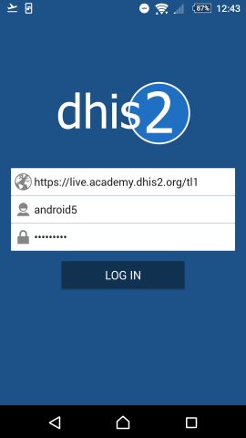

*   Select the criteria for the data set report and click on "Get report" when ready. You can use the following as a guide:
    *   Data Set: Primary Health Care Monthly
    *   Period Type: Yearly
    *   Period: 2016
    *   Organisation Unit: Animal Region (you can try any org unit you like here)

>>>>>  gd2md-html alert: inline image link here (to images/image123.png). Store image on your image server and adjust path/filename/extension if necessary.  (<a href="#">Back to top</a>)(<a href="#gdcalert124">Next alert</a>) >>>>> 

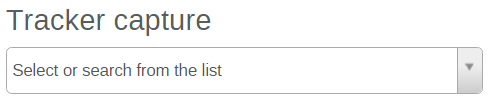

*   You will see the results for the dataset/period/organisation unit combination after you click on "Get report".

As discussed in the video, this gives you a layout of the data set as you would see it in data entry. You can not edit the data here however, and this can often serve as an ideal location to review the data in a format that users are familiar with. The data can be aggregated within this report, and therefore looked at within different levels of the hierarchy as required.

>>>>>  gd2md-html alert: inline image link here (to images/image124.png). Store image on your image server and adjust path/filename/extension if necessary.  (<a href="#">Back to top</a>)(<a href="#gdcalert125">Next alert</a>) >>>>> 

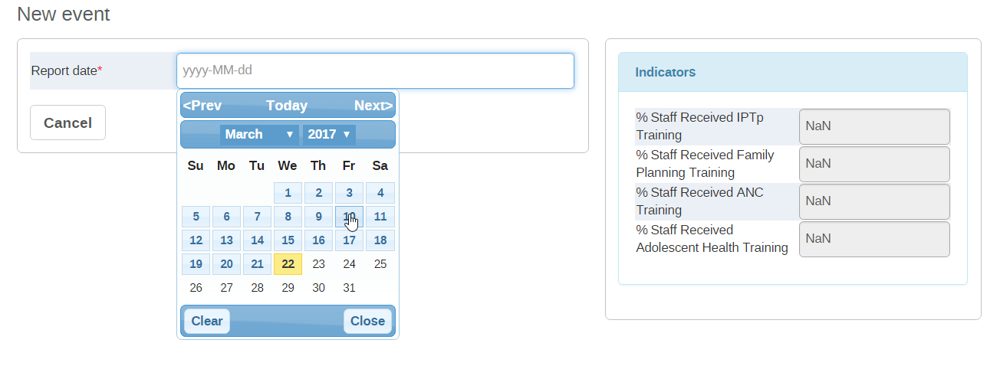

*   Access the resources by using the left-side sub-menu.

>>>>>  gd2md-html alert: inline image link here (to images/image125.png). Store image on your image server and adjust path/filename/extension if necessary.  (<a href="#">Back to top</a>)(<a href="#gdcalert126">Next alert</a>) >>>>> 

*   You can view a resource by left-clicking on the item and selecting "View resource".

>>>>>  gd2md-html alert: inline image link here (to images/image126.png). Store image on your image server and adjust path/filename/extension if necessary.  (<a href="#">Back to top</a>)(<a href="#gdcalert127">Next alert</a>) >>>>> 

#### Video - Reports App and Reporting Rates - Part 2 of 4 (5 min)

Next, you will learn how to use the **Organisation Unit Report.** You will also learn how to use the **Reporting Rate Summary**. 

[https://www.youtube.com/watch?v=s8k-YDtHUIo](https://www.youtube.com/watch?v=s8k-YDtHUIo)

##### Activity 2 - Organisation Unit Reports & Reporting Rate Summary

Organisation unit reports

Once in [TRAININGLAND](https://live.academy.dhis2.org/tl1/dhis-web-commons/security/login.action), you can access the organisation unit reports:

*   By either selecting it from the side-menu within the reports app.

>>>>>  gd2md-html alert: inline image link here (to images/image127.png). Store image on your image server and adjust path/filename/extension if necessary.  (<a href="#">Back to top</a>)(<a href="#gdcalert128">Next alert</a>) >>>>> 

*   Or by going to Apps -> Reports -> Organisation Unit Distribution Report.

>>>>>  gd2md-html alert: inline image link here (to images/image128.png). Store image on your image server and adjust path/filename/extension if necessary.  (<a href="#">Back to top</a>)(<a href="#gdcalert129">Next alert</a>) >>>>> 

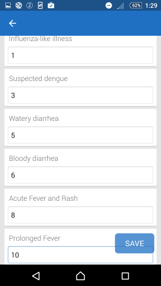

In order to run the report:

*   Define the criteria that you want to review first. In this example we can use the following:
    *   Report organisation unit: Food Region
    *   Group Set: Type
*   Select "Get report", in order to run the organisation unit report.

>>>>>  gd2md-html alert: inline image link here (to images/image129.png). Store image on your image server and adjust path/filename/extension if necessary.  (<a href="#">Back to top</a>)(<a href="#gdcalert130">Next alert</a>) >>>>> 

The report will run and break down the facilities by their Type.

>>>>>  gd2md-html alert: inline image link here (to images/image130.png). Store image on your image server and adjust path/filename/extension if necessary.  (<a href="#">Back to top</a>)(<a href="#gdcalert131">Next alert</a>) >>>>> 

Reporting rate summary

Next we can run the reporting rate summary. We can access this:

*   By either selecting it from the side-menu within the reports app.

>>>>>  gd2md-html alert: inline image link here (to images/image131.png). Store image on your image server and adjust path/filename/extension if necessary.  (<a href="#">Back to top</a>)(<a href="#gdcalert132">Next alert</a>) >>>>> 

*   Or by going to Apps -> Reports -> Reporting Rate Summary.

>>>>>  gd2md-html alert: inline image link here (to images/image132.png). Store image on your image server and adjust path/filename/extension if necessary.  (<a href="#">Back to top</a>)(<a href="#gdcalert133">Next alert</a>) >>>>> 

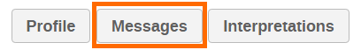

*   Select the criteria to run the report. In this example we can use
    *   Organisation Unit: Food Region
    *   Data Set: Primary Health Care Monthly
    *   Period Type: Quarterly
    *   Period: October- December 2016
*   Leave "Based on complete data set registrations" selected. This means that the completeness is calculated based on the user submitting a completed data set within the data entry app. This will be discussed more in later sessions.

>>>>>  gd2md-html alert: inline image link here (to images/image133.png). Store image on your image server and adjust path/filename/extension if necessary.  (<a href="#">Back to top</a>)(<a href="#gdcalert134">Next alert</a>) >>>>> 

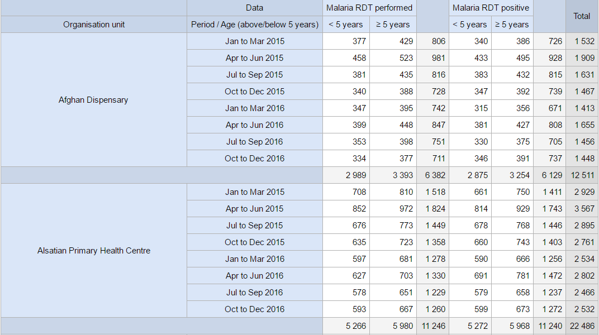

*   Click on "Get report" in order to run the report and see the results.

>>>>>  gd2md-html alert: inline image link here (to images/image134.png). Store image on your image server and adjust path/filename/extension if necessary.  (<a href="#">Back to top</a>)(<a href="#gdcalert135">Next alert</a>) >>>>> 

#### Video - Reports and Reporting Rates - Part 3 of 4 (7 min)

In this video, you will learn how to view reporting rates directly in the pivot tables app. Reporting Rates are readily available within the reports app, but you can also use the pivot tables app to review reporting rates in DHIS2. This gives us the advantage of being able to review multiple levels of organisation unit reporting rates in one place. [https://www.youtube.com/watch?v=VMfCMVvlR3Q](https://www.youtube.com/watch?v=VMfCMVvlR3Q)

##### Activity 3 - Reporting Rates in Pivot Tables

In [TRAININGLAND](https://live.academy.dhis2.org/tl1/dhis-web-commons/security/login.action), view the reporting rates within the pivot tables application. We will select all of the metrics associated with the "Primary Health Care Monthly Data Set".

*   In the data tab select:
    *   "Data Sets" as the data type
    *   Select the various metrics followed by "Primary Health Care Monthly" as related to that metric. For example, select the "Reporting Rates" metric type followed by the "Primary Health Care Monthly (Reporting rates)" metric. Repeat this for all metric types
*   Arrange the metrics you’ve selected according to the order you want them displayed within the pivot table.

>>>>>  gd2md-html alert: inline image link here (to images/image135.png). Store image on your image server and adjust path/filename/extension if necessary.  (<a href="#">Back to top</a>)(<a href="#gdcalert136">Next alert</a>) >>>>> 

*   In the period tab select "Last year" as the period. The last year that is displayed will be different than what is shown in the video.

>>>>>  gd2md-html alert: inline image link here (to images/image136.png). Store image on your image server and adjust path/filename/extension if necessary.  (<a href="#">Back to top</a>)(<a href="#gdcalert137">Next alert</a>) >>>>> 

*   In the organisation units tab select "Food Region" as the organisation unit and "Facility" as the organisation unit level.

>>>>>  gd2md-html alert: inline image link here (to images/image137.png). Store image on your image server and adjust path/filename/extension if necessary.  (<a href="#">Back to top</a>)(<a href="#gdcalert138">Next alert</a>) >>>>> 

*   Alter the table layout so that the organisation units are displayed (ensure the organisation unit is not in the filter).

>>>>>  gd2md-html alert: inline image link here (to images/image138.png). Store image on your image server and adjust path/filename/extension if necessary.  (<a href="#">Back to top</a>)(<a href="#gdcalert139">Next alert</a>) >>>>> 

You can also open the table options and deselect "Show row totals" in order to remove a nonsensical total in this case.

>>>>>  gd2md-html alert: inline image link here (to images/image139.png). Store image on your image server and adjust path/filename/extension if necessary.  (<a href="#">Back to top</a>)(<a href="#gdcalert140">Next alert</a>) >>>>> 

*   Click on "Update" in order to see the output. Not you will see a much longer list of facilities within DHIS2. This image is only showing the top portion of the actual output.

>>>>>  gd2md-html alert: inline image link here (to images/image140.png). Store image on your image server and adjust path/filename/extension if necessary.  (<a href="#">Back to top</a>)(<a href="#gdcalert141">Next alert</a>) >>>>> 

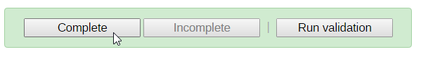

You can view the same metrics in the Data Visualiser App, as you can see in the Pivot Table app; while the GIS app will allow you to map the Reporting Rate metric. 

#### Video - Reports and Reporting Rates - Part 4 of 4 (4 min)

In the following video, you will find a summary of the most important concepts we have covered in this series of videos.

[https://www.youtube.com/watch?v=_AKIkYI0yZ8](https://www.youtube.com/watch?v=_AKIkYI0yZ8)

### Session Quiz - Reports App and Reporting Rates (10 min)

#### Session Quiz - Reports App and Reporting Rates

This is a **graded quiz** and it is worth **5%** of your final grade.

You have **3 attempts** for this quiz.

Select the "**check**" button to submit your answers.

If you want to save your current response without submitting it for grading yet, select the "save" button. This allows you to come back later and resume the attempt.

1. What does the data set report allow you to do? (select one)
*   Review data as it would appear in data entry and allow you to update/edit the data
*   Review data as it would appear in data entry without allowing you to modify it
*   Output the data as a user-defined one-click report

EXPLANATION

Data set reports were highlighted during the reports app demo. It is always a good idea to review data in the data set report rather than data entry as you cannot modify data in this report.

2. Resources in DHIS2 can be used to: (select one or more)
*   Upload items such as data collection forms, guidelines or annual reports
*   Add links to useful websites
*   Add additional assets that will increase DHIS2's performance

EXPLANATION

Resources were demonstrated in the reports app demo. Resources can be useful for uploading external documentation and links to external resources amongst other things. In this case, resources do not correspond with additional resources to power the DHIS2 system.

3. Organisation unit distribution reports can be used to: (select one or more)
*   Provide a total count of organisation units that appear at certain levels within the hierarchy
*   Display organisation units based on the groups they belong to
*   Show the geographic distribution of organisation units on a map

EXPLANATION

The organisation unit distribution report was demonstrated in the reports app demo. This allows us to separate our organisation units into user defined categories/groups as well as see the number of organisation units at different levels of the hierarchy.

4. In DHIS2, the reporting rate completeness can be checked in: (select one or more)
*   The reports app by running the reporting rate summary
*   Pivot Table, by selecting the Data Set you are interested in
*   Data Visualizer, by selecting the Data Set you are interested in

EXPLANATION

Reporting rates can be accessed in various parts of DHIS2. This includes in the reports app as well as the different analysis apps.

### Feedback - Introduction to DHIS2 Analysis

#### Feedback - Introduction to DHIS2 Analysis

Please take 2 or 3 minutes to complete this feedback survey once you are done with Module 3. Your careful response will have a real impact on how courses like this are run. Thank you!

[embeded survey]

## 

## Module 4 - Introduction to DHIS2 Customization (6 hr)

### 4.1 - Introduction to Collection and Customization (20 min)

Now that you’ve had the opportunity to use DHIS2 with existing data, we would like to shift focus and show you how to set up DHIS2 to capture your own data. You’ll start by reviewing the **Design Principles** of DHIS2 so you can understand how DHIS2 works behind the scenes. Then, after watching demonstrations, you will  create **Organisation Units, **also known as our “where” dimension**. Organisation Units** form the backbone of data collection as they associate all of the data you are capturing with a particular location. You will be able to create these in a new training environment, **DHIS2 Customization**. Next, you’ll look at how to create **Data Elements **(our** “**what”** **dimension) These data elements define exactly what information we want to capture. After you have reviewed the creation of organisation units and data elements, you will review the various **Data Collection **mechanisms available in DHIS2. ** **Finally, you’ll look at **Data Sets **within DHIS2**. Data Sets** are a collection of data elements and are assigned to certain organisation units. These are conceptually similar to a paper data collection form. You will have the opportunity to create a data set within the DHIS2 Customization training environment.

This module is graded, and successfully completing the module is required in order for you to gain your Fundamentals Certificate. This is because all of the Level 1 DHIS2 academies have some aspects of configuration or maintenance within their course content, so a basic understanding of this material is required for participation in those courses. The grading for this module is made up of **5 quizzes that each make up 5%** of your grade, in subsections 4.2, 4.3, 4.4, 4.5 & 4.6.** **There are also **3 assignments that each make up 8%** of your grade in subsections 4.3, 4.4 and 4.6 that need to be completed within the DHIS2 Customization training environment.

### **To make the most out of your learning experience, we recommend that you complete this module within a week of starting** it.**  **

#### Video - Collection and Customization Intro (3 min)

In this introductory video, you will review the concepts that we will be focusing on within this module. In this module, you will learn how to create your own sets of Organisation Units, Data Elements and Data Sets.

You will also review how to use the Web Data Entry App, the Android Data Capture App, SMS and PDF and other import options to upload data to DHIS2. [https://www.youtube.com/watch?v=Zqc-O4Z0dP8](https://www.youtube.com/watch?v=Zqc-O4Z0dP8)

#### Video - Introduction to DHIS2 Database Customization (8 min)

In the previous modules, you had the chance to practice what you learned in Trainingland, where you performed all the assignments of modules 2 and 3.

In this module, you'll be using another training environment,  DHIS2 Customization to practice and get familiar with its options.

In this video, you'll have an overview of this database and important information related to the assignments you will perform.

#### [https://www.youtube.com/watch?v=BZ-Lv-eqt40](https://www.youtube.com/watch?v=BZ-Lv-eqt40)

#### Create your account in CUSTOMIZATION (5 min)

Select the button below to request an account on the DHIS2 Customization.

You will receive an invitation by email with instructions on how to complete the registration in DHIS2.

[Request account button]

Note: the email address you use with OpenEDX will be sent to the DHIS2 database to create an account.

### 4.2 - Design Principles (20 min)

#### Video - Design Principles Presentation (10 min)

As an open source platform, DHIS2 can be widely customized based on how a given system is structured in any given country. 

In this video, you’ll learn about the 4 key design principles of DHIS2: 1) all metadata can be modified through the user interface; 2)  DHIS2 can act as a single data repository; 3) data input does not equal data output; and 4) the use of indicator-driven data analysis is encouraged. [https://www.youtube.com/watch?v=kJKXSrfu-NY](https://www.youtube.com/watch?v=kJKXSrfu-NY)

### Session Quiz - DHIS2 Customization 

#### Session Quiz - DHIS2 Customization

_You have 3 attempts to pass this quiz._

_Select the "check" button to submit your answers._

_If you want to save your current response without submitting it for grading yet, select the "save" button. This allows you to come back later and resume the attempt._

##### Session Quiz - DHIS2 Customization (10 min)

1. DHIS2 is an off-the-shelf solution that requires no additional configuration upon installation.
*   True
*   False

EXPLANATION

In both the DHIS2 History/Introduction and DHIS2 design principles presentation, it is highlighted that DHIS2 is a generic solution that needs to be tailored to fit local needs and requirements

2. You need to be a computer programmer (someone who knows computer languages) to take part in the configuration of DHIS2.
*   True
*   False

EXPLANATION

Many aspects of DHIS2 configuration can take place directly through the user-interface. This concept was discussed in the DHIS2 design principles presentation and demonstrated through numerous configuration sessions.

3. DHIS2 only supports the integration of data from one health program at a time.
*   True
*   False

EXPLANATION

Multiple programs can be integrated into the DHIS2 platform together. This is shown as both a concept and demo in the DHIS2 design principles session.

4. Reports in DHIS2 are dynamic and can be the combination of data from several different data sources.
*   True
*   False

EXPLANATION

Report can be a combination of data from multiple sources. This is shown in the DHIS2 design principles session.

5. What is the difference between Data Elements and Indicators (select one)?
*   They are both the same.
*   Data Elements measure the coverage while indicators collects data values from the paper forms
*   Data Elements are the raw data while Indicators are calculated values/formulas

EXPLANATION

The key difference here is that indicators represent calculated values, and can typically be made up of several data elements. Data elements are the raw items of data that are collected through routine processes.

### 4.3 - Organisation Units

#### Video - Organisation Units Presentation (6 min)

In this video, you’ll be introduced to the  concepts of **organisation units, organisation unit groups** and **organisation unit group sets. **These form the backbone of our data collection as they assist in attaching geographical locations to each data item that is stored in the system. Some best practices in their management are introduced before discussing their creation in the next series of videos. ** **[https://www.youtube.com/watch?v=ge5LjORD9Lg](https://www.youtube.com/watch?v=ge5LjORD9Lg)

#### Video - Organisation Units Demo - Part 1 of 4 (15 min)

After understanding how organisation units, organisation unit groups, and organisation unit group sets are related, you will now learn **how organisation units are created within DHIS2**. This will also include an introduction to the maintenance app, which allows you to create various items (referred to as metadata) within DHIS2. 

[https://www.youtube.com/watch?v=AmuI6BNUvho](https://www.youtube.com/watch?v=AmuI6BNUvho)

#### Video - Organisation Units Demo - Part 2 of 4 (7 min)

In this video, you will learn how to take the organisation units you have created and group them into **organisation unit groups**. 

[https://www.youtube.com/watch?v=Hb0hhs9dkj4](https://www.youtube.com/watch?v=Hb0hhs9dkj4)

#### Video - Organisation Units Demo - Part 3 of 4 (4 min)

Once you have created your organisation units and grouped them using organisation unit groups, you can take on the last step, creating **organisation unit group sets.** This video will cover this last step. These 3 concepts combined can have a significant impact on how your data is stored (as defined by the** organisation units** themselves) and what types of outputs are possible (as **organisation unit groups **and **group sets** allow you to disaggregate your data depending on how they have been defined). 

[https://www.youtube.com/watch?v=nwOx2qH_ClM](https://www.youtube.com/watch?v=nwOx2qH_ClM)

#### Video - Organisation Units Demo - Part 4 of 4 (4 min)

To finish this session, watch this video summarizing how to create Organisation Units, Organisation Unit Groups and Organisation Group Sets. .

[https://www.youtube.com/watch?v=JsYzAnVe-Es](https://www.youtube.com/watch?v=JsYzAnVe-Es)

### Assignment - Organisation Units, Data Elements & Data Sets

#### NOTE: These graded assignments belong to a series that goes throughout module 4. (30 min)

This series of assignments consist of 3 sets and makes up **8% of your overall grade.**

*   
Set 1: Organisation Units

*   
Set 2: Data Elements

*   
Set 3: Data Sets
At the end of the last assignment (assignment 4.6.2) you will be asked to check whether you have completed the whole series of assignments or not. This check will allow the course team to validate the result of your assignments in the DHIS2 Customization training environment. It is only after this validation process that the final grade of this series of assignments will be confirmed. As with all other assignments, you are allowed 3 attempts to complete this assignment successfully.

Note: Before validation from the course team has been performed, the maximum grade for this series will be applied to your progress automatically. This unvalidated grade is only a placeholder value, and may change once the validation process is complete. 

##### Assignments Module 4 - Set 1/3 - Organisation Units

Instructions

You need to be logged in [DHIS2 Customisation](https://live.academy.dhis2.org/cu1/dhis-web-commons/security/login.action) to perform the following assignments.

You are tasked with creating a portion of the organisation unit hierarchy within your country. The data should be entered at the correct level so appropriate outputs can be created. The hierarchy in this example country has 4 levels:

1. Country
2. Province
3. District
4. Facility

You will notice that the Country level organisation unit has been created using your email address when you enter organisation unit maintenance. This is so that you will only see the organisation units that you are creating, rather than seeing everyone’s organisation units together. Feel free to change the name of this organisation unit to something else if you desire.

>>>>>  gd2md-html alert: inline image link here (to images/image141.png). Store image on your image server and adjust path/filename/extension if necessary.  (<a href="#">Back to top</a>)(<a href="#gdcalert142">Next alert</a>) >>>>> 

Please work on the following:

##### Assignment 4.3.1

Define and create the organisation unit.

Refer to the doc "[Exercise Worksheet - Creating Organisation unit](https://academy.dhis2.org/assets/courseware/0bc4e40bbec535044faf30bd8ffdcbd0/c4x/HISP/DHIS2_Level1/asset/Exercise_Worksheet_-_Creating_Organisation_units.pdf)". Create organisation units with the following organisation unit hierarchy.

*   1 org unit at level 2 (Province)
*   3 org units at level 3 (District)
*   9 org units at level 4 (Facility)

##### Assignment 4.3.2

Create 4 organisation unit groups with the following names (and belonging to the indicated group sets) and assign your above facilities (the organisation units you have made at level 4) appropriately:

Note: Make sure to add a prefix using your initials to these names (ie. SND_Hospital, SND_Health Center) when you create them in DHIS2. As everyone is creating items in the same system, you need to provide the groups with unique names. 

Group Set 1 : Facility Type

*   Hospital
*   Health center

Group Set 2 : Ownership

*   Private
*   Public

##### Assignment 4.3.3

Create two organisation unit group sets and assign them the appropriate organisation unit groups:

Note: Make sure to add a prefix using your initials to these names (ie. SND_Type, SND_Ownership) when you create them in DHIS2. As everyone is creating items in the same system, you need to provide the group sets with unique names. 

*   Type
*   Ownership

### Session Quiz - Organisation Units 

Session Quiz - Organisation Units (20 min)  

This is a graded quiz and it is worth 5% of your final grade. You have 3 attempts to pass this quiz.

Select the "check" button to submit your answers.

If you want to save your current response without submitting it for grading, select the "save" button. This will allow you to come back later and resume the previously saved attempt.

##### Session Quiz - Organisation Units

1. Which one of these is not an organisation unit? (select one)
*   Ermita Public Health Centre
*   National Capital Region
*   Manila Hospital
*   Malaria Elimination Project

EXPLANATION

In the organisation units presentation, it is mentioned that multiple concepts should not be mixed in the hierarchy

2. The organisation unit hierarchy: (select one)
*   Can use organisation unit groups to model additional hierarchies (for example, public/private facilities) for analysis
*   Only supports a limited number of levels
*   Does not include any administrative layers outside of the facility

EXPLANATION

The concept of using organisation unit groups during analysis was shown during the organisation units presentation. These are user defined as was shown in the organisation unit demo.

Imagine you've created the following health facilities in DHIS2:

-Alberta Public Health Clinic

-Ontario Private Hospital

-Windsor Public Health Clinic

-London Public Hospital

As you can see there are two ownership types: private and public. There are also two facility types: clinic and hospital.

Now you want to create organisation units groups for these facilities. 

3. Which organisation unit groups would be best? (Select one or more)
*   Health Clinic: Alberta Public Health Clinic / Windsor Public Health Clinic AND Hospital: Ontario Private Hospital / London Public Hospital / Windsor Public Health Clinic
*   Health Clinic: Alberta Public Health Clinic / Windsor Public Health Clinic AND Hospital: Ontario Private Hospital / London Public Hospital
*   Publicly Owned Facilities: Alberta Public Health Clinic / Windsor Public Health Clinic / London Public Hospital AND Privately Owned Facilities: Ontario Private Hospital
*   Publicly Owned Facilities: Windsor Public Health Clinic / London Public Hospital AND Privately Owned Facilities: Ontario Private Hospital / Alberta Public Health Clinic

EXPLANATION

In this case, we can group the public health clinics and hospitals together. This would be equivalent to defining the type of facility within a system. We can also group public and private facilities together, which would be equivalent to defining the ownership of these facilities. This was discussed during the organisation unit presentation.

4. When managing organisation units in DHIS2 through the user interface, we can define the following geographical features: (select one or more)
*   Latitude/Longitude (for example, the location of a facility)
*   Geographical Symbols that define groups
*   Geographical Boundaries for regions, provinces, districts, etc.

EXPLANATION

This was shown when demoing the creation of organisation units. We can add in lat/long coordinates of a facility during creation, and assign symbols to organisation unit groups.

### 4.4 - Data Elements 

#### Video - Data Elements Design Principles  (12 min)

In this video, you will review the different types of data that can be collected in DHIS2, including what we refer to as  routine, semi-permanent and infrastructure data. You will also understand why it is important to **name data elements correctly; **this will include a review of best practices to follow when naming your data elements** **. Lastly, you’ll see how to create data element groups and group sets.

[https://www.youtube.com/watch?v=dlfGNMz7CWE](https://www.youtube.com/watch?v=dlfGNMz7CWE)

##### Activity 1 - Data Element Naming

Data Set Example

You are provided with the following summary data set to collect information on HIV, malaria and TB. We will use this example to properly name, create and group data elements. Please see the following sections.

<table>
  <tr>
   <td>Data Element
   </td>
   <td>Value
   </td>
  </tr>
  <tr>
   <td>Number of female sex workers reached with HIV prevention programs (Outreach)
   </td>
   <td>
   </td>
  </tr>
  <tr>
   <td>Number of PLHIV Attended
   </td>
   <td>
   </td>
  </tr>
  <tr>
   <td>Number of HIV positive TB patients who are already on ART or started on ART during TB treatment
   </td>
   <td>
   </td>
  </tr>
  <tr>
   <td>TB07.10 Number of patients with positive bacteriological results out of diagnosis
   </td>
   <td>
   </td>
  </tr>
  <tr>
   <td>TB07.19 Number of patients examined for follow-up
   </td>
   <td>
   </td>
  </tr>
  <tr>
   <td>MAL02.01 Malaria Slide (Tested)
   </td>
   <td>
   </td>
  </tr>
</table>

Instructions - Data Element Naming

Fill in the table below (the 'Name in DHIS2' column), assigning the data element a name you think is suitable for use in a database such as DHIS2. You will later be asked to create these in DHIS2.

<table>
  <tr>
   <td>Associated Program/Data Set
   </td>
   <td>Name on Form
   </td>
   <td>Name in DHIS2
   </td>
  </tr>
  <tr>
   <td>HIV1 Program Progress Report
   </td>
   <td>Number of female sex workers reached with HIV prevention programs (Outreach)
   </td>
   <td>
   </td>
  </tr>
  <tr>
   <td>PLHIV2 Network Activities
   </td>
   <td>Number of PLHIV Attended
   </td>
   <td>
   </td>
  </tr>
  <tr>
   <td>ART3
   </td>
   <td>Number of HIV positive TB patients who are already on ART or started on ART during TB treatment
   </td>
   <td>
   </td>
  </tr>
  <tr>
   <td>TB4 07
   </td>
   <td>TB07.10 Number of patients with positive bacteriological results out of diagnosis
   </td>
   <td>
   </td>
  </tr>
  <tr>
   <td>TB 07
   </td>
   <td>TB07.19 Number of patients examined for follow-up
   </td>
   <td>
   </td>
  </tr>
  <tr>
   <td>Malaria Monthly Report
   </td>
   <td>MAL02.01 Malaria Slide (Tested)
   </td>
   <td>
   </td>
  </tr>
</table>

1. Human immunodeficiency virus
2. People living with HIV
3. Anti-retro-viral therapy
4. Tuberculosis

#### Video - Data Elements - Part 1 of 3 (15 min)

After reviewing the design principles of data elements, you will now learn how Data Elements are created within DHIS2. You will also learn the mandatory fields required for creating a data element and how these concepts are linked to analysis outputs.

[https://www.youtube.com/watch?v=6Enk8m9wJqc](https://www.youtube.com/watch?v=6Enk8m9wJqc)

#### Video - Data Elements Demo - Part 2 of 3 (4 min)

In this video, you’ll learn how Data Element Groups and Data Element Group Sets are created. A brief review of how this affects the analysis tools in DHIS2 is also provided. 

[https://www.youtube.com/watch?v=AoTkndBFUWU](https://www.youtube.com/watch?v=AoTkndBFUWU)

#### Video - Data Elements Demo - Part 3 of 3 (3 min)

In the last part of this session, you’ll see a quick summary of the key concepts we’ve reviewed. 

[https://www.youtube.com/watch?v=fFB6HA4BJEA](https://www.youtube.com/watch?v=fFB6HA4BJEA)

### Assignment - Organisation Units, Data Elements & Data Sets

#### NOTE: These graded assignments belong to a series that goes throughout module 4. (30 min)

This series of assignments consist of 3 sets:

*   Set 1: Organisation Units
*   Set 2: Data Elements
*   Set 3: Data Sets

At the end of the last assignment (assignment 4.6.2) you will be asked to check whether you have completed the whole series of assignments or not. This check will allow the course team members to validate the result of your assignments in the DHIS2 Customization training environment. It is only after this validation process that the final grade of this series of assignments will be confirmed. As with all for the other assignments, you are allowed 3 attempts to complete this assignment successfully..

Note: Before validation from the course team has been performed, the maximum grade for this series will be applied to your progress automatically. This unvalidated grade is only a placeholder value, and may change once the validation process is complete. 

#### Assignments Module 4 - Set 2/3 - Data Elements

Instructions

You need to be logged in [DHIS2 Customisation](https://live.academy.dhis2.org/cu1/dhis-web-commons/security/login.action) to perform the following assignments.

Data Set Example

You are provided with the following summary data set to collect information on HIV, malaria and TB. We will use this example to properly name, create and group data elements. Please see the following sections.

<table>
  <tr>
   <td>Data Element
   </td>
   <td>Value
   </td>
  </tr>
  <tr>
   <td>Number of female sex workers reached with HIV prevention programs (Outreach)
   </td>
   <td>
   </td>
  </tr>
  <tr>
   <td>Number of PLHIV Attended
   </td>
   <td>
   </td>
  </tr>
  <tr>
   <td>Number of HIV positive TB patients who are already on ART or started on ART during TB treatment
   </td>
   <td>
   </td>
  </tr>
  <tr>
   <td>TB07.10 Number of patients with positive bacteriological results out of diagnosis
   </td>
   <td>
   </td>
  </tr>
  <tr>
   <td>TB07.19 Number of patients examined for follow-up
   </td>
   <td>
   </td>
  </tr>
  <tr>
   <td>MAL02.01 Malaria Slide (Tested)
   </td>
   <td>
   </td>
  </tr>
</table>

##### Assignment 4.4.1 - Data element Creation

You were previously asked to fill in this table as part of the Data Element naming activity. Please continue with this example and:

1. Proceed to create these data elements in DHIS2 (Use your initials as a prefix. Example: I create a data element for ANC 1 visit, I can call it SND_ANC 1st visit)
2. Create and Assign them to a Data Element group

<table>
  <tr>
   <td>
Associated Program/Data Set
   </td>
   <td>Name on Form
   </td>
   <td>Name in DHIS2
   </td>
  </tr>
  <tr>
   <td>HIV1 Program Progress Report
   </td>
   <td>Number of female sex workers reached with HIV prevention programs (Outreach)
   </td>
   <td>
   </td>
  </tr>
  <tr>
   <td>PLHIV2 Network Activities
   </td>
   <td>Number of PLHIV Attended
   </td>
   <td>
   </td>
  </tr>
  <tr>
   <td>ART3
   </td>
   <td>Number of HIV positive TB patients who are already on ART or started on ART during TB treatment
   </td>
   <td>
   </td>
  </tr>
  <tr>
   <td>TB4 07
   </td>
   <td>TB07.10 Number of patients with positive bacteriological results out of diagnosis
   </td>
   <td>
   </td>
  </tr>
  <tr>
   <td>TB 07
   </td>
   <td>TB07.19 Number of patients examined for follow-up
   </td>
   <td>
   </td>
  </tr>
  <tr>
   <td>Malaria Monthly Report
   </td>
   <td>MAL02.01 Malaria Slide (Tested)
   </td>
   <td>
   </td>
  </tr>
</table>

1. Human immunodeficiency virus
2. People living with HIV
3. Anti-retro-viral therapy
4. Tuberculosis

##### Assignment 4.4.2 - Data Element Groups

Create 3 data element groups, assigning the data element appropriately based on the health program that they belong to. Use your initials to prefix the data element groups that you create as you did for the data elements. 

The groups should consist of the following (the data elements in DHIS2 that you assign will be the new names you have assigned them in Section 1):

    1. HIV
        *   Number of female sex workers reached with HIV prevention programs (Outreach)
        *   Number of PLHIV Attended
        *   Number of HIV positive TB patients who are already on ART or started on ART during TB treatment
    2. Malaria
        *   MAL02.01 Malaria Slide (Tested)
    3. TB
        *   TB07.10 Number of patients with positive bacteriological results out of diagnosis
        *   TB07.19 Number of patients examined for follow-up

##### Assignment 4.4.3 - Data Element Group Set

Create a group set that consists of the HIV, Malaria and TB data element groups that you have created. As before, prefix the group set with your initials.

### Session Quiz - Data Elements

#### Session Quiz - Data Elements (20 min) 

This is a graded quiz and is worth 5% of your final grade.

You have 3 attempts to pass this quiz.

Select the "check" button to submit your answers.

If you want to save your current response without submitting it for grading, select the "save" button. This allows you to come back later and resume the previously saved attempt.

##### Session Quiz - Data Elements

1. Data Element names should: (select one)
*   Be as long and descriptive as possible
*   Use self-contained names which describe the data effectively for output
*   Replicate the name on a paper form
*   Be considered for input as a priority

EXPLANATION

When discussing data elements, we should always consider how they will appear in output. This is discussed in more detail during the data elements presentation.

2. I have a section of data elements that I am collecting all related to child delivery. I want to create the data element represented by the "Number of deliveries with complication" on the paper form. What is the most appropriate name for this data element? (select one)
*   Number of deliveries with complication
*   Complicated deliveries
*   Deliveries with complication

EXPLANATION

During the data element presentation, naming principles were discussed. Here, since we have a set of delivery data elements, it is better to start the name off with "Delivery" as all the delivery types could easily be found together in a list.

3. Data elements in DHIS2 can only be summed (added) together. No other operations, such as finding the average or counts of a particular value, can be performed.
*   True
*   False

EXPLANATION

When creating data elements, we can define various aggregation types. While sum tends to be a common option, other types can be used if needed.

4. Data Element Groups are used for grouping together similar data elements for thematic analysis.
*   True
*   False

EXPLANATION

Data element groups are user defined and assist us in finding our data elements during analysis. Their use was shown throughout all the analysis apps and their creation was shown in the data element creation session.

### 4.5 - Data Collection

#### Video - Data Collection Presentation (13 min)

The previous sets of assignments have allowed you to practice creating organisation units and data elements. Prior to creating a data set, we will demonstrate the different options that allow you to bring data into DHIS2, including the Data Entry Web application, the Android Data capture App, SMS Data Entry, PDF Data Upload, and Manual Data Import. The data entry web app, android data capture app and SMS data entry all use the concept of a dataset, which we will show you how to create after you have reviewed various data collection mechanisms in more detail.

[https://www.youtube.com/watch?v=onVutn5y9Q0](https://www.youtube.com/watch?v=onVutn5y9Q0)

#### Video - Data Collection - Web - Part 1 of 5 (5 min)

In this video, you’ll learn how to input data into DHIS2 using the Data Entry Web application. We will use the 3 building blocks in this session, selecting **Where **the data is entered, **When **the data is entered, and **What **data is being entered.

[https://www.youtube.com/watch?v=iIeWvibXZOw](https://www.youtube.com/watch?v=iIeWvibXZOw)

##### Activity 1 - Introducing the data entry app interface

Please do this activity in [TRAININGLAND](https://live.academy.dhis2.org/tl1/dhis-web-commons/security/login.action).

Familiarize yourself with the web data entry interface by opening a data set, navigating the data set and entering some data values. In order to open a data set you must first select the organisation unit, data set and period that you would like to review.

*   Select any organisation unit by either using the magnifying glass or expanding the tree on the left side of the screen.

>>>>>  gd2md-html alert: inline image link here (to images/image142.png). Store image on your image server and adjust path/filename/extension if necessary.  (<a href="#">Back to top</a>)(<a href="#gdcalert143">Next alert</a>) >>>>> 

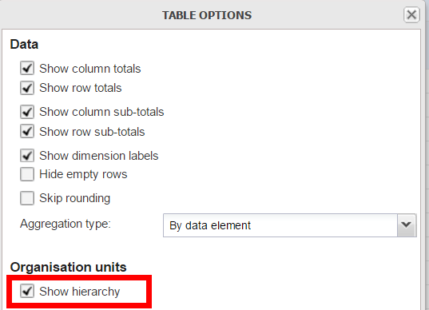

The organisation unit that you select will be highlighted in an orange color. It will also be displayed as the selected organisation unit in the data entry pane.

After you have selected an organisation unit:

*   Proceed to select a data set (in this example we will use the Primary Health Care Monthly data set)
*   and Period (select a period in 2018 such as January 2018 or March 2018 as these periods currently do not have any data; use the "Next year" button to select periods in 2018).

>>>>>  gd2md-html alert: inline image link here (to images/image143.png). Store image on your image server and adjust path/filename/extension if necessary.  (<a href="#">Back to top</a>)(<a href="#gdcalert144">Next alert</a>) >>>>> 

After selecting these parameters the data set will be displayed. Note: If you select an organisation/period that already has data entered in it already for 2018, try selecting a different organisation unit or period in which no data has been entered.

>>>>>  gd2md-html alert: inline image link here (to images/image144.png). Store image on your image server and adjust path/filename/extension if necessary.  (<a href="#">Back to top</a>)(<a href="#gdcalert145">Next alert</a>) >>>>> 

*   Enter the following practice data for the first section of the data set (labelled "Primary Health Care Monthly") to get a feel for using the data entry app. You can quickly navigate within the data entry app by using enter or tab to move forward/down and shift+tab to move backward/up between the various data element values when entering your data. Notice that when you enter values they will quickly change from yellow to green indicating they have been saved.

>>>>>  gd2md-html alert: inline image link here (to images/image145.png). Store image on your image server and adjust path/filename/extension if necessary.  (<a href="#">Back to top</a>)(<a href="#gdcalert146">Next alert</a>) >>>>> 

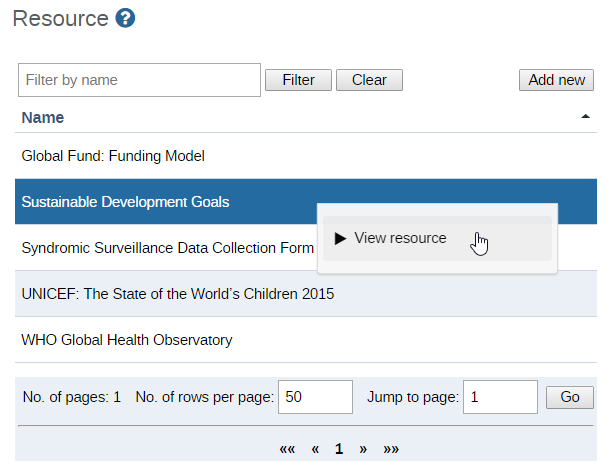

#### Video - Data Collection - Web Demo - Part 2 of 5 (7 min)

In this video, you will see some additional options available when entering values using the Data Entry Web App. This includes checking the internal consistency of your data values through reviewing historical values as well as using a concept called validation rules and reviewing what changes have been made to your data using the audit trail. 

[https://www.youtube.com/watch?v=aq5SN-nCYpM](https://www.youtube.com/watch?v=aq5SN-nCYpM)

#### Activity 2 - Reviewing the data element history, audit trail and validation rules

Please do this activity in [TRAININGLAND](https://live.academy.dhis2.org/tl1/dhis-web-commons/security/login.action).

Start this activity by running validation for the data that you have previously entered according to the example data provided in Activity 1:

*   You can select "Run validation" at either the top or bottom of the data entry page.

>>>>>  gd2md-html alert: inline image link here (to images/image146.png). Store image on your image server and adjust path/filename/extension if necessary.  (<a href="#">Back to top</a>)(<a href="#gdcalert147">Next alert</a>) >>>>> 

When you run validation, a pop-up screen will prompt you that some validation rule violations have been detected.

>>>>>  gd2md-html alert: inline image link here (to images/image147.png). Store image on your image server and adjust path/filename/extension if necessary.  (<a href="#">Back to top</a>)(<a href="#gdcalert148">Next alert</a>) >>>>> 

This includes:

*   Birth live >= Breastfeeding within 1 hour after delivery: the amount of infants that are breastfeed within 1 hour after delivery is a subset of the total live births within a facility. Therefore live births should always be greater than or equal to the number of infants breastfeed within 1 hour after delivery.
*   Delivery by Caesarean Section &lt;= Delivery by skilled birth attendant: Caesarean Sections are a subset of total deliveries performed by a skilled birth attendant, and therefore should be less than or equal to the deliveries performed by a skilled birth attendant.
*   Delivery with complication &lt;= Delivery by skilled birth attendant: Deliveries with complication are a subset of total deliveries performed by a skilled birth attendant, and therefore should be less than or equal to the deliveries performed by a skilled birth attendant.

Let us fix these validation rules before continuing.

*   Update the following data elements to fix the issues with validation. In this case, we could imagine some simple data entry errors occurring. In the first example (Birth live) a 6 was entered instead of a 9. In the second example (Delivery by skilled birth attendant) the 7 was not entered at the end of the data value.

>>>>>  gd2md-html alert: inline image link here (to images/image148.png). Store image on your image server and adjust path/filename/extension if necessary.  (<a href="#">Back to top</a>)(<a href="#gdcalert149">Next alert</a>) >>>>> 

After you have edited the values:

*   run the validation again. This time, you should see a successful result.

>>>>>  gd2md-html alert: inline image link here (to images/image149.png). Store image on your image server and adjust path/filename/extension if necessary.  (<a href="#">Back to top</a>)(<a href="#gdcalert150">Next alert</a>) >>>>> 

*   Double click on the value for Birth live (194) after you have corrected it.

This will bring up the data history page for you to review.

>>>>>  gd2md-html alert: inline image link here (to images/image150.png). Store image on your image server and adjust path/filename/extension if necessary.  (<a href="#">Back to top</a>)(<a href="#gdcalert151">Next alert</a>) >>>>> 

*   You can also select “Audit Trail” to review any changes you have made to the data element value.

>>>>>  gd2md-html alert: inline image link here (to images/image151.png). Store image on your image server and adjust path/filename/extension if necessary.  (<a href="#">Back to top</a>)(<a href="#gdcalert152">Next alert</a>) >>>>> 

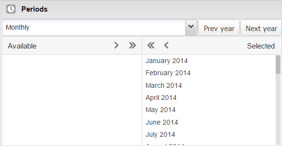

#### Video - Data Collection - Web - Part 3 of 5 (2 min)

In this video, you’ll continue learning about how to input new data in DHIS2. Select the play button below to get started.

[https://www.youtube.com/watch?v=nxEWOkkJumQ](https://www.youtube.com/watch?v=nxEWOkkJumQ)

##### Activity 3 - Completing data entry

Please do this activity in [TRAININGLAND](https://live.academy.dhis2.org/tl1/dhis-web-commons/security/login.action).

*   Complete the data entry process by clicking on the complete button for the organisation unit/period/data set combination you have been working with.

>>>>>  gd2md-html alert: inline image link here (to images/image152.png). Store image on your image server and adjust path/filename/extension if necessary.  (<a href="#">Back to top</a>)(<a href="#gdcalert153">Next alert</a>) >>>>> 

After you click on the “Complete” button, it will be grayed out. This will now contribute to being a complete report when you run the reporting rate completeness later on in DHIS2.

>>>>>  gd2md-html alert: inline image link here (to images/image153.png). Store image on your image server and adjust path/filename/extension if necessary.  (<a href="#">Back to top</a>)(<a href="#gdcalert154">Next alert</a>) >>>>> 

*   Re-load the data entry application
*   and re-select the organisation/period/data set combination you were previously editing.

>>>>>  gd2md-html alert: inline image link here (to images/image154.png). Store image on your image server and adjust path/filename/extension if necessary.  (<a href="#">Back to top</a>)(<a href="#gdcalert155">Next alert</a>) >>>>> 

With the data set displayed:

*   Scroll down to the bottom of the data entry page. You will now see the "Completed by" tag underneath the complete button.
*   You can click on "See details" to bring up additional information on the person who entered this data.

>>>>>  gd2md-html alert: inline image link here (to images/image155.png). Store image on your image server and adjust path/filename/extension if necessary.  (<a href="#">Back to top</a>)(<a href="#gdcalert156">Next alert</a>) >>>>> 

>>>>>  gd2md-html alert: inline image link here (to images/image156.png). Store image on your image server and adjust path/filename/extension if necessary.  (<a href="#">Back to top</a>)(<a href="#gdcalert157">Next alert</a>) >>>>> 

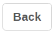

#### Video - Data Collection - Web Demo - Part 4 of 5

[https://www.youtube.com/watch?v=uaC5gBP3Ph0](https://www.youtube.com/watch?v=uaC5gBP3Ph0)

##### Activity 4 - Offline data entry

Please do this activity in [TRAININGLAND](https://live.academy.dhis2.org/tl1/dhis-web-commons/security/login.action).

*   To perform offline data entry, disconnect from the internet.

DHIS2 will prompt you indicating "You are offline, data will be stored locally".

>>>>>  gd2md-html alert: inline image link here (to images/image157.png). Store image on your image server and adjust path/filename/extension if necessary.  (<a href="#">Back to top</a>)(<a href="#gdcalert158">Next alert</a>) >>>>> 

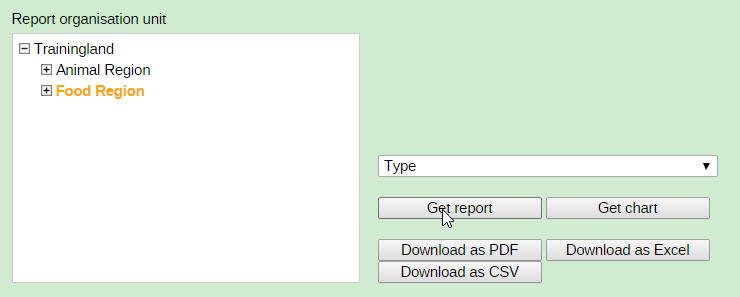

*   Try navigating around and selecting different organisation units at the facility level.

You can also change between the different data sets and periods. Note that you will not see any data that is only stored online; therefore most of the organisation unit/data set/period combinations you select will not display data until you are back online.

*   Enter some data in offline mode for the primary health care monthly data set using a period in 2018 as you did before for the Immunization section of the form.

>>>>>  gd2md-html alert: inline image link here (to images/image158.png). Store image on your image server and adjust path/filename/extension if necessary.  (<a href="#">Back to top</a>)(<a href="#gdcalert159">Next alert</a>) >>>>> 

*   Re-connect  to the internet. A prompt will indicate that "There is data stored locally, please upload to server".
*   Click on the Upload button to upload the data.

>>>>>  gd2md-html alert: inline image link here (to images/image159.png). Store image on your image server and adjust path/filename/extension if necessary.  (<a href="#">Back to top</a>)(<a href="#gdcalert160">Next alert</a>) >>>>> 

After the upload is complete, you will receive a prompt indicating that the "Upload to server was successful".

>>>>>  gd2md-html alert: inline image link here (to images/image160.png). Store image on your image server and adjust path/filename/extension if necessary.  (<a href="#">Back to top</a>)(<a href="#gdcalert161">Next alert</a>) >>>>> 

#### Video- Data Collection - Web Demo - Part 5 of 5

[https://www.youtube.com/watch?v=kRIh4GasqIw](https://www.youtube.com/watch?v=kRIh4GasqIw)

#### Video - Data Collection - Android - Part 1 of 3

[https://www.youtube.com/watch?v=SbdQrdSbxyU](https://www.youtube.com/watch?v=SbdQrdSbxyU)

##### Activity 1 - Installing, logging in and entering data using an Android device

To perform this activity, you will need an Android device (at this point, only Android devices are supported)

On the Android device, you will need to install the app:

*   Navigate to the play store on your phone and find the "Data Capture for DHIS2" app in the play store: [https://play.google.com/store/apps/details?id=org.dhis2.mobile&hl=en](https://play.google.com/store/apps/details?id=org.dhis2.mobile&hl=en)
*   Install the app when you find it in the play store.

>>>>>  gd2md-html alert: inline image link here (to images/image161.png). Store image on your image server and adjust path/filename/extension if necessary.  (<a href="#">Back to top</a>)(<a href="#gdcalert162">Next alert</a>) >>>>> 

*   Open the app up on your phone (DHIS2 Data Capture)

>>>>>  gd2md-html alert: inline image link here (to images/image162.png). Store image on your image server and adjust path/filename/extension if necessary.  (<a href="#">Back to top</a>)(<a href="#gdcalert163">Next alert</a>) >>>>> 

*   Fill in the details as follows:
    *   Server URL: [https://live.academy.dhis2.org/tl1](https://live.academy.dhis2.org/tl1)
    *   Username: Select a user-name from the table below (for example, if my last name starts with J, I would use android5)
    *   Password: Password1

>>>>>  gd2md-html alert: inline image link here (to images/image163.png). Store image on your image server and adjust path/filename/extension if necessary.  (<a href="#">Back to top</a>)(<a href="#gdcalert164">Next alert</a>) >>>>> 

Note: For the username, several have been created for this exercise. Please select an account according to your last name. This is being done so that we can separate the data that is entered by the android devices across the various organisation units within Trainingland so it is easier for each user to find their data when the log in through their web browser later on.

>>>>>  gd2md-html alert: inline image link here (to images/image164.png). Store image on your image server and adjust path/filename/extension if necessary.  (<a href="#">Back to top</a>)(<a href="#gdcalert165">Next alert</a>) >>>>> 

*   Click on the "Log in" button to log in. You will see this interface initially.
*   Select "Choose organisation unit".
*   and select an organisation unit to continue.

>>>>>  gd2md-html alert: inline image link here (to images/image165.png). Store image on your image server and adjust path/filename/extension if necessary.  (<a href="#">Back to top</a>)(<a href="#gdcalert166">Next alert</a>) >>>>> 

 

>>>>>  gd2md-html alert: inline image link here (to images/image166.png). Store image on your image server and adjust path/filename/extension if necessary.  (<a href="#">Back to top</a>)(<a href="#gdcalert167">Next alert</a>) >>>>> 

*   Next, tap "Choose data set".
*   and select the "Syndromic Surveillance" data set.

>>>>>  gd2md-html alert: inline image link here (to images/image167.png). Store image on your image server and adjust path/filename/extension if necessary.  (<a href="#">Back to top</a>)(<a href="#gdcalert168">Next alert</a>) >>>>> 

 

>>>>>  gd2md-html alert: inline image link here (to images/image168.png). Store image on your image server and adjust path/filename/extension if necessary.  (<a href="#">Back to top</a>)(<a href="#gdcalert169">Next alert</a>) >>>>> 

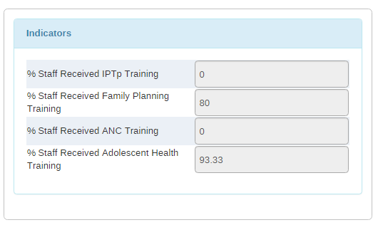

Next select "Choose period" and select a period of your choice.

>>>>>  gd2md-html alert: inline image link here (to images/image169.png). Store image on your image server and adjust path/filename/extension if necessary.  (<a href="#">Back to top</a>)(<a href="#gdcalert170">Next alert</a>) >>>>> 

 

>>>>>  gd2md-html alert: inline image link here (to images/image170.png). Store image on your image server and adjust path/filename/extension if necessary.  (<a href="#">Back to top</a>)(<a href="#gdcalert171">Next alert</a>) >>>>> 

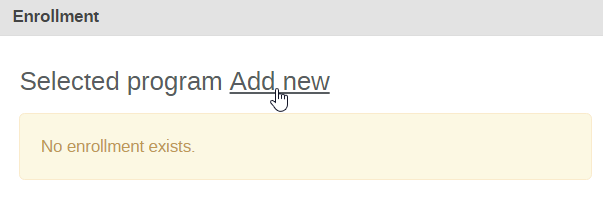

The information will fill in on the Android device.

*   Make a note of the organisation unit/data set/period combination you have selected so you can verify the data has been uploaded later on.
*   Tap on the summary box which contains the combined information of your data set, period and organisation unit selection.

>>>>>  gd2md-html alert: inline image link here (to images/image171.png). Store image on your image server and adjust path/filename/extension if necessary.  (<a href="#">Back to top</a>)(<a href="#gdcalert172">Next alert</a>) >>>>> 

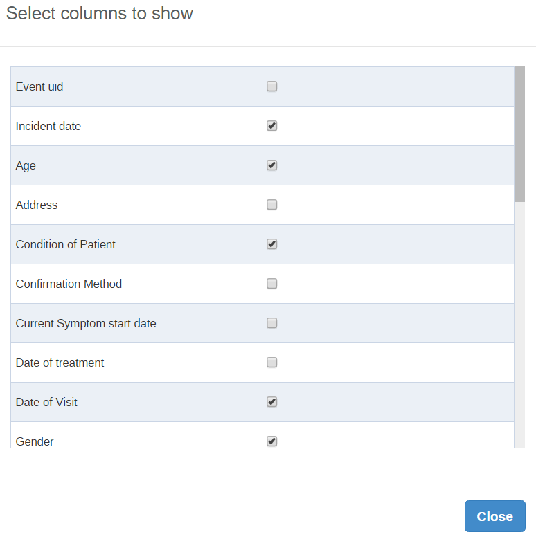

    *   You can now proceed to enter some data.
    *   Click on the Save button to send the data to DHIS2.

If you swipe down your notification tray, you will see the message "Import process completed successfully" indicating the data has been successfully sent to DHIS2.

(Note: If there is data already present in the organisation unit/period/data set combination you have selected, please try to select a different organisation unit/period combination with no data present)

>>>>>  gd2md-html alert: inline image link here (to images/image172.png). Store image on your image server and adjust path/filename/extension if necessary.  (<a href="#">Back to top</a>)(<a href="#gdcalert173">Next alert</a>) >>>>> 

 

>>>>>  gd2md-html alert: inline image link here (to images/image173.png). Store image on your image server and adjust path/filename/extension if necessary.  (<a href="#">Back to top</a>)(<a href="#gdcalert174">Next alert</a>) >>>>> 

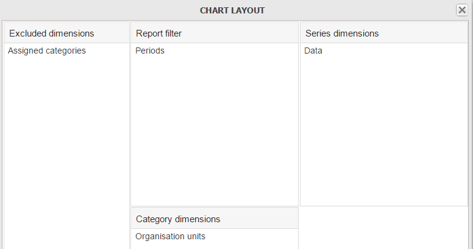

*   Log back into Trainingland through your web browser on your computer and make sure your data has been imported successfully online.
*   Find the organisation unit/data set/period combination you selected on the Android device. In the example above this was the following:

>>>>>  gd2md-html alert: inline image link here (to images/image174.png). Store image on your image server and adjust path/filename/extension if necessary.  (<a href="#">Back to top</a>)(<a href="#gdcalert175">Next alert</a>) >>>>> 

*   Review the data entry page and see if the data is present.

The data set should also be marked as complete and have the details of the user who completed the data entry using the android device.

>>>>>  gd2md-html alert: inline image link here (to images/image175.png). Store image on your image server and adjust path/filename/extension if necessary.  (<a href="#">Back to top</a>)(<a href="#gdcalert176">Next alert</a>) >>>>> 

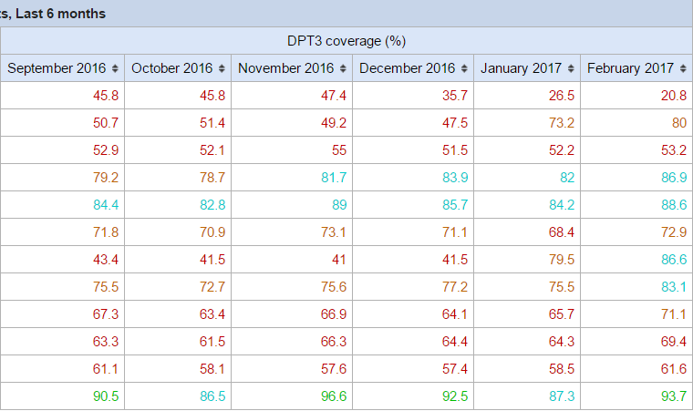

#### Video - Data Collection - Android Demo - Part 2 of 3

[https://www.youtube.com/watch?v=twu1pD4hVOs](https://www.youtube.com/watch?v=twu1pD4hVOs)

##### Activity 2 - Entering data offline using an Android device

In order to start this activity, you must first ensure you are logged in to the android device with your internet connection active. If you try to log-in without an internet connection it will not work.

After you have logged in:

*   Turn off the wi-fi and mobile data on your phone to ensure you no longer have any connectivity.

>>>>>  gd2md-html alert: inline image link here (to images/image176.png). Store image on your image server and adjust path/filename/extension if necessary.  (<a href="#">Back to top</a>)(<a href="#gdcalert177">Next alert</a>) >>>>> 

Now you can proceed to:

*   select an organisation unit/period/data set combination
*   and enter some data offline.

Remember not to log-out of the android app while performing this activity or you will lose the data you have entered!

>>>>>  gd2md-html alert: inline image link here (to images/image177.png). Store image on your image server and adjust path/filename/extension if necessary.  (<a href="#">Back to top</a>)(<a href="#gdcalert178">Next alert</a>) >>>>> 

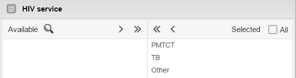
 

>>>>>  gd2md-html alert: inline image link here (to images/image178.png). Store image on your image server and adjust path/filename/extension if necessary.  (<a href="#">Back to top</a>)(<a href="#gdcalert179">Next alert</a>) >>>>> 

*   After you click on Save you will see that you do not receive any notification that the data was imported successfully.

>>>>>  gd2md-html alert: inline image link here (to images/image179.png). Store image on your image server and adjust path/filename/extension if necessary.  (<a href="#">Back to top</a>)(<a href="#gdcalert180">Next alert</a>) >>>>> 

*   Turn your wi-fi or mobile data back on in order to upload the data.

When you turn your data back on you will receive the notification.

>>>>>  gd2md-html alert: inline image link here (to images/image180.png). Store image on your image server and adjust path/filename/extension if necessary.  (<a href="#">Back to top</a>)(<a href="#gdcalert181">Next alert</a>) >>>>> 

*   You can log back into Trainingland through your web browser on your computer to check if the data you entered offline on the android device is now online.

In the offline example the following organisation unit/data set/period combination was selected:

>>>>>  gd2md-html alert: inline image link here (to images/image181.png). Store image on your image server and adjust path/filename/extension if necessary.  (<a href="#">Back to top</a>)(<a href="#gdcalert182">Next alert</a>) >>>>> 

*   Review the data entry page and see if the data is present.

The data set should also be marked as complete and have the details of the user who completed the data entry using the android device.

>>>>>  gd2md-html alert: inline image link here (to images/image182.png). Store image on your image server and adjust path/filename/extension if necessary.  (<a href="#">Back to top</a>)(<a href="#gdcalert183">Next alert</a>) >>>>> 

#### Video - Data Collection - Android Demo - Part 3 of 3

[https://www.youtube.com/watch?v=lAJ09XUkqa4](https://www.youtube.com/watch?v=lAJ09XUkqa4)

#### Video - Data Collection - PDF and CSV Import

[https://www.youtube.com/watch?v=5hsOjyGwU2o](https://www.youtube.com/watch?v=5hsOjyGwU2o)

##### Practice Zone

Knowledge check (not graded) - PDF and CSV Import

PDF forms can be automatically generated by DHIS2 in order to enter data offline

*   True
*   False

    DHIS2 can natively import an Excel file in any format

*   True
*   False

    DHIS2 has functionality to import large amounts of data at once so this data does not need to be re-entered again

*   True
*   False

### Session Quiz - Data Collection

#### NOTE: THIS IS A GRADED QUIZ.

You are allowed 3 attempts for this quiz.

There is 30 seconds of time between each attempt, so if you don't get it right, just breathe in, watch the videos once more and carefully read the question again.

##### Session Quiz - Data Collection

The main function of Data Sets in DHIS2 is to: (select one)

*   Create dynamic outputs
*   Group together data elements for analysis
*   Capture Data
*   Analyse data quality

EXPLANATION

Data Sets are used to capture data from different sources in DHIS2. Outputs are not directly tied to data sets and can be a mix of different data sets as needed.

Some different methods for me to input data using DHIS2 include: (select one or more)

*   Performing a manual import of data
*   Using an Android Device
*   Scanning Data directly from a paper form
*   Using the data entry app within DHIS2

EXPLANATION

Different types of data collection methods were shown throughout Module 4. DHIS2 does not have the ability to scan in results from a paper form directly however.

In the web data entry app, you can view the following: (select one or more)

*   Data element history (referring to the history of a particular item)
*   Audit trail (showing you changes made to a particular item)
*   The distribution of the data over a particular period, such as variance or standard deviation

EXPLANATION

DHIS2 does allow for you to examine data distributions such as variance and standard deviation, but this cannot be done directly in the data entry web app. The audit trail and data element history were shown in the data entry web app session.

In the web data entry app what type of quick quality checks can be performed? (select one or more)

*   That individual minimum and maximum limits are not violated
*   Validation rules that run user defined conditions which check that certain logical, mathematical criteria are met
*   That values are being entered in the correct format (ie. text cannot be entered in a numerical field)

EXPLANATION

In the web data entry app, various quality checks can be run while entering data. These were shown in the data entry web app session.

Android Data Entry can be performed offline without an internet connection

*   True
*   False

EXPLANATION

As long as you are logged in to the Android app (and do not log out) and you can continue to enter data directly on the Android device without an internet connection.

Alternative methods of bringing data into DHIS2, such as importing the data or using PDF files, are possible

*   True
*   False

EXPLANATION

Other methods of bringing data into DHIS2 are possible. This allows for transferring data from legacy systems or creating a data warehouse with data that is in different formats.

### 4.6 - Data Sets

#### Video - Data Sets - Data Set Creation - Part 1 of 3

[https://www.youtube.com/watch?v=EloVtQ0XALs](https://www.youtube.com/watch?v=EloVtQ0XALs)

#### Video - Data Sets - Data Set - Data Set Creation - Part 2 of 3

[https://www.youtube.com/watch?v=JUHufA0f1Vo](https://www.youtube.com/watch?v=JUHufA0f1Vo)

#### Video - Data Sets - Data Set Creation - Part 3 of 3

[https://www.youtube.com/watch?v=A_sXdCCfNuE](https://www.youtube.com/watch?v=A_sXdCCfNuE)

### Assignment - Organisation Units, Data Elements & Data Sets

#### NOTE: These graded assignments belong to a series that goes throughout module 4.

This series of assignments consist of 3 sets:

*   Set 1: Organisation Units
*   Set 2: Data Elements
*   Set 3: Data Sets

This series will allow you to build bits by bits a data set and populate it.

At the end of the last assignment (assignment 4.6.2) you will be ask to check whether you have completed the whole series or not. This check will allow the course team members to validate the result of your assignments in DHIS2 Customization. It is only after this validation process that the final grade of this series of assignment will be confirmed. As for the other assignments, you are allowed 3 attempts.

Note: Before the validation from the course team, the max grade for this series will be applied, but this grade is not the validated one.

##### Assignments Module 4 - Set 3/3 - Data Sets

Instructions

You need to be logged in [DHIS2 Customization](https://live.academy.dhis2.org/cu1/dhis-web-commons/security/login.action) to perform the following assignments.

Data Set Example

In the data element section you were provided with the following example data set.

<table>
  <tr>
   <td>Data Element
   </td>
   <td>Value
   </td>
  </tr>
  <tr>
   <td>Number of female sex workers reached with HIV prevention programs (Outreach)
   </td>
   <td>
   </td>
  </tr>
  <tr>
   <td>Number of PLHIV Attended
   </td>
   <td>
   </td>
  </tr>
  <tr>
   <td>Number of HIV positive TB patients who are already on ART or started on ART during TB treatment
   </td>
   <td>
   </td>
  </tr>
  <tr>
   <td>TB07.10 Number of patients with positive bacteriological results out of diagnosis
   </td>
   <td>
   </td>
  </tr>
  <tr>
   <td>TB07.19 Number of patients examined for follow-up
   </td>
   <td>
   </td>
  </tr>
  <tr>
   <td>MAL02.01 Malaria Slide (Tested)
   </td>
   <td>
   </td>
  </tr>
</table>

##### Assignment 4.6.1 - Create a default data set

Part 1

Using the data elements you have already created in the data element exercise, recreate this data set as a monthly data set collected at the facility level (assign the data set to the facilities you have created). Note that the Data set has already been created for you when you created your account. You can edit it and provide it with a better name if desired. You will need to edit the data sets properties, add the data elements that you have created to this data set and assign it to an organisation unit. This is to get around the issue of managing user privileges that was discussed in the video demonstration, as this data set is by default assigned to your user. 

>>>>>  gd2md-html alert: inline image link here (to images/image183.png). Store image on your image server and adjust path/filename/extension if necessary.  (<a href="#">Back to top</a>)(<a href="#gdcalert184">Next alert</a>) >>>>> 

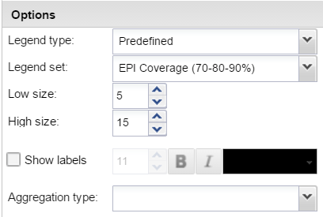

Part 2

Navigate to data entry app and select an organisation unit which you have assigned the data set to. Select a period and the data set you have created to confirm it has been created successfully.

##### Assignment 4.6.2 - Create a section data set

Part 1

Divide the data set above into 3 sections as depicted below. You can either modify the data set you have created in Part 1 or make a new data set if you like.

HIV Section

<table>
  <tr>
   <td>Data Element
   </td>
   <td>Value
   </td>
  </tr>
  <tr>
   <td>Number of female sex workers reached with HIV prevention programs (Outreach)
   </td>
   <td>
   </td>
  </tr>
  <tr>
   <td>Number of PLHIV Attended
   </td>
   <td>
   </td>
  </tr>
  <tr>
   <td>Number of HIV positive TB patients who are already on ART or started on ART during TB treatment
   </td>
   <td>
   </td>
  </tr>
</table>

TB Section

<table>
  <tr>
   <td>Data Element
   </td>
   <td>Value
   </td>
  </tr>
  <tr>
   <td>TB07.10 Number of patients with positive bacteriological results out of diagnosis
   </td>
   <td>
   </td>
  </tr>
  <tr>
   <td>TB07.19 Number of patients examined for follow-up
   </td>
   <td>
   </td>
  </tr>
</table>

Malaria Section

<table>
  <tr>
   <td>
   </td>
   <td>
   </td>
  </tr>
  <tr>
   <td>Data Element
   </td>
   <td>Value
   </td>
  </tr>
  <tr>
   <td>MAL02.01 Malaria Slide (Tested)
   </td>
   <td>
   </td>
  </tr>
</table>

Part 2

Clear your cache before checking again. Do this by going to Apps -> Browser cache cleaner -> Select All -> Clear

Navigate to data entry and select an organisation unit which you have assigned the data set to. Select a period and the data set you have created to confirm it has been created successfully. Enter some data in the data set to confirm it will store the data correctly.

Note: You must enter some data in the data entry app to complete the 3 components of the customization assignments. 

##### QUESTION APPLYING TO THE SERIES OF ASSIGNMENTS FOR MODULE 4

This check will allow the course team members to validate the result of your assignments in DHIS2 Customization.

As for the other assignments, you are allowed 3 attempts

*    I performed all the assignments in DHIS2 Customisation and want the course team to review the result of my work.
*    I have not finalized all the assignments yet.

### Session Quiz - Data Sets

#### NOTE: THIS IS A GRADED QUIZ.

You are allowed 3 attempts for this quiz.

There is 30 seconds of time between each attempt, so if you don't get it right, just breathe in, watch the videos once more and carefully read the question again.

##### Session Quiz - Data Sets

Data Sets can be separated into user-defined sections:

*   True 
*   False

EXPLANATION

The process of creating a data set that is separated into sections was shown during the data set creation session.

We can configure data sets to allow us to: (select one or more)

*   Enter data into future periods
*   Define what is considered a timely submission
*   Contain as many or as few data elements as required

EXPLANATION

These different parameters can all be configured when creating a data set in DHIS2. This was shown during the data set creation session.

### 4.7 - Module Readings

Additional Readings (not graded):

[DHIS2 Manual: Data Import](https://docs.dhis2.org/2.25/en/user/html/import.html)

### Feedback - DHIS2 Customization

#### Feedback - DHIS2 Customisation

Please take 2 or 3 minutes to complete this feedback survey once you are done with the Module 4. Your careful response will have a real impact on how courses like this are run. Thank you!

[Embeded survey]

## 

## Module 5 - Introduction to Tracker

### 5.1 - Presentation of the Tracker Introduction Session

#### Video - Tracker Intro Presentation

[https://www.youtube.com/watch?v=-3Os3E6EMEU](https://www.youtube.com/watch?v=-3Os3E6EMEU)

### 5.2 - Event Programs

#### Video - Introduction to Event Programs

[https://www.youtube.com/watch?v=Nqxee03vqTs](https://www.youtube.com/watch?v=Nqxee03vqTs)

#### Video - Event Capture Demo - Part 1 of 4

[https://www.youtube.com/watch?v=-IojjGyrURU](https://www.youtube.com/watch?v=-IojjGyrURU)

##### Activity 1 - Introducing the event capture interface

Please do this activity in [TRAININGLAND](https://live.academy.dhis2.org/tl1/dhis-web-commons/security/login.action).

*   Familiarize yourself with the event capture interface.
*   Navigate to event capture by selecting Apps -> Event Capture.

>>>>>  gd2md-html alert: inline image link here (to images/image184.png). Store image on your image server and adjust path/filename/extension if necessary.  (<a href="#">Back to top</a>)(<a href="#gdcalert185">Next alert</a>) >>>>> 

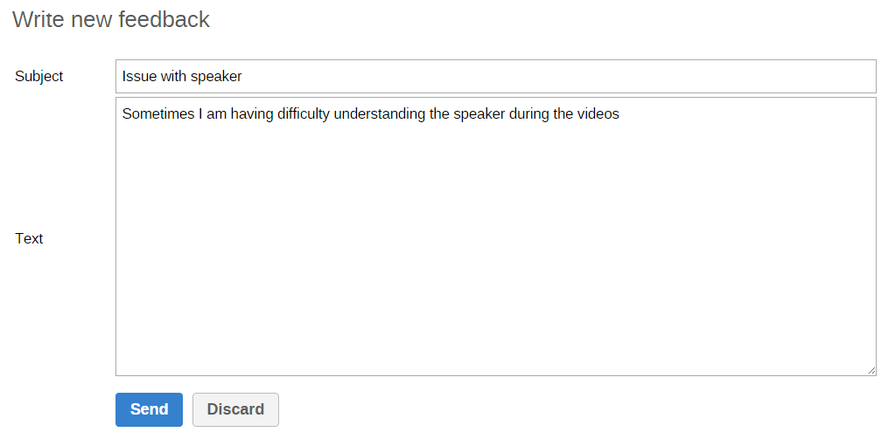

*   Select any of organisation units at the facility level within Trainingland.

>>>>>  gd2md-html alert: inline image link here (to images/image185.png). Store image on your image server and adjust path/filename/extension if necessary.  (<a href="#">Back to top</a>)(<a href="#gdcalert186">Next alert</a>) >>>>> 

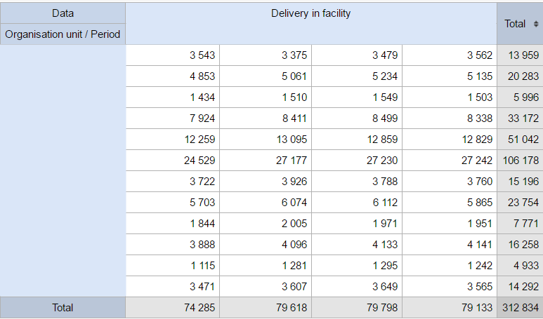

*   Select Malaria case management as the program. Note that you do not select a period; this differs from the aggregate data entry app in which a period must be selected before any data appears.

>>>>>  gd2md-html alert: inline image link here (to images/image186.png). Store image on your image server and adjust path/filename/extension if necessary.  (<a href="#">Back to top</a>)(<a href="#gdcalert187">Next alert</a>) >>>>> 

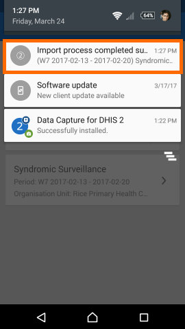

After selecting a program, the related events will appear.

>>>>>  gd2md-html alert: inline image link here (to images/image187.png). Store image on your image server and adjust path/filename/extension if necessary.  (<a href="#">Back to top</a>)(<a href="#gdcalert188">Next alert</a>) >>>>> 

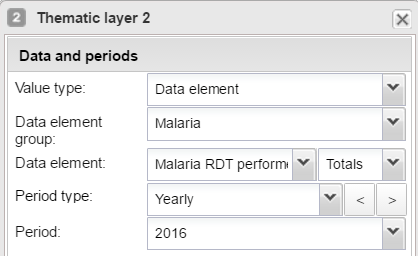

You can try the following functionality to see how it works:

*   Print List: Prints the list of events that is displayed on the page you are viewing within the event capture app. Click on the "Print list" button in order to view the output.

>>>>>  gd2md-html alert: inline image link here (to images/image188.png). Store image on your image server and adjust path/filename/extension if necessary.  (<a href="#">Back to top</a>)(<a href="#gdcalert189">Next alert</a>) >>>>> 

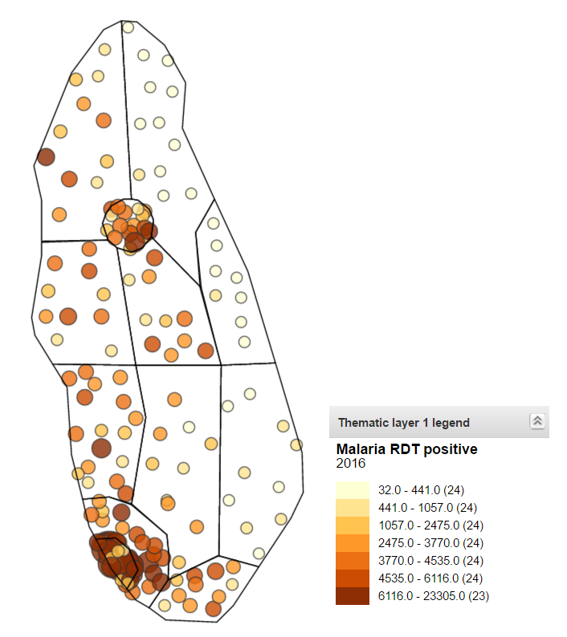

*   Download events: This will download the events that are displayed in event capture in one of XML, JSON or CSV file formats directly to your computer.

>>>>>  gd2md-html alert: inline image link here (to images/image189.png). Store image on your image server and adjust path/filename/extension if necessary.  (<a href="#">Back to top</a>)(<a href="#gdcalert190">Next alert</a>) >>>>> 

*   Show/hide columns: This will add additional columns to the event capture front page. These columns in event capture represent the data elements which are associated with the program you have selected. You can access this using the "Show/hide columns" button.

>>>>>  gd2md-html alert: inline image link here (to images/image190.png). Store image on your image server and adjust path/filename/extension if necessary.  (<a href="#">Back to top</a>)(<a href="#gdcalert191">Next alert</a>) >>>>> 

If you left-click on an event, some options will appear. The event will only have an audit history if it has been changed. You can try to select some of the options to see the effect they have on the event.

>>>>>  gd2md-html alert: inline image link here (to images/image191.png). Store image on your image server and adjust path/filename/extension if necessary.  (<a href="#">Back to top</a>)(<a href="#gdcalert192">Next alert</a>) >>>>> 

#### Video - Event Capture Demo - Part 2 of 4

[https://www.youtube.com/watch?v=THD3a6UJN9A](https://www.youtube.com/watch?v=THD3a6UJN9A)

##### Activity 2 - Register a new event

Please do this activity in [TRAININGLAND](https://live.academy.dhis2.org/tl1/dhis-web-commons/security/login.action).

*   Select any of organisation units at the facility level within Trainingland and select the SARA RCH program.

>>>>>  gd2md-html alert: inline image link here (to images/image192.png). Store image on your image server and adjust path/filename/extension if necessary.  (<a href="#">Back to top</a>)(<a href="#gdcalert193">Next alert</a>) >>>>> 

*   Left-click "Register event" to create a new event.

>>>>>  gd2md-html alert: inline image link here (to images/image193.png). Store image on your image server and adjust path/filename/extension if necessary.  (<a href="#">Back to top</a>)(<a href="#gdcalert194">Next alert</a>) >>>>> 

*   You will need to select a report date before you begin this process.

You can select any report date of your choosing. This differs from aggregate data entry, in which you select a predefined period. For events, any report date can be selected.

>>>>>  gd2md-html alert: inline image link here (to images/image194.png). Store image on your image server and adjust path/filename/extension if necessary.  (<a href="#">Back to top</a>)(<a href="#gdcalert195">Next alert</a>) >>>>> 

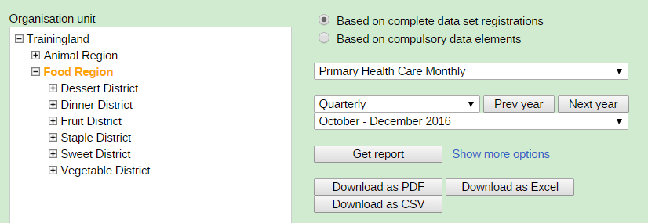

After selecting the report date, the questions within the program will appear. Note that you only see two questions as the remainder are hidden by the logic associated with the survey (or, in DHIS2 terms. the program rules).

*   Fill in the following data.

Note that program rules should be triggered when you select the following questions:

*   Does this facility offer family planning services?
    *   Triggers the follow-up questions related to family planning services
*   Received any family planning training in the last two years?
    *   Triggers follow-up asking how many trained
*   Received any training in adolescent sexual and reproductive health in the last two years?
    *   Triggers follow-up asking how many trained
*   Does this facility stock contraceptive commodities at this service site?
    *   Triggers the follow-up questions related to contraceptive commodities

>>>>>  gd2md-html alert: inline image link here (to images/image195.png). Store image on your image server and adjust path/filename/extension if necessary.  (<a href="#">Back to top</a>)(<a href="#gdcalert196">Next alert</a>) >>>>> 

>>>>>  gd2md-html alert: inline image link here (to images/image196.png). Store image on your image server and adjust path/filename/extension if necessary.  (<a href="#">Back to top</a>)(<a href="#gdcalert197">Next alert</a>) >>>>> 

>>>>>  gd2md-html alert: inline image link here (to images/image197.png). Store image on your image server and adjust path/filename/extension if necessary.  (<a href="#">Back to top</a>)(<a href="#gdcalert198">Next alert</a>) >>>>> 

>>>>>  gd2md-html alert: inline image link here (to images/image198.png). Store image on your image server and adjust path/filename/extension if necessary.  (<a href="#">Back to top</a>)(<a href="#gdcalert199">Next alert</a>) >>>>> 

After entering this data you would have seen how some of the program rules work to display various items within the event capture form. If you followed along with the exercise and scroll back up to the top, you will notice some indicators have been calculated and some validation warnings have appeared along the right side.

>>>>>  gd2md-html alert: inline image link here (to images/image199.png). Store image on your image server and adjust path/filename/extension if necessary.  (<a href="#">Back to top</a>)(<a href="#gdcalert200">Next alert</a>) >>>>> 

*   Change the value for "How many staff are in this facility" to 15.

>>>>>  gd2md-html alert: inline image link here (to images/image200.png). Store image on your image server and adjust path/filename/extension if necessary.  (<a href="#">Back to top</a>)(<a href="#gdcalert201">Next alert</a>) >>>>> 

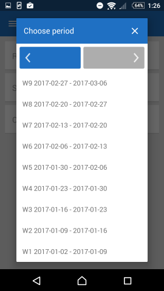

This will remove the validation warnings and the indicators will no longer be > 100%.

>>>>>  gd2md-html alert: inline image link here (to images/image201.png). Store image on your image server and adjust path/filename/extension if necessary.  (<a href="#">Back to top</a>)(<a href="#gdcalert202">Next alert</a>) >>>>> 

#### Video - Event Capture Demo - Part 3 of 4

[https://www.youtube.com/watch?v=QPm-ffywlr0](https://www.youtube.com/watch?v=QPm-ffywlr0)

##### Activity 3 - Offline entry of events

Please do this activity in [TRAININGLAND](https://live.academy.dhis2.org/tl1/dhis-web-commons/security/login.action).

*   To perform offline data entry, disconnect from the internet.

DHIS2 will prompt you indicating "You are offline, data will be stored locally".

>>>>>  gd2md-html alert: inline image link here (to images/image202.png). Store image on your image server and adjust path/filename/extension if necessary.  (<a href="#">Back to top</a>)(<a href="#gdcalert203">Next alert</a>) >>>>> 

    *   Try navigating around and selecting different organisation units at the facility level. You can also change between the Malaria case management or the SARA RCH program. Note that previous events will not be displayed in offline mode.

In the SARA RCH program:

    *   Register a new event with the following details.
    *   Click on "Save and go back" when you are finished.

>>>>>  gd2md-html alert: inline image link here (to images/image203.png). Store image on your image server and adjust path/filename/extension if necessary.  (<a href="#">Back to top</a>)(<a href="#gdcalert204">Next alert</a>) >>>>> 

    *   Re-connect  to the internet. A prompt will indicate that "There is data stored locally, please upload to server".
    *   Click on the Upload button to upload the data.

>>>>>  gd2md-html alert: inline image link here (to images/image204.png). Store image on your image server and adjust path/filename/extension if necessary.  (<a href="#">Back to top</a>)(<a href="#gdcalert205">Next alert</a>) >>>>> 

After the upload is complete, you will receive a prompt indicating that the "Upload to server was successful".

>>>>>  gd2md-html alert: inline image link here (to images/image205.png). Store image on your image server and adjust path/filename/extension if necessary.  (<a href="#">Back to top</a>)(<a href="#gdcalert206">Next alert</a>) >>>>> 

#### Video - Event Capture Demo - Part 4 of 4

[https://www.youtube.com/watch?v=Pi3iS3SsCLg](https://www.youtube.com/watch?v=Pi3iS3SsCLg)

### 5.3 - Tracker Programs 

#### Video - Tracker Programs - Tracker Programs Presentation

[https://www.youtube.com/watch?v=IEEfs06GRB0](https://www.youtube.com/watch?v=IEEfs06GRB0)

#### Video - Tracker Capture Demo - Part 1 of 5

[https://www.youtube.com/watch?v=_H0vrs-0ra4](https://www.youtube.com/watch?v=_H0vrs-0ra4)

##### Activity 1 - Introducing the tracker capture interface

Please do this activity in [TRAININGLAND](https://live.academy.dhis2.org/tl1/dhis-web-commons/security/login.action).

*   Navigate to tracker capture by selecting Apps -> Tracker Capture

>>>>>  gd2md-html alert: inline image link here (to images/image206.png). Store image on your image server and adjust path/filename/extension if necessary.  (<a href="#">Back to top</a>)(<a href="#gdcalert207">Next alert</a>) >>>>> 

*   For this example, select the "Cardinal Hospital Gateway PHC" organisation unit.

>>>>>  gd2md-html alert: inline image link here (to images/image207.png). Store image on your image server and adjust path/filename/extension if necessary.  (<a href="#">Back to top</a>)(<a href="#gdcalert208">Next alert</a>) >>>>> 

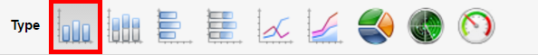

*   Select the ANC (Antenatal care) Example program from the dropdown.

>>>>>  gd2md-html alert: inline image link here (to images/image208.png). Store image on your image server and adjust path/filename/extension if necessary.  (<a href="#">Back to top</a>)(<a href="#gdcalert209">Next alert</a>) >>>>> 

This will display the entities (people in this case) associated with the program. 

*   Try the various filters to see how the work. From left to right, the filters are the following:
    *   Only those with an event today: Filters entities who have an event scheduled today.
    *   Any enrolment status: Filters all entities within the program regardless of their status.
    *   Only those with active enrolment: Filters all entities that are currently receiving services within the selected program.
    *   Only those with completed enrolment: Filters those entities identified as having completed the set of services offered by the selected program.
    *   Only those with cancelled enrolment: Filters those entities identified as having cancelled their enrolment within the selected program (they did not receive the complete set of services and dropped out of the program).

>>>>>  gd2md-html alert: inline image link here (to images/image209.png). Store image on your image server and adjust path/filename/extension if necessary.  (<a href="#">Back to top</a>)(<a href="#gdcalert210">Next alert</a>) >>>>> 

*   Download Tracked Entity List: This will download the tracked entities that are displayed in tracker capture in one of XML, JSON or CSV file formats directly to your computer. It is similar to downloading events in event capture.

>>>>>  gd2md-html alert: inline image link here (to images/image210.png). Store image on your image server and adjust path/filename/extension if necessary.  (<a href="#">Back to top</a>)(<a href="#gdcalert211">Next alert</a>) >>>>> 

*   Show/hide columns: This will add additional columns to the tracker capture front page. These columns in tracker capture represent the attributes that are associated with the program you have selected. This differs from event capture where you saw the data elements here (event programs do not have attributes associated with them). You can access this using the "Show/hide columns" button.

>>>>>  gd2md-html alert: inline image link here (to images/image211.png). Store image on your image server and adjust path/filename/extension if necessary.  (<a href="#">Back to top</a>)(<a href="#gdcalert212">Next alert</a>) >>>>> 

*   Change the filter back to "Any enrollment status" and try to search for a specific entity. You can try a simple search by typing the name “Janella Thomas” in the search box.

>>>>>  gd2md-html alert: inline image link here (to images/image212.png). Store image on your image server and adjust path/filename/extension if necessary.  (<a href="#">Back to top</a>)(<a href="#gdcalert213">Next alert</a>) >>>>> 

This will return the following entity

>>>>>  gd2md-html alert: inline image link here (to images/image213.png). Store image on your image server and adjust path/filename/extension if necessary.  (<a href="#">Back to top</a>)(<a href="#gdcalert214">Next alert</a>) >>>>> 

You can try the advanced search as well by clicking on the drop down arrow next to the search field.

*   You can use the following details to find the person:
    *   First Name: Sarah
    *   Last Name: Phi
    *   Age: 52
    *   Phone number: 0873637277

>>>>>  gd2md-html alert: inline image link here (to images/image214.png). Store image on your image server and adjust path/filename/extension if necessary.  (<a href="#">Back to top</a>)(<a href="#gdcalert215">Next alert</a>) >>>>> 

This will return the following entity.

>>>>>  gd2md-html alert: inline image link here (to images/image215.png). Store image on your image server and adjust path/filename/extension if necessary.  (<a href="#">Back to top</a>)(<a href="#gdcalert216">Next alert</a>) >>>>> 

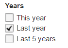

#### Video - Tracker Capture Demo - Part 2 of 5

[https://www.youtube.com/watch?v=-Q-_Nc4XThQ](https://www.youtube.com/watch?v=-Q-_Nc4XThQ)

##### Activity 2 - Register a new entity, review the dashboard and enter tracker data

Please do this activity in [TRAININGLAND](https://live.academy.dhis2.org/tl1/dhis-web-commons/security/login.action).

In the Tracker Capture app:

*   Select any organisation unit at the facility level and select the ANC Example as the program.

>>>>>  gd2md-html alert: inline image link here (to images/image216.png). Store image on your image server and adjust path/filename/extension if necessary.  (<a href="#">Back to top</a>)(<a href="#gdcalert217">Next alert</a>) >>>>> 

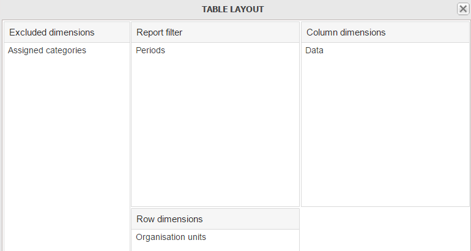

>>>>>  gd2md-html alert: inline image link here (to images/image217.png). Store image on your image server and adjust path/filename/extension if necessary.  (<a href="#">Back to top</a>)(<a href="#gdcalert218">Next alert</a>) >>>>> 

*   Select Register to proceed to the registration page.

>>>>>  gd2md-html alert: inline image link here (to images/image218.png). Store image on your image server and adjust path/filename/extension if necessary.  (<a href="#">Back to top</a>)(<a href="#gdcalert219">Next alert</a>) >>>>> 

*   In the Enrolment page, we should try and enter unique details. You can make up some details of a person in order to fit the attributes associated with the program.
*   To go through the ANC program, select an ANC registration date that is in the past. In the example here, January 1, 2016 has been selected. This will allow you go through all the ANC program stages within the ANC Example program.

>>>>>  gd2md-html alert: inline image link here (to images/image219.png). Store image on your image server and adjust path/filename/extension if necessary.  (<a href="#">Back to top</a>)(<a href="#gdcalert220">Next alert</a>) >>>>> 

*   When you have entered all of the details and changed the ANC registration date, click on "Save and continue." This will take you to what is referred to as the tracked entity dashboard.

Here have a look around the dashboard. The elements that were identified in the video demo are all present here. You can add/remove widgets, review the details of the person you have registered, review the timeline for data entry and enter data.

*   To add/remove widgets click on the gear icon then select show/hide widgets.

>>>>>  gd2md-html alert: inline image link here (to images/image220.png). Store image on your image server and adjust path/filename/extension if necessary.  (<a href="#">Back to top</a>)(<a href="#gdcalert221">Next alert</a>) >>>>> 

*   You can than select the widgets to add/remove by clicking on the check-boxes next to their name. Do not remove the Timeline Data Entry widget.

>>>>>  gd2md-html alert: inline image link here (to images/image221.png). Store image on your image server and adjust path/filename/extension if necessary.  (<a href="#">Back to top</a>)(<a href="#gdcalert222">Next alert</a>) >>>>> 

*   Enter some data for the first program stage. To start this process, scroll down to the Timeline Data Entry widget. The first program stage is already selected and the relevant data entry page open.

The following data can be used as a guideline:

>>>>>  gd2md-html alert: inline image link here (to images/image222.png). Store image on your image server and adjust path/filename/extension if necessary.  (<a href="#">Back to top</a>)(<a href="#gdcalert223">Next alert</a>) >>>>> 

*   When finished with the data entry, click on the orange "Complete" button to complete this event.
*   You will receive a prompt asking for your confirmation. Click on the "Complete" button to complete the first event.

>>>>>  gd2md-html alert: inline image link here (to images/image223.png). Store image on your image server and adjust path/filename/extension if necessary.  (<a href="#">Back to top</a>)(<a href="#gdcalert224">Next alert</a>) >>>>> 

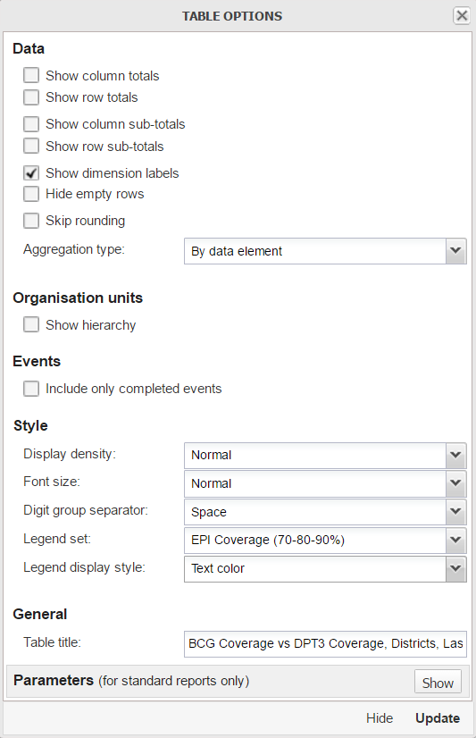

After doing this, the data entry for the first event will close, the event will change to grey and it will be marked as completed in the data entry timeline.

>>>>>  gd2md-html alert: inline image link here (to images/image224.png). Store image on your image server and adjust path/filename/extension if necessary.  (<a href="#">Back to top</a>)(<a href="#gdcalert225">Next alert</a>) >>>>> 

#### Video - Tracker Capture Demo - Part 3 of 5

[https://www.youtube.com/watch?v=SNg61JBzd2A](https://www.youtube.com/watch?v=SNg61JBzd2A)

##### Activity 3 - Entering data for new events and completing the program

Please do this activity in [TRAININGLAND](https://live.academy.dhis2.org/tl1/dhis-web-commons/security/login.action).

From the previous activity:

*   Select the 2nd event and continue to enter data related to the person that you have registered.

>>>>>  gd2md-html alert: inline image link here (to images/image225.png). Store image on your image server and adjust path/filename/extension if necessary.  (<a href="#">Back to top</a>)(<a href="#gdcalert226">Next alert</a>) >>>>> 

*   Complete the event and confirm the event is completed. Now you will be asked to schedule a follow-up visit for the mother. By default, the next visit is scheduled 60 days from the previous visit. We can use the default date here and click on "Save" to schedule the next visit.

>>>>>  gd2md-html alert: inline image link here (to images/image226.png). Store image on your image server and adjust path/filename/extension if necessary.  (<a href="#">Back to top</a>)(<a href="#gdcalert227">Next alert</a>) >>>>> 

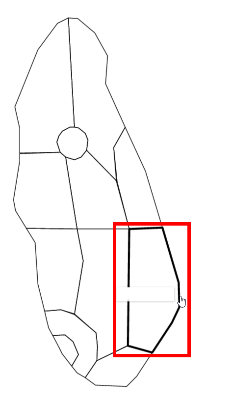

A new event will appear in the timeline according to the date in which you have scheduled the event.

>>>>>  gd2md-html alert: inline image link here (to images/image227.png). Store image on your image server and adjust path/filename/extension if necessary.  (<a href="#">Back to top</a>)(<a href="#gdcalert228">Next alert</a>) >>>>> 

*   Scroll back up to the top of the dashboard page and select "Complete". This blue complete button will complete the person’s enrollment in the entire program. In the context of this program, it is stating that the mother has received all of her ANC visits and will not receiving anymore ANC related to this pregnancy (in reality hopefully information on more than 2 visits would have been completed).

>>>>>  gd2md-html alert: inline image link here (to images/image228.png). Store image on your image server and adjust path/filename/extension if necessary.  (<a href="#">Back to top</a>)(<a href="#gdcalert229">Next alert</a>) >>>>> 

*   It will ask you to confirm if you want to complete the selected enrollment. Select "Yes" to continue.

>>>>>  gd2md-html alert: inline image link here (to images/image229.png). Store image on your image server and adjust path/filename/extension if necessary.  (<a href="#">Back to top</a>)(<a href="#gdcalert230">Next alert</a>) >>>>> 

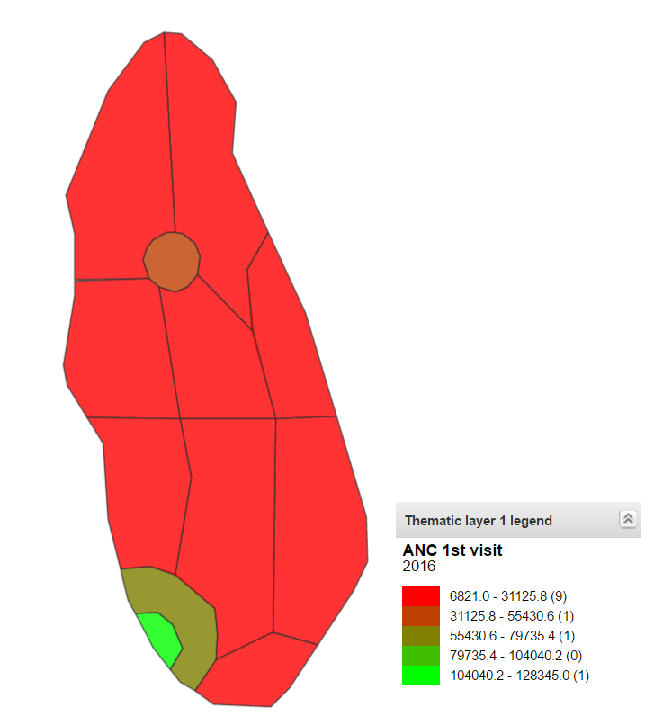

The dashboard for the person will close the enrollment. In order to enter additional details you will need to Reopen the person’s enrollment in the program.

>>>>>  gd2md-html alert: inline image link here (to images/image230.png). Store image on your image server and adjust path/filename/extension if necessary.  (<a href="#">Back to top</a>)(<a href="#gdcalert231">Next alert</a>) >>>>> 

If you navigate down to the data entry, you will see you can no longer edit the events.

>>>>>  gd2md-html alert: inline image link here (to images/image231.png). Store image on your image server and adjust path/filename/extension if necessary.  (<a href="#">Back to top</a>)(<a href="#gdcalert232">Next alert</a>) >>>>> 

*   Go back to the tracker capture front page by selecting the "Back" button on the tracker dashboard.

>>>>>  gd2md-html alert: inline image link here (to images/image232.png). Store image on your image server and adjust path/filename/extension if necessary.  (<a href="#">Back to top</a>)(<a href="#gdcalert233">Next alert</a>) >>>>> 

*   If you select the filter of "Only those who have completed enrollment" you will be able to see the person that you have just registered.

>>>>>  gd2md-html alert: inline image link here (to images/image233.png). Store image on your image server and adjust path/filename/extension if necessary.  (<a href="#">Back to top</a>)(<a href="#gdcalert234">Next alert</a>) >>>>> 

#### Video - Tracker Capture Demo - Part 4 of 5

[https://www.youtube.com/watch?v=2uex7X09Zvc](https://www.youtube.com/watch?v=2uex7X09Zvc)

##### Activity 4 - Register an entity without a program and enroll them

Please do this activity in [TRAININGLAND](https://live.academy.dhis2.org/tl1/dhis-web-commons/security/login.action).

From the tracker capture app:

*   Select any organisation unit at the facility level. De-select the program by clicking on the X button next to the program name.

>>>>>  gd2md-html alert: inline image link here (to images/image234.png). Store image on your image server and adjust path/filename/extension if necessary.  (<a href="#">Back to top</a>)(<a href="#gdcalert235">Next alert</a>) >>>>> 

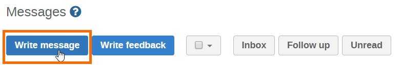

>>>>>  gd2md-html alert: inline image link here (to images/image235.png). Store image on your image server and adjust path/filename/extension if necessary.  (<a href="#">Back to top</a>)(<a href="#gdcalert236">Next alert</a>) >>>>> 

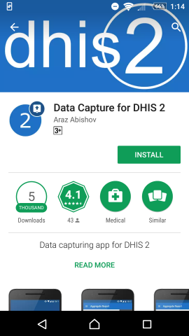

*   Click on Register to register the person without a program.

>>>>>  gd2md-html alert: inline image link here (to images/image236.png). Store image on your image server and adjust path/filename/extension if necessary.  (<a href="#">Back to top</a>)(<a href="#gdcalert237">Next alert</a>) >>>>> 

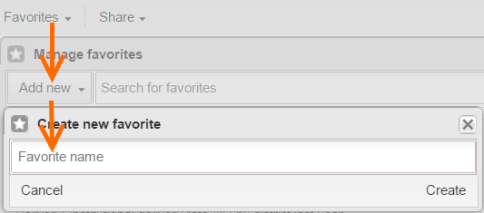

*   Enter the details of the person and select "Save and continue".

>>>>>  gd2md-html alert: inline image link here (to images/image237.png). Store image on your image server and adjust path/filename/extension if necessary.  (<a href="#">Back to top</a>)(<a href="#gdcalert238">Next alert</a>) >>>>> 

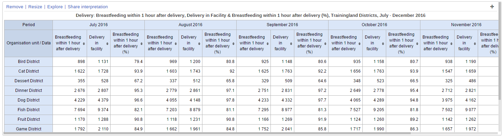

This will take you to the person's dashboard page. You must enroll them in a program now to proceed.

*   Select the ANC Example program.

>>>>>  gd2md-html alert: inline image link here (to images/image238.png). Store image on your image server and adjust path/filename/extension if necessary.  (<a href="#">Back to top</a>)(<a href="#gdcalert239">Next alert</a>) >>>>> 

*   In the enrollment tab, select "Add new".

>>>>>  gd2md-html alert: inline image link here (to images/image239.png). Store image on your image server and adjust path/filename/extension if necessary.  (<a href="#">Back to top</a>)(<a href="#gdcalert240">Next alert</a>) >>>>> 

*   Fill in their enrollment details and select "Enroll" to enroll them in the program.

>>>>>  gd2md-html alert: inline image link here (to images/image240.png). Store image on your image server and adjust path/filename/extension if necessary.  (<a href="#">Back to top</a>)(<a href="#gdcalert241">Next alert</a>) >>>>> 

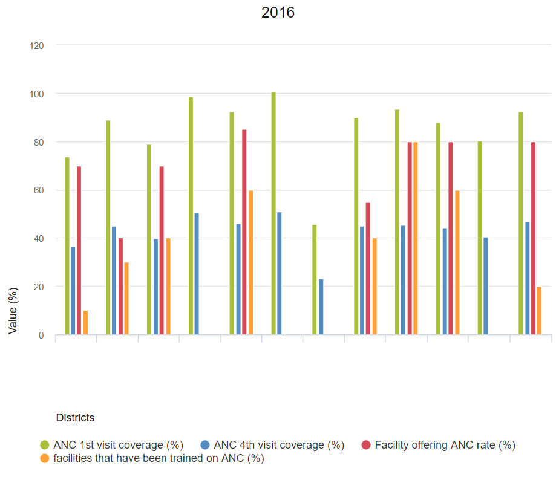

After you Enroll them, the dashboard will start to populate with the relevant items including their profile and associated program stages.

>>>>>  gd2md-html alert: inline image link here (to images/image241.png). Store image on your image server and adjust path/filename/extension if necessary.  (<a href="#">Back to top</a>)(<a href="#gdcalert242">Next alert</a>) >>>>> 

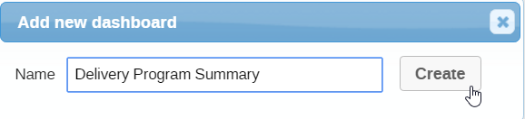

>>>>>  gd2md-html alert: inline image link here (to images/image242.png). Store image on your image server and adjust path/filename/extension if necessary.  (<a href="#">Back to top</a>)(<a href="#gdcalert243">Next alert</a>) >>>>> 

#### Video - Tracker Capture Demo - Part 5 of 5

[https://www.youtube.com/watch?v=v3fULNNc2bM](https://www.youtube.com/watch?v=v3fULNNc2bM)

### 5.4 - Event Data Analysis

#### Video - Event Data Analysis Demo - Part 1 of 4

[https://www.youtube.com/watch?v=3VZZK09acN0](https://www.youtube.com/watch?v=3VZZK09acN0)

##### Activity 1 - Introducing program indicators

In [TRAININGLAND](https://live.academy.dhis2.org/tl1/dhis-web-commons/security/login.action), create a pivot table including the program indicators:

*   # of facilities offering ANC
*   # of facilities offering family planning services

In the data tab select:

*   "Program Indicators" as the data type
*   "SARA RCH" as the Program
*   "# of facilities offering ANC" & "# of facilities offering family planning services" as the Program Indicators

>>>>>  gd2md-html alert: inline image link here (to images/image243.png). Store image on your image server and adjust path/filename/extension if necessary.  (<a href="#">Back to top</a>)(<a href="#gdcalert244">Next alert</a>) >>>>> 

In the period tab:

*   Select "Last year" as the period.

>>>>>  gd2md-html alert: inline image link here (to images/image244.png). Store image on your image server and adjust path/filename/extension if necessary.  (<a href="#">Back to top</a>)(<a href="#gdcalert245">Next alert</a>) >>>>> 

In the organisation units tab:

*   Select "District" as the organisation unit level.

>>>>>  gd2md-html alert: inline image link here (to images/image245.png). Store image on your image server and adjust path/filename/extension if necessary.  (<a href="#">Back to top</a>)(<a href="#gdcalert246">Next alert</a>) >>>>> 

*   Open the layout tab and:
    *   Move the organisation units down to the Row.
    *   Move the periods up to the filter.

>>>>>  gd2md-html alert: inline image link here (to images/image246.png). Store image on your image server and adjust path/filename/extension if necessary.  (<a href="#">Back to top</a>)(<a href="#gdcalert247">Next alert</a>) >>>>> 

*   Update to see the table.

Here you will see the output of indicators calculated using the responses within the SARA survey.

>>>>>  gd2md-html alert: inline image link here (to images/image247.png). Store image on your image server and adjust path/filename/extension if necessary.  (<a href="#">Back to top</a>)(<a href="#gdcalert248">Next alert</a>) >>>>> 

#### Video - Event Data Analysis Demo - Part 2 of 4

[https://www.youtube.com/watch?v=LE1yjF0Kyj4](https://www.youtube.com/watch?v=LE1yjF0Kyj4)

##### Activity 2 - Adding combined indicators

In [TRAININGLAND](https://live.academy.dhis2.org/tl1/dhis-web-commons/security/login.action), use the Pivot Table app to review combined indicators.

In the data tab:

*   Add the following to your previous selection:
    *   "Indicators" as the data type.
    *   "SARA" as the indicator group.
    *   "Facility offering ANC rate (%)" and "Facility offer Family Planning services rate (%)" as the Indicators.

The data tab should now include the selections from Activity 1 as well as the new indicators you have now selected.

>>>>>  gd2md-html alert: inline image link here (to images/image248.png). Store image on your image server and adjust path/filename/extension if necessary.  (<a href="#">Back to top</a>)(<a href="#gdcalert249">Next alert</a>) >>>>> 

*   Open the table options and:
    *   De-select "Show column totals" and "Show row totals".
    *   Select "Hide empty rows".

>>>>>  gd2md-html alert: inline image link here (to images/image249.png). Store image on your image server and adjust path/filename/extension if necessary.  (<a href="#">Back to top</a>)(<a href="#gdcalert250">Next alert</a>) >>>>> 

=

*   Select "Update" to see the table.

This table includes both the program indicators which were previously introduced as well as the combined indicators that can combine data from individual programs with other routine aggregated data.  

>>>>>  gd2md-html alert: inline image link here (to images/image250.png). Store image on your image server and adjust path/filename/extension if necessary.  (<a href="#">Back to top</a>)(<a href="#gdcalert251">Next alert</a>) >>>>> 

#### Video - Event Data Analysis Demo - Part 3 of 4

[https://www.youtube.com/watch?v=UBlL8E5rpZ0](https://www.youtube.com/watch?v=UBlL8E5rpZ0)

##### Activity 3 - Reviewing program data and aggregated data together

For this activity, use the Data Visualizer app in [TRAININGLAND](https://live.academy.dhis2.org/tl1/dhis-web-commons/security/login.action).

In the data tab:

*   Select Indicator as the data type.
*   First select "SARA" as the Indicator group and "Facility offering ANC rate (%)" as the Indicator.
*   Than select "ANC" as the Indicator group and "ANC 4th visit coverage (%)" as the Indicator.

>>>>>  gd2md-html alert: inline image link here (to images/image251.png). Store image on your image server and adjust path/filename/extension if necessary.  (<a href="#">Back to top</a>)(<a href="#gdcalert252">Next alert</a>) >>>>> 

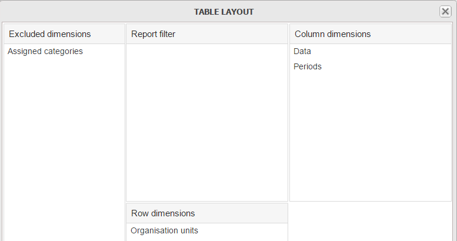

In the period tab:

*   Select "Last year" as the period.

>>>>>  gd2md-html alert: inline image link here (to images/image252.png). Store image on your image server and adjust path/filename/extension if necessary.  (<a href="#">Back to top</a>)(<a href="#gdcalert253">Next alert</a>) >>>>> 

In the organisation units tab:

*   Select "District" as the organisation unit level.

>>>>>  gd2md-html alert: inline image link here (to images/image253.png). Store image on your image server and adjust path/filename/extension if necessary.  (<a href="#">Back to top</a>)(<a href="#gdcalert254">Next alert</a>) >>>>> 

*   Open the layout tab and:
    *   Move the organisation units down to the Category; the Periods will automatically be moved to the filter

>>>>>  gd2md-html alert: inline image link here (to images/image254.png). Store image on your image server and adjust path/filename/extension if necessary.  (<a href="#">Back to top</a>)(<a href="#gdcalert255">Next alert</a>) >>>>> 

*   Click on "Update" to see the output.

In this chart, we have a combined indicator (Facility offering ANC rate (%)) which is taken data from the SARA survey and comparing it with an indicator calculated using aggregate data (ANC 4th visit coverage (%)). It is possible to perform analysis on data collected via aggregate, event or tracker processes using the concepts of program and combined indicators within the Pivot Table, Data Visualizer and GIS apps.

>>>>>  gd2md-html alert: inline image link here (to images/image255.png). Store image on your image server and adjust path/filename/extension if necessary.  (<a href="#">Back to top</a>)(<a href="#gdcalert256">Next alert</a>) >>>>> 

#### Video - Event Data Analysis Demo - Part 4 of 4

[https://www.youtube.com/watch?v=tJOpAjCAAK8](https://www.youtube.com/watch?v=tJOpAjCAAK8)

### Assignment - Event Data Analysis 

#### Note: these are graded assignments.

You are allowed 3 attempts for each of these assignments.

Instructions

You need to be logged in [TRAININGLAND](https://live.academy.dhis2.org/tl1/dhis-web-commons/security/login.action) to perform the following assignments.

Throughout these assignments, the participants will create a dashboard containing the following items.

The final dashboard can look something like this:

>>>>>  gd2md-html alert: inline image link here (to images/image256.png). Store image on your image server and adjust path/filename/extension if necessary.  (<a href="#">Back to top</a>)(<a href="#gdcalert257">Next alert</a>) >>>>> 

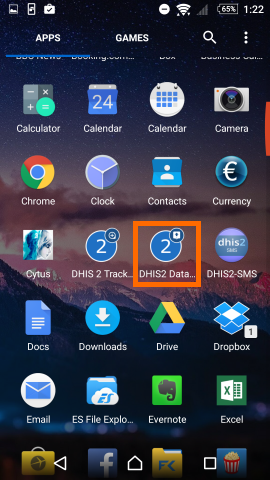

##### Assignment 5.4.1

Instructions

In [TRAININGLAND](https://live.academy.dhis2.org/tl1/dhis-web-commons/security/login.action) create a chart comparing ANC 1st visit coverage (%), ANC 4th visit coverage (%), Facility offering ANC rate (%), Facilities that have been trained on ANC (%) by district for 2016

*   Indicators
    *   ANC: ANC 1st visit coverage (%), ANC 4th visit coverage (%)
    *   SARA: Facility offering ANC rate (%), Facilities that have been trained on ANC (%)
*   Period: 2016
*   Organisation Units: Districts

>>>>>  gd2md-html alert: inline image link here (to images/image257.png). Store image on your image server and adjust path/filename/extension if necessary.  (<a href="#">Back to top</a>)(<a href="#gdcalert258">Next alert</a>) >>>>> 

Question of the assignment 5.4.1

What were the districts in which no survey was performed? (the districts in which both Facility offering ANC rate (%) and Facilities that have been trained on ANC (%) is 0). Select one or more

*   Dessert District
*   Dinner District
*   Fruit District
*   Staple District

##### Assignment 5.4.2

Instructions

In [TRAININGLAND](https://live.academy.dhis2.org/tl1/dhis-web-commons/security/login.action) create a pivot table containing ANC 1st visit coverage (%), ANC 4th visit coverage (%), Facility offering ANC rate (%), Facilities that have been trained on ANC (%) by district for 2016.

*   Indicators
    *   ANC: ANC 1st visit coverage (%), ANC 4th visit coverage (%)
    *   SARA: Facility offering ANC rate (%), Facilities that have been trained on ANC (%)
*   Period: 2016
*   Organisation Units: Districts

>>>>>  gd2md-html alert: inline image link here (to images/image258.png). Store image on your image server and adjust path/filename/extension if necessary.  (<a href="#">Back to top</a>)(<a href="#gdcalert259">Next alert</a>) >>>>> 

Question of the assignment 5.4.2

Which district has the lowest ANC 1st visit and 4th visit coverage respectively?

*   Cat District
*   Bird District
*   Fruit District
*   Fish District

##### Assignment 5.4.3

InStructions

In [TRAININGLAND](https://live.academy.dhis2.org/tl1/dhis-web-commons/security/login.action) create a chart comparing the SARA reporting rate by district for 2016:

*   Indicator
    *   SARA: SARA reporting rate (%)

>>>>>  gd2md-html alert: inline image link here (to images/image259.png). Store image on your image server and adjust path/filename/extension if necessary.  (<a href="#">Back to top</a>)(<a href="#gdcalert260">Next alert</a>) >>>>> 

Question of the assignment 5.4.3

Which district was fully surveyed? (100% reporting rate completeness in 2016)

*   Dog District
*   Staple District
*   Cat District
*   Vegetable District

### Session Quiz - Introduction to Tracker

#### NOTE: THIS IS A GRADED QUIZ.

You are allowed 3 attempts for this quiz.

There is 30 seconds of time between each attempt, so if you don't get it right, just breathe in, watch the videos once more and carefully read the question again.

##### Session Quiz - Introduction to Tracker

Tracker is meant to: (select one)

*   Replace existing electronic medical records (EMR)
*   Bridge the gap between the existing aggregated data and individual-level (tracker) or anonymous event based data
*   Only be used for tracking patients receiving health services

EXPLANATION

Tracker programs can be used outside of the health system, and are not meant to necessarily replace an EMR. This was discussed in the tracker intro presentation.

What is one of the key differences between event and tracker programs? (select one)

*   In tracker programs details are registered in order to follow an entity. Event programs do not include this registration
*   In event programs details are registered in order to follow an entity. Tracker programs do not include this registration
*   Event programs are more a more advanced version of collection individual data when compared to tracker programs

EXPLANATION

Tracker programs involve a key component of registration whereas event programs are anonymous in nature. This was discussed in the tracker intro presentation.

In event capture we can:

*   Add in validation rules/warnings
*   Add in indicators that calculate on-the-fly
*   Enter data offline

EXPLANATION

When we enter data in event/tracker capture, we must choose a predefined period such as weekly, monthly, etc. before entering data.

*   True
*   False

EXPLANATION

All of these functions work in event capture. This was demoed during the event capture session.

Which of the following statement(s) regarding tracker are NOT true: (select one or more)

*   Tracker and event data cannot be aggregated
*   Tracker and event data cannot be compared with aggregated data together
*   Tracker and event capture can be audited to see what changes have been made to the data

EXPLANATION

Tracker and event data can be aggregated and analyzed in the analysis apps. They can also be analyzed together with routine aggregate date. This was shown during the event analysis session.

An entity (person, etc.) can only be registered in one tracker program at a time

*   True
*   False

EXPLANATION

A person can be registered in multiple tracker programs if required.

In tracker capture, we can add in relationships, such as mother-child, brother-sister, etc.

*   True
*   False

EXPLANATION

Relationships between various entities can be added using tracker capture.

In event capture, if someone comes back to the clinic with malaria more than once I can easily find their record again in DHIS2

*   True
*   False

EXPLANATION

Event programs are isolated events. As there is no registration component, it would be very difficult to link these events as you would manually have to find the last time they received treatment.

We can analyze combined indicators that use any combination of data from event, tracker or routine aggregated data entry

*   True
*   False

EXPLANATION

We can use combined indicators to combine any of the data types used within DHIS2. This was shown during the event analysis session.

### Feedback - Introduction to Tracker

#### Feedback - Introduction to Tracker

Please take 2 or 3 minutes to complete this feedback survey once you are done with the Module 5. Your careful response will have a real impact on how courses like this are run. Thank you!

## 

## Module 6 - Summary Concepts

### 6.1 - DHIS2 Community 

#### Video - DHIS2 Community - DHIS2 Community and Development

[https://www.youtube.com/watch?v=r1hD2mtLx74](https://www.youtube.com/watch?v=r1hD2mtLx74)

##### Practice Zone

Knowledge check - DHIS2 Community

There is an active DHIS2 community in which:

Select one or more

*   Technical questions can be discussed
*   Technical assistance can be requested
*   Suggestions to add functionality can be made

### 6.2 - DHIS2 Level 1 Academies

#### Video - DHIS2 Academies Presentation

[https://www.youtube.com/watch?v=kLp09Kw-jJM](https://www.youtube.com/watch?v=kLp09Kw-jJM)

### Feedback - Summary Concepts

#### Feedback - Summary Concepts

Please take 2 or 3 minutes to complete this feedback survey once you are done with the Module 6. Your careful response will have a real impact on how courses like this are run. Thank you! 

[embeded survey]
