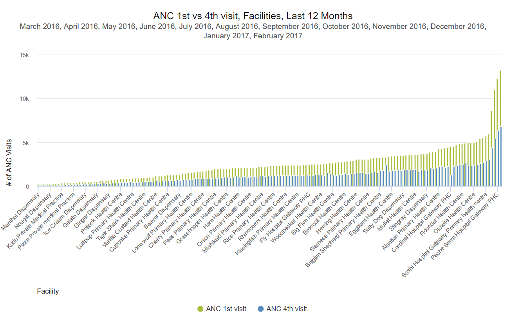

# Module 1 - Overview & Getting Started

## 1.0 Pre-Course Survey

Tell the DHIS2 Academy team more about yourself by filling out our
pre-course survey below. The information you provide will help us to
make useful updates to this course and create more effective training
material in the future.

[Pre-course survey](https://www.google.com/url?q=https://docs.google.com/forms/d/e/1FAIpQLSd1dbVONTc2NZTAIif3mtCjcONcjo8alHbs-knCD4_rhINC4A/viewform?usp%3Dsf_link&sa=D&ust=1605599915693000&usg=AOvVaw01azt-vdVTOOPmPiWnCpfL)

## 1.1 About the course

### Welcome to DHIS2 Fundamentals

We are excited you have joined us for this course on DHIS2
Fundamentals!

Here in module 1, you’ll find an overview of the course, get
familiarized with the Open edX platform, and find the most important
information to get started.

#### What is this course about

Throughout this course, you will learn the essentials of DHIS2, an
open-source information system that facilitates decision making within a
wide variety of sectors thanks to its wide range of data capture,
review, analysis, and sharing capabilities. In this course, we will be
using public health for all of our examples, but note that DHIS2 is also
used in other sectors such as environment and education.

#### What will I learn

After completing this course, you’ll be able to:

- Describe how DHIS2 can be used to aggregate, analyze, review, and
    share data from health programs.
- Describe the key concepts, building blocks, and terminology of
    DHIS2.  
- Create pivot tables, charts, and maps to visualize data within
    DHIS2.
- Identify the initial steps to customize DHIS2 for aggregate data to
    meet the needs of a given country or organization.
- Differentiate the mechanisms used for data capture within DHIS2
    along with their main features

#### What are the course prerequisites

There are no specific prerequisites to do this course. However, having
basic knowledge or prior experience using data analysis tools (such as
Microsoft Excel) is an advantage.

#### How is the course structured

DHIS2 Fundamentals is comprised of 6 modules:

- Module 1: Overview and Getting Started (45 min)
- Module 2:  Introduction to DHIS2 (1 hr)
- Module 3:  Introductions to DHIS2 Analysis (8 hr)
- Module 4: Introduction to DHIS2 Customization (6 hr)
- Module 5: Introduction to Tracker (3 hr)
- Module 6: Summary Concepts (20 min)

#### How will I learn

In each module, you will find video presentations, demonstrations,
knowledge check questions, and step-by-step activities to be completed
in Trainingland and Customization (the training environments you will
use along the course). You’ll find more information about Trainingland
and Customization in the “Practical information” section.

Each topic is presented in the form of  videos of approximately 5 to 15
minutes in length. Watch them at your leisure (or download them to save
them for later) participate in the discussions, and see how much you’ve
learned by taking the assignments afterward.

After watching the videos, you’ll have the chance to practice what has
been demonstrated. By going through these activities, you will improve
your understanding of the fundamentals of DHIS2. These practice
activities are not graded; they are meant to give you a chance to
practice the concepts that have been shown through self-paced exercises.
 The more activities you do, the more you will get out of the course.

#### How long will it take to complete the course

We estimate the course will take approximately  20 hours to complete.
This includes the review of all videos, performing related activities
and completing all graded assignments. As this is a self-paced course,
note that this may vary slightly for each learner.

#### How do I pass the course

The course consists of 3 types of assessments that contribute to your
final grade:

- **Assignments**: are based on a step by step interactions you will need
    to perform within the training environment, followed by
    multiple-choice and /or multiple response questions. You will find
    these assignments in modules 3 and 5, and they contribute 16% to
    your final grade.
- **Customization Lab**: in module 4, you'll find 3 sets of activities
    where you'll be prompted to create the basic customization of a
    DHIS2 instance. These sets of assignments assess crucial knowledge
    and skills and they are graded as pass/fail, which means that if you
    don't successfully complete all the tasks, you will not get any
    partial credit. Customization Lab counts 24% of your final grade.
- **Quizzes**: you will find along the course different quizzes composed
    of multiple-choice, multiple-response, and/or true or false
    questions that will assess your comprehension of the main concepts
    behind DHIS2. The quizzes contribute 60% to your final grade.

You’ll have 3 attempts to complete each assignment or quiz. You’ll find
specific Instructions to complete the Customization Lab in module 4.

 In order to pass the course, an **overall grade of 80% is required**.

Successfully completing this course will enable you to participate in
the Level 1 - Analytics Tools and Level 1 - Design and Customization
Academies. You will learn more about Level 1 Academies at the end of the
course.

#### What is the course timeline

This course is self-paced, which means there are no set deadlines and
you can go through it at as fast or as slow as you prefer.  This course
does not currently have a set end date. In the event that an end date is
scheduled, you will be notified with enough time to finish your work in
the course.

#### How do I get support

The easiest way to ask for assistance is to make a post on the
discussion board. Click on the Discussion tab and select “Add a Post” in
order to add a new post. This board will be monitored by the course
instructors and other participants may also be able to assist in your
query.

For technical support or when you have issues navigating the platform,
you can contact the course moderators for help by email at
**fundamentals-support@dhis2.org.**

#### What should I do now

If this is your first time using Open edX, go to the next unit to learn
how to navigate the platform. If you are already familiar with using
this platform, go to the unit “Practical Information ” by selecting the
menu on the left-hand side of the screen.

## 1.2 Using the Open edX Platform

#### Video - System Login and Navigation

[https://www.youtube.com/watch?v=zn6FwhFa6DE](https://www.google.com/url?q=https://www.youtube.com/watch?v%3Dzn6FwhFa6DE&sa=D&ust=1605599915699000&usg=AOvVaw0k5kCq4dxW1lGvCFZrM3s0)

#### Navigating to the next unit

Let's go through some practical info then. To display the "Practical
Information", you need to either click the right arrow at the bottom or
at the top of this page. The screenshot below shows you where to click.
If you want to go straight to DHIS2 Trainingland instance shown in the
video above, use the sidebar, the arrow icon shown below, or this link
to navigate to [Module 2 - Introduction to DHIS2 > 2.2 - Introduction
to Trainingland > Your account on DHIS2
Trainingland](https://www.google.com/url?q=https://academy.dhis2.org/courses/HISP/DHIS2_Level1/2015_Q1/courseware/44a5267a3c2f40168e4f93e6217ad519/dab2d99d33df4f488d9a51e73e4440b7/&sa=D&ust=1605599915700000&usg=AOvVaw2rGUWCRrfigiCkU0HHTSpX)

## 1.3 Practical Information

### System Requirements

To access the course, you will need a device with an internet
connection. You will also need speakers or headphones since all of the
videos are narrated. To properly use the DHIS2 instances in this course
(Trainingland and Customization),  we recommend the use of either
Firefox or Chrome web browser. We do not recommend Internet Explorer.

### Supplementary Training Environment - Trainingland and Customization

In addition to the content you will find in Open edX, you will also be
interacting with 2 DHIS2 systems that have been created for training
purposes. In these DHIS2 systems, you will be performing all the
activities and assignments for this course.

The systems you will be working with are:

1. Trainingland

2. Customization

To start working with them, you will be asked to register for accounts
in sections 2.2 and 4.1 respectively. Simply click the “Request account”
button in those sections and follow the on-screen **Instructions** to
register your accounts.

### Discussion forums

The [discussion
forums](https://www.google.com/url?q=http://academy.dhis2.org/courses/HISP/DHIS2_Level1/2015_Q1/discussion/forum&sa=D&ust=1605599915702000&usg=AOvVaw0b8ickFkyv5FRu76sd4XsZ) will
give you an opportunity to communicate and discuss ideas with the course
staff and your fellow students. We encourage you to participate in these
forums to learn from your peers and discuss course material.

#### General Forum Guidelines

You are invited to use the discussion spaces throughout the course to
connect with your peers and share your questions and ideas.

The use of the discussion forums is an **optional activity** and is not
graded.

Tips for using the discussion forums:

- **Be respectful**. Share your opinions and ideas and respect the
    opinions of others
- **Help each other!** Reply to your peers’ questions and comments.
- Actively **up-vote** other posts if you think they are relevant, and
    other people will up-vote yours! The more upvotes your post has,
    the more likely it is to be seen.
- Choose the appropriate **category** when posting; this will keep the
    discussion forum orderly.
- Use a **descriptive and specific** title for your post. This will
    attract the attention of other learners with the same issue.
- See if someone **has already asked your question** before creating a new
    post.
- Use
    “[netiquette](https://www.google.com/url?q=https://elearningindustry.com/10-netiquette-tips-online-discussions&sa=D&ust=1605599915703000&usg=AOvVaw3jfDhGW_TzYJ0gj3ObZtFT)”
    or common writing practices for online communication. For example:

- Avoid TYPING IN ALL CAPS. Some people read this as shouting, even if
    that is not what you mean to convey.
- Avoid unnecessary symbols, abbreviated words, texting shorthand, and
    replacing words with numbers (e.g. Pls don’t rplce wrds w/#s).

PRO-TIP

- If you find a post particularly interesting and want to return to it
    in the future, you can **follow** it. To do that, view the post you want
    to follow and select the “Follow” icon.
- Each post that you follow appears with a “Following” indicator in
    the list of posts. To list only the posts that you are following,
    regardless of the discussion topic they apply to, select the
    drop-down “Discussion” list and select “Posts I’m Following”.

To make this an enjoyable, positive, and constructive experience for
all, participants are required to be respectful. Abusive and
disrespectful communications will be removed for the comfort of all
participants. You can help by reporting misuse. You can flag any post,
response, or comment for a discussion moderator to review: view the
contribution, select the “More” icon, and then select “Report.”

## 1.4 Introductions

### Know your instructor

Hi everyone! Welcome to the DHIS2 online fundamentals course. This
course covers some of the most fundamental concepts that form the core
of the DHIS2 platform. These concepts have remained constant since
DHIS2’s initial development and are therefore still relevant and being
actively utilized within the system. By reviewing and understanding the
foundation we present within this course, you will be well on your way
to start understanding advanced and updated concepts associated with
DHIS2. I hope you will find the course content, activities and training
environments engaging. I look forward to interacting with you all
throughout the course and within the broader DHIS2 community.

A little bit about me. I work as an Implementation Advisor and Training
Content Developer for the University of Oslo. My education background
includes:

- Masters of Public Health, University of Queensland, Australia
- Masters of Health Informatics, University of Waterloo, Canada
- Graduate Certificate of Adult Education, University of Toronto,
    Canada

I have been supporting the development of in-person and online academy
material across many of the DHIS2 core areas, including both
introductory and advanced training on various topics. I currently
support DHIS2 in-country implementations within Indonesia, Nigeria,
Solomon Islands and Vanuatu and have previously supported Myanmar and
Lao. In addition, I support the review and implementation of global
public health standards through the development of the digital data
packages.

Previously, I worked for WHO as a health information systems officer
based in the Solomon Islands.

I sincerely hope you will find me up to your standard in delivering this
course content. Good luck with the course!

-- Shurajit Dutta

### Now it’s your turn

To make the most of your learning experience during the course, we
encourage you to introduce yourself in the discussion forum.

Forum

-----

# Module 2 - Introduction to DHIS2 (1 h)

## 2.0 Overview of the module (10 min)

### What is in this module

What is DHIS2 and where does it come from? What are its **main features**?
What are its **3 building blocks**?

In this module, you will learn how DHIS2, as an open-source management
information platform, is used in countries around the world for
**reporting, analysis, and dissemination of data**.

You will also start to get familiar with the main features of DHIS2 and
its 3 building blocks.

In section 2.2, you will be prompted to **create an account on
Trainingland**, the training environment that we will be using along the
course, which allows you to navigate DHIS2 and get hands-on experience
with it.

After each video, you'll find some **non-graded questions** that will help
you check your knowledge.

At the end of the module, you will find the **first graded quiz** of the
course, which counts for 5% of your final score.

We estimate that you will take about 1 hour to view all the videos and
complete all the learning activities, including the graded assignment.

## 2.1 Introduction to DHIS2/History (10 min)

The **D**istrict **H**ealth **I**nformation **S**oftware - **DHIS2** - it's not only an
open-source platform for reporting, analysis, and dissemination of data
but an initiative supported by a **global network** called the **H**ealth
**I**nformation **S**ystem **P**rogramme or **HISP** and a growing community of users
from more than 60 countries globally.

In this video, you will learn about DHIS2 history,  the network of
action, its main features, and an overview of how it can be used in the
public health context.

### Video - Introduction to DHIS2/History

[https://www.youtube.com/watch?v=6Qbxbny2iKg](https://www.google.com/url?q=https://www.youtube.com/watch?v%3D6Qbxbny2iKg&sa=D&ust=1605599915708000&usg=AOvVaw0t-r5ojAGTzzQq77SLNr4a)

#### Knowledge check  (not graded) - Introduction to DHIS2/History

1. DHIS2 can be used as a ‘data warehouse’ to store data from multiple
    data sources in one location

- **True**
- False

EXPLANATION

DHIS2 can combine data from multiple data sources. This includes through
routine data that is directly collected within the system you are
working as well as supplementary data from other sources such as
surveys.

2. The HISP network works collaboratively on advancing the features
    which DHIS2 supports

- **True**
- False

EXPLANATION

The HISP network is a world-wide collaboration that supports the
development of the DHIS2 project. Collaboration between the nodes is a
key area of interest to ensure that DHIS2 continues to meet local needs
as defined by its users.

## 2.2 Introduction to Trainingland (10 min)

### Video - Introduction to Trainingland

How are you going to learn to use DHIS2? We believe that the best
approach to learn a new tool is by using it through hands-on activities
in a safe environment.

That is why we created Trainingland, a DHIS2 training environment that
represents a fictional country where you will find all you need to work
with DHIS2 features and become familiar with the capabilities we will
discuss in this course. Watch the following video to get an overview of
Trainingland, and the next steps you need to take to start practicing
with it.

[https://www.youtube.com/watch?v=Y98Zh_cGF7k](https://www.google.com/url?q=https://www.youtube.com/watch?v%3DY98Zh_cGF7k&sa=D&ust=1605599915709000&usg=AOvVaw1R00haMyFtFLz0PSm5EBwo)

#### Knowledge check (not graded) - Introduction to Trainingland

1. Trainingland has been created to demonstrate: (select one or more)

- **Data collection forms**
- **Data Analysis**
- **Indicators**

EXPLANATION

Trainingland is part of the training environment that has been created
in order for users to learn how DHIS2 is structured and how information
can be collected and reviewed. It uses modeled data that allows users to
learn some of the fundamentals of DHIS2 functionality.

### Create your account in TRAININGLAND

Select the button below to request an account on the DHIS2 Trainingland.

You will receive an invitation by email with Instructions on how to
complete the registration in DHIS2.

Request account button

Note: the email address you use with OpenEDX will be sent to the DHIS2
database to create an account.

## 2.3 The 1000 Most Vulnerable Days’ Use Case (7 min)

### Video - The 1000 MVD's Use Case

To better understand how DHIS2 can help us to collect, aggregate, and
analyze data in a public health context, we are going to use the example
of the 1000 **M**ost **V**ulnerable **D**ays (MVD’s) use case, which is aimed at
preventing childhood deaths by making informed decisions.

This use case will allow you to see how using DHIS2 will help you to
**track different health programs** for mothers and children, the **health
services** they receive, and see how the collected data inform **their
progress**.

In this video, you will start to get familiar with this use case, which
we'll use throughout the course.

[https://www.youtube.com/watch?v=4Z7J4MhfMQ4](https://www.google.com/url?q=https://www.youtube.com/watch?v%3D4Z7J4MhfMQ4&sa=D&ust=1605599915711000&usg=AOvVaw1y4_ypzTvEnWA09xP7DdEt)

#### Knowledge check (not graded) - The 1000 MVD's Use Case

1. The 1000 most vulnerable days use case covers:

- From the time the child is born up until 3 years of age
- **From the time the child is conceived up until 2 years of age -
    correct**
- From the time a mother receives antenatal care and completes her
    post-natal care

EXPLANATION

The 1000 most vulnerable days covers both infant and mother from the
time from when the child was conceived to the child’s 2nd birthday. This
is a critical time for child development; the right nutrition for the
mother and for the child during this time can have a profound impact on
the child's growth and development and reduce disease risk, as well as
protect the mother's health. Elements linked to this use case are used
throughout this academy.

2. This use case is used to help us define: (select one or more)

- **The services that are provided to the mother and child**
- **The data we collect in relation to those services**
- **The outputs we create in relation to those services**

EXPLANATION

All 3 of these items are used to translate elements of the use-case (in
this case, a health-related use case) over to DHIS2. It is important to
identify what the key inputs and outputs are; this is often best
accomplished by understanding the use-case in detail.

## 2.4 Overview of DHIS2 (15 min)

### Video - Overview of DHIS2

In this overview, you will begin to familiarize yourself with some of
the key elements of DHIS2 that we will delve into throughout the course.

First, you will see options that allow you to **customize** your experience
with the platform.

Through examples, you will see the **different types of data** (numerical,
anonymous, or individual data) that can be collected, and the **reports**
that can be obtained.

Lastly, you will begin to hear about the 3 applications that we will see
in detail later on: **Pivot Tables** (used to create dynamic tables), **Data
Visualizer** (used to make charts) and **GIS** (use to make maps) based on the
data stored in the platform.

Note: GIS is currently called Maps starting with DHIS2 version 2.29

[https://www.youtube.com/watch?v=kr_oHSAY5ks](https://www.google.com/url?q=https://www.youtube.com/watch?v%3Dkr_oHSAY5ks&sa=D&ust=1605599915714000&usg=AOvVaw33wJx7ViTQVHGRHT0nARGf)

#### Knowledge check (not graded) - Overview of DHIS2

1. We can collect different types of data directly within DHIS2 (for
    example, aggregate data or anonymous individual-level data)

- **True**
- False

EXPLANATION

DHIS2 can collect different types of data directly within the
application. This includes aggregate data, event data (anonymous,
individual level data) and “Tracker” data (identifiable, individual
level data).

2. We can configure data quality checks by creating user-defined
    validation rules which check the data that is entered

- **True**
- False

EXPLANATION

Mathematical rules, referred to as validation rules, can be defined by a
user in order to check the data that is being entered. This is one of
electronic methods checking data quality in DHIS2 and will be discussed
further in other sessions.

3. We can define the variables that we are collecting directly through
    the DHIS2 user-interface

- **True**
- False

EXPLANATION

As mentioned in the demo, it is a key principle of DHIS2 to allow the
user to customize what they are collecting directly through the
user-interface.

4. The outputs we create can not be given additional
    descriptions/interpretations directly within DHIS2

- True
- **False**

EXPLANATION

We can provide all of our outputs with additional descriptions and
discuss interpretations directly within DHIS2. This allows us to give
the item more context for when other users are reviewing the information
and will be discussed further in the analysis sessions.

5. The analyses/outputs that we create can not be shared with other
    users directly within DHIS2

- True
- **False**

EXPLANATION

The analyses/outputs that are created can be shared with other users
directly within DHIS2. This will be discussed more in later sessions.

## 2.5 DHIS2 Building Blocks (7 min)

### Video - DHIS2 Building Blocks

All data that is recorded in DHIS2 has at least **3 dimensions** that
describe it: _where_, which represents the geographic context and is
called the "**organisational unit**"; _what_, that is, what is the raw data
that we are collecting and is called "**data element**"; and _when_, that is,
the "**period**" in which the data is collected.

These are the building blocks of the DHIS2 data model, and are key to
understanding how the platform works.

[https://www.youtube.com/watch?v=PaXLxIt7x5U](https://www.google.com/url?q=https://www.youtube.com/watch?v%3DPaXLxIt7x5U&sa=D&ust=1605599915717000&usg=AOvVaw02vW_xT6MT_LLaoWoB61EL)

## Session Quiz - DHIS2 Building Blocks

### Session Quiz - DHIS2 Building Blocks

This is a **graded quiz** and it is worth **5%** of your final grade.

You have  **3 attempts** to pass this quiz.

Select the "**check**" button to submit your answers.

If you want to save your current response without submitting it for
grading yet, select the "save" button. This allows you to come back
later and resume the attempt.

#### Quiz - DHIS2 Building Blocks

1. Which of the following are the core dimensions of the Data Model in
    DHIS2? (Select one or more)

- **Organisation unit (Where)**
- **Data element (What)**
- **Period (When)**
- None of the above

EXPLANATION

As highlighted in the core concepts presentation, there are 3 core
dimensions in DHIS2.

Organisation units refers to the geographical location or where aspect
Data Elements refers to what we are collecting Periods refers to when we
are collecting that information

2. Organisation Units represent (select one):

- **The geographical location of the data**
- Calculated data values
- Health program projects

EXPLANATION

In the core concepts presentation, organisation units are referred to as
the geographical location of the data

3. In DHIS2, data elements and indicators represent the same concept.

- True
- **False**

EXPLANATION

In the building blocks presentation, it is noted that data elements and
indicators represent different concepts. Data elements are the raw data,
while indicators are calculated values.

4. Which of the following are data elements?  (select one or more)

- **Number of maternal deaths**
- Maternal Mortality Ratio (per 100,000)
- **Number of positive malaria cases**
- Annual Malaria Parasite Incidence

EXPLANATION

The data elements are the raw data values that we collect. Calculated
values such as ratios and incidences are considered indicators.

## 2.6 Module Readings (10 min)

Additional Readings (not graded):

[Health Information Systems Programme
(HISP)](https://www.google.com/url?q=https://www.hisp.org/&sa=D&ust=1605599915720000&usg=AOvVaw2Rsk-hNRa0HkR62HDWKlf8)

[The 100 Core Health Indicators
(WHO)](https://www.google.com/url?q=http://www.who.int/healthinfo/indicators/2015/en/&sa=D&ust=1605599915720000&usg=AOvVaw1YVYRt34DHy1xmIkGYboxc)

## Feedback - Introduction to DHIS2

### Feedback - Introduction to DHIS2

Please take 2 or 3 minutes to complete this feedback survey once you are
done with Module 2. Your careful response will have a real impact on how
courses like this are run. Thank you!

Link to survey

-----

# Module 3 - Introduction to DHIS2 Analysis (8 hr)

## 3.0 Overview of the module (10 min)

### What is in this module

In the previous module, you learned that DHIS2 is used in public health
for the reporting, analysis, and dissemination of data.

In this module, we’ll delve into the **analysis** function, understanding
the **mechanics** of how to use the following DHIS2 applications: **Pivot
table, Data visualizer, GIS** (now named Maps) and **Reports**.

By watching demonstrations, you’ll see how it’s possible to **combine
tables, charts and maps** to create **integrated analysis**, how to create and
share **dashboards**, how to **interact** with other DHIS2 members through the
platform, and what are the main DHIS2 roles within a system.

After the demonstration videos, you will be prompted to replicate some
of the steps on your own in Trainingland. This will help you become
familiarized with the different apps and the navigation options of each
one of them.

At the end of each subsection, you will find the **graded activities** of
the module: in subsections **3.2, 3.3,** and **3.4**, you will find **assignments**
and **quizzes**, while in subsections **3.5** and **3.6** you will find
only **quizzes**. All graded activities of this module together are worth
**37%**  of your final grade.

We estimate that you will take about 8 -10 hours to view all the videos
and complete all the learning activities, including the graded ones.

## 3.1 Data Analysis Overview Intro  (1,5 min)

Watch the following video to see what contents we will be covering in
this module.

### Video - Data Analysis Overview Intro

[https://www.youtube.com/watch?v=lPPA2Si185I](https://www.google.com/url?q=https://www.youtube.com/watch?v%3DlPPA2Si185I&sa=D&ust=1605599915723000&usg=AOvVaw2c8loRXKUixU84YtirYU9j)

## 3.2 Pivot Tables (140 min)

### Video - Pivot Table Demo - Part 1 of 7 (17 min)

Let's start these sessions identifying how the **DHIS2 building
blocks** that you have learned about in module 2 (**data**, **periods**, and
**organisation units**) are selected to create a **pivot table**.

You'll start to familiarize yourself with the table **layout** and **options**,
which are variables that will directly affect the outputs you create.

[https://www.youtube.com/watch?v=PFUH4IS9ZSE](https://www.google.com/url?q=https://www.youtube.com/watch?v%3DPFUH4IS9ZSE&sa=D&ust=1605599915724000&usg=AOvVaw1mc1ciO1H3UoPccB9vWjA1)

#### Activity 1 - Pivot Table interface, selecting data dimensions and creating a simple pivot table

In [TRAININGLAND](https://www.google.com/url?q=https://live.academy.dhis2.org/tl1/dhis-web-commons/security/login.action&sa=D&ust=1605599915724000&usg=AOvVaw2omjjf7tWUmHS5UGqAs6a6), please try to create the following pivot table that follows the example
in the video:

In the data tab select:

- “Data Elements” as the data type
- “Delivery” as the Data Element Group
- “Death maternal” as the Data Element

In the period tab select:

- “Last 4 quarters” as the period. (Note: The last 4 quarters that are
    displayed may be different than what is shown in the video.)

In the organisation unit tab select:

- "Trainingland" as the organisation unit

>

Open the options tab and select:

- “Show row totals”

- Click on Update to see your output.

### Video - Pivot Table Demo - Part 2 of 7 (10 min)

In the following video, you will see different ways of **how to select
organisation unit levels** that you want to retrieve data from.

Then, you will see **how to adjust the table layout and options** to make
the pivot table more clear and easy to understand for everyone.

[https://www.youtube.com/watch?v=YYb-5uj-EXQ](https://www.google.com/url?q=https://www.youtube.com/watch?v%3DYYb-5uj-EXQ&sa=D&ust=1605599915726000&usg=AOvVaw1T-gDbxu7bCmuN_kJP5MzJ)

#### Activity 2 - Selecting organisation unit levels and adjusting the table options

In [TRAININGLAND](https://www.google.com/url?q=https://live.academy.dhis2.org/tl1/dhis-web-commons/security/login.action&sa=D&ust=1605599915727000&usg=AOvVaw1ZUb2cH38sKm1loHuorMKv), add in the districts with Maternal deaths to your table. Note that these organisation units may be different than what is seen in the video.

In the organisation units tab:

- Select “District” as the organisation unit level.

- Open the layout tab and:

- Move the organisation units down to the row
- Move the periods over to the column

- Open the options tab and select "Hide empty rows".

- Click on “Update” to see your table.

### Video - Pivot Table Demo - Part 3 of 7 (10 min)

In this third part of the pivot table demo, you will see additional
methods to select organisation units, in case you need to dig a little
bit deeper into the data. You will also see how to sort the data, and
how to save your table.

[https://www.youtube.com/watch?v=UP5tbM2Sb3M](https://www.google.com/url?q=https://www.youtube.com/watch?v%3DUP5tbM2Sb3M&sa=D&ust=1605599915729000&usg=AOvVaw1ar8isYJNy8fRBWYxRICmo)

#### Activity 3 - Saving the table as a favorite

In
[TRAININGLAND](https://www.google.com/url?q=https://live.academy.dhis2.org/tl1/dhis-web-commons/security/login.action&sa=D&ust=1605599915729000&usg=AOvVaw0qXo9qwgqfzCGKQqh0PBB0),
add in the facilities and save the table as a favorite.

In the organisation units tab:

- Select “Animal Region” as the organisation unit
- Select “Facility” as the level

- Update the table to see your output.

- Save the table as a favorite using: username_health program
    name_what, what, when.

Note that in a real life setting, there may be no need to use your
username when saving your favorites. In this course this is used however
to identify the favorites that you have created.

### Video - Pivot Table Demo - Part 4 of 7 (10 min)

Let’s see how to use **indicators**, instead of data elements, to create a
pivot table. Pay attention to the **differences** between these two types of
data. This will help you to correctly select the inputs you require when
you create your own pivot tables. You will also see how to apply **legend
sets** and add **table titles**.

[https://www.youtube.com/watch?v=qCJMoykIzbg](https://www.google.com/url?q=https://www.youtube.com/watch?v%3DqCJMoykIzbg&sa=D&ust=1605599915731000&usg=AOvVaw0QvNI4uEqDPvO1U50YJmTD)

#### Activity 4 - Reviewing indicators and applying legend sets and table titles

In [TRAININGLAND](https://www.google.com/url?q=https://live.academy.dhis2.org/tl1/dhis-web-commons/security/login.action&sa=D&ust=1605599915731000&usg=AOvVaw3CTKROjTNAEojJdyxVmvgA), create a table containing two indicators and apply a legend-set to the table.

In the data tab select:

- "Indicators" as the data type.
- "Immunization - coverages" as the Indicator Group.
- "BCG Coverage" & "DPT3 Coverage" as the Indicators.

In the period tab:

- Select “Last 6 quarters” as the period. The last 6 months that are
    displayed may be different than what is shown in the video.

In the organisations unit tab:

- Change the selection mode to "Select levels".
- Select "District" as the organisation unit level.

- Alter the layout to replicate what is seen on the video. You can
    update the table if you’d like, there are several more steps in this
    activity.

- Open the table options and change the following:

- Remove all of the totals from the table.
- Apply the EPI Coverage legend set. You can try both "Text color" and
    "Background color" as the Legend display style to view the
    difference.
- Provide the table with a title.

- Click on Update when all of the changes are made.

The table should reflect the format of what is seen in the video.

### Video - Pivot Table Demo - Part 5 of 7 (12 min)

In the next video, you will see how you can disaggregate your data
within a pivot table .

[https://www.youtube.com/watch?v=GpUybqjNCN8](https://www.google.com/url?q=https://www.youtube.com/watch?v%3DGpUybqjNCN8&sa=D&ust=1605599915734000&usg=AOvVaw2KKRoQXDwvv-EKGuDWNa6E)

#### Activity 5 - Separating data elements by their disaggregations

In [TRAININGLAND](https://www.google.com/url?q=https://live.academy.dhis2.org/tl1/dhis-web-commons-about/redirect.action&sa=D&ust=1605599915734000&usg=AOvVaw1Q96iaXsWO6t6bQulMGjS7), create a pivot table that includes data elements separated into their
individual disaggregations.

In the data tab select:

- "Data Elements" as the data type.
- "HIV" as the Data Element Group.
- "HIV tests performed 15-19 years" as the Data Element.

In the period tab select “Last year” as the period. The last year that
is displayed will be different than what is shown in the video.

In the organisations unit tab:

- Change the selection mode to "Select levels".
- Select "Facility" as the organisation unit level.

Add in the disaggregations for this data element. This includes:

- Gender - Male/Female.
- HIV service - PMTCT/TB/Other.

- Modify the table layout to make the table easier to read.

Note that the disaggregations have been added to the table as additional
data dimensions that can be moved anywhere on the table as required.

- Click on “Update” to see the output (note that only part of the
    table is shown here, in DHIS2, all facilities should be displayed).

### Video - Pivot Table Demo - Part 6 of 7 (7 min)

In this overview we will demonstrate how to download your completed
pivot table data in different formats, including Excel and CSV files,
among others.

[https://www.youtube.com/watch?v=4pVA_DeeXhw](https://www.google.com/url?q=https://www.youtube.com/watch?v%3D4pVA_DeeXhw&sa=D&ust=1605599915736000&usg=AOvVaw0S6PUQYOvlr4bNMMNiDn0n)

#### Activity 6 - Adding in the hierarchy to the table and downloading pivot tables

In [TRAININGLAND](https://www.google.com/url?q=https://live.academy.dhis2.org/tl1/dhis-web-commons/security/login.action&sa=D&ust=1605599915737000&usg=AOvVaw2hmHMouo7SBIBETQZVTqqr), to the previous activity, add in the hierarchy and download the table.

- Open up the table options and select “Show hierarchy.” Click on
    update to add the hierarchy to the pivot table.

 

- Try to download the pivot table in various formats.

Since the hierarchy has been added, you have the option to download it
as a plain data source with the hierarchy intact.

### Video - Pivot Table Demo - Part 7 of 7 (5 min)

In the final video of this series, we will summarize the most important
concepts we have discussed so far.

[https://www.youtube.com/watch?v=FVQdWYmFJgo](https://www.google.com/url?q=https://www.youtube.com/watch?v%3DFVQdWYmFJgo&sa=D&ust=1605599915738000&usg=AOvVaw2AO4PMr6MCuYmiJALp2oAJ)

## Assignments - Pivot Tables (60 min)

### Assignments - Pivot Tables

The following are **graded assignments** and they are worth **8%** of your final
grade (1,6% for each question).

You are allowed 3 attempts for each of these assignments.

You need to click on the "check" button to submit your answers.

-----

#### Assignment 3.2.1 - Delivery in Facility, Trainingland, Q1 - Q4 2016

**Instructions**

Please do this assignment in [TRAININGLAND](https://www.google.com/url?q=https://live.academy.dhis2.org/tl1/dhis-web-commons/security/login.action&sa=D&ust=1605599915739000&usg=AOvVaw0A_6MLpuJX_xefCVBxJZC4).

1. For this assignment, answer the questions using the Pivot Table app.
2. Save all tables as a favorite as they will be used later on in the
    dashboard exercise.
3. Use the same naming convention to save the 2 favorites as before:
    username_program_what, where, when.

**Details**

- Data Element Group: Delivery
- Data Element: Delivery in facility
- Period: January - March 2016, April - June 2016, July - September
    2016, October - December 2016
- Organisation Unit: Trainingland

Question of the assignment 3.2.1

Which quarter had the lowest number of deliveries?

EXPLANATION

The quarter January - March 2016 had the lowest number of deliveries

#### Assignment 3.2.2 - Delivery in Facility, Trainingland Districts, Q1 - Q4 2016

**Instructions**

Please do this assignment in [TRAININGLAND](https://www.google.com/url?q=https://live.academy.dhis2.org/tl1/dhis-web-commons/security/login.action&sa=D&ust=1605599915741000&usg=AOvVaw0RyPeZYRdngiyb-i4yUiGe).

1. For this assignment, answer the questions using the Pivot Table app.
2. Save all tables as a favorite as they will be used later on in the
    dashboard exercise.
3. Use the same naming convention to save the 2 favorites as before:
    username_program_what, where, when.

**Details**

- Data Element Group: Delivery
- Data Element: Delivery in facility
- Period: January - March 2016, April - June 2016, July - September
    2016, October - December 2016
- Organisation Unit: Trainingland Districts

Question of the assignment 3.2.2

1. Which District had the lowest number of facility-based deliveries?

EXPLANATION

Sweet District had the lowest number of facility-based deliveries

2. During which quarter was the absolute lowest number of facility
    deliveries recorded?

EXPLANATION

During January - March 2016 the lowest number of facility deliveries
were recorded

#### Assignment 3.2.3 - HIV Test Positivity Rate, Trainingland Facilities, January 2016 - December 2016

**Instructions**

Please do this assignment in [TRAININGLAND](https://www.google.com/url?q=https://live.academy.dhis2.org/tl1/dhis-web-commons/security/login.action&sa=D&ust=1605599915742000&usg=AOvVaw00Wzd3Ddun_Lozy6FScW72).

1. For this assignment, answer the questions using the Pivot Table app.
2. Save all tables as a favorite as they will be used later on in the
    dashboard exercise.
3. Use the same naming convention to save the 2 favorites as before:
    username_program_what, where, when.

**Details**

- Indicator Group: HIV
- Indicator: HIV test positivity rate
- Period: January 2016 - December 2016 (individual months)
- Organisation Unit: Trainingland Facilities

Question of the assignment 3.2.3

In September 2016, which facility had the highest HIV test positivity
rate?

EXPLANATION

Poodle Private Medical Practice had the highest HIV test positivity rate

#### Assignment 3.2.4 - Malaria RDT performed & Malaria RDT Positive, Trainingland Health Centres, Jan 2014 – Dec 2015

**Instructions**

Please do this assignment in [TRAININGLAND](https://www.google.com/url?q=https://live.academy.dhis2.org/tl1/dhis-web-commons/security/login.action&sa=D&ust=1605599915744000&usg=AOvVaw3xXqlV6r8VCjXyoqEnPRet).

1. For this assignment, answer the questions using the Pivot Table app.
2. Save all tables as a favorite as they will be used later on in the
    dashboard exercise.
3. Use the same naming convention to save the 2 favorites as before:
    username_program_what, where, when.

**Details**

- Data Element Group: Malaria
- Data Elements: Malaria RDT performed, Malaria RDT Positive
- Data Dimension: Age (above/below 5 years)
- Period: Quarterly – Jan 2015 – Dec 2016
- Organisation Unit: Trainingland Facilities

*Brief Note: In this table, there should not be more Malaria RDT
positives then Malaria RDT performed. If this is occurring, then there
is likely some issue with the quality of the data. For example, in
Afghan Dispensary for the period Oct - Dec 2015 in both the < 5 and >=
5 age group, we can see that there are more Malaria RDT positives then
Malaria RDT performed. Malaria RDT positives are a direct result of
performing an RDT test to detect malaria, and therefore the number of
Malaria RDT performed should always be >= the number of Malaria RDT
positives.

Question of the assignment 3.2.4

In Blueberry dispensary, were the total number of Malaria RDT positives
greater than or less than the total number of Malaria RDTs performed?

EXPLANATION

The correct answer is greater than

In Chocolate Dispensary, how many Malaria RDTs were positive in Oct -
Dec 2016 for the 'under 5 years' age group? (enter the value in the box
below)

EXPLANATION

14 Malaria RDTs were positive in Oct - Dec 2016 for the 'under 5 years'
age group within Chocolate Dispensary

#### Assignment 3.2.5 - Breastfeeding within 1 hour after delivery, Delivery in Facility & Breastfeeding within 1 hour after delivery (%), Trainingland Districts, Last 6 months

**Instructions**

Please do this assignment in [TRAININGLAND](https://www.google.com/url?q=https://live.academy.dhis2.org/tl1/dhis-web-commons/security/login.action&sa=D&ust=1605599915746000&usg=AOvVaw2BE9ia2O3TQVyqj8WTRzYt).

1. For this assignment, answer the questions using the Pivot Table app.
2. Save all tables as a favorite as they will be used later on in the
    dashboard exercise.
3. Use the same naming convention to save the 2 favorites as before:
    username_program_what, where, when.

**Details**

- Data Element Group: Delivery
- Data Elements: Breastfeeding within 1 hour after delivery, Delivery
    in Facility
- Indicator Group: Maternal/Delivery
- Indicator: Breastfeeding within 1 hour after delivery (%)
- Period: Monthly July 2016 - December 2016
- Organisation Unit: Trainingland Districts

Question of the assignment 3.2.5

In November 2016, which district had the lowest Breastfeeding within 1
hour after delivery (%)?

EXPLANATION

Dessert District had the lowest Breastfeeding within 1 hour after
delivery (%) during November 2016

## Session Quiz - Pivot Tables

### Session Quiz - Pivot Tables

This is a **graded quiz** and it is worth **5%** of your final grade.

You have **3 attempts** to pass this quiz.

Select  the "check" button to submit your answers.

If you want to save your current response without submitting it for
grading yet, select the "save" button. This allows you to come back
later and resume the attempt.

1. Pivot tables can be used to analyse your data: (select one)

- By indicators, data elements, and reporting rates
- By  Units
- By Periods
- **All of the above**

EXPLANATION

As seen in the pivot table, different items can be analyzed together
within this application.

2. Pivot Tables in DHIS2 are mainly used for:

- Visualizing data in charts
- **Analyzing data in dynamic tables**
- Creating standard, one-click reports for review

EXPLANATION

As introduced in the pivot table demo, pivot tables are used for
creating dynamic tables

3. The output of pivot tables can be: (select one)

- Saved as favorites
- Downloaded for use offline
- Have the hierarchy added in
- **All of the above**

EXPLANATION

As seen in the pivot table demo, the output can be used in all the
various ways mentioned in this question.

## 3.3 - Data Visualizer (100 min)

### Video - Data Visualizer Demo - Part 1 of 5 (12 min)

Through the series of videos, you will become familiar with the Data
Visualizer interface and will identify the **different types of
charts** available in DHIS2.

You will also see several examples of **how to create charts** and learn how
to apply the chart **layout** and **options** to show the data clearly and
understandably.

Lastly, you will learn how to **download charts** from DHIS2 in order to
share them outside of the platform.

[https://www.youtube.com/watch?v=ix3T8MdRPUw](https://www.google.com/url?q=https://www.youtube.com/watch?v%3Dix3T8MdRPUw&sa=D&ust=1605599915750000&usg=AOvVaw3eKtRkfjcRLtvt4_cd8avY)

#### Activity 1 - Data Visualizer interface and creating a vertical bar chart

Please try to create in [TRAININGLAND](https://www.google.com/url?q=https://live.academy.dhis2.org/tl1/dhis-web-commons/security/login.action&sa=D&ust=1605599915751000&usg=AOvVaw3iI5YclWu0VBMznvxDqjji) the following chart that follows the example in the video using the Data Visualizer app:

Start by selecting the vertical bar chart as your graph type.

In the data tab select:

- "Data Elements" as the data type.
- "ANC" as the Data Element Group.
- "ANC 1st visit" & "ANC 4th visit" as the Data Elements.

In the period tab:

- Select “Last 12 months” as the period.

The last 12 months that are displayed will be different than what is
shown in the video.

In the organisation unit tab:

- Select “District” as the organisation unit level.

- Open the layout tab and move the organisation units down to the
    Category (note that the Periods will be automatically moved to the
    filter - as stated in the video, multiple dimensions are not
    possible within the category or series within the Data Visualiser).

- Click on "Update" to see your chart. You may see different periods
    on the chart depending on when you create it. For example, if it is
    created in April you will see April 2016 - March 2017.

### Video - Data Visualizer Demo - Part 2 of 5 (8 min)

Let’s see how additional **chart options** affect how our visualizations
will be displayed.

[https://www.youtube.com/watch?v=-3CnH77G_ys](https://www.google.com/url?q=https://www.youtube.com/watch?v%3D-3CnH77G_ys&sa=D&ust=1605599915753000&usg=AOvVaw1NwGWKSNOW512VcyPiMke2)

#### Activity 2 - Drilling down within the organisation unit hierarchy and modifying chart options

In [TRAININGLAND](https://www.google.com/url?q=https://live.academy.dhis2.org/tl1/dhis-web-commons/security/login.action&sa=D&ust=1605599915753000&usg=AOvVaw3BVgMm1T0POgghv_VNFY8l), using the graph generated in the "Activity 1 - Data Visualizer interface and creating a vertical bar chart" as a starting point:

- Add in the facilities and alter the table options.

In the organisation units tab:

- Select "Facility" as the organisation unit level.

- Open the chart options and:

- De-select "Show values".
- Select "Hide empty categories".
- Select a sort order for the chart (you can try either one in this
    scenario).
- Provide titles for the "Range" and "Domain".
- Provide a chart title.

- Click on "Update" to see your chart.

### Video - Data Visualizer Demo - Part 3 of 5 (10 min)

In this video, you will review how to create a pie chart, including
recommendations for when this type of chart is appropriate to use in
practice. You will also review the different formats that are available
to download charts to your computer.

[https://www.youtube.com/watch?v=dVSv8ORchXo](https://www.google.com/url?q=https://www.youtube.com/watch?v%3DdVSv8ORchXo&sa=D&ust=1605599915754000&usg=AOvVaw0iTol_1mT4MesQ2qdXkdNm)

#### Activity 3 - Creating a pie chart, adding in additional data dimensions and downloading charts

In [TRAININGLAND](https://www.google.com/url?q=https://live.academy.dhis2.org/tl1/dhis-web-commons/security/login.action&sa=D&ust=1605599915755000&usg=AOvVaw3NnO1mR42ptC4DXF0cWcfh), create a pie chart that uses additional data dimensions to separate the data.

- Start by selecting the pie chart as your graph type.

In the data tab select:

- "Data Elements" as the data type
- "HIV" as the Data Element Group
- "HIV tests performed" as the Data Element

In the period tab:

- Select "Last year" as the period. The last year that is displayed
    will be different than what is shown in the video.

In the organisation unit tab:

- Select "Animal Region" as the organisation unit.

- Add in the HIV service types as additional data dimensions.

- Open the layout tab and:

- Move the HIV service to the category.
- Put any one either the organisation units, periods or data in the
    series.

- Click on "Update" to see your chart.

- Experiment with downloading the chart in either PDF or Image format.

### Video - Data Visualizer Demo - Part 4 of 5 (10 min)

Now, let’s see how to create a **line chart** along with some
recommendations when this type of chart is most appropriate. For this
example, you will see how to use indicators instead of data elements to
create charts.

You will also learn how to **save** your charts, **rename** them, and **update** them.

[https://www.youtube.com/watch?v=kf1sNpkaGkc](https://www.google.com/url?q=https://www.youtube.com/watch?v%3Dkf1sNpkaGkc&sa=D&ust=1605599915757000&usg=AOvVaw2Vx6nv2SqbITDz2Gy-4eCO)

#### Activity 4 - Creating a line chart and saving a favorite

In [TRAININGLAND](https://www.google.com/url?q=https://live.academy.dhis2.org/tl1/dhis-web-commons/security/login.action&sa=D&ust=1605599915758000&usg=AOvVaw0-ZDSaTC1pd77sEfaz35Ip), create a line chart using indicators and save a favorite.

- Start by selecting the line chart as your graph type.

In the data tab select:

- "Indicators" as the data type
- "Maternal/Delivery" as the Indicator Group
- "BEmONC delivery rate (%)" and "Delivery complication rate -
    institutional" as the Indicators

In the periods tab:

- de-select "Last 5 years".
- Select "Monthly" as the period type and proceed to add the last 36
    months covering 2014 - 2016.

In the organisation units tab:

- select "Trainingland" as the organisation unit.

- Click on "Update" to see your chart.

- Save the table as a favorite using: username_health program
    name_what, what, when

Note that in a real life setting, there may be no need to use your
username when saving your favorites. In this course this is used however
to identify the favorites that you have created.

### Video - Data Visualizer Demo - Part 5 of 5 (4 min)

In the final video of this series, we will summarize the most important
concepts we have discussed so far.

[https://www.youtube.com/watch?v=HzpLHQyxgfk](https://www.google.com/url?q=https://www.youtube.com/watch?v%3DHzpLHQyxgfk&sa=D&ust=1605599915760000&usg=AOvVaw2izTgkdN1ZsUEbvDLRgE88)

## Assignment - Data Visualizer (45 min)

### Assignment - Data Visualizer

The following is a **graded assignment** and contributes **8%** to your final grade (2% for each question)

You are allowed **3 attempts** for each of these assignments.

You need to click on the "**check**" button to submit your answers.

-----

#### Assignment 3.3.1

**Instructions**

In [TRAININGLAND](https://www.google.com/url?q=https://live.academy.dhis2.org/tl1/dhis-web-commons/security/login.action&sa=D&ust=1605599915761000&usg=AOvVaw2FCzF9zIDDICwZ-ULPQmtJ):

1. For this assignment, answer the questions using the Data Visualizer
    App.
2. Save all charts as a favorite.
3. Use the same naming convention to save the 2 favorites as before:
    username_program_what, where, when.

**Details**

Create a pie chart which compares Outpatient Attendance per 1,000
population in 2016 for all of Trainingland by the following facility
types:

- PHC
- Dispensary
- Health Centre

(hint: these facility types can be found as an additional data dimension
called "Type"):

=====

- Indicator Group: Outpatient/Inpatient
- Indicator: Outpatient Attendance per 1,000 population
- Period: 2016 (Last Year)
- Organisation unit: Trainingland

Question of the assignment 3.3.1

Which facility type has the highest OPD attendance rate?

EXPLANATION

Answer : Dispensary.

#### Assignment 3.3.2

**Instructions**

In [TRAININGLAND](https://www.google.com/url?q=https://live.academy.dhis2.org/tl1/dhis-web-commons/security/login.action&sa=D&ust=1605599915763000&usg=AOvVaw0q8vEWdMRU7WaoNaAxZhYz):

1. For this assignment, answer the questions using the Data Visualizer
    App.
2. Save all charts as a favorite.
3. Use the same naming convention to save the favorites as before:
    username_program_what, where, when.

**Details**

Using a horizontal bar chart, compare the HIV ANC client testing rate -
PMTCT (this denotes this is for PMTCT clients) and the HIV ANC client
tested positive rate - PMTCT for the Districts within Trainingland.

- Indicator Group: HIV PMTCT
- Indicator: HIV Antenatal client testing rate - PMTCT (%), HIV
    Antenatal client tested positive rate - PMTCT (%)
- Period: 2016 (Last Year)
- Organisation unit: Districts

Question of the assignment 3.3.2

In which districts is the tested positive rate greater than the testing
rate? (select one or more)

- Game District
- Dessert District
- Staple District
- Bird District

EXPLANATION

From the chart, you can see that all of these identified districts have
a greater "tested positive" rate when compared to the "testing rate."
This might indicate an error of some sort, as the % tested should be
greater than the % positive

Which district did not have any patients test positive?

- Vegetable District
- Sweet District
- Dog District

EXPLANATION

Sweet District did not have any patients test positive

#### Assignment 3.3.3

**Instructions**

In[TRAININGLAND](https://www.google.com/url?q=https://live.academy.dhis2.org/tl1/dhis-web-commons/security/login.action&sa=D&ust=1605599915765000&usg=AOvVaw3pZbBL9xZr3Uz7LTYZwKsR):

1. For this assignment, answer the questions using the Data Visualizer
    App.
2. Save all charts as a favorite.
3. Use the same naming convention to save the 2 favorites as before:
    username_program_what, where, when.

**Details**

Create a vertical bar chart that compares the number of maternal deaths
by facility within Trainingland for 2016.

- Data Element Group: Delivery
- Data Element: Deaths - Maternal
- Period: 2016 (Last Year)
- Organisation unit: Trainingland Facilities
- Label the axes correctly and provide a descriptive title
- (Hint: use the hide empty category items option to hide facilities
    with no Maternal Deaths before updating the chart)

Question of the assignment 3.3.3

Within 2016, what facility had the highest number of Maternal Deaths?

- Minnow District Hospital
- Whale Regional Hospital
- Elephant District Hospital

EXPLANATION

Answer: Minnow District Hospital

#### Assignment 3.3.4

**Instructions**

In [TRAININGLAND](https://www.google.com/url?q=https://live.academy.dhis2.org/tl1/dhis-web-commons/security/login.action&sa=D&ust=1605599915767000&usg=AOvVaw2wiCDD317FRZKkIXnmD5ph):

1. For this assignment, answer the questions using the Data Visualizer
    App.
2. Save all charts as a favorite.
3. Use the same naming convention to save the 2 favorites as before:
    username_program_what, where, when.

**Details**

- Indicator Group: ANC
- Indicators: ANC 1st visit coverage and ANC 4th visit coverage by ANC
    1 (this indicator is similar to calculating an estimate of the
    drop-out rate that occurs between the 1st and 4th ANC visit)
- Period:  January 2015 - December 2016
- Organisation unit: Trainingland
- Label the axes correctly and provide a descriptive title

=====

Investigate the relationship between ANC 1st visit coverage and ANC 4th
visit coverage by ANC 1 (similar to an estimate of ANC 1-4 drop out
rate) over the 24 month period from January 2015 - December 2016 (using
monthly period types, select all 24 months) for all of Trainingland.

 

Question of the assignment 3.3.4

What is the general trend of ANC 1 over time?

- Increasing

What is the general trend of ANC 4 by ANC 1 over time?

- No significant change

Which one is higher?

- ANC 1

## Session Quiz - Data Visualizer (10 min)

### Session Quiz - Data Visualizer

This is a **graded quiz** and it is worth **5%** of your final grade.

You have **3 attempts** to pass this quiz.

Select the "**check**" button to submit your answers.

If you want to save your current response without submitting it for
grading yet, select the "save" button. This allows you to come back
later and resume the attempt.

1. From the Data Visualizer you can: (select one or more)

- **Save favorite charts with a description**
- **Make different types of dynamic charts**
- **Share an interpretation**

EXPLANATION

The data visualizer can be used to create charts, which can be saved as
favorites as discussed via interpretations. This is all demonstrated in
the data visualizer demo.

2. The data visualizer in DHIS2 is mainly used for: (select one)

- **Visualizing data in charts**
- Managing the visual layout of dashboards
- Changing the appearance of the DHIS2 application

EXPLANATION

The main purpose of the data visualizer is to visualize data in charts.

3. In the data visualizer, I cannot add titles to the axes and chart
    itself.

- True
- **False**

EXPLANATION

In the data visualizer, chart and axes titles can be added by going to
the table options.

## 3.4 - GIS (Maps App) (115 min)

### Video - Presentation of the GIS (7 min)

A key tool of DHIS2 that will help you to **store**, **analyze**, and **present spatial data** from health programs is the **G**eographic **I** nformation System, **GIS**. (Note: this is referred to as **Maps** in later DHIS2 versions).

In this video, you will learn what GIS is in the context of DHIS2,
review its interface and review key concepts you will need to understand
in order to use this app effectively.

[https://www.youtube.com/watch?v=OByICemXX8M](https://www.google.com/url?q=https://www.youtube.com/watch?v%3DOByICemXX8M&sa=D&ust=1605599915772000&usg=AOvVaw06t0FTUzp3EUBuMwmluRA6)

#### Learn more about the GIS (Maps) App:

[DHIS2 Documentation](https://docs.dhis2.org/2.25/en/user/html/dhis2_user_manual_en_full.html#about_gis)

#### Knowledge check (not graded) - Presentation of the GIS

1. What does GIS stand for?

- Geographical Identity Software
- **Geographical Information System**
- Geographical Information Structure

EXPLANATION

GIS stands for Geographical Information System. It is a common acronym
that is used when discussing or working with geographical data.

2. Which of the following represents one layer within a GIS?

- Land mass, roads and water
- Land mass and health facilities
- **Health Facilities**

EXPLANATION

A layer is used to represent one piece of information within a map
according to its theme. As an example, health facilities on its own
represents one layer on a map, while the land mass represents a second
layer on the map.

### Video - GIS Demo - Part 1 of 8 (10 min)

In the first video in this series, you will see an overview of the GIS
app in order to start familiarizing yourself with the concepts and
functionalities that you will discover throughout the remainder of this
series.

Pay attention to the concepts and location of **layers** and the **thematic
layer options**, since they are going to be key for understanding the next
videos.

[https://www.youtube.com/watch?v=KnwvPMbdXig](https://www.google.com/url?q=https://www.youtube.com/watch?v%3DKnwvPMbdXig&sa=D&ust=1605599915774000&usg=AOvVaw3vpJ6SDkAIq4tlu2iiQ7AE)

#### Activity 1 - GIS interface, place search and external layers

Please note that the Place Search feature is not currently working.

In [TRAININGLAND](https://www.google.com/url?q=https://live.academy.dhis2.org/tl1/dhis-web-commons/security/login.action&sa=D&ust=1605599915774000&usg=AOvVaw1BqV-4nTvbV3H-cEHHkad_),

- Add an external layer to the map.

To add an external layer click on the external layer icon -> edit
layer.

- Select any of the available external layers from the list.

- Click on "Update" to add the layer to your map.

The layer should be added to the map. From this example you can see that
external layers provide you with some flexibility when preparing your
maps for presentation and/or sharing.

You can quickly add/remove this external layer by selecting it from the
layer stack on the right hand side of the GIS app.

### Video - GIS - Part 2 of 8 (5 min)

The use of the boundary layer will be demonstrated within this video.
The **boundary layer** allows you to visualize the boundaries of the
organisation unit level you have  selected within the GIS app.

[https://www.youtube.com/watch?v=eACsg53JLes](https://www.google.com/url?q=https://www.youtube.com/watch?v%3DeACsg53JLes&sa=D&ust=1605599915776000&usg=AOvVaw1H9WG4fX8c20AH3X8MTjFg)

#### Activity 2 - The boundary layer

To the map you have created, please add in the boundary layer for the
districts within [TRAININGLAND](https://www.google.com/url?q=https://live.academy.dhis2.org/tl1/dhis-web-commons/security/login.action&sa=D&ust=1605599915776000&usg=AOvVaw3YdUIs9paT0TDSyxWIlGYL).

- Select the boundary layer followed by "Edit Layer".

- Keep Trainingland highlighted and select "District" as the
    organisation unit level.
- Click on "Update" to show the layer.

The boundary layer will be displayed within the GIS application.

### Video - GIS Demo - Part 3 of 8 (8 min)

In this video, we will review how to add thematic layers to our map.
Thematic layers are one of the most useful tools when reviewing maps as
they allow us to display different data directly on the map. Pay
attention to the differences between this interface and the one you used
on pivot tables and data visualizer tools when selecting data, periods,
and organisation units.

[https://www.youtube.com/watch?v=kjSYbaqeo-s](https://www.google.com/url?q=https://www.youtube.com/watch?v%3DkjSYbaqeo-s&sa=D&ust=1605599915777000&usg=AOvVaw2s_VZDq0-RFP1pCLTdoIjg)

#### Activity 3 - Adding a thematic layer

Please create a map showing the number of Malaria RDT positives by
facility within all of [TRAININGLAND](https://www.google.com/url?q=https://live.academy.dhis2.org/tl1/dhis-web-commons/security/login.action&sa=D&ust=1605599915778000&usg=AOvVaw3JgOyMVRSgo10QyVUTJRdU).

- Start by selecting Thematic layer 1 -> Edit layer.

- Define the data and period selection for Thematic Layer 1.

Note that the data and periods are defined in the same tab in the GIS
app. This differs from the Pivot Table and Data Visualizer apps, where
these were selected in separate tabs.

- Select the following:

- Value type: Data Element
- Data element group: Malaria
- Data element: Malaria RDT positive
- Period Type: Yearly
- Period: 2016

In the organisation units tab:

- Select "Facility" as the organisation unit level.

- Click on "Update" to see the map.

### Video - GIS Demo - Part 4 of 8 (9 min)

In this video, you will learn how to review and interpret the map,
including how to review what the thematic legend is representing. In
addition, options that allow you to alter how the map looks will be
discussed.
[https://www.youtube.com/watch?v=41ZI1D-feVM](https://www.google.com/url?q=https://www.youtube.com/watch?v%3D41ZI1D-feVM&sa=D&ust=1605599915780000&usg=AOvVaw2nhJGSpH6KSZUgYr5f6zQV)

#### Activity 4 - Explanation and modification of the map options

In the map you have created in [TRAININGLAND](https://www.google.com/url?q=https://live.academy.dhis2.org/tl1/dhis-web-commons/security/login.action&sa=D&ust=1605599915780000&usg=AOvVaw28U_kgvQOLJWM3eoK_St_S),
modify the number of classes and methods to see what effect this has on
the legend.

- In the options tab:

- Modify the number of classes to 7
- Modify the method to "Equal counts"

- Click on "Update" to see the new map with the new legend.

Notice that there are now 7 classes on the legend (7 different colors
which differentiate the individual data ranges on the map). The equal
counts method also shows a generally equal amount of data values per
class/legend point within the map.

### Video - GIS Demo - Part 5 of 8 (7 min)

In this video, we will review how to add the facility layer to the map.
The facility layer allows you to represent and display your facilities
directly on the map.

[https://www.youtube.com/watch?v=0F5zhLunq3o](https://www.google.com/url?q=https://www.youtube.com/watch?v%3D0F5zhLunq3o&sa=D&ust=1605599915781000&usg=AOvVaw0NUxeKjFDWtzelZRUhlZFF)

#### Activity 5 - Adding the facility layer

To the map you have created in [TRAININGLAND](https://www.google.com/url?q=https://live.academy.dhis2.org/tl1/dhis-web-commons/security/login.action&sa=D&ust=1605599915782000&usg=AOvVaw3-cF36wnuMqS_QkTDHMqI0), please add in the facility layer.

- Select Facility layer -> Edit layer.

In the Organisation unit group icons tab:

- Select "Type" on the organisation unit group set.

In the Organisation units tab:

- Select "Facility" as the organisation unit level.

- Click on "Update" to see the map with the organisation unit types
    and malaria RDT positive data displayed.

### Video - GIS Demo - Part 6 of 8 (7 min)

In this video, you will learn how to add multiple thematic layers to
your map. Multiple thematic layers allow you to make comparisons of
different data within the same map. This is particularly useful when you
are trying to make correlations between various services you are
measuring.

[https://www.youtube.com/watch?v=wd7f8kM-jJo](https://www.google.com/url?q=https://www.youtube.com/watch?v%3Dwd7f8kM-jJo&sa=D&ust=1605599915783000&usg=AOvVaw0NQxs4aXfct-2Nj8mshI1f)

#### Activity 6 - Adding multiple thematic layers

To the map you have created in  [TRAININGLAND](https://www.google.com/url?q=https://live.academy.dhis2.org/tl1/dhis-web-commons/security/login.action&sa=D&ust=1605599915784000&usg=AOvVaw2JQOGksM01EtTFlCJ4PiWg), please add in a 2nd thematic layer and save the map as a favorite.

- Start by selecting Thematic layer 2 -> Edit layer.

- Define the data and period selection for Thematic layer 2. Select
    the following:

- Value type: Data Element
- Data element group: Malaria
- Data element: Malaria RDT performed
- Period Type: Yearly
- Period: 2016

In the organisation units tab:

- Select "District" as the organisation unit level.

In the options tab:

- Ensure that your classes/method is similar to what you have defined
    for thematic layer 1. Using our current example, thematic layer 1
    used 7 classes as well as equal counts as the method. We should
    therefore select the same options in thematic layer 2.

- Click on "Update" to see the map displayed with the 2 related
    layers.

To save the map as a favorite:

- Select Favorites -> Add new. A text box will appear in which you
    can provide the favorite with a name and save the favorite.

- Save the table as a favorite using: username_health program
    name_what, what, when.

Note that in a real life setting, there may be no need to use your
username when saving your favorites. In this course this is used however
to identify the favorites that you have created.

### Video - GIS Demo - Part 7 of 8 (6 min)

What is a predefined legend? This is a concept you already know from the
pivot table sessions. Let’s see how it applies to the maps.

[https://www.youtube.com/watch?v=0KuXV75IyfQ](https://www.google.com/url?q=https://www.youtube.com/watch?v%3D0KuXV75IyfQ&sa=D&ust=1605599915786000&usg=AOvVaw2kNnf75ZHoFXD4bSSMMnHl)

#### Activity 7 - Applying a predefined legend

In [TRAININGLAND](https://www.google.com/url?q=https://live.academy.dhis2.org/tl1/dhis-web-commons/security/login.action&sa=D&ust=1605599915787000&usg=AOvVaw16uYknmZnr0uIKNqYuDNhD), please create a map with a predefined legend.

- Clear your previous map by reloading the GIS app.
- Select Thematic layer 1 -> Edit layer.

- Define the data and period selection for Thematic layer 1.  Select
    the following:

- Value type: Indicator
- Indicator group: Immunization
- Indicator: BCG Coverage (%)
- Period Type: Yearly
- Period: 2016

In the organisation units tab:

- Select "District" as the organisation unit level.

In the Options tab:

- Change the Legend type to "Predefined".
- Select "EPI Coverage (70-80-90%)" as the Legend set

- Click on Update to see the map with the predefined legend set
    applied.

### Video - GIS Demo - Part 8 of 8 (3 min)

In the following video, you will find a summary of the most important
concepts we have covered in this series of videos.

[https://www.youtube.com/watch?v=yYIY_um45Cg](https://www.google.com/url?q=https://www.youtube.com/watch?v%3DyYIY_um45Cg&sa=D&ust=1605599915789000&usg=AOvVaw1Pv191YSnwl_wrOqIKfqTA)

## Assignments - GIS (Maps app) (40 min)

### Assignments - GIS (Maps app)

The following are graded assignments and they are worth 8% of your final
grade (each question contributes to 2% of your total)

You are allowed 3 attempts for each of these assignments.

You need to click on the "check" button to submit your answers.

-----

#### Assignment 3.4.1

**Instructions**

- Please use [TRAININGLAND](https://www.google.com/url?q=https://live.academy.dhis2.org/tl1/dhis-web-commons/security/login.action&sa=D&ust=1605599915791000&usg=AOvVaw1_QlNbFtahmeR0nY8YCUPJ) for this assignment.
- For this assignment, answer the questions using the GIS app.

**Details**

- Create a Boundary Layer for the Trainingland Districts.

Question of the assignment 3.4.1

What is the name of the district highlighted in the map?

- Insect District
- Dog District
- Cat District
- Bird District

EXPLANATION

Insect District is the highlighted district

#### Assignment 3.4.2

**Instructions**

- Please use [TRAININGLAND](https://www.google.com/url?q=https://live.academy.dhis2.org/tl1/dhis-web-commons/security/login.action&sa=D&ust=1605599915792000&usg=AOvVaw18kASWH26DY8feYSzmaC1P) for this assignment.
- For this assignment, answer the questions using the GIS app.

**Details**

- Create a thematic layer 1 - # of HIV tests performed by facility,
    2016:

- Data Element Group: HIV
- Data Element: HIV Tests Performed
- Period: 2016
- Organisation Units: Facilities

Question of the assignment 3.4.2

Which facility has the highest number of HIV tests performed?

EXPLANATION

Crocodile Hospital Gateway PHC performed the highest number of HIV tests

#### Assignment 3.4.3

**Instructions**

- Please use [TRAININGLAND](https://www.google.com/url?q=https://live.academy.dhis2.org/tl1/dhis-web-commons/security/login.action&sa=D&ust=1605599915794000&usg=AOvVaw0r9VajU-0KfIrzGlnjIh2E) for this assignment.
- For this assignment, answer the questions using the GIS app.

**Details**

1. Add in a 2nd Thematic Layer - HIV test positivity rate
2. Create a thematic layer 1 - # of HIV tests performed by facility,
    2016:

- Indicator Group: HIV
- Data Element: HIV Test Positivity Rate
- Period: 2016
- Organisation Units: Districts

3. Save the maps  as a favorite using the same naming convention as
    before: username_program_what, where, when.

Question of the assignment 3.4.3

Which district has the lowest HIV test positivity rate? (Hint: You may
want to turn off the boundary layer)

EXPLANATION

Dessert District has the lowest HIV test positivity rate

#### Assignment 3.4.4

**Instructions**

- Please use [TRAININGLAND](https://www.google.com/url?q=https://live.academy.dhis2.org/tl1/dhis-web-commons/security/login.action&sa=D&ust=1605599915796000&usg=AOvVaw2W5EuLQ4gIDddbSrd0itXm) for this assignment.
- For this assignment, answer the questions using the GIS app.

**Details**

1. Apply a custom legend set to a map with:

- Value Type: Data Element

- Data Set: Population
- Period Type: Yearly
- Period: 2016
- Organisation Units: Districts
- Legend Type: Predefined
- Legend Set: Population

2. Save the maps as a favorite using the same naming convention as
    before: username_program_what, where, when.

Question of the assignment 3.4.4

Which District(s) have populations between 200,000 - 500,000 for this
period? (select one or more)

- Dessert District
- Sweet District.
- Insect District
- Game District

EXPLANATION

Dessert, Sweet and Insect Districts have populations between 200,000 -
500,000 for this period

## Session Quiz - GIS (Maps app) (10 min)

### Session Quiz - GIS

This is a **graded quiz** and it is worth **5%** of your final grade.

You have **3 attempts** to pass this test.

Select the "check" button to submit your answers.

If you want to save your current response without submitting it for
grading yet, select the "save" button. This allows you to come back
later and resume the attempt.

1. In the GIS boundary layer you can: (select one)

- Analyze data by indicators
- Analyze data by data elements
- **Display organisation unit boundaries**
- All of the above

EXPLANATION

In the GIS boundary layer, you can only display organisation unit
boundaries such as regions or districts.

2. In one thematic layer you can create maps with: (select one)

- Multiple periods
- Multiple data elements
- Multiple reporting rates
- **None of the above**

EXPLANATION

In one GIS layer, you can only have a single period, data element or
reporting rate represented.

3. In a GIS map, multiple layers can be added to represent different
    features or items for analysis.

- **True**
- False

EXPLANATION

Multiple layers representing different items can be added to maps using
the GIS application.

## 3.5 - Integrated Analysis, Dashboards, Messaging and Sharing (60 min)

### Video - Integrated Analysis, ... Demo - Part 1 of 5 (7 min)

Now that we have reviewed each of the core analysis apps individually,
we can discuss how they can work together in order to produce the most
appropriate visual output to display your data.

In this series of videos, you will learn how to quickly move between
each of the analysis tools by taking any of your produced outputs and
modifying them into a chart, map or pivot table on demand. You will also
review how to create a dashboard where you can put together the
different visualizations you have created from  pivot tables, data
visualizer and GIS (Maps). Lastly, you will also learn how to share your
dashboard with other DHIS2 users.

[https://www.youtube.com/watch?v=XkTS_5wUXb4](https://www.google.com/url?q=https://www.youtube.com/watch?v%3DXkTS_5wUXb4&sa=D&ust=1605599915801000&usg=AOvVaw1JJUVRTa0ndBaG6VKaM1kN)

#### Activity 1 - Moving between analysis apps within DHIS2

Start by creating a simple pivot table in [TRAININGLAND](https://www.google.com/url?q=https://live.academy.dhis2.org/tl1/dhis-web-commons/security/login.action&sa=D&ust=1605599915801000&usg=AOvVaw0yhQ2FV9O6eK4Wc1_srs2c):

- In the data tab select:

- "Data Elements" as the data type.
- "ANC" as the Data Element Group.
- "ANC 1st visit" as the Data Elements.

- In the period tab:

- Select "Last year" as the period. The last year that is displayed
    will be different than what is shown in the video.

- In the organisation units tab:

- Select "District" as the organisation unit level.

- Open the layout tab and:

- Move the organisation units down to the Row.
- Move the periods up to the filter.

- Open the table options and de-select "Show row totals".

- Click on "Update" to see the pivot table.

- To open the table as a map select Map -> Open this table as map.

- The map with legend will appear in the GIS app.

- To open this map as chart, select Chart -> Open this map as chart.

The chart will open in the Data Visualizer app.

### Video - Integrated Analysis, ... Demo - Part 2 of 5 (7 min)

In this video, you will learn how to add interpretations of the data to
your visualizations. The different options that are available to share
your saved interpretations with users and user groups will also be
discussed.

[https://www.youtube.com/watch?v=eD17gKEksL0](https://www.google.com/url?q=https://www.youtube.com/watch?v%3DeD17gKEksL0&sa=D&ust=1605599915804000&usg=AOvVaw0uzeI6sPIHydcbii5fh9ak)

#### Activity 2 - Adding and reviewing descriptions

In the Data Visualizer app of [TRAININGLAND](https://www.google.com/url?q=https://live.academy.dhis2.org/tl1/dhis-web-commons/security/login.action&sa=D&ust=1605599915804000&usg=AOvVaw0GrGmrnjDp3f0Q19V5k6iE):

- Open up the previous favorite from your assignments which showed the
    number of maternal deaths by facility in 2016.

- Click on the triple arrows to bring up the **Details** and
    interpretation boxes.

- Add a description to the favorite if you have not already by
    clicking on the "Edit" button next to where it says "No
    description".

### Video - Integrated Analysis, ... Demo - Part 3 of 5 (10 min)

It’s time to learn how to create a dashboard.

In this video, you will find all the steps you need to bring together
the different outputs you have created before (and saved as favorites)
using the data analysis tools (pivot tables, data visualizer, GIS) into
one dashboard. You will also see how to share your dashboard with other
users or groups of users.

[https://www.youtube.com/watch?v=m_TsUN4JRfE](https://www.google.com/url?q=https://www.youtube.com/watch?v%3Dm_TsUN4JRfE&sa=D&ust=1605599915805000&usg=AOvVaw0YzxJfyz-4Y4U0p4lnU2aw)

#### Activity 3 - Dashboards

Create a dashboard in [TRAININGLAND](https://www.google.com/url?q=https://live.academy.dhis2.org/tl1/dhis-web-commons/security/login.action&sa=D&ust=1605599915806000&usg=AOvVaw18qAO5JpcwqwiaxEks00YU).
In order to add items to a dashboard, you will first have to create a
dashboard.

- Do this by clicking on the "Add" button.

A pop-up will appear in which you can provide the dashboard with a name.

- Click on "Create" when you have finished creating the dashboard.

To add items to the dashboard, use the search box located at the top. To
add an item click on the "Add" button next to the favorite. If you click
on the favorite name, it will take you directly to the favorite within
the app it was created rather than adding it to the dashboard.

- Add the following items to the dashboard (these are all taken from
    your previous exercises on data analysis):

- ANC 1st and 4th (by ANC1) Coverage, Trainingland, Jan 2015 - Dec
    2016 (Chart).
- Outpatient Attendance per 1,000 population, Trainingland, 2016
    (Chart).
- Delivery in Facility, Trainingland Districts, Last 4 Quarters (Pivot
    Table).
- Breastfeeding within 1 hour after delivery, Delivery in Facility and
    Breastfeeding within 1 hour after delivery (%), Trainingland
    Districts, July - December 2016 (Pivot Table).

You can move the items around and resize them to your liking in order to
get a feel for how the objects on the dashboard work. This is a very
useful tool for bringing together multiple analysis in a particular
thematic area together in order to be reviewed quickly. It is
particularly useful for program managers to receive at-a-glance
information regarding the programs they are responsible for.

### Video - Integrated Analysis, ... Demo - Part 4 of 5 (10 min)

DHIS2 allows you to communicate with other users or groups of users
using the **message** application.  In the following video, you will see how
it works.

You can also use the **feedback** feature to report anything that is not
working as intended and to follow up on the open tickets.

[https://www.youtube.com/watch?v=LxY-cGgzKgg](https://www.google.com/url?q=https://www.youtube.com/watch?v%3DLxY-cGgzKgg&sa=D&ust=1605599915807000&usg=AOvVaw06H4lB1VPaFaFbuO1_KlrQ)

#### Activity 4 - Messaging and Feedback

Messages

In [TRAININGLAND](https://www.google.com/url?q=https://live.academy.dhis2.org/tl1/dhis-web-commons/security/login.action&sa=D&ust=1605599915808000&usg=AOvVaw3vaDSJDwppFt1mdo-rRWZs), write a message to your fellow participants about how you are finding
the course so far:

- To access the message application select "Messages" from the
    dashboard page.

- From within the messages page, select "Write message".

- Use the "online fundamentals academy participants" user group to
    send the message.

- Write feedback the course admins. Feel free to be critical regarding
    what you think about the course so far.

Feedback

To write feedback, you can:

- Select "Write feedback" from within the messages app.

- Write the feedback and click on "Send" when ready to send the
    feedback.
- 

### Video - Integrated Analysis, ... Demo - Part 5 of 5 (3 min)

In the following video, you will find a summary of the most important
concepts we have covered in this series of videos.

[https://www.youtube.com/watch?v=262g1j6vBZE](https://www.google.com/url?q=https://www.youtube.com/watch?v%3D262g1j6vBZE&sa=D&ust=1605599915809000&usg=AOvVaw1XvEV48aMADZ1qrhODC03U)

### Video - Integrated Analysis, ... - Sharing (5 min)

In this video, you’ll see an overview of the sharing concept discussed
in the previous videos.

[https://www.youtube.com/watch?v=HakjBMS2zvY](https://www.google.com/url?q=https://www.youtube.com/watch?v%3DHakjBMS2zvY&sa=D&ust=1605599915810000&usg=AOvVaw2WA8Y-4m54rHP-jtUAjEqC)

## Session Quiz - Integrated Analysis, Dashboards, Messaging and Sharing (20 min)

### Session Quiz - Integrated Analysis, Dashboards, Messaging and Sharing

This is a **graded quiz** and it is worth **5%** of your final grade.

You have **3 attempts** for this quiz.

Select the "check" button to submit your answers.

If you want to save your current response without submitting it for
grading yet, select the "save" button. This allows you to come back
later and resume the attempt.

1. I have created a pivot table with the following dimensions:

- Data Element Group: Delivery

- Data Element: Births, Live

- Period: Last 4 Quarters

- Organisation Units: Trainingland Districts

In a real-life setting, a username will likely not be used to identify a
favorite.

Which of the following is a good name for the favorite? (select one)

- Live Births
- Deliveries in Trainingland, last 4 Quarters
- Live Births by Trainingland Districts, last 4 Quarters
- **Delivery_Live Births, Districts, last 4 Quarters**

EXPLANATION

The naming convention for favorites should include the program name and
the 3 core dimensions (what you are measuring, where it is coming from
and when it is coming from). This option includes all of these aspects.

2. I want to do some analysis comparing all of the following:

- All Facilities within my organisation unit hierarchy

- The last 12 months worth of data

- A combination of two data elements and one indicator

Which tool(s) should I use to display this information? (select one or
more)

- This type of analysis is not possible in DHIS2
- Data Visualizer
- **Pivot Table**
- GIS

The pivot table application is most suitable when you want to analyze
multiple dimensions of data, including multiple organisation units, time
periods and data types.

3. In DHIS2, I can add additional dimensions (such as Male/Female,
    Public/Private Facilities, etc.) to further break-down my data
    during analysis.

- **True**
- False

EXPLANATION

Data can be broken down into different disaggregations in analysis. This
is shown in both the pivot table and data visualizer demonstrations.

4. If today's date is April 2, 2017 and I select a relative period of
    the last 5 years, which periods will be selected? (select one)

- 2011-2016
- **2012-2016**
- 2013-2017

EXPLANATION

Relative periods work backwards from the current date. In 2017, if we go
back 5 years we have 2012, 2013, 2014, 2015 and 2016.

5. Using the features in DHIS2 I can: (select one or more)

- **Move analysis seamlessly between pivot tables, charts and maps**
- **Add descriptions to favorites to give them more context**
- **Discuss interpretations of the favorites in the system with other
    users**

EXPLANATION

The DHIS2 analysis tools allow you to move between the different
applications, save outputs and add in descriptions and discuss
interpretations directly within DHIS2.

6. Favorites can be shared: (select one or more)

- **Using specific privileges for each item (such as edit/view)**
- **With other users within DHIS2**
- Directly from DHIS2 to social media

EXPLANATION

Sharing of favorites was demonstrated in both the integrated analysis as
well as sharing sessions. This allows us to specify exactly who sees the
outputs we have created.

7. With the DHIS2 dashboards you can: (select one)

- Have multiple dashboards
- Add favorites from analysis app
- Share dashboards with groups of users
- **All of the above**

EXPLANATION

Dashboards contain all the functionality discussed in this question.
This was demonstrated during the dashboard demo.

8. What is the primary role(s) of dashboards? (select one)

- Make data easily accessible
- Make data easily communicable
- Aid in decision making
- Easily view data from multiple angles in one place
- **All of the above**

EXPLANATION

Dashboards are useful in conveying a variety of different information
together. This was demonstrated during the dashboard demo.

9. Sharing in DHIS2: (select one)

- Is used to define which favorites can be seen by whom
- Can be used to share dashboards with other users
- Can be used to share interpretations with other users
- **All of the above**

EXPLANATION

Sharing can be used to customize the different outputs that can be seen
by each user. This was best demonstrated during the sharing session.

10. Sharing is typically controlled by: (select one)

- Selecting specific users in which to share objects
- **Selecting user groups in which to share objects**
- Sending items through messaging within DHIS2
- All of the above

EXPLANATION

Sharing of favorites was demonstrated in both the integrated analysis as
well as sharing sessions. This concept uses user groups to define who
can see which outputs and related information in the system.

11. Messages can be sent within DHIS2 to: (select one or more)

- **Individual users**
- **User Groups**
- **Users belonging to an organisation unit**

EXPLANATION

The messaging feature was presented in the integrated analysis session.
Here, any combination of the displayed answers can be selected in order
to send messages.

12. Using Feedback in DHIS2: (select one)

- **The central team can manage questions, assign them priorities and
    update users on their status**
- Messages can be sent to other users within DHIS2
- Interpretations of different analysis can be shared

EXPLANATION

The feedback feature was presented in the integrated analysis session.
It is particularly useful for managing issues that users encounter with
the DHIS2 system.

## 3.6 - Reports App and Reporting Rates (35 min)

### Video - Reports and Reporting Rates - Part 1 of 4 (9 min)

In this series of videos, you will learn how to use the reports app,
which contains a series of various reports that allow you to review
information about your system in unique formats when compared to the 3
core analysis apps (pivot table, data visualizer, GIS). In the first
video, you will learn about data set reports and resources within the
reports app.

[https://www.youtube.com/watch?v=WyAfzvYpOBk](https://www.google.com/url?q=https://www.youtube.com/watch?v%3DWyAfzvYpOBk&sa=D&ust=1605599915817000&usg=AOvVaw1sjHXfmHA2FB_0h1x7ThSS)

#### Activity 1 - Data Set Reports and Resources

In [TRAININGLAND](https://www.google.com/url?q=https://live.academy.dhis2.org/tl1/dhis-web-commons/security/login.action&sa=D&ust=1605599915818000&usg=AOvVaw2wqQegU3KuFZuclRsSPP9_), please run a data set report. In order to access data set reports:

- Go to Apps -> Reports -> Data Set Report

- Select the criteria for the data set report and click on "Get
    report" when ready. You can use the following as a guide:

- Data Set: Primary Health Care Monthly
- Period Type: Yearly
- Period: 2016
- Organisation Unit: Animal Region (you can try any org unit you like
    here)

- You will see the results for the dataset/period/organisation unit
    combination after you click on "Get report".

As discussed in the video, this gives you a layout of the data set as
you would see it in data entry. You can not edit the data here however,
and this can often serve as an ideal location to review the data in a
format that users are familiar with. The data can be aggregated within
this report, and therefore looked at within different levels of the
hierarchy as required.

- Access the resources by using the left-side sub-menu.

- You can view a resource by left-clicking on the item and selecting
    "View resource".

### Video - Reports App and Reporting Rates - Part 2 of 4 (5 min)

Next, you will learn how to use the **Organisation Unit Report**. You will
also learn how to use the **Reporting Rate Summary**.

[https://www.youtube.com/watch?v=s8k-YDtHUIo](https://www.google.com/url?q=https://www.youtube.com/watch?v%3Ds8k-YDtHUIo&sa=D&ust=1605599915819000&usg=AOvVaw1C8c81-wnGXrhRQfnbck_q)

#### Activity 2 - Organisation Unit Reports & Reporting Rate Summary

Organisation unit reports

Once in [TRAININGLAND](https://www.google.com/url?q=https://live.academy.dhis2.org/tl1/dhis-web-commons/security/login.action&sa=D&ust=1605599915820000&usg=AOvVaw1mRUM8RaL6asmN5CEdrmRJ), you can access the organisation unit reports:

- By either selecting it from the side-menu within the reports app.

- Or by going to Apps -> Reports -> Organisation Unit Distribution
    Report.

In order to run the report:

- Define the criteria that you want to review first. In this example
    we can use the following:

- Report organisation unit: Food Region
- Group Set: Type

- Select "Get report", in order to run the organisation unit report.

The report will run and break down the facilities by their Type.

Reporting rate summary

Next we can run the reporting rate summary. We can access this:

- By either selecting it from the side-menu within the reports app.

- Or by going to Apps -> Reports -> Reporting Rate Summary.

- Select the criteria to run the report. In this example we can use

- Organisation Unit: Food Region
- Data Set: Primary Health Care Monthly
- Period Type: Quarterly
- Period: October- December 2016

- Leave "Based on complete data set registrations" selected. This
    means that the completeness is calculated based on the user
    submitting a completed data set within the data entry app. This will
    be discussed more in later sessions.

- Click on "Get report" in order to run the report and see the
    results.

### Video - Reports and Reporting Rates - Part 3 of 4 (7 min)

In this video, you will learn how to view reporting rates directly in
the pivot tables app. Reporting Rates are readily available within the
reports app, but you can also use the pivot tables app to review
reporting rates in DHIS2. This gives us the advantage of being able to
review multiple levels of organisation unit reporting rates in one
place.
[https://www.youtube.com/watch?v=VMfCMVvlR3Q](https://www.google.com/url?q=https://www.youtube.com/watch?v%3DVMfCMVvlR3Q&sa=D&ust=1605599915822000&usg=AOvVaw1Zp3WZkYpl5kEjFbuIlK_r)

#### Activity 3 - Reporting Rates in Pivot Tables

In [TRAININGLAND](https://www.google.com/url?q=https://live.academy.dhis2.org/tl1/dhis-web-commons/security/login.action&sa=D&ust=1605599915823000&usg=AOvVaw2uEMtX1Y1SngHjCLQPLhfx), view the reporting rates within the pivot tables application. We will
select all of the metrics associated with the "Primary Health Care
Monthly Data Set".

- In the data tab select:

- "Data Sets" as the data type
- Select the various metrics followed by "Primary Health Care Monthly"
    as related to that metric. For example, select the "Reporting Rates"
    metric type followed by the "Primary Health Care Monthly (Reporting
    rates)" metric. Repeat this for all metric types

- Arrange the metrics you’ve selected according to the order you want
    them displayed within the pivot table.

- In the period tab select "Last year" as the period. The last year
    that is displayed will be different than what is shown in the video.

- In the organisation units tab select "Food Region" as the
    organisation unit and "Facility" as the organisation unit level.

- Alter the table layout so that the organisation units are displayed
    (ensure the organisation unit is not in the filter).

You can also open the table options and deselect "Show row totals" in
order to remove a nonsensical total in this case.

- Click on "Update" in order to see the output. Now you will see a
    much longer list of facilities within DHIS2. This image is only
    showing the top portion of the actual output.

You can view the same metrics in the Data Visualizer App, as you can see
in the Pivot Table app; while the GIS app will allow you to map the
Reporting Rate metric.

### Video - Reports and Reporting Rates - Part 4 of 4 (4 min)

In the following video, you will find a summary of the most important
concepts we have covered in this series of videos.

[https://www.youtube.com/watch?v=_AKIkYI0yZ8](https://www.google.com/url?q=https://www.youtube.com/watch?v%3D_AKIkYI0yZ8&sa=D&ust=1605599915824000&usg=AOvVaw0vLZ6SsFhXqPeKBP7udQIp)

## Session Quiz - Reports App and Reporting Rates (10 min)

### Session Quiz - Reports App and Reporting Rates

This is a **graded quiz** and it is worth **5%** of your final grade.

You have **3 attempts** for this quiz.

Select the "**check**" button to submit your answers.

If you want to save your current response without submitting it for
grading yet, select the "save" button. This allows you to come back
later and resume the attempt.

#### Questions

1. What does the data set report allow you to do? (select one)

- Review data as it would appear in data entry and allow you to
    update/edit the data
- **Review data as it would appear in data entry without allowing you to
    modify it**
- Output the data as a user-defined one-click report

EXPLANATION

Data set reports were highlighted during the reports app demo. It is
always a good idea to review data in the data set report rather than
data entry as you cannot modify data in this report.

2. Resources in DHIS2 can be used to: (select one or more)

- **Upload items such as data collection forms, guidelines or annual
    reports**
- **Add links to useful websites**
- Add additional assets that will increase DHIS2's performance

EXPLANATION

Resources were demonstrated in the reports app demo. Resources can be
useful for uploading external documentation and links to external
resources amongst other things. In this case, resources do not
correspond with additional resources to power the DHIS2 system.

3. Organisation unit distribution reports can be used to: (select one
    or more)

- **Provide a total count of organisation units that appear at certain
    levels within the hierarchy**
- **Display organisation units based on the groups they belong to**
- Show the geographic distribution of organisation units on a map

EXPLANATION

The organisation unit distribution report was demonstrated in the
reports app demo. This allows us to separate our organisation units into
user defined categories/groups as well as see the number of organisation
units at different levels of the hierarchy.

4. In DHIS2, the reporting rate completeness can be checked in: (select
    one or more)

- **The reports app by running the reporting rate summary**
- **Pivot Table, by selecting the Data Set you are interested in**
- **Data Visualizer, by selecting the Data Set you are interested in**

EXPLANATION

Reporting rates can be accessed in various parts of DHIS2. This includes
in the reports app as well as the different analysis apps.

## Feedback - Introduction to DHIS2 Analysis

### Feedback - Introduction to DHIS2 Analysis

Please take 2 or 3 minutes to complete this feedback survey once you are
done with Module 3. Your careful response will have a real impact on how
courses like this are run. Thank you!

embeded survey

-----

# Module 4 - Introduction to DHIS2 Customization (6 hr)

## 4.0 Overview of the module (10 min)

## What is in this module

Now that you’ve had the opportunity to use DHIS2 with existing data, we
would like to shift focus and show you how to set up DHIS2 to capture
your own data. You’ll start by reviewing the **Design Principles** of DHIS2
so you can understand how DHIS2 works behind the scenes. Then, after
watching demonstrations, you will  create **Organisation Units**, also known
as our “where” dimension. **Organisation Units** form the backbone of data
collection as they associate all of the data you are capturing with a
particular location. You will be able to create these in a new training
environment, **DHIS2 Customization**. Next, you’ll look at how to create
**Data Elements** (our “what” dimension) These data elements define exactly
what information we want to capture. After you have reviewed the
creation of organisation units and data elements, you will review the
various **Data Collection** mechanisms available in DHIS2.  Finally, you’ll
look at **Data Sets** within DHIS2. **Data Sets** are a collection of data
elements and are assigned to certain organisation units. These are
conceptually similar to a paper data collection form. You will have the
opportunity to create a data set within the DHIS2 Customization training
environment.

The grading for this module is made up of two types of assessments:
first, you will find **5 quizzes that each make up 5% of your grade**, in
subsections 4.2, 4.3, 4.4, 4.5 & 4.6. You’ll have 3 attempts to complete
each quiz.

Second, in subsections 4.3, 4.4 and 4.6 you will find different sets of
assignments that need to be completed within the DHIS2 Customization
training environment. All of these assignments make up the **Customization
Lab**, which contributes **24%** to your final grade. The Course Staff will
assess your work once you complete all the tasks, mark the checklist,
and submit the form you will find in section 4.6.

Note that the **Customization Lab** assesses crucial knowledge and skills
and they are **graded as pass/fail**, which means that if you don't
successfully complete all the tasks, you will not get any partial
credit. This is because all of the Level 1 DHIS2 academies have some
aspects of configuration or maintenance within their course content,
that is why a basic understanding of this content is required for
participation in those courses.

To make the most out of your learning experience, we recommend that you
complete this module within a week of starting it.  

## 4.1 - Introduction to Collection and Customization (20 min)

### Video - Collection and Customization Intro (3 min)

In this introductory video, you will review the concepts that we will be
focusing on within this module. In this module, you will learn how to
create your own sets of Organisation Units, Data Elements and Data Sets.

You will also review how to use the Web Data Entry App, the Android Data
Capture App, SMS and PDF and other import options to upload data to
DHIS2.
[https://www.youtube.com/watch?v=Zqc-O4Z0dP8](https://www.google.com/url?q=https://www.youtube.com/watch?v%3DZqc-O4Z0dP8&sa=D&ust=1605599915829000&usg=AOvVaw2VutuPPGv8wPcDWOgCFrYF)

### Video - Introduction to DHIS2 Database Customization (8 min)

In the previous modules, you had the chance to practice what you learned
in Trainingland, where you performed all the assignments of modules 2
and 3.

In this module, you'll be using another training environment,  DHIS2
Customization to practice and get familiar with its options.

In this video, you'll have an overview of this database and important
information related to the assignments you will perform.

[https://www.youtube.com/watch?v=BZ-Lv-eqt40](https://www.google.com/url?q=https://www.youtube.com/watch?v%3DBZ-Lv-eqt40&sa=D&ust=1605599915830000&usg=AOvVaw3OOy6k72paekvmXrzuhFbB)

### Create your account in CUSTOMIZATION (5 min)

Select the button below to request an account on the DHIS2
Customization.

You will receive an invitation by email with Instructions on how to
complete the registration in DHIS2.

Request account button

Note: the email address you use with OpenEDX will be sent to the DHIS2
database to create an account.

## 4.2 - Design Principles (20 min)

### Video - Design Principles Presentation (10 min)

As an open source platform, DHIS2 can be widely customized based on how
a given system is structured in any given country.

In this video, you’ll learn about the 4 key design principles of DHIS2:

1) all metadata can be modified through the user interface; 2)  DHIS2
can act as a single data repository; 3) data input does not equal data
output; and 4) the use of indicator-driven data analysis is encouraged.
[https://www.youtube.com/watch?v=kJKXSrfu-NY](https://www.google.com/url?q=https://www.youtube.com/watch?v%3DkJKXSrfu-NY&sa=D&ust=1605599915831000&usg=AOvVaw0r4qEKgH0SjAxKZ_rY3OA0)

## Session Quiz - DHIS2 Customization

### Session Quiz - DHIS2 Customization

You have **3 attempts** to pass this quiz.

Select the "**check**" button to submit your answers.

If you want to save your current response without submitting it for
grading yet, select the "save" button. This allows you to come back
later and resume the attempt.

#### Session Quiz - DHIS2 Customization (10 min)

1. DHIS2 is an off-the-shelf solution that requires no additional
    configuration upon installation.

- True
- **False**

EXPLANATION

In both the DHIS2 History/Introduction and DHIS2 design principles
presentation, it is highlighted that DHIS2 is a generic solution that
needs to be tailored to fit local needs and requirements

2. You need to be a computer programmer (someone who knows computer
    languages) to take part in the configuration of DHIS2.

- True
- **False**

EXPLANATION

Many aspects of DHIS2 configuration can take place directly through the
user-interface. This concept was discussed in the DHIS2 design
principles presentation and demonstrated through numerous configuration
sessions.

3. DHIS2 only supports the integration of data from one health program
    at a time.

- True
- **False**

EXPLANATION

Multiple programs can be integrated into the DHIS2 platform together.
This is shown as both a concept and demo in the DHIS2 design principles
session.

4. Reports in DHIS2 are dynamic and can be the combination of data from
    several different data sources.

- **True**
- False

EXPLANATION

Report can be a combination of data from multiple sources. This is shown
in the DHIS2 design principles session.

5. What is the difference between Data Elements and Indicators (select
    one)?

- They are both the same.
- Data Elements measure the coverage while indicators collects data
    values from the paper forms
- **Data Elements are the raw data while Indicators are calculated
    values/formulas**

EXPLANATION

The key difference here is that indicators represent calculated values,
and can typically be made up of several data elements. Data elements are
the raw items of data that are collected through routine processes.

## 4.3 - Organisation Units

### Video - Organisation Units Presentation (6 min)

In this video, you’ll be introduced to the  concepts of **organisation
units, organisation unit groups** and **organisation unit group sets**. These
form the backbone of our data collection as they assist in attaching
geographical locations to each data item that is stored in the system.
Some best practices in their management are introduced before discussing
their creation in the next series of videos.
 [https://www.youtube.com/watch?v=ge5LjORD9Lg](https://www.google.com/url?q=https://www.youtube.com/watch?v%3Dge5LjORD9Lg&sa=D&ust=1605599915835000&usg=AOvVaw3cJh4O-RWLYAOGa9I3a9q1)

### Video - Organisation Units Demo - Part 1 of 4 (15 min)

After understanding how organisation units, organisation unit groups,
and organisation unit group sets are related, you will now learn **how
organisation units are created within DHIS2**. This will also include an
introduction to the maintenance app, which allows you to create various
items (referred to as metadata) within DHIS2.

[https://www.youtube.com/watch?v=AmuI6BNUvho](https://www.google.com/url?q=https://www.youtube.com/watch?v%3DAmuI6BNUvho&sa=D&ust=1605599915835000&usg=AOvVaw3sB60IEu3qODFl_Xppcbxi)

### Video - Organisation Units Demo - Part 2 of 4 (7 min)

In this video, you will learn how to take the organisation units you
have created and group them into **organisation unit groups**.

[https://www.youtube.com/watch?v=Hb0hhs9dkj4](https://www.google.com/url?q=https://www.youtube.com/watch?v%3DHb0hhs9dkj4&sa=D&ust=1605599915836000&usg=AOvVaw2bZXCUeY_dfCiv8uiNhNOx)

### Video - Organisation Units Demo - Part 3 of 4 (4 min)

Once you have created your organisation units and grouped them using
organisation unit groups, you can take on the last step, creating
**organisation unit group sets**. This video will cover this last step.
These 3 concepts combined can have a significant impact on how your data
is stored (as defined by the organisation units themselves) and what
types of outputs are possible (as **organisation unit groups** and **group
sets** allow you to disaggregate your data depending on how they have been
defined).

[https://www.youtube.com/watch?v=nwOx2qH_ClM](https://www.google.com/url?q=https://www.youtube.com/watch?v%3DnwOx2qH_ClM&sa=D&ust=1605599915837000&usg=AOvVaw2DpVnY6jrO0_nKQrmkV72l)

### Video - Organisation Units Demo - Part 4 of 4 (4 min)

To finish this session, watch this video summarizing how to create
Organisation Units, Organisation Unit Groups and Organisation Group
Sets. .

[https://www.youtube.com/watch?v=JsYzAnVe-Es](https://www.google.com/url?q=https://www.youtube.com/watch?v%3DJsYzAnVe-Es&sa=D&ust=1605599915837000&usg=AOvVaw1A2Sk4AeYjLMyGkVU0sg58)

## Assignment - Organisation Units, Data Elements & Data Sets

### NOTE: These assignments belong to the Customization Lab (30 min)

### Customization Lab - Organisation Units, Data Elements & Data Sets

NOTE: The graded activity for module 4 is separated into 3 sets spread throughout module 4 that are graded together as one overall assignment, the Customization Lab. These assignments are to be completed within the DHIS2 Customization training environment. (30 min)

This series of assignments consist of 3 sets, which when added together make up 24% of your overall grade. This means that you will NOT be able to surpass the passing grade of 80% without completing this assignment. You must submit this assignment in order to receive a certificate for this course.

No partial credit will be granted if one of the sets of assignments is not completed. In order to pass this assessment, you must complete all 3 sets of the assignment for it to be considered complete and ready for grading. The 3 sets of this assignment are as follows:

- Set 1: Organisation Units (sections 4.3.1, 4.3.2, and 4.3.3)
- Set 2: Data Elements (sections 4.4.1, 4.4.2, and 4.4.3)
- Set 3: Data Sets (4.6.1 and 4.6.2)

At the end of the last assignment (4.6.2 within set 3) you will be asked to:

- Complete a progress check to confirm you have completed all of the individual steps within the 3 sets contributing to this assignment
- Send us a message indicating the email you used to register in the DHIS2 customization training environment.

With this information, the course team will validate the result of your assignments in the DHIS2 Customization training environment.

**It is only after this validation process that the final grade of this series of assignments will be granted.**

#### Assignments Module 4 - Set 1/3 - Organisation Units

**Instructions**

You need to be logged in [DHIS2 Customisation](https://www.google.com/url?q=https://live.academy.dhis2.org/cu1/dhis-web-commons/security/login.action&sa=D&ust=1605599915838000&usg=AOvVaw085V5o8wkKp1XGbyVBPExZ) to perform the following assignments.

You are tasked with creating a portion of the organisation unit
hierarchy within your country. The data should be entered at the correct
level so appropriate outputs can be created. The hierarchy in this
example country has 4 levels:

1. Country
2. Province
3. District
4. Facility

You will notice that the Country level organisation unit has been
created using your email address when you enter organisation unit
maintenance. This is so that you will only see the organisation units
that you are creating, rather than seeing everyone’s organisation units
together. Feel free to change the name of this organisation unit to
something else if you desire.

Please work on the following:

#### Assignment 4.3.1

Define and create the organisation unit.

Refer to the doc "[Exercise Worksheet - Creating Organisation unit](https://www.google.com/url?q=https://academy.dhis2.org/assets/courseware/0bc4e40bbec535044faf30bd8ffdcbd0/c4x/HISP/DHIS2_Level1/asset/Exercise_Worksheet_-_Creating_Organisation_units.pdf&sa=D&ust=1605599915840000&usg=AOvVaw1RKh_5QTk7YJQSTl90wZpj)". Create organisation units with the following organisation unit hierarchy.

- 1 org unit at level 2 (Province)
- 3 org units at level 3 (District)
- 9 org units at level 4 (Facility)

#### Assignment 4.3.2

Create 4 organisation unit groups with the following names (and
belonging to the indicated group sets) and assign your above facilities
(the organisation units you have made at level 4) appropriately:

Note: Make sure to add a prefix using your initials to these names (ie.
SND_Hospital, SND_Health Center) when you create them in DHIS2. As
everyone is creating items in the same system, you need to provide the
groups with unique names.

Group Set 1 : Facility Type

- Hospital
- Health center

Group Set 2 : Ownership

- Private
- Public

#### Assignment 4.3.3

Create two organisation unit group sets and assign them the appropriate
organisation unit groups:

Note: Make sure to add a prefix using your initials to these names (ie.
SND_Type, SND_Ownership) when you create them in DHIS2. As everyone is
creating items in the same system, you need to provide the group sets
with unique names.

- Type
- Ownership

## Session Quiz - Organisation Units

Session Quiz - Organisation Units (20 min)  

This is a **graded quiz** and it is worth **5%** of your final grade. You have 3
attempts to pass this quiz.

Select the "**check**" button to submit your answers.

If you want to save your current response without submitting it for
grading, select the "save" button. This will allow you to come back
later and resume the previously saved attempt.

#### Session Quiz - Organisation Units

1. Which one of these is not an organisation unit? (select one)

- Ermita Public Health Centre
- National Capital Region
- Manila Hospital
- **Malaria Elimination Project**

EXPLANATION

In the organisation units presentation, it is mentioned that multiple
concepts should not be mixed in the hierarchy

2. The organisation unit hierarchy: (select one)

- **Can use organisation unit groups to model additional hierarchies
    (for example, public/private facilities) for analysis**
- Only supports a limited number of levels
- Does not include any administrative layers outside of the facility

EXPLANATION

The concept of using organisation unit groups during analysis was shown
during the organisation units presentation. These are user defined as
was shown in the organisation unit demo.

Imagine you've created the following health facilities in DHIS2:

-Alberta Public Health Clinic

-Ontario Private Hospital

-Windsor Public Health Clinic

-London Public Hospital

As you can see there are two ownership types: private and public. There
are also two facility types: clinic and hospital.

Now you want to create organisation units groups for these facilities.

3. Which organisation unit groups would be best? (Select one or more)

- Health Clinic: Alberta Public Health Clinic / Windsor Public Health
    Clinic AND Hospital: Ontario Private Hospital / London Public
    Hospital / Windsor Public Health Clinic
- **Health Clinic: Alberta Public Health Clinic / Windsor Public Health
    Clinic AND Hospital: Ontario Private Hospital / London Public
    Hospital**
- **Publicly Owned Facilities: Alberta Public Health Clinic / Windsor
    Public Health Clinic / London Public Hospital AND Privately Owned
    Facilities: Ontario Private Hospital**
- Publicly Owned Facilities: Windsor Public Health Clinic / London
    Public Hospital AND Privately Owned Facilities: Ontario Private
    Hospital / Alberta Public Health Clinic

EXPLANATION

In this case, we can group the public health clinics and hospitals
together. This would be equivalent to defining the type of facility
within a system. We can also group public and private facilities
together, which would be equivalent to defining the ownership of these
facilities. This was discussed during the organisation unit
presentation.

4. When managing organisation units in DHIS2 through the user
    interface, we can define the following geographical features:
    (select one or more)

- **Latitude/Longitude (for example, the location of a facility)**
- **Geographical Symbols that define groups**
- Geographical Boundaries for regions, provinces, districts, etc.

EXPLANATION

This was shown when demoing the creation of organisation units. We can
add in lat/long coordinates of a facility during creation, and assign
symbols to organisation unit groups.

## 4.4 - Data Elements

### Video - Data Elements Design Principles  (12 min)

In this video, you will review the different types of data that can be
collected in DHIS2, including what we refer to as  routine,
semi-permanent and infrastructure data. You will also understand why it
is important to name data elements correctly; this will include a review
of best practices to follow when naming your data elements . Lastly,
you’ll see how to create data element groups and group sets.

[https://www.youtube.com/watch?v=dlfGNMz7CWE](https://www.google.com/url?q=https://www.youtube.com/watch?v%3DdlfGNMz7CWE&sa=D&ust=1605599915845000&usg=AOvVaw290MBJzLe-0OB83UaD1wbO)

#### Activity 1 - Data Element Naming

Data Set Example

You are provided with the following summary data set to collect
information on HIV, malaria and TB. We will use this example to properly
name, create and group data elements. Please see the following sections.

| Data Element                                                                                    | value |
| :---------------------------------------------------------------------------------------------- | :---- |
| Number of female sex workers reached with HIV prevention programs (Outreach)                    | *     |
| Number of PLHIV Attended                                                                        | *     |
| Number of HIV positive TB patients who are already on ART or started on ART during TB treatment | *     |
| TB07.10 Number of patients with positive bacteriological results out of diagnosis               | *     |
| TB07.19 Number of patients examined for follow-up                                               | *     |

#### **Instructions** - Data Element Naming

Fill in the table below (the 'Name in DHIS2' column), assigning the data
element a name you think is suitable for use in a database such as
DHIS2. You will later be asked to create these in DHIS2.

| Associated Program/Data Set  | Name on Form                                                                                    | Name in DHIS2 |
| :--------------------------- | :---------------------------------------------------------------------------------------------- | :------------ |
| HIV1 Program Progress Report | Number of female sex workers reached with HIV prevention programs (Outreach)                    | *             |
| PLHIV2 Network Activities    | Number of PLHIV Attended                                                                        | *             |
| ART3                         | Number of HIV positive TB patients who are already on ART or started on ART during TB treatment | *             |
| TB4 07                       | TB07.10 Number of patients with positive bacteriological results out of diagnosis               | *             |
| TB 07                        | TB07.19 Number of patients examined for follow-up                                               | *             |
| Malaria Monthly Report       | MAL02.01 Malaria Slide (Tested)                                                                 | *             |

1. Human immunodeficiency virus
2. People living with HIV
3. Anti-retro-viral therapy
4. Tuberculosis

### Video - Data Elements - Part 1 of 3 (15 min)

After reviewing the design principles of data elements, you will now
learn how Data Elements are created within DHIS2. You will also learn
the mandatory fields required for creating a data element and how these
concepts are linked to analysis outputs.

[https://www.youtube.com/watch?v=6Enk8m9wJqc](https://www.google.com/url?q=https://www.youtube.com/watch?v%3D6Enk8m9wJqc&sa=D&ust=1605599915857000&usg=AOvVaw2hWL4FU3gQXk1iT30WGk4M)

### Video - Data Elements Demo - Part 2 of 3 (4 min)

In this video, you’ll learn how Data Element Groups and Data Element
Group Sets are created. A brief review of how this affects the analysis
tools in DHIS2 is also provided.

[https://www.youtube.com/watch?v=AoTkndBFUWU](https://www.google.com/url?q=https://www.youtube.com/watch?v%3DAoTkndBFUWU&sa=D&ust=1605599915857000&usg=AOvVaw07U5YwzAJBJi8GcxO1Xsf3)

### Video - Data Elements Demo - Part 3 of 3 (3 min)

In the last part of this session, you’ll see a quick summary of the key
concepts we’ve reviewed.

[https://www.youtube.com/watch?v=fFB6HA4BJEA](https://www.google.com/url?q=https://www.youtube.com/watch?v%3DfFB6HA4BJEA&sa=D&ust=1605599915858000&usg=AOvVaw0CN80FqvxhZW9LAItY2GoU)

## Assignment - Organisation Units, Data Elements & Data Sets

### Customization Lab - Organisation Units, Data Elements & Data Sets

NOTE: The graded activity for module 4 is separated into 3 sets spread throughout module 4 that are graded together as one overall assignment, the Customization Lab. These assignments are to be completed within the DHIS2 Customization training environment. (30 min)

This series of assignments consist of 3 sets, which when added together make up 24% of your overall grade. This means that you will NOT be able to surpass the passing grade of 80% without completing this assignment. You must submit this assignment in order to receive a certificate for this course.

No partial credit will be granted if one of the sets of assignments is not completed. In order to pass this assessment, you must complete all 3 sets of the assignment for it to be considered complete and ready for grading. The 3 sets of this assignment are as follows:

- Set 1: Organisation Units (sections 4.3.1, 4.3.2, and 4.3.3)
- Set 2: Data Elements (sections 4.4.1, 4.4.2, and 4.4.3)
- Set 3: Data Sets (4.6.1 and 4.6.2)

At the end of the last assignment (4.6.2 within set 3) you will be asked to:

- Complete a progress check to confirm you have completed all of the individual steps within the 3 sets contributing to this assignment
 - Send us a message indicating the email you used to register in the DHIS2 customization training environment.
With this information, the course team will validate the result of your assignments in the DHIS2 Customization training environment.

**It is only after this validation process that the final grade of this series of assignments will be granted.**

### Assignments Module 4 - Set 2/3 - Data Elements

**Instructions**

You need to be logged in [DHIS2 Customisation](https://www.google.com/url?q=https://live.academy.dhis2.org/cu1/dhis-web-commons/security/login.action&sa=D&ust=1605599915859000&usg=AOvVaw3ENi814qmlLSa6mbLeNKVu) to perform the following assignments.

**Data Set Example**

You are provided with the following summary data set to collect
information on HIV, malaria and TB. We will use this example to properly
name, create and group data elements. Please see the following sections.

| Data Element                                                                                    | Value |
| :---------------------------------------------------------------------------------------------- | :---- |
| Number of female sex workers reached with HIV prevention programs (Outreach)                    | *     |
| Number of PLHIV Attended                                                                        | *     |
| Number of HIV positive TB patients who are already on ART or started on ART during TB treatment | *     |
| TB07.10 Number of patients with positive bacteriological results out of diagnosis               | *     |
| TB07.19 Number of patients examined for follow-up                                               | *     |
| MAL02.01 Malaria Slide (Tested)                                                                 | '     |

#### Assignment 4.4.1 - Data element Creation

You were previously asked to fill in this table as part of the Data
Element naming activity. Please continue with this example and:

1. Proceed to create these data elements in DHIS2 (Use your initials as
    a prefix. Example: I create a data element for ANC 1 visit, I can
    call it SND_ANC 1st visit)
2. Create and Assign them to a Data Element group

| Associated Program/Data Set  | Name on Form                                                                                    | Name in DHIS2 |
| :--------------------------- | :---------------------------------------------------------------------------------------------- | :------------ |
| HIV1 Program Progress Report | Number of female sex workers reached with HIV prevention programs (Outreach)                    | *             |
| PLHIV2 Network Activities    | Number of PLHIV Attended                                                                        | *             |
| ART3                         | Number of HIV positive TB patients who are already on ART or started on ART during TB treatment | *             |
| TB4 07                       | TB07.10 Number of patients with positive bacteriological results out of diagnosis               | *             |
| TB 07                        | TB07.19 Number of patients examined for follow-up                                               | *             |
| Malaria Monthly Report       | MAL02.01 Malaria Slide (Tested)                                                                 | *             |

1. Human immunodeficiency virus
2. People living with HIV
3. Anti-retro-viral therapy
4. Tuberculosis

#### Assignment 4.4.2 - Data Element Groups

Create 3 data element groups, assigning the data element appropriately
based on the health program that they belong to. Use your initials to
prefix the data element groups that you create as you did for the data
elements.

The groups should consist of the following (the data elements in DHIS2
that you assign will be the new names you have assigned them in Section
1):

1. HIV

- Number of female sex workers reached with HIV prevention programs
    (Outreach)
- Number of PLHIV Attended
- Number of HIV positive TB patients who are already on ART or started
    on ART during TB treatment

2. Malaria

- MAL02.01 Malaria Slide (Tested)

3. TB

- TB07.10 Number of patients with positive bacteriological results out
    of diagnosis
- TB07.19 Number of patients examined for follow-up

#### Assignment 4.4.3 - Data Element Group Set

Create a group set that consists of the HIV, Malaria and TB data element
groups that you have created. As before, prefix the group set with your
initials.

## Session Quiz - Data Elements

### Session Quiz - Data Elements (20 min)

This is a **graded quiz** and is worth **5%** of your final grade.

You have **3 attempts** to pass this quiz.

Select the "check" button to submit your answers.

If you want to save your current response without submitting it for
grading, select the "save" button. This allows you to come back later
and resume the previously saved attempt.

#### Questions

1. Data Element names should: (select one)

- Be as long and descriptive as possible
- **Use self-contained names which describe the data effectively for
    output**
- Replicate the name on a paper form
- Be considered for input as a priority

EXPLANATION

When discussing data elements, we should always consider how they will
appear in output. This is discussed in more detail during the data
elements presentation.

2. I have a section of data elements that I am collecting all related
    to child delivery. I want to create the data element represented by
    the "Number of deliveries with complication" on the paper form. What
    is the most appropriate name for this data element? (select one)

- Number of deliveries with complication
- Complicated deliveries
- **Deliveries with complication**

EXPLANATION

During the data element presentation, naming principles were discussed.
Here, since we have a set of delivery data elements, it is better to
start the name off with "Delivery" as all the delivery types could
easily be found together in a list.

3. Data elements in DHIS2 can only be summed (added) together. No other
    operations, such as finding the average or counts of a particular
    value, can be performed.

- True
- **False**

EXPLANATION

When creating data elements, we can define various aggregation types.
While sum tends to be a common option, other types can be used if
needed.

4. Data Element Groups are used for grouping together similar data
    elements for thematic analysis.

- **True**
- False

EXPLANATION

Data element groups are user defined and assist us in finding our data
elements during analysis. Their use was shown throughout all the
analysis apps and their creation was shown in the data element creation
session.

## 4.5 - Data Collection

### Video - Data Collection Presentation (13 min)

The previous sets of assignments have allowed you to practice creating
organisation units and data elements. Prior to creating a data set, we
will demonstrate the different options that allow you to bring data into
DHIS2, including the Data Entry Web application, the Android Data
capture App, SMS Data Entry, PDF Data Upload, and Manual Data Import.
The data entry web app, android data capture app and SMS data entry all
use the concept of a dataset, which we will show you how to create after
you have reviewed various data collection mechanisms in more detail.

[https://www.youtube.com/watch?v=onVutn5y9Q0](https://www.google.com/url?q=https://www.youtube.com/watch?v%3DonVutn5y9Q0&sa=D&ust=1605599915872000&usg=AOvVaw0mZwcLxZu8LElhtwE0q9bJ)

### Video - Data Collection - Web - Part 1 of 5 (5 min)

In this video, you’ll learn how to input data into DHIS2 using the Data
Entry Web application. We will use the 3 building blocks in this
session, selecting **Where** the data is entered, **When** the data is entered,
and **What** data is being entered.

[https://www.youtube.com/watch?v=iIeWvibXZOw](https://www.google.com/url?q=https://www.youtube.com/watch?v%3DiIeWvibXZOw&sa=D&ust=1605599915873000&usg=AOvVaw0T9_v_1iXsYuwP3Xpz1rN-)

#### Activity 1 - Introducing the data entry app interface

Please do this activity in [TRAININGLAND](https://www.google.com/url?q=https://live.academy.dhis2.org/tl1/dhis-web-commons/security/login.action&sa=D&ust=1605599915873000&usg=AOvVaw3YnjAlSl9ekNr2ngOri5jE).

Familiarize yourself with the web data entry interface by opening a data
set, navigating the data set and entering some data values. In order to
open a data set you must first select the organisation unit, data set
and period that you would like to review.

- Select any organisation unit by either using the magnifying glass or
    expanding the tree on the left side of the screen.

The organisation unit that you select will be highlighted in an orange
color. It will also be displayed as the selected organisation unit in
the data entry pane.

After you have selected an organisation unit:

- Proceed to select a data set (in this example we will use the
    Primary Health Care Monthly data set)
- and Period (select a period in 2018 such as January 2018 or March
    2018 as these periods currently do not have any data; use the "Next
    year" button to select periods in 2018).

After selecting these parameters the data set will be displayed. Note:
If you select an organisation/period that already has data entered in it
already for 2018, try selecting a different organisation unit or period
in which no data has been entered.

- Enter the following practice data for the first section of the data
    set (labelled "Primary Health Care Monthly") to get a feel for using
    the data entry app. You can quickly navigate within the data entry
    app by using enter or tab to move forward/down and shift+tab to move
    backward/up between the various data element values when entering
    your data. Notice that when you enter values they will quickly
    change from yellow to green indicating they have been saved.

### Video - Data Collection - Web Demo - Part 2 of 5 (7 min)

In this video, you will see some additional options available when
entering values using the Data Entry Web App. This includes checking the
internal consistency of your data values through reviewing historical
values as well as using a concept called validation rules and reviewing
what changes have been made to your data using the audit trail.

[https://www.youtube.com/watch?v=aq5SN-nCYpM](https://www.google.com/url?q=https://www.youtube.com/watch?v%3Daq5SN-nCYpM&sa=D&ust=1605599915875000&usg=AOvVaw1_hoD9tisBq9CKyHpJ5HPM)

### Activity 2 - Reviewing the data element history, audit trail and validation rules

Please do this activity in [TRAININGLAND](https://www.google.com/url?q=https://live.academy.dhis2.org/tl1/dhis-web-commons/security/login.action&sa=D&ust=1605599915875000&usg=AOvVaw0B4JU_f4yGFmhwwGH7_B2Z).

Start this activity by running validation for the data that you have
previously entered according to the example data provided in Activity 1:

- You can select "Run validation" at either the top or bottom of the
    data entry page.

When you run validation, a pop-up screen will prompt you that some
validation rule violations have been detected.

This includes:

- Birth live >= Breastfeeding within 1 hour after delivery: the
    amount of infants that are breastfeed within 1 hour after delivery
    is a subset of the total live births within a facility. Therefore
    live births should always be greater than or equal to the number of
    infants breastfeed within 1 hour after delivery.
- Delivery by Caesarean Section <= Delivery by skilled birth
    attendant: Caesarean Sections are a subset of total deliveries
    performed by a skilled birth attendant, and therefore should be less
    than or equal to the deliveries performed by a skilled birth
    attendant.
- Delivery with complication <= Delivery by skilled birth attendant:
    Deliveries with complication are a subset of total deliveries
    performed by a skilled birth attendant, and therefore should be less
    than or equal to the deliveries performed by a skilled birth
    attendant.

Let us fix these validation rules before continuing.

- Update the following data elements to fix the issues with
    validation. In this case, we could imagine some simple data entry
    errors occurring. In the first example (Birth live) a 6 was entered
    instead of a 9. In the second example (Delivery by skilled birth
    attendant) the 7 was not entered at the end of the data value.

After you have edited the values:

- run the validation again. This time, you should see a successful
    result.

- Double click on the value for Birth live (194) after you have
    corrected it.

This will bring up the data history page for you to review.

- You can also select “Audit Trail” to review any changes you have
    made to the data element value.

### Video - Data Collection - Web - Part 3 of 5 (2 min)

To finish the data entry process, you’ll see how data entry is completed
and how it relates to the reporting rates that are generated in DHIS2.

[https://www.youtube.com/watch?v=nxEWOkkJumQ](https://www.google.com/url?q=https://www.youtube.com/watch?v%3DnxEWOkkJumQ&sa=D&ust=1605599915877000&usg=AOvVaw3UVkltP-Vq3rc91eTUpnzx)

#### Activity 3 - Completing data entry

Please do this activity in [TRAININGLAND](https://www.google.com/url?q=https://live.academy.dhis2.org/tl1/dhis-web-commons/security/login.action&sa=D&ust=1605599915878000&usg=AOvVaw3xBljrPkSQ86YgLeXuSTnv).

- Complete the data entry process by clicking on the complete button
    for the organisation unit/period/data set combination you have been
    working with.

After you click on the “Complete” button, it will be grayed out. This
will now contribute to being a complete report when you run the
reporting rate completeness later on in DHIS2.

- Re-load the data entry application
- and re-select the organisation/period/data set combination you were
    previously editing.

With the data set displayed:

- Scroll down to the bottom of the data entry page. You will now see
    the "Completed by" tag underneath the complete button.
- You can click on "See Details" to bring up additional information on
    the person who entered this data.

### Video - Data Collection - Web Demo - Part 4 of 5 (2 min)

In this video you’ll see how it is also possible to use the Data Entry
application offline without an internet connection and synchronize it
later in areas with limited connectivity.

[https://www.youtube.com/watch?v=uaC5gBP3Ph0](https://www.google.com/url?q=https://www.youtube.com/watch?v%3DuaC5gBP3Ph0&sa=D&ust=1605599915879000&usg=AOvVaw1zQdkUwZc4qgNavbDyTx5h)

#### Activity 4 - Offline data entry

Please do this activity in [TRAININGLAND](https://www.google.com/url? q=https://live.academy.dhis2.org/tl1/dhis-web-commons/security/login.action&sa=D&ust=1605599915879000&usg=AOvVaw0671czPKPnnm1IIXXLf3A1).

- To perform offline data entry, disconnect from the internet.

DHIS2 will prompt you indicating "You are offline, data will be stored
locally".

- Try navigating around and selecting different organisation units at
    the facility level.

You can also change between the different data sets and periods. Note
that you will not see any data that is only stored online; therefore
most of the organisation unit/data set/period combinations you select
will not display data until you are back online.

- Enter some data in offline mode for the primary health care monthly
    data set using a period in 2018 as you did before for the
    Immunization section of the form.

- Re-connect  to the internet. A prompt will indicate that "There is
    data stored locally, please upload to server".
- Click on the Upload button to upload the data.

After the upload is complete, you will receive a prompt indicating that
the "Upload to server was successful".

### Video- Data Collection - Web Demo - Part 5 of 5 (4 min)

In this video, you’ll see a summary of how to use the Data Entry Web app
in order to enter data into DHIS2.

[https://www.youtube.com/watch?v=kRIh4GasqIw](https://www.google.com/url?q=https://www.youtube.com/watch?v%3DkRIh4GasqIw&sa=D&ust=1605599915881000&usg=AOvVaw0ULly3L_B8ssrIOJN2eJNs)

### Video - Data Collection - Android - Part 1 of 3 (6 min)

In this video, you’ll learn how to input data using the DHIS2 Android
Data Capture App.

[https://www.youtube.com/watch?v=SbdQrdSbxyU](https://www.google.com/url?q=https://www.youtube.com/watch?v%3DSbdQrdSbxyU&sa=D&ust=1605599915881000&usg=AOvVaw1-prLoM9QOPoZ_X9Om3Khi)

#### Activity 1 - Installing, logging in and entering data using an Android device

To perform this activity, you will need an Android device (at this
point, only Android devices are supported)

On the Android device, you will need to install the app:

- Navigate to the play store on your phone and find the "Data Capture
    for DHIS2" app in the play store:
    [https://play.google.com/store/apps/**Details**?id=org.dhis2.mobile&hl=en](https://www.google.com/url?q=https://play.google.com/store/apps/**Details**?id%3Dorg.dhis2.mobile%26hl%3Den&sa=D&ust=1605599915882000&usg=AOvVaw32zEnMF5wAc7gMDtLV6FLp)
- Install the app when you find it in the play store.

- Open the app up on your phone (DHIS2 Data Capture)

- Fill in the details as follows:

- Server URL:
    [https://live.academy.dhis2.org/tl1](https://www.google.com/url?q=https://live.academy.dhis2.org/tl1&sa=D&ust=1605599915882000&usg=AOvVaw3oMX0-nIUDgCO6cr3plF-l)
- Username: Select a user-name from the table below (for example, if
    my last name starts with J, I would use android5)
- Password: Password1

Note: For the username, several have been created for this exercise.
Please select an account according to your last name. This is being done
so that we can separate the data that is entered by the android devices
across the various organisation units within Trainingland so it is
easier for each user to find their data when they log in through their
web browser later on.

- Click on the "Log in" button to log in. You will see this interface
    initially.
- Select "Choose organisation unit".
- and select an organisation unit to continue.

 

- Next, tap "Choose data set".
- and select the "Syndromic Surveillance" data set.

 

Next select "Choose period" and select a period of your choice.

 

The information will fill in on the Android device.

- Make a note of the organisation unit/data set/period combination you
    have selected so you can verify the data has been uploaded later on.
- Tap on the summary box which contains the combined information of
    your data set, period and organisation unit selection.

- You can now proceed to enter some data.
- Click on the Save button to send the data to DHIS2.

If you swipe down your notification tray, you will see the message
"Import process completed successfully" indicating the data has been
successfully sent to DHIS2.

(Note: If there is data already present in the organisation
unit/period/data set combination you have selected, please try to select
a different organisation unit/period combination with no data present)

 

- Log back into Trainingland through your web browser on your computer
    and make sure your data has been imported successfully online.
- Find the organisation unit/data set/period combination you selected
    on the Android device. In the example above this was the following:

- Review the data entry page and see if the data is present.

The data set should also be marked as complete and have the details of
the user who completed the data entry using the android device.

### Video - Data Collection - Android Demo - Part 2 of 3 (7 min)

Similar to the Data Entry Web app, it is also possible to enter data
into the Android app without an internet connection. Data is stored on
the Android device until an internet connection is restored, allowing
the data to be synchronized.

[https://www.youtube.com/watch?v=twu1pD4hVOs](https://www.google.com/url?q=https://www.youtube.com/watch?v%3Dtwu1pD4hVOs&sa=D&ust=1605599915885000&usg=AOvVaw0wBvsPKjD3N-uT56JFxBdx)

#### Activity 2 - Entering data offline using an Android device

In order to start this activity, you must first ensure you are logged in
to the android device with your internet connection active. If you try
to log-in without an internet connection it will not work.

After you have logged in:

- Turn off the wi-fi and mobile data on your phone to ensure you no
    longer have any connectivity.

Now you can proceed to:

- select an organisation unit/period/data set combination
- and enter some data offline.

Remember not to log-out of the android app while performing this
activity or you will lose the data you have entered!

 

- After you click on Save you will see that you do not receive any
    notification that the data was imported successfully.

- Turn your wi-fi or mobile data back on in order to upload the data.

When you turn your data back on you will receive the notification.

- You can log back into Trainingland through your web browser on your
    computer to check if the data you entered offline on the android
    device is now online.

In the offline example the following organisation unit/data set/period
combination was selected:

- Review the data entry page and see if the data is present.

The data set should also be marked as complete and have the details of
the user who completed the data entry using the android device.

### Video - Data Collection - Android Demo - Part 3 of 3 (3 min)

In this video, we will review a summary of the concepts we have
discussed in this session regarding the Android data capture app.

[https://www.youtube.com/watch?v=lAJ09XUkqa4](https://www.google.com/url?q=https://www.youtube.com/watch?v%3DlAJ09XUkqa4&sa=D&ust=1605599915887000&usg=AOvVaw3U_debTeU1hZOq7G_xT2PU)

### Video - Data Collection - PDF and CSV Import (10 min)

In this video, you will see how to enter data from PDF and CSV files
into DHIS2.

[https://www.youtube.com/watch?v=5hsOjyGwU2o](https://www.google.com/url?q=https://www.youtube.com/watch?v%3D5hsOjyGwU2o&sa=D&ust=1605599915888000&usg=AOvVaw1bYBZE4ZQLtGhfyHlb8790)

#### Knowledge check (not graded) - PDF and CSV Import

1. PDF forms can be automatically generated by DHIS2 in order to enter
    data offline

- **True**
- False

EXPLANATION

PDF forms can be generated within the data set maintenance application
to allow users to enter their data completely offline. There are some
drawbacks to this however as changes in the PDF will not be reflected
online until the PDF is either re-imported or the changes are manually
made online as well.

2. DHIS2 can natively import an Excel file in any format

- True
- **False**

EXPLANATION

DHIS2 can natively import a CSV file. CSV files can be made in any
number of applications (including Excel). The CSV format that DHIS2
recognizes is specific, and the file that is imported must follow this
format if using the built in tools that DHIS2 provides for importing
data.

3. DHIS2 has functionality to import large amounts of data at once so
    this data does not need to be re-entered again

- **True**
- False

EXPLANATION

DHIS2 supports several different file formats when importing data. Using
these formats, large amounts of data can be imported together. This can
be a one-time occurrence when migrating from a legacy system or a
routine occurrence where data is normally being brought into DHIS2 from
other sources.

## Session Quiz - Data Collection

### Session Quiz - Data Collection (20 min)

This is a **graded quiz** and it is worth **5%** of your final grade.

You have **3 attempts** to pass this quiz.

Select the "**check**" button to submit your answers.

If you want to save your current response without submitting it for
grading yet, select the "save" button. This allows you to come back
later and resume the attempt.

#### Session Quiz - Data Collection

1. The main function of Data Sets in DHIS2 is to: (select one)

- Create dynamic outputs
- Group together data elements for analysis
- **Capture Data**
- Analyse data quality

EXPLANATION

Data Sets are used to capture data from different sources in DHIS2.
Outputs are not directly tied to data sets and can be a mix of different
data sets as needed.

2. Some different methods for me to input data using DHIS2 include:
    (select one or more)

- **Performing a manual import of data**
- **Using an Android Device**
- Scanning Data directly from a paper form
- **Using the data entry app within DHIS2**

EXPLANATION

Different types of data collection methods were shown throughout Module
4. DHIS2 does not have the ability to scan in results from a paper form
directly however.

3. In the web data entry app, you can view the following: (select one
    or more)

- **Data element history (referring to the history of a particular item)**
- **Audit trail (showing you changes made to a particular item)**
- The distribution of the data over a particular period, such as
    variance or standard deviation

EXPLANATION

DHIS2 does allow for you to examine data distributions such as variance
and standard deviation, but this cannot be done directly in the data
entry web app. The audit trail and data element history were shown in
the data entry web app session.

4. In the web data entry app what type of quick quality checks can be
    performed? (select one or more)

- **That individual minimum and maximum limits are not violated**
- **Validation rules that run user defined conditions which check that certain logical, mathematical criteria are met**
- **That values are being entered in the correct format (ie. text cannot be entered in a numerical field)**

EXPLANATION

In the web data entry app, various quality checks can be run while
entering data. These were shown in the data entry web app session.

5. Android Data Entry can be performed offline without an internet
    connection

- **True**
- False

EXPLANATION

As long as you are logged in to the Android app (and do not log out) and
you can continue to enter data directly on the Android device without an
internet connection.

6. Alternative methods of bringing data into DHIS2, such as importing
    the data or using PDF files, are possible

- **True**
- False

EXPLANATION

Other methods of bringing data into DHIS2 are possible. This allows for
transferring data from legacy systems or creating a data warehouse with
data that is in different formats.

## 4.6 - Data Sets

### Video - Data Sets - Data Set Creation - Part 1 of 3 (14 min)

In the following series of videos, you will learn how data sets are
created in DHIS2. This process includes reviewing the original paper
form, identifying the mandatory fields required when creating a data
set, assigning your data elements that you have created to your data set
and assigning data sets to organisation units and user roles.

[https://www.youtube.com/watch?v=EloVtQ0XALs](https://www.google.com/url?q=https://www.youtube.com/watch?v%3DEloVtQ0XALs&sa=D&ust=1605599915894000&usg=AOvVaw3b881uaB5T-OkllNfecnVC)

### Video - Data Sets - Data Set - Data Set Creation - Part 2 of 3 (7 min)

In this video, you will learn to separate data sets into sections. This
will help you to order the data elements following the paper form
example.

[https://www.youtube.com/watch?v=JUHufA0f1Vo](https://www.google.com/url?q=https://www.youtube.com/watch?v%3DJUHufA0f1Vo&sa=D&ust=1605599915895000&usg=AOvVaw383CVv3LX8hCC8QcYZaofv)

### Video - Data Sets - Data Set Creation - Part 3 of 3 (4 min)

In this video, we will review the key concepts of  how to create data
sets in DHIS2.

[https://www.youtube.com/watch?v=A_sXdCCfNuE](https://www.google.com/url?q=https://www.youtube.com/watch?v%3DA_sXdCCfNuE&sa=D&ust=1605599915895000&usg=AOvVaw27qIxshvP9ems_WCbRqak2)

## Assignment - Organisation Units, Data Elements & Data Sets

### Customization Lab - Organisation Units, Data Elements & Data Sets

NOTE: The graded activity for module 4 is separated into 3 sets spread throughout module 4 that are graded together as one overall assignment, the Customization Lab. These assignments are to be completed within the DHIS2 Customization training environment. (30 min)

This series of assignments consist of 3 sets, which when added together make up 24% of your overall grade. This means that you will NOT be able to surpass the passing grade of 80% without completing this assignment. You must submit this assignment in order to receive a certificate for this course.

No partial credit will be granted if one of the sets of assignments is not completed. In order to pass this assessment, you must complete all 3 sets of the assignment for it to be considered complete and ready for grading. The 3 sets of this assignment are as follows:

- Set 1: Organisation Units (sections 4.3.1, 4.3.2, and 4.3.3)
- Set 2: Data Elements (sections 4.4.1, 4.4.2, and 4.4.3)
- Set 3: Data Sets (4.6.1 and 4.6.2)

At the end of the last assignment (4.6.2 within set 3) you will be asked to:

- Complete a progress check to confirm you have completed all of the individual steps within the 3 sets contributing to this assignment
- Send us a message indicating the email you used to register in the DHIS2 customization training environment.

With this information, the course team will validate the result of your assignments in the DHIS2 Customization training environment.

**It is only after this validation process that the final grade of this series of assignments will be granted.**

#### Assignments Module 4 - Set 3/3 - Data Sets

**Instructions**

You need to be logged in [DHIS2 Customization](https://www.google.com/url?q=https://live.academy.dhis2.org/cu1/dhis-web-commons/security/login.action&sa=D&ust=1605599915896000&usg=AOvVaw3_YsSX_0-uFoG--2FJejlO) to perform the following assignments.

Data Set Example

In the data element section you were provided with the following example
data set.
| Data Element                                                                                    | Value |
| :---------------------------------------------------------------------------------------------- | :---- |
| Number of female sex workers reached with HIV prevention programs (Outreach)                    | *     |
| Number of PLHIV Attended                                                                        | *     |
| Number of HIV positive TB patients who are already on ART or started on ART during TB treatment | *     |
| TB07.10 Number of patients with positive bacteriological results out of diagnosis               | *     |
| TB07.19 Number of patients examined for follow-up                                               | *     |
| MAL02.01 Malaria Slide (Tested)                                                                 | *     |

#### Assignment 4.6.1 - Create a default data set

Part 1

Using the data elements you have already created in the data element
exercise, recreate this data set as a monthly data set collected at the
facility level (assign the data set to the facilities you have created).
Note that the Data set has already been created for you when you created
your account. You can edit it and provide it with a better name if
desired. You will need to edit the data sets properties, add the data
elements that you have created to this data set and assign it to an
organisation unit. This is to get around the issue of managing user
privileges that was discussed in the video demonstration, as this data
set is by default assigned to your user.

Part 2

Navigate to the data entry app and select an organisation unit which you
have assigned the data set to. Select a period and the data set you have
created to confirm it has been created successfully.

#### Assignment 4.6.2 - Create a section data set

Part 1

Divide the data set above into 3 sections as depicted below. You can
either modify the data set you have created in Part 1 or make a new data
set if you like.

HIV Section

| Data Element                                                                                    | Value |
| :---------------------------------------------------------------------------------------------- | :---- |
| Number of female sex workers reached with HIV prevention programs (Outreach)                    | *     |
| Number of PLHIV Attended                                                                        | *     |
| Number of HIV positive TB patients who are already on ART or started on ART during TB treatment | *     |

TB Section

| Data Element                                                                      | Value |
| :-------------------------------------------------------------------------------- | :---- |
| TB07.10 Number of patients with positive bacteriological results out of diagnosis | *     |
| TB07.19 Number of patients examined for follow-up                                 | *     |

Malaria Section

| Data Element                    | Value |
| :------------------------------ | :---- |
| MAL02.01 Malaria Slide (Tested) | *     |

Part 2

Clear your cache before checking again. Do this by going to Apps ->
Browser cache cleaner -> Select All -> Clear

Navigate to data entry and select an organisation unit which you have
assigned the data set to. Select a period and the data set you have
created to confirm it has been created successfully. Enter some data in
the data set to confirm it will store the data correctly.

Note: You must enter some data in the data entry app to complete the 3
components of the customization assignments.

### Customization Lab - Step 1: Progress check

Are you ready to submit the assignment? Here is a checklist for you.
NOTE: This tool is meant to help you to track your individual progress, but does not contribute to your grade.

Set 1 - Organisation Units

- I have completed the assignment 4.3.1 “Define and create the Organisation Unit” 
- I have completed the assignment 4.3.2 “Create and assign Organisation Units”  
- I have completed the assignment 4.3.3 “Create Organisation Unit Sets and assign them to Organisation Unit Groups”

Set 2 - Data Elements

- I have completed the assignment 4.4.1 “Data Element Creation”  
- I have completed the assignment 4.4.2 “Data Element Groups”  
- I have completed the assignment 4.4.3 “Data Element Group Set”
 
Set 3 - Data Sets

- I have completed the assignment 4.6.1 “Create a default Data Set” 
- I have completed the assignment 4.6.2 “Create a section Data Set”

### Customization Lab - Step 2: Notify the course 

Did you check all the boxes in the above checklist to indicate that you have completed all tasks in this assignment? Well done! You can now ask the Course Staff to check your assignment in Customization. To do so, use the 'SUBMISSION FOR STAFF ASSESSMENT' below:

In the text box, enter the email address you used to register in Customization
Click the 'Submit your response and move to the next step' button
Once you have submitted, your assignment will be assessed by a Course Staff in the coming days.

Remember that no partial credit will be granted for this assessment, meaning that you need to have all tasks completed to receive credit for this assignment.
If the Course Staff determines that your assignment is incorrect or incomplete, you will receive an email from them with instructions to correct or complete and resubmit your assignment.

Let us know that you are done with your assignment by submitting the email address you used to register in Customization in the text box bellow.
 
### Resubmission of the assignment

Do you need to complete & resubmit your assignment on Customization? No problem. You simply send an email our support team at onlineacademy@dhis2.org we will reopen the submission for you.

## Session Quiz - Data Sets

### Session Quiz - Data Sets (20 min)

This is a **graded quiz** and it is worth **5%** of your final grade.

You have **3 attempts** to pass this quiz.

Select the "**check**" button to submit your answers.

If you want to save your current response without submitting it for
grading yet, select the "save" button. This allows you to come back
later and resume the attempt.

#### Questions

1. Data Sets can be separated into user-defined sections:

- **True**
- False

EXPLANATION

The process of creating a data set that is separated into sections was
shown during the data set creation session.

2. We can configure data sets to allow us to: (select one or more)

- **Enter data into future periods**
- **Define what is considered a timely submission**
- **Contain as many or as few data elements as required**

EXPLANATION

These different parameters can all be configured when creating a data
set in DHIS2. This was shown during the data set creation session.

## 4.7 - Module Readings

Additional Readings (not graded):

[DHIS2 Manual: Data Import](https://www.google.com/url?q=https://docs.dhis2.org/2.25/en/user/html/import.html&sa=D&ust=1605599915909000&usg=AOvVaw28JckNxFv2JMdaUkAogL-r)

## Feedback - DHIS2 Customization

### Feedback - DHIS2 Customisation (3 min)

Please take 2 or 3 minutes to complete this feedback survey once you are
done with the Module 4. Your careful response will have a real impact on
how courses like this are run. Thank you!

Embedded survey

# Module 5 - Introduction to Tracker (3 hr)

## 5.0 Overview of the module (5 min)

### What is in this module

So far, you have seen how DHIS2 can be used for the reporting, analysis
and dissemination of data (module 2); for data analysis using pivot
tables, charts and maps (module 3); and have also seen how DHIS2 can be
customized to meet the needs of a particular country or organization
(module 4).

In Module 5, you will learn how data from real patients are entered into
DHIS2 using two applications: Event capture and Tracker capture.

By watching these demonstrations, you will see how to capture data
excluding personal information, but still collected at the individual
level, by reviewing the Event model in DHIS2. You will also learn how
individual, personal information is collected using the Tracker model in
DHIS2. You will also learn how to analyze this data using the analysis
tools that you are already familiar with. Like in the previous modules,
you will be prompted to perform some exercises using Trainingland
following the steps shown in the videos.

At the end of subsection 5.4 you will find a graded assignment divided
into 3 steps. This graded assignment contributes 4% of your final grade.
After these assignments have been completed, you will find the last
graded quiz of the course which counts towards 5% of your final grade.
This module is therefore responsible for 9% of your overall grade
between the assignment and quiz.

We estimate that you will take about 3 - 4 hours to view all the videos
and complete both ungraded and graded learning activities. This will
vary slightly for each learner but should give you a good indication of
the time required to complete this module.

## 5.1 - Tracker Introduction Presentation

### Video - Tracker Intro Presentation (5 min)

So far, we have been dealing with reviewing the concepts related to the
collection, analysis and dissemination of aggregate data. Source data
and patient level information is often not collected this way however,
and the need for more transactional, individual-based data collection
and analysis mechanisms makes itself readily apparent within a variety
of sectors.

That’s the purpose of DHIS2 Tracker, which is divided into 2 main
models: **Event** and **Tracker**. In this video, we will provide a brief
background on this Tracker concept as well as contrast the Event and
Tracker models as it relates to collecting individual data.

[https://www.youtube.com/watch?v=-3Os3E6EMEU](https://www.google.com/url?q=https://www.youtube.com/watch?v%3D-3Os3E6EMEU&sa=D&ust=1605599915911000&usg=AOvVaw2z9rrDb9f76t-QxuiUBH9d)

## 5.2 - Event Programs

### Video - Introduction to Event Programs and Event Capture (5 min)

Event Programs allow you to collect data about a specific and isolated
event that will later feed aggregated data models into DHIS2.
Information on event programs is collected via the Event Capture app. In
this video, we will discuss event programs and the event capture app,
utilizing real life use cases to demonstrate where event programs can be
practical to use in practice.

[https://www.youtube.com/watch?v=Nqxee03vqTs](https://www.google.com/url?q=https://www.youtube.com/watch?v%3DNqxee03vqTs&sa=D&ust=1605599915912000&usg=AOvVaw0ZuQ7qM6HYDa34aEe660cX)

More information on the SARA survey:
https://www.who.int/healthinfo/systems/sara_indicators_questionnaire/en/

### Video - Event Capture Demo - Part 1 of 4 (10 min)

Now that you understand the purpose of the Event Capture app, let’s see
how it works within DHIS2.

In this video, you will review the **Event Capture interface**, understand
how collected data is displayed within the app and learn how to filter
and edit entered data for specific programs.

[https://www.youtube.com/watch?v=-IojjGyrURU](https://www.google.com/url?q=https://www.youtube.com/watch?v%3D-IojjGyrURU&sa=D&ust=1605599915913000&usg=AOvVaw0nPEw7TRiphvEoiahHKWEy)

#### Activity 1 - Introducing the event capture interface

Please do this activity in [TRAININGLAND](https://www.google.com/url?q=https://live.academy.dhis2.org/tl1/dhis-web-commons/security/login.action&sa=D&ust=1605599915913000&usg=AOvVaw0Rc1biLH0pPDCHYXdiM4jW).

- Familiarize yourself with the event capture interface.
- Navigate to event capture by selecting Apps -> Event Capture.

- Select any of the organisation units at the facility level within
    Trainingland.

- Select Malaria case management as the program. Note that you do not
    select a period; this differs from the aggregate data entry app in
    which a period must be selected before any data appears.

After selecting a program, the related events will appear.

You can try the following functionality to see how it works:

- Print List: Prints the list of events that is displayed on the page
    you are viewing within the event capture app. Click on the "Print
    list" button in order to view the output.

- Download events: This will download the events that are displayed in
    event capture in one of XML, JSON or CSV file formats directly to
    your computer.

- Show/hide columns: This will add additional columns to the event
    capture front page. These columns in event capture represent the
    data elements which are associated with the program you have
    selected. You can access this using the "Show/hide columns" button.

If you left-click on an event, some options will appear. The event will
only have an audit history if it has been changed. You can try to select
some of the options to see the effect they have on the event.

### Video - Event Capture Demo - Part 2 of 4 (10 min)

In this video, you’ll see the step-by-step process required to **register
a new event** in the Event capture app and how **data validation** can be
incorporated when working with this type of data

[https://www.youtube.com/watch?v=THD3a6UJN9A](https://www.google.com/url?q=https://www.youtube.com/watch?v%3DTHD3a6UJN9A&sa=D&ust=1605599915915000&usg=AOvVaw2T3w4b3zx1ZiLALW3tm6rh)

#### Activity 2 - Register a new event

Please do this activity in [TRAININGLAND](https://www.google.com/url?q=https://live.academy.dhis2.org/tl1/dhis-web-commons/security/login.action&sa=D&ust=1605599915916000&usg=AOvVaw22m5VFQF8vvO_tV-wYrsAw).

- Select any of the organisation units at the facility level within
    Trainingland and select the SARA RCH program.

- Left-click "Register event" to create a new event.

- You will need to select a report date before you begin this process.

You can select any report date of your choosing. This differs from
aggregate data entry, in which you select a predefined period. For
events, any report date can be selected.

After selecting the report date, the questions within the program will
appear. Note that you only see two questions as the remainder are hidden
by the logic associated with the survey (or, in DHIS2 terms, the program
rules).

- Fill in the following data.

Note that program rules should be triggered when you select the
following questions:

- Does this facility offer family planning services?

- Triggers the follow-up questions related to family planning services

- Received any family planning training in the last two years?

- Triggers follow-up asking how many trained

- Received any training in adolescent sexual and reproductive health
    in the last two years?

- Triggers follow-up asking how many trained

- Does this facility stock contraceptive commodities at this service
    site?

- Triggers the follow-up questions related to contraceptive
    commodities

After entering this data you would have seen how some of the program
rules work to display various items within the event capture form. If
you followed along with the exercise and scroll back up to the top, you
will notice some indicators have been calculated and some validation
warnings have appeared along the right side.

- Change the value for "How many staff are in this facility" to 15.

This will remove the validation warnings and the indicators will no
longer be > 100%.

### Video - Event Capture Demo - Part 3 of 4 (5 min)

In this video, you will learn how the offline functionality of the Event
Capture app works. This allows you to enter event data into event
capture without an internet connection and synchronize it when your
connection is restored.

[https://www.youtube.com/watch?v=QPm-ffywlr0](https://www.google.com/url?q=https://www.youtube.com/watch?v%3DQPm-ffywlr0&sa=D&ust=1605599915918000&usg=AOvVaw0nB4cP7dWKl3vDpl7cr0Dn)

#### Activity 3 - Offline entry of events

Please do this activity in [TRAININGLAND](https://www.google.com/url?q=https://live.academy.dhis2.org/tl1/dhis-web-commons/security/login.action&sa=D&ust=1605599915919000&usg=AOvVaw2YAhvQtqBvr_bdeg76wzMv).

- To perform offline data entry, disconnect from the internet.

DHIS2 will prompt you indicating "You are offline, data will be stored
locally".

- Try navigating around and selecting different organisation units at
    the facility level. You can also change between the Malaria case
    management or the SARA RCH program. Note that previous events will
    not be displayed in offline mode.

In the SARA RCH program:

- Register a new event with the following **Details**.
- Click on "Save and go back" when you are finished.

- Re-connect  to the internet. A prompt will indicate that "There is
    data stored locally, please upload to server".
- Click on the Upload button to upload the data.

After the upload is complete, you will receive a prompt indicating that
the "Upload to server was successful".

### Video - Event Capture Demo - Part 4 of 4 (3 min)

In this video, we will review all of the key concepts we have discussed
related to the Event Capture app.

[https://www.youtube.com/watch?v=Pi3iS3SsCLg](https://www.google.com/url?q=https://www.youtube.com/watch?v%3DPi3iS3SsCLg&sa=D&ust=1605599915921000&usg=AOvVaw0fB3llw4wC66I1PWMJTuru)

## 5.3 - Tracker Programs

### Video - Tracker Programs - Tracker Programs Presentation (6 min)

In this video, you will be given an overview of Tracker programs in
DHIS2. Tracker programs allow us to collect data that is attached to
identifiable information. This allows this type of model to be used for
the longitudinal tracking of services, commodities or other items based
on the needs of the program performing this tracking.

[https://www.youtube.com/watch?v=IEEfs06GRB0](https://www.google.com/url?q=https://www.youtube.com/watch?v%3DIEEfs06GRB0&sa=D&ust=1605599915922000&usg=AOvVaw2WM0DXUoL5sZNqZBJdEjsh)

### Video - Tracker Capture Demo - Part 1 of 5 (11 min)

In the first video of this series, you will start to get familiar with
the **Tracker Capture app interface**, learn to **filter** cases within a
program and perform simple and complex **searches** for records that already
exist in the system. We will be using an Antenatal Care program example
in order (ANC) to show how this works in DHIS2

[https://www.youtube.com/watch?v=_H0vrs-0ra4](https://www.google.com/url?q=https://www.youtube.com/watch?v%3D_H0vrs-0ra4&sa=D&ust=1605599915922000&usg=AOvVaw0z5Nc-FkpJDOOZESrpVZlP)

#### Activity 1 - Introducing the tracker capture interface

Please do this activity in [TRAININGLAND](https://www.google.com/url?q=https://live.academy.dhis2.org/tl1/dhis-web-commons/security/login.action&sa=D&ust=1605599915923000&usg=AOvVaw3i7wUDpF-1YZTYH90Q1kO0).

- Navigate to tracker capture by selecting Apps -> Tracker Capture

- For this example, select the "Cardinal Hospital Gateway PHC"
    organisation unit.

- Select the ANC (Antenatal care) Example program from the dropdown.

This will display the entities (people in this case) associated with the
program.

- Try the various filters to see how they work. From left to right,
    the filters are the following:

- Only those with an event today: Filters entities who have an event
    scheduled today.
- Any enrollment status: Filters all entities within the program
    regardless of their status.
- Only those with active enrollment: Filters all entities that are
    currently receiving services within the selected program.
- Only those with completed enrollment: Filters those entities
    identified as having completed the set of services offered by the
    selected program.
- Only those with cancelled enrollment: Filters those entities
    identified as having cancelled their enrollment within the selected
    program (they did not receive the complete set of services and
    dropped out of the program).

- Download Tracked Entity List: This will download the tracked
    entities that are displayed in tracker capture in one of XML, JSON
    or CSV file formats directly to your computer. It is similar to
    downloading events in event capture.

- Show/hide columns: This will add additional columns to the tracker
    capture front page. These columns in tracker capture represent the
    attributes that are associated with the program you have selected.
    This differs from event capture where you saw the data elements here
    (event programs do not have attributes associated with them). You
    can access this using the "Show/hide columns" button.

- Change the filter back to "Any enrollment status" and try to search
    for a specific entity. You can try a simple search by typing the
    name “Janella Thomas” in the search box.

This will return the following entity

You can try the advanced search as well by clicking on the drop down
arrow next to the search field.

- You can use the following Details to find the person:

- First Name: Sarah
- Last Name: Phi
- Age: 52
- Phone number: 0873637277

This will return the following entity.

### Video - Tracker Capture Demo - Part 2 of 5 (10 min)

In this video, you will learn **how to register a new entity (we are using**
**person in this example) to a specific health program** using the Tracker
capture app. You will also become familiar with the **Tracker dashboard**.
This dashboard comprises all the data of one individual tracker record.
From the dashboard, you will learn how to enter Tracker data.

In this video, you’ll also see what a “**widget**” is within DHIS2 Tracker.

[https://www.youtube.com/watch?v=-Q-_Nc4XThQ](https://www.google.com/url?q=https://www.youtube.com/watch?v%3D-Q-_Nc4XThQ&sa=D&ust=1605599915926000&usg=AOvVaw3ofRKxHFuj9uBq182D52FC)

#### Activity 2 - Register a new entity, review the dashboard and enter tracker data

Please do this activity in [TRAININGLAND](https://www.google.com/url?q=https://live.academy.dhis2.org/tl1/dhis-web-commons/security/login.action&sa=D&ust=1605599915927000&usg=AOvVaw3wAzNH-1xrzb1XHu5tIRN_).

In the Tracker Capture app:

- Select any organisation unit at the facility level and select the
    ANC Example as the program.

- Select Register to proceed to the registration page.

- In the Enrollment Page, we should try and enter unique details. You
    can make up some details of a person in order to fit the attributes
    associated with the program.
- To go through the ANC program, select an ANC registration date that
    is in the past. In the example here, January 1, 2016 has been
    selected. This will allow you go through all the ANC program stages
    within the ANC Example program.

- When you have entered all of the details and changed the ANC
    registration date, click on "Save and continue." This will take you
    to what is referred to as the tracked entity dashboard.

Here have a look around the dashboard. The elements that were identified
in the video demo are all present here. You can add/remove widgets,
review the details of the person you have registered, review the
timeline for data entry and enter data.

- To add/remove widgets click on the gear icon then select show/hide
    widgets.

- You can then select the widgets to add/remove by clicking on the
    check-boxes next to their name. Do not remove the Timeline Data
    Entry widget.

- Enter some data for the first program stage. To start this process,
    scroll down to the Timeline Data Entry widget. The first program
    stage is already selected and the relevant data entry page open.

The following data can be used as a guideline:

- When finished with the data entry, click on the orange "Complete"
    button to complete this event.
- You will receive a prompt asking for your confirmation. Click on the
    "Complete" button to complete the first event.

After doing this, the data entry for the first event will close, the
event will change to grey and it will be marked as completed in the data
entry timeline.

### Video - Tracker Capture Demo - Part 3 of 5 (11 min)

In this video,  you will learn how to **add new events** to a Tracker
record, understand the color legend within the data entry widget and
review how to use additional widgets including  the **profile** and
**relationships** widgets.

[https://www.youtube.com/watch?v=SNg61JBzd2A](https://www.google.com/url?q=https://www.youtube.com/watch?v%3DSNg61JBzd2A&sa=D&ust=1605599915929000&usg=AOvVaw3gv0B21vBs455Xm_iSmVsi)

#### Activity 3 - Entering data for new events and completing the program

Please do this activity in [TRAININGLAND](https://www.google.com/url?q=https://live.academy.dhis2.org/tl1/dhis-web-commons/security/login.action&sa=D&ust=1605599915929000&usg=AOvVaw0_Ab2Krjpk5YaAQqTdrz5u).

From the previous activity:

- Select the 2nd event and continue to enter data related to the
    person that you have registered.

- Complete the event and confirm the event is completed. Now you will
    be asked to schedule a follow-up visit for the mother. By default,
    the next visit is scheduled 60 days from the previous visit. We can
    use the default date here and click on "Save" to schedule the next
    visit.

A new event will appear in the timeline according to the date in which
you have scheduled the event.

- Scroll back up to the top of the dashboard page and select
    "Complete". This blue complete button will complete the person’s
    enrollment in the entire program. In the context of this program, it
    is stating that the mother has received all of her ANC visits and
    will not receive anymore ANC related to this pregnancy (in reality
    hopefully information on more than 2 visits would have been
    completed).

- It will ask you to confirm if you want to complete the selected
    enrollment. Select "Yes" to continue.

The dashboard for the person will close the enrollment. In order to
enter additional Details you will need to Reopen the person’s enrollment
in the program.

If you navigate down to the data entry, you will see you can no longer
edit the events.

- Go back to the tracker capture front page by selecting the "Back"
    button on the tracker dashboard.

- If you select the filter of "Only those who have completed
    enrollment" you will be able to see the person that you have just
    registered.

### Video - Tracker Capture Demo - Part 4 of 5 (5 min)

When working with Tracker, we can register entities into the system
without associating them with a particular service. This can be
particularly useful when trying to establish a registry of some kind. In
this video, you will learn how to create new records in Tracker capture
that can be associated with programs as required after the record has
been created.

[https://www.youtube.com/watch?v=2uex7X09Zvc](https://www.google.com/url?q=https://www.youtube.com/watch?v%3D2uex7X09Zvc&sa=D&ust=1605599915932000&usg=AOvVaw1NZfRkh1LcwnsGqLOqDSqI)

#### Activity 4 - Register an entity without a program and enroll them

Please do this activity in [TRAININGLAND](https://www.google.com/url?q=https://live.academy.dhis2.org/tl1/dhis-web-commons/security/login.action&sa=D&ust=1605599915932000&usg=AOvVaw2UN25-nwMPpcvMN9_fLFsV).

From the tracker capture app:

- Select any organisation unit at the facility level. De-select the
    program by clicking on the X button next to the program name.

- Click on Register to register the person without a program.

- Enter the Details of the person and select "Save and continue".

This will take you to the person's dashboard page. You must enroll them
in a program now to proceed.

- Select the ANC Example program.

- In the enrollment tab, select "Add new".

- Fill in their enrollment Details and select "Enroll" to enroll them
    in the program.

After you Enroll them, the dashboard will start to populate with the
relevant items including their profile and associated program stages.

### Video - Tracker Capture Demo - Part 5 of 5 (5 min)

In this video you’ll see a summary of the key concepts we have discussed
as related to Tracker capture.

[https://www.youtube.com/watch?v=v3fULNNc2bM](https://www.google.com/url?q=https://www.youtube.com/watch?v%3Dv3fULNNc2bM&sa=D&ust=1605599915934000&usg=AOvVaw1x57xtvD3QKgW_Jm_x30aY)

## 5.4 - Event Data Analysis

### Video - Event Data Analysis Demo - Part 1 of 4 (7 min)

You have now had the opportunity to review how individual records are
entered and managed using both the event and tracker capture apps.

In this series of videos, we will review how you can analyze aggregated
outputs generated from this data using the apps you are already very
familiar with, pivot table and data visualizer.

[https://www.youtube.com/watch?v=3VZZK09acN0](https://www.google.com/url?q=https://www.youtube.com/watch?v%3D3VZZK09acN0&sa=D&ust=1605599915934000&usg=AOvVaw0FaszDSLHtBvexQQKPJS6z)

#### Activity 1 - Introducing program indicators

In [TRAININGLAND](https://www.google.com/url?q=https://live.academy.dhis2.org/tl1/dhis-web-commons/security/login.action&sa=D&ust=1605599915935000&usg=AOvVaw2F0xFFZOGuKzAVxedVWet3),
create a pivot table including the program indicators:

- number of facilities offering ANC
- number of facilities offering family planning services

In the data tab select:

- "Program Indicators" as the data type
- "SARA RCH" as the Program
- "# of facilities offering ANC" & "# of facilities offering family
    planning services" as the Program Indicators

In the period tab:

- Select "2016" as the period.

In the organisation units tab:

- Select "District" as the organisation unit level.

- Open the layout tab and:

- Move the organisation units down to the Row.
- Move the periods up to the filter.

- Update to see the table.

Here you will see the output of indicators calculated using the
responses within the SARA survey.

### Video - Event Data Analysis Demo - Part 2 of 4 (5 min)

Following the previous activity, you’ll see how to use **combined**
**indicators** to perform data analysis. These indicators combine data from
the Tracker model with data from the aggregate model and can be very
powerful in practice to utilize.

[https://www.youtube.com/watch?v=LE1yjF0Kyj4](https://www.google.com/url?q=https://www.youtube.com/watch?v%3DLE1yjF0Kyj4&sa=D&ust=1605599915937000&usg=AOvVaw3KL4VAuaIt_PrySmJO4zcR)

#### Activity 2 - Adding combined indicators

In [TRAININGLAND](https://www.google.com/url?q=https://live.academy.dhis2.org/tl1/dhis-web-commons/security/login.action&sa=D&ust=1605599915938000&usg=AOvVaw1DEVJIp6ad3fkE_UL4rNFe),
use the Pivot Table app to review combined indicators.

In the data tab:

- Add the following to your previous selection:

- "Indicators" as the data type.
- "SARA" as the indicator group.
- "Facility offering ANC rate (%)" and "Facility offer Family Planning
    services rate (%)" as the Indicators.

The data tab should now include the selections from Activity 1 as well
as the new indicators you have now selected.

- Open the table options and:

- De-select "Show column totals" and "Show row totals".
- Select "Hide empty rows".

=

- Select "Update" to see the table.

This table includes both the program indicators which were previously
introduced as well as the combined indicators that can combine data from
individual programs with other routine aggregated data.  

### Video - Event Data Analysis Demo - Part 3 of 4 (5 min)

In this video, you will learn how to analyze data collected via event
and tracker capture within the data visualizer app.

[https://www.youtube.com/watch?v=UBlL8E5rpZ0](https://www.google.com/url?q=https://www.youtube.com/watch?v%3DUBlL8E5rpZ0&sa=D&ust=1605599915939000&usg=AOvVaw06SgT_DYHSY4yYs42eBWa9)

#### Activity 3 - Reviewing program data and aggregated data together

For this activity, use the Data Visualizer app in [TRAININGLAND](https://www.google.com/url?q=https://live.academy.dhis2.org/tl1/dhis-web-commons/security/login.action&sa=D&ust=1605599915940000&usg=AOvVaw0iJSUpC_ncIxRf3cUtTWVd).

In the data tab:

- Select Indicator as the data type.
- First select "SARA" as the Indicator group and "Facility offering
    ANC rate (%)" as the Indicator.
- Then select "ANC" as the Indicator group and "ANC 4th visit coverage
    (%)" as the Indicator.

In the period tab:

- Select "2016" as the period.

In the organisation units tab:

- Select "District" as the organisation unit level.

- Open the layout tab and:

- Move the organisation units down to the Category; the Periods will
    automatically be moved to the filter

- Click on "Update" to see the output.

In this chart, we have a combined indicator (Facility offering ANC rate
(%)) which takes data from the SARA survey and compares it with an
indicator calculated using aggregate data (ANC 4th visit coverage (%)).
It is possible to perform analysis on data collected via aggregate,
event or tracker processes using the concepts of program and combined
indicators within the Pivot Table, Data Visualizer and GIS (Maps) apps.

### Video - Event Data Analysis Demo - Part 4 of 4 (3 min)

In this video you’ll find a summary of the key concepts covered in this
session.

[https://www.youtube.com/watch?v=tJOpAjCAAK8](https://www.google.com/url?q=https://www.youtube.com/watch?v%3DtJOpAjCAAK8&sa=D&ust=1605599915942000&usg=AOvVaw00MF8TFoBNuDE2UhXUSaS3)

## Assignment - Event Data Analysis

### Note: these are graded assignments. (30 min)

You are allowed 3 attempts for each of these assignments.

**Instructions**

You need to be logged in [TRAININGLAND](https://www.google.com/url?q=https://live.academy.dhis2.org/tl1/dhis-web-commons/security/login.action&sa=D&ust=1605599915943000&usg=AOvVaw3WbP9FE1kWnTLeOxfq0qWG) to
perform the following assignments.

Throughout these assignments, you will create a dashboard containing the
following items.

The final dashboard can look something like this:

#### Assignment 5.4.1

**Instructions**

In [TRAININGLAND](https://www.google.com/url?q=https://live.academy.dhis2.org/tl1/dhis-web-commons/security/login.action&sa=D&ust=1605599915943000&usg=AOvVaw3WbP9FE1kWnTLeOxfq0qWG) create
a chart comparing ANC 1st visit coverage (%), ANC 4th visit coverage
(%), Facility offering ANC rate (%), Facilities that have been trained
on ANC (%) by district for 2016

- Indicators

- ANC: ANC 1st visit coverage (%), ANC 4th visit coverage (%)
- SARA: Facility offering ANC rate (%), Facilities that have been
    trained on ANC (%)

- Period: 2016
- Organisation Units: Districts

Question of the assignment 5.4.1

What were the districts in which no survey was performed? (the districts
in which both Facility offering ANC rate (%) and Facilities that have
been trained on ANC (%) is 0). Select one or more

- Dessert District
- **Dinner District**
- **Fruit District**
- Staple District

#### Assignment 5.4.2

**Instructions**

In [TRAININGLAND](https://www.google.com/url?q=https://live.academy.dhis2.org/tl1/dhis-web-commons/security/login.action&sa=D&ust=1605599915945000&usg=AOvVaw1hv-lJky_h-31CGIOS28L2) create
a pivot table containing ANC 1st visit coverage (%), ANC 4th visit
coverage (%), Facility offering ANC rate (%), Facilities that have been
trained on ANC (%) by district for 2016.

- Indicators

- ANC: ANC 1st visit coverage (%), ANC 4th visit coverage (%)
- SARA: Facility offering ANC rate (%), Facilities that have been
    trained on ANC (%)

- Period: 2016
- Organisation Units: Districts

Question of the assignment 5.4.2

Which district has the lowest ANC 1st visit and 4th visit coverage
respectively?

- Cat District
- Bird District
- **Fruit District**
- Fish District

#### Assignment 5.4.3

**Instructions**

In [TRAININGLAND](https://www.google.com/url?q=https://live.academy.dhis2.org/tl1/dhis-web-commons/security/login.action&sa=D&ust=1605599915946000&usg=AOvVaw1I6BSjAf_w9LYIy4ZT8t7z) create
a chart comparing the SARA reporting rate by district for 2016:

- Indicator

- **SARA**: SARA reporting rate (%)

Question of the assignment 5.4.3

Which district was fully surveyed? (100% reporting rate completeness in
2016)

- Dog District
- **Staple District**
- Cat District
- Vegetable District

## Session Quiz - Introduction to Tracker

### Session Quiz - Introduction to Tracker (20 min)

This is a **graded quiz** and it is worth **5%** of your final grade.

You have **3 attempts** to pass this test.

Select the "**check**" button to submit your answers.

If you want to save your current response without submitting it for
grading yet, select the "save" button. This allows you to come back
later and resume the attempt.

#### Session Quiz - Introduction to Tracker

1. Tracker is meant to: (select one)

- Replace existing electronic medical records (EMR)
- **Bridge the gap between the existing aggregated data and individual-level (tracker) or anonymous event based data**
- Only be used for tracking patients receiving health services

EXPLANATION

Tracker programs can be used outside of the health system, and are not
meant to necessarily replace an EMR. This was discussed in the tracker
intro presentation.

2. What is one of the key differences between event and tracker
    programs? (select one)

- **In tracker programs details are registered in order to follow an entity. Event programs do not include this registration**
- In event programs details are registered in order to follow an
    entity. Tracker programs do not include this registration
- Event programs are more a more advanced version of collection
    individual data when compared to tracker programs

EXPLANATION

Tracker programs involve a key component of registration whereas event
programs are anonymous in nature. This was discussed in the tracker
intro presentation.

3. In event capture we can:

- **Add in validation rules/warnings**
- **Add in indicators that calculate on-the-fly**
- **Enter data offline**

EXPLANATION

All of these functions work in event capture. This was demoed during the
event capture session.

4. When we enter data in event/tracker capture, we must choose a
    predefined period such as weekly, monthly, etc. before entering
    data.

- True
- **False**

EXPLANATION

Event and Tracker capture focus on the collection of individual-level
data. If we think about a survey like SARA, or a health service like
Antenatal care, we will have the individual date when a survey is
performed or that a service is provided. Event and Tracker capture allow
you to select an actual date when entering data rather than a predefined
period. This data can be summarized using any predefined period when
creating analysis outputs as required.

5. Which of the following statement(s) regarding tracker are NOT true:
    (select one or more)

- **Tracker and event data cannot be aggregated**
- **Tracker and event data cannot be compared with aggregated data together**
- Tracker and event capture can be audited to see what changes have
    been made to the data

EXPLANATION

Tracker and event data can be aggregated and analyzed in the analysis
apps. They can also be analyzed together with routine aggregate data.
This was shown during the event analysis session.

6. An entity (person, etc.) can only be registered in one tracker
    program at a time

- True
- **False**

EXPLANATION

A person can be registered in multiple tracker programs if required.

7. In tracker capture, we can add in relationships, such as
    mother-child, brother-sister, etc.

- **True**
- False

EXPLANATION

Relationships between various entities can be added using tracker
capture.

8. In event capture, if someone comes back to the clinic with malaria
    more than once I can easily find their record again in DHIS2

- True
- **False**

EXPLANATION

Event programs are isolated events. As there is no registration
component, it would be very difficult to link these events as you would
manually have to find the last time they received treatment.

9. We can analyze combined indicators that use any combination of data
    from event, tracker or routine aggregated data entry

- **True**
- False

EXPLANATION

We can use combined indicators to combine any of the data types used
within DHIS2. This was shown during the event analysis session.

## Feedback - Introduction to Tracker

### Feedback - Introduction to Tracker (3 min)

Please take 2 or 3 minutes to complete this feedback survey once you are
done with the Module 5. Your careful response will have a real impact on
how courses like this are run. Thank you!

-----

# Module 6 - Way Forward & Closing (20 min)

## 6.1 - DHIS2 Community

### Video - DHIS2 Community - DHIS2 Community and Development (7 min)

In this video, you’ll learn about the DHIS2 Community and the different
platforms and tools you can engage with to keep learning, participate
and receive updates related to DHIS2 releases and training initiatives.

[https://www.youtube.com/watch?v=r1hD2mtLx74](https://www.google.com/url?q=https://www.youtube.com/watch?v%3Dr1hD2mtLx74&sa=D&ust=1605599915952000&usg=AOvVaw1y-z3AfCvSEIk-gV4gbO6p)

#### Knowledge check - DHIS2 Community

There is an active DHIS2 community in which:

Select one or more

- **Technical questions can be discussed**
- **Technical assistance can be requested**
- **Suggestions to add functionality can be made**

## 6.2 - DHIS2 Level 1 Academies (5 min)

If you just completed this DHIS2 Fundamentals course and want to keep
learning, what comes next? In this video, you will learn more about  the
Level 1 Academies, where you’ll be able to learn more about DHIS2.

### Video - DHIS2 Academies Presentation

[https://www.youtube.com/watch?v=kLp09Kw-jJM](https://www.google.com/url?q=https://www.youtube.com/watch?v%3DkLp09Kw-jJM&sa=D&ust=1605599915954000&usg=AOvVaw1aCXQSiS03saUWLvbEyuZj)

## Feedback - Way Forward & Closing

### Feedback - Way Forward & Closing

Please take 2 or 3 minutes to complete this feedback survey once you are
done with the Module 6. Your careful response will have a real impact on
how courses like this are run. Thank you!

[embeded
survey](https://www.google.com/url?q=https://forms.gle/p4iDuLYGHwuvP8mz9&sa=D&ust=1605599915954000&usg=AOvVaw3wG3FVE04lKlkPs4MFs4Ur)

## End of course Feedback

Please take 2 or 3 minutes to complete this feedback survey once you are
done with the course. Your careful response will have a real impact on
how courses like this are run. Thank you!

## Thank you and Goodbye

**You have reached the end of the course and we want to thank you for
joining us and being a part of our learning community!**

As you have seen in this module, if you'd like to keep in touch with us,
you have several ways to do it:

**Sign up on our Community of Practice**:

- [DHIS2 Community](https://www.google.com/url?q=https://community.dhis2.org/&sa=D&ust=1605599915955000&usg=AOvVaw2Jh8EXpSlRG4bN5kG84nj1)

**Subscribe to our newsletter** to get the latest news and information about
future events and training:

- [DHIS2 Community and Mailing List](https://www.google.com/url?q=https://www.dhis2.org/contact&sa=D&ust=1605599915956000&usg=AOvVaw2b_fLxrRDdr_O0wFltliiL)

**Follow us on social media**:

- [Facebook](https://www.google.com/url?q=https://www.facebook.com/dhis2&sa=D&ust=1605599915956000&usg=AOvVaw0nD5ZRtx2NJWLBr_YmHhHx)
- [Twitter](https://www.google.com/url?q=https://twitter.com/dhis_2&sa=D&ust=1605599915957000&usg=AOvVaw2IKeHmFpvF9g_jHzdurIA3)
- [YouTube](https://www.google.com/url?q=https://www.youtube.com/channel/UC7lT6wGX_IXkfguh2DvcrSA&sa=D&ust=1605599915957000&usg=AOvVaw3Rs1BHB2UFfdxZKRsAy2Hn)

If you want to take a look at the **contents we cover at the Level 1 academies**, click the next link:

- [DHIS2 Moodle](https://www.google.com/url?q=https://training.dhis2.org/index.php?&sa=D&ust=1605599915958000&usg=AOvVaw3xdU9GWwMkz-n5Po8aU9n6)

If you want to **try new releases or different versions of DHIS2**

- [DHIS2 Play](https://www.google.com/url?q=https://play.dhis2.org/&sa=D&ust=1605599915958000&usg=AOvVaw31LvKOmMWE5-0TYFnE6u4n)

To access **DHIS2 demos**:

- [DHIS2 WHO demos](https://www.google.com/url?q=https://who-demos.dhis2.org/&sa=D&ust=1605599915958000&usg=AOvVaw1hxa1ovEf-dV6BqzoiOeFI)

To see all the **documentation** about DHIS2:

- [DHIS2 Documentation](https://www.google.com/url?q=https://docs.dhis2.org/2.34/en/index.html&sa=D&ust=1605599915959000&usg=AOvVaw2jtA-5n1Ig3VIFEGa_UsIs)

Let's keep in touch!

The DHIS2 Online Academy Team
