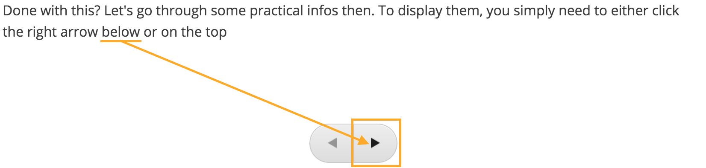

# Module 1 - Overview & Getting Started

## 1.0 Pre-Course Survey

Tell the DHIS2 Academy team more about yourself by filling out our
pre-course survey below. The information you provide will help us to
make useful updates to this course and create more effective training
material in the future.

[Pre-course survey](https://www.google.com/url?q=https://docs.google.com/forms/d/e/1FAIpQLSd1dbVONTc2NZTAIif3mtCjcONcjo8alHbs-knCD4_rhINC4A/viewform?usp%3Dsf_link&sa=D&ust=1605599915693000&usg=AOvVaw01azt-vdVTOOPmPiWnCpfL)

## 1.1 About the course

### Welcome to DHIS2 Fundamentals

We are excited you have joined us for this course on DHIS2
Fundamentals!

Here in module 1, you’ll find an overview of the course, get
familiarized with the Open edX platform, and find the most important
information to get started.

#### What is this course about

Throughout this course, you will learn the essentials of DHIS2, an
open-source information system that facilitates decision making within a
wide variety of sectors thanks to its wide range of data capture,
review, analysis, and sharing capabilities. In this course, we will be
using public health for all of our examples, but note that DHIS2 is also
used in other sectors such as environment and education.

#### What will I learn

After completing this course, you’ll be able to:

- Describe how DHIS2 can be used to aggregate, analyze, review, and
    share data from health programs.
- Describe the key concepts, building blocks, and terminology of
    DHIS2.  
- Create pivot tables, charts, and maps to visualize data within
    DHIS2.
- Identify the initial steps to customize DHIS2 for aggregate data to
    meet the needs of a given country or organization.
- Differentiate the mechanisms used for data capture within DHIS2
    along with their main features

#### What are the course prerequisites

There are no specific prerequisites to do this course. However, having
basic knowledge or prior experience using data analysis tools (such as
Microsoft Excel) is an advantage.

#### How is the course structured

DHIS2 Fundamentals is comprised of 6 modules:

- Module 1: Overview and Getting Started (45 min)
- Module 2:  Introduction to DHIS2 (1 hr)
- Module 3:  Introductions to DHIS2 Analysis (8 hr)
- Module 4: Introduction to DHIS2 Customization (6 hr)
- Module 5: Introduction to Tracker (3 hr)
- Module 6: Summary Concepts (20 min)

#### How will I learn

In each module, you will find video presentations, demonstrations,
knowledge check questions, and step-by-step activities to be completed
in Trainingland and Customization (the training environments you will
use along the course). You’ll find more information about Trainingland
and Customization in the “Practical information” section.

Each topic is presented in the form of  videos of approximately 5 to 15
minutes in length. Watch them at your leisure (or download them to save
them for later) participate in the discussions, and see how much you’ve
learned by taking the assignments afterward.

After watching the videos, you’ll have the chance to practice what has
been demonstrated. By going through these activities, you will improve
your understanding of the fundamentals of DHIS2. These practice
activities are not graded; they are meant to give you a chance to
practice the concepts that have been shown through self-paced exercises.
 The more activities you do, the more you will get out of the course.

#### How long will it take to complete the course

We estimate the course will take approximately  20 hours to complete.
This includes the review of all videos, performing related activities
and completing all graded assignments. As this is a self-paced course,
note that this may vary slightly for each learner.

#### How do I pass the course

The course consists of 3 types of assessments that contribute to your
final grade:

- **Assignments**: are based on a step by step interactions you will need
    to perform within the training environment, followed by
    multiple-choice and /or multiple response questions. You will find
    these assignments in modules 3 and 5, and they contribute 16% to
    your final grade.
- **Customization Lab**: in module 4, you'll find 3 sets of activities
    where you'll be prompted to create the basic customization of a
    DHIS2 instance. These sets of assignments assess crucial knowledge
    and skills and they are graded as pass/fail, which means that if you
    don't successfully complete all the tasks, you will not get any
    partial credit. Customization Lab counts 24% of your final grade.
- **Quizzes**: you will find along the course different quizzes composed
    of multiple-choice, multiple-response, and/or true or false
    questions that will assess your comprehension of the main concepts
    behind DHIS2. The quizzes contribute 60% to your final grade.

You’ll have 3 attempts to complete each assignment or quiz. You’ll find
specific Instructions to complete the Customization Lab in module 4.

 In order to pass the course, an **overall grade of 80% is required**.

Successfully completing this course will enable you to participate in
the Level 1 - Analytics Tools and Level 1 - Design and Customization
Academies. You will learn more about Level 1 Academies at the end of the
course.

#### What is the course timeline

This course is self-paced, which means there are no set deadlines and
you can go through it at as fast or as slow as you prefer.  This course
does not currently have a set end date. In the event that an end date is
scheduled, you will be notified with enough time to finish your work in
the course.

#### How do I get support

The easiest way to ask for assistance is to make a post on the
discussion board. Click on the Discussion tab and select “Add a Post” in
order to add a new post. This board will be monitored by the course
instructors and other participants may also be able to assist in your
query.

For technical support or when you have issues navigating the platform,
you can contact the course moderators for help by email at
**fundamentals-support@dhis2.org.**

#### What should I do now

If this is your first time using Open edX, go to the next unit to learn
how to navigate the platform. If you are already familiar with using
this platform, go to the unit “Practical Information ” by selecting the
menu on the left-hand side of the screen.

## 1.2 Using the Open edX Platform

### Video - System Login and Navigation

[https://www.youtube.com/watch?v=zn6FwhFa6DE](https://www.google.com/url?q=https://www.youtube.com/watch?v%3Dzn6FwhFa6DE&sa=D&ust=1605599915699000&usg=AOvVaw0k5kCq4dxW1lGvCFZrM3s0)

#### Navigating to the next unit

Let's go through some practical info then. To display the "Practical
Information", you need to either click the right arrow at the bottom or
at the top of this page. The screenshot below shows you where to click.
If you want to go straight to DHIS2 Trainingland instance shown in the
video above, use the sidebar, the arrow icon shown below, or this link
to navigate to [Module 2 - Introduction to DHIS2 > 2.2 - Introduction
to Trainingland > Your account on DHIS2
Trainingland](https://www.google.com/url?q=https://academy.dhis2.org/courses/HISP/DHIS2_Level1/2015_Q1/courseware/44a5267a3c2f40168e4f93e6217ad519/dab2d99d33df4f488d9a51e73e4440b7/&sa=D&ust=1605599915700000&usg=AOvVaw2rGUWCRrfigiCkU0HHTSpX)

## 1.3 Practical Information

### System Requirements

To access the course, you will need a device with an internet
connection. You will also need speakers or headphones since all of the
videos are narrated. To properly use the DHIS2 instances in this course
(Trainingland and Customization),  we recommend the use of either
Firefox or Chrome web browser. We do not recommend Internet Explorer.

### Supplementary Training Environment - Trainingland and Customization

In addition to the content you will find in Open edX, you will also be
interacting with 2 DHIS2 systems that have been created for training
purposes. In these DHIS2 systems, you will be performing all the
activities and assignments for this course.

The systems you will be working with are:

1. Trainingland

2. Customization

To start working with them, you will be asked to register for accounts
in sections 2.2 and 4.1 respectively. Simply click the “Request account”
button in those sections and follow the on-screen **Instructions** to
register your accounts.

### Discussion forums

The [discussion
forums](https://www.google.com/url?q=http://academy.dhis2.org/courses/HISP/DHIS2_Level1/2015_Q1/discussion/forum&sa=D&ust=1605599915702000&usg=AOvVaw0b8ickFkyv5FRu76sd4XsZ) will
give you an opportunity to communicate and discuss ideas with the course
staff and your fellow students. We encourage you to participate in these
forums to learn from your peers and discuss course material.

#### General Forum Guidelines

You are invited to use the discussion spaces throughout the course to
connect with your peers and share your questions and ideas.

The use of the discussion forums is an **optional activity** and is not
graded.

Tips for using the discussion forums:

- **Be respectful**. Share your opinions and ideas and respect the
    opinions of others
- **Help each other!** Reply to your peers’ questions and comments.
- Actively **up-vote** other posts if you think they are relevant, and
    other people will up-vote yours! The more upvotes your post has,
    the more likely it is to be seen.
- Choose the appropriate **category** when posting; this will keep the
    discussion forum orderly.
- Use a **descriptive and specific** title for your post. This will
    attract the attention of other learners with the same issue.
- See if someone **has already asked your question** before creating a new
    post.
- Use
    “[netiquette](https://www.google.com/url?q=https://elearningindustry.com/10-netiquette-tips-online-discussions&sa=D&ust=1605599915703000&usg=AOvVaw3jfDhGW_TzYJ0gj3ObZtFT)”
    or common writing practices for online communication. For example:

- Avoid TYPING IN ALL CAPS. Some people read this as shouting, even if
    that is not what you mean to convey.
- Avoid unnecessary symbols, abbreviated words, texting shorthand, and
    replacing words with numbers (e.g. Pls don’t rplce wrds w/#s).

PRO-TIP

- If you find a post particularly interesting and want to return to it
    in the future, you can **follow** it. To do that, view the post you want
    to follow and select the “Follow” icon.
- Each post that you follow appears with a “Following” indicator in
    the list of posts. To list only the posts that you are following,
    regardless of the discussion topic they apply to, select the
    drop-down “Discussion” list and select “Posts I’m Following”.

To make this an enjoyable, positive, and constructive experience for
all, participants are required to be respectful. Abusive and
disrespectful communications will be removed for the comfort of all
participants. You can help by reporting misuse. You can flag any post,
response, or comment for a discussion moderator to review: view the
contribution, select the “More” icon, and then select “Report.”

## 1.4 Introductions

### Know your instructor

Hi everyone! Welcome to the DHIS2 online fundamentals course. This
course covers some of the most fundamental concepts that form the core
of the DHIS2 platform. These concepts have remained constant since
DHIS2’s initial development and are therefore still relevant and being
actively utilized within the system. By reviewing and understanding the
foundation we present within this course, you will be well on your way
to start understanding advanced and updated concepts associated with
DHIS2. I hope you will find the course content, activities and training
environments engaging. I look forward to interacting with you all
throughout the course and within the broader DHIS2 community.

A little bit about me. I work as an Implementation Advisor and Training
Content Developer for the University of Oslo. My education background
includes:

- Masters of Public Health, University of Queensland, Australia
- Masters of Health Informatics, University of Waterloo, Canada
- Graduate Certificate of Adult Education, University of Toronto,
    Canada

I have been supporting the development of in-person and online academy
material across many of the DHIS2 core areas, including both
introductory and advanced training on various topics. I currently
support DHIS2 in-country implementations within Indonesia, Nigeria,
Solomon Islands and Vanuatu and have previously supported Myanmar and
Lao. In addition, I support the review and implementation of global
public health standards through the development of the digital data
packages.

Previously, I worked for WHO as a health information systems officer
based in the Solomon Islands.

I sincerely hope you will find me up to your standard in delivering this
course content. Good luck with the course!

-- Shurajit Dutta

### Now it’s your turn

To make the most of your learning experience during the course, we
encourage you to introduce yourself in the discussion forum.

Forum

-----
