# Module 3 - Introduction to DHIS2 Analysis (8 hr)

## 3.0 Overview of the module (10 min)

### What is in this module

In the previous module, you learned that DHIS2 is used in public health
for the reporting, analysis, and dissemination of data.

In this module, we’ll delve into the **analysis** function, understanding
the **mechanics** of how to use the following DHIS2 applications: **Pivot
table, Data visualizer, GIS** (now named Maps) and **Reports**.

By watching demonstrations, you’ll see how it’s possible to **combine
tables, charts and maps** to create **integrated analysis**, how to create and
share **dashboards**, how to **interact** with other DHIS2 members through the
platform, and what are the main DHIS2 roles within a system.

After the demonstration videos, you will be prompted to replicate some
of the steps on your own in Trainingland. This will help you become
familiarized with the different apps and the navigation options of each
one of them.

At the end of each subsection, you will find the **graded activities** of
the module: in subsections **3.2, 3.3,** and **3.4**, you will find **assignments**
and **quizzes**, while in subsections **3.5** and **3.6** you will find
only **quizzes**. All graded activities of this module together are worth
**37%**  of your final grade.

We estimate that you will take about 8 -10 hours to view all the videos
and complete all the learning activities, including the graded ones.

## 3.1 Data Analysis Overview Intro  (1,5 min)

Watch the following video to see what contents we will be covering in
this module.

### Video - Data Analysis Overview Intro

[https://www.youtube.com/watch?v=lPPA2Si185I](https://www.google.com/url?q=https://www.youtube.com/watch?v%3DlPPA2Si185I&sa=D&ust=1605599915723000&usg=AOvVaw2c8loRXKUixU84YtirYU9j)

## 3.2 Pivot Tables (140 min)

### Video - Pivot Table Demo - Part 1 of 7 (17 min)

Let's start these sessions identifying how the **DHIS2 building
blocks** that you have learned about in module 2 (**data**, **periods**, and
**organisation units**) are selected to create a **pivot table**.

You'll start to familiarize yourself with the table **layout** and **options**,
which are variables that will directly affect the outputs you create.

[https://www.youtube.com/watch?v=PFUH4IS9ZSE](https://www.google.com/url?q=https://www.youtube.com/watch?v%3DPFUH4IS9ZSE&sa=D&ust=1605599915724000&usg=AOvVaw1mc1ciO1H3UoPccB9vWjA1)

#### Activity 1 - Pivot Table interface, selecting data dimensions and creating a simple pivot table

In [TRAININGLAND](https://www.google.com/url?q=https://live.academy.dhis2.org/tl1/dhis-web-commons/security/login.action&sa=D&ust=1605599915724000&usg=AOvVaw2omjjf7tWUmHS5UGqAs6a6), please try to create the following pivot table that follows the example
in the video:

In the data tab select:

- “Data Elements” as the data type
- “Delivery” as the Data Element Group
- “Death maternal” as the Data Element

In the period tab select:

- “Last 4 quarters” as the period. (Note: The last 4 quarters that are
    displayed may be different than what is shown in the video.)

In the organisation unit tab select:

- "Trainingland" as the organisation unit

>

Open the options tab and select:

- “Show row totals”

- Click on Update to see your output.

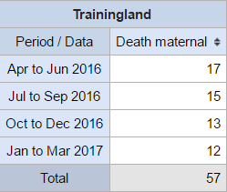

### Video - Pivot Table Demo - Part 2 of 7 (10 min)

In the following video, you will see different ways of **how to select
organisation unit levels** that you want to retrieve data from.

Then, you will see **how to adjust the table layout and options** to make
the pivot table more clear and easy to understand for everyone.

[https://www.youtube.com/watch?v=YYb-5uj-EXQ](https://www.google.com/url?q=https://www.youtube.com/watch?v%3DYYb-5uj-EXQ&sa=D&ust=1605599915726000&usg=AOvVaw1T-gDbxu7bCmuN_kJP5MzJ)

#### Activity 2 - Selecting organisation unit levels and adjusting the table options

In [TRAININGLAND](https://www.google.com/url?q=https://live.academy.dhis2.org/tl1/dhis-web-commons/security/login.action&sa=D&ust=1605599915727000&usg=AOvVaw1ZUb2cH38sKm1loHuorMKv), add in the districts with Maternal deaths to your table. Note that these organisation units may be different than what is seen in the video.

In the organisation units tab:

- Select “District” as the organisation unit level.

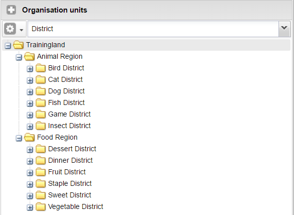

- Open the layout tab and:

- Move the organisation units down to the row
- Move the periods over to the column

- Open the options tab and select "Hide empty rows".

- Click on “Update” to see your table.

### Video - Pivot Table Demo - Part 3 of 7 (10 min)

In this third part of the pivot table demo, you will see additional
methods to select organisation units, in case you need to dig a little
bit deeper into the data. You will also see how to sort the data, and
how to save your table.

[https://www.youtube.com/watch?v=UP5tbM2Sb3M](https://www.google.com/url?q=https://www.youtube.com/watch?v%3DUP5tbM2Sb3M&sa=D&ust=1605599915729000&usg=AOvVaw1ar8isYJNy8fRBWYxRICmo)

#### Activity 3 - Saving the table as a favorite

In
[TRAININGLAND](https://www.google.com/url?q=https://live.academy.dhis2.org/tl1/dhis-web-commons/security/login.action&sa=D&ust=1605599915729000&usg=AOvVaw0qXo9qwgqfzCGKQqh0PBB0),
add in the facilities and save the table as a favorite.

In the organisation units tab:

- Select “Animal Region” as the organisation unit
- Select “Facility” as the level

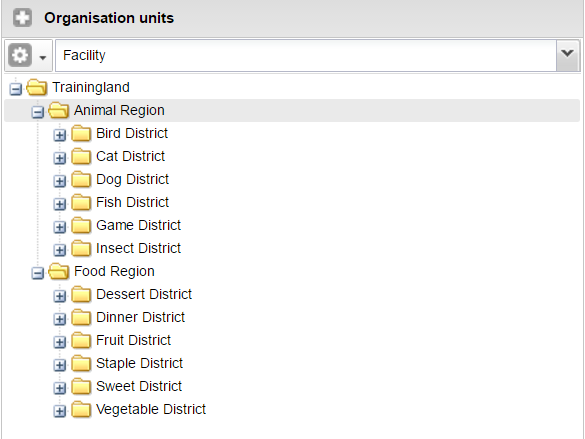

- Update the table to see your output.

- Save the table as a favorite using: username_health program
    name_what, what, when.

Note that in a real life setting, there may be no need to use your
username when saving your favorites. In this course this is used however
to identify the favorites that you have created.

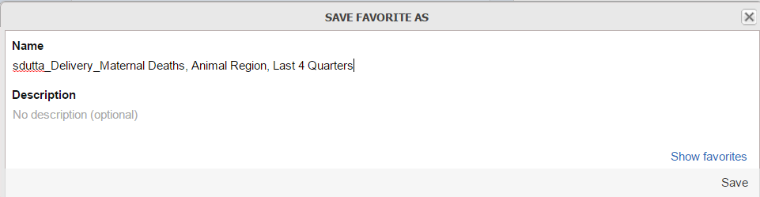

### Video - Pivot Table Demo - Part 4 of 7 (10 min)

Let’s see how to use **indicators**, instead of data elements, to create a
pivot table. Pay attention to the **differences** between these two types of
data. This will help you to correctly select the inputs you require when
you create your own pivot tables. You will also see how to apply **legend
sets** and add **table titles**.

[https://www.youtube.com/watch?v=qCJMoykIzbg](https://www.google.com/url?q=https://www.youtube.com/watch?v%3DqCJMoykIzbg&sa=D&ust=1605599915731000&usg=AOvVaw0QvNI4uEqDPvO1U50YJmTD)

#### Activity 4 - Reviewing indicators and applying legend sets and table titles

In [TRAININGLAND](https://www.google.com/url?q=https://live.academy.dhis2.org/tl1/dhis-web-commons/security/login.action&sa=D&ust=1605599915731000&usg=AOvVaw3CTKROjTNAEojJdyxVmvgA), create a table containing two indicators and apply a legend-set to the table.

In the data tab select:

- "Indicators" as the data type.
- "Immunization - coverages" as the Indicator Group.
- "BCG Coverage" & "DPT3 Coverage" as the Indicators.

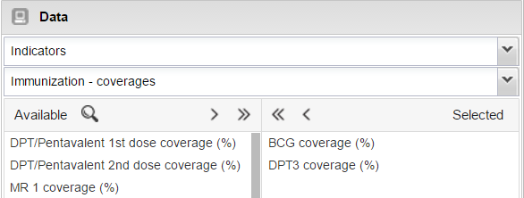

In the period tab:

- Select “Last 6 quarters” as the period. The last 6 months that are
    displayed may be different than what is shown in the video.

In the organisations unit tab:

- Change the selection mode to "Select levels".
- Select "District" as the organisation unit level.

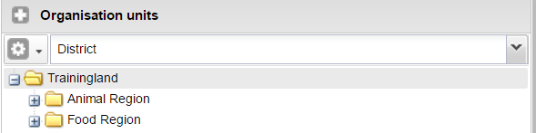

- Alter the layout to replicate what is seen on the video. You can
    update the table if you’d like, there are several more steps in this
    activity.

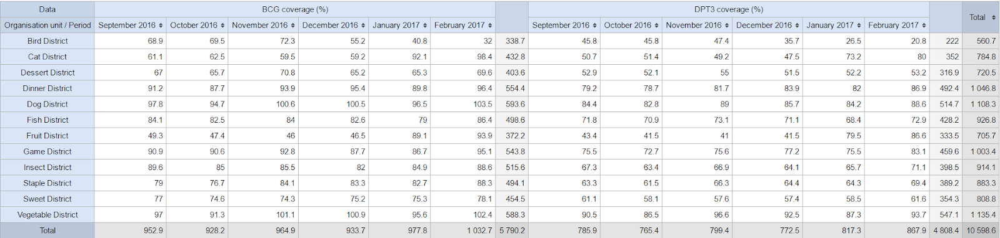

- Open the table options and change the following:

- Remove all of the totals from the table.
- Apply the EPI Coverage legend set. You can try both "Text color" and
    "Background color" as the Legend display style to view the
    difference.
- Provide the table with a title.

- Click on Update when all of the changes are made.

The table should reflect the format of what is seen in the video.

### Video - Pivot Table Demo - Part 5 of 7 (12 min)

In the next video, you will see how you can disaggregate your data
within a pivot table .

[https://www.youtube.com/watch?v=GpUybqjNCN8](https://www.google.com/url?q=https://www.youtube.com/watch?v%3DGpUybqjNCN8&sa=D&ust=1605599915734000&usg=AOvVaw2KKRoQXDwvv-EKGuDWNa6E)

#### Activity 5 - Separating data elements by their disaggregations

In [TRAININGLAND](https://www.google.com/url?q=https://live.academy.dhis2.org/tl1/dhis-web-commons-about/redirect.action&sa=D&ust=1605599915734000&usg=AOvVaw1Q96iaXsWO6t6bQulMGjS7), create a pivot table that includes data elements separated into their
individual disaggregations.

In the data tab select:

- "Data Elements" as the data type.
- "HIV" as the Data Element Group.
- "HIV tests performed 15-19 years" as the Data Element.

In the period tab select “Last year” as the period. The last year that
is displayed will be different than what is shown in the video.

In the organisations unit tab:

- Change the selection mode to "Select levels".
- Select "Facility" as the organisation unit level.

Add in the disaggregations for this data element. This includes:

- Gender - Male/Female.
- HIV service - PMTCT/TB/Other.

- Modify the table layout to make the table easier to read.

Note that the disaggregations have been added to the table as additional
data dimensions that can be moved anywhere on the table as required.

- Click on “Update” to see the output (note that only part of the
    table is shown here, in DHIS2, all facilities should be displayed).

### Video - Pivot Table Demo - Part 6 of 7 (7 min)

In this overview we will demonstrate how to download your completed
pivot table data in different formats, including Excel and CSV files,
among others.

[https://www.youtube.com/watch?v=4pVA_DeeXhw](https://www.google.com/url?q=https://www.youtube.com/watch?v%3D4pVA_DeeXhw&sa=D&ust=1605599915736000&usg=AOvVaw0S6PUQYOvlr4bNMMNiDn0n)

#### Activity 6 - Adding in the hierarchy to the table and downloading pivot tables

In [TRAININGLAND](https://www.google.com/url?q=https://live.academy.dhis2.org/tl1/dhis-web-commons/security/login.action&sa=D&ust=1605599915737000&usg=AOvVaw2hmHMouo7SBIBETQZVTqqr), to the previous activity, add in the hierarchy and download the table.

- Open up the table options and select “Show hierarchy.” Click on
    update to add the hierarchy to the pivot table.

 

- Try to download the pivot table in various formats.

Since the hierarchy has been added, you have the option to download it
as a plain data source with the hierarchy intact.

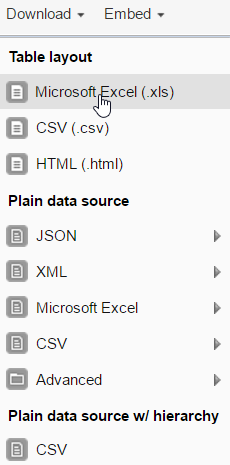

### Video - Pivot Table Demo - Part 7 of 7 (5 min)

In the final video of this series, we will summarize the most important
concepts we have discussed so far.

[https://www.youtube.com/watch?v=FVQdWYmFJgo](https://www.google.com/url?q=https://www.youtube.com/watch?v%3DFVQdWYmFJgo&sa=D&ust=1605599915738000&usg=AOvVaw2AO4PMr6MCuYmiJALp2oAJ)

## Assignments - Pivot Tables (60 min)

### Assignments - Pivot Tables

The following are **graded assignments** and they are worth **8%** of your final
grade (1,6% for each question).

You are allowed 3 attempts for each of these assignments.

You need to click on the "check" button to submit your answers.

-----

#### Assignment 3.2.1 - Delivery in Facility, Trainingland, Q1 - Q4 2016

**Instructions**

Please do this assignment in [TRAININGLAND](https://www.google.com/url?q=https://live.academy.dhis2.org/tl1/dhis-web-commons/security/login.action&sa=D&ust=1605599915739000&usg=AOvVaw0A_6MLpuJX_xefCVBxJZC4).

1. For this assignment, answer the questions using the Pivot Table app.
2. Save all tables as a favorite as they will be used later on in the
    dashboard exercise.
3. Use the same naming convention to save the 2 favorites as before:
    username_program_what, where, when.

**Details**

- Data Element Group: Delivery
- Data Element: Delivery in facility
- Period: January - March 2016, April - June 2016, July - September
    2016, October - December 2016
- Organisation Unit: Trainingland

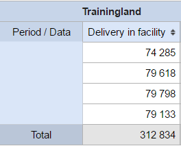

Question of the assignment 3.2.1

Which quarter had the lowest number of deliveries?

EXPLANATION

The quarter January - March 2016 had the lowest number of deliveries

#### Assignment 3.2.2 - Delivery in Facility, Trainingland Districts, Q1 - Q4 2016

**Instructions**

Please do this assignment in [TRAININGLAND](https://www.google.com/url?q=https://live.academy.dhis2.org/tl1/dhis-web-commons/security/login.action&sa=D&ust=1605599915741000&usg=AOvVaw0RyPeZYRdngiyb-i4yUiGe).

1. For this assignment, answer the questions using the Pivot Table app.
2. Save all tables as a favorite as they will be used later on in the
    dashboard exercise.
3. Use the same naming convention to save the 2 favorites as before:
    username_program_what, where, when.

**Details**

- Data Element Group: Delivery
- Data Element: Delivery in facility
- Period: January - March 2016, April - June 2016, July - September
    2016, October - December 2016
- Organisation Unit: Trainingland Districts

Question of the assignment 3.2.2

1. Which District had the lowest number of facility-based deliveries?

EXPLANATION

Sweet District had the lowest number of facility-based deliveries

2. During which quarter was the absolute lowest number of facility
    deliveries recorded?

EXPLANATION

During January - March 2016 the lowest number of facility deliveries
were recorded

#### Assignment 3.2.3 - HIV Test Positivity Rate, Trainingland Facilities, January 2016 - December 2016

**Instructions**

Please do this assignment in [TRAININGLAND](https://www.google.com/url?q=https://live.academy.dhis2.org/tl1/dhis-web-commons/security/login.action&sa=D&ust=1605599915742000&usg=AOvVaw00Wzd3Ddun_Lozy6FScW72).

1. For this assignment, answer the questions using the Pivot Table app.
2. Save all tables as a favorite as they will be used later on in the
    dashboard exercise.
3. Use the same naming convention to save the 2 favorites as before:
    username_program_what, where, when.

**Details**

- Indicator Group: HIV
- Indicator: HIV test positivity rate
- Period: January 2016 - December 2016 (individual months)
- Organisation Unit: Trainingland Facilities

Question of the assignment 3.2.3

In September 2016, which facility had the highest HIV test positivity
rate?

EXPLANATION

Poodle Private Medical Practice had the highest HIV test positivity rate

#### Assignment 3.2.4 - Malaria RDT performed & Malaria RDT Positive, Trainingland Health Centres, Jan 2014 – Dec 2015

**Instructions**

Please do this assignment in [TRAININGLAND](https://www.google.com/url?q=https://live.academy.dhis2.org/tl1/dhis-web-commons/security/login.action&sa=D&ust=1605599915744000&usg=AOvVaw3xXqlV6r8VCjXyoqEnPRet).

1. For this assignment, answer the questions using the Pivot Table app.
2. Save all tables as a favorite as they will be used later on in the
    dashboard exercise.
3. Use the same naming convention to save the 2 favorites as before:
    username_program_what, where, when.

**Details**

- Data Element Group: Malaria
- Data Elements: Malaria RDT performed, Malaria RDT Positive
- Data Dimension: Age (above/below 5 years)
- Period: Quarterly – Jan 2015 – Dec 2016
- Organisation Unit: Trainingland Facilities

*Brief Note: In this table, there should not be more Malaria RDT
positives then Malaria RDT performed. If this is occurring, then there
is likely some issue with the quality of the data. For example, in
Afghan Dispensary for the period Oct - Dec 2015 in both the < 5 and >=
5 age group, we can see that there are more Malaria RDT positives then
Malaria RDT performed. Malaria RDT positives are a direct result of
performing an RDT test to detect malaria, and therefore the number of
Malaria RDT performed should always be >= the number of Malaria RDT
positives.

Question of the assignment 3.2.4

In Blueberry dispensary, were the total number of Malaria RDT positives
greater than or less than the total number of Malaria RDTs performed?

EXPLANATION

The correct answer is greater than

In Chocolate Dispensary, how many Malaria RDTs were positive in Oct -
Dec 2016 for the 'under 5 years' age group? (enter the value in the box
below)

EXPLANATION

14 Malaria RDTs were positive in Oct - Dec 2016 for the 'under 5 years'
age group within Chocolate Dispensary

#### Assignment 3.2.5 - Breastfeeding within 1 hour after delivery, Delivery in Facility & Breastfeeding within 1 hour after delivery (%), Trainingland Districts, Last 6 months

**Instructions**

Please do this assignment in [TRAININGLAND](https://www.google.com/url?q=https://live.academy.dhis2.org/tl1/dhis-web-commons/security/login.action&sa=D&ust=1605599915746000&usg=AOvVaw2BE9ia2O3TQVyqj8WTRzYt).

1. For this assignment, answer the questions using the Pivot Table app.
2. Save all tables as a favorite as they will be used later on in the
    dashboard exercise.
3. Use the same naming convention to save the 2 favorites as before:
    username_program_what, where, when.

**Details**

- Data Element Group: Delivery
- Data Elements: Breastfeeding within 1 hour after delivery, Delivery
    in Facility
- Indicator Group: Maternal/Delivery
- Indicator: Breastfeeding within 1 hour after delivery (%)
- Period: Monthly July 2016 - December 2016
- Organisation Unit: Trainingland Districts

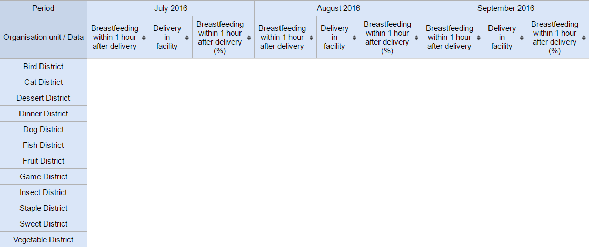

Question of the assignment 3.2.5

In November 2016, which district had the lowest Breastfeeding within 1
hour after delivery (%)?

EXPLANATION

Dessert District had the lowest Breastfeeding within 1 hour after
delivery (%) during November 2016

## Session Quiz - Pivot Tables

### Session Quiz - Pivot Tables

This is a **graded quiz** and it is worth **5%** of your final grade.

You have **3 attempts** to pass this quiz.

Select  the "check" button to submit your answers.

If you want to save your current response without submitting it for
grading yet, select the "save" button. This allows you to come back
later and resume the attempt.

1. Pivot tables can be used to analyse your data: (select one)

- By indicators, data elements, and reporting rates
- By  Units
- By Periods
- **All of the above**

EXPLANATION

As seen in the pivot table, different items can be analyzed together
within this application.

2. Pivot Tables in DHIS2 are mainly used for:

- Visualizing data in charts
- **Analyzing data in dynamic tables**
- Creating standard, one-click reports for review

EXPLANATION

As introduced in the pivot table demo, pivot tables are used for
creating dynamic tables

3. The output of pivot tables can be: (select one)

- Saved as favorites
- Downloaded for use offline
- Have the hierarchy added in
- **All of the above**

EXPLANATION

As seen in the pivot table demo, the output can be used in all the
various ways mentioned in this question.

## 3.3 - Data Visualizer (100 min)

### Video - Data Visualizer Demo - Part 1 of 5 (12 min)

Through the series of videos, you will become familiar with the Data
Visualizer interface and will identify the **different types of
charts** available in DHIS2.

You will also see several examples of **how to create charts** and learn how
to apply the chart **layout** and **options** to show the data clearly and
understandably.

Lastly, you will learn how to **download charts** from DHIS2 in order to
share them outside of the platform.

[https://www.youtube.com/watch?v=ix3T8MdRPUw](https://www.google.com/url?q=https://www.youtube.com/watch?v%3Dix3T8MdRPUw&sa=D&ust=1605599915750000&usg=AOvVaw3eKtRkfjcRLtvt4_cd8avY)

#### Activity 1 - Data Visualizer interface and creating a vertical bar chart

Please try to create in [TRAININGLAND](https://www.google.com/url?q=https://live.academy.dhis2.org/tl1/dhis-web-commons/security/login.action&sa=D&ust=1605599915751000&usg=AOvVaw3iI5YclWu0VBMznvxDqjji) the following chart that follows the example in the video using the Data Visualizer app:

Start by selecting the vertical bar chart as your graph type.

In the data tab select:

- "Data Elements" as the data type.
- "ANC" as the Data Element Group.
- "ANC 1st visit" & "ANC 4th visit" as the Data Elements.

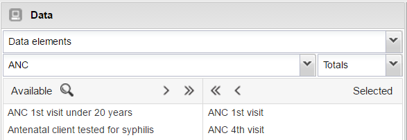

In the period tab:

- Select “Last 12 months” as the period.

The last 12 months that are displayed will be different than what is
shown in the video.

In the organisation unit tab:

- Select “District” as the organisation unit level.

- Open the layout tab and move the organisation units down to the
    Category (note that the Periods will be automatically moved to the
    filter - as stated in the video, multiple dimensions are not
    possible within the category or series within the Data Visualiser).

- Click on "Update" to see your chart. You may see different periods
    on the chart depending on when you create it. For example, if it is
    created in April you will see April 2016 - March 2017.

### Video - Data Visualizer Demo - Part 2 of 5 (8 min)

Let’s see how additional **chart options** affect how our visualizations
will be displayed.

[https://www.youtube.com/watch?v=-3CnH77G_ys](https://www.google.com/url?q=https://www.youtube.com/watch?v%3D-3CnH77G_ys&sa=D&ust=1605599915753000&usg=AOvVaw1NwGWKSNOW512VcyPiMke2)

#### Activity 2 - Drilling down within the organisation unit hierarchy and modifying chart options

In [TRAININGLAND](https://www.google.com/url?q=https://live.academy.dhis2.org/tl1/dhis-web-commons/security/login.action&sa=D&ust=1605599915753000&usg=AOvVaw3BVgMm1T0POgghv_VNFY8l), using the graph generated in the "Activity 1 - Data Visualizer interface and creating a vertical bar chart" as a starting point:

- Add in the facilities and alter the table options.

In the organisation units tab:

- Select "Facility" as the organisation unit level.

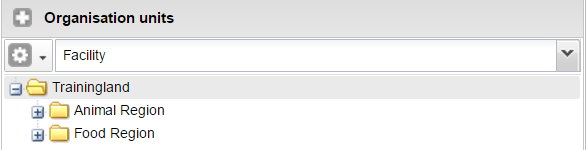

- Open the chart options and:

- De-select "Show values".
- Select "Hide empty categories".
- Select a sort order for the chart (you can try either one in this
    scenario).
- Provide titles for the "Range" and "Domain".
- Provide a chart title.

- Click on "Update" to see your chart.

### Video - Data Visualizer Demo - Part 3 of 5 (10 min)

In this video, you will review how to create a pie chart, including
recommendations for when this type of chart is appropriate to use in
practice. You will also review the different formats that are available
to download charts to your computer.

[https://www.youtube.com/watch?v=dVSv8ORchXo](https://www.google.com/url?q=https://www.youtube.com/watch?v%3DdVSv8ORchXo&sa=D&ust=1605599915754000&usg=AOvVaw0iTol_1mT4MesQ2qdXkdNm)

#### Activity 3 - Creating a pie chart, adding in additional data dimensions and downloading charts

In [TRAININGLAND](https://www.google.com/url?q=https://live.academy.dhis2.org/tl1/dhis-web-commons/security/login.action&sa=D&ust=1605599915755000&usg=AOvVaw3NnO1mR42ptC4DXF0cWcfh), create a pie chart that uses additional data dimensions to separate the data.

- Start by selecting the pie chart as your graph type.

In the data tab select:

- "Data Elements" as the data type
- "HIV" as the Data Element Group
- "HIV tests performed" as the Data Element

In the period tab:

- Select "Last year" as the period. The last year that is displayed
    will be different than what is shown in the video.

In the organisation unit tab:

- Select "Animal Region" as the organisation unit.

- Add in the HIV service types as additional data dimensions.

- Open the layout tab and:

- Move the HIV service to the category.
- Put any one either the organisation units, periods or data in the
    series.

- Click on "Update" to see your chart.

- Experiment with downloading the chart in either PDF or Image format.

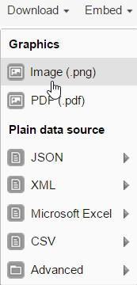

### Video - Data Visualizer Demo - Part 4 of 5 (10 min)

Now, let’s see how to create a **line chart** along with some
recommendations when this type of chart is most appropriate. For this
example, you will see how to use indicators instead of data elements to
create charts.

You will also learn how to **save** your charts, **rename** them, and **update** them.

[https://www.youtube.com/watch?v=kf1sNpkaGkc](https://www.google.com/url?q=https://www.youtube.com/watch?v%3Dkf1sNpkaGkc&sa=D&ust=1605599915757000&usg=AOvVaw2Vx6nv2SqbITDz2Gy-4eCO)

#### Activity 4 - Creating a line chart and saving a favorite

In [TRAININGLAND](https://www.google.com/url?q=https://live.academy.dhis2.org/tl1/dhis-web-commons/security/login.action&sa=D&ust=1605599915758000&usg=AOvVaw0-ZDSaTC1pd77sEfaz35Ip), create a line chart using indicators and save a favorite.

- Start by selecting the line chart as your graph type.

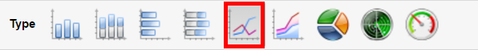

In the data tab select:

- "Indicators" as the data type
- "Maternal/Delivery" as the Indicator Group
- "BEmONC delivery rate (%)" and "Delivery complication rate -
    institutional" as the Indicators

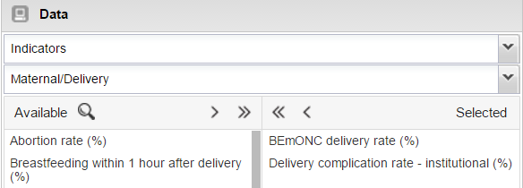

In the periods tab:

- de-select "Last 5 years".
- Select "Monthly" as the period type and proceed to add the last 36
    months covering 2014 - 2016.

In the organisation units tab:

- select "Trainingland" as the organisation unit.

- Click on "Update" to see your chart.

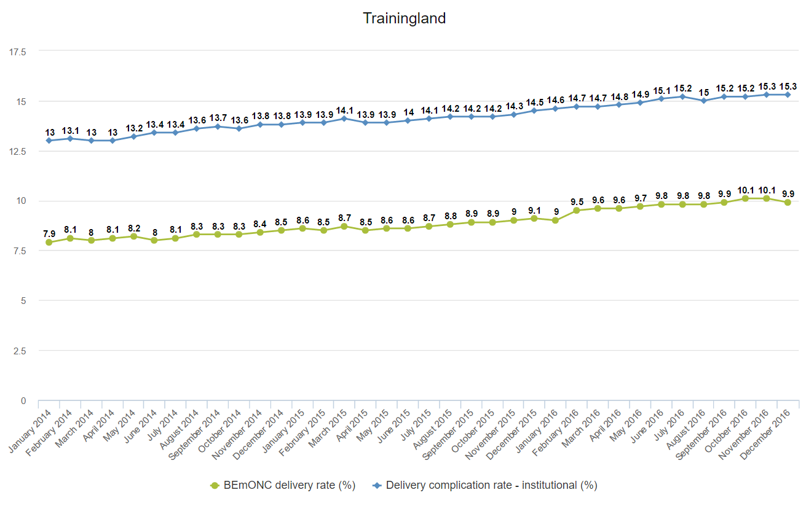

- Save the table as a favorite using: username_health program
    name_what, what, when

Note that in a real life setting, there may be no need to use your
username when saving your favorites. In this course this is used however
to identify the favorites that you have created.

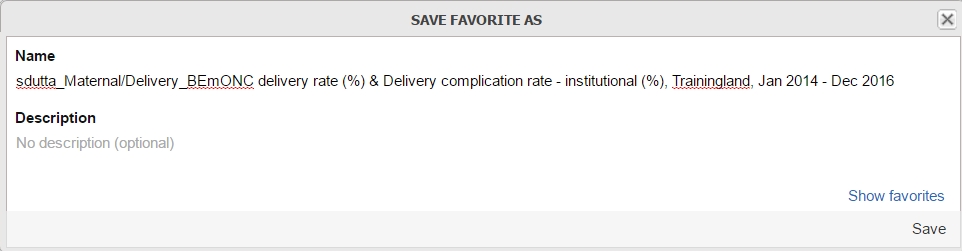

### Video - Data Visualizer Demo - Part 5 of 5 (4 min)

In the final video of this series, we will summarize the most important
concepts we have discussed so far.

[https://www.youtube.com/watch?v=HzpLHQyxgfk](https://www.google.com/url?q=https://www.youtube.com/watch?v%3DHzpLHQyxgfk&sa=D&ust=1605599915760000&usg=AOvVaw2izTgkdN1ZsUEbvDLRgE88)

## Assignment - Data Visualizer (45 min)

### Assignment - Data Visualizer

The following is a **graded assignment** and contributes **8%** to your final grade (2% for each question)

You are allowed **3 attempts** for each of these assignments.

You need to click on the "**check**" button to submit your answers.

-----

#### Assignment 3.3.1

**Instructions**

In [TRAININGLAND](https://www.google.com/url?q=https://live.academy.dhis2.org/tl1/dhis-web-commons/security/login.action&sa=D&ust=1605599915761000&usg=AOvVaw2FCzF9zIDDICwZ-ULPQmtJ):

1. For this assignment, answer the questions using the Data Visualizer
    App.
2. Save all charts as a favorite.
3. Use the same naming convention to save the 2 favorites as before:
    username_program_what, where, when.

**Details**

Create a pie chart which compares Outpatient Attendance per 1,000
population in 2016 for all of Trainingland by the following facility
types:

- PHC
- Dispensary
- Health Centre

(hint: these facility types can be found as an additional data dimension
called "Type"):

=====

- Indicator Group: Outpatient/Inpatient
- Indicator: Outpatient Attendance per 1,000 population
- Period: 2016 (Last Year)
- Organisation unit: Trainingland

Question of the assignment 3.3.1

Which facility type has the highest OPD attendance rate?

EXPLANATION

Answer : Dispensary.

#### Assignment 3.3.2

**Instructions**

In [TRAININGLAND](https://www.google.com/url?q=https://live.academy.dhis2.org/tl1/dhis-web-commons/security/login.action&sa=D&ust=1605599915763000&usg=AOvVaw0q8vEWdMRU7WaoNaAxZhYz):

1. For this assignment, answer the questions using the Data Visualizer
    App.
2. Save all charts as a favorite.
3. Use the same naming convention to save the favorites as before:
    username_program_what, where, when.

**Details**

Using a horizontal bar chart, compare the HIV ANC client testing rate -
PMTCT (this denotes this is for PMTCT clients) and the HIV ANC client
tested positive rate - PMTCT for the Districts within Trainingland.

- Indicator Group: HIV PMTCT
- Indicator: HIV Antenatal client testing rate - PMTCT (%), HIV
    Antenatal client tested positive rate - PMTCT (%)
- Period: 2016 (Last Year)
- Organisation unit: Districts

Question of the assignment 3.3.2

In which districts is the tested positive rate greater than the testing
rate? (select one or more)

- Game District
- Dessert District
- Staple District
- Bird District

EXPLANATION

From the chart, you can see that all of these identified districts have
a greater "tested positive" rate when compared to the "testing rate."
This might indicate an error of some sort, as the % tested should be
greater than the % positive

Which district did not have any patients test positive?

- Vegetable District
- Sweet District
- Dog District

EXPLANATION

Sweet District did not have any patients test positive

#### Assignment 3.3.3

**Instructions**

In[TRAININGLAND](https://www.google.com/url?q=https://live.academy.dhis2.org/tl1/dhis-web-commons/security/login.action&sa=D&ust=1605599915765000&usg=AOvVaw3pZbBL9xZr3Uz7LTYZwKsR):

1. For this assignment, answer the questions using the Data Visualizer
    App.
2. Save all charts as a favorite.
3. Use the same naming convention to save the 2 favorites as before:
    username_program_what, where, when.

**Details**

Create a vertical bar chart that compares the number of maternal deaths
by facility within Trainingland for 2016.

- Data Element Group: Delivery
- Data Element: Deaths - Maternal
- Period: 2016 (Last Year)
- Organisation unit: Trainingland Facilities
- Label the axes correctly and provide a descriptive title
- (Hint: use the hide empty category items option to hide facilities
    with no Maternal Deaths before updating the chart)

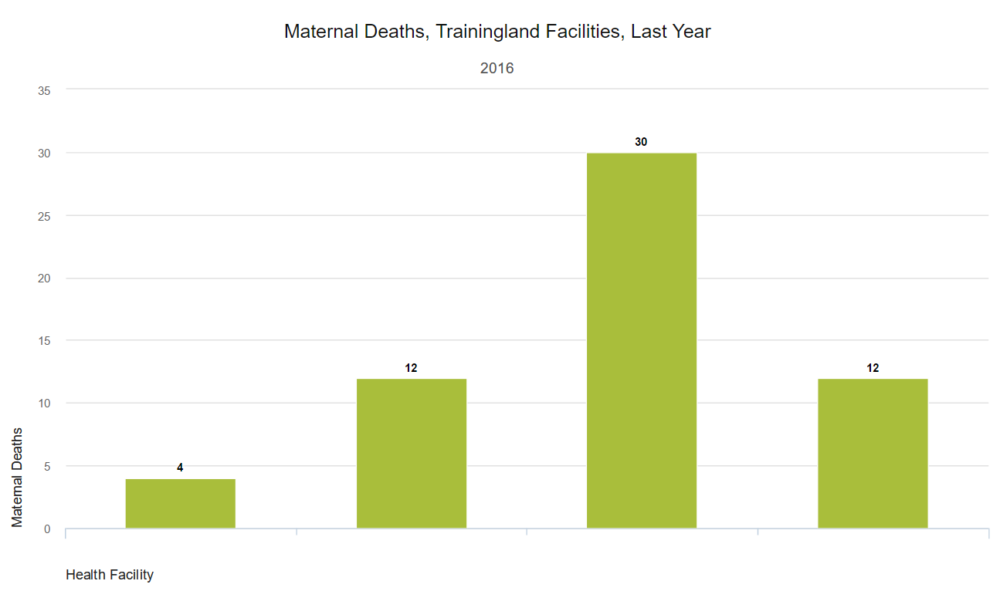

Question of the assignment 3.3.3

Within 2016, what facility had the highest number of Maternal Deaths?

- Minnow District Hospital
- Whale Regional Hospital
- Elephant District Hospital

EXPLANATION

Answer: Minnow District Hospital

#### Assignment 3.3.4

**Instructions**

In [TRAININGLAND](https://www.google.com/url?q=https://live.academy.dhis2.org/tl1/dhis-web-commons/security/login.action&sa=D&ust=1605599915767000&usg=AOvVaw2wiCDD317FRZKkIXnmD5ph):

1. For this assignment, answer the questions using the Data Visualizer
    App.
2. Save all charts as a favorite.
3. Use the same naming convention to save the 2 favorites as before:
    username_program_what, where, when.

**Details**

- Indicator Group: ANC
- Indicators: ANC 1st visit coverage and ANC 4th visit coverage by ANC
    1 (this indicator is similar to calculating an estimate of the
    drop-out rate that occurs between the 1st and 4th ANC visit)
- Period:  January 2015 - December 2016
- Organisation unit: Trainingland
- Label the axes correctly and provide a descriptive title

=====

Investigate the relationship between ANC 1st visit coverage and ANC 4th
visit coverage by ANC 1 (similar to an estimate of ANC 1-4 drop out
rate) over the 24 month period from January 2015 - December 2016 (using
monthly period types, select all 24 months) for all of Trainingland.

 

Question of the assignment 3.3.4

What is the general trend of ANC 1 over time?

- Increasing

What is the general trend of ANC 4 by ANC 1 over time?

- No significant change

Which one is higher?

- ANC 1

## Session Quiz - Data Visualizer (10 min)

### Session Quiz - Data Visualizer

This is a **graded quiz** and it is worth **5%** of your final grade.

You have **3 attempts** to pass this quiz.

Select the "**check**" button to submit your answers.

If you want to save your current response without submitting it for
grading yet, select the "save" button. This allows you to come back
later and resume the attempt.

1. From the Data Visualizer you can: (select one or more)

- **Save favorite charts with a description**
- **Make different types of dynamic charts**
- **Share an interpretation**

EXPLANATION

The data visualizer can be used to create charts, which can be saved as
favorites as discussed via interpretations. This is all demonstrated in
the data visualizer demo.

2. The data visualizer in DHIS2 is mainly used for: (select one)

- **Visualizing data in charts**
- Managing the visual layout of dashboards
- Changing the appearance of the DHIS2 application

EXPLANATION

The main purpose of the data visualizer is to visualize data in charts.

3. In the data visualizer, I cannot add titles to the axes and chart
    itself.

- True
- **False**

EXPLANATION

In the data visualizer, chart and axes titles can be added by going to
the table options.

## 3.4 - GIS (Maps App) (115 min)

### Video - Presentation of the GIS (7 min)

A key tool of DHIS2 that will help you to **store**, **analyze**, and **present spatial data** from health programs is the **G**eographic **I** nformation System, **GIS**. (Note: this is referred to as **Maps** in later DHIS2 versions).

In this video, you will learn what GIS is in the context of DHIS2,
review its interface and review key concepts you will need to understand
in order to use this app effectively.

[https://www.youtube.com/watch?v=OByICemXX8M](https://www.google.com/url?q=https://www.youtube.com/watch?v%3DOByICemXX8M&sa=D&ust=1605599915772000&usg=AOvVaw06t0FTUzp3EUBuMwmluRA6)

#### Learn more about the GIS (Maps) App:

[DHIS2 Documentation](https://docs.dhis2.org/2.25/en/user/html/dhis2_user_manual_en_full.html#about_gis)

#### Knowledge check (not graded) - Presentation of the GIS

1. What does GIS stand for?

- Geographical Identity Software
- **Geographical Information System**
- Geographical Information Structure

EXPLANATION

GIS stands for Geographical Information System. It is a common acronym
that is used when discussing or working with geographical data.

2. Which of the following represents one layer within a GIS?

- Land mass, roads and water
- Land mass and health facilities
- **Health Facilities**

EXPLANATION

A layer is used to represent one piece of information within a map
according to its theme. As an example, health facilities on its own
represents one layer on a map, while the land mass represents a second
layer on the map.

### Video - GIS Demo - Part 1 of 8 (10 min)

In the first video in this series, you will see an overview of the GIS
app in order to start familiarizing yourself with the concepts and
functionalities that you will discover throughout the remainder of this
series.

Pay attention to the concepts and location of **layers** and the **thematic
layer options**, since they are going to be key for understanding the next
videos.

[https://www.youtube.com/watch?v=KnwvPMbdXig](https://www.google.com/url?q=https://www.youtube.com/watch?v%3DKnwvPMbdXig&sa=D&ust=1605599915774000&usg=AOvVaw3vpJ6SDkAIq4tlu2iiQ7AE)

#### Activity 1 - GIS interface, place search and external layers

Please note that the Place Search feature is not currently working.

In [TRAININGLAND](https://www.google.com/url?q=https://live.academy.dhis2.org/tl1/dhis-web-commons/security/login.action&sa=D&ust=1605599915774000&usg=AOvVaw1BqV-4nTvbV3H-cEHHkad_),

- Add an external layer to the map.

To add an external layer click on the external layer icon -> edit
layer.

- Select any of the available external layers from the list.

- Click on "Update" to add the layer to your map.

The layer should be added to the map. From this example you can see that
external layers provide you with some flexibility when preparing your
maps for presentation and/or sharing.

You can quickly add/remove this external layer by selecting it from the
layer stack on the right hand side of the GIS app.

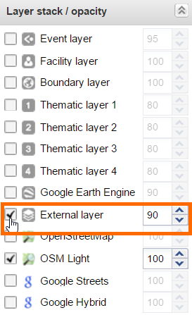

### Video - GIS - Part 2 of 8 (5 min)

The use of the boundary layer will be demonstrated within this video.
The **boundary layer** allows you to visualize the boundaries of the
organisation unit level you have  selected within the GIS app.

[https://www.youtube.com/watch?v=eACsg53JLes](https://www.google.com/url?q=https://www.youtube.com/watch?v%3DeACsg53JLes&sa=D&ust=1605599915776000&usg=AOvVaw1H9WG4fX8c20AH3X8MTjFg)

#### Activity 2 - The boundary layer

To the map you have created, please add in the boundary layer for the
districts within [TRAININGLAND](https://www.google.com/url?q=https://live.academy.dhis2.org/tl1/dhis-web-commons/security/login.action&sa=D&ust=1605599915776000&usg=AOvVaw3YdUIs9paT0TDSyxWIlGYL).

- Select the boundary layer followed by "Edit Layer".

- Keep Trainingland highlighted and select "District" as the
    organisation unit level.
- Click on "Update" to show the layer.

The boundary layer will be displayed within the GIS application.

### Video - GIS Demo - Part 3 of 8 (8 min)

In this video, we will review how to add thematic layers to our map.
Thematic layers are one of the most useful tools when reviewing maps as
they allow us to display different data directly on the map. Pay
attention to the differences between this interface and the one you used
on pivot tables and data visualizer tools when selecting data, periods,
and organisation units.

[https://www.youtube.com/watch?v=kjSYbaqeo-s](https://www.google.com/url?q=https://www.youtube.com/watch?v%3DkjSYbaqeo-s&sa=D&ust=1605599915777000&usg=AOvVaw2s_VZDq0-RFP1pCLTdoIjg)

#### Activity 3 - Adding a thematic layer

Please create a map showing the number of Malaria RDT positives by
facility within all of [TRAININGLAND](https://www.google.com/url?q=https://live.academy.dhis2.org/tl1/dhis-web-commons/security/login.action&sa=D&ust=1605599915778000&usg=AOvVaw3JgOyMVRSgo10QyVUTJRdU).

- Start by selecting Thematic layer 1 -> Edit layer.

- Define the data and period selection for Thematic Layer 1.

Note that the data and periods are defined in the same tab in the GIS
app. This differs from the Pivot Table and Data Visualizer apps, where
these were selected in separate tabs.

- Select the following:

- Value type: Data Element
- Data element group: Malaria
- Data element: Malaria RDT positive
- Period Type: Yearly
- Period: 2016

In the organisation units tab:

- Select "Facility" as the organisation unit level.

- Click on "Update" to see the map.

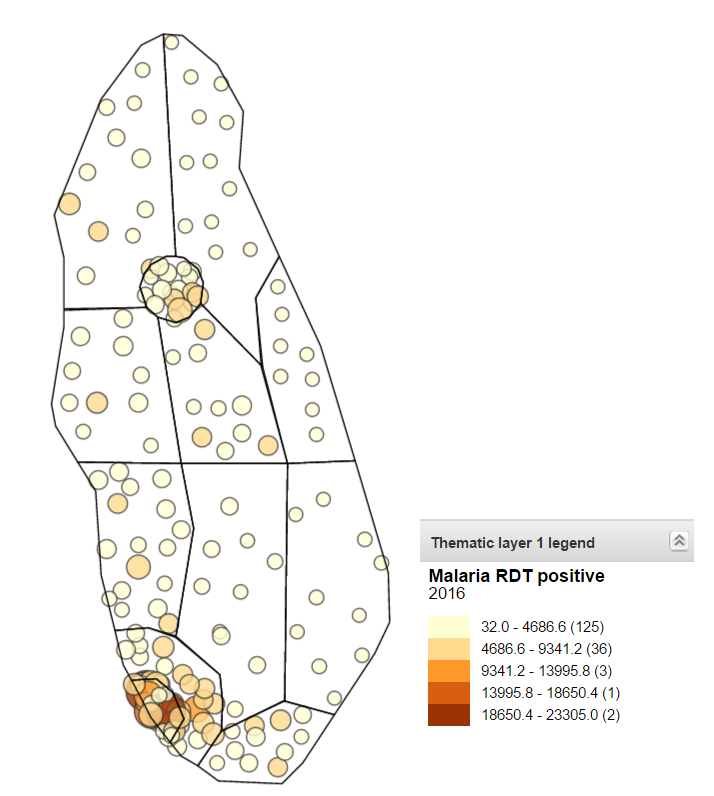

### Video - GIS Demo - Part 4 of 8 (9 min)

In this video, you will learn how to review and interpret the map,
including how to review what the thematic legend is representing. In
addition, options that allow you to alter how the map looks will be
discussed.
[https://www.youtube.com/watch?v=41ZI1D-feVM](https://www.google.com/url?q=https://www.youtube.com/watch?v%3D41ZI1D-feVM&sa=D&ust=1605599915780000&usg=AOvVaw2nhJGSpH6KSZUgYr5f6zQV)

#### Activity 4 - Explanation and modification of the map options

In the map you have created in [TRAININGLAND](https://www.google.com/url?q=https://live.academy.dhis2.org/tl1/dhis-web-commons/security/login.action&sa=D&ust=1605599915780000&usg=AOvVaw28U_kgvQOLJWM3eoK_St_S),
modify the number of classes and methods to see what effect this has on
the legend.

- In the options tab:

- Modify the number of classes to 7
- Modify the method to "Equal counts"

- Click on "Update" to see the new map with the new legend.

Notice that there are now 7 classes on the legend (7 different colors
which differentiate the individual data ranges on the map). The equal
counts method also shows a generally equal amount of data values per
class/legend point within the map.

### Video - GIS Demo - Part 5 of 8 (7 min)

In this video, we will review how to add the facility layer to the map.
The facility layer allows you to represent and display your facilities
directly on the map.

[https://www.youtube.com/watch?v=0F5zhLunq3o](https://www.google.com/url?q=https://www.youtube.com/watch?v%3D0F5zhLunq3o&sa=D&ust=1605599915781000&usg=AOvVaw0NUxeKjFDWtzelZRUhlZFF)

#### Activity 5 - Adding the facility layer

To the map you have created in [TRAININGLAND](https://www.google.com/url?q=https://live.academy.dhis2.org/tl1/dhis-web-commons/security/login.action&sa=D&ust=1605599915782000&usg=AOvVaw3-cF36wnuMqS_QkTDHMqI0), please add in the facility layer.

- Select Facility layer -> Edit layer.

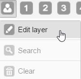

In the Organisation unit group icons tab:

- Select "Type" on the organisation unit group set.

In the Organisation units tab:

- Select "Facility" as the organisation unit level.

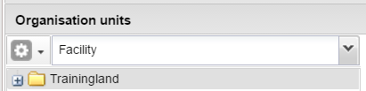

- Click on "Update" to see the map with the organisation unit types
    and malaria RDT positive data displayed.

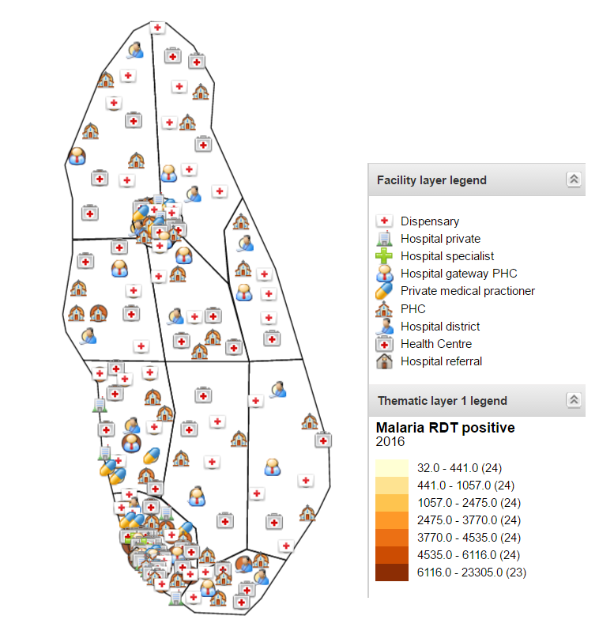

### Video - GIS Demo - Part 6 of 8 (7 min)

In this video, you will learn how to add multiple thematic layers to
your map. Multiple thematic layers allow you to make comparisons of
different data within the same map. This is particularly useful when you
are trying to make correlations between various services you are
measuring.

[https://www.youtube.com/watch?v=wd7f8kM-jJo](https://www.google.com/url?q=https://www.youtube.com/watch?v%3Dwd7f8kM-jJo&sa=D&ust=1605599915783000&usg=AOvVaw0NQxs4aXfct-2Nj8mshI1f)

#### Activity 6 - Adding multiple thematic layers

To the map you have created in  [TRAININGLAND](https://www.google.com/url?q=https://live.academy.dhis2.org/tl1/dhis-web-commons/security/login.action&sa=D&ust=1605599915784000&usg=AOvVaw2JQOGksM01EtTFlCJ4PiWg), please add in a 2nd thematic layer and save the map as a favorite.

- Start by selecting Thematic layer 2 -> Edit layer.

- Define the data and period selection for Thematic layer 2. Select
    the following:

- Value type: Data Element
- Data element group: Malaria
- Data element: Malaria RDT performed
- Period Type: Yearly
- Period: 2016

In the organisation units tab:

- Select "District" as the organisation unit level.

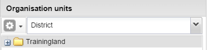

In the options tab:

- Ensure that your classes/method is similar to what you have defined
    for thematic layer 1. Using our current example, thematic layer 1
    used 7 classes as well as equal counts as the method. We should
    therefore select the same options in thematic layer 2.

- Click on "Update" to see the map displayed with the 2 related
    layers.

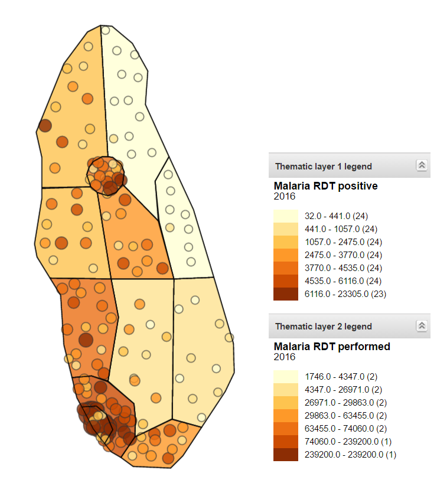

To save the map as a favorite:

- Select Favorites -> Add new. A text box will appear in which you
    can provide the favorite with a name and save the favorite.

- Save the table as a favorite using: username_health program
    name_what, what, when.

Note that in a real life setting, there may be no need to use your
username when saving your favorites. In this course this is used however
to identify the favorites that you have created.

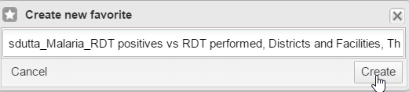

### Video - GIS Demo - Part 7 of 8 (6 min)

What is a predefined legend? This is a concept you already know from the
pivot table sessions. Let’s see how it applies to the maps.

[https://www.youtube.com/watch?v=0KuXV75IyfQ](https://www.google.com/url?q=https://www.youtube.com/watch?v%3D0KuXV75IyfQ&sa=D&ust=1605599915786000&usg=AOvVaw2kNnf75ZHoFXD4bSSMMnHl)

#### Activity 7 - Applying a predefined legend

In [TRAININGLAND](https://www.google.com/url?q=https://live.academy.dhis2.org/tl1/dhis-web-commons/security/login.action&sa=D&ust=1605599915787000&usg=AOvVaw16uYknmZnr0uIKNqYuDNhD), please create a map with a predefined legend.

- Clear your previous map by reloading the GIS app.
- Select Thematic layer 1 -> Edit layer.

- Define the data and period selection for Thematic layer 1.  Select
    the following:

- Value type: Indicator
- Indicator group: Immunization
- Indicator: BCG Coverage (%)
- Period Type: Yearly
- Period: 2016

In the organisation units tab:

- Select "District" as the organisation unit level.

In the Options tab:

- Change the Legend type to "Predefined".
- Select "EPI Coverage (70-80-90%)" as the Legend set

- Click on Update to see the map with the predefined legend set
    applied.

### Video - GIS Demo - Part 8 of 8 (3 min)

In the following video, you will find a summary of the most important
concepts we have covered in this series of videos.

[https://www.youtube.com/watch?v=yYIY_um45Cg](https://www.google.com/url?q=https://www.youtube.com/watch?v%3DyYIY_um45Cg&sa=D&ust=1605599915789000&usg=AOvVaw1Pv191YSnwl_wrOqIKfqTA)

## Assignments - GIS (Maps app) (40 min)

### Assignments - GIS (Maps app)

The following are graded assignments and they are worth 8% of your final
grade (each question contributes to 2% of your total)

You are allowed 3 attempts for each of these assignments.

You need to click on the "check" button to submit your answers.

-----

#### Assignment 3.4.1

**Instructions**

- Please use [TRAININGLAND](https://www.google.com/url?q=https://live.academy.dhis2.org/tl1/dhis-web-commons/security/login.action&sa=D&ust=1605599915791000&usg=AOvVaw1_QlNbFtahmeR0nY8YCUPJ) for this assignment.
- For this assignment, answer the questions using the GIS app.

**Details**

- Create a Boundary Layer for the Trainingland Districts.

Question of the assignment 3.4.1

What is the name of the district highlighted in the map?

- Insect District
- Dog District
- Cat District
- Bird District

EXPLANATION

Insect District is the highlighted district

#### Assignment 3.4.2

**Instructions**

- Please use [TRAININGLAND](https://www.google.com/url?q=https://live.academy.dhis2.org/tl1/dhis-web-commons/security/login.action&sa=D&ust=1605599915792000&usg=AOvVaw18kASWH26DY8feYSzmaC1P) for this assignment.
- For this assignment, answer the questions using the GIS app.

**Details**

- Create a thematic layer 1 - # of HIV tests performed by facility,
    2016:

- Data Element Group: HIV
- Data Element: HIV Tests Performed
- Period: 2016
- Organisation Units: Facilities

Question of the assignment 3.4.2

Which facility has the highest number of HIV tests performed?

EXPLANATION

Crocodile Hospital Gateway PHC performed the highest number of HIV tests

#### Assignment 3.4.3

**Instructions**

- Please use [TRAININGLAND](https://www.google.com/url?q=https://live.academy.dhis2.org/tl1/dhis-web-commons/security/login.action&sa=D&ust=1605599915794000&usg=AOvVaw0r9VajU-0KfIrzGlnjIh2E) for this assignment.
- For this assignment, answer the questions using the GIS app.

**Details**

1. Add in a 2nd Thematic Layer - HIV test positivity rate
2. Create a thematic layer 1 - # of HIV tests performed by facility,
    2016:

- Indicator Group: HIV
- Data Element: HIV Test Positivity Rate
- Period: 2016
- Organisation Units: Districts

3. Save the maps  as a favorite using the same naming convention as
    before: username_program_what, where, when.

Question of the assignment 3.4.3

Which district has the lowest HIV test positivity rate? (Hint: You may
want to turn off the boundary layer)

EXPLANATION

Dessert District has the lowest HIV test positivity rate

#### Assignment 3.4.4

**Instructions**

- Please use [TRAININGLAND](https://www.google.com/url?q=https://live.academy.dhis2.org/tl1/dhis-web-commons/security/login.action&sa=D&ust=1605599915796000&usg=AOvVaw2W5EuLQ4gIDddbSrd0itXm) for this assignment.
- For this assignment, answer the questions using the GIS app.

**Details**

1. Apply a custom legend set to a map with:

- Value Type: Data Element

- Data Set: Population
- Period Type: Yearly
- Period: 2016
- Organisation Units: Districts
- Legend Type: Predefined
- Legend Set: Population

2. Save the maps as a favorite using the same naming convention as
    before: username_program_what, where, when.

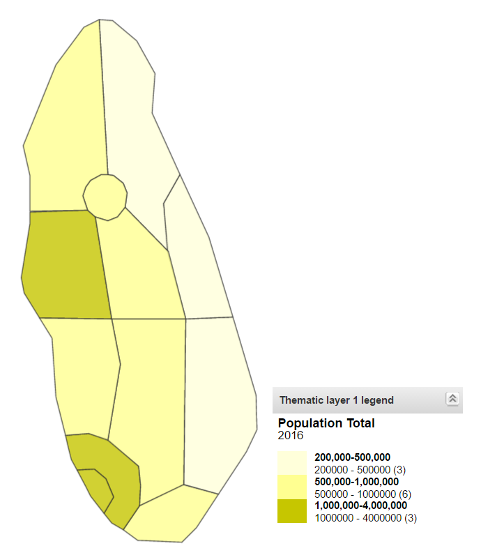

Question of the assignment 3.4.4

Which District(s) have populations between 200,000 - 500,000 for this
period? (select one or more)

- Dessert District
- Sweet District.
- Insect District
- Game District

EXPLANATION

Dessert, Sweet and Insect Districts have populations between 200,000 -
500,000 for this period

## Session Quiz - GIS (Maps app) (10 min)

### Session Quiz - GIS

This is a **graded quiz** and it is worth **5%** of your final grade.

You have **3 attempts** to pass this test.

Select the "check" button to submit your answers.

If you want to save your current response without submitting it for
grading yet, select the "save" button. This allows you to come back
later and resume the attempt.

1. In the GIS boundary layer you can: (select one)

- Analyze data by indicators
- Analyze data by data elements
- **Display organisation unit boundaries**
- All of the above

EXPLANATION

In the GIS boundary layer, you can only display organisation unit
boundaries such as regions or districts.

2. In one thematic layer you can create maps with: (select one)

- Multiple periods
- Multiple data elements
- Multiple reporting rates
- **None of the above**

EXPLANATION

In one GIS layer, you can only have a single period, data element or
reporting rate represented.

3. In a GIS map, multiple layers can be added to represent different
    features or items for analysis.

- **True**
- False

EXPLANATION

Multiple layers representing different items can be added to maps using
the GIS application.

## 3.5 - Integrated Analysis, Dashboards, Messaging and Sharing (60 min)

### Video - Integrated Analysis, ... Demo - Part 1 of 5 (7 min)

Now that we have reviewed each of the core analysis apps individually,
we can discuss how they can work together in order to produce the most
appropriate visual output to display your data.

In this series of videos, you will learn how to quickly move between
each of the analysis tools by taking any of your produced outputs and
modifying them into a chart, map or pivot table on demand. You will also
review how to create a dashboard where you can put together the
different visualizations you have created from  pivot tables, data
visualizer and GIS (Maps). Lastly, you will also learn how to share your
dashboard with other DHIS2 users.

[https://www.youtube.com/watch?v=XkTS_5wUXb4](https://www.google.com/url?q=https://www.youtube.com/watch?v%3DXkTS_5wUXb4&sa=D&ust=1605599915801000&usg=AOvVaw1JJUVRTa0ndBaG6VKaM1kN)

#### Activity 1 - Moving between analysis apps within DHIS2

Start by creating a simple pivot table in [TRAININGLAND](https://www.google.com/url?q=https://live.academy.dhis2.org/tl1/dhis-web-commons/security/login.action&sa=D&ust=1605599915801000&usg=AOvVaw0yhQ2FV9O6eK4Wc1_srs2c):

- In the data tab select:

- "Data Elements" as the data type.
- "ANC" as the Data Element Group.
- "ANC 1st visit" as the Data Elements.

- In the period tab:

- Select "Last year" as the period. The last year that is displayed
    will be different than what is shown in the video.

- In the organisation units tab:

- Select "District" as the organisation unit level.

- Open the layout tab and:

- Move the organisation units down to the Row.
- Move the periods up to the filter.

- Open the table options and de-select "Show row totals".

- Click on "Update" to see the pivot table.

- To open the table as a map select Map -> Open this table as map.

- The map with legend will appear in the GIS app.

- To open this map as chart, select Chart -> Open this map as chart.

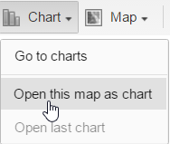

The chart will open in the Data Visualizer app.

### Video - Integrated Analysis, ... Demo - Part 2 of 5 (7 min)

In this video, you will learn how to add interpretations of the data to
your visualizations. The different options that are available to share
your saved interpretations with users and user groups will also be
discussed.

[https://www.youtube.com/watch?v=eD17gKEksL0](https://www.google.com/url?q=https://www.youtube.com/watch?v%3DeD17gKEksL0&sa=D&ust=1605599915804000&usg=AOvVaw0uzeI6sPIHydcbii5fh9ak)

#### Activity 2 - Adding and reviewing descriptions

In the Data Visualizer app of [TRAININGLAND](https://www.google.com/url?q=https://live.academy.dhis2.org/tl1/dhis-web-commons/security/login.action&sa=D&ust=1605599915804000&usg=AOvVaw0GrGmrnjDp3f0Q19V5k6iE):

- Open up the previous favorite from your assignments which showed the
    number of maternal deaths by facility in 2016.

- Click on the triple arrows to bring up the **Details** and
    interpretation boxes.

- Add a description to the favorite if you have not already by
    clicking on the "Edit" button next to where it says "No
    description".

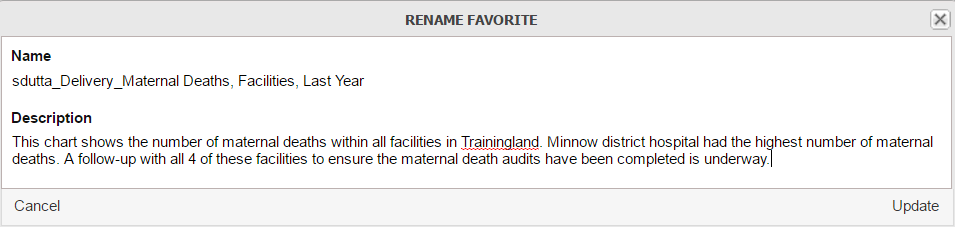

### Video - Integrated Analysis, ... Demo - Part 3 of 5 (10 min)

It’s time to learn how to create a dashboard.

In this video, you will find all the steps you need to bring together
the different outputs you have created before (and saved as favorites)
using the data analysis tools (pivot tables, data visualizer, GIS) into
one dashboard. You will also see how to share your dashboard with other
users or groups of users.

[https://www.youtube.com/watch?v=m_TsUN4JRfE](https://www.google.com/url?q=https://www.youtube.com/watch?v%3Dm_TsUN4JRfE&sa=D&ust=1605599915805000&usg=AOvVaw0YzxJfyz-4Y4U0p4lnU2aw)

#### Activity 3 - Dashboards

Create a dashboard in [TRAININGLAND](https://www.google.com/url?q=https://live.academy.dhis2.org/tl1/dhis-web-commons/security/login.action&sa=D&ust=1605599915806000&usg=AOvVaw18qAO5JpcwqwiaxEks00YU).
In order to add items to a dashboard, you will first have to create a
dashboard.

- Do this by clicking on the "Add" button.

A pop-up will appear in which you can provide the dashboard with a name.

- Click on "Create" when you have finished creating the dashboard.

To add items to the dashboard, use the search box located at the top. To
add an item click on the "Add" button next to the favorite. If you click
on the favorite name, it will take you directly to the favorite within
the app it was created rather than adding it to the dashboard.

- Add the following items to the dashboard (these are all taken from
    your previous exercises on data analysis):

- ANC 1st and 4th (by ANC1) Coverage, Trainingland, Jan 2015 - Dec
    2016 (Chart).
- Outpatient Attendance per 1,000 population, Trainingland, 2016
    (Chart).
- Delivery in Facility, Trainingland Districts, Last 4 Quarters (Pivot
    Table).
- Breastfeeding within 1 hour after delivery, Delivery in Facility and
    Breastfeeding within 1 hour after delivery (%), Trainingland
    Districts, July - December 2016 (Pivot Table).

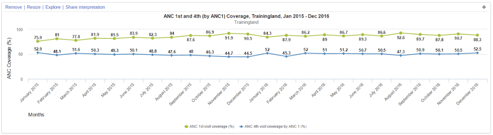

You can move the items around and resize them to your liking in order to
get a feel for how the objects on the dashboard work. This is a very
useful tool for bringing together multiple analysis in a particular
thematic area together in order to be reviewed quickly. It is
particularly useful for program managers to receive at-a-glance
information regarding the programs they are responsible for.

### Video - Integrated Analysis, ... Demo - Part 4 of 5 (10 min)

DHIS2 allows you to communicate with other users or groups of users
using the **message** application.  In the following video, you will see how
it works.

You can also use the **feedback** feature to report anything that is not
working as intended and to follow up on the open tickets.

[https://www.youtube.com/watch?v=LxY-cGgzKgg](https://www.google.com/url?q=https://www.youtube.com/watch?v%3DLxY-cGgzKgg&sa=D&ust=1605599915807000&usg=AOvVaw06H4lB1VPaFaFbuO1_KlrQ)

#### Activity 4 - Messaging and Feedback

Messages

In [TRAININGLAND](https://www.google.com/url?q=https://live.academy.dhis2.org/tl1/dhis-web-commons/security/login.action&sa=D&ust=1605599915808000&usg=AOvVaw3vaDSJDwppFt1mdo-rRWZs), write a message to your fellow participants about how you are finding
the course so far:

- To access the message application select "Messages" from the
    dashboard page.

- From within the messages page, select "Write message".

- Use the "online fundamentals academy participants" user group to
    send the message.

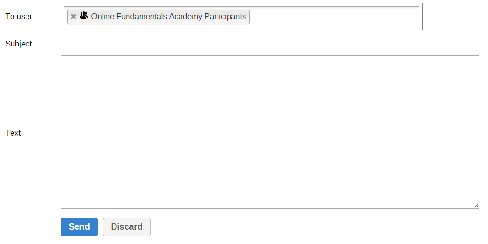

- Write feedback the course admins. Feel free to be critical regarding
    what you think about the course so far.

Feedback

To write feedback, you can:

- Select "Write feedback" from within the messages app.

- Write the feedback and click on "Send" when ready to send the
    feedback.
- 

### Video - Integrated Analysis, ... Demo - Part 5 of 5 (3 min)

In the following video, you will find a summary of the most important
concepts we have covered in this series of videos.

[https://www.youtube.com/watch?v=262g1j6vBZE](https://www.google.com/url?q=https://www.youtube.com/watch?v%3D262g1j6vBZE&sa=D&ust=1605599915809000&usg=AOvVaw1XvEV48aMADZ1qrhODC03U)

### Video - Integrated Analysis, ... - Sharing (5 min)

In this video, you’ll see an overview of the sharing concept discussed
in the previous videos.

[https://www.youtube.com/watch?v=HakjBMS2zvY](https://www.google.com/url?q=https://www.youtube.com/watch?v%3DHakjBMS2zvY&sa=D&ust=1605599915810000&usg=AOvVaw2WA8Y-4m54rHP-jtUAjEqC)

## Session Quiz - Integrated Analysis, Dashboards, Messaging and Sharing (20 min)

### Session Quiz - Integrated Analysis, Dashboards, Messaging and Sharing

This is a **graded quiz** and it is worth **5%** of your final grade.

You have **3 attempts** for this quiz.

Select the "check" button to submit your answers.

If you want to save your current response without submitting it for
grading yet, select the "save" button. This allows you to come back
later and resume the attempt.

1. I have created a pivot table with the following dimensions:

- Data Element Group: Delivery

- Data Element: Births, Live

- Period: Last 4 Quarters

- Organisation Units: Trainingland Districts

In a real-life setting, a username will likely not be used to identify a
favorite.

Which of the following is a good name for the favorite? (select one)

- Live Births
- Deliveries in Trainingland, last 4 Quarters
- Live Births by Trainingland Districts, last 4 Quarters
- **Delivery_Live Births, Districts, last 4 Quarters**

EXPLANATION

The naming convention for favorites should include the program name and
the 3 core dimensions (what you are measuring, where it is coming from
and when it is coming from). This option includes all of these aspects.

2. I want to do some analysis comparing all of the following:

- All Facilities within my organisation unit hierarchy

- The last 12 months worth of data

- A combination of two data elements and one indicator

Which tool(s) should I use to display this information? (select one or
more)

- This type of analysis is not possible in DHIS2
- Data Visualizer
- **Pivot Table**
- GIS

The pivot table application is most suitable when you want to analyze
multiple dimensions of data, including multiple organisation units, time
periods and data types.

3. In DHIS2, I can add additional dimensions (such as Male/Female,
    Public/Private Facilities, etc.) to further break-down my data
    during analysis.

- **True**
- False

EXPLANATION

Data can be broken down into different disaggregations in analysis. This
is shown in both the pivot table and data visualizer demonstrations.

4. If today's date is April 2, 2017 and I select a relative period of
    the last 5 years, which periods will be selected? (select one)

- 2011-2016
- **2012-2016**
- 2013-2017

EXPLANATION

Relative periods work backwards from the current date. In 2017, if we go
back 5 years we have 2012, 2013, 2014, 2015 and 2016.

5. Using the features in DHIS2 I can: (select one or more)

- **Move analysis seamlessly between pivot tables, charts and maps**
- **Add descriptions to favorites to give them more context**
- **Discuss interpretations of the favorites in the system with other
    users**

EXPLANATION

The DHIS2 analysis tools allow you to move between the different
applications, save outputs and add in descriptions and discuss
interpretations directly within DHIS2.

6. Favorites can be shared: (select one or more)

- **Using specific privileges for each item (such as edit/view)**
- **With other users within DHIS2**
- Directly from DHIS2 to social media

EXPLANATION

Sharing of favorites was demonstrated in both the integrated analysis as
well as sharing sessions. This allows us to specify exactly who sees the
outputs we have created.

7. With the DHIS2 dashboards you can: (select one)

- Have multiple dashboards
- Add favorites from analysis app
- Share dashboards with groups of users
- **All of the above**

EXPLANATION

Dashboards contain all the functionality discussed in this question.
This was demonstrated during the dashboard demo.

8. What is the primary role(s) of dashboards? (select one)

- Make data easily accessible
- Make data easily communicable
- Aid in decision making
- Easily view data from multiple angles in one place
- **All of the above**

EXPLANATION

Dashboards are useful in conveying a variety of different information
together. This was demonstrated during the dashboard demo.

9. Sharing in DHIS2: (select one)

- Is used to define which favorites can be seen by whom
- Can be used to share dashboards with other users
- Can be used to share interpretations with other users
- **All of the above**

EXPLANATION

Sharing can be used to customize the different outputs that can be seen
by each user. This was best demonstrated during the sharing session.

10. Sharing is typically controlled by: (select one)

- Selecting specific users in which to share objects
- **Selecting user groups in which to share objects**
- Sending items through messaging within DHIS2
- All of the above

EXPLANATION

Sharing of favorites was demonstrated in both the integrated analysis as
well as sharing sessions. This concept uses user groups to define who
can see which outputs and related information in the system.

11. Messages can be sent within DHIS2 to: (select one or more)

- **Individual users**
- **User Groups**
- **Users belonging to an organisation unit**

EXPLANATION

The messaging feature was presented in the integrated analysis session.
Here, any combination of the displayed answers can be selected in order
to send messages.

12. Using Feedback in DHIS2: (select one)

- **The central team can manage questions, assign them priorities and
    update users on their status**
- Messages can be sent to other users within DHIS2
- Interpretations of different analysis can be shared

EXPLANATION

The feedback feature was presented in the integrated analysis session.
It is particularly useful for managing issues that users encounter with
the DHIS2 system.

## 3.6 - Reports App and Reporting Rates (35 min)

### Video - Reports and Reporting Rates - Part 1 of 4 (9 min)

In this series of videos, you will learn how to use the reports app,
which contains a series of various reports that allow you to review
information about your system in unique formats when compared to the 3
core analysis apps (pivot table, data visualizer, GIS). In the first
video, you will learn about data set reports and resources within the
reports app.

[https://www.youtube.com/watch?v=WyAfzvYpOBk](https://www.google.com/url?q=https://www.youtube.com/watch?v%3DWyAfzvYpOBk&sa=D&ust=1605599915817000&usg=AOvVaw1sjHXfmHA2FB_0h1x7ThSS)

#### Activity 1 - Data Set Reports and Resources

In [TRAININGLAND](https://www.google.com/url?q=https://live.academy.dhis2.org/tl1/dhis-web-commons/security/login.action&sa=D&ust=1605599915818000&usg=AOvVaw2wqQegU3KuFZuclRsSPP9_), please run a data set report. In order to access data set reports:

- Go to Apps -> Reports -> Data Set Report

- Select the criteria for the data set report and click on "Get
    report" when ready. You can use the following as a guide:

- Data Set: Primary Health Care Monthly
- Period Type: Yearly
- Period: 2016
- Organisation Unit: Animal Region (you can try any org unit you like
    here)

- You will see the results for the dataset/period/organisation unit
    combination after you click on "Get report".

As discussed in the video, this gives you a layout of the data set as
you would see it in data entry. You can not edit the data here however,
and this can often serve as an ideal location to review the data in a
format that users are familiar with. The data can be aggregated within
this report, and therefore looked at within different levels of the
hierarchy as required.

- Access the resources by using the left-side sub-menu.

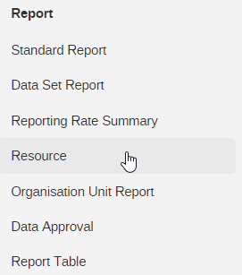

- You can view a resource by left-clicking on the item and selecting
    "View resource".

### Video - Reports App and Reporting Rates - Part 2 of 4 (5 min)

Next, you will learn how to use the **Organisation Unit Report**. You will
also learn how to use the **Reporting Rate Summary**.

[https://www.youtube.com/watch?v=s8k-YDtHUIo](https://www.google.com/url?q=https://www.youtube.com/watch?v%3Ds8k-YDtHUIo&sa=D&ust=1605599915819000&usg=AOvVaw1C8c81-wnGXrhRQfnbck_q)

#### Activity 2 - Organisation Unit Reports & Reporting Rate Summary

Organisation unit reports

Once in [TRAININGLAND](https://www.google.com/url?q=https://live.academy.dhis2.org/tl1/dhis-web-commons/security/login.action&sa=D&ust=1605599915820000&usg=AOvVaw1mRUM8RaL6asmN5CEdrmRJ), you can access the organisation unit reports:

- By either selecting it from the side-menu within the reports app.

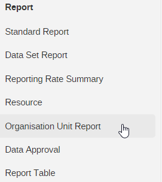

- Or by going to Apps -> Reports -> Organisation Unit Distribution
    Report.

In order to run the report:

- Define the criteria that you want to review first. In this example
    we can use the following:

- Report organisation unit: Food Region
- Group Set: Type

- Select "Get report", in order to run the organisation unit report.

The report will run and break down the facilities by their Type.

Reporting rate summary

Next we can run the reporting rate summary. We can access this:

- By either selecting it from the side-menu within the reports app.

- Or by going to Apps -> Reports -> Reporting Rate Summary.

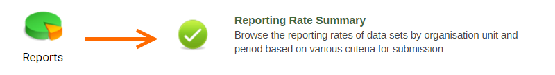

- Select the criteria to run the report. In this example we can use

- Organisation Unit: Food Region
- Data Set: Primary Health Care Monthly
- Period Type: Quarterly
- Period: October- December 2016

- Leave "Based on complete data set registrations" selected. This
    means that the completeness is calculated based on the user
    submitting a completed data set within the data entry app. This will
    be discussed more in later sessions.

- Click on "Get report" in order to run the report and see the
    results.

### Video - Reports and Reporting Rates - Part 3 of 4 (7 min)

In this video, you will learn how to view reporting rates directly in
the pivot tables app. Reporting Rates are readily available within the
reports app, but you can also use the pivot tables app to review
reporting rates in DHIS2. This gives us the advantage of being able to
review multiple levels of organisation unit reporting rates in one
place.
[https://www.youtube.com/watch?v=VMfCMVvlR3Q](https://www.google.com/url?q=https://www.youtube.com/watch?v%3DVMfCMVvlR3Q&sa=D&ust=1605599915822000&usg=AOvVaw1Zp3WZkYpl5kEjFbuIlK_r)

#### Activity 3 - Reporting Rates in Pivot Tables

In [TRAININGLAND](https://www.google.com/url?q=https://live.academy.dhis2.org/tl1/dhis-web-commons/security/login.action&sa=D&ust=1605599915823000&usg=AOvVaw2uEMtX1Y1SngHjCLQPLhfx), view the reporting rates within the pivot tables application. We will
select all of the metrics associated with the "Primary Health Care
Monthly Data Set".

- In the data tab select:

- "Data Sets" as the data type
- Select the various metrics followed by "Primary Health Care Monthly"
    as related to that metric. For example, select the "Reporting Rates"
    metric type followed by the "Primary Health Care Monthly (Reporting
    rates)" metric. Repeat this for all metric types

- Arrange the metrics you’ve selected according to the order you want
    them displayed within the pivot table.

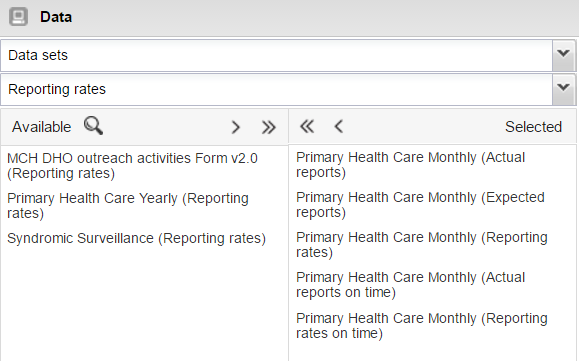

- In the period tab select "Last year" as the period. The last year
    that is displayed will be different than what is shown in the video.

- In the organisation units tab select "Food Region" as the
    organisation unit and "Facility" as the organisation unit level.

- Alter the table layout so that the organisation units are displayed
    (ensure the organisation unit is not in the filter).

You can also open the table options and deselect "Show row totals" in
order to remove a nonsensical total in this case.

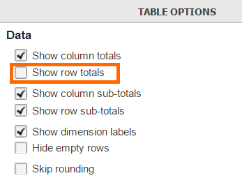

- Click on "Update" in order to see the output. Now you will see a
    much longer list of facilities within DHIS2. This image is only
    showing the top portion of the actual output.

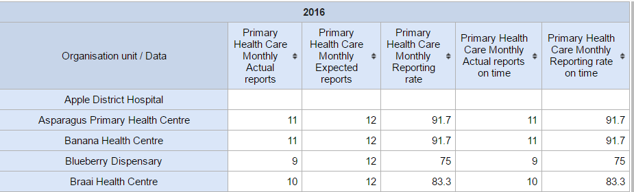

You can view the same metrics in the Data Visualizer App, as you can see
in the Pivot Table app; while the GIS app will allow you to map the
Reporting Rate metric.

### Video - Reports and Reporting Rates - Part 4 of 4 (4 min)

In the following video, you will find a summary of the most important
concepts we have covered in this series of videos.

[https://www.youtube.com/watch?v=_AKIkYI0yZ8](https://www.google.com/url?q=https://www.youtube.com/watch?v%3D_AKIkYI0yZ8&sa=D&ust=1605599915824000&usg=AOvVaw0vLZ6SsFhXqPeKBP7udQIp)

## Session Quiz - Reports App and Reporting Rates (10 min)

### Session Quiz - Reports App and Reporting Rates

This is a **graded quiz** and it is worth **5%** of your final grade.

You have **3 attempts** for this quiz.

Select the "**check**" button to submit your answers.

If you want to save your current response without submitting it for
grading yet, select the "save" button. This allows you to come back
later and resume the attempt.

#### Questions

1. What does the data set report allow you to do? (select one)

- Review data as it would appear in data entry and allow you to
    update/edit the data
- **Review data as it would appear in data entry without allowing you to
    modify it**
- Output the data as a user-defined one-click report

EXPLANATION

Data set reports were highlighted during the reports app demo. It is
always a good idea to review data in the data set report rather than
data entry as you cannot modify data in this report.

2. Resources in DHIS2 can be used to: (select one or more)

- **Upload items such as data collection forms, guidelines or annual
    reports**
- **Add links to useful websites**
- Add additional assets that will increase DHIS2's performance

EXPLANATION

Resources were demonstrated in the reports app demo. Resources can be
useful for uploading external documentation and links to external
resources amongst other things. In this case, resources do not
correspond with additional resources to power the DHIS2 system.

3. Organisation unit distribution reports can be used to: (select one
    or more)

- **Provide a total count of organisation units that appear at certain
    levels within the hierarchy**
- **Display organisation units based on the groups they belong to**
- Show the geographic distribution of organisation units on a map

EXPLANATION

The organisation unit distribution report was demonstrated in the
reports app demo. This allows us to separate our organisation units into
user defined categories/groups as well as see the number of organisation
units at different levels of the hierarchy.

4. In DHIS2, the reporting rate completeness can be checked in: (select
    one or more)

- **The reports app by running the reporting rate summary**
- **Pivot Table, by selecting the Data Set you are interested in**
- **Data Visualizer, by selecting the Data Set you are interested in**

EXPLANATION

Reporting rates can be accessed in various parts of DHIS2. This includes
in the reports app as well as the different analysis apps.

## Feedback - Introduction to DHIS2 Analysis

### Feedback - Introduction to DHIS2 Analysis

Please take 2 or 3 minutes to complete this feedback survey once you are
done with Module 3. Your careful response will have a real impact on how
courses like this are run. Thank you!

embeded survey

-----
