# Module 5 - Introduction to Tracker (3 hr)

## 5.0 Overview of the module (5 min)

### What is in this module

So far, you have seen how DHIS2 can be used for the reporting, analysis
and dissemination of data (module 2); for data analysis using pivot
tables, charts and maps (module 3); and have also seen how DHIS2 can be
customized to meet the needs of a particular country or organization
(module 4).

In Module 5, you will learn how data from real patients are entered into
DHIS2 using two applications: Event capture and Tracker capture.

By watching these demonstrations, you will see how to capture data
excluding personal information, but still collected at the individual
level, by reviewing the Event model in DHIS2. You will also learn how
individual, personal information is collected using the Tracker model in
DHIS2. You will also learn how to analyze this data using the analysis
tools that you are already familiar with. Like in the previous modules,
you will be prompted to perform some exercises using Trainingland
following the steps shown in the videos.

At the end of subsection 5.4 you will find a graded assignment divided
into 3 steps. This graded assignment contributes 4% of your final grade.
After these assignments have been completed, you will find the last
graded quiz of the course which counts towards 5% of your final grade.
This module is therefore responsible for 9% of your overall grade
between the assignment and quiz.

We estimate that you will take about 3 - 4 hours to view all the videos
and complete both ungraded and graded learning activities. This will
vary slightly for each learner but should give you a good indication of
the time required to complete this module.

## 5.1 - Tracker Introduction Presentation

### Video - Tracker Intro Presentation (5 min)

So far, we have been dealing with reviewing the concepts related to the
collection, analysis and dissemination of aggregate data. Source data
and patient level information is often not collected this way however,
and the need for more transactional, individual-based data collection
and analysis mechanisms makes itself readily apparent within a variety
of sectors.

That’s the purpose of DHIS2 Tracker, which is divided into 2 main
models: **Event** and **Tracker**. In this video, we will provide a brief
background on this Tracker concept as well as contrast the Event and
Tracker models as it relates to collecting individual data.

[https://www.youtube.com/watch?v=-3Os3E6EMEU](https://www.google.com/url?q=https://www.youtube.com/watch?v%3D-3Os3E6EMEU&sa=D&ust=1605599915911000&usg=AOvVaw2z9rrDb9f76t-QxuiUBH9d)

## 5.2 - Event Programs

### Video - Introduction to Event Programs and Event Capture (5 min)

Event Programs allow you to collect data about a specific and isolated
event that will later feed aggregated data models into DHIS2.
Information on event programs is collected via the Event Capture app. In
this video, we will discuss event programs and the event capture app,
utilizing real life use cases to demonstrate where event programs can be
practical to use in practice.

[https://www.youtube.com/watch?v=Nqxee03vqTs](https://www.google.com/url?q=https://www.youtube.com/watch?v%3DNqxee03vqTs&sa=D&ust=1605599915912000&usg=AOvVaw0ZuQ7qM6HYDa34aEe660cX)

More information on the SARA survey:
https://www.who.int/healthinfo/systems/sara_indicators_questionnaire/en/

### Video - Event Capture Demo - Part 1 of 4 (10 min)

Now that you understand the purpose of the Event Capture app, let’s see
how it works within DHIS2.

In this video, you will review the **Event Capture interface**, understand
how collected data is displayed within the app and learn how to filter
and edit entered data for specific programs.

[https://www.youtube.com/watch?v=-IojjGyrURU](https://www.google.com/url?q=https://www.youtube.com/watch?v%3D-IojjGyrURU&sa=D&ust=1605599915913000&usg=AOvVaw0nPEw7TRiphvEoiahHKWEy)

#### Activity 1 - Introducing the event capture interface

Please do this activity in [TRAININGLAND](https://www.google.com/url?q=https://live.academy.dhis2.org/tl1/dhis-web-commons/security/login.action&sa=D&ust=1605599915913000&usg=AOvVaw0Rc1biLH0pPDCHYXdiM4jW).

- Familiarize yourself with the event capture interface.
- Navigate to event capture by selecting Apps -> Event Capture.

- Select any of the organisation units at the facility level within
    Trainingland.

- Select Malaria case management as the program. Note that you do not
    select a period; this differs from the aggregate data entry app in
    which a period must be selected before any data appears.

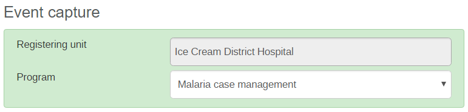

After selecting a program, the related events will appear.

You can try the following functionality to see how it works:

- Print List: Prints the list of events that is displayed on the page
    you are viewing within the event capture app. Click on the "Print
    list" button in order to view the output.

- Download events: This will download the events that are displayed in
    event capture in one of XML, JSON or CSV file formats directly to
    your computer.

- Show/hide columns: This will add additional columns to the event
    capture front page. These columns in event capture represent the
    data elements which are associated with the program you have
    selected. You can access this using the "Show/hide columns" button.

If you left-click on an event, some options will appear. The event will
only have an audit history if it has been changed. You can try to select
some of the options to see the effect they have on the event.

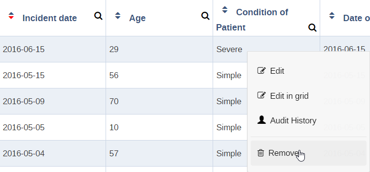

### Video - Event Capture Demo - Part 2 of 4 (10 min)

In this video, you’ll see the step-by-step process required to **register
a new event** in the Event capture app and how **data validation** can be
incorporated when working with this type of data

[https://www.youtube.com/watch?v=THD3a6UJN9A](https://www.google.com/url?q=https://www.youtube.com/watch?v%3DTHD3a6UJN9A&sa=D&ust=1605599915915000&usg=AOvVaw2T3w4b3zx1ZiLALW3tm6rh)

#### Activity 2 - Register a new event

Please do this activity in [TRAININGLAND](https://www.google.com/url?q=https://live.academy.dhis2.org/tl1/dhis-web-commons/security/login.action&sa=D&ust=1605599915916000&usg=AOvVaw22m5VFQF8vvO_tV-wYrsAw).

- Select any of the organisation units at the facility level within
    Trainingland and select the SARA RCH program.

- Left-click "Register event" to create a new event.

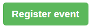

- You will need to select a report date before you begin this process.

You can select any report date of your choosing. This differs from
aggregate data entry, in which you select a predefined period. For
events, any report date can be selected.

After selecting the report date, the questions within the program will
appear. Note that you only see two questions as the remainder are hidden
by the logic associated with the survey (or, in DHIS2 terms, the program
rules).

- Fill in the following data.

Note that program rules should be triggered when you select the
following questions:

- Does this facility offer family planning services?

- Triggers the follow-up questions related to family planning services

- Received any family planning training in the last two years?

- Triggers follow-up asking how many trained

- Received any training in adolescent sexual and reproductive health
    in the last two years?

- Triggers follow-up asking how many trained

- Does this facility stock contraceptive commodities at this service
    site?

- Triggers the follow-up questions related to contraceptive
    commodities

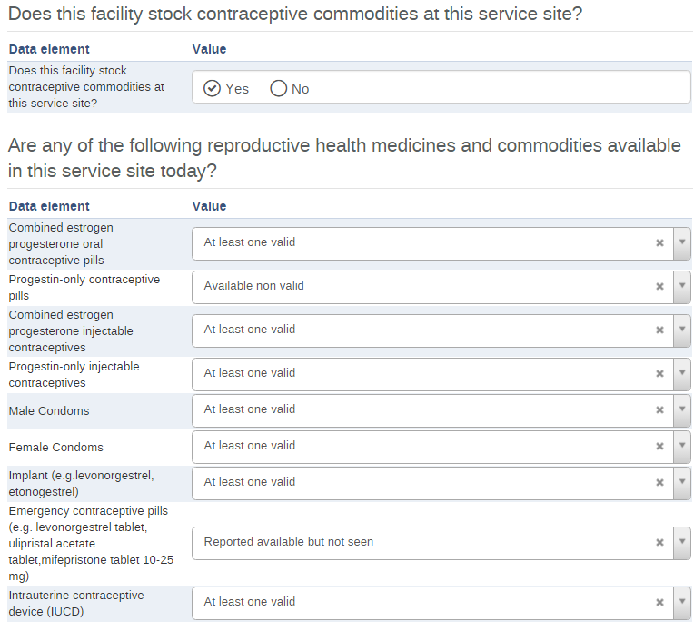

After entering this data you would have seen how some of the program
rules work to display various items within the event capture form. If
you followed along with the exercise and scroll back up to the top, you
will notice some indicators have been calculated and some validation
warnings have appeared along the right side.

- Change the value for "How many staff are in this facility" to 15.

This will remove the validation warnings and the indicators will no
longer be > 100%.

### Video - Event Capture Demo - Part 3 of 4 (5 min)

In this video, you will learn how the offline functionality of the Event
Capture app works. This allows you to enter event data into event
capture without an internet connection and synchronize it when your
connection is restored.

[https://www.youtube.com/watch?v=QPm-ffywlr0](https://www.google.com/url?q=https://www.youtube.com/watch?v%3DQPm-ffywlr0&sa=D&ust=1605599915918000&usg=AOvVaw0nB4cP7dWKl3vDpl7cr0Dn)

#### Activity 3 - Offline entry of events

Please do this activity in [TRAININGLAND](https://www.google.com/url?q=https://live.academy.dhis2.org/tl1/dhis-web-commons/security/login.action&sa=D&ust=1605599915919000&usg=AOvVaw2YAhvQtqBvr_bdeg76wzMv).

- To perform offline data entry, disconnect from the internet.

DHIS2 will prompt you indicating "You are offline, data will be stored
locally".

- Try navigating around and selecting different organisation units at
    the facility level. You can also change between the Malaria case
    management or the SARA RCH program. Note that previous events will
    not be displayed in offline mode.

In the SARA RCH program:

- Register a new event with the following **Details**.
- Click on "Save and go back" when you are finished.

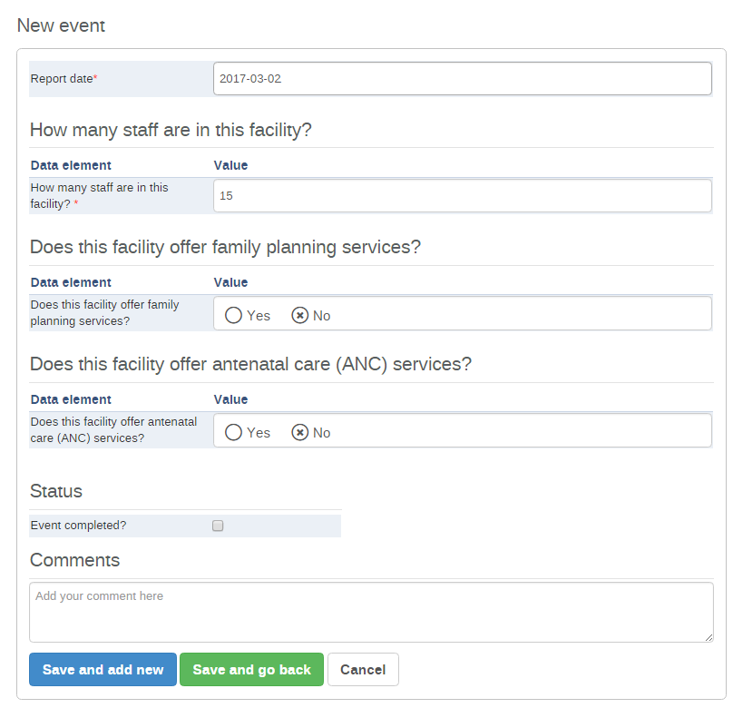

- Re-connect  to the internet. A prompt will indicate that "There is
    data stored locally, please upload to server".
- Click on the Upload button to upload the data.

After the upload is complete, you will receive a prompt indicating that
the "Upload to server was successful".

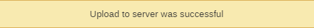

### Video - Event Capture Demo - Part 4 of 4 (3 min)

In this video, we will review all of the key concepts we have discussed
related to the Event Capture app.

[https://www.youtube.com/watch?v=Pi3iS3SsCLg](https://www.google.com/url?q=https://www.youtube.com/watch?v%3DPi3iS3SsCLg&sa=D&ust=1605599915921000&usg=AOvVaw0fB3llw4wC66I1PWMJTuru)

## 5.3 - Tracker Programs

### Video - Tracker Programs - Tracker Programs Presentation (6 min)

In this video, you will be given an overview of Tracker programs in
DHIS2. Tracker programs allow us to collect data that is attached to
identifiable information. This allows this type of model to be used for
the longitudinal tracking of services, commodities or other items based
on the needs of the program performing this tracking.

[https://www.youtube.com/watch?v=IEEfs06GRB0](https://www.google.com/url?q=https://www.youtube.com/watch?v%3DIEEfs06GRB0&sa=D&ust=1605599915922000&usg=AOvVaw2WM0DXUoL5sZNqZBJdEjsh)

### Video - Tracker Capture Demo - Part 1 of 5 (11 min)

In the first video of this series, you will start to get familiar with
the **Tracker Capture app interface**, learn to **filter** cases within a
program and perform simple and complex **searches** for records that already
exist in the system. We will be using an Antenatal Care program example
in order (ANC) to show how this works in DHIS2

[https://www.youtube.com/watch?v=_H0vrs-0ra4](https://www.google.com/url?q=https://www.youtube.com/watch?v%3D_H0vrs-0ra4&sa=D&ust=1605599915922000&usg=AOvVaw0z5Nc-FkpJDOOZESrpVZlP)

#### Activity 1 - Introducing the tracker capture interface

Please do this activity in [TRAININGLAND](https://www.google.com/url?q=https://live.academy.dhis2.org/tl1/dhis-web-commons/security/login.action&sa=D&ust=1605599915923000&usg=AOvVaw3i7wUDpF-1YZTYH90Q1kO0).

- Navigate to tracker capture by selecting Apps -> Tracker Capture

- For this example, select the "Cardinal Hospital Gateway PHC"
    organisation unit.

- Select the ANC (Antenatal care) Example program from the dropdown.

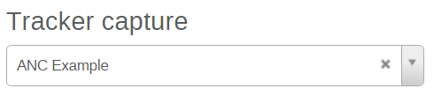

This will display the entities (people in this case) associated with the
program.

- Try the various filters to see how they work. From left to right,
    the filters are the following:

- Only those with an event today: Filters entities who have an event
    scheduled today.
- Any enrollment status: Filters all entities within the program
    regardless of their status.
- Only those with active enrollment: Filters all entities that are
    currently receiving services within the selected program.
- Only those with completed enrollment: Filters those entities
    identified as having completed the set of services offered by the
    selected program.
- Only those with cancelled enrollment: Filters those entities
    identified as having cancelled their enrollment within the selected
    program (they did not receive the complete set of services and
    dropped out of the program).

- Download Tracked Entity List: This will download the tracked
    entities that are displayed in tracker capture in one of XML, JSON
    or CSV file formats directly to your computer. It is similar to
    downloading events in event capture.

- Show/hide columns: This will add additional columns to the tracker
    capture front page. These columns in tracker capture represent the
    attributes that are associated with the program you have selected.
    This differs from event capture where you saw the data elements here
    (event programs do not have attributes associated with them). You
    can access this using the "Show/hide columns" button.

- Change the filter back to "Any enrollment status" and try to search
    for a specific entity. You can try a simple search by typing the
    name “Janella Thomas” in the search box.

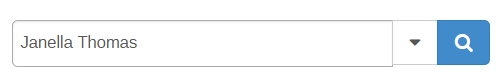

This will return the following entity

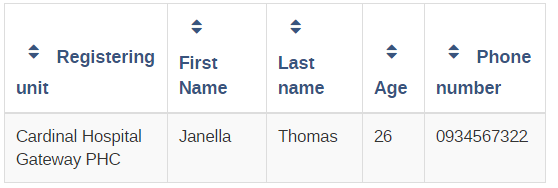

You can try the advanced search as well by clicking on the drop down
arrow next to the search field.

- You can use the following Details to find the person:

- First Name: Sarah
- Last Name: Phi
- Age: 52
- Phone number: 0873637277

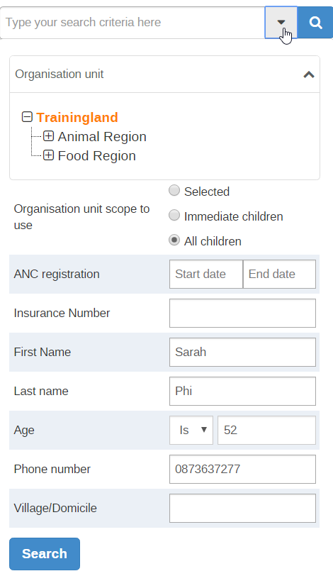

This will return the following entity.

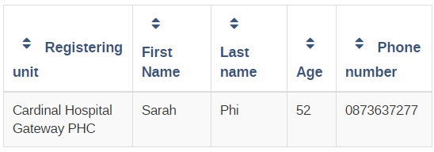

### Video - Tracker Capture Demo - Part 2 of 5 (10 min)

In this video, you will learn **how to register a new entity (we are using**
**person in this example) to a specific health program** using the Tracker
capture app. You will also become familiar with the **Tracker dashboard**.
This dashboard comprises all the data of one individual tracker record.
From the dashboard, you will learn how to enter Tracker data.

In this video, you’ll also see what a “**widget**” is within DHIS2 Tracker.

[https://www.youtube.com/watch?v=-Q-_Nc4XThQ](https://www.google.com/url?q=https://www.youtube.com/watch?v%3D-Q-_Nc4XThQ&sa=D&ust=1605599915926000&usg=AOvVaw3ofRKxHFuj9uBq182D52FC)

#### Activity 2 - Register a new entity, review the dashboard and enter tracker data

Please do this activity in [TRAININGLAND](https://www.google.com/url?q=https://live.academy.dhis2.org/tl1/dhis-web-commons/security/login.action&sa=D&ust=1605599915927000&usg=AOvVaw3wAzNH-1xrzb1XHu5tIRN_).

In the Tracker Capture app:

- Select any organisation unit at the facility level and select the
    ANC Example as the program.

- Select Register to proceed to the registration page.

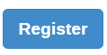

- In the Enrollment Page, we should try and enter unique details. You
    can make up some details of a person in order to fit the attributes
    associated with the program.
- To go through the ANC program, select an ANC registration date that
    is in the past. In the example here, January 1, 2016 has been
    selected. This will allow you go through all the ANC program stages
    within the ANC Example program.

- When you have entered all of the details and changed the ANC
    registration date, click on "Save and continue." This will take you
    to what is referred to as the tracked entity dashboard.

Here have a look around the dashboard. The elements that were identified
in the video demo are all present here. You can add/remove widgets,
review the details of the person you have registered, review the
timeline for data entry and enter data.

- To add/remove widgets click on the gear icon then select show/hide
    widgets.

- You can then select the widgets to add/remove by clicking on the
    check-boxes next to their name. Do not remove the Timeline Data
    Entry widget.

- Enter some data for the first program stage. To start this process,
    scroll down to the Timeline Data Entry widget. The first program
    stage is already selected and the relevant data entry page open.

The following data can be used as a guideline:

- When finished with the data entry, click on the orange "Complete"
    button to complete this event.
- You will receive a prompt asking for your confirmation. Click on the
    "Complete" button to complete the first event.

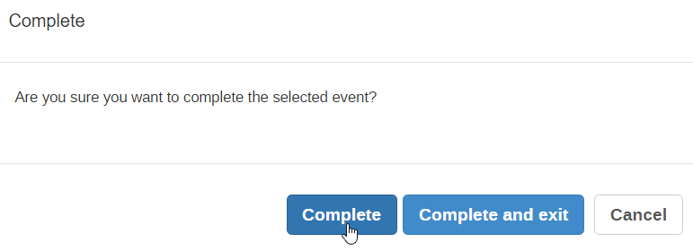

After doing this, the data entry for the first event will close, the
event will change to grey and it will be marked as completed in the data
entry timeline.

### Video - Tracker Capture Demo - Part 3 of 5 (11 min)

In this video,  you will learn how to **add new events** to a Tracker
record, understand the color legend within the data entry widget and
review how to use additional widgets including  the **profile** and
**relationships** widgets.

[https://www.youtube.com/watch?v=SNg61JBzd2A](https://www.google.com/url?q=https://www.youtube.com/watch?v%3DSNg61JBzd2A&sa=D&ust=1605599915929000&usg=AOvVaw3gv0B21vBs455Xm_iSmVsi)

#### Activity 3 - Entering data for new events and completing the program

Please do this activity in [TRAININGLAND](https://www.google.com/url?q=https://live.academy.dhis2.org/tl1/dhis-web-commons/security/login.action&sa=D&ust=1605599915929000&usg=AOvVaw0_Ab2Krjpk5YaAQqTdrz5u).

From the previous activity:

- Select the 2nd event and continue to enter data related to the
    person that you have registered.

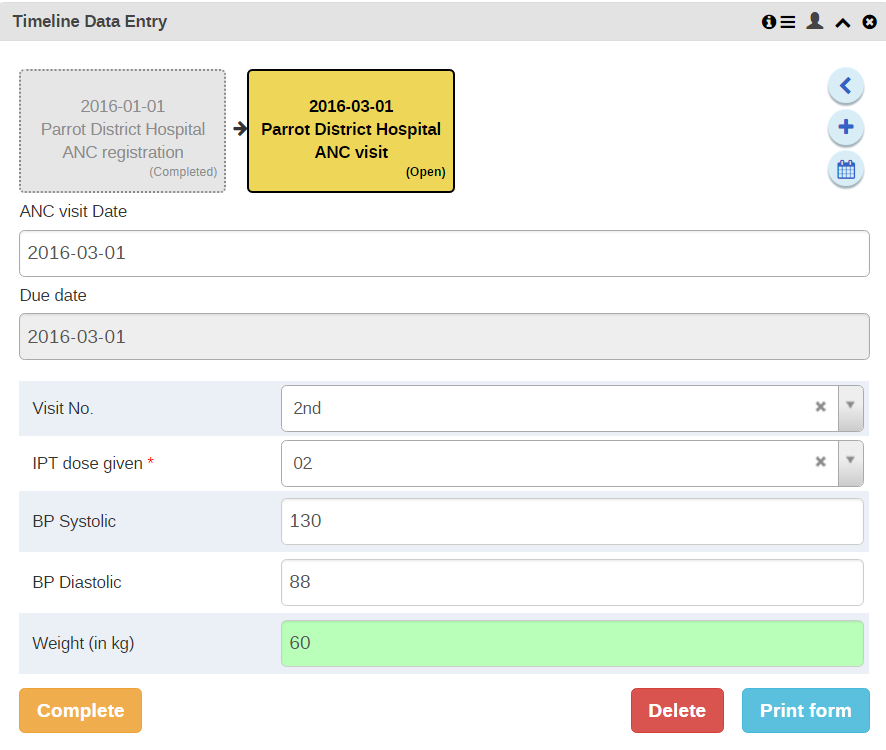

- Complete the event and confirm the event is completed. Now you will
    be asked to schedule a follow-up visit for the mother. By default,
    the next visit is scheduled 60 days from the previous visit. We can
    use the default date here and click on "Save" to schedule the next
    visit.

A new event will appear in the timeline according to the date in which
you have scheduled the event.

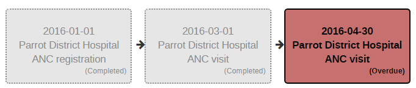

- Scroll back up to the top of the dashboard page and select
    "Complete". This blue complete button will complete the person’s
    enrollment in the entire program. In the context of this program, it
    is stating that the mother has received all of her ANC visits and
    will not receive anymore ANC related to this pregnancy (in reality
    hopefully information on more than 2 visits would have been
    completed).

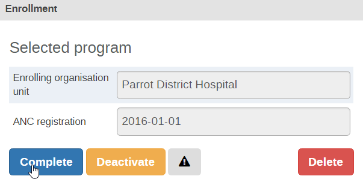

- It will ask you to confirm if you want to complete the selected
    enrollment. Select "Yes" to continue.

The dashboard for the person will close the enrollment. In order to
enter additional Details you will need to Reopen the person’s enrollment
in the program.

If you navigate down to the data entry, you will see you can no longer
edit the events.

- Go back to the tracker capture front page by selecting the "Back"
    button on the tracker dashboard.

- If you select the filter of "Only those who have completed
    enrollment" you will be able to see the person that you have just
    registered.

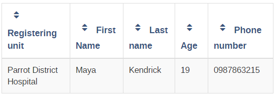

### Video - Tracker Capture Demo - Part 4 of 5 (5 min)

When working with Tracker, we can register entities into the system
without associating them with a particular service. This can be
particularly useful when trying to establish a registry of some kind. In
this video, you will learn how to create new records in Tracker capture
that can be associated with programs as required after the record has
been created.

[https://www.youtube.com/watch?v=2uex7X09Zvc](https://www.google.com/url?q=https://www.youtube.com/watch?v%3D2uex7X09Zvc&sa=D&ust=1605599915932000&usg=AOvVaw1NZfRkh1LcwnsGqLOqDSqI)

#### Activity 4 - Register an entity without a program and enroll them

Please do this activity in [TRAININGLAND](https://www.google.com/url?q=https://live.academy.dhis2.org/tl1/dhis-web-commons/security/login.action&sa=D&ust=1605599915932000&usg=AOvVaw2UN25-nwMPpcvMN9_fLFsV).

From the tracker capture app:

- Select any organisation unit at the facility level. De-select the
    program by clicking on the X button next to the program name.

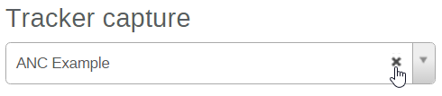

- Click on Register to register the person without a program.

- Enter the Details of the person and select "Save and continue".

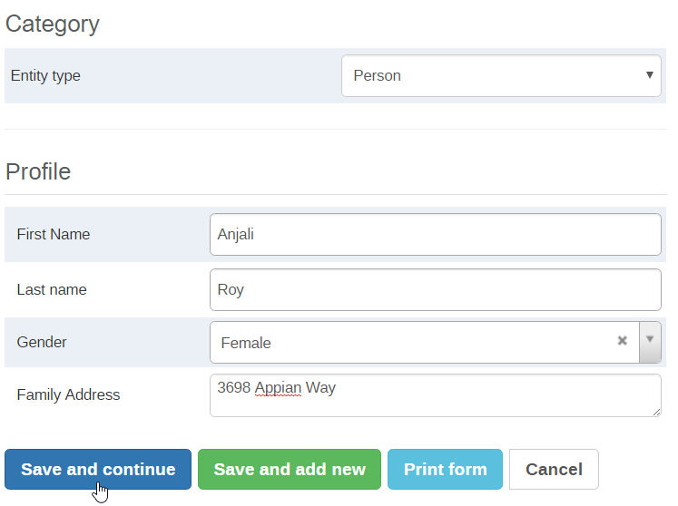

This will take you to the person's dashboard page. You must enroll them
in a program now to proceed.

- Select the ANC Example program.

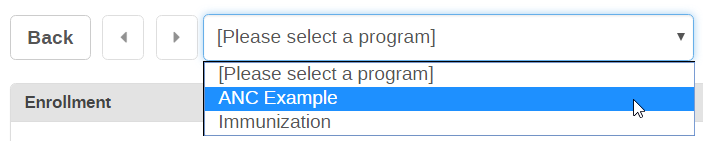

- In the enrollment tab, select "Add new".

- Fill in their enrollment Details and select "Enroll" to enroll them
    in the program.

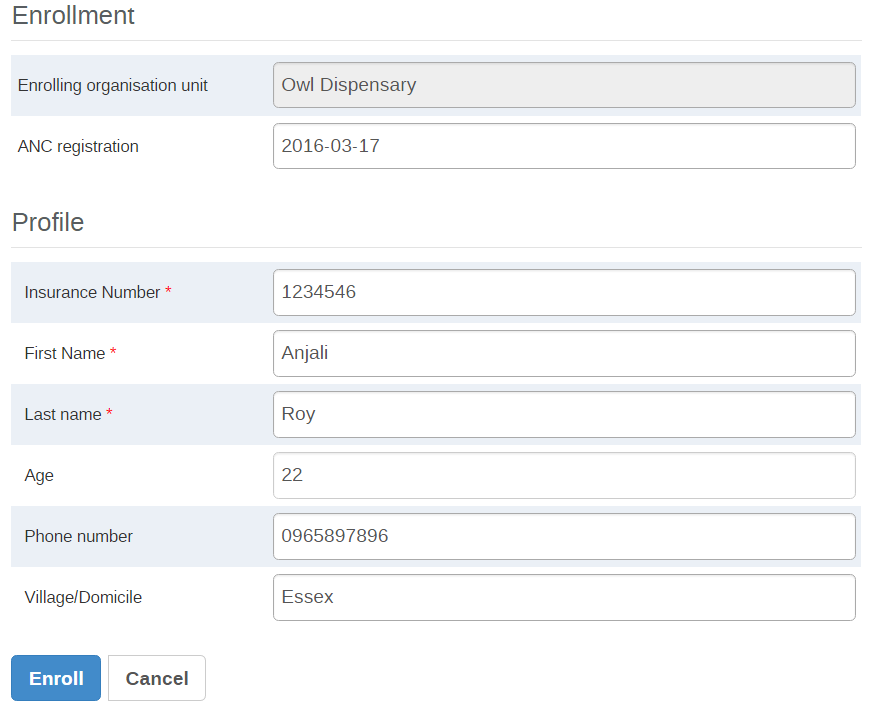

After you Enroll them, the dashboard will start to populate with the
relevant items including their profile and associated program stages.

### Video - Tracker Capture Demo - Part 5 of 5 (5 min)

In this video you’ll see a summary of the key concepts we have discussed
as related to Tracker capture.

[https://www.youtube.com/watch?v=v3fULNNc2bM](https://www.google.com/url?q=https://www.youtube.com/watch?v%3Dv3fULNNc2bM&sa=D&ust=1605599915934000&usg=AOvVaw1x57xtvD3QKgW_Jm_x30aY)

## 5.4 - Event Data Analysis

### Video - Event Data Analysis Demo - Part 1 of 4 (7 min)

You have now had the opportunity to review how individual records are
entered and managed using both the event and tracker capture apps.

In this series of videos, we will review how you can analyze aggregated
outputs generated from this data using the apps you are already very
familiar with, pivot table and data visualizer.

[https://www.youtube.com/watch?v=3VZZK09acN0](https://www.google.com/url?q=https://www.youtube.com/watch?v%3D3VZZK09acN0&sa=D&ust=1605599915934000&usg=AOvVaw0FaszDSLHtBvexQQKPJS6z)

#### Activity 1 - Introducing program indicators

In [TRAININGLAND](https://www.google.com/url?q=https://live.academy.dhis2.org/tl1/dhis-web-commons/security/login.action&sa=D&ust=1605599915935000&usg=AOvVaw2F0xFFZOGuKzAVxedVWet3),
create a pivot table including the program indicators:

- number of facilities offering ANC
- number of facilities offering family planning services

In the data tab select:

- "Program Indicators" as the data type
- "SARA RCH" as the Program
- "# of facilities offering ANC" & "# of facilities offering family
    planning services" as the Program Indicators

In the period tab:

- Select "2016" as the period.

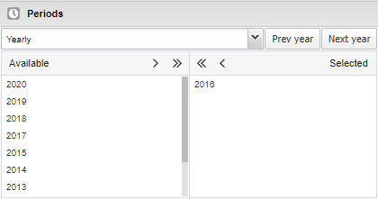

In the organisation units tab:

- Select "District" as the organisation unit level.

- Open the layout tab and:

- Move the organisation units down to the Row.
- Move the periods up to the filter.

- Update to see the table.

Here you will see the output of indicators calculated using the
responses within the SARA survey.

### Video - Event Data Analysis Demo - Part 2 of 4 (5 min)

Following the previous activity, you’ll see how to use **combined**
**indicators** to perform data analysis. These indicators combine data from
the Tracker model with data from the aggregate model and can be very
powerful in practice to utilize.

[https://www.youtube.com/watch?v=LE1yjF0Kyj4](https://www.google.com/url?q=https://www.youtube.com/watch?v%3DLE1yjF0Kyj4&sa=D&ust=1605599915937000&usg=AOvVaw3KL4VAuaIt_PrySmJO4zcR)

#### Activity 2 - Adding combined indicators

In [TRAININGLAND](https://www.google.com/url?q=https://live.academy.dhis2.org/tl1/dhis-web-commons/security/login.action&sa=D&ust=1605599915938000&usg=AOvVaw1DEVJIp6ad3fkE_UL4rNFe),
use the Pivot Table app to review combined indicators.

In the data tab:

- Add the following to your previous selection:

- "Indicators" as the data type.
- "SARA" as the indicator group.
- "Facility offering ANC rate (%)" and "Facility offer Family Planning
    services rate (%)" as the Indicators.

The data tab should now include the selections from Activity 1 as well
as the new indicators you have now selected.

- Open the table options and:

- De-select "Show column totals" and "Show row totals".
- Select "Hide empty rows".

=

- Select "Update" to see the table.

This table includes both the program indicators which were previously
introduced as well as the combined indicators that can combine data from
individual programs with other routine aggregated data.  

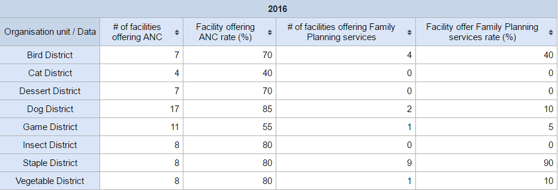

### Video - Event Data Analysis Demo - Part 3 of 4 (5 min)

In this video, you will learn how to analyze data collected via event
and tracker capture within the data visualizer app.

[https://www.youtube.com/watch?v=UBlL8E5rpZ0](https://www.google.com/url?q=https://www.youtube.com/watch?v%3DUBlL8E5rpZ0&sa=D&ust=1605599915939000&usg=AOvVaw06SgT_DYHSY4yYs42eBWa9)

#### Activity 3 - Reviewing program data and aggregated data together

For this activity, use the Data Visualizer app in [TRAININGLAND](https://www.google.com/url?q=https://live.academy.dhis2.org/tl1/dhis-web-commons/security/login.action&sa=D&ust=1605599915940000&usg=AOvVaw0iJSUpC_ncIxRf3cUtTWVd).

In the data tab:

- Select Indicator as the data type.
- First select "SARA" as the Indicator group and "Facility offering
    ANC rate (%)" as the Indicator.
- Then select "ANC" as the Indicator group and "ANC 4th visit coverage
    (%)" as the Indicator.

In the period tab:

- Select "2016" as the period.

In the organisation units tab:

- Select "District" as the organisation unit level.

- Open the layout tab and:

- Move the organisation units down to the Category; the Periods will
    automatically be moved to the filter

- Click on "Update" to see the output.

In this chart, we have a combined indicator (Facility offering ANC rate
(%)) which takes data from the SARA survey and compares it with an
indicator calculated using aggregate data (ANC 4th visit coverage (%)).
It is possible to perform analysis on data collected via aggregate,
event or tracker processes using the concepts of program and combined
indicators within the Pivot Table, Data Visualizer and GIS (Maps) apps.

### Video - Event Data Analysis Demo - Part 4 of 4 (3 min)

In this video you’ll find a summary of the key concepts covered in this
session.

[https://www.youtube.com/watch?v=tJOpAjCAAK8](https://www.google.com/url?q=https://www.youtube.com/watch?v%3DtJOpAjCAAK8&sa=D&ust=1605599915942000&usg=AOvVaw00MF8TFoBNuDE2UhXUSaS3)

## Assignment - Event Data Analysis

### Note: these are graded assignments. (30 min)

You are allowed 3 attempts for each of these assignments.

**Instructions**

You need to be logged in [TRAININGLAND](https://www.google.com/url?q=https://live.academy.dhis2.org/tl1/dhis-web-commons/security/login.action&sa=D&ust=1605599915943000&usg=AOvVaw3WbP9FE1kWnTLeOxfq0qWG) to
perform the following assignments.

Throughout these assignments, you will create a dashboard containing the
following items.

The final dashboard can look something like this:

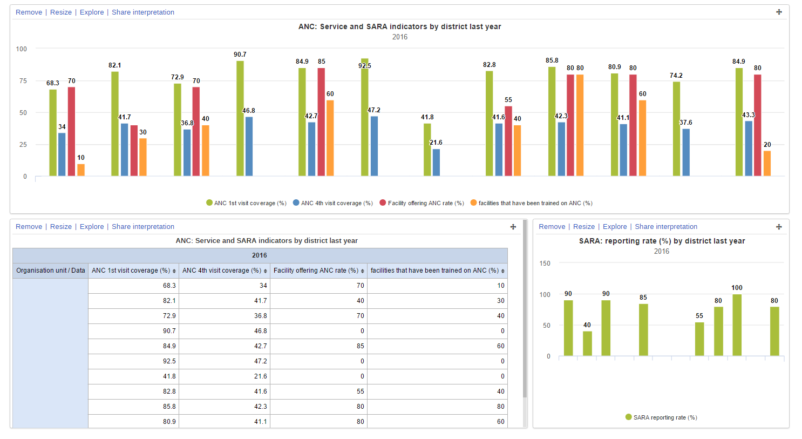

#### Assignment 5.4.1

**Instructions**

In [TRAININGLAND](https://www.google.com/url?q=https://live.academy.dhis2.org/tl1/dhis-web-commons/security/login.action&sa=D&ust=1605599915943000&usg=AOvVaw3WbP9FE1kWnTLeOxfq0qWG) create
a chart comparing ANC 1st visit coverage (%), ANC 4th visit coverage
(%), Facility offering ANC rate (%), Facilities that have been trained
on ANC (%) by district for 2016

- Indicators

- ANC: ANC 1st visit coverage (%), ANC 4th visit coverage (%)
- SARA: Facility offering ANC rate (%), Facilities that have been
    trained on ANC (%)

- Period: 2016
- Organisation Units: Districts

Question of the assignment 5.4.1

What were the districts in which no survey was performed? (the districts
in which both Facility offering ANC rate (%) and Facilities that have
been trained on ANC (%) is 0). Select one or more

- Dessert District
- **Dinner District**
- **Fruit District**
- Staple District

#### Assignment 5.4.2

**Instructions**

In [TRAININGLAND](https://www.google.com/url?q=https://live.academy.dhis2.org/tl1/dhis-web-commons/security/login.action&sa=D&ust=1605599915945000&usg=AOvVaw1hv-lJky_h-31CGIOS28L2) create
a pivot table containing ANC 1st visit coverage (%), ANC 4th visit
coverage (%), Facility offering ANC rate (%), Facilities that have been
trained on ANC (%) by district for 2016.

- Indicators

- ANC: ANC 1st visit coverage (%), ANC 4th visit coverage (%)
- SARA: Facility offering ANC rate (%), Facilities that have been
    trained on ANC (%)

- Period: 2016
- Organisation Units: Districts

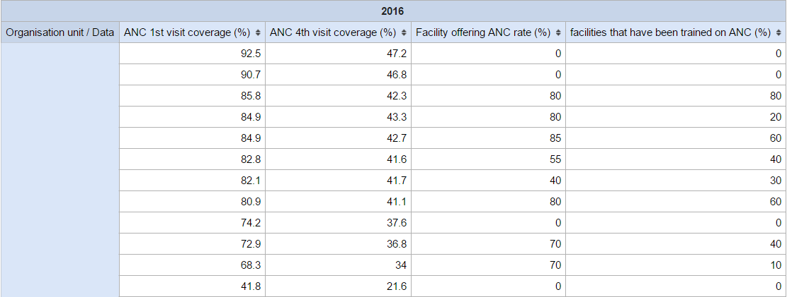

Question of the assignment 5.4.2

Which district has the lowest ANC 1st visit and 4th visit coverage
respectively?

- Cat District
- Bird District
- **Fruit District**
- Fish District

#### Assignment 5.4.3

**Instructions**

In [TRAININGLAND](https://www.google.com/url?q=https://live.academy.dhis2.org/tl1/dhis-web-commons/security/login.action&sa=D&ust=1605599915946000&usg=AOvVaw1I6BSjAf_w9LYIy4ZT8t7z) create
a chart comparing the SARA reporting rate by district for 2016:

- Indicator

- **SARA**: SARA reporting rate (%)

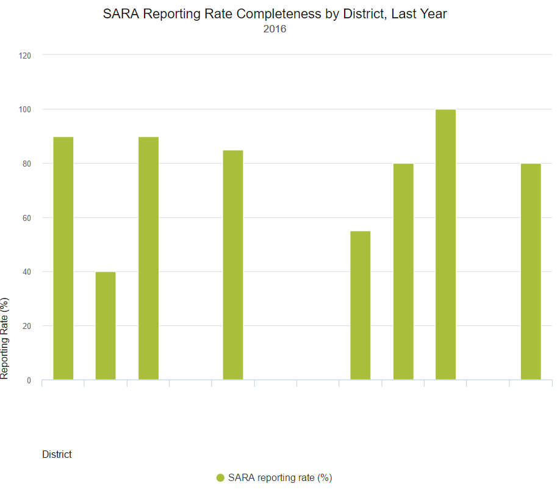

Question of the assignment 5.4.3

Which district was fully surveyed? (100% reporting rate completeness in
2016)

- Dog District
- **Staple District**
- Cat District
- Vegetable District

## Session Quiz - Introduction to Tracker

### Session Quiz - Introduction to Tracker (20 min)

This is a **graded quiz** and it is worth **5%** of your final grade.

You have **3 attempts** to pass this test.

Select the "**check**" button to submit your answers.

If you want to save your current response without submitting it for
grading yet, select the "save" button. This allows you to come back
later and resume the attempt.

#### Session Quiz - Introduction to Tracker

1. Tracker is meant to: (select one)

- Replace existing electronic medical records (EMR)
- **Bridge the gap between the existing aggregated data and individual-level (tracker) or anonymous event based data**
- Only be used for tracking patients receiving health services

EXPLANATION

Tracker programs can be used outside of the health system, and are not
meant to necessarily replace an EMR. This was discussed in the tracker
intro presentation.

2. What is one of the key differences between event and tracker
    programs? (select one)

- **In tracker programs details are registered in order to follow an entity. Event programs do not include this registration**
- In event programs details are registered in order to follow an
    entity. Tracker programs do not include this registration
- Event programs are more a more advanced version of collection
    individual data when compared to tracker programs

EXPLANATION

Tracker programs involve a key component of registration whereas event
programs are anonymous in nature. This was discussed in the tracker
intro presentation.

3. In event capture we can:

- **Add in validation rules/warnings**
- **Add in indicators that calculate on-the-fly**
- **Enter data offline**

EXPLANATION

All of these functions work in event capture. This was demoed during the
event capture session.

4. When we enter data in event/tracker capture, we must choose a
    predefined period such as weekly, monthly, etc. before entering
    data.

- True
- **False**

EXPLANATION

Event and Tracker capture focus on the collection of individual-level
data. If we think about a survey like SARA, or a health service like
Antenatal care, we will have the individual date when a survey is
performed or that a service is provided. Event and Tracker capture allow
you to select an actual date when entering data rather than a predefined
period. This data can be summarized using any predefined period when
creating analysis outputs as required.

5. Which of the following statement(s) regarding tracker are NOT true:
    (select one or more)

- **Tracker and event data cannot be aggregated**
- **Tracker and event data cannot be compared with aggregated data together**
- Tracker and event capture can be audited to see what changes have
    been made to the data

EXPLANATION

Tracker and event data can be aggregated and analyzed in the analysis
apps. They can also be analyzed together with routine aggregate data.
This was shown during the event analysis session.

6. An entity (person, etc.) can only be registered in one tracker
    program at a time

- True
- **False**

EXPLANATION

A person can be registered in multiple tracker programs if required.

7. In tracker capture, we can add in relationships, such as
    mother-child, brother-sister, etc.

- **True**
- False

EXPLANATION

Relationships between various entities can be added using tracker
capture.

8. In event capture, if someone comes back to the clinic with malaria
    more than once I can easily find their record again in DHIS2

- True
- **False**

EXPLANATION

Event programs are isolated events. As there is no registration
component, it would be very difficult to link these events as you would
manually have to find the last time they received treatment.

9. We can analyze combined indicators that use any combination of data
    from event, tracker or routine aggregated data entry

- **True**
- False

EXPLANATION

We can use combined indicators to combine any of the data types used
within DHIS2. This was shown during the event analysis session.

## Feedback - Introduction to Tracker

### Feedback - Introduction to Tracker (3 min)

Please take 2 or 3 minutes to complete this feedback survey once you are
done with the Module 5. Your careful response will have a real impact on
how courses like this are run. Thank you!

-----
